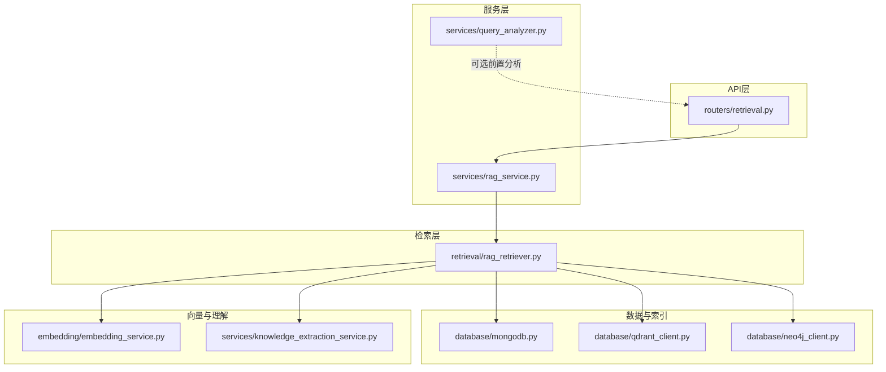
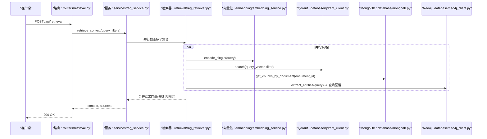
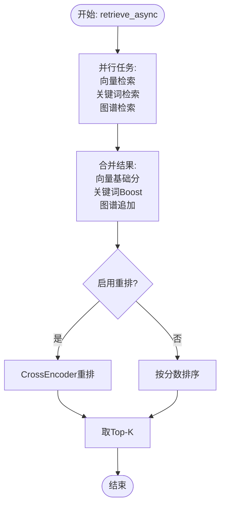
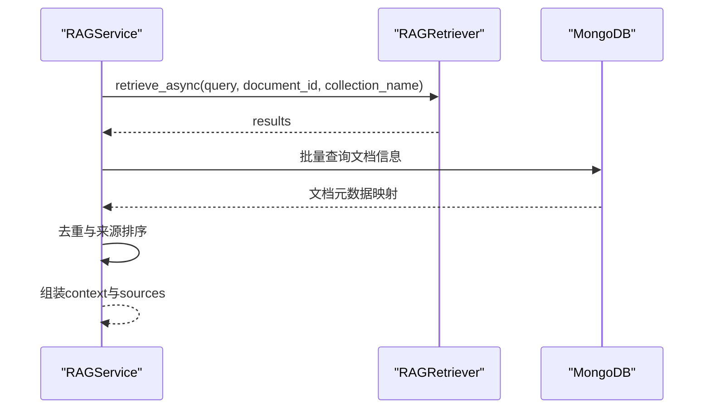
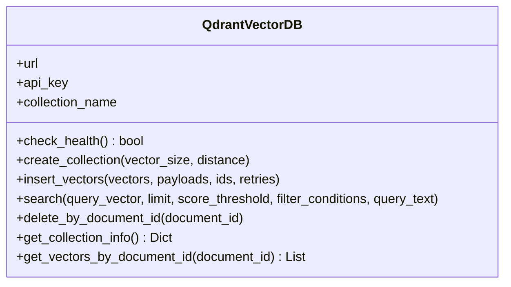
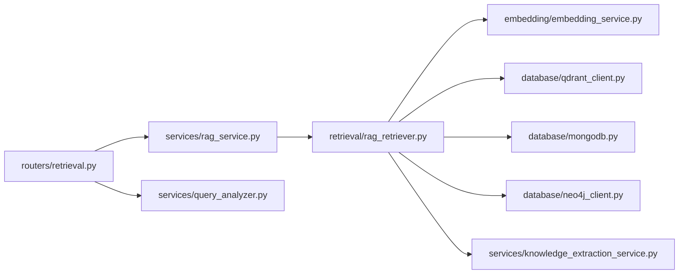

# 检索系统

<cite>
**本文引用的文件**
- [main.py](file://main.py)
- [retrieval/rag_retriever.py](file://retrieval/rag_retriever.py)
- [services/rag_service.py](file://services/rag_service.py)
- [database/qdrant_client.py](file://database/qdrant_client.py)
- [embedding/embedding_service.py](file://embedding/embedding_service.py)
- [routers/retrieval.py](file://routers/retrieval.py)
- [database/mongodb.py](file://database/mongodb.py)
- [services/knowledge_extraction_service.py](file://services/knowledge_extraction_service.py)
- [database/neo4j_client.py](file://database/neo4j_client.py)
- [services/query_analyzer.py](file://services/query_analyzer.py)
- [agents/tools/rag_tool.py](file://agents/tools/rag_tool.py)
- [eval/evaluate.py](file://eval/evaluate.py)
- [README.md](file://README.md)
</cite>

## 目录
1. [简介](#简介)
2. [项目结构](#项目结构)
3. [核心组件](#核心组件)
4. [架构总览](#架构总览)
5. [详细组件分析](#详细组件分析)
6. [依赖关系分析](#依赖关系分析)
7. [性能考量](#性能考量)
8. [故障排查指南](#故障排查指南)
9. [结论](#结论)
10. [附录](#附录)

## 简介
本文件面向检索系统的技术文档，聚焦RAG检索的核心原理与实现架构，涵盖：
- 向量检索、关键词检索、图谱检索与混合策略
- Qdrant向量数据库的集成方式（索引构建、相似度计算、查询优化）
- 检索服务的完整API接口（查询分析、结果排序、重排算法）
- 查询理解服务（将自然语言转换为向量表示）
- 相似度服务（余弦相似度、BM25等算法的应用现状与扩展建议）
- 性能优化策略、缓存机制、并发处理方案
- 实际查询示例与结果分析，对比不同检索策略的效果

## 项目结构
检索系统位于后端服务中，核心模块包括：
- 路由层：对外暴露检索API
- 服务层：封装检索上下文与生成流程
- 检索器：实现混合检索策略
- 数据库层：MongoDB（文档/分块）、Qdrant（向量）、Neo4j（图谱）
- 向量化服务：基于Ollama的嵌入模型
- 查询分析服务：判断是否需要检索上下文

图表来源
- [routers/retrieval.py:1-135](file://routers/retrieval.py#L1-L135)
- [services/rag_service.py:1-248](file://services/rag_service.py#L1-L248)
- [retrieval/rag_retriever.py:1-325](file://retrieval/rag_retriever.py#L1-L325)
- [database/qdrant_client.py:1-544](file://database/qdrant_client.py#L1-L544)
- [database/mongodb.py:1-800](file://database/mongodb.py#L1-L800)
- [database/neo4j_client.py:1-104](file://database/neo4j_client.py#L1-L104)
- [embedding/embedding_service.py:1-278](file://embedding/embedding_service.py#L1-L278)
- [services/knowledge_extraction_service.py:1-211](file://services/knowledge_extraction_service.py#L1-L211)
- [services/query_analyzer.py:1-163](file://services/query_analyzer.py#L1-L163)

章节来源
- [README.md:19-54](file://README.md#L19-L54)
- [main.py:90-98](file://main.py#L90-L98)

## 核心组件
- 检索器（RAGRetriever）：实现混合检索（向量 + 关键词 + 图谱），支持合并与重排
- 检索服务（RAGService）：协调多集合检索、上下文构建与来源去重
- Qdrant客户端：封装向量索引、相似度搜索、集合管理与重试机制
- 向量化服务（EmbeddingService）：基于Ollama的嵌入生成
- 知识抽取服务：从文本抽取三元组并写入Neo4j
- 查询分析服务：判断是否需要检索上下文
- 路由层：对外提供检索API与查询分析API

章节来源
- [retrieval/rag_retriever.py:22-325](file://retrieval/rag_retriever.py#L22-L325)
- [services/rag_service.py:7-248](file://services/rag_service.py#L7-L248)
- [database/qdrant_client.py:18-544](file://database/qdrant_client.py#L18-L544)
- [embedding/embedding_service.py:8-278](file://embedding/embedding_service.py#L8-L278)
- [services/knowledge_extraction_service.py:10-211](file://services/knowledge_extraction_service.py#L10-L211)
- [services/query_analyzer.py:9-163](file://services/query_analyzer.py#L9-L163)
- [routers/retrieval.py:14-135](file://routers/retrieval.py#L14-L135)

## 架构总览
检索系统采用“异步并行 + 混合检索 + 可选重排”的设计：
- 路由层接收请求，调用服务层
- 服务层根据知识空间/助手集合并行检索多个集合
- 检索器并行执行向量检索、关键词检索、图谱检索
- 合并结果并进行分数融合与排序
- 可选地使用CrossEncoder进行重排
- 构建上下文与来源信息返回

图表来源
- [routers/retrieval.py:82-135](file://routers/retrieval.py#L82-L135)
- [services/rag_service.py:10-191](file://services/rag_service.py#L10-L191)
- [retrieval/rag_retriever.py:69-101](file://retrieval/rag_retriever.py#L69-L101)
- [embedding/embedding_service.py:261-263](file://embedding/embedding_service.py#L261-L263)
- [database/qdrant_client.py:336-414](file://database/qdrant_client.py#L336-L414)
- [database/mongodb.py:799-800](file://database/mongodb.py#L799-L800)
- [database/neo4j_client.py:40-101](file://database/neo4j_client.py#L40-L101)

## 详细组件分析

### 检索器（RAGRetriever）
- 支持同步与异步检索，异步为主
- 并行策略：向量检索、关键词检索、图谱检索
- 合并策略：以chunk_id为键合并，向量基础分、关键词Boost、图谱追加
- 重排：CrossEncoder（当前被禁用，保留接口）

图表来源
- [retrieval/rag_retriever.py:69-101](file://retrieval/rag_retriever.py#L69-L101)
- [retrieval/rag_retriever.py:262-297](file://retrieval/rag_retriever.py#L262-L297)
- [retrieval/rag_retriever.py:299-323](file://retrieval/rag_retriever.py#L299-L323)

章节来源
- [retrieval/rag_retriever.py:22-325](file://retrieval/rag_retriever.py#L22-L325)

### 检索服务（RAGService）
- 支持多知识空间/助手集合并行检索
- 构建上下文与来源信息，按文档去重并保留最高分chunk
- 支持对话附件场景（file_id + conversation_id）

图表来源
- [services/rag_service.py:10-191](file://services/rag_service.py#L10-L191)
- [database/mongodb.py:462-477](file://database/mongodb.py#L462-L477)

章节来源
- [services/rag_service.py:7-248](file://services/rag_service.py#L7-L248)

### Qdrant向量数据库集成
- 连接与健康检查：优先gRPC，自动重试与本地回退
- 集合管理：自动创建/重建（维度不匹配时）
- 向量插入：重试机制、维度自动适配
- 相似度搜索：query_points + score_threshold + 过滤条件
- 删除与滚动：按document_id删除、滚动获取向量

图表来源
- [database/qdrant_client.py:18-544](file://database/qdrant_client.py#L18-L544)

章节来源
- [database/qdrant_client.py:18-544](file://database/qdrant_client.py#L18-L544)

### 向量化服务（EmbeddingService）
- 基于Ollama的嵌入生成，支持模型名称规范化与自动检测
- 超时与重试策略，文本截断避免Ollama错误
- 维度懒加载与缓存

章节来源
- [embedding/embedding_service.py:8-278](file://embedding/embedding_service.py#L8-L278)

### 知识抽取与图谱检索
- 知识抽取：从文本抽取三元组并写入Neo4j
- 查询理解：从查询中提取实体，用于图谱检索
- 图谱检索：按实体查询一跳邻居，构造上下文文本

章节来源
- [services/knowledge_extraction_service.py:10-211](file://services/knowledge_extraction_service.py#L10-L211)
- [database/neo4j_client.py:6-104](file://database/neo4j_client.py#L6-L104)
- [retrieval/rag_retriever.py:176-260](file://retrieval/rag_retriever.py#L176-L260)

### 查询分析服务
- 使用小模型快速判断是否需要检索
- 失败时回退到关键词匹配策略
- 为路由层提供前置分析能力

章节来源
- [services/query_analyzer.py:9-163](file://services/query_analyzer.py#L9-L163)
- [routers/retrieval.py:44-79](file://routers/retrieval.py#L44-L79)

### API接口定义
- 检索接口：POST /api/retrieval
  - 请求体：query、document_id、top_k、assistant_id、knowledge_space_ids、conversation_id
  - 响应体：context、sources、retrieval_count、recommended_resources
- 查询分析接口：POST /api/retrieval/analyze
  - 请求体：query
  - 响应体：need_retrieval、reason、confidence

章节来源
- [routers/retrieval.py:14-42](file://routers/retrieval.py#L14-L42)
- [routers/retrieval.py:82-135](file://routers/retrieval.py#L82-L135)

## 依赖关系分析
- 路由层依赖服务层
- 服务层依赖检索器与数据库
- 检索器依赖向量化服务、Qdrant、MongoDB、Neo4j
- 知识抽取服务依赖Ollama与Neo4j
- 查询分析服务依赖Ollama

图表来源
- [routers/retrieval.py:1-135](file://routers/retrieval.py#L1-L135)
- [services/rag_service.py:1-248](file://services/rag_service.py#L1-L248)
- [retrieval/rag_retriever.py:1-325](file://retrieval/rag_retriever.py#L1-L325)
- [embedding/embedding_service.py:1-278](file://embedding/embedding_service.py#L1-L278)
- [database/qdrant_client.py:1-544](file://database/qdrant_client.py#L1-L544)
- [database/mongodb.py:1-800](file://database/mongodb.py#L1-L800)
- [database/neo4j_client.py:1-104](file://database/neo4j_client.py#L1-L104)
- [services/knowledge_extraction_service.py:1-211](file://services/knowledge_extraction_service.py#L1-L211)
- [services/query_analyzer.py:1-163](file://services/query_analyzer.py#L1-L163)

## 性能考量
- 并发与异步
  - 检索器并行执行三种检索策略
  - 服务层对多个集合并行检索
  - 路由层使用线程池执行同步分析器
- 连接与超时
  - Qdrant优先gRPC，连接池与超时可配置
  - MongoDB连接池参数可调
  - Ollama嵌入请求超时与指数退避
- 重试与降级
  - Qdrant插入与搜索具备重试与自动集合重建
  - 重排模型可禁用，保证稳定性
- 缓存与预热
  - 项目未显式实现缓存层，可在服务层或网关层引入Redis缓存
- 查询优化
  - 向量检索使用score_threshold过滤低分
  - 关键词检索限定document_id，避免全库扫描
  - 图谱检索限制返回数量，避免结果爆炸

章节来源
- [retrieval/rag_retriever.py:82-89](file://retrieval/rag_retriever.py#L82-L89)
- [services/rag_service.py:64-78](file://services/rag_service.py#L64-L78)
- [database/qdrant_client.py:66-96](file://database/qdrant_client.py#L66-L96)
- [database/mongodb.py:122-136](file://database/mongodb.py#L122-L136)
- [embedding/embedding_service.py:175-228](file://embedding/embedding_service.py#L175-L228)
- [database/qdrant_client.py:278-334](file://database/qdrant_client.py#L278-L334)

## 故障排查指南
- Qdrant连接失败
  - 检查URL与端口，优先使用gRPC
  - 本地HTTP连接会自动回退到127.0.0.1
  - 集合不存在时自动创建
- Ollama嵌入失败
  - 检查模型名称与可用性
  - 超时与连接错误具备重试
- MongoDB连接失败
  - 检查URI与认证参数
  - 连接池参数与超时配置
- 图谱检索无结果
  - 确认Neo4j连接与节点/关系创建
  - 查询实体是否存在于图谱中

章节来源
- [database/qdrant_client.py:97-122](file://database/qdrant_client.py#L97-L122)
- [embedding/embedding_service.py:175-228](file://embedding/embedding_service.py#L175-L228)
- [database/mongodb.py:154-184](file://database/mongodb.py#L154-L184)
- [database/neo4j_client.py:16-38](file://database/neo4j_client.py#L16-L38)

## 结论
本检索系统以“混合检索 + 异步并行 + 可选重排”为核心，结合Qdrant向量索引、MongoDB分块存储与Neo4j图谱，形成多维检索能力。系统在稳定性方面具备重试与降级策略，在性能方面通过gRPC、连接池与并行化提升吞吐。未来可引入缓存层与BM25等传统检索算法以进一步优化召回与排序效果。

## 附录

### API参考
- 检索接口
  - 方法：POST
  - 路径：/api/retrieval
  - 请求体字段：query、document_id、top_k、assistant_id、knowledge_space_ids、conversation_id
  - 响应体字段：context、sources、retrieval_count、recommended_resources
- 查询分析接口
  - 方法：POST
  - 路径：/api/retrieval/analyze
  - 请求体字段：query
  - 响应体字段：need_retrieval、reason、confidence

章节来源
- [routers/retrieval.py:14-42](file://routers/retrieval.py#L14-L42)
- [routers/retrieval.py:82-135](file://routers/retrieval.py#L82-L135)

### 实际查询示例与结果分析
- 示例1：技术问题（需要检索）
  - 查询：某传感器的原理与应用场景
  - 结果：向量检索命中相关chunk，关键词检索补充同文档其他chunk，图谱检索返回实体关系上下文，最终合并排序
- 示例2：一般性对话（无需检索）
  - 查询：你好/谢谢
  - 结果：查询分析判定无需检索，返回空上下文或默认兜底

章节来源
- [services/query_analyzer.py:38-106](file://services/query_analyzer.py#L38-L106)
- [routers/retrieval.py:44-79](file://routers/retrieval.py#L44-L79)

### 相似度服务与算法现状
- 向量相似度：Qdrant使用余弦距离（COSINE），检索时可设置score_threshold过滤
- BM25：当前未实现，可在关键词检索中引入以提升召回质量
- 重排：CrossEncoder（BGE）接口保留，当前禁用以避免崩溃

章节来源
- [database/qdrant_client.py:140-208](file://database/qdrant_client.py#L140-L208)
- [database/qdrant_client.py:336-414](file://database/qdrant_client.py#L336-L414)
- [retrieval/rag_retriever.py:12-20](file://retrieval/rag_retriever.py#L12-L20)

### 评测与基准
- 评测脚本：基于dataset.json逐条评估，检索→生成→LLM-as-a-Judge打分
- 输出：平均分与结果保存至results.json

章节来源
- [eval/evaluate.py:19-127](file://eval/evaluate.py#L19-L127)