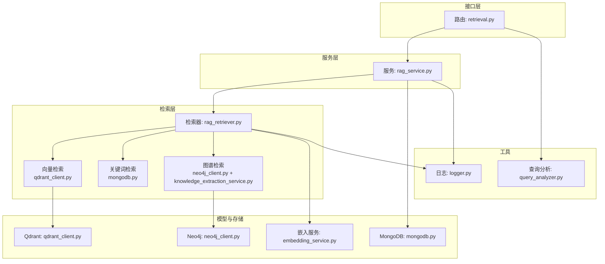
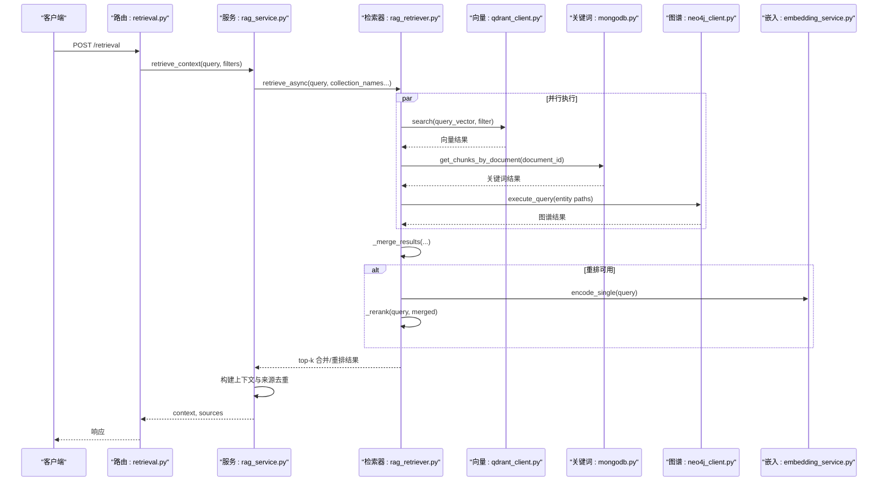
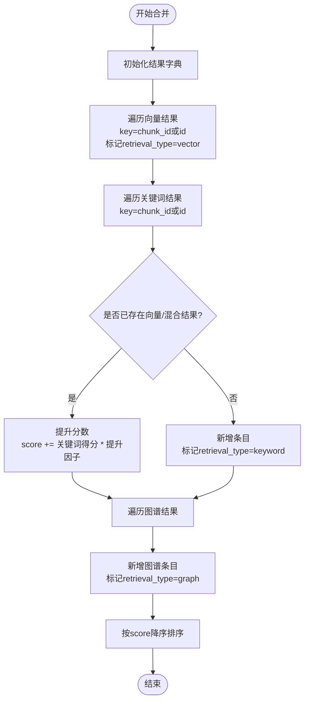
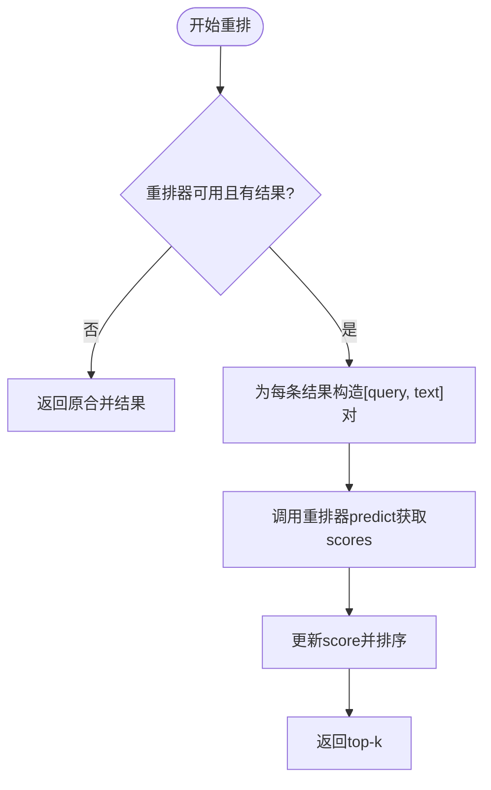
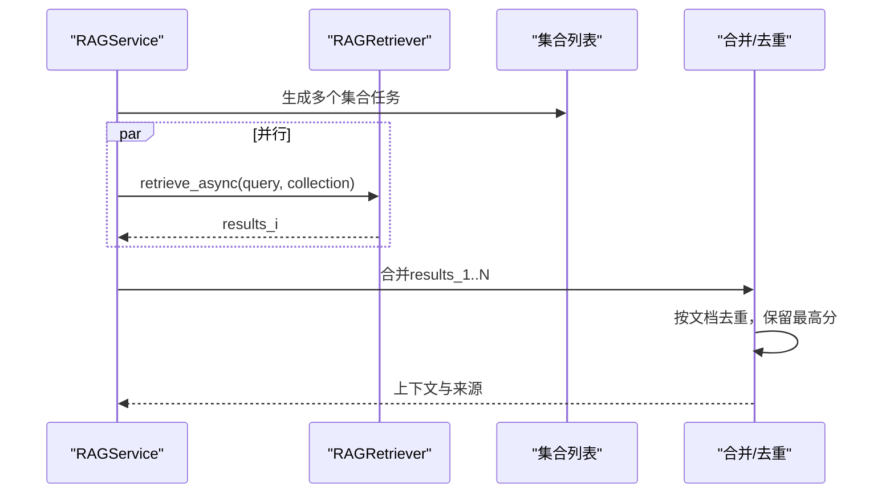
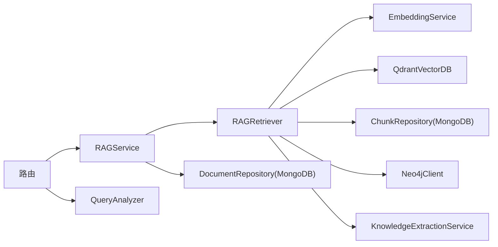

# 结果合并与重排

<cite>
**本文引用的文件**
- [rag_retriever.py](file://retrieval/rag_retriever.py)
- [rag_service.py](file://services/rag_service.py)
- [retrieval.py](file://routers/retrieval.py)
- [qdrant_client.py](file://database/qdrant_client.py)
- [neo4j_client.py](file://database/neo4j_client.py)
- [embedding_service.py](file://embedding/embedding_service.py)
- [knowledge_extraction_service.py](file://services/knowledge_extraction_service.py)
- [mongodb.py](file://database/mongodb.py)
- [logger.py](file://utils/logger.py)
- [query_analyzer.py](file://services/query_analyzer.py)
</cite>

## 目录
1. [简介](#简介)
2. [项目结构](#项目结构)
3. [核心组件](#核心组件)
4. [架构总览](#架构总览)
5. [详细组件分析](#详细组件分析)
6. [依赖分析](#依赖分析)
7. [性能考量](#性能考量)
8. [故障排查指南](#故障排查指南)
9. [结论](#结论)
10. [附录](#附录)

## 简介
本文件聚焦“检索结果合并与重排”模块，系统化解析多策略检索（向量检索、关键词检索、图谱检索）的融合机制与实现细节，涵盖：
- 合并算法：重复项检测、分数融合、权重调整策略
- 重排算法：Cross-Encoder重排模型的使用、相关性评分与排序优化
- 权重分配：向量检索基础分数、关键词检索提升因子、图谱检索优先级
- 性能优化：批处理策略、内存管理、计算资源调度
- 实战示例：不同策略组合的效果对比与最佳实践

## 项目结构
围绕检索与重排的关键文件与职责如下：
- 检索器：负责并行执行三种检索策略、合并结果、可选重排
- 服务层：协调知识空间集合检索、上下文构建与来源去重
- 路由层：对外提供检索接口与查询分析接口
- 数据与模型：向量数据库、图数据库、嵌入服务、知识抽取服务
- 日志与分析：统一日志、查询分析器

图表来源
- [retrieval.py:82-135](file://routers/retrieval.py#L82-L135)
- [rag_service.py:10-248](file://services/rag_service.py#L10-L248)
- [rag_retriever.py:51-101](file://retrieval/rag_retriever.py#L51-L101)
- [qdrant_client.py:336-414](file://database/qdrant_client.py#L336-L414)
- [neo4j_client.py:40-63](file://database/neo4j_client.py#L40-L63)
- [knowledge_extraction_service.py:104-143](file://services/knowledge_extraction_service.py#L104-L143)
- [embedding_service.py:175-264](file://embedding/embedding_service.py#L175-L264)
- [mongodb.py:770-800](file://database/mongodb.py#L770-L800)
- [logger.py:15-88](file://utils/logger.py#L15-L88)
- [query_analyzer.py:38-106](file://services/query_analyzer.py#L38-L106)

章节来源
- [retrieval.py:1-135](file://routers/retrieval.py#L1-L135)
- [rag_service.py:1-248](file://services/rag_service.py#L1-L248)
- [rag_retriever.py:1-325](file://retrieval/rag_retriever.py#L1-L325)
- [qdrant_client.py:1-544](file://database/qdrant_client.py#L1-L544)
- [neo4j_client.py:1-104](file://database/neo4j_client.py#L1-L104)
- [knowledge_extraction_service.py:1-211](file://services/knowledge_extraction_service.py#L1-L211)
- [embedding_service.py:1-278](file://embedding/embedding_service.py#L1-L278)
- [mongodb.py:770-800](file://database/mongodb.py#L770-L800)
- [logger.py:1-88](file://utils/logger.py#L1-L88)
- [query_analyzer.py:1-163](file://services/query_analyzer.py#L1-L163)

## 核心组件
- 检索器（RAGRetriever）
  - 并行执行向量检索、关键词检索、图谱检索
  - 合并策略：向量结果为基础，关键词结果按命中提升分数，图谱结果作为新增条目
  - 可选重排：使用Cross-Encoder对合并结果进行二次打分与排序
- 服务（RAGService）
  - 支持多知识空间集合并行检索
  - 构建上下文与来源信息，按文档维度去重并保留最高分块
- 路由（retrieval.py）
  - 对外提供检索接口与查询分析接口
- 数据与模型
  - 向量：Qdrant客户端封装，支持gRPC连接与健康检查
  - 图谱：Neo4j客户端封装，Cypher查询与实体/关系创建
  - 嵌入：Ollama嵌入服务，支持模型检测与重试
  - 关键词：MongoDB分块仓库，按文档ID检索分块并计算关键词命中率

章节来源
- [rag_retriever.py:22-101](file://retrieval/rag_retriever.py#L22-L101)
- [rag_service.py:10-191](file://services/rag_service.py#L10-L191)
- [retrieval.py:82-135](file://routers/retrieval.py#L82-L135)
- [qdrant_client.py:336-414](file://database/qdrant_client.py#L336-L414)
- [neo4j_client.py:40-63](file://database/neo4j_client.py#L40-L63)
- [embedding_service.py:175-264](file://embedding/embedding_service.py#L175-L264)
- [mongodb.py:770-800](file://database/mongodb.py#L770-L800)

## 架构总览
检索流程概览（异步并行）：
1. 路由接收请求，调用服务层
2. 服务层并行检索多个知识空间集合
3. 检索器并行执行三种检索策略
4. 合并结果并可选重排
5. 服务层构建上下文与来源，按文档去重
6. 返回结果给路由

图表来源
- [retrieval.py:82-135](file://routers/retrieval.py#L82-L135)
- [rag_service.py:64-83](file://services/rag_service.py#L64-L83)
- [rag_retriever.py:82-101](file://retrieval/rag_retriever.py#L82-L101)
- [qdrant_client.py:336-414](file://database/qdrant_client.py#L336-L414)
- [mongodb.py:770-800](file://database/mongodb.py#L770-L800)
- [neo4j_client.py:40-63](file://database/neo4j_client.py#L40-L63)
- [embedding_service.py:261-264](file://embedding/embedding_service.py#L261-L264)

## 详细组件分析

### 合并算法与重复项检测
- 向量结果作为基础（向量检索得分即为基础分）
- 关键词结果按命中关键词比例计算得分，若与向量结果命中同一chunk，则在基础分上叠加提升因子
- 图谱结果通常非原始chunk，作为新增条目加入，赋予较高初始分
- 合并后按最终得分降序排序

图表来源
- [rag_retriever.py:262-297](file://retrieval/rag_retriever.py#L262-L297)

章节来源
- [rag_retriever.py:262-297](file://retrieval/rag_retriever.py#L262-L297)

### 重排算法与Cross-Encoder使用
- 重排器当前处于可选启用状态（因环境限制可能禁用）
- 若启用，对合并结果逐条构造“查询-文档文本”对，调用预测函数得到相关性分数
- 更新分数后再次按分数降序排序，返回top-k

图表来源
- [rag_retriever.py:299-324](file://retrieval/rag_retriever.py#L299-L324)

章节来源
- [rag_retriever.py:299-324](file://retrieval/rag_retriever.py#L299-L324)

### 权重分配与策略设计
- 向量检索：基础分数来源于向量相似度，作为合并的基准
- 关键词检索：命中关键词比例作为基础得分，与向量命中同一chunk时叠加提升因子，体现“关键词增强”
- 图谱检索：图谱结果通常作为补充信息新增，赋予较高初始分，突出图谱上下文价值
- 重排阶段：Cross-Encoder对“查询-文本”的相关性进行精细化打分，进一步优化排序

章节来源
- [rag_retriever.py:271-293](file://retrieval/rag_retriever.py#L271-L293)
- [rag_retriever.py:299-324](file://retrieval/rag_retriever.py#L299-L324)

### 多知识空间并行检索与上下文构建
- 服务层支持按知识空间集合并行检索，再合并结果
- 构建上下文时，按文档维度去重，保留最高分块，避免重复来源
- 来源信息包含文档标题、文件类型、状态、检索类型等

图表来源
- [rag_service.py:64-83](file://services/rag_service.py#L64-L83)
- [rag_service.py:133-191](file://services/rag_service.py#L133-L191)

章节来源
- [rag_service.py:64-83](file://services/rag_service.py#L64-L83)
- [rag_service.py:133-191](file://services/rag_service.py#L133-L191)

### 关键词检索实现要点
- 仅在提供document_id时执行关键词匹配，避免全局扫描导致性能问题
- 基于查询词与chunk文本的词集交集计算命中比例，作为关键词得分
- 过滤低阈值命中，保证质量

章节来源
- [rag_retriever.py:140-174](file://retrieval/rag_retriever.py#L140-L174)
- [mongodb.py:770-800](file://database/mongodb.py#L770-L800)

### 图谱检索实现要点
- 使用知识抽取服务从查询中提取实体
- 通过Cypher查询实体一跳邻居，拼接成“头-关系-尾”上下文文本
- 为每个实体生成独立图谱结果条目，携带chunk_id集合与实体列表

章节来源
- [rag_retriever.py:176-260](file://retrieval/rag_retriever.py#L176-L260)
- [knowledge_extraction_service.py:104-143](file://services/knowledge_extraction_service.py#L104-L143)
- [neo4j_client.py:40-63](file://database/neo4j_client.py#L40-L63)

### 向量检索实现要点
- 使用嵌入服务对查询编码为向量
- Qdrant客户端封装支持gRPC连接、健康检查、自动集合创建与维度校验
- 支持按document_id过滤与阈值筛选

章节来源
- [rag_retriever.py:110-139](file://retrieval/rag_retriever.py#L110-L139)
- [embedding_service.py:175-264](file://embedding/embedding_service.py#L175-L264)
- [qdrant_client.py:336-414](file://database/qdrant_client.py#L336-L414)

## 依赖分析
- 组件耦合
  - 检索器依赖嵌入服务、Qdrant客户端、MongoDB分块仓库、Neo4j客户端、知识抽取服务
  - 服务层依赖检索器与MongoDB文档仓库，负责聚合与去重
  - 路由层依赖服务层与查询分析器
- 外部依赖
  - Qdrant（向量检索）、Neo4j（图谱检索）、Ollama（嵌入与知识抽取）、MongoDB（分块与文档元数据）

图表来源
- [rag_retriever.py:1-50](file://retrieval/rag_retriever.py#L1-L50)
- [rag_service.py:1-248](file://services/rag_service.py#L1-L248)
- [retrieval.py:1-135](file://routers/retrieval.py#L1-L135)
- [embedding_service.py:1-278](file://embedding/embedding_service.py#L1-L278)
- [qdrant_client.py:1-544](file://database/qdrant_client.py#L1-L544)
- [neo4j_client.py:1-104](file://database/neo4j_client.py#L1-L104)
- [knowledge_extraction_service.py:1-211](file://services/knowledge_extraction_service.py#L1-L211)
- [mongodb.py:315-478](file://database/mongodb.py#L315-L478)
- [query_analyzer.py:1-163](file://services/query_analyzer.py#L1-L163)

章节来源
- [rag_retriever.py:1-50](file://retrieval/rag_retriever.py#L1-L50)
- [rag_service.py:1-248](file://services/rag_service.py#L1-L248)
- [retrieval.py:1-135](file://routers/retrieval.py#L1-L135)

## 性能考量
- 并行策略
  - 检索器内部对三种检索策略采用asyncio.gather并行执行
  - 服务层对多个知识空间集合并行检索，显著降低端到端延迟
- 计算资源调度
  - 向量检索使用Qdrant的gRPC连接与连接复用，减少HTTP开销
  - 嵌入服务对Ollama请求设置超时与重试，避免单次失败拖累整体
- 内存与批处理
  - 关键词检索仅在指定文档ID时执行，避免全库扫描
  - 合并阶段使用字典去重，时间复杂度近似O(n)
- 可扩展性
  - Qdrant客户端支持自动集合创建与维度校验，便于增量扩容
  - 日志系统采用异步队列写入，避免IO阻塞

章节来源
- [rag_retriever.py:82-90](file://retrieval/rag_retriever.py#L82-L90)
- [rag_service.py:64-83](file://services/rag_service.py#L64-L83)
- [qdrant_client.py:66-96](file://database/qdrant_client.py#L66-L96)
- [embedding_service.py:175-229](file://embedding/embedding_service.py#L175-L229)
- [logger.py:15-88](file://utils/logger.py#L15-L88)

## 故障排查指南
- 重排功能不可用
  - 现象：重排器未加载，检索直接返回合并结果
  - 排查：检查sentence-transformers依赖与环境，确认HAS_RERANKER标志
- 向量检索失败
  - 现象：Qdrant连接异常或集合不存在
  - 排查：确认Qdrant健康检查、gRPC端口、集合维度与向量维度一致
- 图谱检索失败
  - 现象：Neo4j连接失败或Cypher执行异常
  - 排查：确认Neo4j连接参数、驱动可用性与查询语法
- 关键词检索性能差
  - 现象：全局关键词检索耗时长
  - 排查：确保提供document_id，避免全库扫描
- 日志与可观测性
  - 使用统一日志模块，生产环境可降低INFO级别日志输出

章节来源
- [rag_retriever.py:12-21](file://retrieval/rag_retriever.py#L12-L21)
- [qdrant_client.py:124-139](file://database/qdrant_client.py#L124-L139)
- [neo4j_client.py:16-33](file://database/neo4j_client.py#L16-L33)
- [rag_retriever.py:140-149](file://retrieval/rag_retriever.py#L140-L149)
- [logger.py:77-82](file://utils/logger.py#L77-L82)

## 结论
本模块通过“并行检索 + 混合合并 + 可选重排”的架构，实现了多策略检索结果的高效融合与排序优化。向量检索提供基础相关性，关键词检索强化命中语义，图谱检索补充上下文关系，重排进一步提升排序精度。配合并行与异步优化，系统在吞吐与延迟方面具备良好表现。

## 附录

### 实战示例与最佳实践
- 策略组合效果对比
  - 仅向量检索：召回较广但缺乏关键词强化与图谱上下文
  - 向量+关键词：提升关键词相关条目的优先级，适合技术问答场景
  - 向量+关键词+图谱：在上述基础上引入实体关系上下文，适合复杂推理与跨域知识问答
- 权重与阈值建议
  - 向量：top_k适当放大（如2倍），score_threshold按业务调整
  - 关键词：命中比例作为基础分，提升因子建议在0.2~0.5之间
  - 图谱：初始分较高（如0.8），用于引导上下文丰富性
- 重排启用建议
  - 在资源充足且对准确性要求较高时启用重排器
  - 对实时性敏感场景可关闭重排，优先保证吞吐