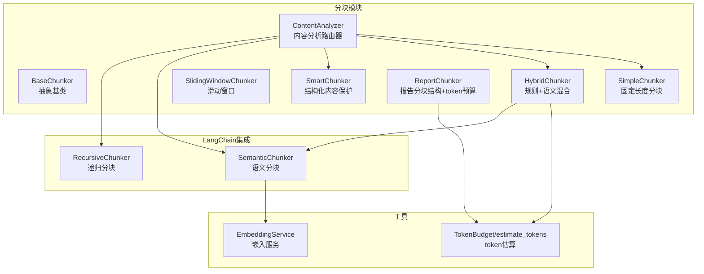
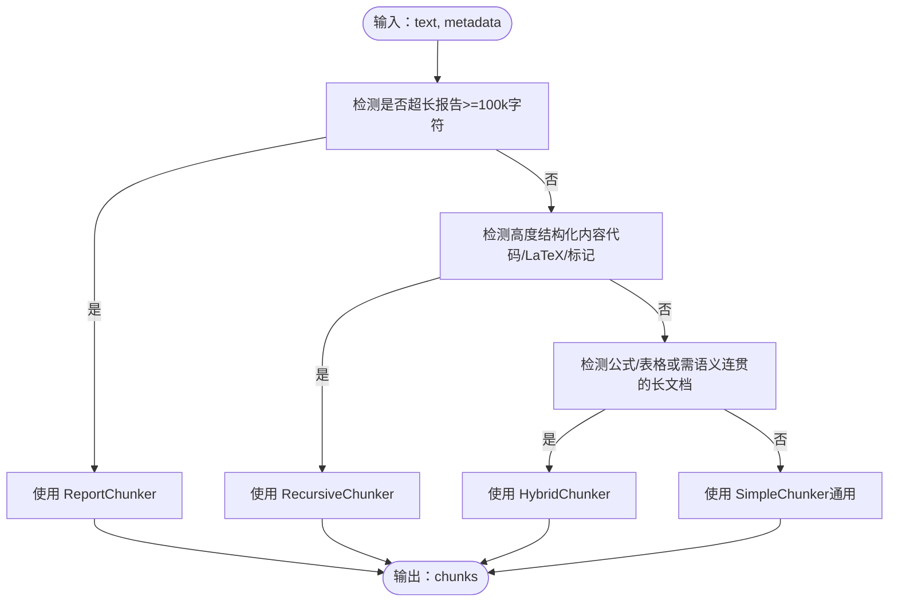
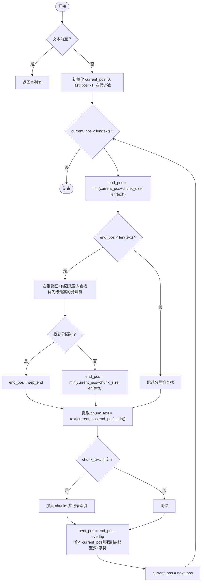
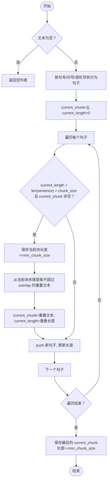
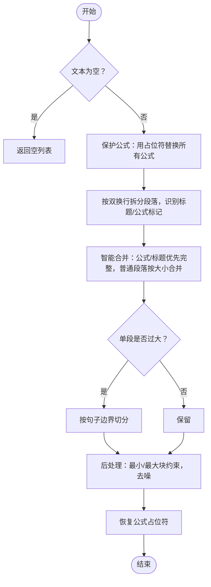
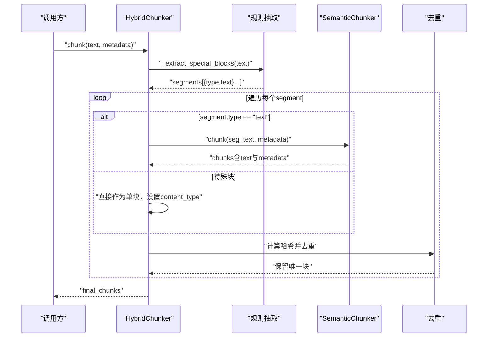
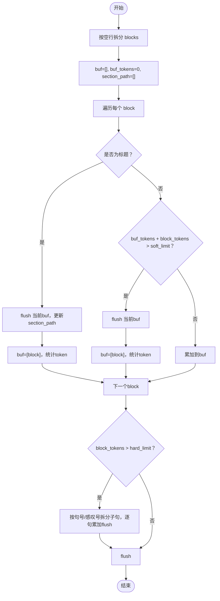
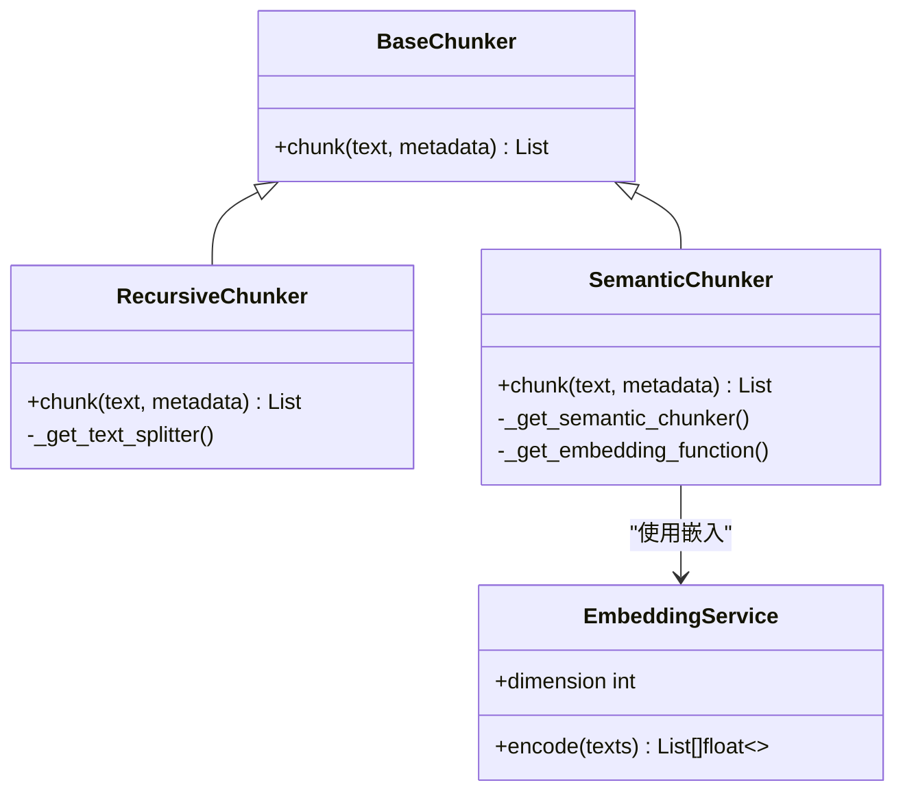
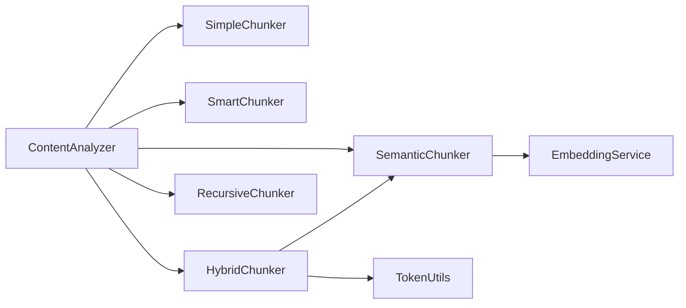

# 文档分块策略

<cite>
**本文引用的文件**
- [chunking/__init__.py](file://chunking/__init__.py)
- [chunking/base.py](file://chunking/base.py)
- [chunking/simple_chunker.py](file://chunking/simple_chunker.py)
- [chunking/sliding_window_chunker.py](file://chunking/sliding_window_chunker.py)
- [chunking/smart_chunker.py](file://chunking/smart_chunker.py)
- [chunking/hybrid_chunker.py](file://chunking/hybrid_chunker.py)
- [chunking/report_chunker.py](file://chunking/report_chunker.py)
- [chunking/langchain/recursive_chunker.py](file://chunking/langchain/recursive_chunker.py)
- [chunking/langchain/semantic_chunker.py](file://chunking/langchain/semantic_chunker.py)
- [chunking/router/content_analyzer.py](file://chunking/router/content_analyzer.py)
- [chunking/router/README.md](file://chunking/router/README.md)
- [chunking/README.md](file://chunking/README.md)
- [utils/token_utils.py](file://utils/token_utils.py)
- [embedding/embedding_service.py](file://embedding/embedding_service.py)
</cite>

## 目录
1. [引言](#引言)
2. [项目结构](#项目结构)
3. [核心组件](#核心组件)
4. [架构总览](#架构总览)
5. [详细组件分析](#详细组件分析)
6. [依赖分析](#依赖分析)
7. [性能考量](#性能考量)
8. [故障排查指南](#故障排查指南)
9. [结论](#结论)
10. [附录](#附录)

## 引言
本文件系统性梳理仓库中的文档分块策略，覆盖从基础分块到智能路由与LangChain集成的完整方案。重点包括：
- 算法实现原理与适用场景：简单分块、滑动窗口分块、智能分块、混合分块、报告分块、LangChain递归分块与语义分块
- 内容分析器工作流：文档类型检测、复杂度评估与最优分块策略选择
- 参数调优方法：最大长度、重叠率、最小长度的配置原则
- 效果评估与性能对比：指标建议与实操建议

## 项目结构
分块模块采用清晰的分层设计：
- 基础分块器：simple、smart、sliding_window
- 路由模块：ContentAnalyzer，依据内容特征自动选择分块器
- LangChain集成：recursive_chunker、semantic_chunker
- 报告分块：report_chunker，面向长文档的结构化与token预算控制
- 工具支撑：token_utils（token估算与预算）、embedding_service（语义分块的嵌入）

图表来源
- [chunking/router/content_analyzer.py:12-299](file://chunking/router/content_analyzer.py#L12-L299)
- [chunking/langchain/recursive_chunker.py:7-110](file://chunking/langchain/recursive_chunker.py#L7-L110)
- [chunking/langchain/semantic_chunker.py:8-139](file://chunking/langchain/semantic_chunker.py#L8-L139)
- [chunking/hybrid_chunker.py:9-179](file://chunking/hybrid_chunker.py#L9-L179)
- [chunking/report_chunker.py:42-143](file://chunking/report_chunker.py#L42-L143)
- [utils/token_utils.py:7-72](file://utils/token_utils.py#L7-L72)
- [embedding/embedding_service.py:8-333](file://embedding/embedding_service.py#L8-L333)

章节来源
- [chunking/README.md:1-89](file://chunking/README.md#L1-L89)

## 核心组件
- 抽象基类 BaseChunker：统一分块接口，定义 chunk(text, metadata) 的标准签名
- SimpleChunker：按固定长度与分隔符优先策略进行分块，适合通用场景
- SlidingWindowChunker：按句子边界滑动聚合，兼顾语义与重叠
- SmartChunker：保护数学公式、标题、段落边界，适合含公式/表格/结构化文本
- HybridChunker：规则抽取特殊块（代码/公式/表格）并用语义分块处理普通文本，去重与细粒度元数据
- ReportChunker：面向长行业报告，维护章节路径与token预算
- ContentAnalyzer：内容分析路由器，按文档特征自动选择最优分块器
- LangChain集成：RecursiveChunker（递归分块）、SemanticChunker（语义分块，依赖嵌入）

章节来源
- [chunking/base.py:6-23](file://chunking/base.py#L6-L23)
- [chunking/simple_chunker.py:7-111](file://chunking/simple_chunker.py#L7-L111)
- [chunking/sliding_window_chunker.py:6-97](file://chunking/sliding_window_chunker.py#L6-L97)
- [chunking/smart_chunker.py:7-408](file://chunking/smart_chunker.py#L7-L408)
- [chunking/hybrid_chunker.py:9-179](file://chunking/hybrid_chunker.py#L9-L179)
- [chunking/report_chunker.py:42-143](file://chunking/report_chunker.py#L42-L143)
- [chunking/router/content_analyzer.py:12-299](file://chunking/router/content_analyzer.py#L12-L299)
- [chunking/langchain/recursive_chunker.py:7-110](file://chunking/langchain/recursive_chunker.py#L7-L110)
- [chunking/langchain/semantic_chunker.py:8-139](file://chunking/langchain/semantic_chunker.py#L8-L139)

## 架构总览
内容分析路由器根据文档内容与元数据特征，动态选择分块器。优先级策略如下：
1) 高度结构化内容（代码、论文）→ 递归分块器
2) 包含公式/表格或需语义连贯的长文档 → 混合分块器（替代语义/智能分块）
3) 其他 → 简单分块器（通用）

图表来源
- [chunking/router/content_analyzer.py:253-299](file://chunking/router/content_analyzer.py#L253-L299)

章节来源
- [chunking/router/content_analyzer.py:81-299](file://chunking/router/content_analyzer.py#L81-L299)
- [chunking/router/README.md:1-137](file://chunking/router/README.md#L1-L137)

## 详细组件分析

### 简单分块（按固定长度分割）
- 实现要点
  - 固定 chunk_size 与 chunk_overlap
  - 优先在分隔符处断开，减少强行切分
  - 防卡住机制与迭代上限，避免极端情况死循环
  - 记录起止索引，便于溯源
- 适用场景
  - 简单文本、短文档、通用兜底
- 参数建议
  - chunk_size：根据下游模型上下文长度设定（如800~1200）
  - chunk_overlap：50~200，平衡召回与冗余
  - separators：按语言与格式选择（中文句号、英文句号+空格、空格等）

图表来源
- [chunking/simple_chunker.py:28-110](file://chunking/simple_chunker.py#L28-L110)

章节来源
- [chunking/simple_chunker.py:7-111](file://chunking/simple_chunker.py#L7-L111)

### 滑动窗口分块（保持上下文连续性）
- 实现要点
  - 按句子边界聚合，超过目标大小则保存当前块
  - 保留重叠部分作为下一块的开头，确保上下文连续
  - 最小块大小过滤，避免过小碎片
- 适用场景
  - 需要语义连贯性的长文档（文章、报告）
- 参数建议
  - chunk_size：根据语义完整性需求设定（如500~1000）
  - chunk_overlap：100~200，保证上下文
  - min_chunk_size：100~200，过滤噪声

图表来源
- [chunking/sliding_window_chunker.py:27-97](file://chunking/sliding_window_chunker.py#L27-L97)

章节来源
- [chunking/sliding_window_chunker.py:6-97](file://chunking/sliding_window_chunker.py#L6-L97)

### 智能分块（基于内容结构分析）
- 实现要点
  - 保护数学公式完整性（LaTeX/行内/块级），用占位符临时替换
  - 识别段落边界、标题、列表/表格结构
  - 标题与公式段落优先保持完整，普通段落按大小合并
  - 大段落按句子边界进一步切分，防止超大块
  - 后处理：最小/最大块大小约束与去噪
- 适用场景
  - 含公式/表格/标题的学术/技术文档
- 参数建议
  - chunk_size：1000，max_chunk_size：2000，overlap：200，min_chunk_size：100

图表来源
- [chunking/smart_chunker.py:67-408](file://chunking/smart_chunker.py#L67-L408)

章节来源
- [chunking/smart_chunker.py:7-408](file://chunking/smart_chunker.py#L7-L408)

### 混合分块（结合规则与语义）
- 实现要点
  - 提取特殊块：代码块、LaTeX公式、表格，保持完整性
  - 普通文本使用语义分块（基于嵌入相似度断点）
  - 去重：对分块文本计算哈希，去除重复
  - 细粒度元数据：content_type（text/code/formula/table）
- 适用场景
  - 结构化与非结构化混合的长文档
- 参数建议
  - chunk_size：1000，overlap：200，semantic_threshold：0.5

图表来源
- [chunking/hybrid_chunker.py:52-122](file://chunking/hybrid_chunker.py#L52-L122)
- [chunking/langchain/semantic_chunker.py:81-139](file://chunking/langchain/semantic_chunker.py#L81-L139)

章节来源
- [chunking/hybrid_chunker.py:9-179](file://chunking/hybrid_chunker.py#L9-L179)
- [chunking/langchain/semantic_chunker.py:8-139](file://chunking/langchain/semantic_chunker.py#L8-L139)

### 报告分块（针对学术论文/行业报告格式）
- 实现要点
  - 按空行拆分块，保留段落/条款边界
  - 维护 section_path（标题层级路径），增强检索定位
  - 基于 token 预算控制块大小：chunk_tokens、overlap_tokens、max_chunk_tokens
  - 单块过大时按句子粗切
- 适用场景
  - 超长行业报告、论文等结构化长文档
- 参数建议
  - TokenBudget：chunk_tokens≈800，overlap_tokens≈120，max_chunk_tokens≈1200

图表来源
- [chunking/report_chunker.py:58-143](file://chunking/report_chunker.py#L58-L143)
- [utils/token_utils.py:7-72](file://utils/token_utils.py#L7-L72)

章节来源
- [chunking/report_chunker.py:42-143](file://chunking/report_chunker.py#L42-L143)
- [utils/token_utils.py:16-72](file://utils/token_utils.py#L16-L72)

### LangChain集成：递归分块与语义分块
- 递归分块（RecursiveChunker）
  - 使用 LangChain 的 RecursiveCharacterTextSplitter，按优先级分隔符递归切分
  - 适配多版本LangChain，兼容旧/新API
- 语义分块（SemanticChunker）
  - 基于嵌入相似度的断点阈值进行分块，保持语义连贯
  - 依赖 EmbeddingService，失败时回退到简单分块
- 适用场景
  - 需要严格结构化分块（代码/论文）或语义连贯性（长文档）

图表来源
- [chunking/base.py:6-23](file://chunking/base.py#L6-L23)
- [chunking/langchain/recursive_chunker.py:7-110](file://chunking/langchain/recursive_chunker.py#L7-L110)
- [chunking/langchain/semantic_chunker.py:8-139](file://chunking/langchain/semantic_chunker.py#L8-L139)
- [embedding/embedding_service.py:8-333](file://embedding/embedding_service.py#L8-L333)

章节来源
- [chunking/langchain/recursive_chunker.py:7-110](file://chunking/langchain/recursive_chunker.py#L7-L110)
- [chunking/langchain/semantic_chunker.py:8-139](file://chunking/langchain/semantic_chunker.py#L8-L139)
- [embedding/embedding_service.py:8-333](file://embedding/embedding_service.py#L8-L333)

## 依赖分析
- 模块耦合
  - 路由器仅依赖各分块器接口，低耦合高内聚
  - 混合分块器依赖语义分块器与token工具，语义分块器依赖嵌入服务
- 外部依赖
  - LangChain相关分块器依赖 langchain(langchain-text-splitters/langchain-experimental)
  - 语义分块器依赖 EmbeddingService（Ollama）
- 潜在环路
  - 无直接循环依赖；语义分块器通过服务抽象间接依赖

图表来源
- [chunking/router/content_analyzer.py:32-79](file://chunking/router/content_analyzer.py#L32-L79)
- [chunking/hybrid_chunker.py:37-41](file://chunking/hybrid_chunker.py#L37-L41)
- [chunking/langchain/semantic_chunker.py:31-46](file://chunking/langchain/semantic_chunker.py#L31-L46)
- [utils/token_utils.py:7-72](file://utils/token_utils.py#L7-L72)
- [embedding/embedding_service.py:8-333](file://embedding/embedding_service.py#L8-L333)

章节来源
- [chunking/router/content_analyzer.py:12-79](file://chunking/router/content_analyzer.py#L12-L79)

## 性能考量
- 时间复杂度
  - 简单/滑动窗口：O(n)，线性扫描
  - 智能分块：涉及正则匹配与多次扫描，约 O(k·n)，k为公式/段落数
  - 混合分块：规则抽取O(n)+语义分块O(n)，并受嵌入服务影响
  - 报告分块：O(n)，token估算近似线性
- 空间复杂度
  - 多数为O(n)，语义分块额外占用嵌入向量空间
- 优化建议
  - 合理设置 chunk_size 与 overlap，避免过度切分
  - 对超长文档优先使用报告分块或混合分块
  - 语义分块器仅用于长文档，短文档走简单分块
  - 使用去重与最小块过滤，减少无效块

## 故障排查指南
- 语义分块器初始化失败
  - 现象：抛出 ImportError 或初始化异常
  - 处理：记录警告并回退到简单分块
- LangChain未安装
  - 现象：ImportError，提示安装 langchain 与 langchain-text-splitters
  - 处理：安装所需包或改用内置分块器
- 嵌入服务异常
  - 现象：Ollama连接/超时/模型不存在
  - 处理：检查环境变量与服务状态，必要时降低文本长度或切换模型
- 分块结果过小/过多
  - 现象：min_chunk_size 过大导致合并失败，或分隔符策略不当
  - 处理：调整 separators、min_chunk_size、chunk_size/overlap

章节来源
- [chunking/langchain/recursive_chunker.py:60-67](file://chunking/langchain/recursive_chunker.py#L60-L67)
- [chunking/langchain/semantic_chunker.py:61-77](file://chunking/langchain/semantic_chunker.py#L61-L77)
- [chunking/langchain/semantic_chunker.py:128-139](file://chunking/langchain/semantic_chunker.py#L128-L139)
- [embedding/embedding_service.py:175-291](file://embedding/embedding_service.py#L175-L291)

## 结论
本分块体系通过“内容驱动”的路由器与多样化的分块策略，实现了从通用到专业的全场景覆盖。推荐实践：
- 优先使用 ContentAnalyzer 自动路由
- 超长报告用 ReportChunker，含公式/表格用 HybridChunker，一般文档用 SimpleChunker
- 语义分块仅用于长文档，注意嵌入成本
- 参数调优遵循“先整体后局部”，以检索效果为目标迭代

## 附录

### 分块参数调优方法
- 最大长度（chunk_size）
  - 简单/滑动窗口：依据下游模型上下文长度与任务需求
  - 智能/混合/报告：更大（如1000~2000），并设置 max_chunk_size 防止单块过大
- 重叠率（chunk_overlap）
  - 滑动窗口：100~200
  - 智能/混合：200 左右，保证上下文连续
- 最小长度（min_chunk_size）
  - 100~200，过滤噪声；最后一块可放宽至50

### 效果评估与性能对比
- 评估指标（建议）
  - 语义一致性：人工评估分块边界是否破坏语义
  - 检索命中率：在下游RAG任务中测试
  - 块大小分布：过小/过大比例
  - 重复块比例：去重前后对比
  - 速度与资源：分块耗时、内存占用
- 对比方法
  - 同一文档分别用 Simple、Slide、Smart、Hybrid、Report 测试
  - 固定 chunk_size/overlap，对比检索效果与稳定性
  - 长文档对比语义分块 vs. 混合分块

章节来源
- [chunking/router/README.md:131-137](file://chunking/router/README.md#L131-L137)
- [chunking/README.md:34-89](file://chunking/README.md#L34-L89)