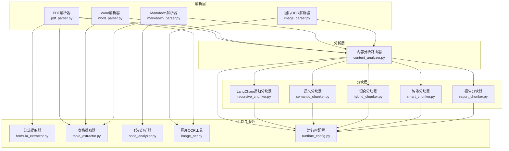
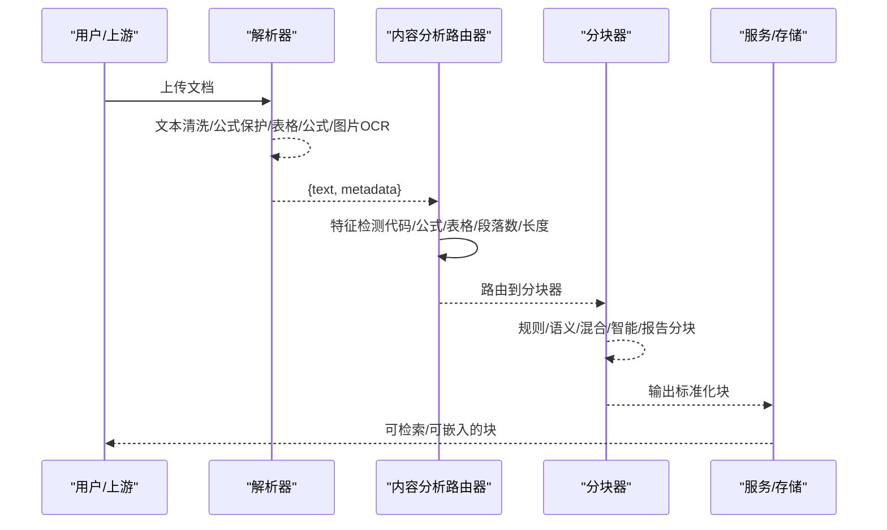
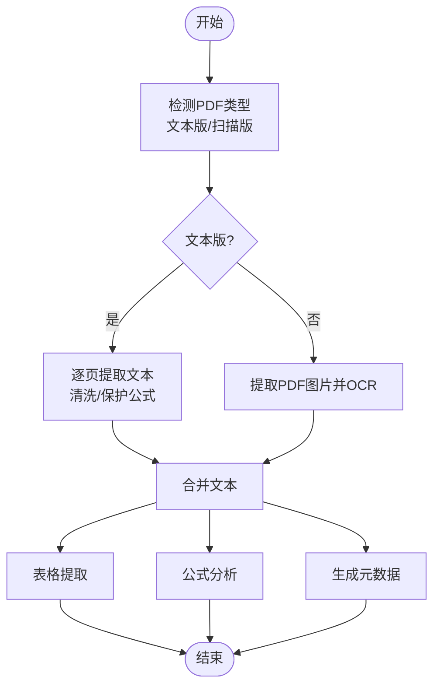
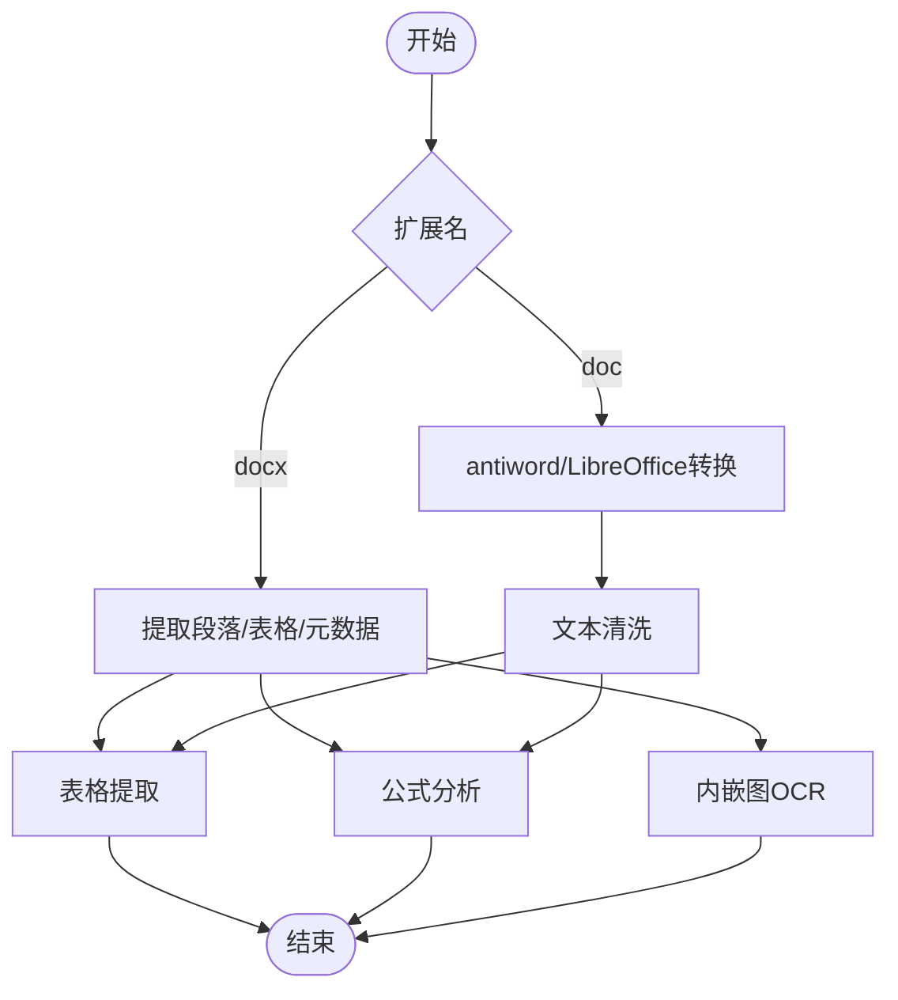
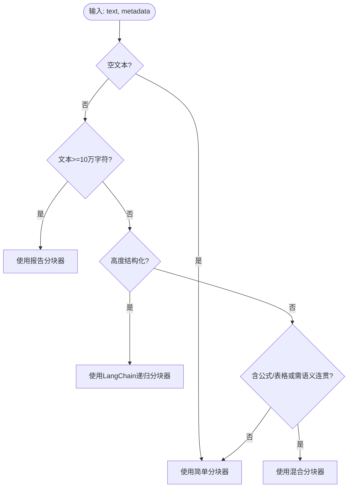
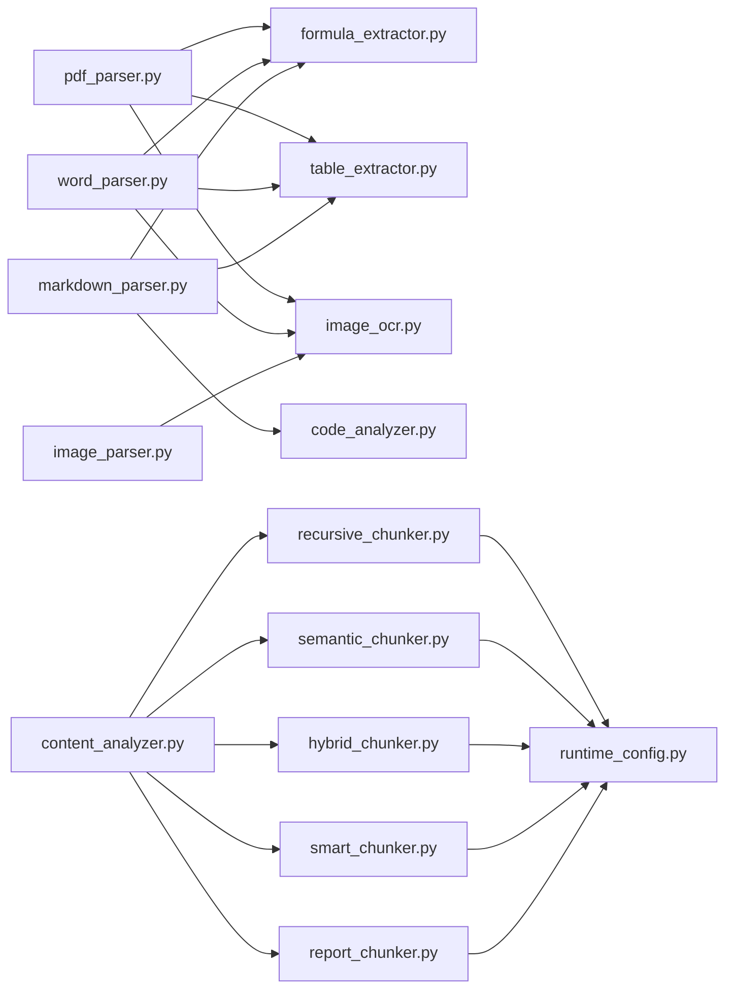

# 文档处理系统

<cite>
**本文引用的文件**
- [pdf_parser.py](file://parsers/pdf_parser.py)
- [word_parser.py](file://parsers/word_parser.py)
- [markdown_parser.py](file://parsers/markdown_parser.py)
- [image_parser.py](file://parsers/image_parser.py)
- [content_analyzer.py](file://chunking/router/content_analyzer.py)
- [formula_extractor.py](file://utils/formula_extractor.py)
- [table_extractor.py](file://utils/table_extractor.py)
- [code_analyzer.py](file://utils/code_analyzer.py)
- [image_ocr.py](file://utils/image_ocr.py)
- [hybrid_chunker.py](file://chunking/hybrid_chunker.py)
- [semantic_chunker.py](file://chunking/langchain/semantic_chunker.py)
- [recursive_chunker.py](file://chunking/langchain/recursive_chunker.py)
- [smart_chunker.py](file://chunking/smart_chunker.py)
- [report_chunker.py](file://chunking/report_chunker.py)
- [runtime_config.py](file://services/runtime_config.py)
</cite>

## 目录
1. [简介](#简介)
2. [项目结构](#项目结构)
3. [核心组件](#核心组件)
4. [架构总览](#架构总览)
5. [详细组件分析](#详细组件分析)
6. [依赖分析](#依赖分析)
7. [性能考虑](#性能考虑)
8. [故障排除指南](#故障排除指南)
9. [结论](#结论)
10. [附录](#附录)

## 简介
本文件为“文档处理系统”的综合技术文档，聚焦多格式文档解析器设计与实现，覆盖PDF（文本版/扫描版）、Word（doc/docx）、Markdown与图片OCR；系统性阐述自动分块策略（规则分块与语义分块）与路由机制；详解公式识别与表格提取（LaTeX公式解析、数学符号规范化、表格结构重建）；并给出内容分析器的工作流、配置示例、性能调优建议与故障排除指南。

## 项目结构
系统采用“解析层-分析层-分块层-服务层”分层架构：
- 解析层：多格式文档解析器（PDF、Word、Markdown、图片）
- 分析层：内容分析路由器，根据文档特征选择合适分块器
- 分块层：规则分块（LangChain递归分块）、语义分块（基于嵌入）、混合分块（规则+语义）、智能分块（公式/表格保护）、报告分块（结构+token预算）
- 服务层：运行时配置管理（模块开关、并发参数）

图表来源
- [pdf_parser.py:103-217](file://parsers/pdf_parser.py#L103-L217)
- [word_parser.py:131-396](file://parsers/word_parser.py#L131-L396)
- [markdown_parser.py:14-104](file://parsers/markdown_parser.py#L14-L104)
- [image_parser.py:13-57](file://parsers/image_parser.py#L13-L57)
- [content_analyzer.py:253-299](file://chunking/router/content_analyzer.py#L253-L299)
- [formula_extractor.py:28-131](file://utils/formula_extractor.py#L28-L131)
- [table_extractor.py:10-31](file://utils/table_extractor.py#L10-L31)
- [code_analyzer.py:258-291](file://utils/code_analyzer.py#L258-L291)
- [image_ocr.py:38-123](file://utils/image_ocr.py#L38-L123)
- [hybrid_chunker.py:52-121](file://chunking/hybrid_chunker.py#L52-L121)
- [semantic_chunker.py:81-138](file://chunking/langchain/semantic_chunker.py#L81-L138)
- [recursive_chunker.py:69-109](file://chunking/langchain/recursive_chunker.py#L69-L109)
- [smart_chunker.py:67-96](file://chunking/smart_chunker.py#L67-L96)
- [report_chunker.py:58-142](file://chunking/report_chunker.py#L58-L142)
- [runtime_config.py:140-188](file://services/runtime_config.py#L140-L188)

章节来源
- [pdf_parser.py:103-217](file://parsers/pdf_parser.py#L103-L217)
- [word_parser.py:131-396](file://parsers/word_parser.py#L131-L396)
- [markdown_parser.py:14-104](file://parsers/markdown_parser.py#L14-L104)
- [image_parser.py:13-57](file://parsers/image_parser.py#L13-L57)
- [content_analyzer.py:253-299](file://chunking/router/content_analyzer.py#L253-L299)

## 核心组件
- 多格式解析器
  - PDF解析器：支持文本版/扫描版，内置公式保护、表格提取、图片OCR集成
  - Word解析器：支持docx/doc，doc通过系统工具转换，内置表格提取、公式分析、内嵌图OCR
  - Markdown解析器：纯文本提取、表格提取、代码块分析、公式分析
  - 图片OCR解析器：单图OCR，受运行时配置控制
- 内容分析路由器：根据文档特征（代码、公式、表格、段落数、长度等）自动路由到递归/语义/混合/智能/报告分块器
- 分块器家族：LangChain递归分块、语义分块、混合分块（规则+语义）、智能分块（公式保护）、报告分块（结构+token预算）
- 工具与服务：公式提取与规范化、表格结构重建、代码分析、图片OCR、运行时配置（模块开关/并发参数）

章节来源
- [pdf_parser.py:12-221](file://parsers/pdf_parser.py#L12-L221)
- [word_parser.py:18-401](file://parsers/word_parser.py#L18-L401)
- [markdown_parser.py:11-109](file://parsers/markdown_parser.py#L11-L109)
- [image_parser.py:10-61](file://parsers/image_parser.py#L10-L61)
- [content_analyzer.py:12-300](file://chunking/router/content_analyzer.py#L12-L300)
- [hybrid_chunker.py:9-179](file://chunking/hybrid_chunker.py#L9-L179)
- [semantic_chunker.py:8-139](file://chunking/langchain/semantic_chunker.py#L8-L139)
- [recursive_chunker.py:7-110](file://chunking/langchain/recursive_chunker.py#L7-L110)
- [smart_chunker.py:7-408](file://chunking/smart_chunker.py#L7-L408)
- [report_chunker.py:42-143](file://chunking/report_chunker.py#L42-L143)
- [formula_extractor.py:6-149](file://utils/formula_extractor.py#L6-L149)
- [table_extractor.py:7-290](file://utils/table_extractor.py#L7-L290)
- [code_analyzer.py:7-350](file://utils/code_analyzer.py#L7-L350)
- [image_ocr.py:7-224](file://utils/image_ocr.py#L7-L224)
- [runtime_config.py:15-218](file://services/runtime_config.py#L15-L218)

## 架构总览
系统通过解析器统一产出“文本+元数据”，内容分析路由器依据元数据与文本特征选择最优分块策略，分块器保证块内语义完整性与块间连贯性，最终形成可用于检索/嵌入的标准化块集合。

图表来源
- [content_analyzer.py:253-299](file://chunking/router/content_analyzer.py#L253-L299)
- [pdf_parser.py:103-217](file://parsers/pdf_parser.py#L103-L217)
- [word_parser.py:131-396](file://parsers/word_parser.py#L131-L396)
- [markdown_parser.py:14-104](file://parsers/markdown_parser.py#L14-L104)
- [image_parser.py:13-57](file://parsers/image_parser.py#L13-L57)
- [hybrid_chunker.py:52-121](file://chunking/hybrid_chunker.py#L52-L121)
- [semantic_chunker.py:81-138](file://chunking/langchain/semantic_chunker.py#L81-L138)
- [recursive_chunker.py:69-109](file://chunking/langchain/recursive_chunker.py#L69-L109)
- [smart_chunker.py:67-96](file://chunking/smart_chunker.py#L67-L96)
- [report_chunker.py:58-142](file://chunking/report_chunker.py#L58-L142)

## 详细组件分析

### PDF解析器（文本版/扫描版）
- 功能要点
  - 文本版：使用PyPDF2逐页提取文本，统一换行、清理控制字符、保护公式
  - 扫描版：通过图片OCR提取图片文字，合并至全文
  - 表格提取：基于文本识别的表格结构重建，输出HTML/Markdown/语义结构
  - 公式分析：LaTeX公式提取与规范化，保留数学符号
  - 元数据：标题、作者、主题、页数、提取方式、OCR统计
- 关键实现
  - 文本清洗与公式保护：先保护公式，再清理控制字符与空白
  - OCR开关：通过运行时配置控制是否启用
  - 表格/公式：调用工具模块进行结构化输出
- 错误处理：对各步骤异常进行捕获与告警，不影响整体流程

图表来源
- [pdf_parser.py:103-217](file://parsers/pdf_parser.py#L103-L217)
- [image_ocr.py:124-218](file://utils/image_ocr.py#L124-L218)
- [table_extractor.py:10-31](file://utils/table_extractor.py#L10-L31)
- [formula_extractor.py:28-131](file://utils/formula_extractor.py#L28-L131)
- [runtime_config.py:164-188](file://services/runtime_config.py#L164-L188)

章节来源
- [pdf_parser.py:12-221](file://parsers/pdf_parser.py#L12-L221)

### Word解析器（docx/doc）
- 功能要点
  - docx：使用python-docx提取段落，表格转HTML/Markdown/语义结构，内嵌图片OCR
  - doc：通过antiword/LibreOffice转换为文本
  - 公式分析：LaTeX公式提取与规范化
  - 元数据：标题、作者、主题、段落数、提取方式
- 关键实现
  - 文本清洗：保护公式、移除嵌入对象标记、清理二进制残留
  - 表格/公式：同PDF解析器思路
  - doc转换：跨平台兼容，超时与错误处理
- 错误处理：缺失依赖、系统工具不可用、图片OCR失败均告警并降级

图表来源
- [word_parser.py:131-396](file://parsers/word_parser.py#L131-L396)
- [table_extractor.py:10-31](file://utils/table_extractor.py#L10-L31)
- [formula_extractor.py:28-131](file://utils/formula_extractor.py#L28-L131)
- [image_ocr.py:38-123](file://utils/image_ocr.py#L38-L123)
- [runtime_config.py:164-188](file://services/runtime_config.py#L164-L188)

章节来源
- [word_parser.py:18-401](file://parsers/word_parser.py#L18-L401)

### Markdown解析器
- 功能要点
  - 使用markdown库渲染为HTML，再剥离标签得到纯文本
  - 表格提取：识别Markdown/管道分隔表格，重建结构
  - 代码块分析：提取代码块语言与内容，交由代码分析器
  - 公式分析：LaTeX公式提取与规范化
- 关键实现
  - 扩展：codehilite、tables、fenced_code
  - 代码块正则匹配，逐块分析
  - 表格识别：Markdown表格与管道表格两类

章节来源
- [markdown_parser.py:11-109](file://parsers/markdown_parser.py#L11-L109)
- [table_extractor.py:10-31](file://utils/table_extractor.py#L10-L31)
- [code_analyzer.py:258-291](file://utils/code_analyzer.py#L258-L291)
- [formula_extractor.py:28-131](file://utils/formula_extractor.py#L28-L131)

### 图片OCR解析器
- 功能要点
  - 单图OCR：PaddleOCR识别，输出文本、置信度、行数、框坐标
  - 受运行时配置控制：可关闭OCR
  - 错误处理：文件不存在、引擎未初始化、识别失败
- 关键实现
  - 延迟初始化：首次使用时加载OCR引擎
  - PDF图片OCR：通过PyMuPDF提取图片，逐张OCR并聚合

章节来源
- [image_parser.py:10-61](file://parsers/image_parser.py#L10-L61)
- [image_ocr.py:38-218](file://utils/image_ocr.py#L38-L218)
- [runtime_config.py:164-188](file://services/runtime_config.py#L164-L188)

### 内容分析路由器
- 功能要点
  - 自动分发：根据文档特征选择递归/语义/混合/智能/报告分块器
  - 特征检测：
    - 高度结构化：代码文件、大量代码块、LaTeX公式、结构化标记
    - 公式/表格：元数据或文本模式检测
    - 语义连贯：长文档、段落数、句子数、章节结构
    - 超长报告：结构+token预算
- 关键实现
  - 延迟初始化各分块器
  - 路由策略：优先级递减，超长报告优先
  - 日志：明确标注选择原因

图表来源
- [content_analyzer.py:253-299](file://chunking/router/content_analyzer.py#L253-L299)

章节来源
- [content_analyzer.py:12-300](file://chunking/router/content_analyzer.py#L12-L300)

### 分块器家族
- LangChain递归分块器
  - 适用于高度结构化内容（代码、论文、Markdown等）
  - 自适应分隔符优先级：段落、行、中文标点、英文标点、空格、字符
- 语义分块器
  - 基于嵌入的语义断点，保持长文档语义连贯
  - 回退策略：失败时回退到简单分块
- 混合分块器
  - 规则优先：代码块、公式、表格保持完整性
  - 语义分块：普通文本按语义断点切分
  - 去重：按文本哈希去重
- 智能分块器
  - 公式保护：占位符保护LaTeX公式，分块后再恢复
  - 段落边界：标题、编号段落、章节标题识别
  - 大段落分割：按句子边界强制切分
- 报告分块器
  - 结构优先：标题/章节路径维护
  - token预算：软硬限制结合，按句子进一步粗切

章节来源
- [recursive_chunker.py:7-110](file://chunking/langchain/recursive_chunker.py#L7-L110)
- [semantic_chunker.py:8-139](file://chunking/langchain/semantic_chunker.py#L8-L139)
- [hybrid_chunker.py:9-179](file://chunking/hybrid_chunker.py#L9-L179)
- [smart_chunker.py:7-408](file://chunking/smart_chunker.py#L7-L408)
- [report_chunker.py:42-143](file://chunking/report_chunker.py#L42-L143)

### 公式识别与表格提取
- 公式识别
  - 模式覆盖：行内/块级LaTeX、方程/对齐/矩阵环境
  - 规范化：数学符号映射、空白规整
  - 保护：在文本清洗阶段用占位符保护，避免误删
- 表格提取
  - 识别：Markdown表格与管道分隔表格
  - 结构重建：HTML/Markdown格式输出，语义结构（行列数、表头、数据类型、数值列）

章节来源
- [formula_extractor.py:6-149](file://utils/formula_extractor.py#L6-L149)
- [table_extractor.py:7-290](file://utils/table_extractor.py#L7-L290)

### 代码分析
- 功能要点
  - 语言检测：基于关键字与语法特征
  - 函数/类/导入提取：按语言定制正则
  - 复杂度估算：行数、控制结构、函数数量加权
- 应用场景
  - Markdown代码块分析
  - 代码文件结构化分块

章节来源
- [code_analyzer.py:7-350](file://utils/code_analyzer.py#L7-L350)

### 运行时配置
- 模块开关
  - ocr_image_enabled：图片OCR开关
  - table_parse_enabled：表格解析开关
  - 其他：知识抽取、查询分析、重排、嵌入等
- 参数
  - kg_concurrency/embedding_batch_size/embedding_concurrency/ocr_concurrency等
- 默认策略
  - low/high两种预设，自定义模式强制保留基础能力（嵌入）

章节来源
- [runtime_config.py:15-218](file://services/runtime_config.py#L15-L218)

## 依赖分析
- 组件耦合
  - 解析器与工具模块松耦合：通过工具模块（公式/表格/OCR）实现功能扩展
  - 分块器与嵌入服务解耦：语义分块依赖嵌入服务，失败可回退
  - 内容分析路由器集中决策，降低上层复杂度
- 外部依赖
  - PDF：PyPDF2、PyMuPDF（图片OCR）
  - Word：python-docx（docx）、antiword/LibreOffice（doc）
  - OCR：PaddleOCR
  - 分块：LangChain（text_splitter/semantic_chunker）
- 循环依赖
  - 未发现循环依赖，模块职责清晰

图表来源
- [pdf_parser.py:103-217](file://parsers/pdf_parser.py#L103-L217)
- [word_parser.py:131-396](file://parsers/word_parser.py#L131-L396)
- [markdown_parser.py:14-104](file://parsers/markdown_parser.py#L14-L104)
- [image_parser.py:13-57](file://parsers/image_parser.py#L13-L57)
- [content_analyzer.py:253-299](file://chunking/router/content_analyzer.py#L253-L299)
- [formula_extractor.py:28-131](file://utils/formula_extractor.py#L28-L131)
- [table_extractor.py:10-31](file://utils/table_extractor.py#L10-L31)
- [code_analyzer.py:258-291](file://utils/code_analyzer.py#L258-L291)
- [image_ocr.py:38-123](file://utils/image_ocr.py#L38-L123)
- [hybrid_chunker.py:52-121](file://chunking/hybrid_chunker.py#L52-L121)
- [semantic_chunker.py:81-138](file://chunking/langchain/semantic_chunker.py#L81-L138)
- [recursive_chunker.py:69-109](file://chunking/langchain/recursive_chunker.py#L69-L109)
- [smart_chunker.py:67-96](file://chunking/smart_chunker.py#L67-L96)
- [report_chunker.py:58-142](file://chunking/report_chunker.py#L58-L142)
- [runtime_config.py:164-188](file://services/runtime_config.py#L164-L188)

## 性能考虑
- OCR与表格解析
  - 通过运行时配置开关控制，避免不必要的开销
  - PDF图片OCR按页提取，注意临时文件清理
- 分块策略选择
  - 高度结构化文档优先递归分块，减少语义断点误判
  - 长文档优先语义分块，保证上下文连贯
  - 含公式/表格文档优先混合分块，兼顾完整性与语义
- 嵌入与语义分块
  - 语义分块器失败回退到简单分块，保障吞吐
  - 合理设置chunk_size/chunk_overlap，平衡召回与性能
- 报告分块
  - 使用token预算控制块大小，避免超限

## 故障排除指南
- PDF解析
  - 未提取到文本：确认是否扫描版PDF，检查OCR开关
  - 表格/公式解析失败：查看日志告警，确认工具模块可用
- Word解析
  - doc转换失败：检查antiword/LibreOffice是否安装，路径是否在环境变量
  - 内嵌图OCR失败：确认图片提取与临时文件写入权限
- Markdown解析
  - 代码块分析失败：确认代码块格式与语言标识
- 图片OCR
  - OCR引擎未初始化：确认PaddleOCR安装与初始化日志
  - 未识别到文字：检查图片质量与语言模型
- 分块器
  - 语义分块失败：检查嵌入服务可用性，回退策略生效
  - 混合分块重复块：检查去重逻辑与哈希一致性
- 运行时配置
  - 配置读取失败：检查MongoDB连接与集合权限，使用默认配置兜底

章节来源
- [pdf_parser.py:119-217](file://parsers/pdf_parser.py#L119-L217)
- [word_parser.py:304-396](file://parsers/word_parser.py#L304-L396)
- [markdown_parser.py:64-104](file://parsers/markdown_parser.py#L64-L104)
- [image_ocr.py:15-123](file://utils/image_ocr.py#L15-L123)
- [semantic_chunker.py:72-138](file://chunking/langchain/semantic_chunker.py#L72-L138)
- [hybrid_chunker.py:97-121](file://chunking/hybrid_chunker.py#L97-L121)
- [runtime_config.py:140-188](file://services/runtime_config.py#L140-L188)

## 结论
该系统通过“解析-分析-分块-服务”的分层设计，实现了对多格式文档的高鲁棒性处理。解析器负责高质量文本与结构化信息提取，内容分析路由器基于特征自动选择最优分块策略，分块器兼顾完整性与语义连贯性，工具模块与运行时配置提供了灵活的扩展与调优空间。整体方案在公式、表格、代码等结构化内容处理上具备较强优势，适合构建企业级知识库与检索增强应用。

## 附录

### 配置示例（运行时）
- 模式切换
  - low：仅保留基础能力，关闭OCR/表格解析
  - high：开启全部能力，提高并发参数
  - custom：自定义模块与参数
- 常用参数
  - ocr_image_enabled：是否启用图片OCR
  - table_parse_enabled：是否启用表格解析
  - embedding_batch_size/embedding_concurrency：嵌入批量与并发
  - ocr_concurrency：OCR并发
- 更新方式
  - 通过upsert接口合并更新，MongoDB持久化并刷新缓存

章节来源
- [runtime_config.py:41-83](file://services/runtime_config.py#L41-L83)
- [runtime_config.py:191-217](file://services/runtime_config.py#L191-L217)