# 文档解析器

<cite>
**本文引用的文件**
- [parsers/__init__.py](file://parsers/__init__.py)
- [parsers/base.py](file://parsers/base.py)
- [parsers/parser_factory.py](file://parsers/parser_factory.py)
- [parsers/pdf_parser.py](file://parsers/pdf_parser.py)
- [parsers/word_parser.py](file://parsers/word_parser.py)
- [parsers/markdown_parser.py](file://parsers/markdown_parser.py)
- [parsers/text_parser.py](file://parsers/text_parser.py)
- [parsers/image_parser.py](file://parsers/image_parser.py)
- [parsers/router/parsing_router.py](file://parsers/router/parsing_router.py)
- [parsers/utils/unified_loader.py](file://parsers/utils/unified_loader.py)
- [parsers/utils/result_synthesizer.py](file://parsers/utils/result_synthesizer.py)
- [parsers/unstructured/unstructured_parser.py](file://parsers/unstructured/unstructured_parser.py)
- [utils/formula_extractor.py](file://utils/formula_extractor.py)
- [utils/table_extractor.py](file://utils/table_extractor.py)
- [utils/image_ocr.py](file://utils/image_ocr.py)
</cite>

## 目录
1. [简介](#简介)
2. [项目结构](#项目结构)
3. [核心组件](#核心组件)
4. [架构总览](#架构总览)
5. [详细组件分析](#详细组件分析)
6. [依赖分析](#依赖分析)
7. [性能考虑](#性能考虑)
8. [故障排查指南](#故障排查指南)
9. [结论](#结论)
10. [附录](#附录)

## 简介
本文件面向“文档解析器”子系统，系统性阐述解析器的工厂模式设计与实现，覆盖基类抽象、具体解析器继承关系、自动检测与路由机制、解析流程、扩展开发指南、配置示例、错误处理策略与性能优化建议。解析器体系支持PDF、Word、Markdown、文本与图片（OCR）等多种格式，并提供统一结果合成接口，便于下游检索与生成任务。

## 项目结构
解析器相关代码主要位于 parsers 子包，包含：
- 基类与工厂：base.py、parser_factory.py
- 具体解析器：pdf_parser.py、word_parser.py、markdown_parser.py、text_parser.py、image_parser.py
- 路由与工具：router/parsing_router.py、utils/unified_loader.py、utils/result_synthesizer.py
- 可选的Unstructured解析器：unstructured/unstructured_parser.py
- 辅助工具：utils/formula_extractor.py、utils/table_extractor.py、utils/image_ocr.py

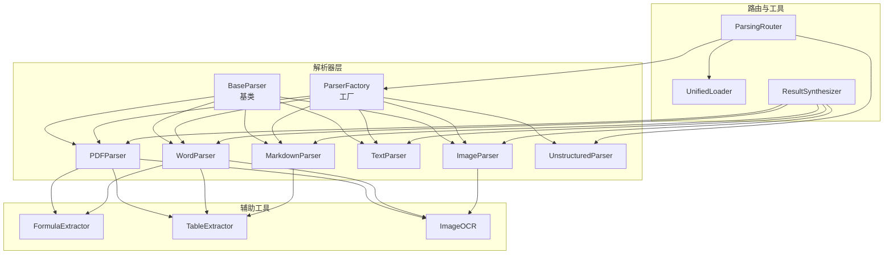

图表来源
- [parsers/base.py:6-32](file://parsers/base.py#L6-L32)
- [parsers/parser_factory.py:32-58](file://parsers/parser_factory.py#L32-L58)
- [parsers/pdf_parser.py:12-221](file://parsers/pdf_parser.py#L12-L221)
- [parsers/word_parser.py:18-401](file://parsers/word_parser.py#L18-L401)
- [parsers/markdown_parser.py:11-109](file://parsers/markdown_parser.py#L11-L109)
- [parsers/text_parser.py:7-36](file://parsers/text_parser.py#L7-L36)
- [parsers/image_parser.py:10-61](file://parsers/image_parser.py#L10-L61)
- [parsers/router/parsing_router.py:10-273](file://parsers/router/parsing_router.py#L10-L273)
- [parsers/utils/unified_loader.py:7-60](file://parsers/utils/unified_loader.py#L7-L60)
- [parsers/utils/result_synthesizer.py:20-134](file://parsers/utils/result_synthesizer.py#L20-L134)
- [parsers/unstructured/unstructured_parser.py:7-115](file://parsers/unstructured/unstructured_parser.py#L7-L115)
- [utils/formula_extractor.py:6-149](file://utils/formula_extractor.py#L6-L149)
- [utils/table_extractor.py:7-290](file://utils/table_extractor.py#L7-L290)
- [utils/image_ocr.py:7-224](file://utils/image_ocr.py#L7-L224)

章节来源
- [parsers/__init__.py:1-38](file://parsers/__init__.py#L1-L38)

## 核心组件
- BaseParser 抽象基类：定义 parse 与 supported_extensions 接口，以及 can_parse 的通用扩展名判断逻辑。
- ParserFactory 工厂：集中构建解析器集合，提供按文件扩展名选择解析器的能力，并支持动态注册新解析器。
- 具体解析器：PDFParser、WordParser、MarkdownParser、TextParser、ImageParser，各自实现 parse 与扩展名声明。
- ParsingRouter 智能路由：根据文件类型、复杂度与运行时配置，选择 Legacy（原有解析器）或 Unstructured 解析器。
- UnifiedLoader 文件加载与校验：提供基础文件信息与存在性校验。
- ResultSynthesizer 结果合成：将不同解析器输出统一为标准格式，支持将表格、代码块、原始Markdown写回正文。
- 辅助工具：FormulaExtractor（公式提取与规范化）、TableExtractor（表格识别与格式化）、ImageOCR（图片/PDF图片OCR）。

章节来源
- [parsers/base.py:6-32](file://parsers/base.py#L6-L32)
- [parsers/parser_factory.py:32-58](file://parsers/parser_factory.py#L32-L58)
- [parsers/router/parsing_router.py:10-273](file://parsers/router/parsing_router.py#L10-L273)
- [parsers/utils/unified_loader.py:7-60](file://parsers/utils/unified_loader.py#L7-L60)
- [parsers/utils/result_synthesizer.py:20-134](file://parsers/utils/result_synthesizer.py#L20-L134)

## 架构总览
解析器采用“工厂 + 路由 + 工具”的分层架构：
- 工厂层：统一管理解析器实例，负责自动检测与选择。
- 路由层：根据文件特征与运行时配置，决定使用原有解析器还是Unstructured解析器。
- 工具层：提供公式、表格、OCR等通用能力，被各解析器复用。
- 输出层：ResultSynthesizer统一输出格式，便于后续chunking与embedding。

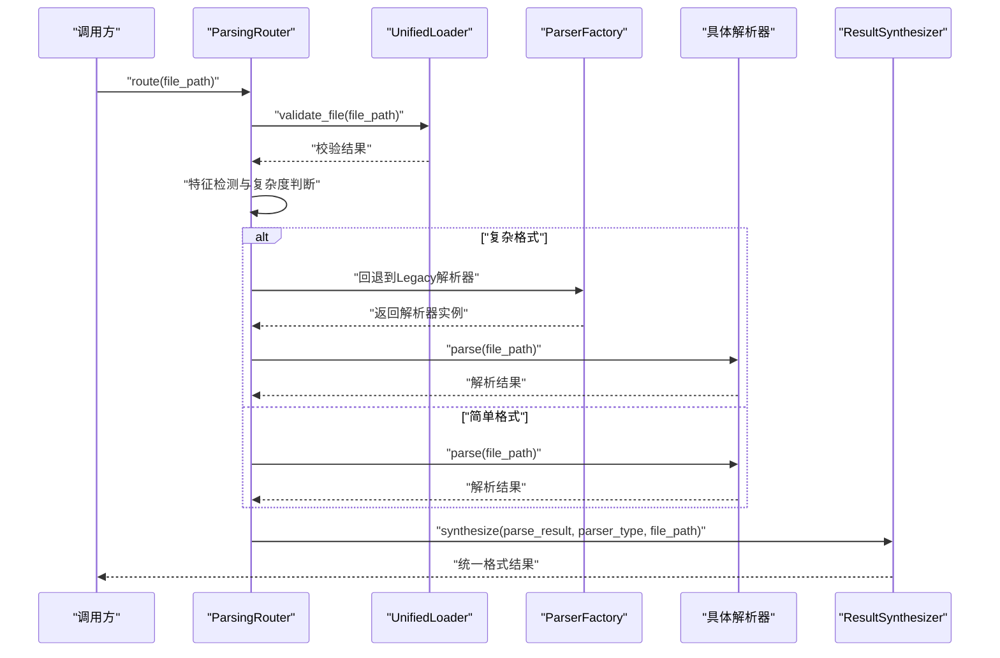

图表来源
- [parsers/router/parsing_router.py:221-273](file://parsers/router/parsing_router.py#L221-L273)
- [parsers/utils/unified_loader.py:43-60](file://parsers/utils/unified_loader.py#L43-L60)
- [parsers/parser_factory.py:37-57](file://parsers/parser_factory.py#L37-L57)
- [parsers/utils/result_synthesizer.py:41-102](file://parsers/utils/result_synthesizer.py#L41-L102)

## 详细组件分析

### 工厂模式与自动检测机制
- 工厂构建：ParserFactory 在模块加载时构建解析器列表，包含PDF、Text、Markdown、Word与Image解析器；若可用则加入Unstructured解析器。
- 自动检测：ParserFactory.get_parser 遍历解析器，基于 BaseParser.can_parse 的扩展名匹配选择合适解析器。
- 动态注册：ParserFactory.register_parser 支持运行时新增解析器实例。

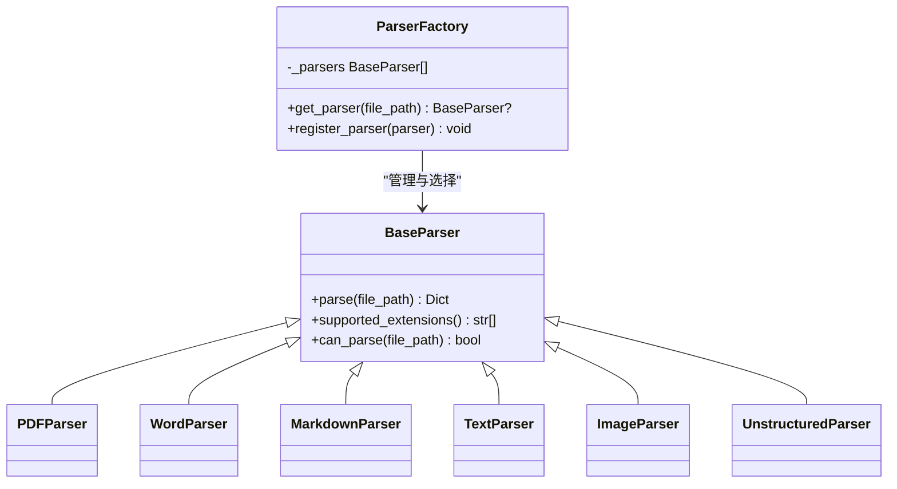

图表来源
- [parsers/base.py:6-32](file://parsers/base.py#L6-L32)
- [parsers/parser_factory.py:32-58](file://parsers/parser_factory.py#L32-L58)
- [parsers/pdf_parser.py:12-221](file://parsers/pdf_parser.py#L12-L221)
- [parsers/word_parser.py:18-401](file://parsers/word_parser.py#L18-L401)
- [parsers/markdown_parser.py:11-109](file://parsers/markdown_parser.py#L11-L109)
- [parsers/text_parser.py:7-36](file://parsers/text_parser.py#L7-L36)
- [parsers/image_parser.py:10-61](file://parsers/image_parser.py#L10-L61)
- [parsers/unstructured/unstructured_parser.py:7-115](file://parsers/unstructured/unstructured_parser.py#L7-L115)

章节来源
- [parsers/parser_factory.py:19-58](file://parsers/parser_factory.py#L19-L58)
- [parsers/base.py:27-32](file://parsers/base.py#L27-L32)

### PDF解析器（PyPDF2、可选OCR与表格/公式增强）
- 功能特性
  - 文本版PDF：使用PyPDF2逐页提取文本，清理控制字符与编码问题，保留LaTeX公式。
  - 扫描版PDF：可选开启OCR，提取PDF内嵌图片并进行OCR识别，合并OCR文本。
  - 表格提取：对全文进行表格识别，输出HTML/Markdown/语义结构。
  - 公式分析：提取并规范化公式，标注类型与位置。
  - 元数据：标题、作者、主题、页数、提取页数、图片OCR统计等。
- 关键流程

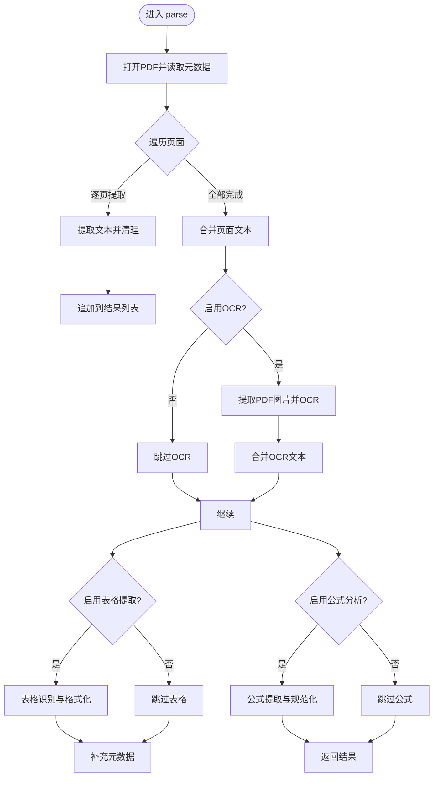

图表来源
- [parsers/pdf_parser.py:103-217](file://parsers/pdf_parser.py#L103-L217)
- [utils/formula_extractor.py:28-131](file://utils/formula_extractor.py#L28-L131)
- [utils/table_extractor.py:10-32](file://utils/table_extractor.py#L10-L32)
- [utils/image_ocr.py:124-219](file://utils/image_ocr.py#L124-L219)

章节来源
- [parsers/pdf_parser.py:103-217](file://parsers/pdf_parser.py#L103-L217)

### Word解析器（python-docx集成与.doc兼容）
- 功能特性
  - .docx：使用python-docx提取段落文本，清理嵌入对象标记与二进制残留，保留LaTeX公式。
  - .doc：尝试使用antiword或LibreOffice转换为文本；失败时报错提示安装依赖。
  - 表格提取：输出HTML/Markdown与语义结构。
  - 公式分析：提取并标注公式。
  - 内嵌图片OCR：提取docx内嵌图片，写入临时文件后OCR，将OCR文本拼接到正文。
- 关键流程

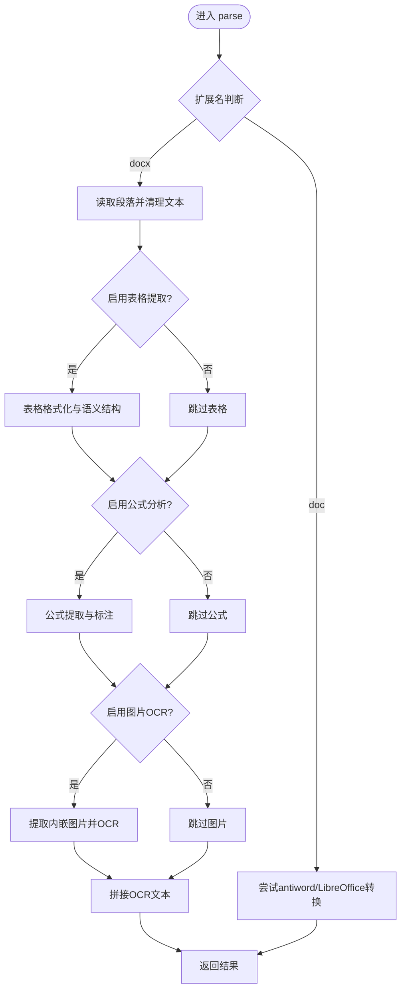

图表来源
- [parsers/word_parser.py:131-396](file://parsers/word_parser.py#L131-L396)
- [utils/table_extractor.py:10-32](file://utils/table_extractor.py#L10-L32)
- [utils/formula_extractor.py:28-131](file://utils/formula_extractor.py#L28-L131)
- [utils/image_ocr.py:38-123](file://utils/image_ocr.py#L38-L123)

章节来源
- [parsers/word_parser.py:131-396](file://parsers/word_parser.py#L131-L396)

### Markdown解析器
- 功能特性
  - 使用markdown库渲染为HTML，再提取纯文本。
  - 可选表格提取：识别Markdown表格并输出HTML/Markdown/语义结构。
  - 代码块分析：提取代码块语言与内容，交由CodeAnalyzer分析。
  - 公式分析：提取LaTeX公式并规范化。
- 关键流程

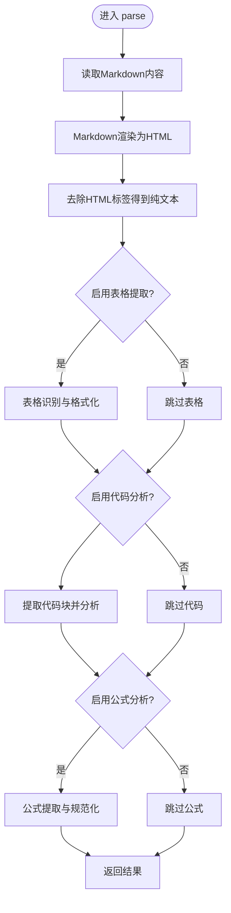

图表来源
- [parsers/markdown_parser.py:14-104](file://parsers/markdown_parser.py#L14-L104)
- [utils/table_extractor.py:10-32](file://utils/table_extractor.py#L10-L32)
- [utils/formula_extractor.py:28-131](file://utils/formula_extractor.py#L28-L131)

章节来源
- [parsers/markdown_parser.py:14-104](file://parsers/markdown_parser.py#L14-L104)

### 文本解析器
- 功能特性
  - 使用chardet检测编码，按检测结果读取文本。
  - 返回文本与基础元数据（编码、行数）。
- 关键流程

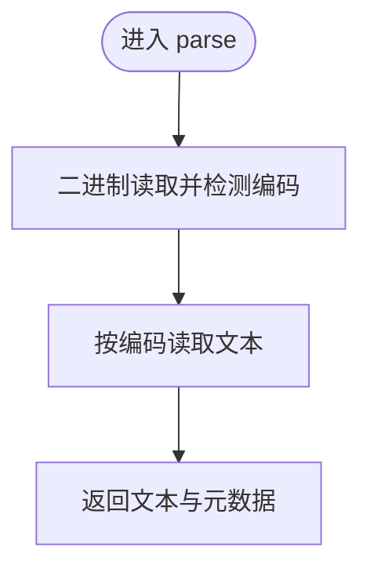

图表来源
- [parsers/text_parser.py:10-31](file://parsers/text_parser.py#L10-L31)

章节来源
- [parsers/text_parser.py:10-31](file://parsers/text_parser.py#L10-L31)

### 图片解析器（OCR）
- 功能特性
  - 支持jpg/png/bmp/webp/tiff等格式。
  - 通过运行时配置可关闭OCR（低配模式）。
  - 返回OCR文本、置信度、行数、可选框坐标与错误信息。
- 关键流程

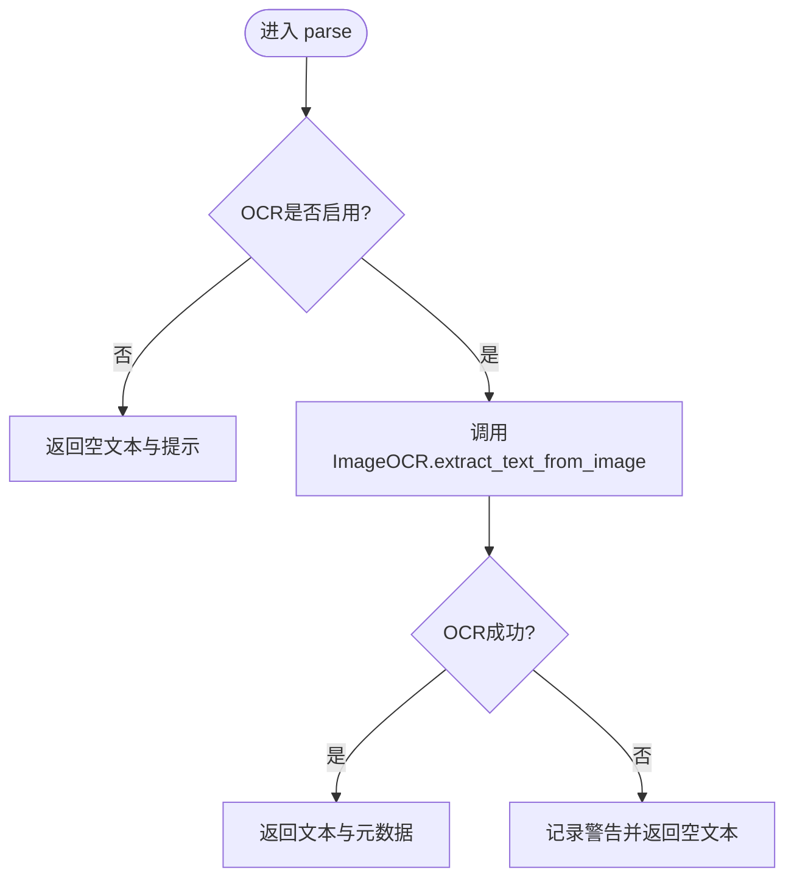

图表来源
- [parsers/image_parser.py:13-57](file://parsers/image_parser.py#L13-L57)
- [utils/image_ocr.py:38-123](file://utils/image_ocr.py#L38-L123)

章节来源
- [parsers/image_parser.py:13-57](file://parsers/image_parser.py#L13-L57)

### 路由与自动检测机制
- UnifiedLoader：校验文件存在与大小，提供基础文件信息。
- ParsingRouter：
  - 显式路由：对仅Unstructured支持的扩展名（如.pptx/xlsx/html等）直接走Unstructured。
  - 复杂度检测：扫描版PDF、大文件、复杂表格/图片/公式多发场景优先使用Unstructured。
  - 回退策略：当Unstructured缺少PDF依赖或不可用时，回退到原有解析器。
  - 最终选择：若仍不可用，抛出错误。

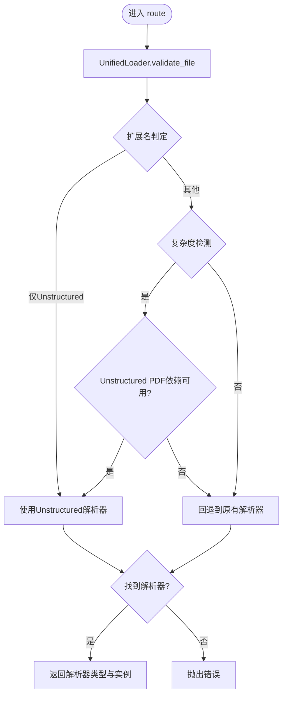

图表来源
- [parsers/router/parsing_router.py:221-273](file://parsers/router/parsing_router.py#L221-L273)
- [parsers/utils/unified_loader.py:43-60](file://parsers/utils/unified_loader.py#L43-L60)

章节来源
- [parsers/router/parsing_router.py:10-273](file://parsers/router/parsing_router.py#L10-L273)

### 结果合成与格式统一
- ResultSynthesizer：
  - 优先使用raw_markdown（若存在）作为正文，保留标题等结构。
  - 可选将metadata中的tables/code_blocks写回正文，降低语义损失。
  - 记录parser_type与file_path，保证溯源。
  - 合并多个结果时，合并文本与元数据。

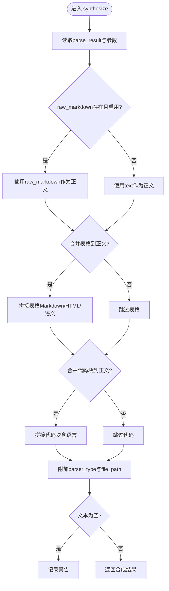

图表来源
- [parsers/utils/result_synthesizer.py:41-102](file://parsers/utils/result_synthesizer.py#L41-L102)

章节来源
- [parsers/utils/result_synthesizer.py:20-134](file://parsers/utils/result_synthesizer.py#L20-L134)

## 依赖分析
- 组件耦合
  - 具体解析器依赖BaseParser接口，耦合度低，易于扩展。
  - 工具模块（公式、表格、OCR）被多个解析器复用，提升内聚性。
  - 路由器依赖工厂与加载器，同时对Unstructured进行条件引入，避免强制依赖。
- 外部依赖
  - PDF：PyPDF2（文本提取）、PyMuPDF（图片提取，可选）、PaddleOCR（OCR，可选）。
  - Word：python-docx（.docx）、antiword/LibreOffice（.doc）。
  - Markdown：markdown库。
  - 编码检测：chardet。
  - Unstructured：可选，需安装相应依赖。

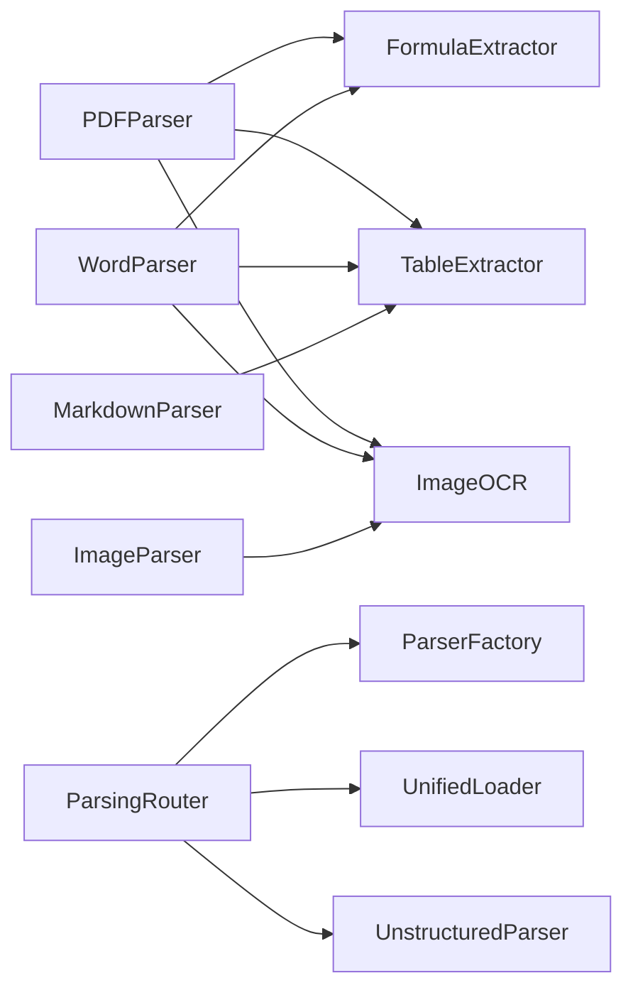

图表来源
- [parsers/pdf_parser.py:12-221](file://parsers/pdf_parser.py#L12-L221)
- [parsers/word_parser.py:18-401](file://parsers/word_parser.py#L18-L401)
- [parsers/markdown_parser.py:11-109](file://parsers/markdown_parser.py#L11-L109)
- [parsers/image_parser.py:10-61](file://parsers/image_parser.py#L10-L61)
- [parsers/router/parsing_router.py:10-273](file://parsers/router/parsing_router.py#L10-L273)
- [parsers/unstructured/unstructured_parser.py:7-115](file://parsers/unstructured/unstructured_parser.py#L7-L115)

章节来源
- [parsers/parser_factory.py:19-29](file://parsers/parser_factory.py#L19-L29)

## 性能考虑
- 解析器选择
  - 对于简单格式（TXT/MD），直接使用原有解析器，避免不必要的布局分析开销。
  - 对于大文件或复杂PDF/Word，优先使用Unstructured，减少二次回退成本。
- OCR与表格/公式
  - 通过运行时配置开关（如ocr_image_enabled、table_parse_enabled）按需启用，避免在低配环境产生额外开销。
- I/O与内存
  - PDF图片OCR会临时写入磁盘，注意清理临时文件；对超大PDF建议分页处理或限制页数。
- 并发与批处理
  - ResultSynthesizer支持合并多个结果，便于批处理场景统一输出。

## 故障排查指南
- “无法解析.doc文件”
  - 现象：抛出异常，提示安装antiword或LibreOffice。
  - 处理：安装对应系统工具或转换为.docx格式。
- “PDF未提取到文本”
  - 现象：警告提示可能为扫描版PDF。
  - 处理：启用OCR或提供清晰扫描版PDF。
- “Unstructured不可用”
  - 现象：初始化失败或缺少PDF依赖。
  - 处理：安装unstructured及其PDF依赖；或回退到原有解析器。
- “OCR失败”
  - 现象：返回空文本或错误信息。
  - 处理：确认PaddleOCR安装与模型加载；检查图片路径与权限。
- “表格/公式提取失败”
  - 现象：警告日志，但不影响主流程。
  - 处理：检查输入格式与运行时开关；必要时关闭相关功能以降低开销。

章节来源
- [parsers/word_parser.py:370-378](file://parsers/word_parser.py#L370-L378)
- [parsers/pdf_parser.py:174-176](file://parsers/pdf_parser.py#L174-L176)
- [parsers/router/parsing_router.py:253-257](file://parsers/router/parsing_router.py#L253-L257)
- [utils/image_ocr.py:31-37](file://utils/image_ocr.py#L31-L37)

## 结论
该解析器体系以工厂与路由为核心，结合工具模块实现对多格式文档的高鲁棒性与可扩展性。通过运行时配置与自动检测，既能满足简单场景的高性能需求，也能覆盖复杂文档的布局与结构理解。建议在生产环境中：
- 明确启用/禁用项（OCR、表格、公式）；
- 对大文件与复杂PDF优先使用Unstructured；
- 统一使用ResultSynthesizer输出，便于后续处理。

## 附录

### 扩展开发指南
- 新增解析器步骤
  - 继承 BaseParser，实现 parse 与 supported_extensions。
  - 在解析过程中可复用 FormulaExtractor、TableExtractor、ImageOCR 等工具。
  - 将新解析器注册到工厂：ParserFactory.register_parser(YourParser())。
- 自定义解析逻辑
  - 可在 parse 中读取运行时配置（如 modules.ocr_image_enabled、modules.table_parse_enabled）以控制功能开关。
  - 对复杂文档可结合 ParsingRouter 的特征检测策略，必要时回退到原有解析器。

章节来源
- [parsers/base.py:9-25](file://parsers/base.py#L9-L25)
- [parsers/parser_factory.py:54-57](file://parsers/parser_factory.py#L54-L57)
- [parsers/router/parsing_router.py:221-273](file://parsers/router/parsing_router.py#L221-L273)

### 配置示例（说明性）
- 运行时配置键
  - modules.ocr_image_enabled：是否启用图片/PDF图片OCR（默认启用）。
  - modules.table_parse_enabled：是否启用表格提取（默认启用）。
- 影响范围
  - PDFParser、WordParser、ImageParser均会读取上述开关以决定是否执行对应增强功能。

章节来源
- [parsers/pdf_parser.py:108-118](file://parsers/pdf_parser.py#L108-L118)
- [parsers/word_parser.py:150-161](file://parsers/word_parser.py#L150-L161)
- [parsers/image_parser.py:17-34](file://parsers/image_parser.py#L17-L34)