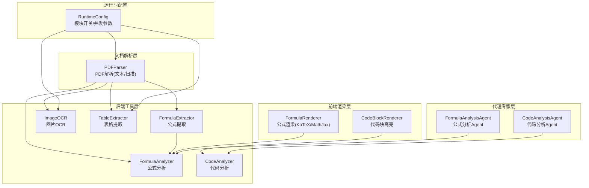
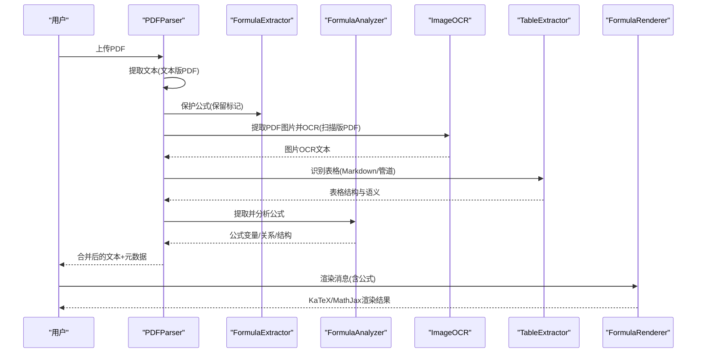
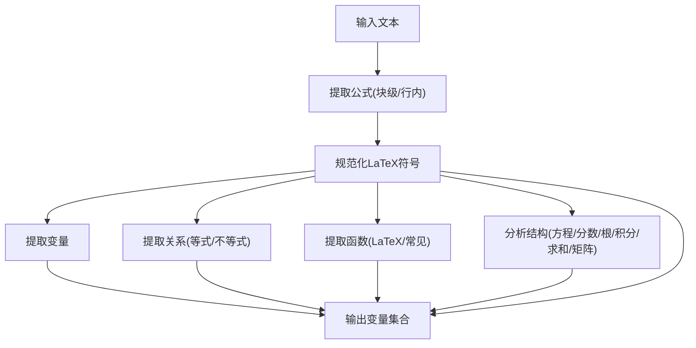
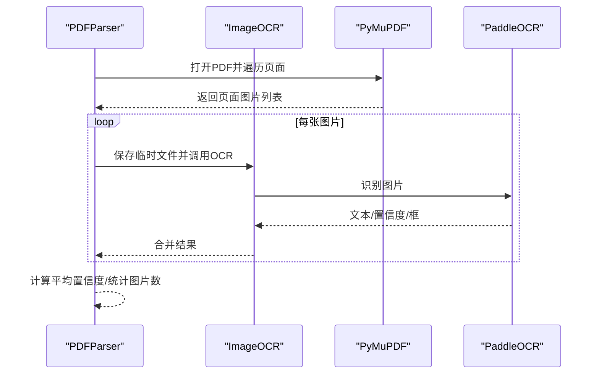
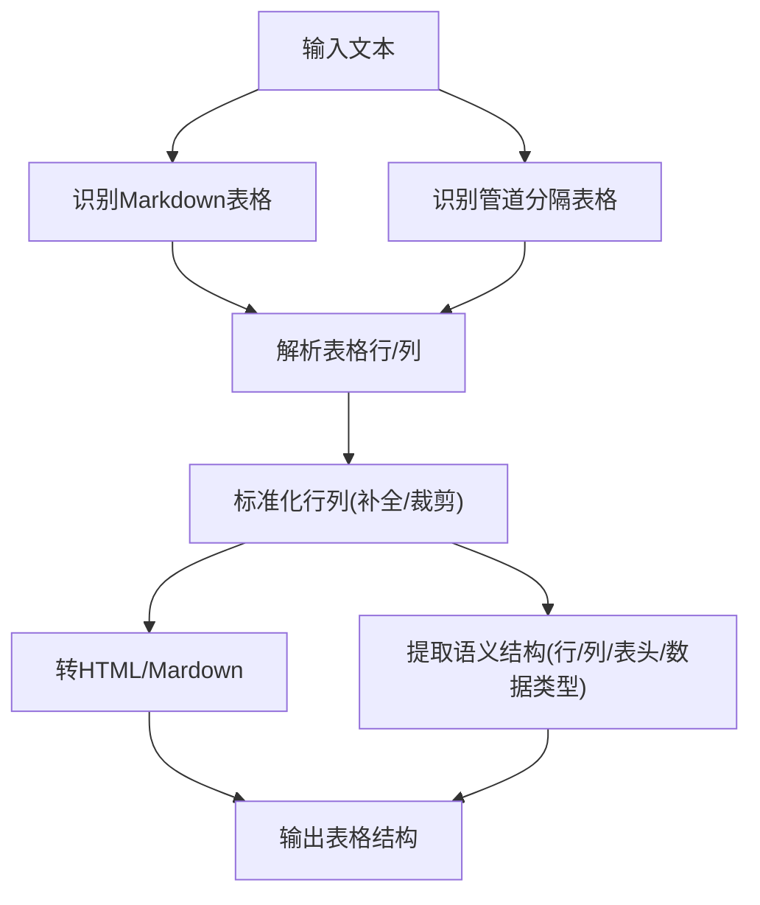
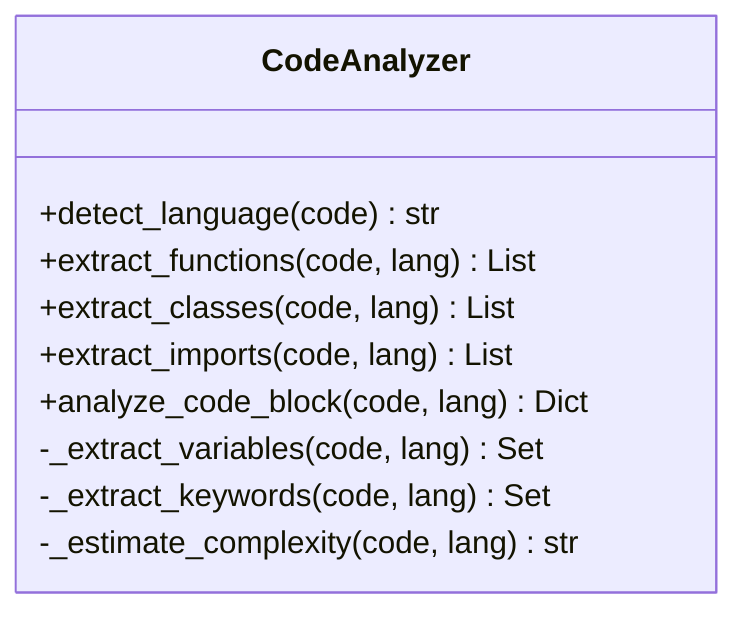
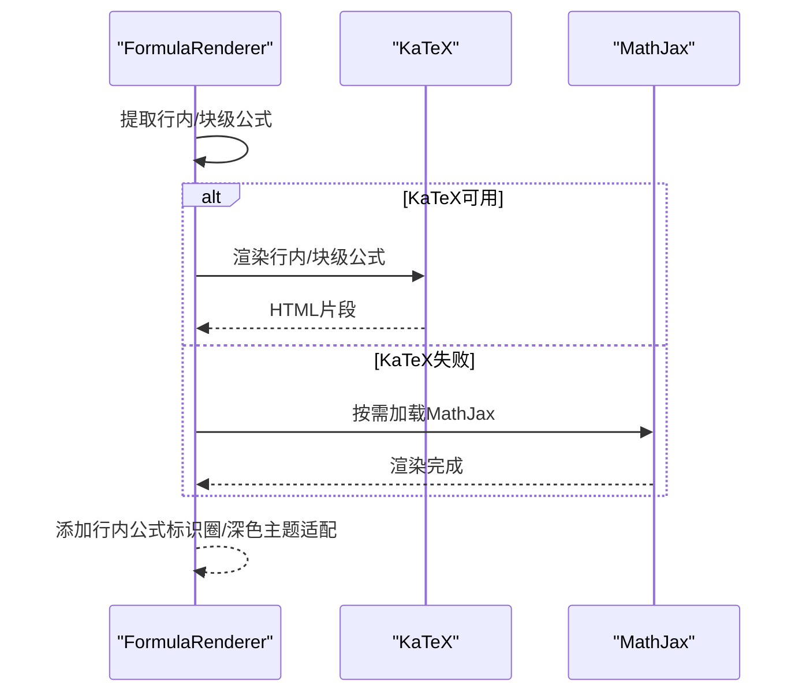
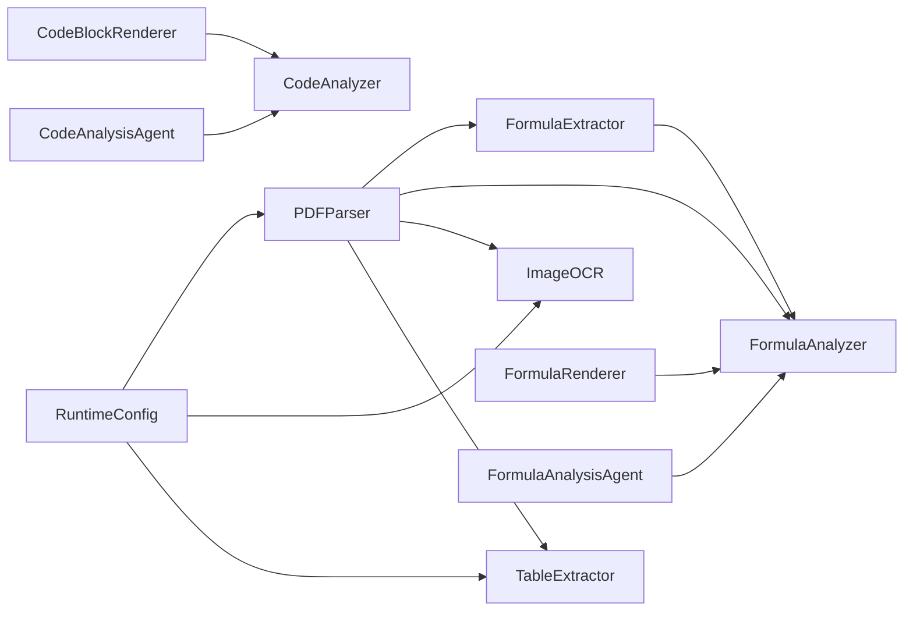

# 特殊内容处理

<cite>
**本文引用的文件**   
- [utils/formula_extractor.py](file://utils/formula_extractor.py)
- [utils/formula_analyzer.py](file://utils/formula_analyzer.py)
- [utils/image_ocr.py](file://utils/image_ocr.py)
- [utils/table_extractor.py](file://utils/table_extractor.py)
- [utils/code_analyzer.py](file://utils/code_analyzer.py)
- [agents/experts/formula_analysis_agent.py](file://agents/experts/formula_analysis_agent.py)
- [agents/experts/code_analysis_agent.py](file://agents/experts/code_analysis_agent.py)
- [web/components/message/FormulaRenderer.tsx](file://web/components/message/FormulaRenderer.tsx)
- [web/components/message/CodeBlockRenderer.tsx](file://web/components/message/CodeBlockRenderer.tsx)
- [parsers/pdf_parser.py](file://parsers/pdf_parser.py)
- [services/runtime_config.py](file://services/runtime_config.py)
- [requirements.txt](file://requirements.txt)
- [README.md](file://README.md)
</cite>

## 目录
1. [简介](#简介)
2. [项目结构](#项目结构)
3. [核心组件](#核心组件)
4. [架构总览](#架构总览)
5. [详细组件分析](#详细组件分析)
6. [依赖关系分析](#依赖关系分析)
7. [性能考虑](#性能考虑)
8. [故障排查指南](#故障排查指南)
9. [结论](#结论)
10. [附录](#附录)

## 简介
本技术文档聚焦“特殊内容处理”，围绕四大核心能力展开：LaTeX公式提取与分析、OCR图像识别与版面处理、表格结构识别与数据重建、代码分析与语法高亮。文档系统性说明各模块的实现原理、数据流、处理逻辑、性能优化策略，并提供配置参数、调优建议与常见问题解决方案，辅以实际使用案例与最佳实践。

## 项目结构
- 后端工具层（utils）：公式提取与分析、OCR、表格提取、代码分析等
- 代理专家层（agents/experts）：面向公式的专家Agent与代码分析Agent
- 前端渲染层（web/components/message）：公式渲染（KaTeX/MathJax降级）、代码块高亮
- 文档解析层（parsers）：PDF解析（文本/扫描版PDF），集成OCR、表格与公式增强
- 运行时配置（services/runtime_config.py）：模块开关与并发参数
- 依赖声明（requirements.txt）：第三方库与可选组件

**图表来源**
- [utils/formula_extractor.py:1-149](file://utils/formula_extractor.py#L1-L149)
- [utils/formula_analyzer.py:1-233](file://utils/formula_analyzer.py#L1-L233)
- [utils/image_ocr.py:1-224](file://utils/image_ocr.py#L1-L224)
- [utils/table_extractor.py:1-290](file://utils/table_extractor.py#L1-L290)
- [utils/code_analyzer.py:1-350](file://utils/code_analyzer.py#L1-L350)
- [agents/experts/formula_analysis_agent.py:1-107](file://agents/experts/formula_analysis_agent.py#L1-L107)
- [agents/experts/code_analysis_agent.py:1-79](file://agents/experts/code_analysis_agent.py#L1-L79)
- [web/components/message/FormulaRenderer.tsx:1-612](file://web/components/message/FormulaRenderer.tsx#L1-L612)
- [web/components/message/CodeBlockRenderer.tsx:1-119](file://web/components/message/CodeBlockRenderer.tsx#L1-L119)
- [parsers/pdf_parser.py:1-221](file://parsers/pdf_parser.py#L1-L221)
- [services/runtime_config.py:1-218](file://services/runtime_config.py#L1-L218)

**章节来源**
- [README.md:26-54](file://README.md#L26-L54)
- [requirements.txt:1-42](file://requirements.txt#L1-L42)

## 核心组件
- 公式提取与分析：识别LaTeX公式、规范化、变量/关系/函数提取、复杂度评估
- OCR图像识别：PaddleOCR封装、PDF图片提取与OCR、置信度统计
- 表格提取：Markdown/管道分隔表格识别、结构化重建、语义结构分析
- 代码分析：语言识别、函数/类/导入提取、变量与关键字、复杂度估算
- 前端渲染：KaTeX优先、MathJax降级、行内公式标识圈、代码块高亮与复制

**章节来源**
- [utils/formula_extractor.py:1-149](file://utils/formula_extractor.py#L1-L149)
- [utils/formula_analyzer.py:1-233](file://utils/formula_analyzer.py#L1-L233)
- [utils/image_ocr.py:1-224](file://utils/image_ocr.py#L1-L224)
- [utils/table_extractor.py:1-290](file://utils/table_extractor.py#L1-L290)
- [utils/code_analyzer.py:1-350](file://utils/code_analyzer.py#L1-L350)
- [web/components/message/FormulaRenderer.tsx:1-612](file://web/components/message/FormulaRenderer.tsx#L1-L612)
- [web/components/message/CodeBlockRenderer.tsx:1-119](file://web/components/message/CodeBlockRenderer.tsx#L1-L119)

## 架构总览
整体流程：解析器从PDF中提取文本与图片，保护公式不被清洗破坏；OCR对扫描版PDF图片进行识别；表格提取器识别表格结构；公式分析器抽取并分析公式；前端分别以KaTeX/MathJax渲染公式，以highlight.js渲染代码块。

**图表来源**
- [parsers/pdf_parser.py:103-214](file://parsers/pdf_parser.py#L103-L214)
- [utils/formula_extractor.py:106-130](file://utils/formula_extractor.py#L106-L130)
- [utils/formula_analyzer.py:212-231](file://utils/formula_analyzer.py#L212-L231)
- [utils/image_ocr.py:124-218](file://utils/image_ocr.py#L124-L218)
- [utils/table_extractor.py:10-31](file://utils/table_extractor.py#L10-L31)
- [web/components/message/FormulaRenderer.tsx:256-498](file://web/components/message/FormulaRenderer.tsx#L256-L498)

## 详细组件分析

### 公式提取与分析
- 提取器（FormulaExtractor）
  - 支持块级与行内LaTeX模式，避免重叠匹配，按出现位置排序返回
  - 规范化：统一数学符号编码，保证LaTeX兼容
  - 保护：在文本清洗阶段保留公式，避免被清理函数误删
  - 物理量检测：识别形如量值=单位的表达式
- 分析器（FormulaAnalyzer）
  - 变量：单字母、下标、正体/文本变量
  - 关系：等式/不等式，提取左右表达式
  - 函数：LaTeX命令与常见函数名
  - 结构：是否方程、是否含分数/根/积分/求和/矩阵等
  - 复杂度：基于运算符、函数、分数、根号计数分级

**图表来源**
- [utils/formula_extractor.py:28-130](file://utils/formula_extractor.py#L28-L130)
- [utils/formula_analyzer.py:32-191](file://utils/formula_analyzer.py#L32-L191)

**章节来源**
- [utils/formula_extractor.py:1-149](file://utils/formula_extractor.py#L1-L149)
- [utils/formula_analyzer.py:1-233](file://utils/formula_analyzer.py#L1-L233)

### OCR图像识别与版面分析
- 延迟初始化PaddleOCR，支持中英文，自动选择GPU/CPU
- PDF图片提取：使用PyMuPDF提取页面内嵌图片，临时文件写入与清理
- OCR结果聚合：按行合并文本、统计平均置信度、记录错误
- 版面分析：通过OCR结果的boxes定位文字框，为后续识别精度优化提供基础

**图表来源**
- [utils/image_ocr.py:15-37](file://utils/image_ocr.py#L15-L37)
- [utils/image_ocr.py:134-218](file://utils/image_ocr.py#L134-L218)
- [parsers/pdf_parser.py:137-151](file://parsers/pdf_parser.py#L137-L151)

**章节来源**
- [utils/image_ocr.py:1-224](file://utils/image_ocr.py#L1-L224)
- [parsers/pdf_parser.py:137-151](file://parsers/pdf_parser.py#L137-L151)

### 表格提取与数据重建
- 结构识别：Markdown表格（含分隔行）与管道分隔表格
- 数据重建：标准化行列数、去除多余空白、转义HTML
- 语义分析：行数/列数、表头、每列数据类型（纯数/混合/文本）、是否存在数值列

**图表来源**
- [utils/table_extractor.py:10-31](file://utils/table_extractor.py#L10-L31)
- [utils/table_extractor.py:134-172](file://utils/table_extractor.py#L134-L172)
- [utils/table_extractor.py:235-288](file://utils/table_extractor.py#L235-L288)

**章节来源**
- [utils/table_extractor.py:1-290](file://utils/table_extractor.py#L1-L290)
- [parsers/pdf_parser.py:177-193](file://parsers/pdf_parser.py#L177-L193)

### 代码分析与语法高亮
- 语言识别：基于关键字与语法特征判断（Python/JS/Java/C++）
- 代码块高亮：前端使用highlight.js，支持复制功能
- 语义抽取：函数/类/导入/变量/关键字，估算复杂度（行数、控制结构、函数数量）

**图表来源**
- [utils/code_analyzer.py:18-350](file://utils/code_analyzer.py#L18-L350)
- [web/components/message/CodeBlockRenderer.tsx:1-119](file://web/components/message/CodeBlockRenderer.tsx#L1-L119)

**章节来源**
- [utils/code_analyzer.py:1-350](file://utils/code_analyzer.py#L1-L350)
- [web/components/message/CodeBlockRenderer.tsx:1-119](file://web/components/message/CodeBlockRenderer.tsx#L1-L119)

### 前端公式渲染与代码块高亮
- 公式渲染（FormulaRenderer）
  - 优先使用KaTeX渲染，行内公式加“公式”标识圈，块级公式居中展示
  - KaTeX失败时按需加载MathJax，配置CDN与错误处理，禁用localStorage与菜单以提升稳定性
- 代码块渲染（CodeBlockRenderer）
  - highlight.js高亮，支持复制按钮与语言显示名映射

**图表来源**
- [web/components/message/FormulaRenderer.tsx:256-498](file://web/components/message/FormulaRenderer.tsx#L256-L498)

**章节来源**
- [web/components/message/FormulaRenderer.tsx:1-612](file://web/components/message/FormulaRenderer.tsx#L1-L612)
- [web/components/message/CodeBlockRenderer.tsx:1-119](file://web/components/message/CodeBlockRenderer.tsx#L1-L119)

## 依赖关系分析
- 工具层内部低耦合，通过解析器与Agent串联
- PDF解析器依赖公式/表格/OCR工具，受运行时配置控制模块开关
- 前端渲染组件独立于后端，通过消息内容驱动

**图表来源**
- [parsers/pdf_parser.py:103-214](file://parsers/pdf_parser.py#L103-L214)
- [services/runtime_config.py:15-83](file://services/runtime_config.py#L15-L83)
- [web/components/message/FormulaRenderer.tsx:1-612](file://web/components/message/FormulaRenderer.tsx#L1-L612)
- [web/components/message/CodeBlockRenderer.tsx:1-119](file://web/components/message/CodeBlockRenderer.tsx#L1-L119)

**章节来源**
- [requirements.txt:1-42](file://requirements.txt#L1-L42)
- [services/runtime_config.py:1-218](file://services/runtime_config.py#L1-L218)

## 性能考虑
- OCR并发与延迟初始化
  - 延迟初始化避免无用占用；并发参数由运行时配置控制
  - 建议：扫描版PDF较多时适当提高并发，注意I/O与内存峰值
- 公式/表格处理
  - 文本清洗阶段先保护公式，减少重复处理成本
  - 表格标准化时按最大列数补齐，避免后续重建开销
- 前端渲染
  - KaTeX优先，MathJax按需加载；CDN失败自动切换并记录日志
  - 深色主题下字体颜色与边框优化，减少闪烁与重绘

**章节来源**
- [utils/image_ocr.py:15-37](file://utils/image_ocr.py#L15-L37)
- [services/runtime_config.py:25-83](file://services/runtime_config.py#L25-L83)
- [web/components/message/FormulaRenderer.tsx:83-146](file://web/components/message/FormulaRenderer.tsx#L83-L146)

## 故障排查指南
- OCR未初始化或失败
  - 现象：返回错误信息或空文本
  - 排查：确认PaddleOCR已安装；检查图片路径存在性；查看日志异常堆栈
- PDF扫描版未提取到文本
  - 现象：所有页面文本为空
  - 排查：确认OCR模块已启用；检查PDF图片提取与OCR链路；关注置信度与错误日志
- 表格识别不准确
  - 现象：列数不一致或表头缺失
  - 排查：检查表格分隔符与分隔行格式；确认标准化补全逻辑
- 公式渲染异常
  - 现象：部分公式显示为错误或未渲染
  - 排查：KaTeX报错时自动降级MathJax；检查CDN加载与字体错误；确认公式内容合法性
- 语言识别偏差
  - 现象：函数/类/导入提取不准确
  - 排查：检查语言特征关键字；必要时显式传入语言参数

**章节来源**
- [utils/image_ocr.py:31-36](file://utils/image_ocr.py#L31-L36)
- [parsers/pdf_parser.py:173-176](file://parsers/pdf_parser.py#L173-L176)
- [utils/table_extractor.py:158-172](file://utils/table_extractor.py#L158-L172)
- [web/components/message/FormulaRenderer.tsx:395-498](file://web/components/message/FormulaRenderer.tsx#L395-L498)
- [utils/code_analyzer.py:18-47](file://utils/code_analyzer.py#L18-L47)

## 结论
该系统通过“工具层+解析层+Agent层+前端渲染”的协同，实现了对公式、OCR、表格与代码的全链路处理。其设计强调模块解耦、运行时可配置、前端渲染稳健性与性能优化，适合在文档密集场景中提供高质量的特殊内容处理能力。

## 附录

### 配置参数与调优建议
- 运行时模块开关
  - kg_extract_enabled/kg_retrieve_enabled/query_analyze_enabled/rerank_enabled/ocr_image_enabled/table_parse_enabled/embedding_enabled
  - 建议：生产环境开启OCR与表格解析，结合并发参数平衡吞吐与资源
- 并发与批处理
  - embedding_batch_size、embedding_concurrency、ocr_concurrency
  - 建议：根据GPU/CPU核数与显存设定，避免过载
- 依赖安装
  - PaddleOCR需单独安装；PDF解析依赖PyMuPDF；代码高亮依赖highlight.js

**章节来源**
- [services/runtime_config.py:15-83](file://services/runtime_config.py#L15-L83)
- [requirements.txt:2-29](file://requirements.txt#L2-L29)

### 实际使用案例与最佳实践
- 案例1：扫描版PDF入库
  - 启用OCR模块；解析器自动提取图片并OCR；合并OCR文本与元数据
  - 建议：批量上传时设置合理并发；监控置信度分布
- 案例2：论文中公式与表格
  - 解析器保护公式；公式分析器抽取变量与关系；表格提取器重建结构
  - 建议：前端使用KaTeX渲染，异常时自动降级MathJax
- 案例3：技术文档中的代码示例
  - 代码分析Agent识别语言与结构；前端高亮渲染并支持复制
  - 建议：明确语言参数，避免误判

**章节来源**
- [parsers/pdf_parser.py:103-214](file://parsers/pdf_parser.py#L103-L214)
- [web/components/message/FormulaRenderer.tsx:256-498](file://web/components/message/FormulaRenderer.tsx#L256-L498)
- [web/components/message/CodeBlockRenderer.tsx:1-119](file://web/components/message/CodeBlockRenderer.tsx#L1-L119)