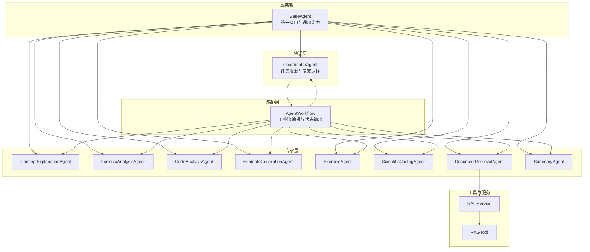
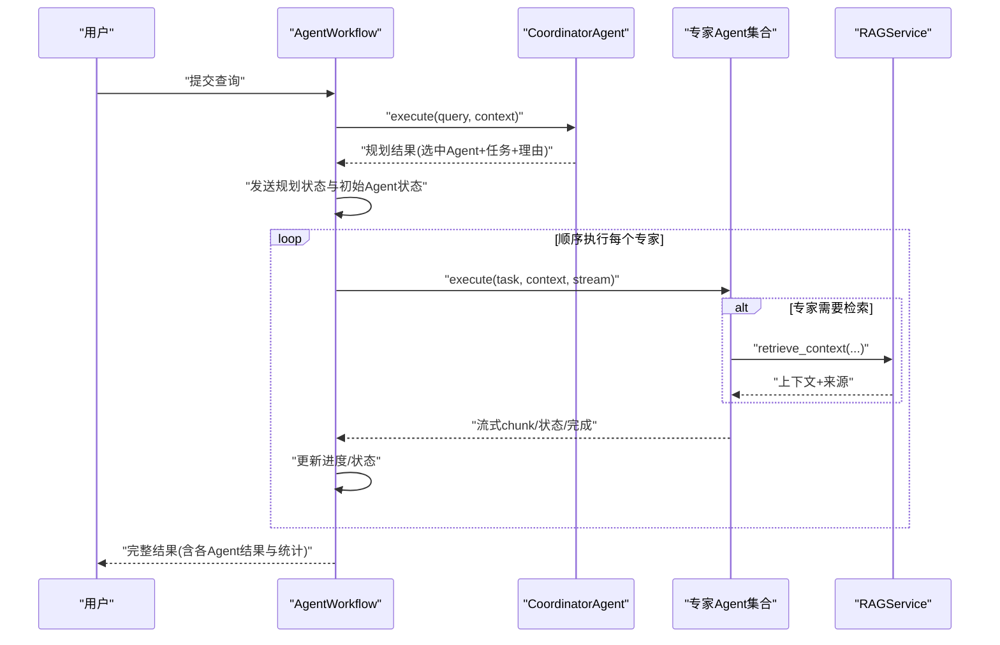
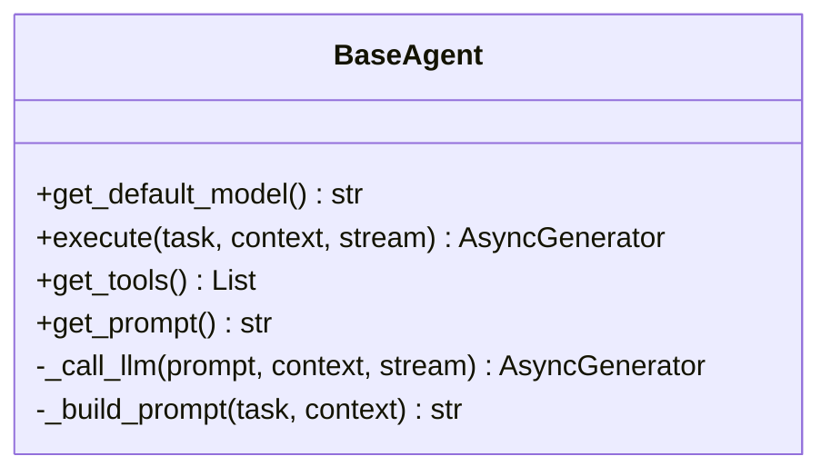
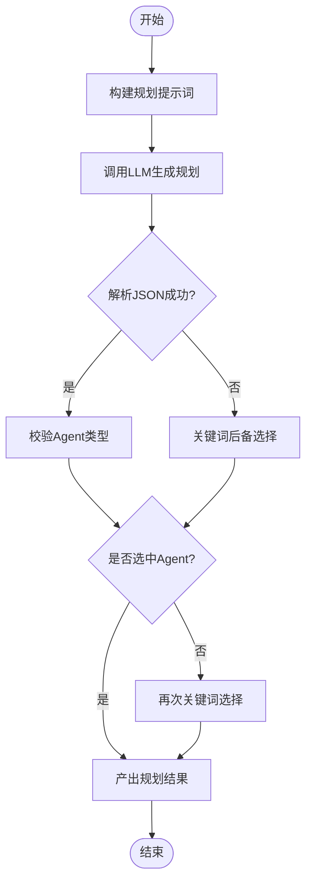
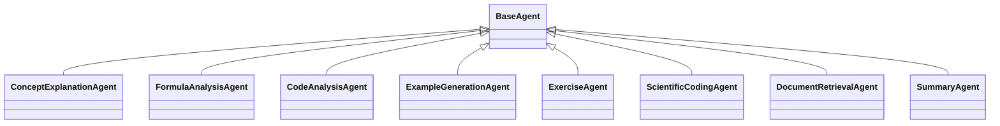
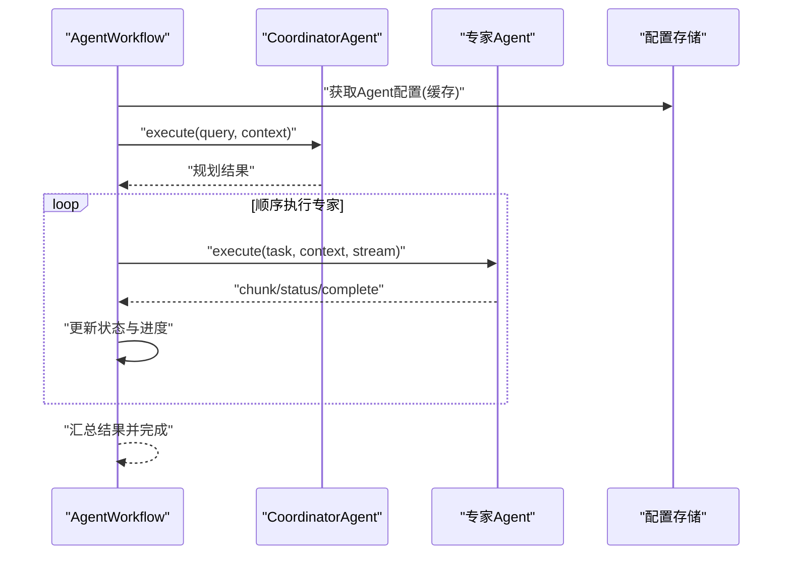
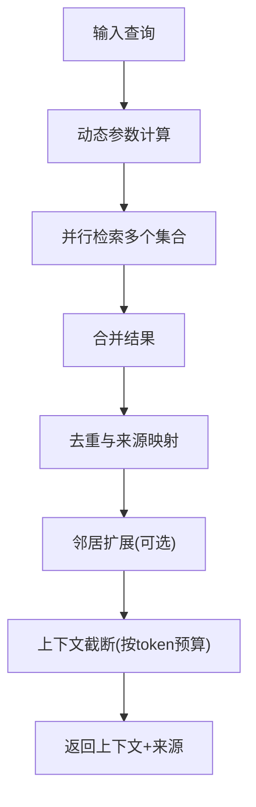
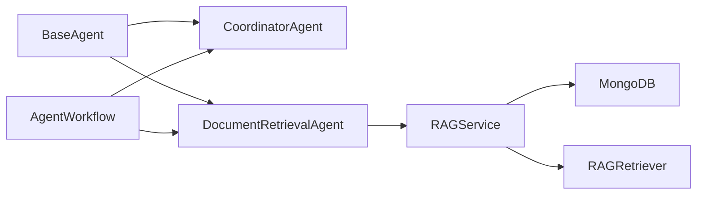

# Agent协作机制

<cite>
**本文引用的文件**
- [agents/base/base_agent.py](file://agents/base/base_agent.py)
- [agents/coordinator/coordinator_agent.py](file://agents/coordinator/coordinator_agent.py)
- [agents/workflow/agent_workflow.py](file://agents/workflow/agent_workflow.py)
- [models/agent_config.py](file://models/agent_config.py)
- [agents/experts/code_analysis_agent.py](file://agents/experts/code_analysis_agent.py)
- [agents/experts/concept_explanation_agent.py](file://agents/experts/concept_explanation_agent.py)
- [agents/experts/document_retrieval_agent.py](file://agents/experts/document_retrieval_agent.py)
- [agents/experts/formula_analysis_agent.py](file://agents/experts/formula_analysis_agent.py)
- [agents/experts/example_generation_agent.py](file://agents/experts/example_generation_agent.py)
- [agents/experts/exercise_agent.py](file://agents/experts/exercise_agent.py)
- [agents/experts/summary_agent.py](file://agents/experts/summary_agent.py)
- [agents/experts/scientific_coding_agent.py](file://agents/experts/scientific_coding_agent.py)
- [agents/tools/rag_tool.py](file://agents/tools/rag_tool.py)
- [services/rag_service.py](file://services/rag_service.py)
- [main.py](file://main.py)
</cite>

## 目录
1. [引言](#引言)
2. [项目结构](#项目结构)
3. [核心组件](#核心组件)
4. [架构总览](#架构总览)
5. [详细组件分析](#详细组件分析)
6. [依赖分析](#依赖分析)
7. [性能考虑](#性能考虑)
8. [故障排查指南](#故障排查指南)
9. [结论](#结论)
10. [附录](#附录)

## 引言
本文件系统性阐述多Agent协作机制的技术设计与实现细节，涵盖Agent类型分类、职责分工、通信协议、协调Agent工作流、任务调度与并行执行、错误处理、专家Agent选择策略（能力匹配、负载均衡、性能优化），以及可操作的配置参数与调试技巧。读者可据此理解如何在本项目中扩展新的Agent类型、优化工作流性能与稳定性。

## 项目结构
本项目的Agent体系采用“基类抽象 + 协调器 + 专家Agent + 工作流编排”的分层组织方式：
- 基类层：定义统一接口与通用能力（如提示词构建、LLM调用、工具与提示词扩展）
- 协调层：负责任务规划、专家选择、任务拆分与结果整合
- 专家层：面向具体任务域的Agent（代码分析、公式分析、概念解释、示例生成、习题、科学计算、文档检索、总结）
- 编排层：串联协调与专家，提供统一的异步工作流接口，支持流式状态与结果输出
- 工具与服务：RAG检索工具与服务，支撑文档检索与上下文生成

图表来源
- [agents/base/base_agent.py:1-122](file://agents/base/base_agent.py#L1-L122)
- [agents/coordinator/coordinator_agent.py:1-252](file://agents/coordinator/coordinator_agent.py#L1-L252)
- [agents/workflow/agent_workflow.py:1-388](file://agents/workflow/agent_workflow.py#L1-L388)
- [agents/experts/concept_explanation_agent.py:1-70](file://agents/experts/concept_explanation_agent.py#L1-L70)
- [agents/experts/formula_analysis_agent.py:1-107](file://agents/experts/formula_analysis_agent.py#L1-L107)
- [agents/experts/code_analysis_agent.py:1-79](file://agents/experts/code_analysis_agent.py#L1-L79)
- [agents/experts/example_generation_agent.py:1-68](file://agents/experts/example_generation_agent.py#L1-L68)
- [agents/experts/exercise_agent.py:1-102](file://agents/experts/exercise_agent.py#L1-L102)
- [agents/experts/scientific_coding_agent.py:1-82](file://agents/experts/scientific_coding_agent.py#L1-L82)
- [agents/experts/document_retrieval_agent.py:1-79](file://agents/experts/document_retrieval_agent.py#L1-L79)
- [agents/experts/summary_agent.py:1-87](file://agents/experts/summary_agent.py#L1-L87)
- [agents/tools/rag_tool.py:1-58](file://agents/tools/rag_tool.py#L1-L58)
- [services/rag_service.py:1-323](file://services/rag_service.py#L1-L323)

章节来源
- [agents/base/base_agent.py:1-122](file://agents/base/base_agent.py#L1-L122)
- [agents/coordinator/coordinator_agent.py:1-252](file://agents/coordinator/coordinator_agent.py#L1-L252)
- [agents/workflow/agent_workflow.py:1-388](file://agents/workflow/agent_workflow.py#L1-L388)
- [services/rag_service.py:1-323](file://services/rag_service.py#L1-L323)

## 核心组件
- 基类BaseAgent：定义统一的异步执行接口、提示词构建、LLM调用封装、工具与提示词扩展能力，为所有Agent提供一致的抽象与复用能力。
- 协调AgentCoordinatorAgent：负责接收用户问题，解析并选择必要的专家Agent，生成任务分配与理由；支持JSON解析失败时的后备选择逻辑。
- 专家Agent：覆盖概念解释、公式分析、代码分析、示例生成、习题、科学计算、文档检索、总结等任务域，每个Agent聚焦特定能力边界。
- 工作流编排AgentWorkflow：串联协调与专家，提供统一的异步执行接口，支持流式状态输出（规划、执行中、完成、错误）、进度估算、错误聚合与最终结果汇总。
- RAG工具与服务：RAGTool与RAGService提供检索、上下文拼接、邻居扩展、去重与截断等能力，支撑文档检索专家Agent与上层编排。

章节来源
- [agents/base/base_agent.py:1-122](file://agents/base/base_agent.py#L1-L122)
- [agents/coordinator/coordinator_agent.py:1-252](file://agents/coordinator/coordinator_agent.py#L1-L252)
- [agents/workflow/agent_workflow.py:1-388](file://agents/workflow/agent_workflow.py#L1-L388)
- [agents/experts/document_retrieval_agent.py:1-79](file://agents/experts/document_retrieval_agent.py#L1-L79)
- [agents/tools/rag_tool.py:1-58](file://agents/tools/rag_tool.py#L1-L58)
- [services/rag_service.py:1-323](file://services/rag_service.py#L1-L323)

## 架构总览
多Agent协作遵循“协调-执行-整合”的流水线式架构：
- 协调阶段：CoordinatorAgent基于用户问题与内置规则选择专家Agent，产出“选中Agent列表+任务描述+理由”
- 执行阶段：AgentWorkflow顺序驱动专家Agent执行，实时输出状态与增量结果，支持流式输出
- 整合阶段：可选的SummaryAgent对各专家结果进行归纳总结，形成最终回答

图表来源
- [agents/workflow/agent_workflow.py:106-336](file://agents/workflow/agent_workflow.py#L106-L336)
- [agents/coordinator/coordinator_agent.py:55-168](file://agents/coordinator/coordinator_agent.py#L55-L168)
- [agents/experts/document_retrieval_agent.py:25-78](file://agents/experts/document_retrieval_agent.py#L25-L78)
- [services/rag_service.py:34-266](file://services/rag_service.py#L34-L266)

## 详细组件分析

### 基类BaseAgent
- 设计要点
  - 统一的异步execute接口，支持流式输出
  - 内置提示词构建与LLM调用封装，便于子类快速接入
  - 可扩展工具与提示词，增强Agent能力
- 关键行为
  - _call_llm：封装OllamaService的异步生成
  - _build_prompt：将系统提示词与上下文拼接
  - get_default_model/get_prompt：子类覆写以定制模型与角色
- 复杂度与性能
  - LLM调用为I/O密集，整体复杂度取决于提示词长度与流式输出频率
  - 建议在子类中进行上下文裁剪与结构化提示，降低token消耗

图表来源
- [agents/base/base_agent.py:8-122](file://agents/base/base_agent.py#L8-L122)

章节来源
- [agents/base/base_agent.py:1-122](file://agents/base/base_agent.py#L1-L122)

### 协调AgentCoordinatorAgent
- 职责与流程
  - 输入：用户问题与上下文
  - 输出：选中的专家Agent列表、每个Agent的具体任务、选择理由
  - 机制：基于JSON规划与关键词后备选择，保证鲁棒性
- 选择策略
  - 优先解析LLM返回的JSON规划
  - 若失败，按关键词匹配自动选择（文档检索、公式分析、代码分析、概念解释、示例生成、习题、科学计算、总结）
  - 复杂问题自动附加总结Agent
- 错误处理
  - JSON解析失败时降级为关键词匹配
  - 无效Agent类型过滤与默认Agent兜底

图表来源
- [agents/coordinator/coordinator_agent.py:55-213](file://agents/coordinator/coordinator_agent.py#L55-L213)

章节来源
- [agents/coordinator/coordinator_agent.py:1-252](file://agents/coordinator/coordinator_agent.py#L1-L252)

### 专家Agent家族
- 概念解释Agent：面向物理概念的深入解释，强调定义、物理意义、应用与关联
- 公式分析Agent：识别并解释LaTeX/行内公式，提供变量含义、适用条件与推导
- 代码分析Agent：分析代码功能、逻辑与改进建议，自动判定是否需要代码分析
- 示例生成Agent：生成从简单到复杂的应用示例与解题过程
- 习题Agent：区分“出题”与“解题”，提供多种题型与详细解题步骤
- 科学计算Agent：生成符合学术规范的MATLAB/Python科学计算代码
- 文档检索Agent：调用RAG服务检索上下文并总结来源
- 总结Agent：对多Agent结果进行归纳提炼

图表来源
- [agents/base/base_agent.py:8-122](file://agents/base/base_agent.py#L8-L122)
- [agents/experts/concept_explanation_agent.py:7-70](file://agents/experts/concept_explanation_agent.py#L7-L70)
- [agents/experts/formula_analysis_agent.py:8-107](file://agents/experts/formula_analysis_agent.py#L8-L107)
- [agents/experts/code_analysis_agent.py:7-79](file://agents/experts/code_analysis_agent.py#L7-L79)
- [agents/experts/example_generation_agent.py:7-68](file://agents/experts/example_generation_agent.py#L7-L68)
- [agents/experts/exercise_agent.py:7-102](file://agents/experts/exercise_agent.py#L7-L102)
- [agents/experts/scientific_coding_agent.py:7-82](file://agents/experts/scientific_coding_agent.py#L7-L82)
- [agents/experts/document_retrieval_agent.py:8-79](file://agents/experts/document_retrieval_agent.py#L8-L79)
- [agents/experts/summary_agent.py:7-87](file://agents/experts/summary_agent.py#L7-L87)

章节来源
- [agents/experts/concept_explanation_agent.py:1-70](file://agents/experts/concept_explanation_agent.py#L1-L70)
- [agents/experts/formula_analysis_agent.py:1-107](file://agents/experts/formula_analysis_agent.py#L1-L107)
- [agents/experts/code_analysis_agent.py:1-79](file://agents/experts/code_analysis_agent.py#L1-L79)
- [agents/experts/example_generation_agent.py:1-68](file://agents/experts/example_generation_agent.py#L1-L68)
- [agents/experts/exercise_agent.py:1-102](file://agents/experts/exercise_agent.py#L1-L102)
- [agents/experts/scientific_coding_agent.py:1-82](file://agents/experts/scientific_coding_agent.py#L1-L82)
- [agents/experts/document_retrieval_agent.py:1-79](file://agents/experts/document_retrieval_agent.py#L1-L79)
- [agents/experts/summary_agent.py:1-87](file://agents/experts/summary_agent.py#L1-L87)

### 工作流编排AgentWorkflow
- 职责与流程
  - 初始化协调Agent与专家Agent（延迟加载与配置缓存）
  - 规划阶段：接收CoordinatorAgent的规划结果，发送规划状态与初始Agent状态
  - 执行阶段：顺序驱动专家Agent执行，实时输出状态与增量结果，支持流式输出
  - 整合阶段：汇总各专家结果，产出最终完成事件
- 任务调度与并行
  - 当前实现为顺序执行，便于前端实时反馈与进度展示
  - 可扩展为并行执行（需注意状态一致性与结果合并）
- 错误处理
  - 单Agent异常不影响整体流程，记录错误并继续后续Agent
  - 统一错误事件输出，便于前端展示

图表来源
- [agents/workflow/agent_workflow.py:106-336](file://agents/workflow/agent_workflow.py#L106-L336)

章节来源
- [agents/workflow/agent_workflow.py:1-388](file://agents/workflow/agent_workflow.py#L1-L388)

### RAG工具与服务
- RAGTool
  - LangChain工具封装，提供同步与异步两种执行方式
  - 异步优先，同步场景下提示使用异步执行
- RAGService
  - 动态检索参数（基于查询特征调整预取与最终K）
  - 并行检索多知识空间集合
  - 邻居扩展、去重、按分数排序、上下文截断
  - 支持对话附件与普通文档混合来源

图表来源
- [services/rag_service.py:34-266](file://services/rag_service.py#L34-L266)
- [agents/tools/rag_tool.py:17-55](file://agents/tools/rag_tool.py#L17-L55)

章节来源
- [agents/tools/rag_tool.py:1-58](file://agents/tools/rag_tool.py#L1-L58)
- [services/rag_service.py:1-323](file://services/rag_service.py#L1-L323)

## 依赖分析
- 组件耦合
  - BaseAgent为所有专家Agent的共同基类，耦合度低、内聚性强
  - CoordinatorAgent依赖LLM与正则/JSON解析，与具体专家类型通过字符串类型解耦
  - AgentWorkflow通过映射表管理专家Agent实例，支持延迟初始化与配置缓存
  - 文档检索专家依赖RAGService，RAGService依赖数据库与检索器
- 外部依赖
  - LLM服务（OllamaService封装）
  - 数据库（MongoDB，用于Agent配置与文档信息）
  - 检索器（RAGRetriever，支持向量化检索与重排）

图表来源
- [agents/base/base_agent.py:1-122](file://agents/base/base_agent.py#L1-L122)
- [agents/coordinator/coordinator_agent.py:1-252](file://agents/coordinator/coordinator_agent.py#L1-L252)
- [agents/workflow/agent_workflow.py:1-388](file://agents/workflow/agent_workflow.py#L1-L388)
- [agents/experts/document_retrieval_agent.py:1-79](file://agents/experts/document_retrieval_agent.py#L1-L79)
- [services/rag_service.py:1-323](file://services/rag_service.py#L1-L323)

章节来源
- [agents/workflow/agent_workflow.py:18-44](file://agents/workflow/agent_workflow.py#L18-L44)
- [services/rag_service.py:58-95](file://services/rag_service.py#L58-L95)

## 性能考虑
- 检索性能
  - 动态参数：根据查询长度与特征（对比/列举/条款）调整预取与最终K，平衡召回与延迟
  - 并行检索：多知识空间集合并行检索，提升吞吐
  - 邻居扩展：对命中chunk拉取前后窗口，增强上下文但需控制token预算
- LLM调用
  - 流式输出：减少首字节延迟，提升用户体验
  - 提示词优化：结构化提示、上下文裁剪、固定模板，降低token与延迟
- 工作流执行
  - 顺序执行利于状态可观测性；若需吞吐优先，可引入并行执行与结果合并
  - 配置缓存：避免重复查询数据库，降低冷启动开销
- 错误恢复
  - 检索失败可回退到无上下文模式，保障服务连续性

[本节为通用性能讨论，无需列出章节来源]

## 故障排查指南
- 协调Agent规划失败
  - 现象：返回error事件或未选中Agent
  - 排查：确认LLM可用性、提示词格式、JSON解析正则；检查关键词匹配逻辑
  - 参考路径：[agents/coordinator/coordinator_agent.py:102-168](file://agents/coordinator/coordinator_agent.py#L102-L168)
- 专家Agent执行异常
  - 现象：单Agent状态为error，工作流继续
  - 排查：查看Agent内部日志、上下文完整性、工具调用（如RAG）
  - 参考路径：[agents/experts/document_retrieval_agent.py:32-77](file://agents/experts/document_retrieval_agent.py#L32-L77)
- RAG检索异常
  - 现象：检索失败或返回空上下文
  - 排查：确认集合名称、知识空间配置、数据库连通性；必要时启用回退
  - 参考路径：[services/rag_service.py:294-317](file://services/rag_service.py#L294-L317)
- 工作流状态不一致
  - 现象：前端状态与后端不一致
  - 排查：检查顺序执行逻辑、状态事件发送时机、进度估算
  - 参考路径：[agents/workflow/agent_workflow.py:218-336](file://agents/workflow/agent_workflow.py#L218-L336)

章节来源
- [agents/coordinator/coordinator_agent.py:102-168](file://agents/coordinator/coordinator_agent.py#L102-L168)
- [agents/experts/document_retrieval_agent.py:32-77](file://agents/experts/document_retrieval_agent.py#L32-L77)
- [services/rag_service.py:294-317](file://services/rag_service.py#L294-L317)
- [agents/workflow/agent_workflow.py:218-336](file://agents/workflow/agent_workflow.py#L218-L336)

## 结论
本项目通过“基类抽象 + 协调 + 专家 + 编排”的分层设计，实现了可扩展、可观测、可恢复的多Agent协作机制。协调Agent负责智能选择与任务拆分，专家Agent聚焦具体任务域，工作流编排提供统一的执行与状态输出接口。配合RAG服务的动态检索与上下文管理，系统在复杂问题处理上具备良好的鲁棒性与性能表现。未来可在保持现有顺序执行优势的同时，探索并行执行与结果融合，进一步提升吞吐与响应速度。

[本节为总结性内容，无需列出章节来源]

## 附录

### Agent类型与职责对照
- 概念解释：深入解释物理概念与关系
- 公式分析：识别并解释数学/物理公式
- 代码分析：分析代码逻辑与改进建议
- 示例生成：生成从简单到复杂的应用示例
- 习题：出题与解题，提供详细步骤
- 科学计算：生成学术规范的代码实现
- 文档检索：检索上下文并总结来源
- 总结：对多Agent结果进行归纳提炼

章节来源
- [agents/experts/concept_explanation_agent.py:14-23](file://agents/experts/concept_explanation_agent.py#L14-L23)
- [agents/experts/formula_analysis_agent.py:15-24](file://agents/experts/formula_analysis_agent.py#L15-L24)
- [agents/experts/code_analysis_agent.py:14-23](file://agents/experts/code_analysis_agent.py#L14-L23)
- [agents/experts/example_generation_agent.py:14-22](file://agents/experts/example_generation_agent.py#L14-L22)
- [agents/experts/exercise_agent.py:14-26](file://agents/experts/exercise_agent.py#L14-L26)
- [agents/experts/scientific_coding_agent.py:14-29](file://agents/experts/scientific_coding_agent.py#L14-L29)
- [agents/experts/document_retrieval_agent.py:15-23](file://agents/experts/document_retrieval_agent.py#L15-L23)
- [agents/experts/summary_agent.py:14-22](file://agents/experts/summary_agent.py#L14-L22)

### 配置参数与调试技巧
- Agent配置模型
  - 字段：agent_type、inference_model、embedding_model
  - 用途：统一管理各Agent的推理与向量化模型
  - 参考路径：[models/agent_config.py:6-23](file://models/agent_config.py#L6-L23)
- 工作流配置加载
  - 从数据库读取Agent配置，支持缓存与回退
  - 参考路径：[agents/workflow/agent_workflow.py:18-44](file://agents/workflow/agent_workflow.py#L18-L44)
- 调试建议
  - 启用详细日志，关注规划阶段与执行阶段的关键事件
  - 对复杂查询逐步缩小Agent集合，定位瓶颈
  - 使用流式输出观察进度与状态变化，及时发现异常

章节来源
- [models/agent_config.py:1-24](file://models/agent_config.py#L1-L24)
- [agents/workflow/agent_workflow.py:18-44](file://agents/workflow/agent_workflow.py#L18-L44)