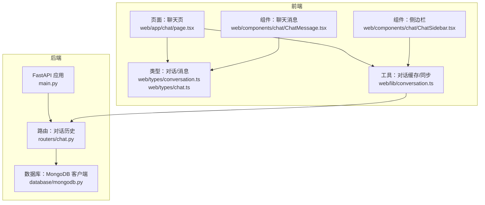
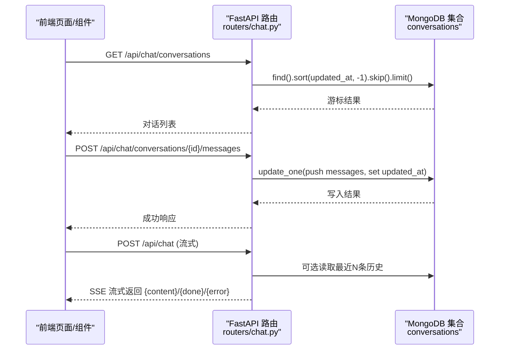
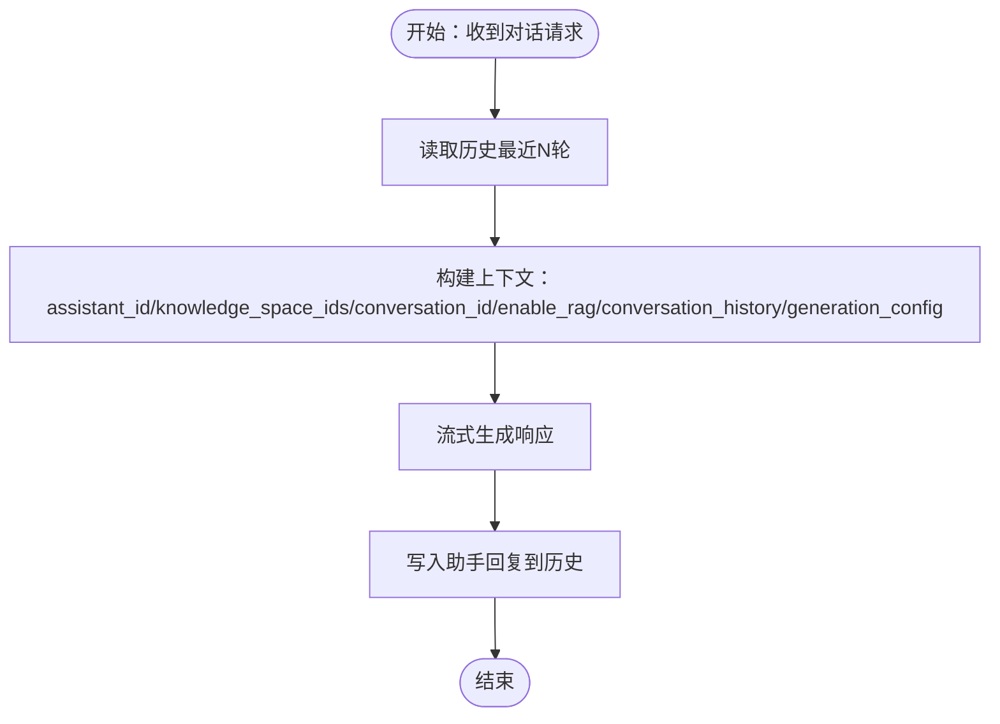
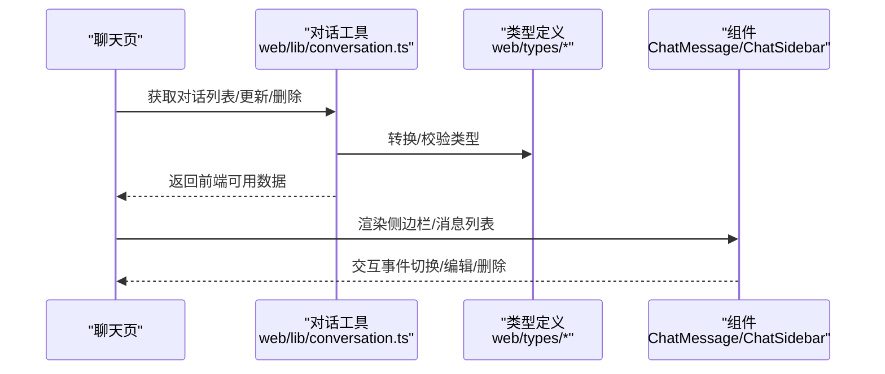
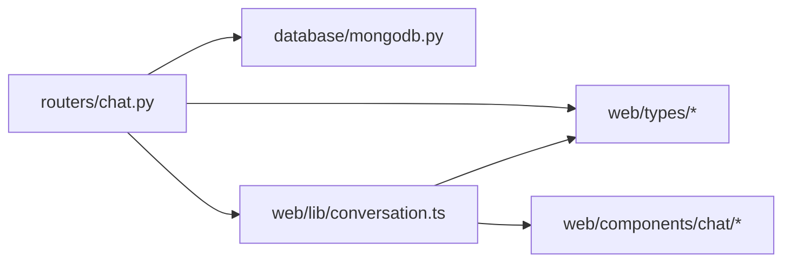

# 对话历史管理

<cite>
**本文引用的文件**
- [main.py](file://main.py)
- [chat.py](file://routers/chat.py)
- [mongodb.py](file://database/mongodb.py)
- [conversation.ts](file://web/lib/conversation.ts)
- [conversation.ts 类型定义](file://web/types/conversation.ts)
- [chat.ts 类型定义](file://web/types/chat.ts)
- [页面：聊天页](file://web/app/chat/page.tsx)
- [组件：聊天消息](file://web/components/chat/ChatMessage.tsx)
- [组件：侧边栏](file://web/components/chat/ChatSidebar.tsx)
- [组件：流式文本](file://web/components/message/StreamingText.tsx)
</cite>

## 目录
1. [简介](#简介)
2. [项目结构](#项目结构)
3. [核心组件](#核心组件)
4. [架构总览](#架构总览)
5. [详细组件分析](#详细组件分析)
6. [依赖分析](#依赖分析)
7. [性能考虑](#性能考虑)
8. [故障排查指南](#故障排查指南)
9. [结论](#结论)
10. [附录](#附录)

## 简介
本文件围绕“对话历史管理”主题，系统梳理后端基于 MongoDB 的对话持久化、历史维护与查询、上下文构建策略，以及前端对话历史的展示与状态同步机制。重点涵盖：
- 存储设计与索引优化、查询性能
- 历史记录维护（消息序列化、元数据管理、版本控制思路）
- 上下文构建（上下文窗口、重要性排序、内存优化）
- 前端展示（消息渲染、状态同步、体验优化）

## 项目结构
后端采用 FastAPI + Motor 异步驱动，对话历史集中在 conversations 集合；前端 Next.js 应用负责对话历史的展示与交互。

图表来源
- [main.py:1-171](file://main.py#L1-L171)
- [chat.py:1-1342](file://routers/chat.py#L1-L1342)
- [mongodb.py:1-1341](file://database/mongodb.py#L1-L1341)
- [conversation.ts:1-129](file://web/lib/conversation.ts#L1-L129)
- [conversation.ts 类型定义:1-10](file://web/types/conversation.ts#L1-L10)
- [chat.ts 类型定义:1-99](file://web/types/chat.ts#L1-L99)
- [页面：聊天页:1-200](file://web/app/chat/page.tsx#L1-L200)
- [组件：聊天消息:1-200](file://web/components/chat/ChatMessage.tsx#L1-L200)
- [组件：侧边栏:1-200](file://web/components/chat/ChatSidebar.tsx#L1-L200)

章节来源
- [main.py:90-99](file://main.py#L90-L99)
- [chat.py:152-195](file://routers/chat.py#L152-L195)
- [mongodb.py:92-201](file://database/mongodb.py#L92-L201)

## 核心组件
- 对话集合与消息模型
  - 集合：conversations
  - 字段要点：id、user_id、title、messages（数组）、created_at、updated_at
  - 消息子结构：message_id、role、content、timestamp、sources、recommended_resources
- 路由与业务逻辑
  - 创建/读取/更新/删除对话
  - 添加/编辑/删除消息
  - 重新生成回答（截断历史）
  - 对话流式响应（携带 sources/recommended_resources）
- 数据库连接与依赖注入
  - 异步客户端 MongoDB（Motor）
  - require_mongodb 依赖注入，保障连接可用
- 前端类型与状态
  - 对话/消息类型定义
  - 本地缓存与 API 同步
  - 页面与组件渲染

章节来源
- [chat.py:29-82](file://routers/chat.py#L29-L82)
- [chat.py:97-150](file://routers/chat.py#L97-L150)
- [chat.py:197-246](file://routers/chat.py#L197-L246)
- [chat.py:248-352](file://routers/chat.py#L248-L352)
- [chat.py:458-539](file://routers/chat.py#L458-L539)
- [chat.py:541-621](file://routers/chat.py#L541-L621)
- [chat.py:623-760](file://routers/chat.py#L623-L760)
- [mongodb.py:207-223](file://database/mongodb.py#L207-L223)
- [conversation.ts 类型定义:1-10](file://web/types/conversation.ts#L1-L10)
- [chat.ts 类型定义:21-34](file://web/types/chat.ts#L21-L34)

## 架构总览
后端通过 FastAPI 路由暴露对话历史接口，MongoDB 作为持久化存储；前端通过 API 获取/更新对话与消息，并在本地进行缓存与状态同步。

图表来源
- [chat.py:152-195](file://routers/chat.py#L152-L195)
- [chat.py:248-352](file://routers/chat.py#L248-L352)
- [chat.py:623-760](file://routers/chat.py#L623-L760)

## 详细组件分析

### 存储设计与索引优化
- 集合与字段
  - 集合：conversations
  - 关键字段：_id、user_id、title、messages、created_at、updated_at
  - 消息数组：message_id、role、content、timestamp、sources、recommended_resources
- 索引建议
  - 基于业务查询模式，建议以下索引以提升性能：
    - user_id + updated_at（倒序）：用于按用户筛选并按更新时间排序
    - updated_at（倒序）：用于全局列表按时间排序
    - created_at（倒序）：用于创建时间排序
    - messages.timestamp（倒序）：用于按消息时间排序（如需）
- 查询性能
  - 列表接口使用 sort + skip + limit，注意对 user_id 和 updated_at 建立复合索引
  - 读取对话详情时一次性返回完整 messages 数组，前端按需渲染
  - 流式对话时可选读取最近 N 轮历史，避免全量传输

章节来源
- [chat.py:152-195](file://routers/chat.py#L152-L195)
- [chat.py:197-246](file://routers/chat.py#L197-L246)
- [chat.py:647-661](file://routers/chat.py#L647-L661)
- [chat.py:785-799](file://routers/chat.py#L785-L799)

### 历史记录维护策略
- 消息序列化
  - 每条消息包含 message_id、role、content、timestamp、sources、recommended_resources
  - 时间戳统一为北京时间（beijing_now）
- 元数据管理
  - sources/recommended_resources 用于普通模式下的来源与推荐资源
  - 前端类型扩展支持网络模式的推荐用户/关系、Cypher 查询等
- 版本控制思路
  - MongoDB 文档级版本控制：通过 created_at/updated_at 维护版本时间线
  - 消息级版本：message_id 作为消息唯一标识，便于定位与回溯
  - 历史变更：编辑用户消息、删除后续消息、重新生成回答均通过更新 messages 数组实现

章节来源
- [chat.py:20-27](file://routers/chat.py#L20-L27)
- [chat.py:49-57](file://routers/chat.py#L49-L57)
- [chat.py:458-539](file://routers/chat.py#L458-L539)
- [chat.py:541-621](file://routers/chat.py#L541-L621)
- [chat.ts 类型定义:21-34](file://web/types/chat.ts#L21-L34)

### 上下文构建与窗口管理
- 上下文窗口
  - 常规对话：取最近 10 轮历史
  - 深度研究：取最近 5 轮历史
- 重要性排序与内存优化
  - 仅传递必要字段（role/content），避免传输冗余
  - 前端按需渲染，后端按需查询
- 与检索增强的关系
  - sources/recommended_resources 随流式响应返回，前端可即时展示来源与推荐

图表来源
- [chat.py:647-661](file://routers/chat.py#L647-L661)
- [chat.py:785-799](file://routers/chat.py#L785-L799)
- [chat.py:673-752](file://routers/chat.py#L673-L752)

章节来源
- [chat.py:647-661](file://routers/chat.py#L647-L661)
- [chat.py:785-799](file://routers/chat.py#L785-L799)
- [chat.py:673-752](file://routers/chat.py#L673-L752)

### 前端展示机制与状态同步
- 类型与数据结构
  - 对话类型：id、user_id、title、createdAt、updatedAt、message_count
  - 消息类型：message_id、role、content、timestamp、sources、recommended_resources 等
- 状态同步
  - 本地缓存：localStorage 作为可选离线缓存
  - API 同步：增删改查后同步更新本地缓存
- 渲染优化
  - 页面与组件按需渲染，流式文本组件支持增量渲染
  - 侧边栏展示对话列表，点击切换当前对话

图表来源
- [conversation.ts:15-37](file://web/lib/conversation.ts#L15-L37)
- [conversation.ts:39-58](file://web/lib/conversation.ts#L39-L58)
- [conversation.ts:60-76](file://web/lib/conversation.ts#L60-L76)
- [conversation.ts:78-98](file://web/lib/conversation.ts#L78-L98)
- [conversation.ts 类型定义:1-10](file://web/types/conversation.ts#L1-L10)
- [chat.ts 类型定义:21-34](file://web/types/chat.ts#L21-L34)
- [页面：聊天页:1-200](file://web/app/chat/page.tsx#L1-L200)
- [组件：聊天消息:1-200](file://web/components/chat/ChatMessage.tsx#L1-L200)
- [组件：侧边栏:1-200](file://web/components/chat/ChatSidebar.tsx#L1-L200)

章节来源
- [conversation.ts:15-37](file://web/lib/conversation.ts#L15-L37)
- [conversation.ts:39-58](file://web/lib/conversation.ts#L39-L58)
- [conversation.ts:60-76](file://web/lib/conversation.ts#L60-L76)
- [conversation.ts:78-98](file://web/lib/conversation.ts#L78-L98)
- [conversation.ts 类型定义:1-10](file://web/types/conversation.ts#L1-L10)
- [chat.ts 类型定义:21-34](file://web/types/chat.ts#L21-L34)
- [页面：聊天页:1-200](file://web/app/chat/page.tsx#L1-L200)
- [组件：聊天消息:1-200](file://web/components/chat/ChatMessage.tsx#L1-L200)
- [组件：侧边栏:1-200](file://web/components/chat/ChatSidebar.tsx#L1-L200)

## 依赖分析
- 后端依赖
  - FastAPI 路由依赖 MongoDB 客户端（require_mongodb）
  - 对话历史接口依赖 conversations 集合
- 前端依赖
  - 类型定义约束数据结构
  - 工具模块负责与后端 API 的同步与缓存
  - 组件负责渲染与交互

图表来源
- [chat.py:13-14](file://routers/chat.py#L13-L14)
- [mongodb.py:207-223](file://database/mongodb.py#L207-L223)
- [conversation.ts:1-2](file://web/lib/conversation.ts#L1-L2)

章节来源
- [chat.py:13-14](file://routers/chat.py#L13-L14)
- [mongodb.py:207-223](file://database/mongodb.py#L207-L223)
- [conversation.ts:1-2](file://web/lib/conversation.ts#L1-L2)

## 性能考虑
- 数据库连接与池化
  - 异步客户端（Motor）+ 连接池参数（max/min pool size、idle timeout、超时）提升并发稳定性
- 查询优化
  - 对 user_id + updated_at 建立复合索引，减少排序与过滤成本
  - 分页使用 skip/limit，避免一次性返回大量历史
- 流式响应
  - 客户端断开检测，及时停止生成，降低资源浪费
  - 按需读取历史（最近N轮），避免全量传输
- 前端缓存
  - localStorage 作为可选缓存，减少重复请求
  - 与后端状态同步，保证一致性

章节来源
- [mongodb.py:122-136](file://database/mongodb.py#L122-L136)
- [chat.py:152-195](file://routers/chat.py#L152-L195)
- [chat.py:673-752](file://routers/chat.py#L673-L752)
- [conversation.ts:78-98](file://web/lib/conversation.ts#L78-L98)

## 故障排查指南
- 数据库连接失败
  - 现象：依赖注入返回 503
  - 排查：确认 MONGODB_URI/MONGODB_HOST/MONGODB_PORT 等环境变量；检查 MongoDB 服务状态
- 对话不存在
  - 现象：读取/更新/删除返回 404
  - 排查：确认 conversation_id 是否正确；检查集合中是否存在该文档
- 编辑/删除消息失败
  - 现象：编辑助手消息被拒绝；删除后续消息失败
  - 排查：仅允许编辑用户消息；确认 message_id 与角色匹配
- 流式响应中断
  - 现象：客户端断开导致输出提前终止
  - 排查：检查 is_disconnected 检测逻辑；确认网络稳定性

章节来源
- [mongodb.py:207-223](file://database/mongodb.py#L207-L223)
- [chat.py:197-246](file://routers/chat.py#L197-L246)
- [chat.py:458-539](file://routers/chat.py#L458-L539)
- [chat.py:541-621](file://routers/chat.py#L541-L621)
- [chat.py:673-752](file://routers/chat.py#L673-L752)

## 结论
本系统通过清晰的存储设计、合理的索引与查询策略、上下文窗口管理与流式响应机制，实现了高效稳定的对话历史管理。前端通过类型约束与本地缓存，提升了用户体验与一致性。建议在生产环境中完善索引与监控，持续优化上下文窗口与流式输出策略。

## 附录
- 关键接口与路径
  - 创建对话：POST /api/chat/conversations
  - 列出对话：GET /api/chat/conversations
  - 获取对话详情：GET /api/chat/conversations/{conversation_id}
  - 添加消息：POST /api/chat/conversations/{conversation_id}/messages
  - 更新对话：PUT /api/chat/conversations/{conversation_id}
  - 删除对话：DELETE /api/chat/conversations/{conversation_id}
  - 编辑消息：PUT /api/chat/conversations/{conversation_id}/messages/{message_id}
  - 重新生成回答：POST /api/chat/conversations/{conversation_id}/messages/{message_id}/regenerate
  - 常规对话（流式）：POST /api/chat/
  - 深度研究（流式）：POST /api/chat/deep-research
- 前端工具与组件
  - 对话列表获取与缓存：web/lib/conversation.ts
  - 类型定义：web/types/conversation.ts、web/types/chat.ts
  - 页面与组件：web/app/chat/page.tsx、web/components/chat/ChatMessage.tsx、web/components/chat/ChatSidebar.tsx

章节来源
- [chat.py:97-150](file://routers/chat.py#L97-L150)
- [chat.py:152-195](file://routers/chat.py#L152-L195)
- [chat.py:197-246](file://routers/chat.py#L197-L246)
- [chat.py:248-352](file://routers/chat.py#L248-L352)
- [chat.py:354-411](file://routers/chat.py#L354-L411)
- [chat.py:413-456](file://routers/chat.py#L413-L456)
- [chat.py:458-539](file://routers/chat.py#L458-L539)
- [chat.py:541-621](file://routers/chat.py#L541-L621)
- [chat.py:623-760](file://routers/chat.py#L623-L760)
- [conversation.ts:15-37](file://web/lib/conversation.ts#L15-L37)
- [conversation.ts:39-58](file://web/lib/conversation.ts#L39-L58)
- [conversation.ts:60-76](file://web/lib/conversation.ts#L60-L76)
- [conversation.ts:78-98](file://web/lib/conversation.ts#L78-L98)
- [conversation.ts 类型定义:1-10](file://web/types/conversation.ts#L1-L10)
- [chat.ts 类型定义:21-34](file://web/types/chat.ts#L21-L34)
- [页面：聊天页:1-200](file://web/app/chat/page.tsx#L1-L200)
- [组件：聊天消息:1-200](file://web/components/chat/ChatMessage.tsx#L1-L200)
- [组件：侧边栏:1-200](file://web/components/chat/ChatSidebar.tsx#L1-L200)