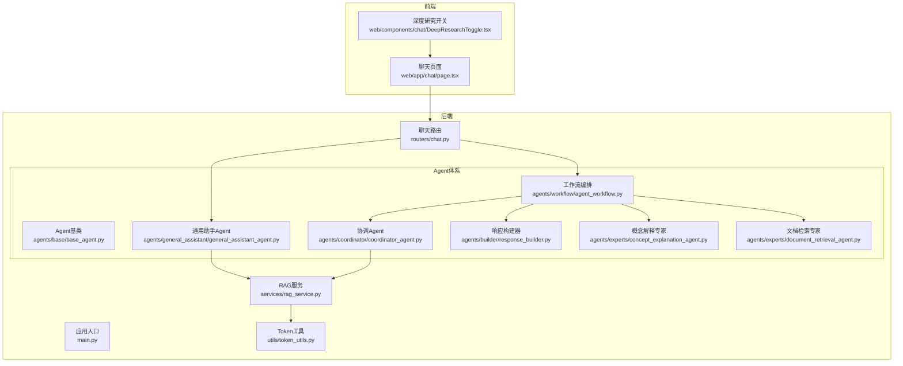
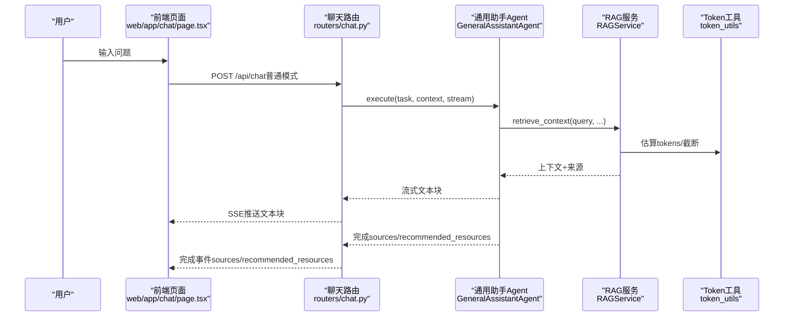
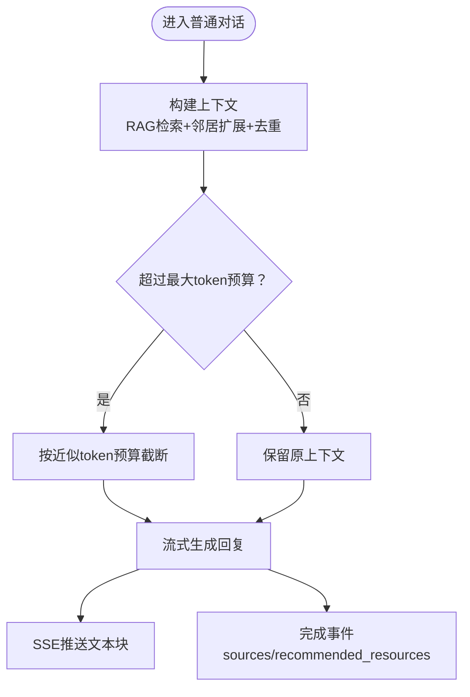
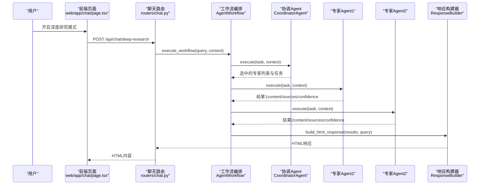
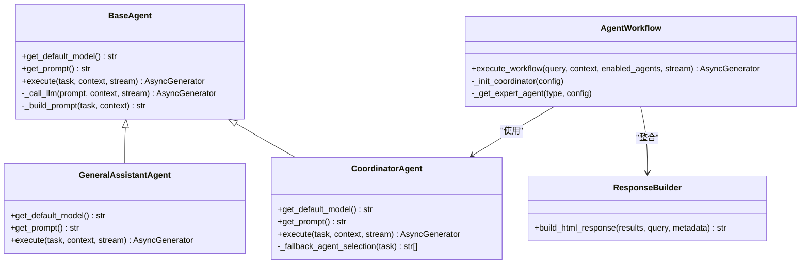
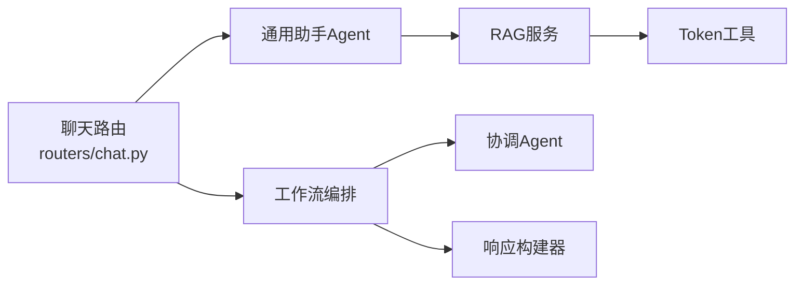

# 对话模式设计

<cite>
**本文引用的文件**
- [main.py](file://main.py)
- [chat.py](file://routers/chat.py)
- [base_agent.py](file://agents/base/base_agent.py)
- [general_assistant_agent.py](file://agents/general_assistant/general_assistant_agent.py)
- [coordinator_agent.py](file://agents/coordinator/coordinator_agent.py)
- [agent_workflow.py](file://agents/workflow/agent_workflow.py)
- [response_builder.py](file://agents/builder/response_builder.py)
- [concept_explanation_agent.py](file://agents/experts/concept_explanation_agent.py)
- [document_retrieval_agent.py](file://agents/experts/document_retrieval_agent.py)
- [rag_service.py](file://services/rag_service.py)
- [token_utils.py](file://utils/token_utils.py)
- [page.tsx](file://web/app/chat/page.tsx)
- [DeepResearchToggle.tsx](file://web/components/chat/DeepResearchToggle.tsx)
</cite>

## 目录
1. [引言](#引言)
2. [项目结构](#项目结构)
3. [核心组件](#核心组件)
4. [架构总览](#架构总览)
5. [详细组件分析](#详细组件分析)
6. [依赖关系分析](#依赖关系分析)
7. [性能考量](#性能考量)
8. [故障排查指南](#故障排查指南)
9. [结论](#结论)
10. [附录](#附录)

## 引言
本文件面向“对话模式设计”的技术文档，聚焦两类核心模式：普通对话模式与深度研究模式。前者强调快速响应与检索增强，后者通过多Agent协作实现深度研究与结构化呈现。文档将系统阐述模式切换机制、上下文构建策略、响应生成逻辑、多Agent协作流程、对话状态管理与性能优化策略，并提供可追溯的代码路径与可视化图示。

## 项目结构
后端采用FastAPI应用入口，路由集中于聊天相关接口，对话状态与消息持久化依托MongoDB；前端Next.js页面负责用户交互、状态持久化与流式渲染。Agent体系分为基类、通用助手、协调器与专家Agent，配合RAG服务与响应构建器形成完整对话链路。

**图表来源**
- [main.py:1-171](file://main.py#L1-L171)
- [chat.py:1-800](file://routers/chat.py#L1-L800)
- [base_agent.py:1-122](file://agents/base/base_agent.py#L1-L122)
- [general_assistant_agent.py:1-167](file://agents/general_assistant/general_assistant_agent.py#L1-L167)
- [coordinator_agent.py:1-252](file://agents/coordinator/coordinator_agent.py#L1-L252)
- [agent_workflow.py:1-388](file://agents/workflow/agent_workflow.py#L1-L388)
- [response_builder.py:1-272](file://agents/builder/response_builder.py#L1-L272)
- [concept_explanation_agent.py:1-70](file://agents/experts/concept_explanation_agent.py#L1-L70)
- [document_retrieval_agent.py:1-79](file://agents/experts/document_retrieval_agent.py#L1-L79)
- [rag_service.py:1-323](file://services/rag_service.py#L1-L323)
- [token_utils.py:1-72](file://utils/token_utils.py#L1-L72)

**章节来源**
- [main.py:1-171](file://main.py#L1-L171)
- [chat.py:1-800](file://routers/chat.py#L1-L800)

## 核心组件
- 模式定义与路由
  - 普通对话模式：通过常规聊天接口发起，支持RAG检索增强与来源返回，流式输出。
  - 深度研究模式：通过深度研究接口发起，多Agent协作，最终以HTML形式返回结构化研究结果。
- Agent基类与通用助手
  - 基类提供统一的LLM调用、提示词构建与抽象执行接口。
  - 通用助手封装RAG检索、上下文拼接与流式生成，适配普通对话模式。
- 协调Agent与工作流
  - 协调Agent负责任务规划与专家选择；工作流编排器负责多Agent顺序执行与状态上报。
- 专家Agent
  - 概念解释专家与文档检索专家等，承担具体研究任务。
- 响应构建器
  - 将多Agent结果整合为HTML，包含标题、置信度、内容与来源。
- RAG服务与Token工具
  - RAG服务负责检索、邻居扩展、上下文拼接与去重；Token工具提供近似估算与截断能力。

**章节来源**
- [base_agent.py:1-122](file://agents/base/base_agent.py#L1-L122)
- [general_assistant_agent.py:1-167](file://agents/general_assistant/general_assistant_agent.py#L1-L167)
- [coordinator_agent.py:1-252](file://agents/coordinator/coordinator_agent.py#L1-L252)
- [agent_workflow.py:1-388](file://agents/workflow/agent_workflow.py#L1-L388)
- [response_builder.py:1-272](file://agents/builder/response_builder.py#L1-L272)
- [concept_explanation_agent.py:1-70](file://agents/experts/concept_explanation_agent.py#L1-L70)
- [document_retrieval_agent.py:1-79](file://agents/experts/document_retrieval_agent.py#L1-L79)
- [rag_service.py:1-323](file://services/rag_service.py#L1-L323)
- [token_utils.py:1-72](file://utils/token_utils.py#L1-L72)

## 架构总览
普通对话模式与深度研究模式共享统一的路由层与Agent基础设施，差异在于上下文构建与响应生成路径。普通模式侧重“检索+生成”，深度模式侧重“规划+协作+整合”。

**图表来源**
- [chat.py:623-760](file://routers/chat.py#L623-L760)
- [general_assistant_agent.py:49-167](file://agents/general_assistant/general_assistant_agent.py#L49-L167)
- [rag_service.py:34-266](file://services/rag_service.py#L34-L266)
- [token_utils.py:16-71](file://utils/token_utils.py#L16-L71)

## 详细组件分析

### 普通对话模式（Normal Mode）
- 模式切换机制
  - 前端通过聊天路由的常规请求体携带模式标识与RAG开关，后端据此选择通用助手Agent执行。
- 上下文构建策略
  - 从RAG服务检索上下文，结合邻居扩展与去重，控制最大token预算，保证上下文长度合理。
- 响应生成逻辑
  - 通过OllamaService流式生成文本，逐块推送；完成后附加来源与推荐资源信息。

**图表来源**
- [rag_service.py:34-266](file://services/rag_service.py#L34-L266)
- [token_utils.py:48-71](file://utils/token_utils.py#L48-L71)
- [general_assistant_agent.py:97-166](file://agents/general_assistant/general_assistant_agent.py#L97-L166)

**章节来源**
- [chat.py:623-760](file://routers/chat.py#L623-L760)
- [general_assistant_agent.py:1-167](file://agents/general_assistant/general_assistant_agent.py#L1-L167)
- [rag_service.py:1-323](file://services/rag_service.py#L1-L323)
- [token_utils.py:1-72](file://utils/token_utils.py#L1-L72)

### 深度研究模式（Deep Research Mode）
- 模式切换机制
  - 前端通过深度研究开关控制是否进入深度研究模式；开启时关闭RAG增强模式，走多Agent协作路径。
- 多Agent协作工作流程
  - 协调Agent分析问题，智能选择所需专家Agent并分配任务。
  - 工作流编排器顺序执行专家Agent，实时上报状态与进度。
  - 响应构建器将各Agent结果整合为HTML。
- 任务分解、专家选择与结果整合
  - 任务分解：协调Agent将复杂问题拆分为若干子任务。
  - 专家选择：基于关键词与复杂度选择必要专家，避免过度并行。
  - 结果整合：构建器统一格式化输出，包含置信度与来源。

**图表来源**
- [chat.py:762-800](file://routers/chat.py#L762-L800)
- [agent_workflow.py:106-336](file://agents/workflow/agent_workflow.py#L106-L336)
- [coordinator_agent.py:55-168](file://agents/coordinator/coordinator_agent.py#L55-L168)
- [response_builder.py:10-78](file://agents/builder/response_builder.py#L10-L78)

**章节来源**
- [page.tsx:80-87](file://web/app/chat/page.tsx#L80-L87)
- [DeepResearchToggle.tsx:1-53](file://web/components/chat/DeepResearchToggle.tsx#L1-L53)
- [chat.py:762-800](file://routers/chat.py#L762-L800)
- [agent_workflow.py:1-388](file://agents/workflow/agent_workflow.py#L1-L388)
- [coordinator_agent.py:1-252](file://agents/coordinator/coordinator_agent.py#L1-L252)
- [response_builder.py:1-272](file://agents/builder/response_builder.py#L1-L272)

### 类与继承关系（代码级）

**图表来源**
- [base_agent.py:8-122](file://agents/base/base_agent.py#L8-L122)
- [general_assistant_agent.py:9-167](file://agents/general_assistant/general_assistant_agent.py#L9-L167)
- [coordinator_agent.py:7-252](file://agents/coordinator/coordinator_agent.py#L7-L252)
- [agent_workflow.py:47-388](file://agents/workflow/agent_workflow.py#L47-L388)
- [response_builder.py:7-272](file://agents/builder/response_builder.py#L7-L272)

## 依赖关系分析
- 组件耦合
  - 路由层与Agent层松耦合，通过统一的Agent接口与上下文传递。
  - 协调Agent与工作流编排器紧密协作，前者负责规划，后者负责执行。
  - RAG服务与Token工具为上下文构建提供基础能力。
- 外部依赖
  - Ollama服务用于LLM调用；MongoDB用于对话历史与配置存储；前端通过SSE接收流式响应。

**图表来源**
- [chat.py:1-800](file://routers/chat.py#L1-L800)
- [general_assistant_agent.py:1-167](file://agents/general_assistant/general_assistant_agent.py#L1-L167)
- [agent_workflow.py:1-388](file://agents/workflow/agent_workflow.py#L1-L388)
- [rag_service.py:1-323](file://services/rag_service.py#L1-L323)
- [token_utils.py:1-72](file://utils/token_utils.py#L1-L72)

**章节来源**
- [chat.py:1-800](file://routers/chat.py#L1-L800)
- [agent_workflow.py:1-388](file://agents/workflow/agent_workflow.py#L1-L388)
- [rag_service.py:1-323](file://services/rag_service.py#L1-L323)

## 性能考量
- 流式输出与断连检测
  - 后端在流式生成过程中定期检查客户端断连，及时停止输出，避免资源浪费。
- 上下文长度控制
  - 通过近似token估算与二分截断，确保上下文不超过预算，降低LLM输入成本。
- 并行检索与顺序执行
  - 检索阶段可并行，执行阶段顺序推进，兼顾前端进度反馈与资源占用。
- 模型选择与切换
  - 通用助手支持动态模型选择与切换，按任务复杂度选择合适模型，平衡速度与质量。

**章节来源**
- [chat.py:720-752](file://routers/chat.py#L720-L752)
- [general_assistant_agent.py:80-96](file://agents/general_assistant/general_assistant_agent.py#L80-L96)
- [rag_service.py:11-32](file://services/rag_service.py#L11-L32)
- [token_utils.py:48-71](file://utils/token_utils.py#L48-L71)

## 故障排查指南
- 普通对话模式常见问题
  - RAG检索失败：系统会回退到无上下文模式继续生成，确保服务可用性。
  - 客户端断连：后端检测到断连后停止生成，避免资源泄漏。
- 深度研究模式常见问题
  - 协调Agent规划失败：系统回退到默认Agent选择逻辑，保证基本功能。
  - 专家Agent执行异常：工作流捕获异常并上报错误状态，前端可据此提示。
- 日志与监控
  - 后端统一记录请求与异常信息，便于定位问题。

**章节来源**
- [general_assistant_agent.py:119-122](file://agents/general_assistant/general_assistant_agent.py#L119-L122)
- [coordinator_agent.py:130-135](file://agents/coordinator/coordinator_agent.py#L130-L135)
- [agent_workflow.py:331-336](file://agents/workflow/agent_workflow.py#L331-L336)
- [main.py:110-126](file://main.py#L110-L126)

## 结论
本设计以统一的Agent基类与路由层为基础，通过普通对话模式与深度研究模式的差异化路径满足不同场景需求。普通模式强调检索增强与快速响应，深度模式强调多Agent协作与结构化输出。通过上下文预算控制、流式输出与断连检测、以及完善的错误处理与日志体系，系统在可用性、性能与可维护性之间取得良好平衡。

## 附录
- 模式切换配置
  - 前端开关：深度研究开关与RAG增强开关分别控制模式与检索增强。
  - 后端路由：聊天路由根据请求体中的模式字段与RAG开关选择执行路径。
- 配置参数
  - generation_config：包含llm_model与embedding_model，用于Agent与RAG服务的模型选择。
  - enabled_agents：深度研究模式下可手动指定启用的专家Agent列表。
- 性能优化建议
  - 控制上下文长度与token预算，避免超长输入。
  - 合理选择Agent数量，避免不必要的并行。
  - 使用流式输出与断连检测，提升用户体验与资源利用率。

**章节来源**
- [page.tsx:80-87](file://web/app/chat/page.tsx#L80-L87)
- [chat.py:64-82](file://routers/chat.py#L64-L82)
- [general_assistant_agent.py:72-79](file://agents/general_assistant/general_assistant_agent.py#L72-L79)
- [agent_workflow.py:18-44](file://agents/workflow/agent_workflow.py#L18-L44)