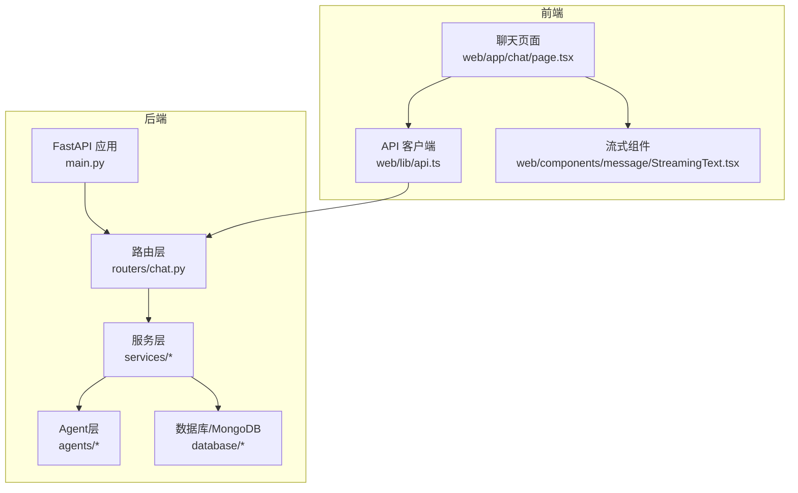
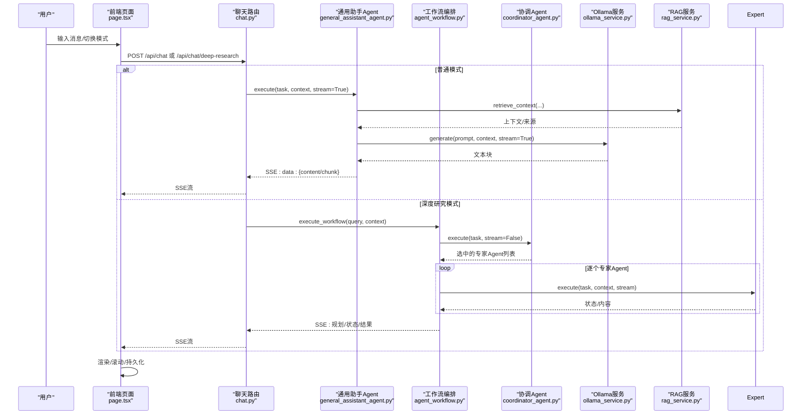
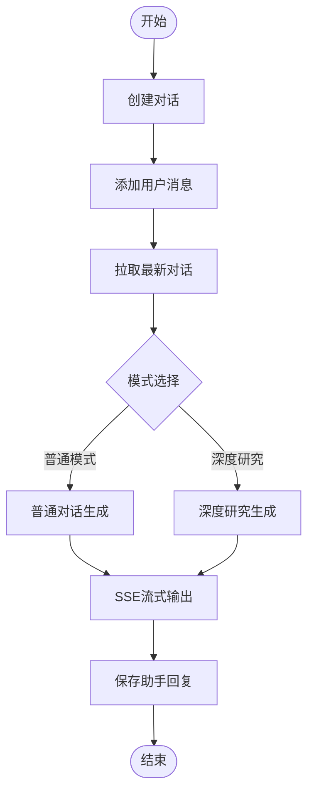
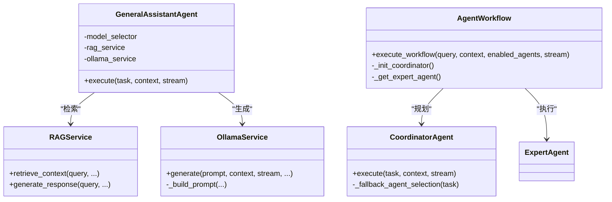
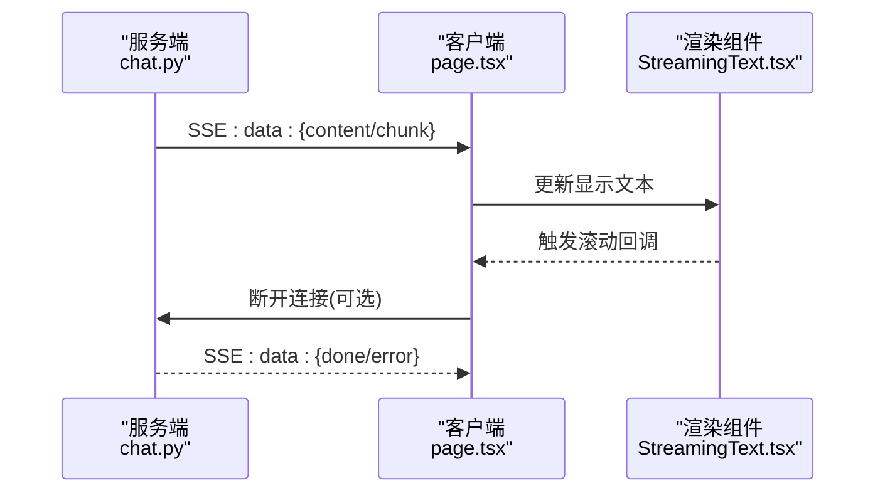
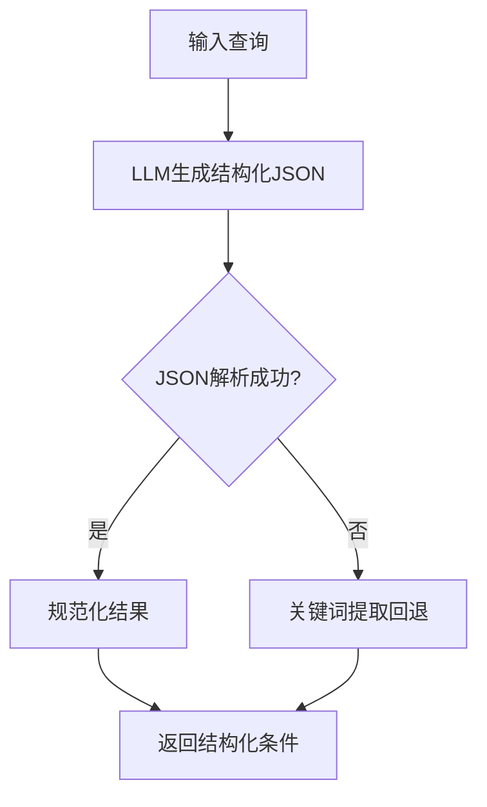
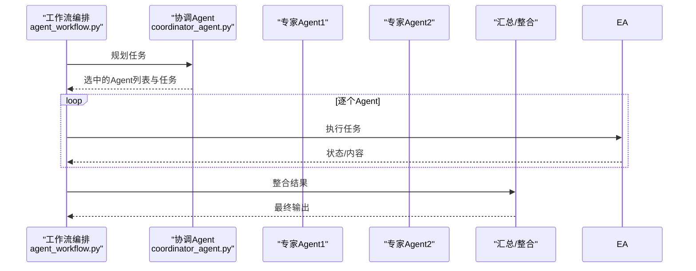
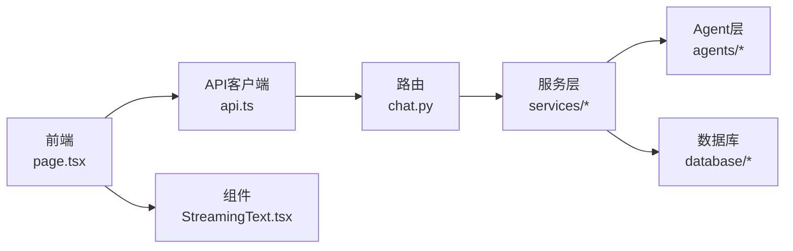

# 智能对话系统

<cite>
**本文引用的文件**
- [main.py](file://main.py)
- [chat.py](file://routers/chat.py)
- [query_understanding_service.py](file://services/query_understanding_service.py)
- [rag_service.py](file://services/rag_service.py)
- [ollama_service.py](file://services/ollama_service.py)
- [model_selector.py](file://services/model_selector.py)
- [general_assistant_agent.py](file://agents/general_assistant/general_assistant_agent.py)
- [coordinator_agent.py](file://agents/coordinator/coordinator_agent.py)
- [agent_workflow.py](file://agents/workflow/agent_workflow.py)
- [concept_explanation_agent.py](file://agents/experts/concept_explanation_agent.py)
- [formula_analysis_agent.py](file://agents/experts/formula_analysis_agent.py)
- [StreamingText.tsx](file://web/components/message/StreamingText.tsx)
- [page.tsx](file://web/app/chat/page.tsx)
- [api.ts](file://web/lib/api.ts)
</cite>

## 目录
1. [引言](#引言)
2. [项目结构](#项目结构)
3. [核心组件](#核心组件)
4. [架构总览](#架构总览)
5. [详细组件分析](#详细组件分析)
6. [依赖关系分析](#依赖关系分析)
7. [性能考量](#性能考量)
8. [故障排查指南](#故障排查指南)
9. [结论](#结论)
10. [附录](#附录)

## 引言
本技术文档面向智能对话系统，聚焦两类核心对话模式：普通对话模式与深度研究模式。系统通过流式响应（SSE）实现实时交互，结合RAG检索增强与多Agent协作，实现从意图理解、上下文构建到结果整合的完整闭环。文档将深入解释对话状态管理、历史记录维护、上下文构建机制，详述流式响应实现原理与客户端渲染优化，并阐述查询理解服务、Agent协作机制与性能优化策略。

## 项目结构
系统采用后端FastAPI + 前端Next.js的双端架构，后端提供REST接口与SSE流式输出，前端负责用户交互、流式渲染与状态持久化。

图表来源
- [main.py:1-171](file://main.py#L1-L171)
- [chat.py:1-800](file://routers/chat.py#L1-L800)
- [page.tsx:1-800](file://web/app/chat/page.tsx#L1-L800)

章节来源
- [main.py:1-171](file://main.py#L1-L171)
- [chat.py:1-800](file://routers/chat.py#L1-L800)

## 核心组件
- 对话路由与流式响应：提供普通对话与深度研究模式的SSE流式接口，支持断连检测与错误处理。
- 查询理解服务：将自然语言查询转化为结构化搜索条件，支持意图识别与实体抽取。
- RAG服务：封装检索与上下文构建，支持动态参数、邻居扩展与去重聚合。
- 模型选择服务：根据问题特征自动选择适合的推理模型，兼顾公式生成与知识问答。
- Agent体系：通用助手Agent与专家Agent协作，支持协调型Agent的任务规划与结果整合。
- 前端流式渲染：优化渲染性能与滚动行为，支持状态持久化与中断控制。

章节来源
- [chat.py:623-760](file://routers/chat.py#L623-L760)
- [query_understanding_service.py:87-135](file://services/query_understanding_service.py#L87-L135)
- [rag_service.py:34-126](file://services/rag_service.py#L34-L126)
- [model_selector.py:51-132](file://services/model_selector.py#L51-L132)
- [general_assistant_agent.py:49-167](file://agents/general_assistant/general_assistant_agent.py#L49-L167)
- [coordinator_agent.py:55-169](file://agents/coordinator/coordinator_agent.py#L55-L169)
- [agent_workflow.py:106-337](file://agents/workflow/agent_workflow.py#L106-L337)
- [StreamingText.tsx:16-79](file://web/components/message/StreamingText.tsx#L16-L79)
- [page.tsx:680-800](file://web/app/chat/page.tsx#L680-L800)

## 架构总览
系统通过路由层接收请求，根据模式选择执行路径：普通模式走通用助手Agent并结合RAG检索；深度研究模式由协调型Agent规划专家Agent任务，再由工作流编排器串行执行并整合结果。服务层负责模型调用、检索与提示词构建，Agent层负责任务执行与状态反馈，前端通过SSE接收流式数据并渲染。

图表来源
- [chat.py:623-760](file://routers/chat.py#L623-L760)
- [general_assistant_agent.py:49-167](file://agents/general_assistant/general_assistant_agent.py#L49-L167)
- [agent_workflow.py:106-337](file://agents/workflow/agent_workflow.py#L106-L337)
- [coordinator_agent.py:55-169](file://agents/coordinator/coordinator_agent.py#L55-L169)
- [ollama_service.py:50-93](file://services/ollama_service.py#L50-L93)
- [rag_service.py:34-126](file://services/rag_service.py#L34-L126)

## 详细组件分析

### 对话状态管理与历史记录维护
- 对话创建与更新：路由层提供创建、读取、更新、删除对话与消息的接口，支持匿名模式下的对话生命周期管理。
- 历史记录维护：前端在每次生成时将用户消息写入后端，随后拉取最新对话以更新消息ID与时间戳，保证一致性。
- 断连检测：后端在流式生成中定期检查客户端连接状态，一旦断开立即停止生成并释放资源。

图表来源
- [chat.py:97-150](file://routers/chat.py#L97-L150)
- [chat.py:248-352](file://routers/chat.py#L248-L352)
- [chat.py:623-760](file://routers/chat.py#L623-L760)
- [page.tsx:730-777](file://web/app/chat/page.tsx#L730-L777)

章节来源
- [chat.py:97-150](file://routers/chat.py#L97-L150)
- [chat.py:248-352](file://routers/chat.py#L248-L352)
- [chat.py:623-760](file://routers/chat.py#L623-L760)
- [page.tsx:730-777](file://web/app/chat/page.tsx#L730-L777)

### 上下文构建机制
- 普通模式上下文：通用助手Agent在执行时根据generation_config选择模型，结合RAG检索结果与对话历史构建提示词，通过Ollama服务生成回复。
- 深度研究上下文：工作流编排器先由协调Agent规划专家Agent任务，再逐个执行专家Agent，最终整合各Agent结果形成综合输出。

图表来源
- [general_assistant_agent.py:49-167](file://agents/general_assistant/general_assistant_agent.py#L49-L167)
- [rag_service.py:34-126](file://services/rag_service.py#L34-L126)
- [ollama_service.py:50-93](file://services/ollama_service.py#L50-L93)
- [agent_workflow.py:106-337](file://agents/workflow/agent_workflow.py#L106-L337)
- [coordinator_agent.py:55-169](file://agents/coordinator/coordinator_agent.py#L55-L169)

章节来源
- [general_assistant_agent.py:49-167](file://agents/general_assistant/general_assistant_agent.py#L49-L167)
- [rag_service.py:34-126](file://services/rag_service.py#L34-L126)
- [ollama_service.py:94-273](file://services/ollama_service.py#L94-L273)
- [agent_workflow.py:106-337](file://agents/workflow/agent_workflow.py#L106-L337)
- [coordinator_agent.py:55-169](file://agents/coordinator/coordinator_agent.py#L55-L169)

### 流式响应实现原理（SSE）
- 服务端：路由层返回SSE响应，媒体类型为text/event-stream，头部设置Cache-Control与X-Accel-Buffering以适配代理与浏览器。
- 断连检测：服务端在生成循环中定期检查客户端连接状态，断开时立即停止生成并清理资源。
- 客户端：前端通过fetch读取ReadableStream，解析data行并渲染到界面；组件层优化渲染与滚动，支持光标动画与自动滚动。

图表来源
- [chat.py:744-752](file://routers/chat.py#L744-L752)
- [page.tsx:680-800](file://web/app/chat/page.tsx#L680-L800)
- [StreamingText.tsx:16-79](file://web/components/message/StreamingText.tsx#L16-L79)

章节来源
- [chat.py:744-752](file://routers/chat.py#L744-L752)
- [page.tsx:680-800](file://web/app/chat/page.tsx#L680-L800)
- [StreamingText.tsx:16-79](file://web/components/message/StreamingText.tsx#L16-L79)

### 查询理解服务（意图识别与实体抽取）
- 任务：将自然语言查询解析为结构化搜索条件，包含研究领域、用户类型、技能、学院、专业、兴趣与意图描述。
- 方法：优先使用LLM生成JSON，失败时回退到关键词提取；并对结果进行规范化与校验。
- 应用：前端在未启用RAG增强时，可调用分析接口判断是否需要检索，从而优化用户体验与资源消耗。

图表来源
- [query_understanding_service.py:87-135](file://services/query_understanding_service.py#L87-L135)
- [query_understanding_service.py:206-247](file://services/query_understanding_service.py#L206-L247)

章节来源
- [query_understanding_service.py:87-135](file://services/query_understanding_service.py#L87-L135)
- [query_understanding_service.py:206-247](file://services/query_understanding_service.py#L206-L247)

### Agent协作机制（专家Agent选择与结果整合）
- 协调Agent：分析问题复杂度，智能选择所需专家Agent，说明选择理由，并返回任务分配。
- 工作流编排：顺序执行专家Agent，实时发送状态与进度，最终整合结果并返回。
- 专家Agent示例：概念解释Agent专注于定义与应用，公式分析Agent识别并解释公式及其变量。

图表来源
- [agent_workflow.py:106-337](file://agents/workflow/agent_workflow.py#L106-L337)
- [coordinator_agent.py:55-169](file://agents/coordinator/coordinator_agent.py#L55-L169)
- [concept_explanation_agent.py:25-70](file://agents/experts/concept_explanation_agent.py#L25-L70)
- [formula_analysis_agent.py:26-107](file://agents/experts/formula_analysis_agent.py#L26-L107)

章节来源
- [agent_workflow.py:106-337](file://agents/workflow/agent_workflow.py#L106-L337)
- [coordinator_agent.py:55-169](file://agents/coordinator/coordinator_agent.py#L55-L169)
- [concept_explanation_agent.py:25-70](file://agents/experts/concept_explanation_agent.py#L25-L70)
- [formula_analysis_agent.py:26-107](file://agents/experts/formula_analysis_agent.py#L26-L107)

### 模型选择与性能优化
- 模型选择：根据问题是否涉及公式生成，自动选择高精度公式模型或知识问答模型，降低不必要的计算成本。
- RAG动态参数：根据查询长度、对比/列举/条款类关键词动态调整检索参数，平衡召回与质量。
- 流式生成优化：服务端在生成循环中定期检查断连，前端组件优化渲染与滚动，减少重绘与闪烁。

章节来源
- [model_selector.py:51-132](file://services/model_selector.py#L51-L132)
- [rag_service.py:11-32](file://services/rag_service.py#L11-L32)
- [ollama_service.py:453-638](file://services/ollama_service.py#L453-L638)
- [StreamingText.tsx:16-79](file://web/components/message/StreamingText.tsx#L16-L79)

## 依赖关系分析
- 路由层依赖服务层与Agent层，服务层依赖数据库与外部模型服务，Agent层依赖服务层与提示词链。
- 前端通过API客户端调用后端接口，SSE流式数据驱动组件渲染。

图表来源
- [page.tsx:680-800](file://web/app/chat/page.tsx#L680-L800)
- [api.ts:115-372](file://web/lib/api.ts#L115-L372)
- [chat.py:623-760](file://routers/chat.py#L623-L760)

章节来源
- [page.tsx:680-800](file://web/app/chat/page.tsx#L680-L800)
- [api.ts:115-372](file://web/lib/api.ts#L115-L372)
- [chat.py:623-760](file://routers/chat.py#L623-L760)

## 性能考量
- 流式生成：服务端在生成循环中定期检查断连，避免无效占用；前端组件减少重渲染，提升交互流畅度。
- 检索优化：RAG服务根据查询特征动态调整检索参数，控制上下文长度与去重，避免超长提示词导致的性能问题。
- 模型选择：根据问题类型选择合适模型，减少不必要的高成本推理。
- 超时与并发：服务端设置合理的超时与keep-alive，前端支持中断生成与状态持久化，提升稳定性与用户体验。

## 故障排查指南
- 服务端异常：全局异常处理器捕获未处理异常并返回统一错误响应，便于定位问题。
- 客户端断连：服务端在流式生成中检测断连并停止输出；前端支持中断生成与状态恢复。
- 模型不可用：Ollama服务封装HTTP错误与超时，提供清晰的日志与回退策略。
- 数据库访问：路由层依赖MongoDB，异常时返回HTTP错误，前端提示用户重试或检查配置。

章节来源
- [main.py:110-127](file://main.py#L110-L127)
- [chat.py:720-743](file://routers/chat.py#L720-L743)
- [ollama_service.py:632-638](file://services/ollama_service.py#L632-L638)

## 结论
本系统通过清晰的模块划分与流式交互设计，在普通对话与深度研究两大模式间实现了灵活切换与高效协作。查询理解、RAG检索与多Agent协同构成了强大的上下文构建与结果整合能力，配合前端优化与断连检测，为用户提供稳定、流畅、可扩展的智能对话体验。

## 附录
- 配置参数建议
  - 模型选择：根据业务场景调整公式模型与知识模型的阈值与关键词集合。
  - RAG参数：根据查询类型与数据规模调整prefetch_k与final_k，平衡召回与质量。
  - 流式超时：根据模型大小与网络状况调整OLLAMA_TIMEOUT与keep-alive超时。
- 代码示例路径
  - 普通对话流式生成：[chat.py:623-760](file://routers/chat.py#L623-L760)
  - 深度研究工作流：[agent_workflow.py:106-337](file://agents/workflow/agent_workflow.py#L106-L337)
  - 查询理解服务：[query_understanding_service.py:87-135](file://services/query_understanding_service.py#L87-L135)
  - RAG检索上下文：[rag_service.py:34-126](file://services/rag_service.py#L34-L126)
  - 模型选择逻辑：[model_selector.py:51-132](file://services/model_selector.py#L51-L132)
  - Ollama流式生成：[ollama_service.py:453-638](file://services/ollama_service.py#L453-L638)
  - 前端SSE处理与渲染：[page.tsx:680-800](file://web/app/chat/page.tsx#L680-L800)，[StreamingText.tsx:16-79](file://web/components/message/StreamingText.tsx#L16-L79)