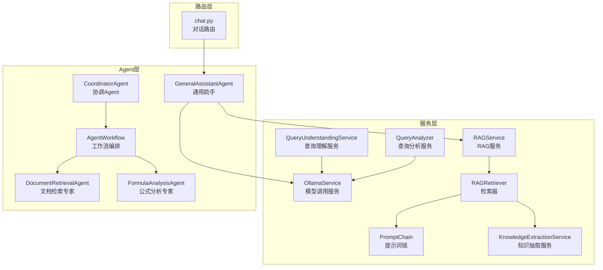
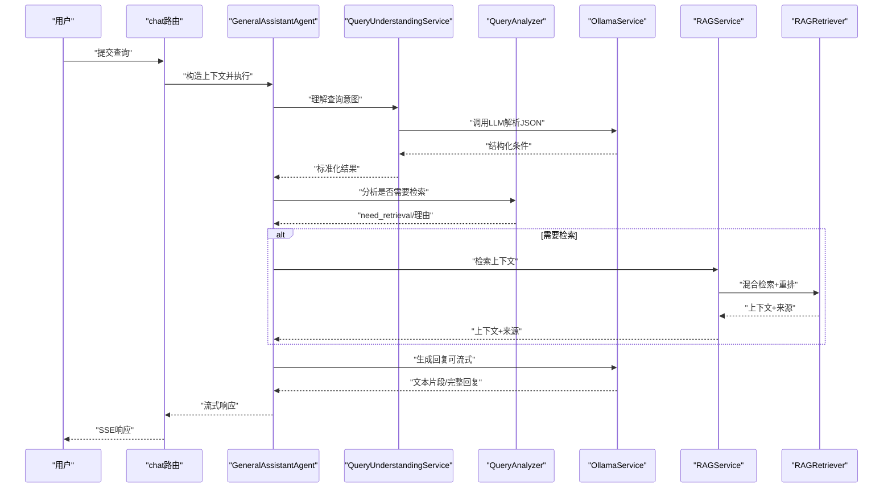
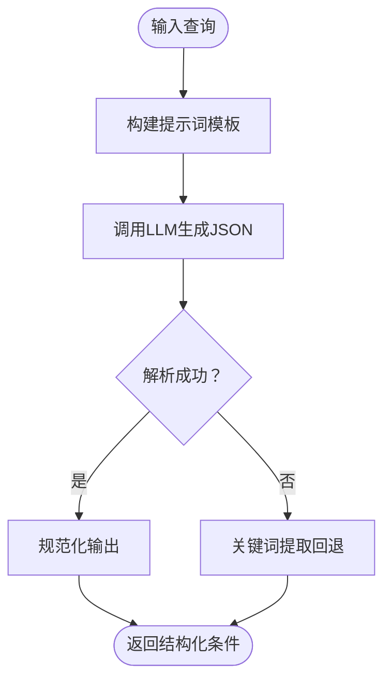
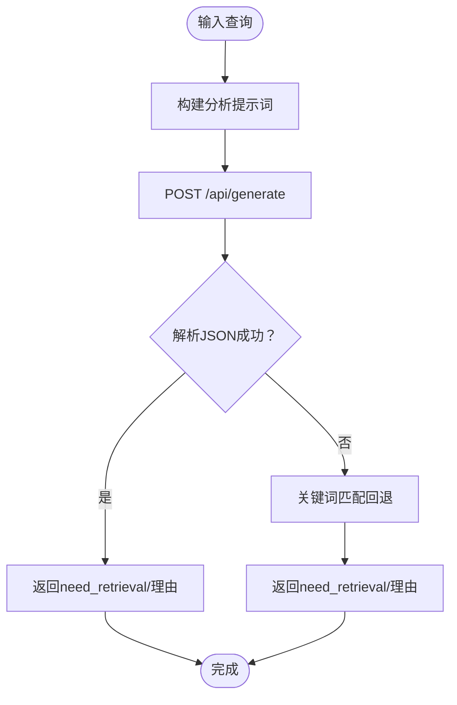
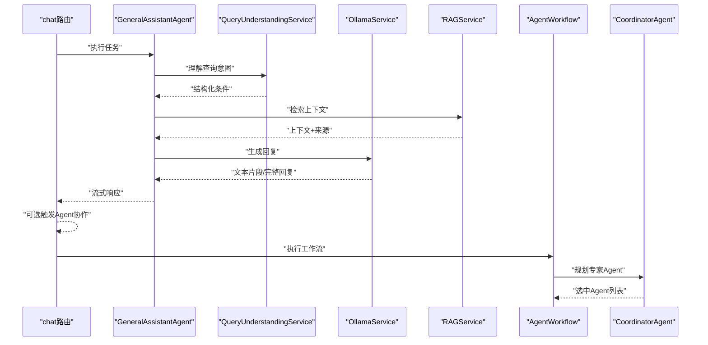
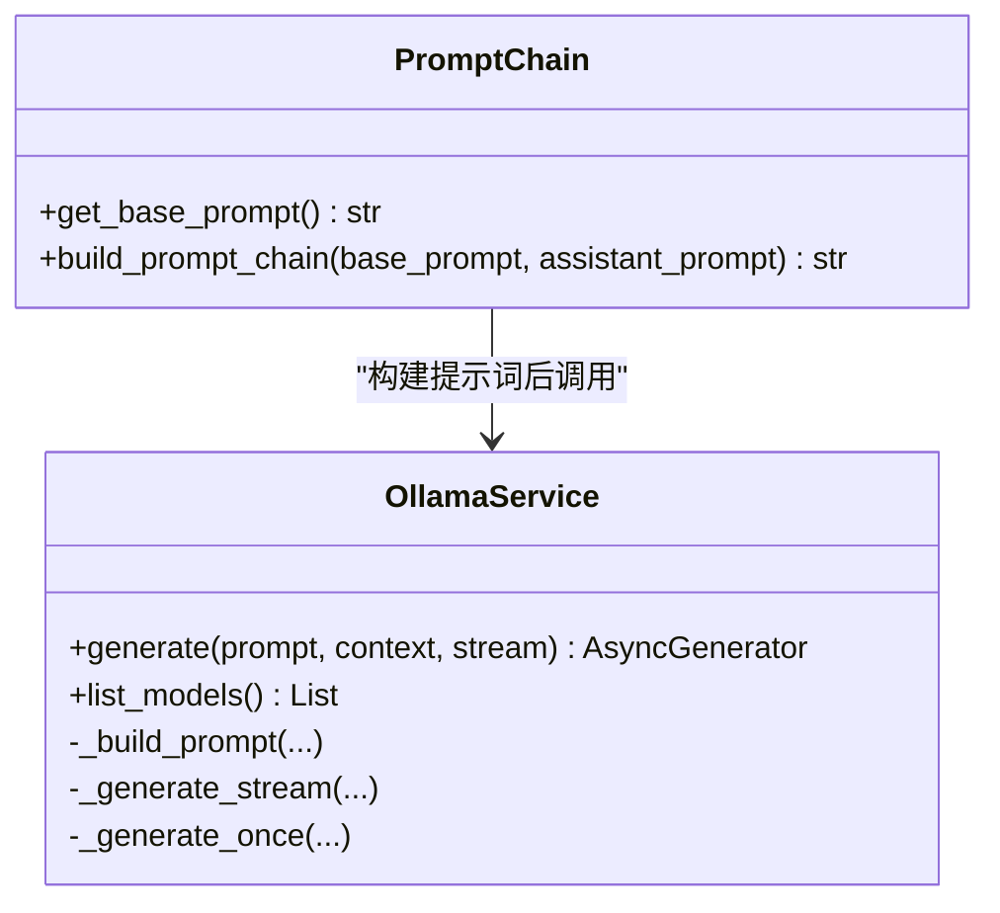
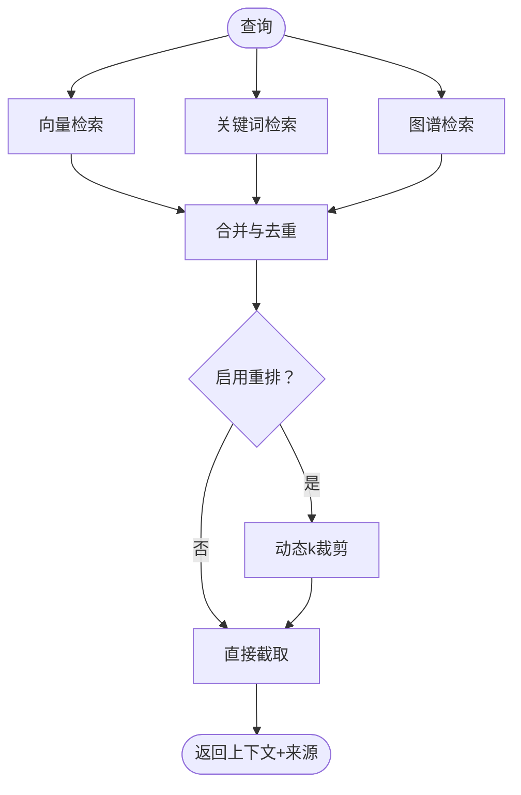
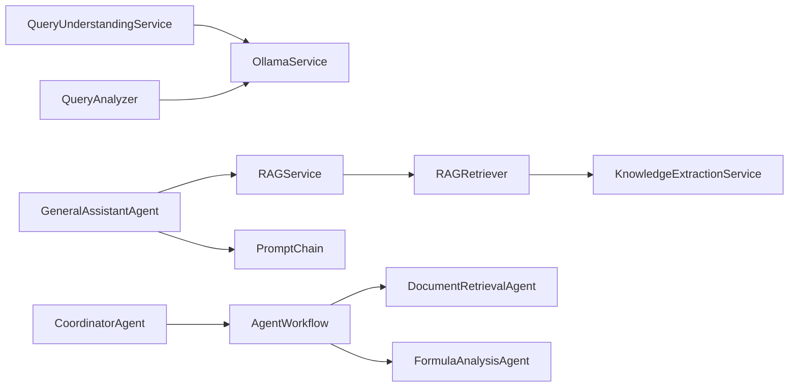

# 查询理解服务

<cite>
**本文引用的文件**
- [query_understanding_service.py](file://services/query_understanding_service.py)
- [query_analyzer.py](file://services/query_analyzer.py)
- [ollama_service.py](file://services/ollama_service.py)
- [prompt_chain.py](file://services/prompt_chain.py)
- [rag_service.py](file://services/rag_service.py)
- [rag_retriever.py](file://retrieval/rag_retriever.py)
- [knowledge_extraction_service.py](file://services/knowledge_extraction_service.py)
- [chat.py](file://routers/chat.py)
- [base_agent.py](file://agents/base/base_agent.py)
- [coordinator_agent.py](file://agents/coordinator/coordinator_agent.py)
- [agent_workflow.py](file://agents/workflow/agent_workflow.py)
- [general_assistant_agent.py](file://agents/general_assistant/general_assistant_agent.py)
- [document_retrieval_agent.py](file://agents/experts/document_retrieval_agent.py)
- [formula_analysis_agent.py](file://agents/experts/formula_analysis_agent.py)
</cite>

## 目录
1. [简介](#简介)
2. [项目结构](#项目结构)
3. [核心组件](#核心组件)
4. [架构总览](#架构总览)
5. [详细组件分析](#详细组件分析)
6. [依赖分析](#依赖分析)
7. [性能考量](#性能考量)
8. [故障排查指南](#故障排查指南)
9. [结论](#结论)
10. [附录](#附录)

## 简介
本文件面向“查询理解服务”的技术实现，围绕以下目标展开：
- 查询意图识别：自然语言处理、语义分析与实体抽取
- 查询重构机制：关键词提取、上下文关联与查询优化
- 查询分析服务：工作流程、多轮对话理解、指代消解与查询扩展
- 与Agent系统的集成：专家Agent选择策略与任务路由
- 提供代码示例路径、配置参数与性能优化方法

## 项目结构
查询理解服务位于后端服务层，与RAG检索、提示词链、Agent编排协同工作，形成“理解—检索—生成—路由”的闭环。

图表来源
- [query_understanding_service.py:1-248](file://services/query_understanding_service.py#L1-L248)
- [query_analyzer.py:1-163](file://services/query_analyzer.py#L1-L163)
- [ollama_service.py:1-674](file://services/ollama_service.py#L1-L674)
- [prompt_chain.py:1-450](file://services/prompt_chain.py#L1-L450)
- [rag_service.py:1-323](file://services/rag_service.py#L1-L323)
- [rag_retriever.py:1-393](file://retrieval/rag_retriever.py#L1-L393)
- [knowledge_extraction_service.py:1-229](file://services/knowledge_extraction_service.py#L1-L229)
- [chat.py:1-1342](file://routers/chat.py#L1-L1342)
- [general_assistant_agent.py:1-167](file://agents/general_assistant/general_assistant_agent.py#L1-L167)
- [coordinator_agent.py:1-252](file://agents/coordinator/coordinator_agent.py#L1-L252)
- [agent_workflow.py:1-388](file://agents/workflow/agent_workflow.py#L1-L388)
- [document_retrieval_agent.py:1-79](file://agents/experts/document_retrieval_agent.py#L1-L79)
- [formula_analysis_agent.py:1-107](file://agents/experts/formula_analysis_agent.py#L1-L107)

章节来源
- [chat.py:623-760](file://routers/chat.py#L623-L760)

## 核心组件
- 查询理解服务（QueryUnderstandingService）：将自然语言查询转换为结构化搜索条件，包含LLM解析与关键词回退策略。
- 查询分析服务（QueryAnalyzer）：判断是否需要检索上下文，采用小模型快速判定与关键词回退。
- Agent系统：通用助手（GeneralAssistantAgent）负责RAG增强生成；协调Agent（CoordinatorAgent）与工作流（AgentWorkflow）负责专家Agent选择与任务路由。
- 提示词链（PromptChain）与模型调用（OllamaService）：统一构建系统提示词并调用LLM。
- RAG服务与检索器（RAGService/RAGRetriever）：混合检索（向量/关键词/图谱）与重排。
- 知识抽取（KnowledgeExtractionService）：实体抽取与知识图谱构建，支撑图谱检索。

章节来源
- [query_understanding_service.py:87-135](file://services/query_understanding_service.py#L87-L135)
- [query_analyzer.py:38-106](file://services/query_analyzer.py#L38-L106)
- [general_assistant_agent.py:49-167](file://agents/general_assistant/general_assistant_agent.py#L49-L167)
- [coordinator_agent.py:55-169](file://agents/coordinator/coordinator_agent.py#L55-L169)
- [agent_workflow.py:106-337](file://agents/workflow/agent_workflow.py#L106-L337)
- [prompt_chain.py:386-431](file://services/prompt_chain.py#L386-L431)
- [ollama_service.py:50-93](file://services/ollama_service.py#L50-L93)
- [rag_service.py:34-137](file://services/rag_service.py#L34-L137)
- [rag_retriever.py:89-137](file://retrieval/rag_retriever.py#L89-L137)
- [knowledge_extraction_service.py:107-145](file://services/knowledge_extraction_service.py#L107-L145)

## 架构总览
查询理解服务贯穿“理解—检索—生成—路由”链路，典型交互如下：

图表来源
- [chat.py:623-760](file://routers/chat.py#L623-L760)
- [general_assistant_agent.py:49-167](file://agents/general_assistant/general_assistant_agent.py#L49-L167)
- [query_understanding_service.py:87-135](file://services/query_understanding_service.py#L87-L135)
- [query_analyzer.py:38-106](file://services/query_analyzer.py#L38-L106)
- [rag_service.py:34-137](file://services/rag_service.py#L34-L137)
- [rag_retriever.py:89-137](file://retrieval/rag_retriever.py#L89-L137)
- [ollama_service.py:50-93](file://services/ollama_service.py#L50-L93)

## 详细组件分析

### 查询理解服务（QueryUnderstandingService）
- 目标：将自然语言查询解析为结构化搜索条件，包含研究领域、用户类型、技能、学院、专业、兴趣与查询意图。
- 方法：
  - LLM解析：构造模板提示词，调用OllamaService生成JSON，再进行正则提取与JSON解析。
  - 规范化：统一字段类型与空值处理，保证输出一致性。
  - 回退策略：若LLM解析失败，使用关键词匹配提取用户类型、学院、专业等。
- 关键实现路径
  - [理解主流程:87-135](file://services/query_understanding_service.py#L87-L135)
  - [规范化处理:136-204](file://services/query_understanding_service.py#L136-L204)
  - [关键词回退:206-246](file://services/query_understanding_service.py#L206-L246)

图表来源
- [query_understanding_service.py:87-135](file://services/query_understanding_service.py#L87-L135)
- [query_understanding_service.py:136-204](file://services/query_understanding_service.py#L136-L204)
- [query_understanding_service.py:206-246](file://services/query_understanding_service.py#L206-L246)

章节来源
- [query_understanding_service.py:87-246](file://services/query_understanding_service.py#L87-L246)

### 查询分析服务（QueryAnalyzer）
- 目标：快速判断问题是否需要检索知识库，降低不必要的RAG调用成本。
- 方法：
  - 小模型快速判定，返回need_retrieval与reason。
  - 若解析失败或请求异常，使用关键词匹配作为回退。
- 关键实现路径
  - [分析主流程:38-106](file://services/query_analyzer.py#L38-L106)
  - [关键词回退:107-157](file://services/query_analyzer.py#L107-L157)

图表来源
- [query_analyzer.py:38-106](file://services/query_analyzer.py#L38-L106)
- [query_analyzer.py:107-157](file://services/query_analyzer.py#L107-L157)

章节来源
- [query_analyzer.py:38-157](file://services/query_analyzer.py#L38-L157)

### Agent系统与查询理解的集成
- 通用助手（GeneralAssistantAgent）在对话路由中被调用，内部可调用查询理解服务以获得结构化条件，再结合RAG检索与LLM生成回复。
- 协调Agent（CoordinatorAgent）与工作流（AgentWorkflow）负责专家Agent的选择与任务路由，查询理解可作为规划输入之一。
- 关键实现路径
  - [对话路由与通用助手:623-760](file://routers/chat.py#L623-760)
  - [通用助手执行流程:49-167](file://agents/general_assistant/general_assistant_agent.py#L49-167)
  - [协调Agent规划:55-169](file://agents/coordinator/coordinator_agent.py#L55-169)
  - [工作流编排:106-337](file://agents/workflow/agent_workflow.py#L106-337)

图表来源
- [chat.py:623-760](file://routers/chat.py#L623-L760)
- [general_assistant_agent.py:49-167](file://agents/general_assistant/general_assistant_agent.py#L49-L167)
- [query_understanding_service.py:87-135](file://services/query_understanding_service.py#L87-L135)
- [agent_workflow.py:106-337](file://agents/workflow/agent_workflow.py#L106-L337)
- [coordinator_agent.py:55-169](file://agents/coordinator/coordinator_agent.py#L55-L169)

章节来源
- [chat.py:623-760](file://routers/chat.py#L623-L760)
- [general_assistant_agent.py:49-167](file://agents/general_assistant/general_assistant_agent.py#L49-L167)
- [agent_workflow.py:106-337](file://agents/workflow/agent_workflow.py#L106-L337)
- [coordinator_agent.py:55-169](file://agents/coordinator/coordinator_agent.py#L55-L169)

### 提示词链与模型调用
- 提示词链（PromptChain）负责将基础提示词与助手特定提示词组合，统一构建系统提示词。
- 模型调用（OllamaService）封装HTTP请求、流式/非流式生成、工具函数调用与上下文构建。
- 关键实现路径
  - [提示词链构建:386-431](file://services/prompt_chain.py#L386-431)
  - [模型调用与流式生成:50-93](file://services/ollama_service.py#L50-93)

图表来源
- [prompt_chain.py:386-431](file://services/prompt_chain.py#L386-L431)
- [ollama_service.py:50-93](file://services/ollama_service.py#L50-L93)

章节来源
- [prompt_chain.py:386-431](file://services/prompt_chain.py#L386-L431)
- [ollama_service.py:50-93](file://services/ollama_service.py#L50-L93)

### RAG检索与知识抽取
- RAG服务与检索器支持向量检索、关键词检索、图谱检索与重排，动态调节k值提升召回与精度平衡。
- 知识抽取服务从文本中提取实体与关系，构建知识图谱，支撑图谱检索。
- 关键实现路径
  - [RAG检索器异步检索:89-137](file://retrieval/rag_retriever.py#L89-137)
  - [RAG服务上下文构建:34-137](file://services/rag_service.py#L34-137)
  - [知识抽取与图谱构建:36-145](file://services/knowledge_extraction_service.py#L36-145)

图表来源
- [rag_retriever.py:89-137](file://retrieval/rag_retriever.py#L89-L137)
- [rag_service.py:34-137](file://services/rag_service.py#L34-L137)
- [knowledge_extraction_service.py:107-145](file://services/knowledge_extraction_service.py#L107-L145)

章节来源
- [rag_retriever.py:89-137](file://retrieval/rag_retriever.py#L89-L137)
- [rag_service.py:34-137](file://services/rag_service.py#L34-L137)
- [knowledge_extraction_service.py:107-145](file://services/knowledge_extraction_service.py#L107-L145)

## 依赖分析
- 查询理解服务依赖OllamaService进行LLM调用，依赖正则与JSON解析进行结果提取与规范化。
- 查询分析服务同样依赖OllamaService，采用小模型与关键词匹配实现快速判定。
- 通用助手Agent依赖RAG服务与提示词链，结合对话历史与上下文生成回复。
- 协调Agent与工作流编排负责专家Agent的选择与路由，查询理解可作为规划输入。
- RAG检索器依赖嵌入服务、向量库与知识抽取服务，支持图谱检索与重排。

图表来源
- [query_understanding_service.py:1-248](file://services/query_understanding_service.py#L1-L248)
- [query_analyzer.py:1-163](file://services/query_analyzer.py#L1-L163)
- [general_assistant_agent.py:1-167](file://agents/general_assistant/general_assistant_agent.py#L1-L167)
- [rag_service.py:1-323](file://services/rag_service.py#L1-L323)
- [rag_retriever.py:1-393](file://retrieval/rag_retriever.py#L1-L393)
- [knowledge_extraction_service.py:1-229](file://services/knowledge_extraction_service.py#L1-L229)
- [prompt_chain.py:1-450](file://services/prompt_chain.py#L1-L450)
- [coordinator_agent.py:1-252](file://agents/coordinator/coordinator_agent.py#L1-L252)
- [agent_workflow.py:1-388](file://agents/workflow/agent_workflow.py#L1-L388)
- [document_retrieval_agent.py:1-79](file://agents/experts/document_retrieval_agent.py#L1-L79)
- [formula_analysis_agent.py:1-107](file://agents/experts/formula_analysis_agent.py#L1-L107)

章节来源
- [ollama_service.py:1-674](file://services/ollama_service.py#L1-L674)

## 性能考量
- 模型调用优化
  - 使用小模型（如qwen2.5:3b）进行查询分析，降低延迟与资源消耗。
  - 流式生成（stream=True）提升用户体验，配合断开检测避免资源浪费。
  - 超时与空闲检测：流式请求设置最大空闲时间与总超时，避免长时间占用。
- 检索优化
  - 动态k值：根据重排分数差距自适应调整k，兼顾召回与精度。
  - 并行检索：向量、关键词、图谱检索并行执行，合并后重排。
  - 邻居扩展：对命中chunk拉取前后窗口，提升上下文完整性。
- 回退策略
  - 查询理解与查询分析均提供关键词匹配回退，保障稳定性。
- 日志与监控
  - 关键路径记录调试与警告信息，便于定位问题与性能瓶颈。

章节来源
- [query_analyzer.py:19-21](file://services/query_analyzer.py#L19-L21)
- [query_analyzer.py:50-70](file://services/query_analyzer.py#L50-L70)
- [ollama_service.py:453-637](file://services/ollama_service.py#L453-L637)
- [rag_service.py:11-32](file://services/rag_service.py#L11-L32)
- [rag_retriever.py:139-167](file://retrieval/rag_retriever.py#L139-L167)
- [query_understanding_service.py:127-134](file://services/query_understanding_service.py#L127-L134)
- [query_analyzer.py:95-105](file://services/query_analyzer.py#L95-L105)

## 故障排查指南
- 查询理解失败
  - 现象：LLM解析JSON失败或异常，回落到关键词提取。
  - 排查：检查提示词模板、模型响应格式、正则匹配范围。
  - 参考路径：[理解主流程与回退:87-135](file://services/query_understanding_service.py#L87-L135)
- 查询分析失败
  - 现象：Ollama请求异常或JSON解析失败，回落到关键词匹配。
  - 排查：确认OLLAMA_BASE_URL、模型可用性、请求超时。
  - 参考路径：[分析主流程与回退:38-106](file://services/query_analyzer.py#L38-L106)
- Agent协作异常
  - 现象：协调Agent未返回选中Agent或JSON解析失败。
  - 排查：检查提示词、回退选择逻辑、Agent类型有效性。
  - 参考路径：[协调Agent规划与回退:102-169](file://agents/coordinator/coordinator_agent.py#L102-L169)
- RAG检索异常
  - 现象：检索器报错或结果为空。
  - 排查：检查集合名称、嵌入模型、重排器加载、图谱开关。
  - 参考路径：[检索器与RAG服务:89-137](file://retrieval/rag_retriever.py#L89-L137), [RAG服务:34-137](file://services/rag_service.py#L34-L137)

章节来源
- [query_understanding_service.py:127-134](file://services/query_understanding_service.py#L127-L134)
- [query_analyzer.py:95-105](file://services/query_analyzer.py#L95-L105)
- [coordinator_agent.py:130-169](file://agents/coordinator/coordinator_agent.py#L130-L169)
- [rag_retriever.py:89-137](file://retrieval/rag_retriever.py#L89-L137)
- [rag_service.py:34-137](file://services/rag_service.py#L34-L137)

## 结论
查询理解服务通过“LLM解析+关键词回退”的双重机制，将自然语言查询转化为结构化搜索条件；查询分析服务以小模型与关键词匹配实现快速判定，降低RAG调用成本；Agent系统在对话路由中整合理解、检索与生成，协调Agent与工作流实现专家Agent的智能选择与任务路由。整体架构在性能、稳定性与可扩展性之间取得平衡，适配多轮对话与复杂查询场景。

## 附录
- 配置参数（示例路径）
  - Ollama服务地址与模型：[OllamaService初始化:12-34](file://services/ollama_service.py#L12-L34)
  - 查询分析模型与超时：[QueryAnalyzer初始化:12-21](file://services/query_analyzer.py#L12-L21)
  - 提示词链构建：[PromptChain构建:386-431](file://services/prompt_chain.py#L386-431)
  - RAG动态参数：[RAGService动态检索参数:11-32](file://services/rag_service.py#L11-L32)
  - 检索器重排开关与模型：[RAGRetriever初始化:20-51](file://retrieval/rag_retriever.py#L20-L51)
- 代码示例路径（不展示具体代码内容）
  - 查询理解主流程：[理解主流程:87-135](file://services/query_understanding_service.py#L87-L135)
  - 查询分析主流程：[分析主流程:38-106](file://services/query_analyzer.py#L38-L106)
  - 通用助手执行流程：[执行流程:49-167](file://agents/general_assistant/general_assistant_agent.py#L49-167)
  - 协调Agent规划流程：[规划流程:102-169](file://agents/coordinator/coordinator_agent.py#L102-L169)
  - 工作流编排流程：[工作流执行:106-337](file://agents/workflow/agent_workflow.py#L106-337)
  - RAG检索器异步检索：[异步检索:89-137](file://retrieval/rag_retriever.py#L89-137)
  - 知识抽取实体提取：[实体提取:107-145](file://services/knowledge_extraction_service.py#L107-L145)