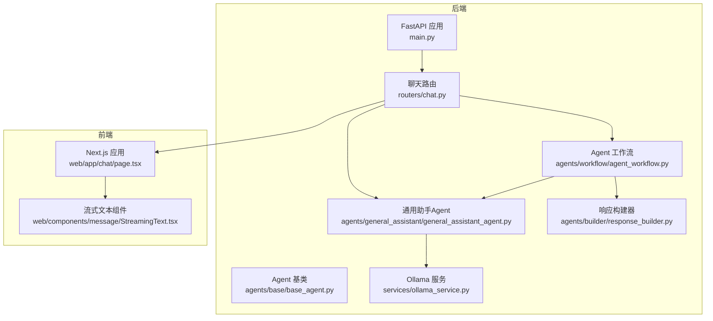
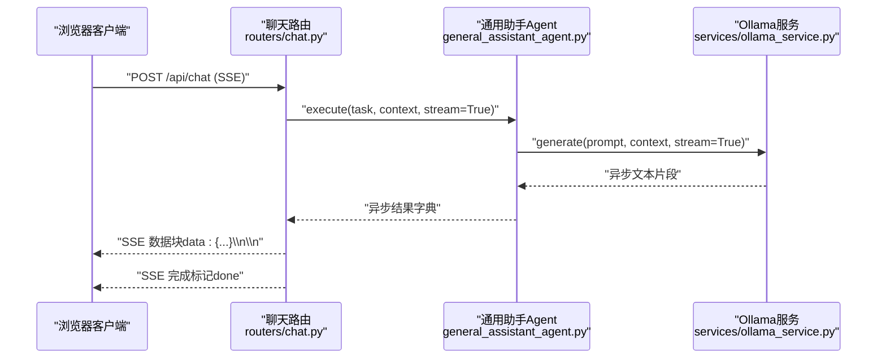
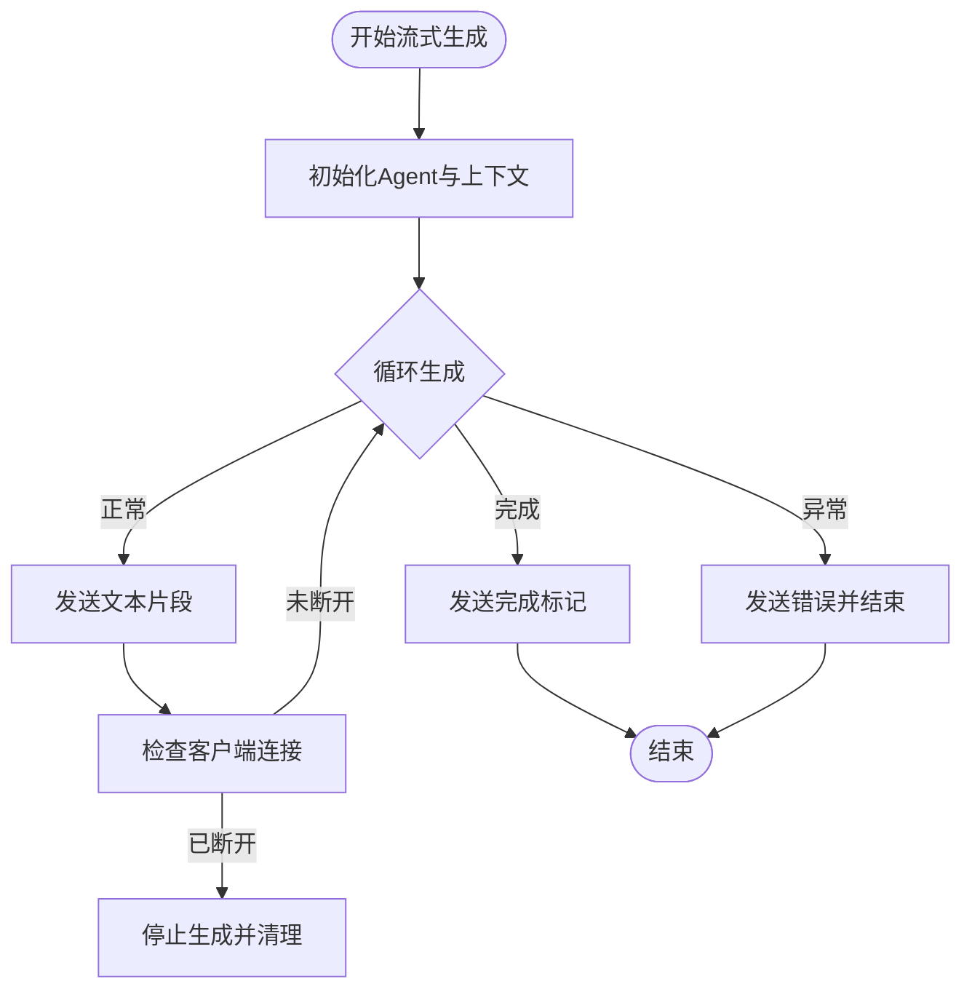
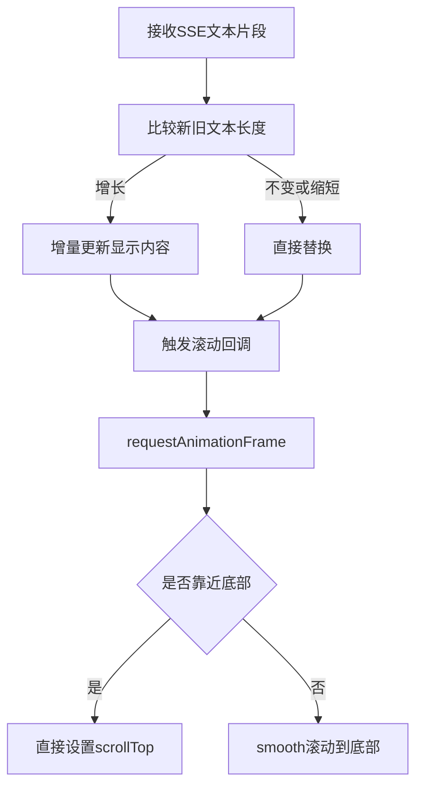
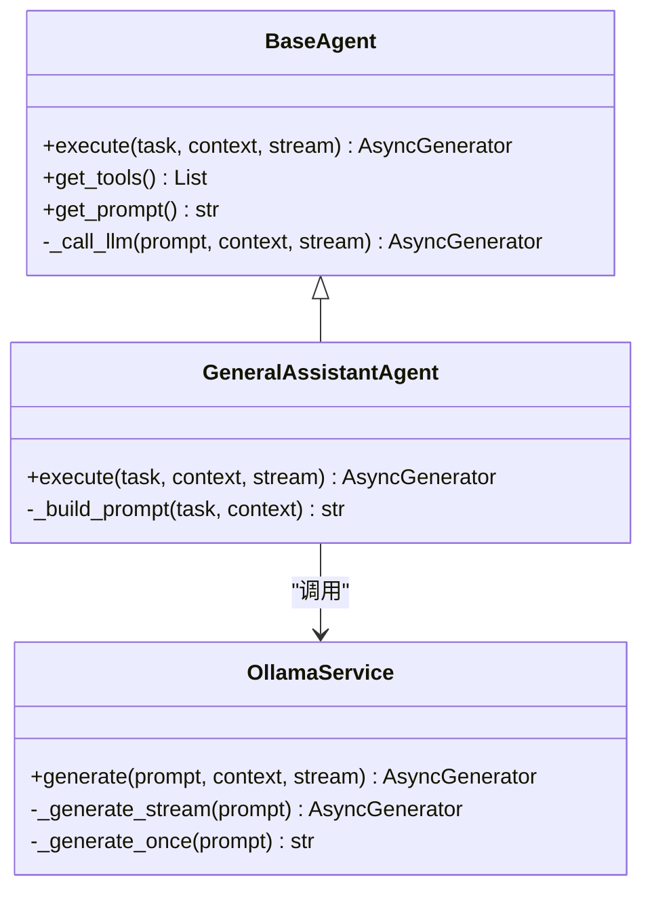
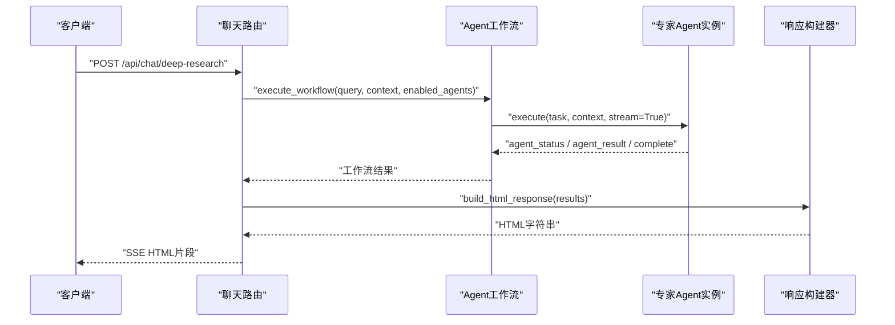
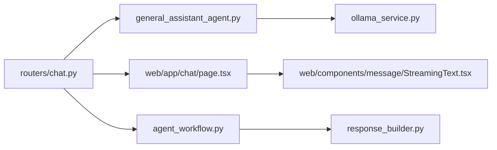

# 流式响应实现

<cite>
**本文档引用的文件**
- [main.py](file://main.py)
- [chat.py](file://routers/chat.py)
- [StreamingText.tsx](file://web/components/message/StreamingText.tsx)
- [page.tsx](file://web/app/chat/page.tsx)
- [base_agent.py](file://agents/base/base_agent.py)
- [general_assistant_agent.py](file://agents/general_assistant/general_assistant_agent.py)
- [ollama_service.py](file://services/ollama_service.py)
- [agent_workflow.py](file://agents/workflow/agent_workflow.py)
- [response_builder.py](file://agents/builder/response_builder.py)
</cite>

## 目录
1. [简介](#简介)
2. [项目结构](#项目结构)
3. [核心组件](#核心组件)
4. [架构概览](#架构概览)
5. [详细组件分析](#详细组件分析)
6. [依赖分析](#依赖分析)
7. [性能考虑](#性能考虑)
8. [故障排查指南](#故障排查指南)
9. [结论](#结论)

## 简介
本文件系统性阐述本项目的流式响应实现，重点围绕SSE（Server-Sent Events）协议在实时数据传输中的应用，涵盖连接建立、消息格式与断线重连机制；前端渲染优化（文本增量更新、光标管理、滚动控制）；后端流式生成（异步生成器、内存管理、错误处理）；以及流式响应与Agent系统的集成（多Agent并发流式输出与结果合并）。文档提供完整实现流程、性能优化技巧与故障恢复策略，帮助开发者快速理解并扩展流式能力。

## 项目结构
本项目采用前后端分离架构，后端基于FastAPI提供SSE流式接口，前端使用Next.js与React实现流式渲染与交互。关键模块如下：
- 后端路由层：提供SSE端点，负责连接建立、消息格式化与断线检测
- Agent层：封装多Agent协作与LLM调用，支持异步生成器
- 服务层：OllamaService负责与本地大模型服务通信，支持流式与非流式
- 前端组件：流式文本渲染、增量更新与滚动控制

**图表来源**
- [main.py:1-171](file://main.py#L1-L171)
- [chat.py:623-760](file://routers/chat.py#L623-L760)
- [base_agent.py:1-122](file://agents/base/base_agent.py#L1-L122)
- [general_assistant_agent.py:1-167](file://agents/general_assistant/general_assistant_agent.py#L1-L167)
- [ollama_service.py:1-674](file://services/ollama_service.py#L1-L674)
- [agent_workflow.py:1-388](file://agents/workflow/agent_workflow.py#L1-L388)
- [response_builder.py:1-272](file://agents/builder/response_builder.py#L1-L272)
- [page.tsx:1-200](file://web/app/chat/page.tsx#L1-L200)
- [StreamingText.tsx:1-79](file://web/components/message/StreamingText.tsx#L1-L79)

**章节来源**
- [main.py:1-171](file://main.py#L1-L171)
- [chat.py:623-760](file://routers/chat.py#L623-L760)

## 核心组件
- SSE路由与消息格式
  - 后端通过StreamingResponse返回text/event-stream，每条消息以"data:"开头，双换行分隔，支持done、error等标记
  - 断线检测：每N次yield检查客户端连接状态，异常时优雅终止
- Agent与异步生成器
  - Agent基类定义execute(stream)接口，返回异步生成器，逐片产出chunk
  - 通用助手Agent封装RAG检索与LLM生成，支持流式输出
- Ollama服务
  - 封装流式与非流式生成，内部使用线程池与队列在同步HTTP流与异步事件循环间桥接
  - 超时控制与空闲检测，避免长时间阻塞
- 前端流式渲染
  - 流式文本组件仅在文本增长时增量更新，减少重渲染
  - 光标闪烁动画与滚动控制，提升交互体验

**章节来源**
- [chat.py:673-752](file://routers/chat.py#L673-L752)
- [base_agent.py:37-55](file://agents/base/base_agent.py#L37-L55)
- [general_assistant_agent.py:49-167](file://agents/general_assistant/general_assistant_agent.py#L49-L167)
- [ollama_service.py:453-637](file://services/ollama_service.py#L453-L637)
- [StreamingText.tsx:16-45](file://web/components/message/StreamingText.tsx#L16-L45)

## 架构概览
下图展示从客户端发起请求到流式响应完成的关键交互流程，包括SSE连接、后端Agent执行、LLM生成与前端渲染。

**图表来源**
- [chat.py:673-752](file://routers/chat.py#L673-L752)
- [general_assistant_agent.py:124-156](file://agents/general_assistant/general_assistant_agent.py#L124-L156)
- [ollama_service.py:453-637](file://services/ollama_service.py#L453-L637)

## 详细组件分析

### SSE连接与消息格式
- 连接建立
  - 客户端发起POST请求到/api/chat，后端返回StreamingResponse，媒体类型为text/event-stream
  - 设置Cache-Control: no-cache、Connection: keep-alive与X-Accel-Buffering: no，确保代理与浏览器正确处理流式数据
- 消息格式
  - 文本片段：data: {"content": "..."}\n\n
  - 完成标记：data: {"done": true, ...}\n\n
  - 错误通知：data: {"error": "..."}\n\n
- 断线重连机制
  - 后端每N次yield检查客户端连接状态，若断开则停止生成并释放资源
  - 前端在SSE连接中断时可主动重建连接，建议使用指数退避策略

**图表来源**
- [chat.py:673-752](file://routers/chat.py#L673-L752)

**章节来源**
- [chat.py:673-752](file://routers/chat.py#L673-L752)

### 前端渲染优化：文本增量更新、光标管理与滚动控制
- 文本增量更新
  - 流式文本组件仅在检测到文本长度增长时更新显示内容，避免不必要的重渲染
  - 使用requestAnimationFrame确保DOM更新后再触发滚动，提升流畅度
- 光标管理
  - 实现光标闪烁动画，动画周期适配阅读节奏
- 滚动控制
  - 顶部容器高度变化时，根据用户位置与是否处于流式输出阶段决定滚动行为
  - 距离底部极近时直接设置scrollTop，其他场景使用smooth滚动，兼顾速度与体验

**图表来源**
- [StreamingText.tsx:26-45](file://web/components/message/StreamingText.tsx#L26-L45)
- [page.tsx:570-614](file://web/app/chat/page.tsx#L570-L614)

**章节来源**
- [StreamingText.tsx:16-79](file://web/components/message/StreamingText.tsx#L16-L79)
- [page.tsx:570-614](file://web/app/chat/page.tsx#L570-L614)

### 后端流式生成：异步生成器、内存管理与错误处理
- 异步生成器
  - Agent.execute返回异步生成器，逐片产出chunk，便于SSE推送
  - OllamaService在同步HTTP流与异步事件循环间使用线程池与队列桥接，避免阻塞
- 内存管理
  - 流式生成过程中累积文本，但仅保留必要状态；完成或异常时及时释放
  - 队列空等待采用短间隔与最大等待次数，防止无限阻塞
- 错误处理
  - 捕获CancelledError、BrokenPipeError、ConnectionResetError、OSError等，区分客户端断开与系统错误
  - 系统错误时发送error消息，客户端据此展示错误状态

**图表来源**
- [base_agent.py:37-98](file://agents/base/base_agent.py#L37-L98)
- [general_assistant_agent.py:49-167](file://agents/general_assistant/general_assistant_agent.py#L49-L167)
- [ollama_service.py:50-92](file://services/ollama_service.py#L50-L92)

**章节来源**
- [base_agent.py:37-98](file://agents/base/base_agent.py#L37-L98)
- [general_assistant_agent.py:49-167](file://agents/general_assistant/general_assistant_agent.py#L49-L167)
- [ollama_service.py:453-637](file://services/ollama_service.py#L453-L637)

### 流式响应与Agent系统集成：多Agent并发流式输出与结果合并
- 协调与编排
  - AgentWorkflow负责规划与调度多个专家Agent，按顺序执行以保证前端进度可见
  - 协调Agent返回被选中的Agent列表与任务分配，前端据此展示状态面板
- 并发与顺序
  - 为保证前端可观测性，当前实现采用顺序执行；如需更高吞吐，可在Agent内部实现并行子任务并在上游聚合
- 结果合并
  - 每个Agent生成完成后，汇总到响应构建器，生成HTML格式的综合报告
  - 前端可选择以HTML渲染或Markdown渲染方式展示

**图表来源**
- [chat.py:762-896](file://routers/chat.py#L762-L896)
- [agent_workflow.py:106-337](file://agents/workflow/agent_workflow.py#L106-L337)
- [response_builder.py:10-78](file://agents/builder/response_builder.py#L10-L78)

**章节来源**
- [chat.py:762-896](file://routers/chat.py#L762-L896)
- [agent_workflow.py:106-337](file://agents/workflow/agent_workflow.py#L106-L337)
- [response_builder.py:10-78](file://agents/builder/response_builder.py#L10-L78)

## 依赖分析
- 组件耦合
  - 路由层依赖Agent层与服务层；Agent层依赖服务层；前端组件依赖路由层提供的SSE数据
- 外部依赖
  - Ollama服务通过HTTP与本地模型通信，受网络与模型响应时间影响
  - 前端Next.js与React生态提供流式渲染与状态管理能力

**图表来源**
- [chat.py:623-760](file://routers/chat.py#L623-L760)
- [general_assistant_agent.py:1-167](file://agents/general_assistant/general_assistant_agent.py#L1-L167)
- [ollama_service.py:1-674](file://services/ollama_service.py#L1-L674)
- [page.tsx:1-200](file://web/app/chat/page.tsx#L1-L200)
- [StreamingText.tsx:1-79](file://web/components/message/StreamingText.tsx#L1-L79)
- [agent_workflow.py:1-388](file://agents/workflow/agent_workflow.py#L1-L388)
- [response_builder.py:1-272](file://agents/builder/response_builder.py#L1-L272)

**章节来源**
- [chat.py:623-760](file://routers/chat.py#L623-L760)

## 性能考虑
- 流式生成
  - 后端每N次yield检查连接状态，降低频繁I/O开销
  - 前端仅在文本增长时更新DOM，减少重渲染
- 超时与空闲检测
  - Ollama服务设置较长超时与空闲超时，避免长时间阻塞
  - 队列空等待采用短间隔与最大等待次数，平衡延迟与CPU占用
- 内存与并发
  - 控制同时活跃的Agent数量，避免内存峰值过高
  - 使用线程池隔离同步HTTP流，避免阻塞事件循环

[本节为通用指导，无需引用具体文件]

## 故障排查指南
- 客户端断开连接
  - 后端捕获CancelledError、BrokenPipeError、ConnectionResetError、OSError，记录日志并停止生成
  - 前端在SSE连接中断时重建连接，建议指数退避
- 服务端错误
  - 系统错误时发送error消息，前端展示错误状态并允许重试
- 模型响应慢
  - 调整OLLAMA_TIMEOUT与空闲超时参数，合理设置Agent超时策略
- 前端渲染卡顿
  - 检查增量更新逻辑与requestAnimationFrame使用，避免在滚动期间进行复杂计算

**章节来源**
- [chat.py:720-743](file://routers/chat.py#L720-L743)
- [ollama_service.py:526-631](file://services/ollama_service.py#L526-L631)

## 结论
本项目通过SSE协议实现了高效的实时流式响应，结合Agent系统与LLM服务，提供了可扩展的多Agent协作能力。后端采用异步生成器与线程池桥接，前端实现增量渲染与滚动优化，整体在性能与用户体验上取得良好平衡。建议在生产环境中进一步完善断线重连策略、错误恢复与监控告警，以提升稳定性与可观测性。