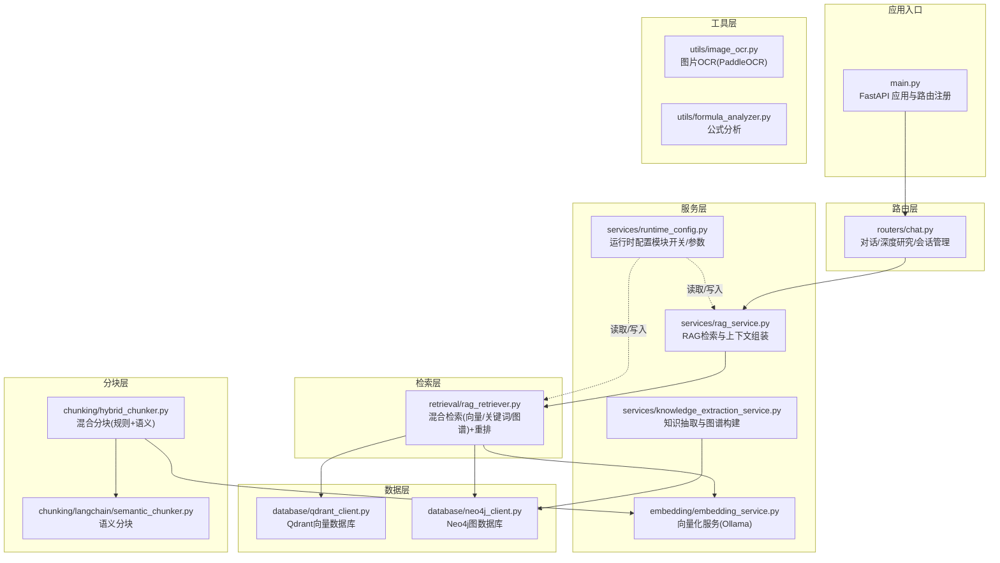
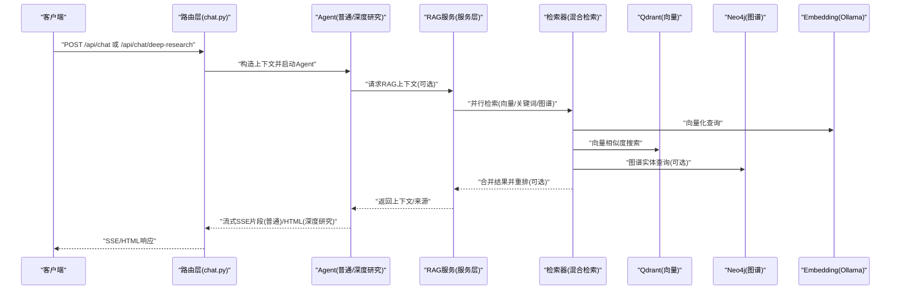
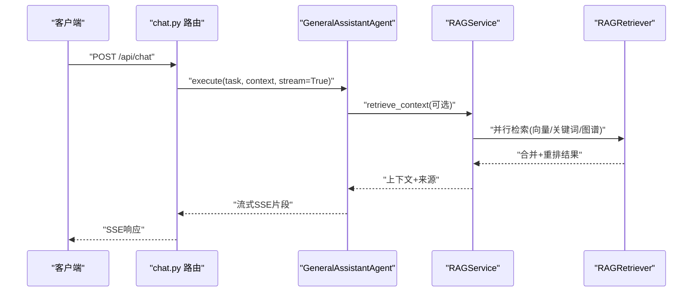
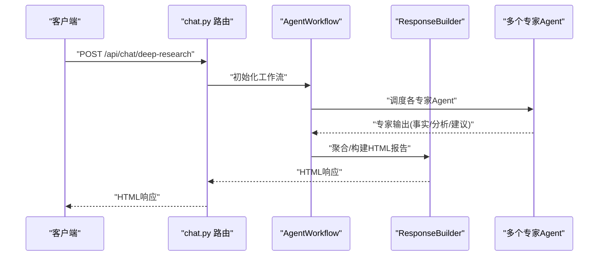
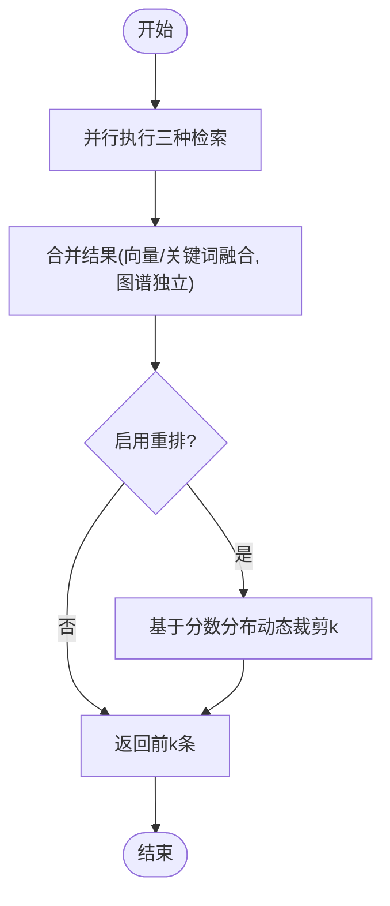
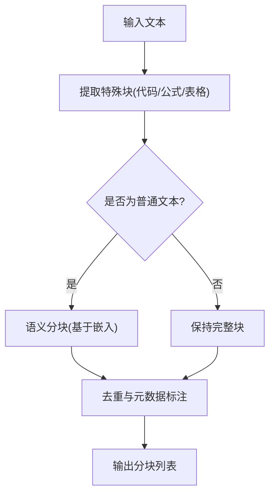
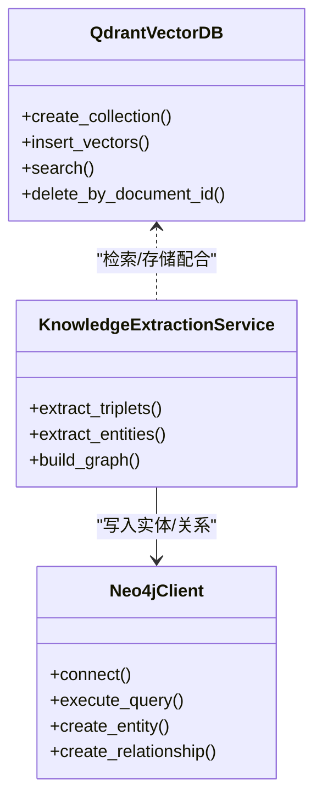
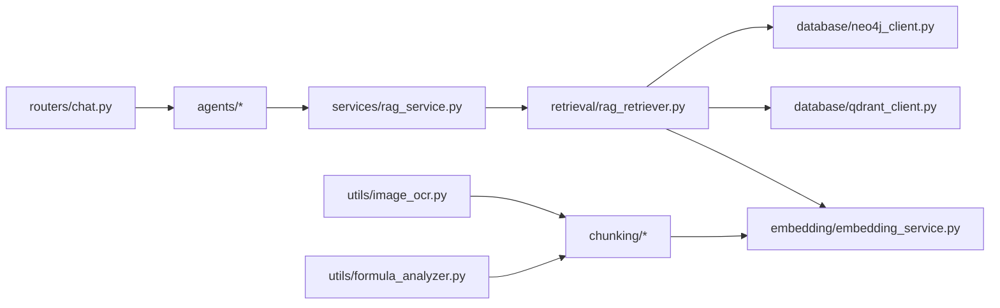

# 核心功能详解

<cite>
**本文引用的文件**
- [main.py](file://main.py)
- [README.md](file://README.md)
- [agents/base/base_agent.py](file://agents/base/base_agent.py)
- [services/rag_service.py](file://services/rag_service.py)
- [chunking/hybrid_chunker.py](file://chunking/hybrid_chunker.py)
- [chunking/langchain/semantic_chunker.py](file://chunking/langchain/semantic_chunker.py)
- [retrieval/rag_retriever.py](file://retrieval/rag_retriever.py)
- [database/qdrant_client.py](file://database/qdrant_client.py)
- [database/neo4j_client.py](file://database/neo4j_client.py)
- [embedding/embedding_service.py](file://embedding/embedding_service.py)
- [services/knowledge_extraction_service.py](file://services/knowledge_extraction_service.py)
- [utils/image_ocr.py](file://utils/image_ocr.py)
- [utils/formula_analyzer.py](file://utils/formula_analyzer.py)
- [routers/chat.py](file://routers/chat.py)
- [services/runtime_config.py](file://services/runtime_config.py)
</cite>

## 目录
1. [简介](#简介)
2. [项目结构](#项目结构)
3. [核心组件](#核心组件)
4. [架构总览](#架构总览)
5. [详细组件分析](#详细组件分析)
6. [依赖分析](#依赖分析)
7. [性能考量](#性能考量)
8. [故障排查指南](#故障排查指南)
9. [结论](#结论)
10. [附录](#附录)

## 简介
本文件面向 Advanced RAG 的核心功能，围绕智能对话系统、文档处理系统、检索增强系统与混合分块策略展开，重点解释普通对话模式、深度研究模式与流式响应机制，以及双路索引架构（向量索引 Qdrant + 知识图谱索引 Neo4j）的协同工作机制。文档提供代码级架构图、流程图与序列图，帮助读者快速理解系统设计与实现细节。

## 项目结构
后端基于 FastAPI，采用模块化分层设计：
- 路由层：负责 HTTP 接口与参数校验
- 服务层：封装业务逻辑（RAG、知识抽取、模型选择等）
- 数据层：封装数据库客户端（MongoDB、Qdrant、Neo4j）
- 工具层：日志、监控、OCR、公式分析等
- 代理系统：多 Agent 协作（普通对话与深度研究）

图表来源
- [main.py:55-99](file://main.py#L55-L99)
- [routers/chat.py:623-760](file://routers/chat.py#L623-L760)
- [services/rag_service.py:34-126](file://services/rag_service.py#L34-L126)
- [retrieval/rag_retriever.py:89-137](file://retrieval/rag_retriever.py#L89-L137)
- [database/qdrant_client.py:18-123](file://database/qdrant_client.py#L18-L123)
- [database/neo4j_client.py:6-39](file://database/neo4j_client.py#L6-L39)
- [chunking/hybrid_chunker.py:52-121](file://chunking/hybrid_chunker.py#L52-L121)
- [chunking/langchain/semantic_chunker.py:81-138](file://chunking/langchain/semantic_chunker.py#L81-L138)
- [embedding/embedding_service.py:8-44](file://embedding/embedding_service.py#L8-L44)
- [services/knowledge_extraction_service.py:12-34](file://services/knowledge_extraction_service.py#L12-L34)
- [utils/image_ocr.py:7-37](file://utils/image_ocr.py#L7-L37)
- [utils/formula_analyzer.py:8-77](file://utils/formula_analyzer.py#L8-L77)
- [services/runtime_config.py:140-161](file://services/runtime_config.py#L140-L161)

章节来源
- [main.py:1-171](file://main.py#L1-L171)
- [README.md:46-54](file://README.md#L46-L54)

## 核心组件
- 普通对话模式：通过流式 SSE 将 LLM 生成的文本片段实时返回给前端，支持断开检测与回退策略。
- 深度研究模式：基于多 Agent 协作的工作流，聚合多个专家 Agent 的输出，生成深度研究报告。
- 检索增强系统：混合检索（向量 + 关键词 + 图谱）+ 重排优化，动态调节候选池与最终返回数量。
- 混合分块策略：规则分块（代码/公式/表格）+ 语义分块（Ollama 嵌入），并进行去重与元数据标注。
- 双路索引架构：Qdrant 向量索引 + Neo4j 知识图谱索引，检索与重排模块按运行时配置动态启用。

章节来源
- [routers/chat.py:623-760](file://routers/chat.py#L623-L760)
- [routers/chat.py:762-800](file://routers/chat.py#L762-L800)
- [services/rag_service.py:34-126](file://services/rag_service.py#L34-L126)
- [retrieval/rag_retriever.py:17-51](file://retrieval/rag_retriever.py#L17-L51)
- [chunking/hybrid_chunker.py:52-121](file://chunking/hybrid_chunker.py#L52-L121)
- [database/qdrant_client.py:18-123](file://database/qdrant_client.py#L18-L123)
- [database/neo4j_client.py:6-39](file://database/neo4j_client.py#L6-L39)

## 架构总览
下面的架构图展示了从请求到响应的关键路径，包括流式响应、RAG 检索与混合检索、重排与图谱查询。

图表来源
- [routers/chat.py:623-760](file://routers/chat.py#L623-L760)
- [routers/chat.py:762-800](file://routers/chat.py#L762-L800)
- [services/rag_service.py:34-126](file://services/rag_service.py#L34-L126)
- [retrieval/rag_retriever.py:89-137](file://retrieval/rag_retriever.py#L89-L137)
- [database/qdrant_client.py:336-414](file://database/qdrant_client.py#L336-L414)
- [database/neo4j_client.py:40-62](file://database/neo4j_client.py#L40-L62)
- [embedding/embedding_service.py:175-291](file://embedding/embedding_service.py#L175-L291)

## 详细组件分析

### 普通对话模式与流式响应机制
- 路由层接收请求，构造上下文（助手ID、知识空间、对话历史、是否启用 RAG 等），并启动 Agent 执行。
- Agent 以流式方式产出文本片段，通过 SSE（text/event-stream）实时推送给客户端。
- 支持客户端断开检测，及时停止生成，避免资源浪费。
- 当启用 RAG 时，服务层会并行检索文档与资源，拼接上下文并控制 token 预算，再交由 Agent 生成回复。

图表来源
- [routers/chat.py:623-760](file://routers/chat.py#L623-L760)
- [services/rag_service.py:34-126](file://services/rag_service.py#L34-L126)
- [retrieval/rag_retriever.py:115-137](file://retrieval/rag_retriever.py#L115-L137)

章节来源
- [routers/chat.py:623-760](file://routers/chat.py#L623-L760)
- [services/rag_service.py:268-317](file://services/rag_service.py#L268-L317)

### 深度研究模式与多 Agent 协作
- 深度研究模式通过工作流与响应构建器协调多个专家 Agent，生成深度研究报告。
- 支持指定启用的专家 Agent 列表与子 Agent 配置，便于定制化研究方向。
- 返回 HTML 格式响应，前端可渲染为富文本报告。

图表来源
- [routers/chat.py:762-800](file://routers/chat.py#L762-L800)

章节来源
- [routers/chat.py:762-800](file://routers/chat.py#L762-L800)

### 检索增强系统与混合检索
- 检索器支持三种检索策略并行执行：向量检索、关键词检索、图谱检索（可按运行时配置启用）。
- 合并策略对向量与关键词结果进行打分融合，图谱结果独立加入。
- 可选重排模块使用 CrossEncoder 对候选进行重排，动态裁剪最终返回数量以平衡召回与精度。

图表来源
- [retrieval/rag_retriever.py:115-137](file://retrieval/rag_retriever.py#L115-L137)
- [retrieval/rag_retriever.py:328-363](file://retrieval/rag_retriever.py#L328-L363)
- [retrieval/rag_retriever.py:139-167](file://retrieval/rag_retriever.py#L139-L167)
- [retrieval/rag_retriever.py:365-392](file://retrieval/rag_retriever.py#L365-L392)

章节来源
- [retrieval/rag_retriever.py:17-51](file://retrieval/rag_retriever.py#L17-L51)
- [retrieval/rag_retriever.py:89-137](file://retrieval/rag_retriever.py#L89-L137)
- [services/runtime_config.py:140-161](file://services/runtime_config.py#L140-L161)

### 混合分块策略与文档预处理
- 混合分块器先提取特殊块（代码、公式、表格），再对普通文本使用语义分块（基于 Ollama 嵌入）。
- 语义分块器延迟初始化，兼容不同 LangChain 版本，失败时回退到简单分块。
- 分块结果去重并标注 content_type，保证检索与展示质量。

图表来源
- [chunking/hybrid_chunker.py:52-121](file://chunking/hybrid_chunker.py#L52-L121)
- [chunking/langchain/semantic_chunker.py:81-138](file://chunking/langchain/semantic_chunker.py#L81-L138)

章节来源
- [chunking/hybrid_chunker.py:52-121](file://chunking/hybrid_chunker.py#L52-L121)
- [chunking/langchain/semantic_chunker.py:31-79](file://chunking/langchain/semantic_chunker.py#L31-L79)

### 双路索引架构与知识抽取
- 向量索引：Qdrant 提供高维向量的相似度检索，支持 gRPC 连接与自动集合创建/维度校验。
- 知识图谱：Neo4j 存储实体-关系-实体三元组，支持实体抽取与关系创建。
- 知识抽取服务：从文本中抽取三元组并写入 Neo4j，支持 JSON 输出解析与关系规范化。

图表来源
- [database/qdrant_client.py:18-123](file://database/qdrant_client.py#L18-L123)
- [database/neo4j_client.py:6-39](file://database/neo4j_client.py#L6-L39)
- [services/knowledge_extraction_service.py:12-34](file://services/knowledge_extraction_service.py#L12-L34)

章节来源
- [database/qdrant_client.py:336-414](file://database/qdrant_client.py#L336-L414)
- [database/neo4j_client.py:40-62](file://database/neo4j_client.py#L40-L62)
- [services/knowledge_extraction_service.py:147-213](file://services/knowledge_extraction_service.py#L147-L213)

### OCR 与公式识别
- 图片 OCR：使用 PaddleOCR 识别图片中的文字，支持 PDF 中图片的提取与逐页 OCR。
- 公式分析：从 LaTeX 公式中提取变量、关系、函数与结构信息，辅助检索与展示。

章节来源
- [utils/image_ocr.py:38-123](file://utils/image_ocr.py#L38-L123)
- [utils/image_ocr.py:124-218](file://utils/image_ocr.py#L124-L218)
- [utils/formula_analyzer.py:33-77](file://utils/formula_analyzer.py#L33-L77)

## 依赖分析
- 组件耦合与内聚
  - 路由层与服务层解耦，路由仅负责参数与流式响应，业务逻辑集中在服务层。
  - 检索器与数据层解耦，通过统一接口访问 Qdrant 与 Neo4j。
  - 分块器与嵌入服务解耦，语义分块依赖嵌入服务，混合分块器内部组合。
- 外部依赖
  - Ollama：提供嵌入与生成能力，嵌入服务对模型名称进行规范化与检测。
  - Qdrant：向量检索与集合管理，支持 gRPC 与自动集合创建。
  - Neo4j：图谱查询与实体/关系写入。
  - PaddleOCR：图片 OCR，PyMuPDF：PDF 图片提取。

图表来源
- [routers/chat.py:623-760](file://routers/chat.py#L623-L760)
- [services/rag_service.py:34-126](file://services/rag_service.py#L34-L126)
- [retrieval/rag_retriever.py:89-137](file://retrieval/rag_retriever.py#L89-L137)
- [embedding/embedding_service.py:8-44](file://embedding/embedding_service.py#L8-L44)
- [database/qdrant_client.py:18-123](file://database/qdrant_client.py#L18-L123)
- [database/neo4j_client.py:6-39](file://database/neo4j_client.py#L6-L39)
- [chunking/hybrid_chunker.py:52-121](file://chunking/hybrid_chunker.py#L52-L121)
- [utils/image_ocr.py:7-37](file://utils/image_ocr.py#L7-L37)
- [utils/formula_analyzer.py:8-77](file://utils/formula_analyzer.py#L8-L77)

## 性能考量
- 检索性能
  - 向量检索使用 gRPC 连接与自动集合创建，减少 HTTP 依赖与连接问题。
  - 检索器支持动态裁剪 k，依据重排分数分布提升精度与稳定性。
- 重排优化
  - CrossEncoder 重排模块按需加载，失败自动降级，避免影响整体性能。
- 并发与吞吐
  - 路由层使用 SSE 流式输出，支持客户端断开检测，降低无效负载。
  - 运行时配置模块支持并发与批大小参数调整，按场景切换 low/high/custom 模式。
- 文本处理
  - 语义分块器失败回退到简单分块，保证稳定性。
  - OCR 与公式分析作为可选模块，按运行时配置启用。

章节来源
- [database/qdrant_client.py:66-96](file://database/qdrant_client.py#L66-L96)
- [retrieval/rag_retriever.py:139-167](file://retrieval/rag_retriever.py#L139-L167)
- [retrieval/rag_retriever.py:52-69](file://retrieval/rag_retriever.py#L52-L69)
- [routers/chat.py:744-752](file://routers/chat.py#L744-L752)
- [services/runtime_config.py:86-83](file://services/runtime_config.py#L86-L83)

## 故障排查指南
- Qdrant 连接问题
  - 现象：连接失败或 502/503/504 错误。
  - 处理：自动重试、指数退避、维度不匹配时自动重建集合。
- Neo4j 连接问题
  - 现象：连接失败或查询异常。
  - 处理：连接失败冷却（5 分钟），避免频繁日志刷屏。
- Ollama 嵌入失败
  - 现象：超时、连接错误、模型未找到。
  - 处理：多轮重试、递增等待、模型名称规范化与自动检测。
- OCR 与公式分析
  - 现象：OCR 引擎未初始化、PDF 图片提取失败。
  - 处理：延迟初始化、异常捕获与降级返回。

章节来源
- [database/qdrant_client.py:278-334](file://database/qdrant_client.py#L278-L334)
- [database/neo4j_client.py:16-33](file://database/neo4j_client.py#L16-L33)
- [embedding/embedding_service.py:227-290](file://embedding/embedding_service.py#L227-L290)
- [utils/image_ocr.py:15-37](file://utils/image_ocr.py#L15-L37)

## 结论
Advanced RAG 通过“普通对话 + 深度研究”的双模式设计、混合分块与混合检索的检索增强、以及 Qdrant 与 Neo4j 的双路索引架构，实现了高效、稳定且可扩展的智能问答系统。运行时配置模块进一步提升了系统在不同场景下的灵活性与性能表现。

## 附录
- 环境变量与配置要点
  - Ollama：基础地址、嵌入模型、最大字符数、重试次数。
  - Qdrant：URL、API Key、超时、gRPC 端口、集合创建与维度校验。
  - Neo4j：URI、用户名、密码、启用标志。
  - 运行时配置：模块开关（kg_extract_enabled、kg_retrieve_enabled、rerank_enabled 等）、并发与批大小参数。
- API 接口概览
  - 对话：POST /api/chat（流式）、POST /api/chat/deep-research（HTML）。
  - 会话：创建/查询/更新/删除、消息增删改、重新生成。
  - 知识空间与检索：知识空间列表、检索服务等。

章节来源
- [README.md:125-166](file://README.md#L125-L166)
- [routers/chat.py:623-800](file://routers/chat.py#L623-L800)
- [services/runtime_config.py:41-83](file://services/runtime_config.py#L41-L83)