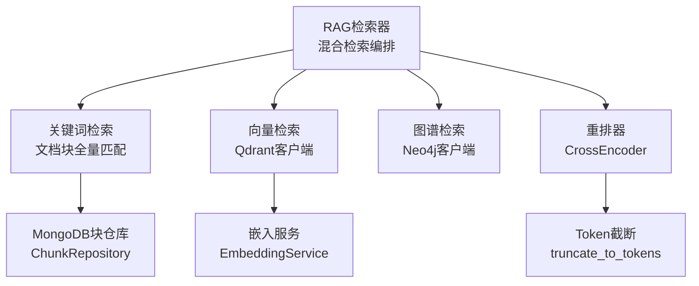
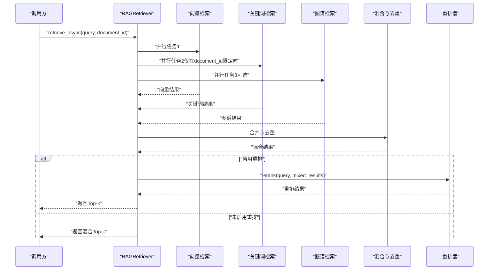
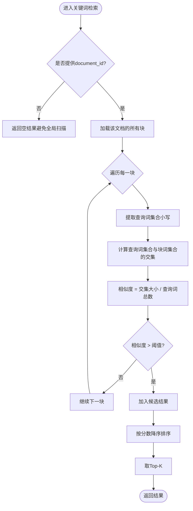
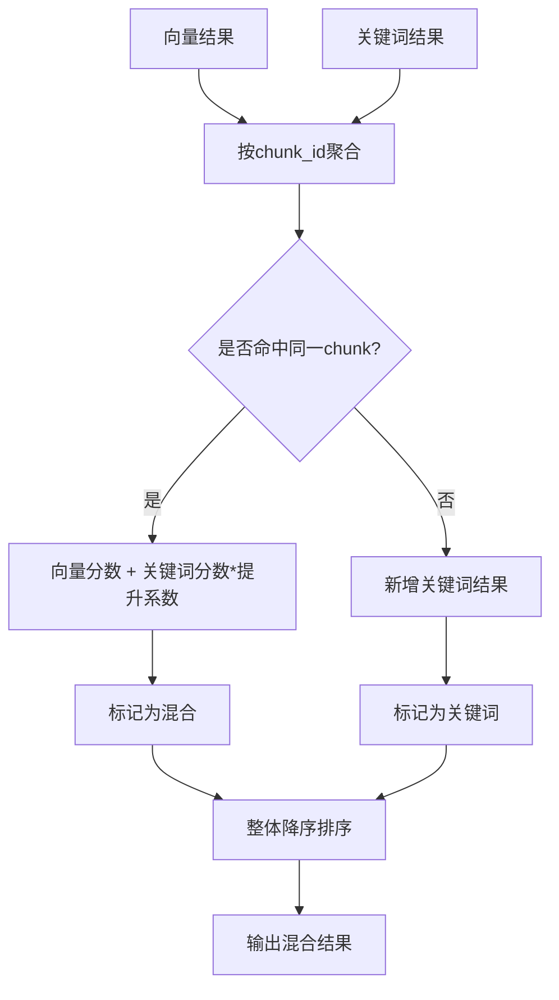
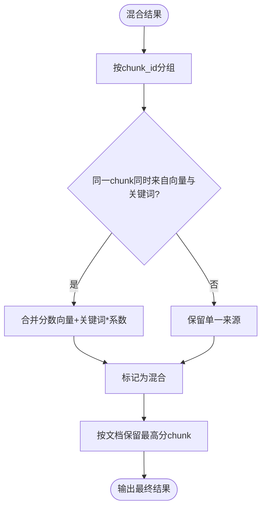
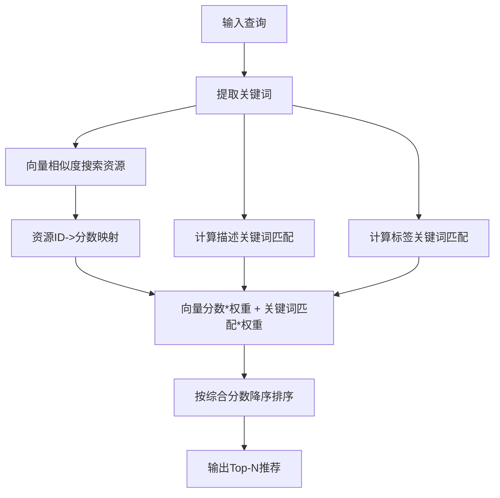
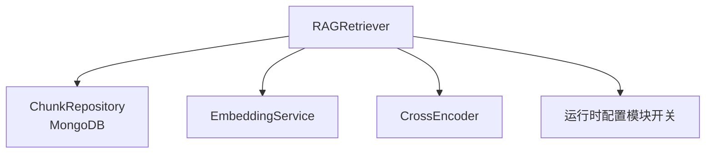

# 关键词检索

<cite>
**本文引用的文件**
- [rag_retriever.py](file://retrieval/rag_retriever.py)
- [recommendation_service.py](file://services/recommendation_service.py)
- [mongodb.py](file://database/mongodb.py)
- [retrieval_eval.py](file://eval/retrieval_eval.py)
- [runtime_config.py](file://services/runtime_config.py)
- [query_analyzer.py](file://services/query_analyzer.py)
- [model_selector.py](file://services/model_selector.py)
- [logger.py](file://utils/logger.py)
</cite>

## 目录
1. [简介](#简介)
2. [项目结构](#项目结构)
3. [核心组件](#核心组件)
4. [架构总览](#架构总览)
5. [详细组件分析](#详细组件分析)
6. [依赖分析](#依赖分析)
7. [性能考量](#性能考量)
8. [故障排查指南](#故障排查指南)
9. [结论](#结论)
10. [附录](#附录)

## 简介
本章节聚焦于关键词检索模块的设计与实现，涵盖查询关键字提取、文档块全量匹配与相似度评分算法，并系统阐述性能优化策略（文档ID过滤、查询优化、索引使用）、在混合检索中的作用（分数提升机制与结果去重策略），以及配置参数、调优技巧与最佳实践。

## 项目结构
关键词检索位于检索层，与向量检索、图谱检索共同构成混合检索流程。其核心入口为检索器类，负责并行调度多种检索策略并在混合阶段对关键词结果进行分数提升与去重。

**图表来源**
- [rag_retriever.py:17-137](file://retrieval/rag_retriever.py#L17-L137)
- [rag_retriever.py:206-240](file://retrieval/rag_retriever.py#L206-L240)
- [mongodb.py:822-825](file://database/mongodb.py#L822-L825)

**章节来源**
- [rag_retriever.py:17-137](file://retrieval/rag_retriever.py#L17-L137)

## 核心组件
- RAGRetriever：混合检索编排器，负责并行执行向量检索、关键词检索与图谱检索，并在混合阶段对关键词结果进行分数提升与去重。
- 关键词检索子流程：在指定文档范围内对所有块进行全量匹配，计算查询关键字与块文本的交集比例作为相似度分数。
- MongoDB块仓库：提供按文档ID获取所有块的能力，支撑关键词检索的全量扫描。
- 运行时配置：通过运行时开关控制图谱检索与重排器启用状态，间接影响关键词检索在整个混合流程中的权重与开销。

**章节来源**
- [rag_retriever.py:206-240](file://retrieval/rag_retriever.py#L206-L240)
- [mongodb.py:822-825](file://database/mongodb.py#L822-L825)
- [runtime_config.py:140-161](file://services/runtime_config.py#L140-L161)

## 架构总览
关键词检索在混合检索中的定位是“补充证据与分数提升”。其典型流程如下：

**图表来源**
- [rag_retriever.py:115-137](file://retrieval/rag_retriever.py#L115-L137)
- [rag_retriever.py:328-363](file://retrieval/rag_retriever.py#L328-L363)
- [rag_retriever.py:365-391](file://retrieval/rag_retriever.py#L365-L391)

## 详细组件分析

### 关键词检索实现机制
- 查询关键字提取：将查询按空白切分为词集合，统一转为小写以提升匹配鲁棒性。
- 文档块全量匹配：仅在传入document_id时执行，避免全局扫描导致性能灾难；对目标文档内所有块遍历，计算查询词集合与块文本词集合的交集比例作为相似度分数。
- 相似度评分算法：交集大小/查询词总数，设置最低阈值以过滤噪声匹配；最终按分数降序取前K条结果。

**图表来源**
- [rag_retriever.py:206-240](file://retrieval/rag_retriever.py#L206-L240)

**章节来源**
- [rag_retriever.py:206-240](file://retrieval/rag_retriever.py#L206-L240)

### 混合检索中的作用与分数提升
- 混合策略：向量结果作为基础分数，关键词结果在命中同一chunk时进行分数提升，并标记检索类型为“混合”；未命中的关键词结果则作为独立“关键词”结果参与排序。
- 分数提升系数：关键词命中结果的分数按固定比例叠加，随后整体再进行一次排序，确保高相关证据优先。

**图表来源**
- [rag_retriever.py:328-363](file://retrieval/rag_retriever.py#L328-L363)

**章节来源**
- [rag_retriever.py:328-363](file://retrieval/rag_retriever.py#L328-L363)

### 结果去重策略
- 去重依据：以chunk_id为键进行聚合，若同一chunk同时被向量与关键词命中，则仅保留一条记录并进行分数提升；否则新增独立记录。
- 文档级去重：在拼接上下文时，按文档维度保留最高分chunk，避免同文档重复证据过多。

**图表来源**
- [rag_retriever.py:328-363](file://retrieval/rag_retriever.py#L328-L363)
- [rag_retriever.py:172-200](file://retrieval/rag_retriever.py#L172-L200)

**章节来源**
- [rag_retriever.py:328-363](file://retrieval/rag_retriever.py#L328-L363)
- [rag_retriever.py:172-200](file://retrieval/rag_retriever.py#L172-L200)

### 关键词匹配在推荐系统中的应用
- 关键词提取：使用中文关键词抽取工具提取查询关键词。
- 资源匹配：对资源标题、描述与标签分别计算关键词匹配分数，综合得到资源推荐分数。
- 权重分配：标题、描述与标签的匹配分数按不同权重融合，形成最终推荐分数。

**图表来源**
- [recommendation_service.py:63-80](file://services/recommendation_service.py#L63-L80)
- [recommendation_service.py:82-134](file://services/recommendation_service.py#L82-L134)
- [recommendation_service.py:209-360](file://services/recommendation_service.py#L209-L360)

**章节来源**
- [recommendation_service.py:63-80](file://services/recommendation_service.py#L63-L80)
- [recommendation_service.py:82-134](file://services/recommendation_service.py#L82-L134)
- [recommendation_service.py:209-360](file://services/recommendation_service.py#L209-L360)

## 依赖分析
- 检索器依赖MongoDB块仓库按文档ID加载块；向量检索依赖嵌入服务与Qdrant客户端；重排依赖CrossEncoder模型。
- 运行时配置通过模块开关控制图谱检索与重排器启用，间接影响关键词检索在整个流程中的权重与成本。

**图表来源**
- [rag_retriever.py:45-50](file://retrieval/rag_retriever.py#L45-L50)
- [runtime_config.py:140-161](file://services/runtime_config.py#L140-L161)

**章节来源**
- [rag_retriever.py:45-50](file://retrieval/rag_retriever.py#L45-L50)
- [runtime_config.py:140-161](file://services/runtime_config.py#L140-L161)

## 性能考量
- 文档ID过滤：关键词检索仅在提供document_id时执行，避免全局扫描；这是性能优化的首要策略。
- 查询优化：将查询拆分为词集合并统一小写，降低匹配成本；仅当相似度超过阈值时纳入候选，减少无效处理。
- 索引使用：当前实现为全量扫描，建议在MongoDB层面为chunks集合建立合适的索引（如document_id、text字段），以加速按文档加载与文本匹配。
- 重排与动态裁剪：启用重排时，结合动态K调整策略在召回与精度之间取得平衡；合理设置prefetch_k与score_threshold有助于控制候选规模。
- 日志与可观测性：通过日志模块记录关键路径与异常，便于定位性能瓶颈。

**章节来源**
- [rag_retriever.py:211-215](file://retrieval/rag_retriever.py#L211-L215)
- [rag_retriever.py:224-225](file://retrieval/rag_retriever.py#L224-L225)
- [logger.py:15-82](file://utils/logger.py#L15-L82)

## 故障排查指南
- 关键词检索无结果
  - 确认是否传入了document_id；未传入时将直接跳过关键词检索。
  - 检查查询是否过于稀疏或阈值过高，导致无候选。
- 性能问题
  - 确认是否对chunks集合建立了合适的索引；优化按文档加载与文本匹配。
  - 调整prefetch_k与score_threshold，避免候选过多或过少。
- 混合检索效果不佳
  - 检查关键词分数提升系数与重排器配置；必要时调整权重或禁用重排观察差异。
- 运行时配置
  - 通过运行时配置接口更新模块开关，验证图谱检索与重排器是否按预期启用。

**章节来源**
- [rag_retriever.py:211-215](file://retrieval/rag_retriever.py#L211-L215)
- [retrieval_eval.py:35-96](file://eval/retrieval_eval.py#L35-L96)
- [runtime_config.py:140-217](file://services/runtime_config.py#L140-L217)

## 结论
关键词检索在混合检索中承担“补充证据与分数提升”的角色，通过严格的文档ID过滤与查询优化，避免全局扫描带来的性能问题。合理的阈值、动态K与重排策略能够进一步提升检索质量与效率。建议在MongoDB层面完善索引设计，并结合运行时配置灵活控制各模块的启用状态。

## 附录

### 配置参数与环境变量
- 检索器参数
  - final_k：最终返回的检索结果数量
  - prefetch_k：向量检索候选池大小（默认按final_k放大）
  - score_threshold：相似度阈值
  - enable_reranker：是否启用重排（读取环境变量）
  - reranker_model：重排模型名（读取环境变量）
  - reranker_device：重排设备（读取环境变量）
  - reranker_max_tokens：送入重排器的最大token数
- 运行时模块开关
  - kg_retrieve_enabled：图谱检索开关
  - rerank_enabled：重排器开关
- 评估与调优
  - RETRIEVAL_PREFETCH_K：评估脚本使用的候选池大小
  - RETRIEVAL_SCORE_THRESHOLD：评估脚本使用的相似度阈值
  - DYNK_MIN/DYNK_MAX：动态K的最小/最大值
  - DYNK_GAP_HIGH/DYNK_GAP_LOW：动态K的区分度阈值

**章节来源**
- [rag_retriever.py:20-50](file://retrieval/rag_retriever.py#L20-L50)
- [retrieval_eval.py:82-83](file://eval/retrieval_eval.py#L82-L83)
- [rag_retriever.py:139-167](file://retrieval/rag_retriever.py#L139-L167)
- [runtime_config.py:140-161](file://services/runtime_config.py#L140-L161)

### 最佳实践
- 优先传入document_id以触发关键词检索，避免全局扫描。
- 对查询进行预处理（如去除多余空白、标准化大小写）以提升匹配准确率。
- 合理设置相似度阈值与Top-K，结合重排与动态K策略获得更佳的召回与精度平衡。
- 在MongoDB中为chunks集合建立索引，显著降低按文档加载与文本匹配的延迟。
- 通过运行时配置按需启用图谱检索与重排器，避免不必要的计算开销。

**章节来源**
- [rag_retriever.py:211-215](file://retrieval/rag_retriever.py#L211-L215)
- [rag_retriever.py:224-225](file://retrieval/rag_retriever.py#L224-L225)
- [runtime_config.py:140-161](file://services/runtime_config.py#L140-L161)