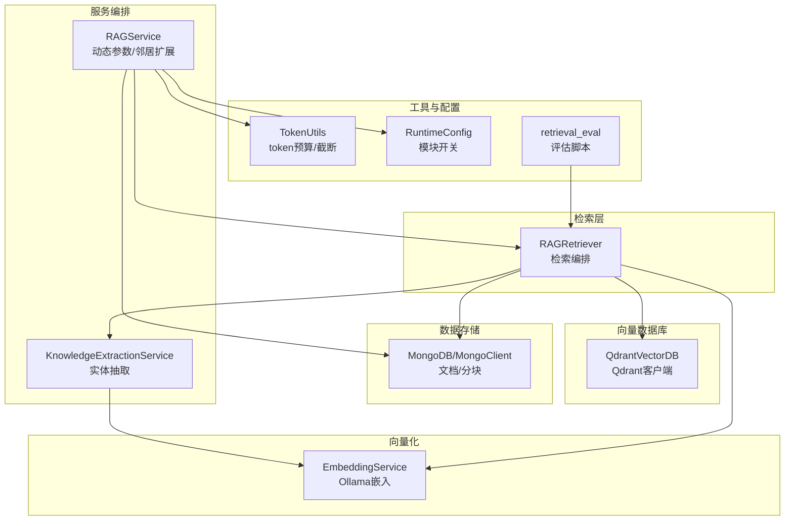
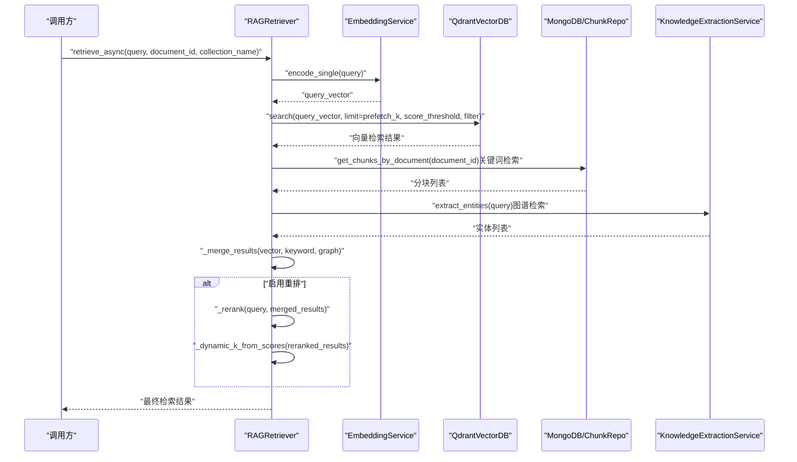
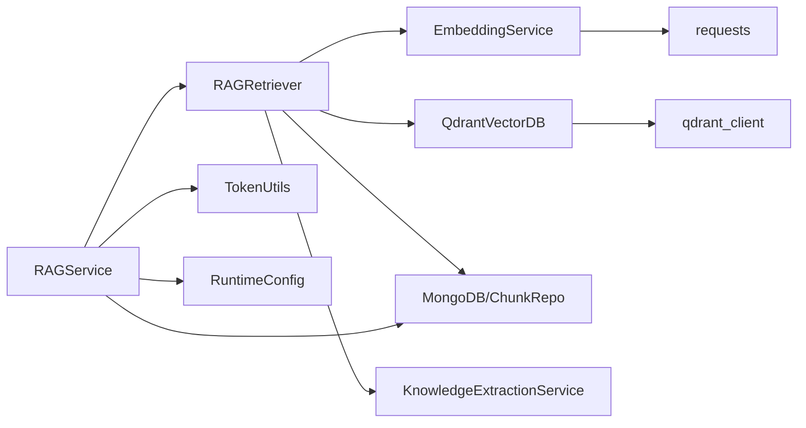

# 向量检索

<cite>
**本文引用的文件**
- [rag_retriever.py](file://retrieval/rag_retriever.py)
- [qdrant_client.py](file://database/qdrant_client.py)
- [embedding_service.py](file://embedding/embedding_service.py)
- [mongodb.py](file://database/mongodb.py)
- [rag_service.py](file://services/rag_service.py)
- [knowledge_extraction_service.py](file://services/knowledge_extraction_service.py)
- [token_utils.py](file://utils/token_utils.py)
- [runtime_config.py](file://services/runtime_config.py)
- [retrieval_eval.py](file://eval/retrieval_eval.py)
- [README.md](file://README.md)
</cite>

## 目录
1. [简介](#简介)
2. [项目结构](#项目结构)
3. [核心组件](#核心组件)
4. [架构总览](#架构总览)
5. [详细组件分析](#详细组件分析)
6. [依赖关系分析](#依赖关系分析)
7. [性能考量](#性能考量)
8. [故障排除指南](#故障排除指南)
9. [结论](#结论)
10. [附录](#附录)

## 简介
本文件聚焦于向量检索模块的技术细节，涵盖嵌入向量生成、Qdrant向量数据库的搜索机制与相似度计算、查询向量编码流程、检索参数配置（prefetch_k、score_threshold）、过滤条件实现、以及与关键词检索、图谱检索的融合策略与结果合并/分数融合机制。文档还提供配置示例、性能优化建议与常见问题排查方法，帮助读者在实际部署中高效、稳定地使用向量检索能力。

## 项目结构
向量检索模块位于后端服务中，主要由以下层次构成：
- 检索层：RAGRetriever负责统一调度向量、关键词、图谱三种检索策略，并进行结果合并与重排。
- 向量化服务：EmbeddingService通过Ollama生成查询文本的嵌入向量。
- 向量数据库：QdrantVectorDB封装Qdrant客户端，提供集合管理、向量插入与相似度搜索。
- 数据存储：MongoDB用于文档与分块元数据的存储与检索。
- 服务编排：RAGService协调检索参数动态调整、邻居扩展与上下文拼接。
- 知识抽取：KnowledgeExtractionService用于从查询中抽取实体，驱动图谱检索。
- 工具与配置：token_utils提供token预算与截断；runtime_config提供运行时模块开关；retrieval_eval提供评估脚本。

图表来源
- [rag_retriever.py:17-138](file://retrieval/rag_retriever.py#L17-L138)
- [embedding_service.py:8-44](file://embedding/embedding_service.py#L8-L44)
- [qdrant_client.py:18-96](file://database/qdrant_client.py#L18-L96)
- [mongodb.py:92-204](file://database/mongodb.py#L92-L204)
- [rag_service.py:8-323](file://services/rag_service.py#L8-L323)
- [knowledge_extraction_service.py:12-229](file://services/knowledge_extraction_service.py#L12-L229)
- [token_utils.py:7-72](file://utils/token_utils.py#L7-L72)
- [runtime_config.py:50-94](file://services/runtime_config.py#L50-L94)
- [retrieval_eval.py:35-101](file://eval/retrieval_eval.py#L35-L101)

章节来源
- [README.md:125-166](file://README.md#L125-L166)

## 核心组件
- RAGRetriever：统一的检索编排器，负责并行执行向量检索、关键词检索、图谱检索，合并结果并进行重排与动态裁剪。
- EmbeddingService：基于Ollama的嵌入服务，负责将查询文本编码为向量，支持模型自动检测与规范化。
- QdrantVectorDB：Qdrant客户端封装，提供集合创建/校验、向量插入、向量搜索（含阈值与过滤）、删除与滚动查询等能力。
- RAGService：高层检索服务，负责动态检索参数、邻居扩展、上下文拼接与来源去重。
- KnowledgeExtractionService：从查询中抽取实体，驱动图谱检索。
- TokenUtils：提供token估算与截断，保障重排阶段输入长度可控。
- RuntimeConfig：提供运行时模块开关（如重排、图谱检索等），影响检索行为。

章节来源
- [rag_retriever.py:17-138](file://retrieval/rag_retriever.py#L17-L138)
- [embedding_service.py:8-44](file://embedding/embedding_service.py#L8-L44)
- [qdrant_client.py:18-96](file://database/qdrant_client.py#L18-L96)
- [rag_service.py:8-323](file://services/rag_service.py#L8-L323)
- [knowledge_extraction_service.py:12-229](file://services/knowledge_extraction_service.py#L12-L229)
- [token_utils.py:7-72](file://utils/token_utils.py#L7-L72)
- [runtime_config.py:50-94](file://services/runtime_config.py#L50-L94)

## 架构总览
向量检索的整体流程如下：
- 查询文本经EmbeddingService编码为向量。
- RAGRetriever调用QdrantVectorDB执行相似度搜索，支持score_threshold与按document_id过滤。
- 同时并行执行关键词检索（基于MongoDB分块）与图谱检索（基于Neo4j实体抽取与查询）。
- 合并三种策略结果，进行分数融合与去重，随后可选地进行重排（CrossEncoder）与动态裁剪。
- RAGService进一步进行邻居扩展、上下文拼接与来源去重，最终输出上下文与来源信息。

图表来源
- [rag_retriever.py:89-138](file://retrieval/rag_retriever.py#L89-L138)
- [embedding_service.py:316-318](file://embedding/embedding_service.py#L316-L318)
- [qdrant_client.py:336-414](file://database/qdrant_client.py#L336-L414)
- [knowledge_extraction_service.py:107-146](file://services/knowledge_extraction_service.py#L107-L146)

## 详细组件分析

### 向量检索工作原理
- 嵌入向量生成：RAGRetriever在向量检索步骤调用EmbeddingService.encode_single对查询文本进行编码，得到查询向量。
- Qdrant搜索机制：RAGRetriever通过QdrantVectorDB.search执行相似度搜索，支持：
  - limit：返回候选数量（prefetch_k）。
  - score_threshold：相似度阈值过滤。
  - filter_conditions：按document_id等字段过滤。
  - 返回结果包含id、score、payload（包含chunk_id、document_id、text、chunk_index、metadata等）。
- 相似度计算方法：QdrantVectorDB.search内部使用query_points进行向量检索，底层由Qdrant客户端执行，返回score与payload。具体距离度量与向量归一化策略由Qdrant集合配置决定（默认COSINE）。

章节来源
- [rag_retriever.py:176-204](file://retrieval/rag_retriever.py#L176-L204)
- [qdrant_client.py:336-414](file://database/qdrant_client.py#L336-L414)

### 查询向量的编码过程
- EmbeddingService初始化时自动检测可用的Ollama embedding模型，支持模型名称规范化与标签处理。
- encode_single对单个文本进行嵌入，内部优先尝试新接口/api/embed，回退到旧接口/api/embeddings；对返回结构进行兼容解析。
- 对超长文本进行字符截断（默认2000字符），避免Ollama上下文超限；对包含空字符的输入进行清洗。
- 首次调用时记录向量维度，后续用于一致性校验与集合创建。

章节来源
- [embedding_service.py:11-44](file://embedding/embedding_service.py#L11-L44)
- [embedding_service.py:175-291](file://embedding/embedding_service.py#L175-L291)
- [embedding_service.py:316-318](file://embedding/embedding_service.py#L316-L318)

### 向量搜索参数配置
- prefetch_k：向量检索候选池大小，默认按final_k放大（至少50），可在RAGRetriever构造时显式指定。
- score_threshold：相似度阈值，低于阈值的向量会被过滤掉。
- filter_conditions：支持按document_id过滤，便于限定检索范围。
- 动态参数：RAGService根据查询特征（长度、是否对比/列举/条款类问题）在线调整prefetch_k与final_k。

章节来源
- [rag_retriever.py:20-50](file://retrieval/rag_retriever.py#L20-L50)
- [rag_retriever.py:176-204](file://retrieval/rag_retriever.py#L176-L204)
- [rag_service.py:11-32](file://services/rag_service.py#L11-L32)

### 过滤条件实现
- document_id过滤：当提供document_id时，向量检索与关键词检索均会按该条件过滤，确保仅在指定文档内检索。
- 集合过滤：RAGRetriever支持按collection_name切换不同集合，实现多知识空间隔离检索。

章节来源
- [rag_retriever.py:182-190](file://retrieval/rag_retriever.py#L182-L190)
- [rag_retriever.py:211-215](file://retrieval/rag_retriever.py#L211-L215)

### 与关键词检索、图谱检索的集成
- 关键词检索：基于MongoDB分块表，仅在指定document_id时执行，通过分词交集计算匹配分数，阈值过滤后排序。
- 图谱检索：先从查询中抽取实体，再在Neo4j中查询一跳邻居，将路径转化为文本片段，赋予较高初始分。
- 结果合并与分数融合：
  - 向量结果作为基础分。
  - 关键词结果对命中chunk进行分数提升（按比例加权），并标记为hybrid。
  - 图谱结果独立加入，标记为graph。
  - 最终按score降序排序，返回final_k条结果。

章节来源
- [rag_retriever.py:206-240](file://retrieval/rag_retriever.py#L206-L240)
- [rag_retriever.py:242-326](file://retrieval/rag_retriever.py#L242-L326)
- [rag_retriever.py:328-363](file://retrieval/rag_retriever.py#L328-L363)

### 重排与动态裁剪
- 重排：使用CrossEncoder模型对合并后的候选进行细粒度重排，预测得分并排序。
- 动态裁剪：根据重排分数分布（top1与topN差距）自适应调整最终返回数量k，兼顾召回与精度。
- 运行时开关：受runtime_config模块开关控制，支持禁用重排与图谱检索。

章节来源
- [rag_retriever.py:52-69](file://retrieval/rag_retriever.py#L52-L69)
- [rag_retriever.py:139-167](file://retrieval/rag_retriever.py#L139-L167)
- [rag_retriever.py:365-391](file://retrieval/rag_retriever.py#L365-L391)
- [runtime_config.py:50-94](file://services/runtime_config.py#L50-L94)

### 上下文拼接与邻居扩展
- RAGService在检索完成后进行邻居扩展：对命中chunk的前后窗口进行补齐，增强上下文完整性。
- 对命中chunk进行去重与来源聚合，按分数排序输出来源信息。
- 使用TokenUtils估算与截断，控制上下文总token预算（默认30k）。

章节来源
- [rag_service.py:128-266](file://services/rag_service.py#L128-L266)
- [token_utils.py:16-72](file://utils/token_utils.py#L16-L72)

## 依赖关系分析
- RAGRetriever依赖：
  - EmbeddingService：用于查询向量编码。
  - QdrantVectorDB：用于向量相似度搜索。
  - ChunkRepository（MongoDB）：用于关键词检索与邻居扩展。
  - KnowledgeExtractionService：用于图谱检索。
- RAGService依赖：
  - RAGRetriever：执行检索。
  - MongoDB：获取文档元数据与分块邻居。
  - TokenUtils：上下文截断。
  - RuntimeConfig：模块开关。
- QdrantVectorDB依赖：
  - qdrant_client库：执行查询与集合管理。
  - utils.logger：日志记录。
- EmbeddingService依赖：
  - requests：与Ollama交互。
  - utils.logger：日志记录。

图表来源
- [rag_retriever.py:6-12](file://retrieval/rag_retriever.py#L6-L12)
- [qdrant_client.py:5-15](file://database/qdrant_client.py#L5-L15)
- [embedding_service.py:3-6](file://embedding/embedding_service.py#L3-L6)
- [rag_service.py:5-6](file://services/rag_service.py#L5-L6)
- [runtime_config.py:50-94](file://services/runtime_config.py#L50-L94)

## 性能考量
- 并行检索：RAGRetriever对向量、关键词、图谱三种策略并行执行，显著降低端到端延迟。
- prefetch_k与score_threshold：合理设置候选池大小与阈值，平衡召回与吞吐；对长查询与对比/列举类问题适当增大prefetch_k。
- 动态裁剪：根据重排分数分布自适应调整k，避免过度返回或召回不足。
- 重排预算：通过TokenUtils对交叉编码输入进行截断，避免长chunk导致的延迟与内存压力。
- Qdrant连接优化：优先使用gRPC连接（端口6334），避免httpx 502问题；连接池与超时参数可调。
- Ollama超时与重试：嵌入请求具备指数退避重试，避免瞬时错误导致失败。
- MongoDB连接池：高并发场景下建议调优连接池参数（最大/最小连接数、超时等）。

章节来源
- [rag_retriever.py:115-123](file://retrieval/rag_retriever.py#L115-L123)
- [rag_service.py:11-32](file://services/rag_service.py#L11-L32)
- [qdrant_client.py:66-96](file://database/qdrant_client.py#L66-L96)
- [embedding_service.py:258-290](file://embedding/embedding_service.py#L258-L290)
- [mongodb.py:122-136](file://database/mongodb.py#L122-L136)

## 故障排除指南
- Qdrant连接失败：
  - 现象：健康检查失败、搜索异常。
  - 处理：确认QDRANT_URL与端口；优先使用gRPC；本地HTTP连接时忽略API key；集合不存在时自动创建。
- 集合维度不匹配：
  - 现象：插入/搜索时报维度错误。
  - 处理：自动重建集合为查询向量维度；或在插入前校验并重建。
- Ollama嵌入失败：
  - 现象：模型未找到、超时、上下文超限。
  - 处理：检查OLLAMA_EMBEDDING_MODEL；对超长文本进行截断；重试与超时参数调优。
- 图谱检索失败：
  - 现象：Neo4j连接失败或冷却。
  - 处理：检查NEO4J_URI/USER/PASSWORD；服务端内置冷却避免刷屏。
- MongoDB连接失败：
  - 现象：连接超时或认证错误。
  - 处理：检查MONGODB_URI/MONGO_HOST/PORT/USERNAME/PASSWORD；首次请求自动重试。
- 重排模型加载失败：
  - 现象：CrossEncoder导入失败或运行时异常。
  - 处理：自动降级禁用重排；检查RERANKER_MODEL/RERANKER_DEVICE。

章节来源
- [qdrant_client.py:97-123](file://database/qdrant_client.py#L97-L123)
- [qdrant_client.py:247-334](file://database/qdrant_client.py#L247-L334)
- [embedding_service.py:258-290](file://embedding/embedding_service.py#L258-L290)
- [knowledge_extraction_service.py:155-171](file://services/knowledge_extraction_service.py#L155-L171)
- [mongodb.py:154-184](file://database/mongodb.py#L154-L184)
- [rag_retriever.py:52-69](file://retrieval/rag_retriever.py#L52-L69)

## 结论
本向量检索模块通过“向量检索 + 关键词检索 + 图谱检索”的混合策略，结合重排与动态裁剪，实现了高召回与高精度的检索效果。其设计强调可配置性（prefetch_k、score_threshold、模块开关）、可扩展性（多集合、多知识空间）与稳定性（重试、降级、冷却）。配合上下文拼接与邻居扩展，能够为下游生成提供高质量的检索上下文。

## 附录

### 配置示例
- 环境变量（摘自README示例）：
  - Qdrant：QDRANT_URL、QDRANT_API_KEY
  - Ollama：OLLAMA_BASE_URL、OLLAMA_EMBEDDING_MODEL
  - MongoDB：MONGODB_URI、MONGODB_DB_NAME
  - Neo4j（可选）：NEO4J_URI、NEO4J_USER、NEO4J_PASSWORD
- 运行时模块开关（来自runtime_config）：
  - rerank_enabled：是否启用重排
  - kg_retrieve_enabled：是否启用图谱检索
- 评估脚本参数（来自retrieval_eval）：
  - prefetch_k、score_threshold、collection_name、ks

章节来源
- [README.md:127-166](file://README.md#L127-L166)
- [runtime_config.py:50-94](file://services/runtime_config.py#L50-L94)
- [retrieval_eval.py:35-96](file://eval/retrieval_eval.py#L35-L96)