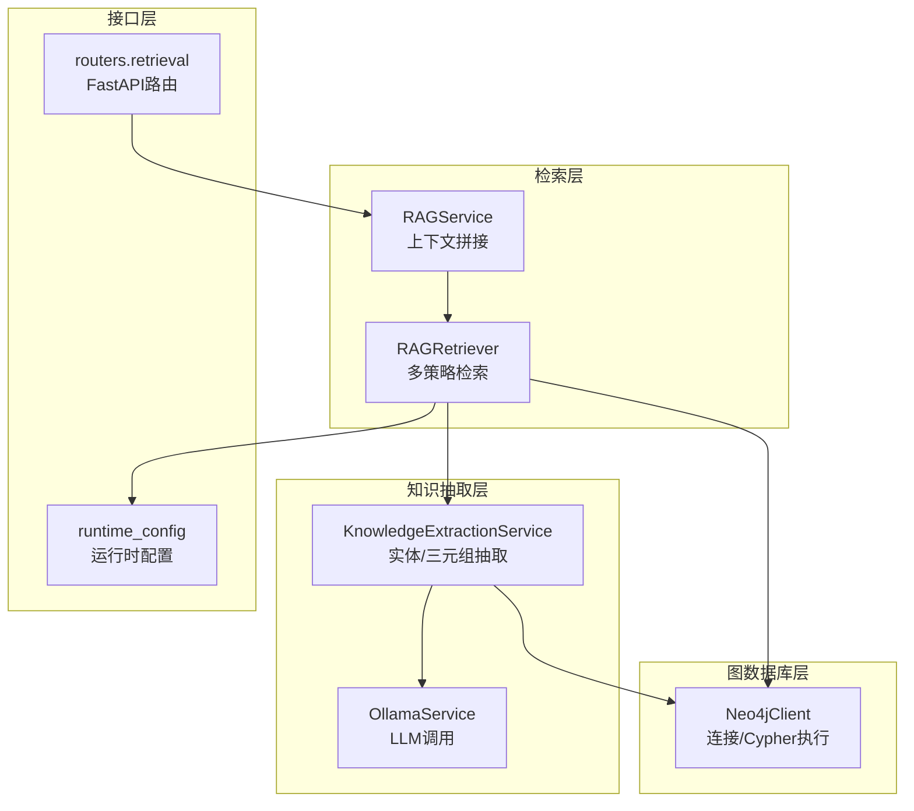
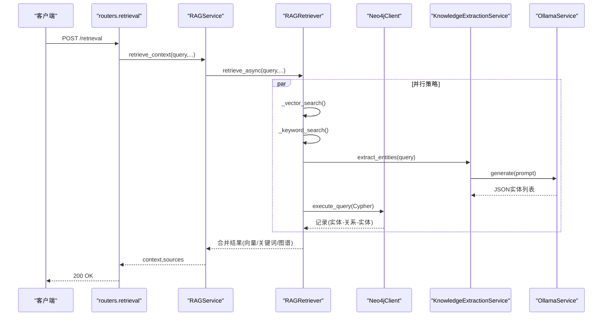
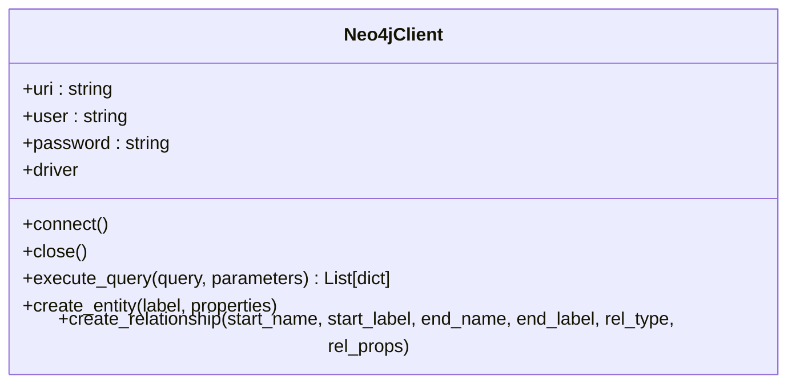
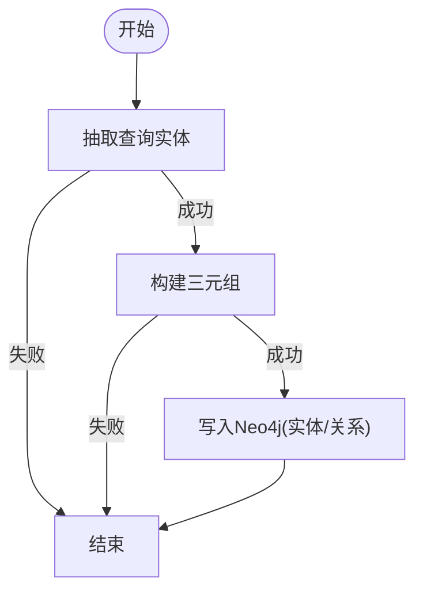
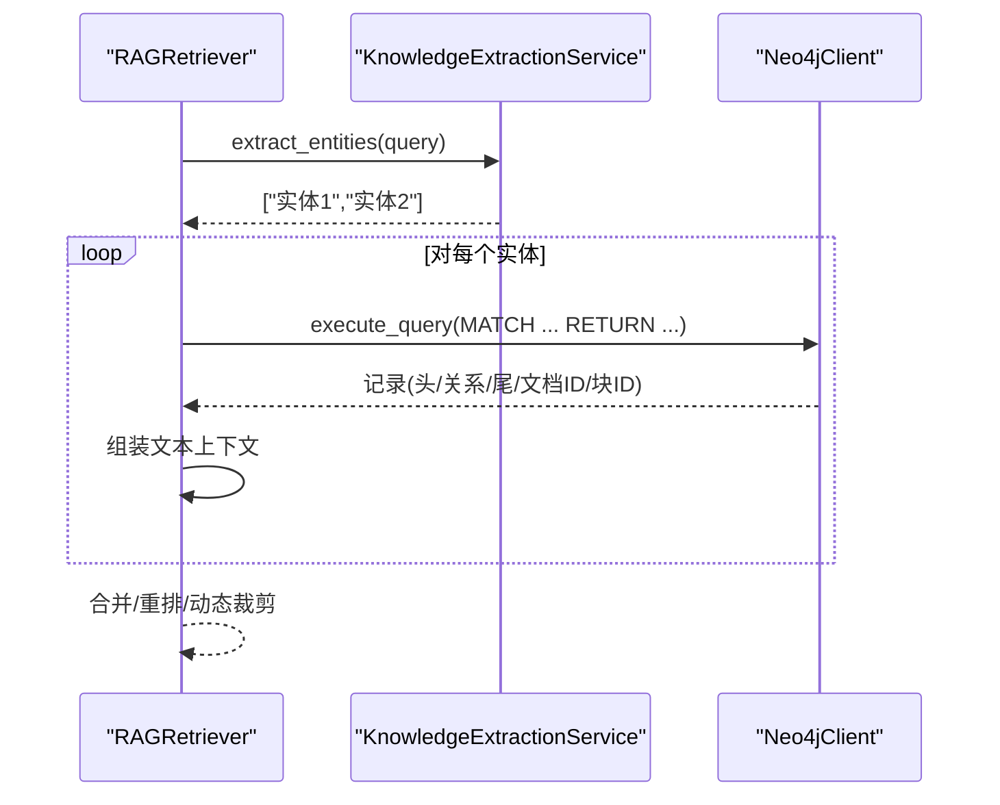
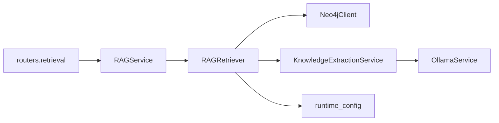

# 图谱检索

<cite>
**本文引用的文件**
- [database/neo4j_client.py](file://database/neo4j_client.py)
- [services/knowledge_extraction_service.py](file://services/knowledge_extraction_service.py)
- [services/query_understanding_service.py](file://services/query_understanding_service.py)
- [services/ollama_service.py](file://services/ollama_service.py)
- [retrieval/rag_retriever.py](file://retrieval/rag_retriever.py)
- [services/rag_service.py](file://services/rag_service.py)
- [routers/retrieval.py](file://routers/retrieval.py)
- [services/runtime_config.py](file://services/runtime_config.py)
</cite>

## 目录
1. [简介](#简介)
2. [项目结构](#项目结构)
3. [核心组件](#核心组件)
4. [架构总览](#架构总览)
5. [详细组件分析](#详细组件分析)
6. [依赖关系分析](#依赖关系分析)
7. [性能考量](#性能考量)
8. [故障排查指南](#故障排查指南)
9. [结论](#结论)
10. [附录](#附录)

## 简介
本技术文档聚焦于图谱检索模块的设计与实现，涵盖实体抽取、Cypher 查询构建、图关系遍历、Neo4j 集成、检索结果文本生成与评分机制，以及 Cypher 查询优化、图数据库配置与性能调优建议。读者可据此理解从查询到图谱检索、再到最终上下文生成的完整流程。

## 项目结构
图谱检索模块位于后端服务层，围绕检索器、知识抽取、查询理解与图数据库客户端协同工作：
- 检索器负责多策略检索（向量、关键词、图谱）与结果合并/重排
- 知识抽取服务负责从文本与查询中抽取实体与三元组，并写入 Neo4j
- Neo4j 客户端提供连接、Cypher 执行、实体与关系创建
- Ollama 服务用于结构化提示词生成与实体抽取
- 运行时配置控制模块开关与并发参数
- 路由器提供检索接口，RAG 服务整合检索与上下文拼接

图表来源
- [retrieval/rag_retriever.py:17-138](file://retrieval/rag_retriever.py#L17-L138)
- [services/rag_service.py:34-266](file://services/rag_service.py#L34-L266)
- [services/knowledge_extraction_service.py:12-229](file://services/knowledge_extraction_service.py#L12-L229)
- [services/ollama_service.py:9-674](file://services/ollama_service.py#L9-L674)
- [database/neo4j_client.py:6-104](file://database/neo4j_client.py#L6-L104)
- [routers/retrieval.py:97-149](file://routers/retrieval.py#L97-L149)
- [services/runtime_config.py:140-161](file://services/runtime_config.py#L140-L161)

章节来源
- [retrieval/rag_retriever.py:17-138](file://retrieval/rag_retriever.py#L17-L138)
- [services/rag_service.py:34-266](file://services/rag_service.py#L34-L266)
- [services/knowledge_extraction_service.py:12-229](file://services/knowledge_extraction_service.py#L12-L229)
- [services/ollama_service.py:9-674](file://services/ollama_service.py#L9-L674)
- [database/neo4j_client.py:6-104](file://database/neo4j_client.py#L6-L104)
- [routers/retrieval.py:97-149](file://routers/retrieval.py#L97-L149)
- [services/runtime_config.py:140-161](file://services/runtime_config.py#L140-L161)

## 核心组件
- Neo4jClient：封装连接、Cypher 执行、实体与关系创建
- KnowledgeExtractionService：从文本与查询中抽取实体/三元组并写入图数据库
- RAGRetriever：多策略检索（向量、关键词、图谱）与结果合并/重排
- RAGService：上下文拼接、邻居扩展、来源去重与排序
- OllamaService：结构化提示词与流式/非流式生成
- 运行时配置：模块开关与并发参数
- FastAPI 路由：对外检索接口

章节来源
- [database/neo4j_client.py:6-104](file://database/neo4j_client.py#L6-L104)
- [services/knowledge_extraction_service.py:12-229](file://services/knowledge_extraction_service.py#L12-L229)
- [retrieval/rag_retriever.py:17-138](file://retrieval/rag_retriever.py#L17-L138)
- [services/rag_service.py:34-266](file://services/rag_service.py#L34-L266)
- [services/ollama_service.py:9-674](file://services/ollama_service.py#L9-L674)
- [services/runtime_config.py:140-161](file://services/runtime_config.py#L140-L161)
- [routers/retrieval.py:97-149](file://routers/retrieval.py#L97-L149)

## 架构总览
图谱检索的整体流程如下：
- 查询进入路由层，经 RAGService 组织检索
- RAGRetriever 并行执行向量检索、关键词检索与图谱检索
- 图谱检索通过 KnowledgeExtractionService 从查询中抽取实体，再以 Cypher 查询一跳邻居，将路径转化为文本上下文
- 合并多源结果，必要时进行重排与动态裁剪
- RAGService 拼接上下文并控制 token 预算，返回给上层

图表来源
- [routers/retrieval.py:97-149](file://routers/retrieval.py#L97-L149)
- [services/rag_service.py:34-266](file://services/rag_service.py#L34-L266)
- [retrieval/rag_retriever.py:89-138](file://retrieval/rag_retriever.py#L89-L138)
- [services/knowledge_extraction_service.py:107-146](file://services/knowledge_extraction_service.py#L107-L146)
- [database/neo4j_client.py:39-62](file://database/neo4j_client.py#L39-L62)
- [services/ollama_service.py:50-93](file://services/ollama_service.py#L50-L93)

## 详细组件分析

### Neo4jClient：连接与Cypher执行
- 连接管理：支持容器内 URI 自动替换、连接校验、关闭
- 执行查询：统一 session.run 包装，返回字典列表；异常记录日志
- 实体与关系创建：MERGE 保证幂等，支持属性写入与冷却重试

图表来源
- [database/neo4j_client.py:6-104](file://database/neo4j_client.py#L6-L104)

章节来源
- [database/neo4j_client.py:6-104](file://database/neo4j_client.py#L6-L104)

### KnowledgeExtractionService：实体抽取与图谱构建
- 从查询抽取实体：提示词模板 + JSON 输出 + 解析与修复
- 从文本抽取三元组：提示词模板 + JSON 输出 + 解析与修复
- 写入 Neo4j：实体 MERGE + 关系创建，支持 source_doc/source_chunk 属性
- 运行时开关：NEO4J_ENABLED 控制是否启用；连接失败冷却避免刷屏

图表来源
- [services/knowledge_extraction_service.py:107-146](file://services/knowledge_extraction_service.py#L107-L146)
- [services/knowledge_extraction_service.py:147-213](file://services/knowledge_extraction_service.py#L147-L213)
- [database/neo4j_client.py:64-101](file://database/neo4j_client.py#L64-L101)

章节来源
- [services/knowledge_extraction_service.py:12-229](file://services/knowledge_extraction_service.py#L12-L229)
- [database/neo4j_client.py:64-101](file://database/neo4j_client.py#L64-L101)

### RAGRetriever：多策略检索与图谱遍历
- 并行策略：向量检索、关键词检索、图谱检索
- 图谱检索流程：
  - 从查询抽取实体
  - 若 Neo4j 未连接则尝试连接
  - 针对每个实体执行 Cypher 一跳邻居查询，返回实体-关系-实体三元组文本
  - 将结果包装为“图谱上下文”，并携带 chunk_id/doc_id 便于后续过滤
- 结果合并：向量为主、关键词增强、图谱追加，按分数排序
- 重排：可选 CrossEncoder，动态裁剪 k

图表来源
- [retrieval/rag_retriever.py:242-327](file://retrieval/rag_retriever.py#L242-L327)
- [services/knowledge_extraction_service.py:107-146](file://services/knowledge_extraction_service.py#L107-L146)
- [database/neo4j_client.py:39-62](file://database/neo4j_client.py#L39-L62)

章节来源
- [retrieval/rag_retriever.py:17-138](file://retrieval/rag_retriever.py#L17-L138)
- [retrieval/rag_retriever.py:242-327](file://retrieval/rag_retriever.py#L242-L327)

### RAGService：上下文拼接与邻居扩展
- 动态检索参数：根据查询特征调整 prefetch_k/final_k
- 并行检索多个知识空间集合
- 邻居扩展：对命中 chunk 拉取前后窗口文本
- 来源去重与排序：按最高分保留同一文档来源
- 上下文拼接与 token 控制：估算 token 并截断

章节来源
- [services/rag_service.py:11-32](file://services/rag_service.py#L11-L32)
- [services/rag_service.py:34-266](file://services/rag_service.py#L34-L266)

### OllamaService：提示词构建与生成
- 提示词链：系统提示词 + 知识库状态 + 文档信息 + 对话历史
- 流式/非流式生成：线程池执行同步请求，避免阻塞事件循环
- 工具函数调用：支持在提示词中插入工具调用并注入 assistant_id

章节来源
- [services/ollama_service.py:9-674](file://services/ollama_service.py#L9-L674)

### 运行时配置：模块开关与并发参数
- 模块开关：kg_extract_enabled/kg_retrieve_enabled/query_analyze_enabled/rerank_enabled 等
- 并发参数：kg_concurrency/kg_chunk_timeout_s/kg_max_chunks 等
- 缓存与 TTL：异步读取，MongoDB 持久化

章节来源
- [services/runtime_config.py:140-161](file://services/runtime_config.py#L140-L161)
- [services/runtime_config.py:191-217](file://services/runtime_config.py#L191-L217)

### 路由器：检索接口
- /retrieval/analyze：查询分析（是否需要检索）
- /retrieval：检索接口，返回 context/sources/recommended_resources

章节来源
- [routers/retrieval.py:97-149](file://routers/retrieval.py#L97-L149)

## 依赖关系分析
- RAGRetriever 依赖 Neo4jClient 与 KnowledgeExtractionService
- KnowledgeExtractionService 依赖 OllamaService 与 Neo4jClient
- RAGService 依赖 RAGRetriever 与 MongoDB（ChunkRepository/DocumentRepository）
- 路由器依赖 RAGService 与 runtime_config

图表来源
- [retrieval/rag_retriever.py:7-11](file://retrieval/rag_retriever.py#L7-L11)
- [services/knowledge_extraction_service.py:8-9](file://services/knowledge_extraction_service.py#L8-L9)
- [services/rag_service.py:58-61](file://services/rag_service.py#L58-L61)
- [routers/retrieval.py:1-8](file://routers/retrieval.py#L1-L8)

章节来源
- [retrieval/rag_retriever.py:7-11](file://retrieval/rag_retriever.py#L7-L11)
- [services/knowledge_extraction_service.py:8-9](file://services/knowledge_extraction_service.py#L8-L9)
- [services/rag_service.py:58-61](file://services/rag_service.py#L58-L61)
- [routers/retrieval.py:1-8](file://routers/retrieval.py#L1-L8)

## 性能考量
- 图谱检索并发与冷却
  - Neo4j 连接失败冷却：连接失败后 5 分钟内跳过构建，避免刷屏
  - 运行时配置控制 kg_concurrency 与 kg_chunk_timeout_s
- Cypher 查询优化
  - 限制返回数量（LIMIT 10）
  - 显式返回关系类型与来源属性，便于后续过滤与去重
  - 仅在存在驱动时执行查询，避免无效调用
- 结果合并与重排
  - 向量为主、关键词增强、图谱追加
  - 可选 CrossEncoder 重排，动态裁剪 k 以平衡召回与精度
- 上下文拼接
  - 估算 token 并截断，避免 prompt 过大
  - 邻居扩展窗口较小，兼顾速度与上下文完整性

章节来源
- [services/knowledge_extraction_service.py:155-171](file://services/knowledge_extraction_service.py#L155-L171)
- [services/runtime_config.py:53-82](file://services/runtime_config.py#L53-L82)
- [retrieval/rag_retriever.py:242-327](file://retrieval/rag_retriever.py#L242-L327)
- [retrieval/rag_retriever.py:139-167](file://retrieval/rag_retriever.py#L139-L167)
- [services/rag_service.py:251-260](file://services/rag_service.py#L251-L260)

## 故障排查指南
- Neo4j 连接失败
  - 检查 NEO4J_URI/USER/PASSWORD 环境变量
  - 容器内 URI 替换逻辑：localhost 自动替换为 host.docker.internal
  - 连接失败后冷却 5 分钟，避免频繁重试
- 图谱检索无结果
  - 确认查询实体抽取成功（JSON 解析与修复）
  - 检查 Cypher 查询是否返回记录
  - 确认运行时配置中 kg_retrieve_enabled 开启
- 重排模型加载失败
  - 环境变量 ENABLE_RERANKER/RERANKER_MODEL/RERANKER_DEVICE
  - 加载失败自动降级，避免反复尝试
- 上下文过大
  - 调整 DYNK_MIN/DYNK_MAX 与 DYNK_GAP_* 环境变量
  - 控制 reranker_max_tokens 与 max_context_tokens

章节来源
- [database/neo4j_client.py:16-38](file://database/neo4j_client.py#L16-L38)
- [services/knowledge_extraction_service.py:63-69](file://services/knowledge_extraction_service.py#L63-L69)
- [retrieval/rag_retriever.py:52-69](file://retrieval/rag_retriever.py#L52-L69)
- [services/rag_service.py:251-260](file://services/rag_service.py#L251-L260)

## 结论
图谱检索模块通过“实体抽取 + Cypher 一跳遍历 + 结果合并/重排”的组合，实现了从查询到知识图谱上下文的高效生成。Neo4jClient 提供稳定的图数据库访问，RAGRetriever 与 RAGService 协同完成多策略检索与上下文拼接。运行时配置与性能调优参数为生产环境提供了灵活的开关与参数化能力。

## 附录
- 环境变量与配置要点
  - NEO4J_URI/NEO4J_USER/NEO4J_PASSWORD：Neo4j 连接
  - NEO4J_ENABLED：是否启用图谱构建
  - ENABLE_RERANKER/RERANKER_MODEL/RERANKER_DEVICE：重排模型
  - DYNK_MIN/DYNK_MAX/DYNK_GAP_HIGH/DYNK_GAP_LOW：动态裁剪
  - OLLAMA_BASE_URL/OLLAMA_MODEL/OLLAMA_TIMEOUT：LLM 服务
- 建议
  - 在高并发场景下，合理设置 kg_concurrency 与 kg_chunk_timeout_s
  - 对复杂查询可考虑提升图谱检索的 LIMIT 与返回字段
  - 使用运行时配置动态开关模块，降低峰值负载