# 检索增强系统

<cite>
**本文引用的文件**
- [rag_retriever.py](file://retrieval/rag_retriever.py)
- [rag_service.py](file://services/rag_service.py)
- [qdrant_client.py](file://database/qdrant_client.py)
- [neo4j_client.py](file://database/neo4j_client.py)
- [embedding_service.py](file://embedding/embedding_service.py)
- [knowledge_extraction_service.py](file://services/knowledge_extraction_service.py)
- [token_utils.py](file://utils/token_utils.py)
- [runtime_config.py](file://services/runtime_config.py)
- [retrieval.py](file://routers/retrieval.py)
- [rag_tool.py](file://agents/tools/rag_tool.py)
- [requirements.txt](file://requirements.txt)
- [README.md](file://README.md)
</cite>

## 目录
1. [简介](#简介)
2. [项目结构](#项目结构)
3. [核心组件](#核心组件)
4. [架构总览](#架构总览)
5. [详细组件分析](#详细组件分析)
6. [依赖分析](#依赖分析)
7. [性能考虑](#性能考虑)
8. [故障排查指南](#故障排查指南)
9. [结论](#结论)
10. [附录](#附录)

## 简介
本文件面向“检索增强系统”的核心技术文档，聚焦混合检索架构的设计理念与实现细节，包括：
- 向量检索、关键词检索、图谱检索与重排优化的协同工作机制
- RAG检索器的异步检索流程、并行任务调度与结果合并策略
- 双路索引架构：Qdrant向量数据库的配置优化与Neo4j图数据库的关系建模
- 重排算法：CrossEncoder模型集成、动态K值调整与相关性评分优化
- 配置参数、性能调优技巧与扩展开发指南

## 项目结构
系统采用分层架构，核心围绕检索与服务层展开：
- 路由层：对外提供检索API与查询分析接口
- 服务层：封装RAG检索与上下文拼接、动态参数与运行时配置
- 检索层：混合检索器，负责并行执行向量/关键词/图谱检索与重排
- 数据层：Qdrant向量数据库、Neo4j图数据库、MongoDB文档与Chunk仓储
- 工具层：通用工具（Token预算、日志、监控等）

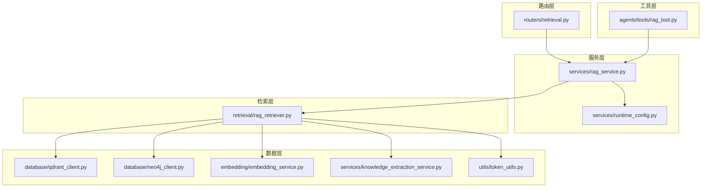

图表来源
- [retrieval.py:1-150](file://routers/retrieval.py#L1-L150)
- [rag_service.py:1-323](file://services/rag_service.py#L1-L323)
- [rag_retriever.py:1-393](file://retrieval/rag_retriever.py#L1-L393)
- [qdrant_client.py:1-544](file://database/qdrant_client.py#L1-L544)
- [neo4j_client.py:1-104](file://database/neo4j_client.py#L1-L104)
- [embedding_service.py:1-333](file://embedding/embedding_service.py#L1-L333)
- [knowledge_extraction_service.py:1-229](file://services/knowledge_extraction_service.py#L1-L229)
- [token_utils.py:1-72](file://utils/token_utils.py#L1-L72)
- [runtime_config.py:1-218](file://services/runtime_config.py#L1-L218)
- [rag_tool.py:1-58](file://agents/tools/rag_tool.py#L1-L58)

章节来源
- [README.md:55-70](file://README.md#L55-L70)

## 核心组件
- RAG检索器：混合检索（向量+关键词+图谱）+重排优化，支持动态K值与在线降级
- RAG服务：动态参数调优、多集合并行检索、邻居扩展与上下文拼接
- Qdrant客户端：gRPC优先、连接复用、自动集合创建与重试机制
- Neo4j客户端：实体与关系建模、Cypher查询与图谱构建
- 向量化服务：Ollama集成、模型检测与重试、字符截断与维度缓存
- 知识抽取服务：三元组抽取、实体提取与图谱入库
- 运行时配置：模块开关与参数预设、TTL缓存与合并策略
- Token工具：近似token估算与截断，保障上下文预算

章节来源
- [rag_retriever.py:17-137](file://retrieval/rag_retriever.py#L17-L137)
- [rag_service.py:8-323](file://services/rag_service.py#L8-L323)
- [qdrant_client.py:18-123](file://database/qdrant_client.py#L18-L123)
- [neo4j_client.py:6-103](file://database/neo4j_client.py#L6-L103)
- [embedding_service.py:8-333](file://embedding/embedding_service.py#L8-L333)
- [knowledge_extraction_service.py:12-229](file://services/knowledge_extraction_service.py#L12-L229)
- [runtime_config.py:15-218](file://services/runtime_config.py#L15-L218)
- [token_utils.py:7-72](file://utils/token_utils.py#L7-L72)

## 架构总览
混合检索架构通过“并行检索 + 结果合并 + 重排优化”的流水线，实现高召回与高精度的平衡。系统支持：
- 多知识空间并行检索（集合名称来自知识空间或助手配置）
- 运行时模块开关（图谱检索、重排、查询分析等）
- 动态参数（prefetch_k、final_k）与动态K值（基于重排分数分布）
- 上下文拼接与邻居扩展，控制token预算

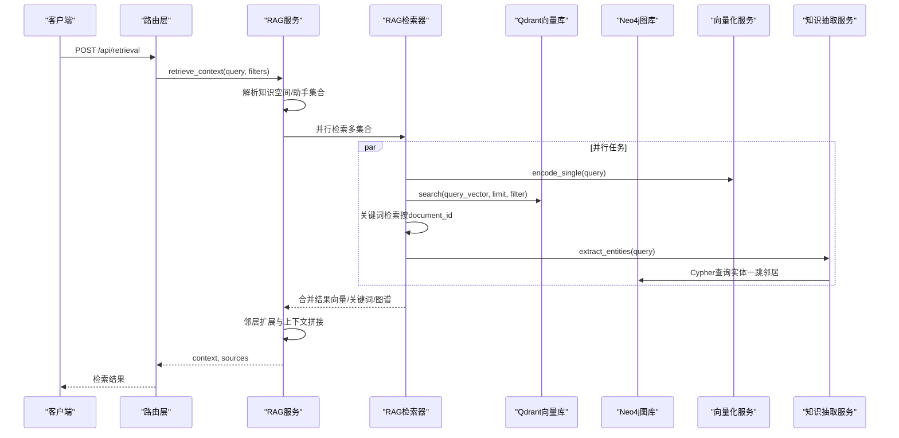

图表来源
- [retrieval.py:97-149](file://routers/retrieval.py#L97-L149)
- [rag_service.py:34-266](file://services/rag_service.py#L34-L266)
- [rag_retriever.py:89-137](file://retrieval/rag_retriever.py#L89-L137)
- [qdrant_client.py:336-414](file://database/qdrant_client.py#L336-L414)
- [neo4j_client.py:40-62](file://database/neo4j_client.py#L40-L62)
- [embedding_service.py:316-318](file://embedding/embedding_service.py#L316-L318)
- [knowledge_extraction_service.py:107-145](file://services/knowledge_extraction_service.py#L107-L145)

## 详细组件分析

### RAG检索器（混合检索与重排）
- 异步检索流程：并行执行向量检索、关键词检索与图谱检索，使用asyncio.gather聚合结果
- 结果合并策略：以chunk_id为键去重，向量结果为基础，关键词结果进行分数提升，图谱结果独立加入
- 重排优化：延迟加载CrossEncoder，按query+doc_text对准备pairs，预测得分并排序
- 动态K值：基于重排分数分布（top1与topN差距）自适应调整最终返回数量，支持环境变量控制范围

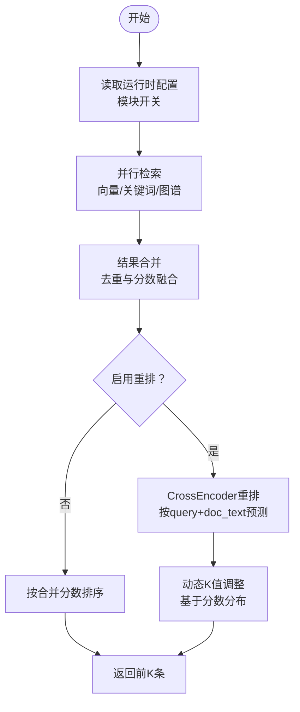

图表来源
- [rag_retriever.py:103-137](file://retrieval/rag_retriever.py#L103-L137)
- [rag_retriever.py:328-363](file://retrieval/rag_retriever.py#L328-L363)
- [rag_retriever.py:365-391](file://retrieval/rag_retriever.py#L365-L391)
- [rag_retriever.py:139-167](file://retrieval/rag_retriever.py#L139-L167)

章节来源
- [rag_retriever.py:71-137](file://retrieval/rag_retriever.py#L71-L137)
- [rag_retriever.py:328-391](file://retrieval/rag_retriever.py#L328-L391)

### RAG服务（动态参数与上下文拼接）
- 动态检索参数：根据查询长度、是否对比/列举/条款类问题，自动调整prefetch_k与final_k
- 多集合并行：支持知识空间集合列表与助手集合名称，异步gather聚合
- 邻居扩展：对命中chunk前后窗口补齐，增强上下文完整性
- 上下文拼接与预算控制：估算token数量并按预算截断，避免超限

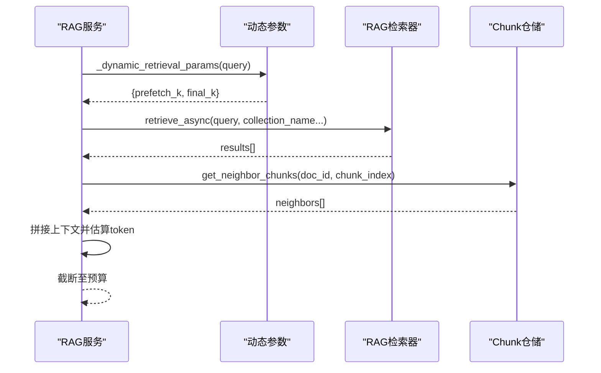

图表来源
- [rag_service.py:11-32](file://services/rag_service.py#L11-L32)
- [rag_service.py:34-266](file://services/rag_service.py#L34-L266)

章节来源
- [rag_service.py:11-32](file://services/rag_service.py#L11-L32)
- [rag_service.py:34-266](file://services/rag_service.py#L34-L266)

### Qdrant向量数据库（双路索引之向量侧）
- 连接优化：优先gRPC、连接复用、自动重试与健康检查
- 集合管理：自动创建/重建、维度校验、异常降级
- 搜索接口：支持filter条件、score_threshold、with_payload
- 写入优化：UUID ID、批量upsert、维度不匹配自动重建

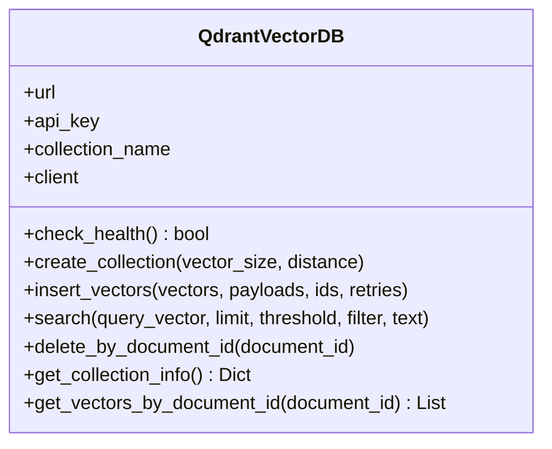

图表来源
- [qdrant_client.py:18-544](file://database/qdrant_client.py#L18-L544)

章节来源
- [qdrant_client.py:18-544](file://database/qdrant_client.py#L18-L544)

### Neo4j图数据库（双路索引之图谱侧）
- 连接与容器适配：自动替换localhost为host.docker.internal，验证连通性
- 查询执行：Cypher查询封装，返回record.data()列表
- 图谱构建：实体与关系创建，支持source_doc/source_chunk属性
- 冷却机制：连接失败后冷却，避免频繁错误日志

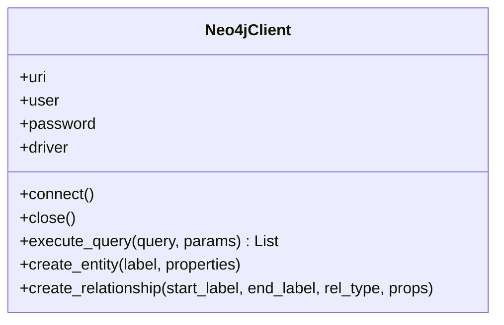

图表来源
- [neo4j_client.py:6-103](file://database/neo4j_client.py#L6-L103)

章节来源
- [neo4j_client.py:6-103](file://database/neo4j_client.py#L6-L103)

### 向量化服务（Ollama集成）
- 模型检测：自动扫描可用embedding模型，支持规范化模型名称
- 请求重试：超时/连接错误指数退避重试
- 字符截断：避免Ollama上下文超限，提供环境变量覆盖
- 维度缓存：首次调用后缓存向量维度，减少重复探测

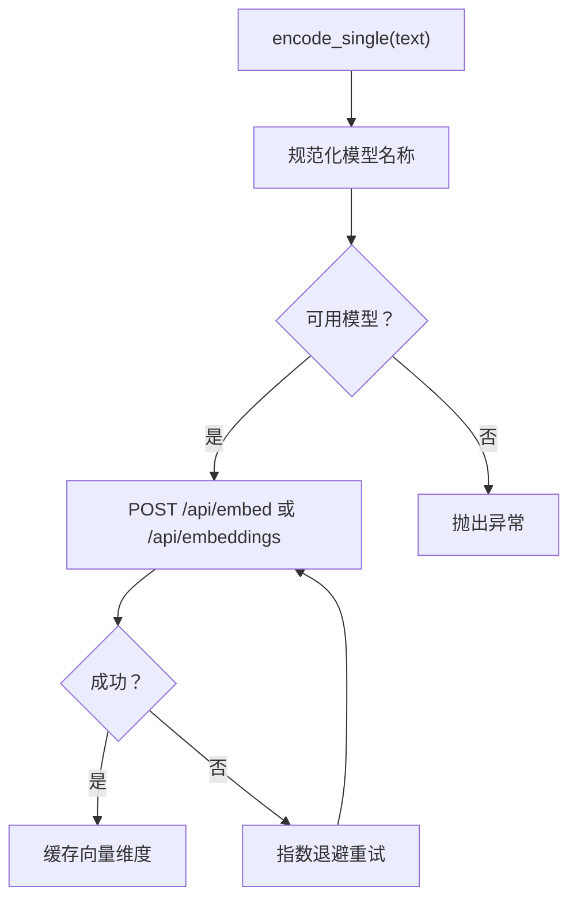

图表来源
- [embedding_service.py:175-290](file://embedding/embedding_service.py#L175-L290)

章节来源
- [embedding_service.py:8-333](file://embedding/embedding_service.py#L8-L333)

### 知识抽取服务（图谱检索前置）
- 实体提取：从查询中抽取关键实体，返回列表
- 三元组抽取：使用LLM抽取head/relation/tail三元组，支持JSON修复
- 图谱入库：创建实体节点与关系，写入source_doc/source_chunk属性
- 冷却与降级：Neo4j连接失败后冷却，避免刷屏

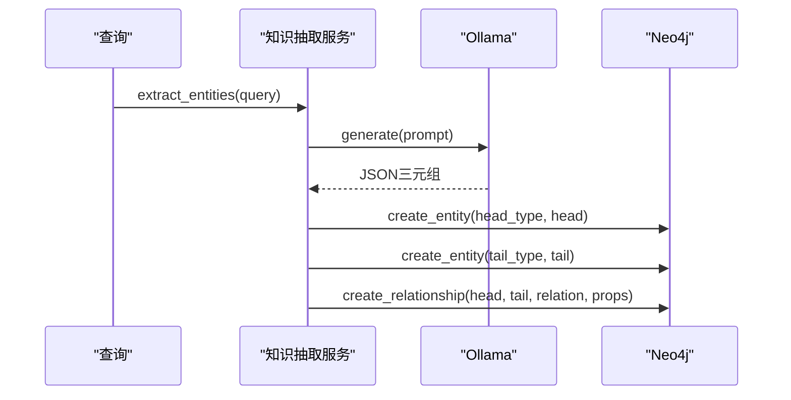

图表来源
- [knowledge_extraction_service.py:107-145](file://services/knowledge_extraction_service.py#L107-L145)
- [knowledge_extraction_service.py:147-213](file://services/knowledge_extraction_service.py#L147-L213)

章节来源
- [knowledge_extraction_service.py:12-229](file://services/knowledge_extraction_service.py#L12-L229)

### 运行时配置（模块开关与参数预设）
- 预设模式：low/high/custom，模块开关与并发参数
- 合并与归一化：合并用户覆盖与默认配置，强制保留embedding
- TTL缓存：异步读取，10秒TTL，避免频繁查询数据库
- 写入更新：upsert合并并刷新缓存

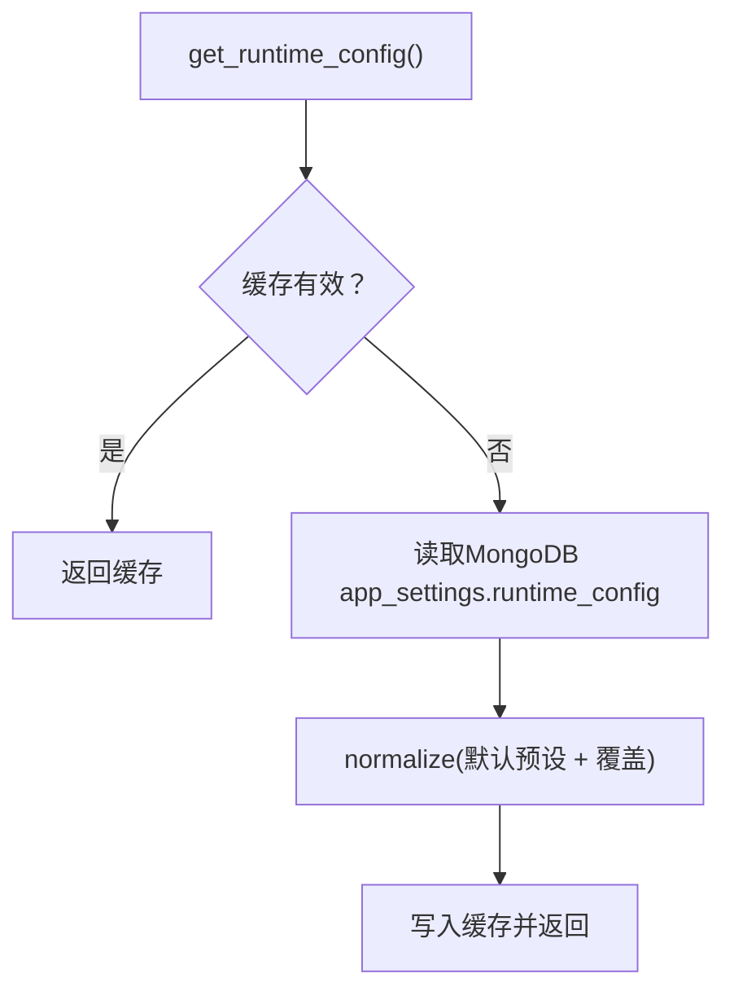

图表来源
- [runtime_config.py:140-161](file://services/runtime_config.py#L140-L161)
- [runtime_config.py:191-216](file://services/runtime_config.py#L191-L216)

章节来源
- [runtime_config.py:15-218](file://services/runtime_config.py#L15-L218)

### Token预算与上下文控制
- 估算：按CJK/ASCII/其他字符经验比例估算token数
- 截断：二分查找最优截断点，避免O(n^2)复杂度
- 上下文拼接：邻居扩展后统一拼接，超过30k token预算进行截断

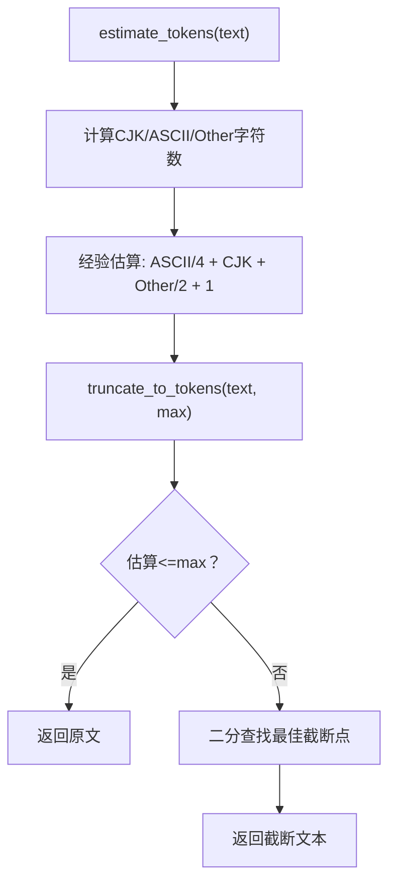

图表来源
- [token_utils.py:16-71](file://utils/token_utils.py#L16-L71)
- [rag_service.py:251-260](file://services/rag_service.py#L251-L260)

章节来源
- [token_utils.py:7-72](file://utils/token_utils.py#L7-L72)
- [rag_service.py:251-260](file://services/rag_service.py#L251-L260)

## 依赖分析
- 外部依赖：FastAPI、QdrantClient、Neo4j驱动、sentence-transformers、requests、httpx、PyMongo/Motor等
- 模块耦合：检索器依赖向量化服务、Qdrant与Neo4j；服务层依赖检索器与运行时配置；路由层依赖服务层
- 循环依赖：未发现循环依赖，职责清晰

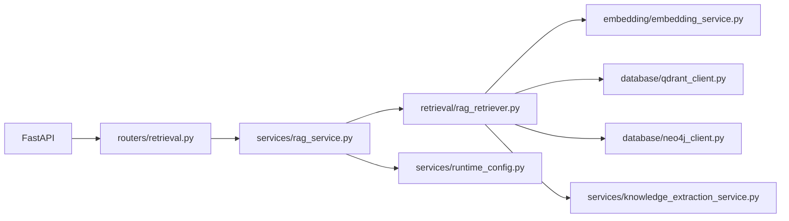

图表来源
- [requirements.txt:4-42](file://requirements.txt#L4-L42)
- [retrieval.py:1-150](file://routers/retrieval.py#L1-L150)
- [rag_service.py:1-323](file://services/rag_service.py#L1-L323)
- [rag_retriever.py:1-393](file://retrieval/rag_retriever.py#L1-L393)
- [embedding_service.py:1-333](file://embedding/embedding_service.py#L1-L333)
- [qdrant_client.py:1-544](file://database/qdrant_client.py#L1-L544)
- [neo4j_client.py:1-104](file://database/neo4j_client.py#L1-L104)
- [knowledge_extraction_service.py:1-229](file://services/knowledge_extraction_service.py#L1-L229)
- [runtime_config.py:1-218](file://services/runtime_config.py#L1-L218)

章节来源
- [requirements.txt:1-42](file://requirements.txt#L1-L42)

## 性能考虑
- 并行与异步：使用asyncio.gather并行执行三种检索，显著降低端到端延迟
- 连接优化：Qdrant优先gRPC、连接复用、自动重试，避免HTTP/httpx问题
- 动态参数：根据查询特征动态调整prefetch_k与final_k，平衡召回与延迟
- 动态K值：基于重排分数分布自适应裁剪，兼顾precision与recall
- 上下文预算：token估算与二分截断，防止prompt过大导致超时或OOM
- 模块开关：运行时配置可按场景切换模块，避免不必要的开销

## 故障排查指南
- Qdrant连接失败
  - 现象：连接测试失败、搜索异常
  - 处理：确认URL与端口（优先gRPC）、本地HTTP连接忽略API key、健康检查与自动重试
  - 参考：[qdrant_client.py:97-123](file://database/qdrant_client.py#L97-L123)
- Neo4j连接失败
  - 现象：连接异常、查询返回None
  - 处理：容器内自动替换localhost为host.docker.internal、验证连通性、冷却机制避免刷屏
  - 参考：[neo4j_client.py:16-33](file://database/neo4j_client.py#L16-L33)
- 向量化失败
  - 现象：Ollama超时/连接错误/模型未找到
  - 处理：指数退避重试、字符截断、模型名称规范化、检查上下文长度
  - 参考：[embedding_service.py:175-290](file://embedding/embedding_service.py#L175-L290)
- 重排模型加载失败
  - 现象：CrossEncoder导入异常
  - 处理：延迟加载失败自动降级，避免影响启动
  - 参考：[rag_retriever.py:52-69](file://retrieval/rag_retriever.py#L52-L69)
- 上下文超限
  - 现象：拼接后token数超过预算
  - 处理：估算并二分截断，确保稳定输出
  - 参考：[token_utils.py:48-71](file://utils/token_utils.py#L48-L71)

章节来源
- [qdrant_client.py:97-123](file://database/qdrant_client.py#L97-L123)
- [neo4j_client.py:16-33](file://database/neo4j_client.py#L16-L33)
- [embedding_service.py:175-290](file://embedding/embedding_service.py#L175-L290)
- [rag_retriever.py:52-69](file://retrieval/rag_retriever.py#L52-L69)
- [token_utils.py:48-71](file://utils/token_utils.py#L48-L71)

## 结论
本系统通过“混合检索 + 重排优化 + 动态参数 + 上下文预算”的设计，在保证高召回的同时提升了相关性与稳定性。双路索引架构充分利用向量与图谱的优势，结合运行时模块开关与异步并行，形成可扩展、可运维的RAG基础设施。建议在生产环境中：
- 启用gRPC连接与连接复用（Qdrant）
- 合理设置动态参数与动态K值阈值
- 使用运行时配置按场景切换模块
- 严格控制上下文token预算，避免超限

## 附录

### 配置参数与环境变量
- Qdrant
  - QDRANT_URL：服务地址（默认http://localhost:6333）
  - QDRANT_API_KEY：API密钥（本地HTTP连接时忽略）
  - QDRANT_TIMEOUT：连接超时（秒）
  - QDRANT_GRPC_PORT：gRPC端口（默认6334）
- Neo4j
  - NEO4J_URI：bolt连接地址（默认bolt://localhost:7687）
  - NEO4J_USER：用户名（默认neo4j）
  - NEO4J_PASSWORD：密码（默认password）
- Ollama
  - OLLAMA_BASE_URL：Ollama服务地址（默认http://127.0.0.1:11434）
  - OLLAMA_EMBEDDING_MODEL：嵌入模型名称
  - OLLAMA_EMBEDDING_MAX_CHARS：嵌入前字符截断阈值
- 重排
  - ENABLE_RERANKER：是否启用重排（默认0）
  - RERANKER_MODEL：CrossEncoder模型名（默认BAAI/bge-reranker-base）
  - RERANKER_DEVICE：设备（cpu/cuda）
  - RERANKER_MAX_TOKENS：送入CrossEncoder的最大token（近似预算）
  - DYNK_MIN/DYNK_MAX：动态K值范围
  - DYNK_GAP_HIGH/DYNK_GAP_LOW：分数差距阈值，决定是否扩大/缩小K

章节来源
- [qdrant_client.py:35-96](file://database/qdrant_client.py#L35-L96)
- [neo4j_client.py:11-14](file://database/neo4j_client.py#L11-L14)
- [embedding_service.py:21-44](file://embedding/embedding_service.py#L21-L44)
- [rag_retriever.py:42-50](file://retrieval/rag_retriever.py#L42-L50)
- [rag_retriever.py:148-167](file://retrieval/rag_retriever.py#L148-L167)

### 扩展开发指南
- 新增检索策略：在RAG检索器中新增异步方法，加入并行任务列表
- 新增数据库：实现对应客户端（如GraphDB），在检索器中接入
- 新增重排模型：在RAG检索器中扩展延迟加载逻辑
- 新增运行时模块：在RuntimeModules中声明开关，在runtime_config中设置默认值
- 新增路由工具：在agents/tools中新增LangChain工具，封装异步检索

章节来源
- [rag_retriever.py:115-123](file://retrieval/rag_retriever.py#L115-L123)
- [runtime_config.py:15-39](file://services/runtime_config.py#L15-L39)
- [rag_tool.py:12-57](file://agents/tools/rag_tool.py#L12-L57)