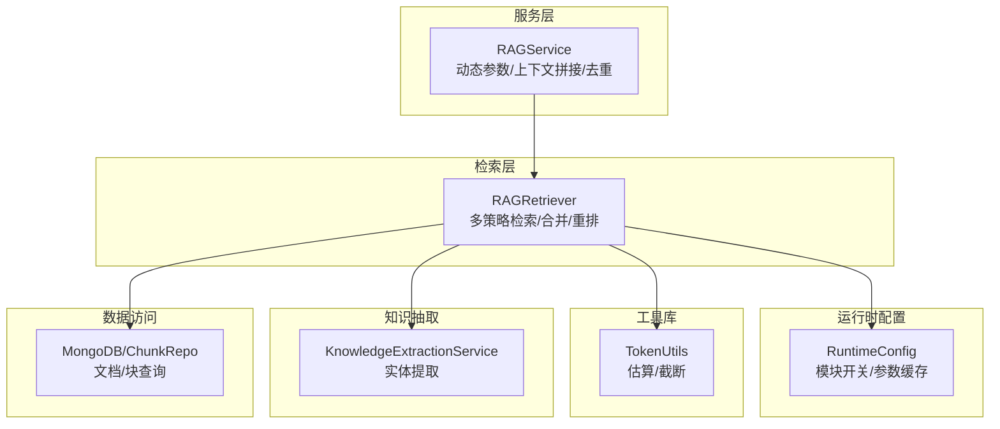
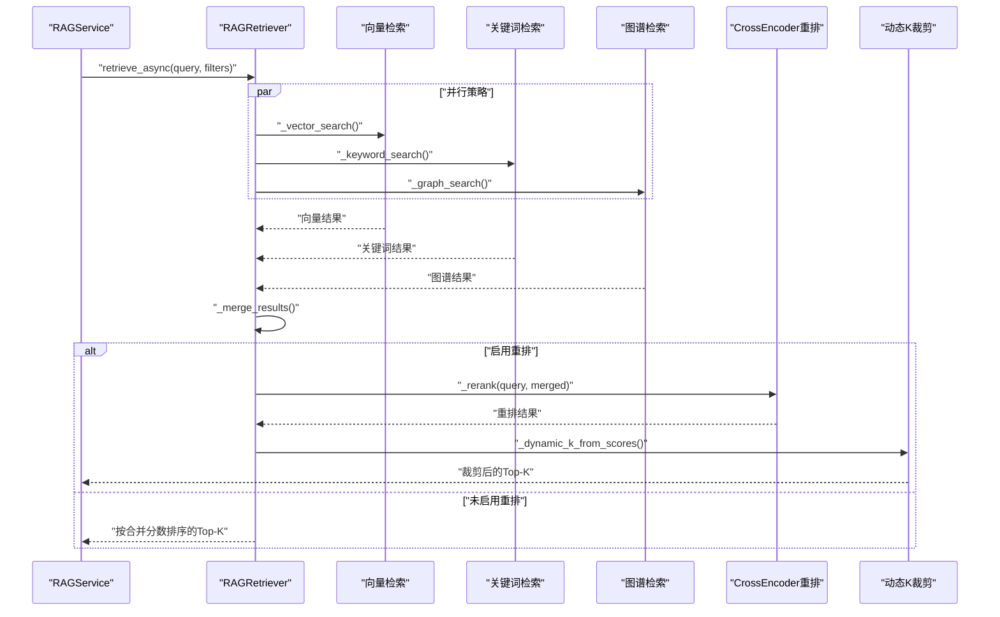
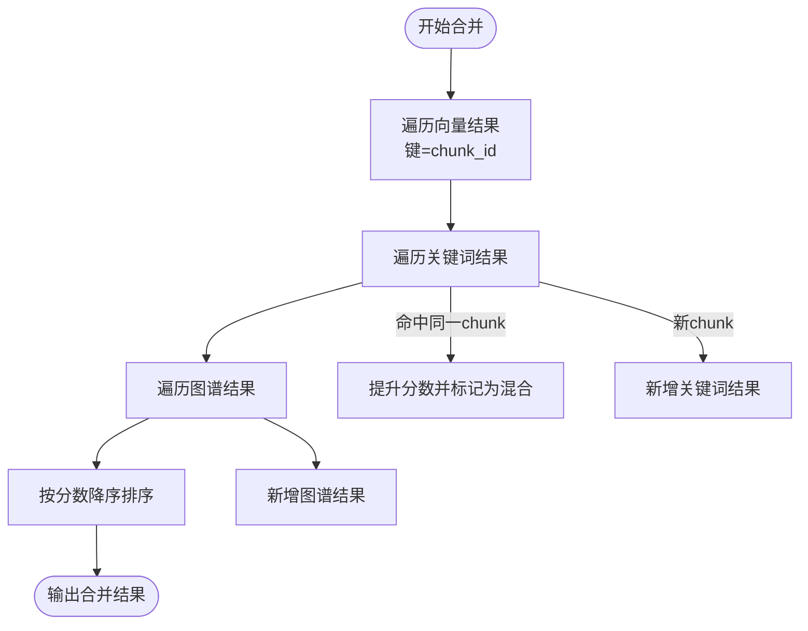
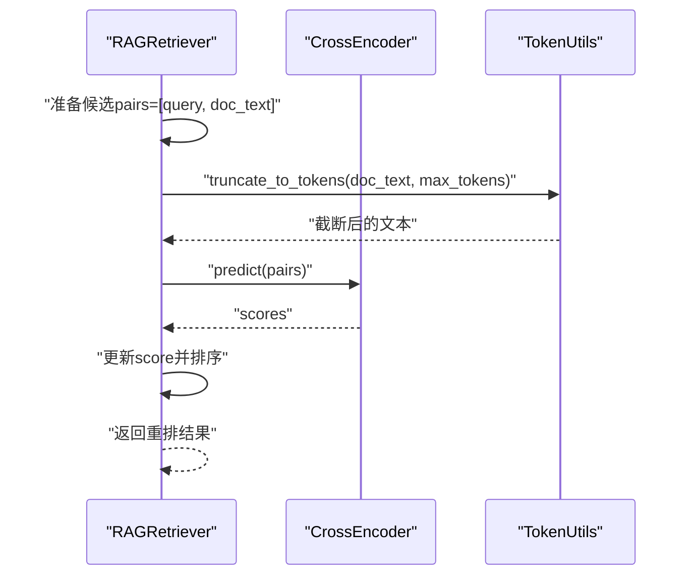
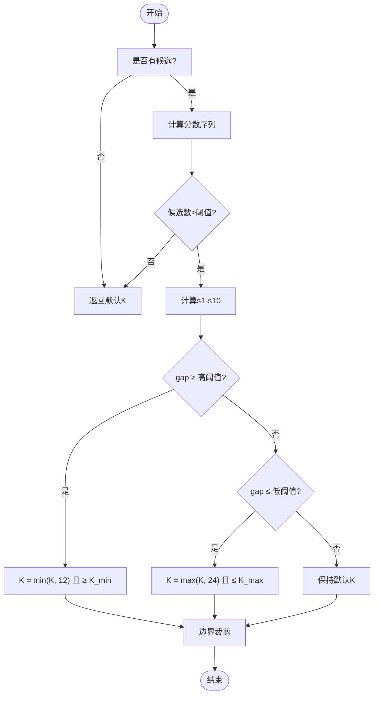
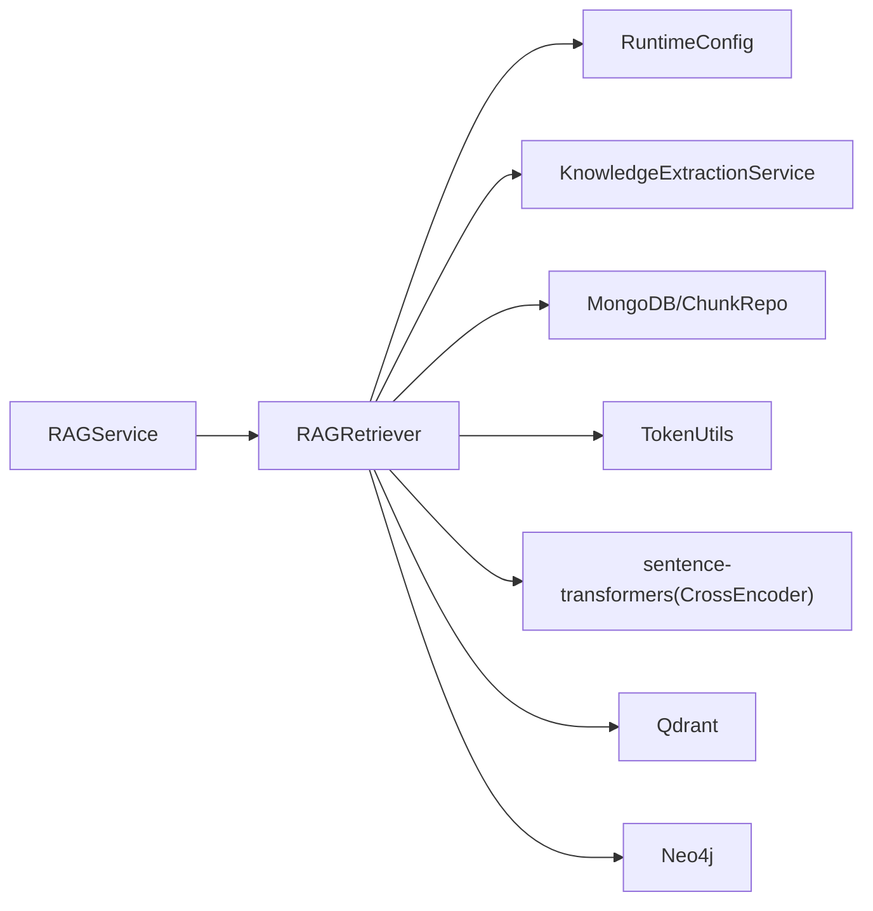

# 结果合并与重排

<cite>
**本文引用的文件**
- [rag_retriever.py](file://retrieval/rag_retriever.py)
- [rag_service.py](file://services/rag_service.py)
- [runtime_config.py](file://services/runtime_config.py)
- [token_utils.py](file://utils/token_utils.py)
- [knowledge_extraction_service.py](file://services/knowledge_extraction_service.py)
- [mongodb.py](file://database/mongodb.py)
- [requirements.txt](file://requirements.txt)
</cite>

## 目录
1. [简介](#简介)
2. [项目结构](#项目结构)
3. [核心组件](#核心组件)
4. [架构总览](#架构总览)
5. [详细组件分析](#详细组件分析)
6. [依赖分析](#依赖分析)
7. [性能考量](#性能考量)
8. [故障排查指南](#故障排查指南)
9. [结论](#结论)
10. [附录](#附录)

## 简介
本文件聚焦“结果合并与重排”模块，系统化解析多策略检索（向量、关键词、图谱）的融合流程，详述分数提升、去重与最终排序规则；深入说明 CrossEncoder 重排模型的集成方式（模型加载、预测评分与重排）、动态 K 值调整算法（区分度分析与自适应裁剪），并提供重排模型配置、性能优化与质量评估的实用指南。

## 项目结构
围绕检索与重排的关键文件如下：
- 检索器：负责并行执行多策略检索、合并、重排与动态裁剪
- 服务层：协调检索参数、上下文拼接、邻居扩展与去重
- 运行时配置：统一管理模块开关与参数，支持热更新
- 工具库：提供 token 预算估算与截断
- 知识抽取：为图谱检索提供实体提取
- 数据访问：提供 chunk 与文档信息查询

图表来源
- [rag_retriever.py:17-137](file://retrieval/rag_retriever.py#L17-L137)
- [rag_service.py:34-126](file://services/rag_service.py#L34-L126)
- [runtime_config.py:140-161](file://services/runtime_config.py#L140-L161)
- [token_utils.py:16-71](file://utils/token_utils.py#L16-L71)
- [knowledge_extraction_service.py:107-145](file://services/knowledge_extraction_service.py#L107-L145)
- [mongodb.py:822-837](file://database/mongodb.py#L822-L837)

章节来源
- [rag_retriever.py:17-137](file://retrieval/rag_retriever.py#L17-L137)
- [rag_service.py:34-126](file://services/rag_service.py#L34-L126)
- [runtime_config.py:140-161](file://services/runtime_config.py#L140-L161)
- [token_utils.py:16-71](file://utils/token_utils.py#L16-L71)
- [knowledge_extraction_service.py:107-145](file://services/knowledge_extraction_service.py#L107-L145)
- [mongodb.py:822-837](file://database/mongodb.py#L822-L837)

## 核心组件
- RAGRetriever：多策略检索与重排主控，负责并行执行向量/关键词/图谱检索，合并与去重，CrossEncoder 重排，以及动态 K 值裁剪。
- RAGService：高层检索编排，动态计算检索参数，拼接上下文，进行去重与邻居扩展。
- RuntimeConfig：运行时配置中心，支持模块开关（重排、图谱检索、实体抽取等）与参数缓存。
- TokenUtils：提供近似 token 估算与截断，保障重排输入长度可控。
- KnowledgeExtractionService：从查询中提取实体，支撑图谱检索。
- MongoDB/ChunkRepository：提供 chunk 与文档信息查询，支撑邻居扩展与去重。

章节来源
- [rag_retriever.py:17-137](file://retrieval/rag_retriever.py#L17-L137)
- [rag_service.py:34-126](file://services/rag_service.py#L34-L126)
- [runtime_config.py:140-161](file://services/runtime_config.py#L140-L161)
- [token_utils.py:16-71](file://utils/token_utils.py#L16-L71)
- [knowledge_extraction_service.py:107-145](file://services/knowledge_extraction_service.py#L107-L145)
- [mongodb.py:822-837](file://database/mongodb.py#L822-L837)

## 架构总览
整体流程：服务层根据查询动态确定检索参数，RAGRetriever 并行执行三种检索策略，合并去重后进入重排阶段，最后根据重排分数分布动态裁剪 K 值，形成最终上下文与来源清单。

图表来源
- [rag_retriever.py:89-137](file://retrieval/rag_retriever.py#L89-L137)
- [rag_retriever.py:328-391](file://retrieval/rag_retriever.py#L328-L391)

章节来源
- [rag_retriever.py:89-137](file://retrieval/rag_retriever.py#L89-L137)
- [rag_retriever.py:328-391](file://retrieval/rag_retriever.py#L328-L391)

## 详细组件分析

### 合并与去重机制
- 合并顺序与权重
  - 向量结果作为基础（Base），记录 chunk_id 作为去重键。
  - 关键词结果（Boost）：若命中同一 chunk，则在原分数基础上按比例提升，并标记为混合类型。
  - 图谱结果（Add）：以 id 为键加入，通常非原始 chunk，不参与向量/关键词的去重叠加。
- 排序与输出
  - 合并后按分数降序排序，形成候选池，供后续重排与裁剪使用。

图表来源
- [rag_retriever.py:328-363](file://retrieval/rag_retriever.py#L328-L363)

章节来源
- [rag_retriever.py:328-363](file://retrieval/rag_retriever.py#L328-L363)

### 分数提升算法
- 关键词提升策略
  - 对命中同一 chunk 的关键词结果，将其分数按比例加到向量结果上，随后将检索类型标记为“混合”，便于后续溯源。
- 图谱结果处理
  - 图谱结果通常不对应具体 chunk，直接加入候选池，赋予较高初始分，便于在重排阶段进一步打分。

章节来源
- [rag_retriever.py:343-359](file://retrieval/rag_retriever.py#L343-L359)

### 去重机制
- 文档级去重
  - 服务层在拼接上下文前，按文档维度去重，保留每个文档最高分的 chunk，避免重复来源干扰最终排序。
- 来源清单构建
  - 为每个文档来源构造包含标题、文件类型、状态等信息的来源清单，并按分数排序，便于前端展示与溯源。

章节来源
- [rag_service.py:180-249](file://services/rag_service.py#L180-L249)

### 最终排序规则
- 若启用重排：使用 CrossEncoder 对候选池进行重排，按重排分数降序排序。
- 若未启用重排：沿用合并后的分数排序。
- 动态 K 裁剪：基于重排分数分布的区分度，自适应调整最终返回条目数量，兼顾召回与精度。

章节来源
- [rag_retriever.py:128-137](file://retrieval/rag_retriever.py#L128-L137)
- [rag_retriever.py:365-391](file://retrieval/rag_retriever.py#L365-L391)

### CrossEncoder 重排模型集成
- 模型加载
  - 延迟加载：仅在需要时实例化 CrossEncoder，避免导入阶段失败影响服务启动；失败自动降级并禁用重排。
  - 设备与模型：支持从环境变量读取模型名与设备（CPU/GPU），默认模型为通用重排模型。
- 预测与评分
  - 构造查询-文档对，对每个候选进行预测，得到重排分数并替换原分数。
  - 截断策略：为避免长文本导致延迟或内存问题，按近似 token 预算对候选文本进行截断。
- 排序与返回
  - 按重排分数降序排序，交由动态 K 算法进行最终裁剪。

图表来源
- [rag_retriever.py:365-391](file://retrieval/rag_retriever.py#L365-L391)
- [token_utils.py:48-71](file://utils/token_utils.py#L48-L71)

章节来源
- [rag_retriever.py:52-69](file://retrieval/rag_retriever.py#L52-L69)
- [rag_retriever.py:365-391](file://retrieval/rag_retriever.py#L365-L391)
- [token_utils.py:48-71](file://utils/token_utils.py#L48-L71)

### 动态 K 值调整算法
- 区分度分析
  - 基于重排分数序列，计算首项与第 N 项之间的差距（N 通常取 10），衡量候选的区分度。
- 自适应裁剪策略
  - 区分度高（差距较大）：降低 K，提升精度；
  - 区分度低（差距较小）：提高 K，保留更多候选，提升召回。
- 参数范围
  - 通过环境变量设置最小/最大 K 与区分度阈值，保证裁剪在合理范围内。

图表来源
- [rag_retriever.py:139-167](file://retrieval/rag_retriever.py#L139-L167)

章节来源
- [rag_retriever.py:139-167](file://retrieval/rag_retriever.py#L139-L167)

### 图谱检索与实体提取
- 实体提取
  - 从查询中提取关键实体，用于图谱检索的起点。
- 图谱检索
  - 对每个实体查询一跳邻居，将路径组合为知识文本，作为图谱结果加入候选池。
- 模块开关
  - 受运行时配置控制，可按需启用/禁用。

章节来源
- [knowledge_extraction_service.py:107-145](file://services/knowledge_extraction_service.py#L107-L145)
- [rag_retriever.py:242-326](file://retrieval/rag_retriever.py#L242-L326)
- [runtime_config.py:140-161](file://services/runtime_config.py#L140-L161)

### 上下文拼接与邻居扩展
- 邻居扩展
  - 对命中 chunk 的前后窗口进行补齐，增强上下文完整性。
- 去重与截断
  - 按文档维度去重，保留最高分来源；对拼接后的上下文进行 token 估算与截断，防止超出预算。
- 来源信息
  - 记录文档标题、文件类型、状态等，便于前端展示与溯源。

章节来源
- [rag_service.py:128-266](file://services/rag_service.py#L128-L266)
- [mongodb.py:822-837](file://database/mongodb.py#L822-L837)

## 依赖分析
- 模块耦合
  - RAGRetriever 依赖运行时配置、知识抽取、数据库访问与 token 工具。
  - RAGService 依赖 RAGRetriever 与 MongoDB，负责高层编排与上下文拼接。
- 外部依赖
  - 重排模型依赖 sentence-transformers；图谱依赖 Neo4j；向量检索依赖 Qdrant；实体抽取依赖 Ollama。

图表来源
- [requirements.txt:14-14](file://requirements.txt#L14-L14)
- [rag_retriever.py:1-15](file://retrieval/rag_retriever.py#L1-L15)
- [rag_service.py:1-6](file://services/rag_service.py#L1-L6)

章节来源
- [requirements.txt:14-14](file://requirements.txt#L14-L14)
- [rag_retriever.py:1-15](file://retrieval/rag_retriever.py#L1-L15)
- [rag_service.py:1-6](file://services/rag_service.py#L1-L6)

## 性能考量
- 并行策略
  - 多策略检索采用 asyncio.gather 并行执行，显著降低端到端延迟。
- 候选池与阈值
  - 向量检索使用较大的候选池与阈值，平衡召回与性能；关键词检索在全局场景下跳过，避免全库扫描。
- 重排预算
  - 通过 token 截断与最大候选数限制，避免长文本导致的延迟与内存压力。
- 动态 K
  - 根据区分度动态裁剪，减少无效输出，提升用户体验。
- 运行时配置
  - 通过模块开关与参数缓存，按需启用高成本模块，避免不必要的开销。

章节来源
- [rag_retriever.py:115-137](file://retrieval/rag_retriever.py#L115-L137)
- [rag_retriever.py:176-240](file://retrieval/rag_retriever.py#L176-L240)
- [rag_retriever.py:365-391](file://retrieval/rag_retriever.py#L365-L391)
- [runtime_config.py:140-161](file://services/runtime_config.py#L140-L161)

## 故障排查指南
- 重排模型加载失败
  - 现象：重排被自动禁用，日志出现警告。
  - 处理：检查模型名与设备配置，确认依赖安装与可用性。
- 图谱检索异常
  - 现象：图谱结果为空或报错。
  - 处理：检查实体提取是否成功、Neo4j 连接状态与冷却机制。
- 关键词检索性能问题
  - 现象：全局关键词检索耗时过长。
  - 处理：仅在指定文档 ID 下启用关键词匹配，避免全库扫描。
- 上下文过长
  - 现象：拼接后超出 token 预算。
  - 处理：调整最大上下文 token 预算或减少邻居窗口。

章节来源
- [rag_retriever.py:52-69](file://retrieval/rag_retriever.py#L52-L69)
- [rag_retriever.py:242-326](file://retrieval/rag_retriever.py#L242-L326)
- [rag_retriever.py:206-240](file://retrieval/rag_retriever.py#L206-L240)
- [rag_service.py:251-266](file://services/rag_service.py#L251-L266)

## 结论
本模块通过“多策略检索 + 分数提升 + 去重 + CrossEncoder 重排 + 动态 K 裁剪”的闭环设计，在保证召回的同时显著提升相关性与用户体验。运行时配置与工具库提供了灵活的参数化与性能保障手段，适合在生产环境中按需启用与优化。

## 附录

### 重排模型配置与环境变量
- 启用开关
  - ENABLE_RERANKER：是否启用重排（默认关闭）
- 模型与设备
  - RERANKER_MODEL：重排模型名（默认通用模型）
  - RERANKER_DEVICE：设备（cpu/cuda）
- 预算与长度
  - RERANKER_MAX_TOKENS：送入重排模型的文本最大 token 数
- 动态 K 参数
  - DYNK_MIN/DYNK_MAX：动态 K 的上下界
  - DYNK_GAP_HIGH/DYNK_GAP_LOW：区分度阈值

章节来源
- [rag_retriever.py:20-50](file://retrieval/rag_retriever.py#L20-L50)
- [rag_retriever.py:139-167](file://retrieval/rag_retriever.py#L139-L167)

### 运行时配置接口
- 读取与缓存
  - 异步/同步读取运行时配置，带 TTL 缓存，支持热更新。
- 模块开关
  - rerank_enabled、kg_retrieve_enabled、kg_extract_enabled 等模块开关。
- 参数调节
  - kg_concurrency、kg_chunk_timeout_s、kg_max_chunks 等参数。

章节来源
- [runtime_config.py:140-161](file://services/runtime_config.py#L140-L161)
- [runtime_config.py:164-188](file://services/runtime_config.py#L164-L188)
- [runtime_config.py:191-217](file://services/runtime_config.py#L191-L217)