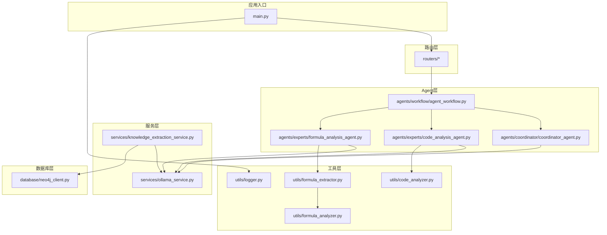
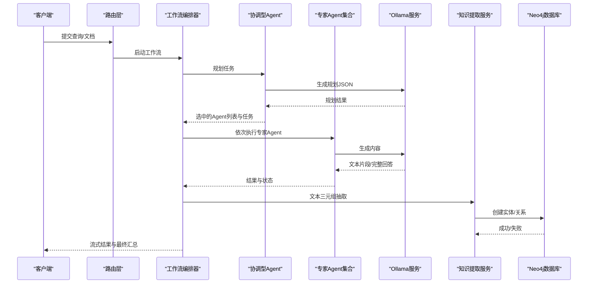
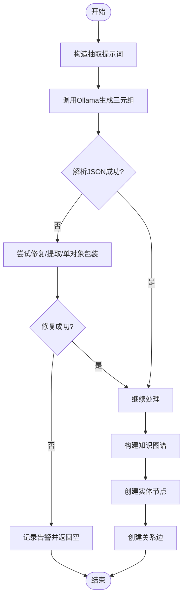
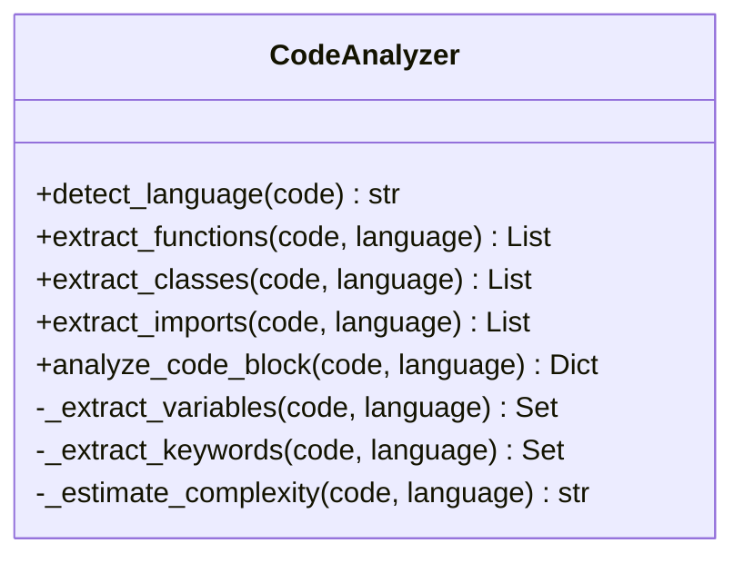
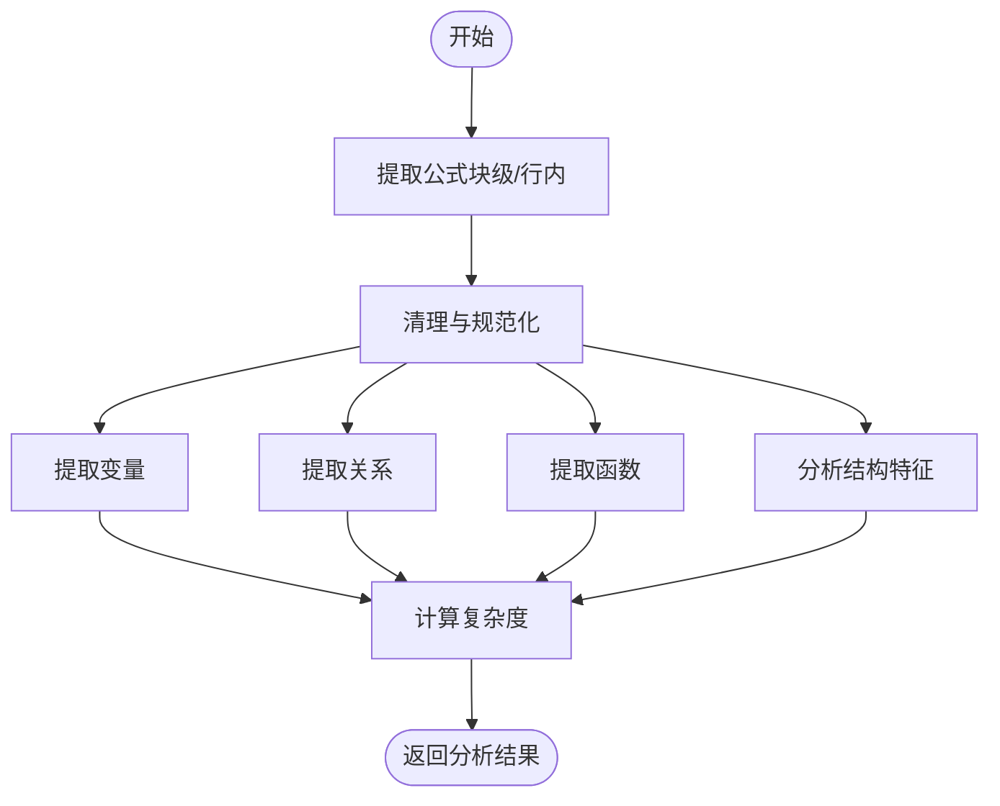
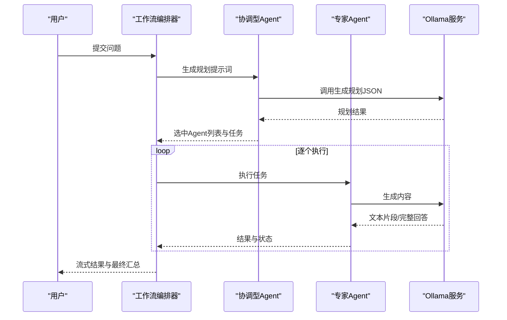
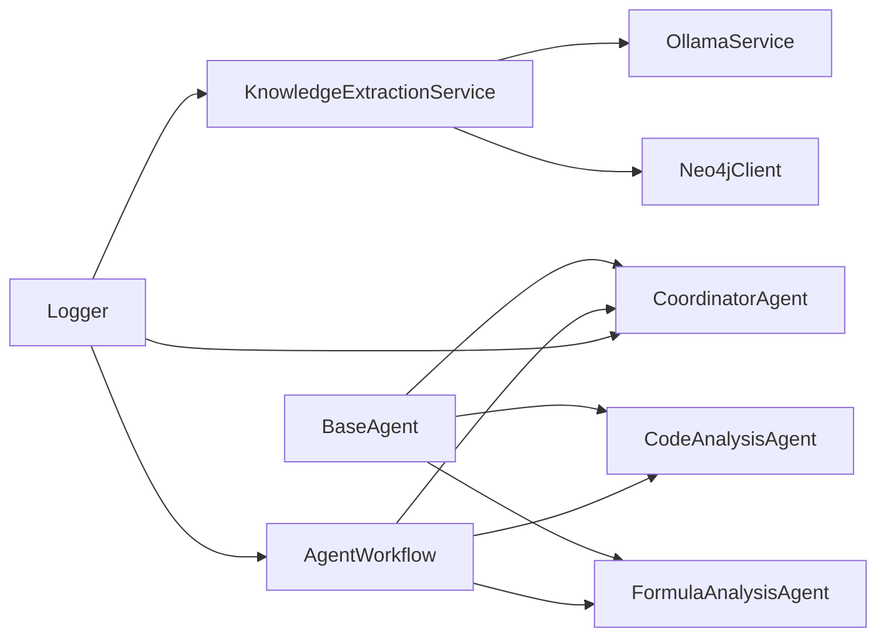

# 知识提取服务

<cite>
**本文引用的文件**
- [knowledge_extraction_service.py](file://services/knowledge_extraction_service.py)
- [code_analysis_agent.py](file://agents/experts/code_analysis_agent.py)
- [formula_analysis_agent.py](file://agents/experts/formula_analysis_agent.py)
- [coordinator_agent.py](file://agents/coordinator/coordinator_agent.py)
- [code_analyzer.py](file://utils/code_analyzer.py)
- [formula_analyzer.py](file://utils/formula_analyzer.py)
- [formula_extractor.py](file://utils/formula_extractor.py)
- [neo4j_client.py](file://database/neo4j_client.py)
- [ollama_service.py](file://services/ollama_service.py)
- [base_agent.py](file://agents/base/base_agent.py)
- [agent_workflow.py](file://agents/workflow/agent_workflow.py)
- [logger.py](file://utils/logger.py)
- [main.py](file://main.py)
- [knowledge_spaces.py](file://routers/knowledge_spaces.py)
</cite>

## 目录
1. [简介](#简介)
2. [项目结构](#项目结构)
3. [核心组件](#核心组件)
4. [架构总览](#架构总览)
5. [详细组件分析](#详细组件分析)
6. [依赖关系分析](#依赖关系分析)
7. [性能考虑](#性能考虑)
8. [故障排查指南](#故障排查指南)
9. [结论](#结论)
10. [附录](#附录)

## 简介
本文件面向“知识提取服务”的专业技术文档，聚焦以下能力：
- 实体提取与知识图谱构建：基于大模型抽取“实体-关系-实体”三元组，并持久化到Neo4j。
- 代码分析器：从代码片段中提取函数、类、导入、变量、关键字等语法与语义信息，估算复杂度。
- 公式分析器：从文本中识别LaTeX公式，提取变量、关系、函数与结构信息，支持复杂度评估与规范化。
- 专家Agent协作：协调型Agent根据问题自动选择合适的专家Agent（文档检索、公式分析、代码分析、概念解释、示例生成、习题、科学计算编码、总结），并进行任务分发与进度反馈。
- API接口与配置：提供知识空间管理、聊天、检索、助手等REST接口；说明关键配置参数与性能优化建议。

## 项目结构
系统采用分层与模块化设计，主要目录与职责如下：
- agents：专家Agent与协调Agent，以及工作流编排器
- services：知识提取服务、Ollama服务、RAG检索等
- utils：代码分析器、公式提取与分析器、日志等工具
- database：Neo4j客户端
- routers：REST API路由
- web：前端静态资源挂载
- main.py：FastAPI应用入口与中间件注册

图表来源
- [main.py:1-171](file://main.py#L1-L171)
- [knowledge_extraction_service.py:1-229](file://services/knowledge_extraction_service.py#L1-L229)
- [coordinator_agent.py:1-252](file://agents/coordinator/coordinator_agent.py#L1-L252)
- [agent_workflow.py:1-388](file://agents/workflow/agent_workflow.py#L1-L388)
- [code_analysis_agent.py:1-79](file://agents/experts/code_analysis_agent.py#L1-L79)
- [formula_analysis_agent.py:1-107](file://agents/experts/formula_analysis_agent.py#L1-L107)
- [code_analyzer.py:1-350](file://utils/code_analyzer.py#L1-L350)
- [formula_extractor.py:1-149](file://utils/formula_extractor.py#L1-L149)
- [formula_analyzer.py:1-233](file://utils/formula_analyzer.py#L1-L233)
- [neo4j_client.py:1-104](file://database/neo4j_client.py#L1-L104)
- [ollama_service.py:1-674](file://services/ollama_service.py#L1-L674)
- [logger.py:1-88](file://utils/logger.py#L1-L88)

章节来源
- [main.py:1-171](file://main.py#L1-L171)
- [knowledge_spaces.py:1-140](file://routers/knowledge_spaces.py#L1-L140)

## 核心组件
- 知识提取服务：封装Ollama调用，解析LLM返回的JSON，抽取三元组并写入Neo4j；支持实体提取与查询增强。
- 协调型Agent：基于问题内容智能选择专家Agent，返回选中Agent列表与任务说明；具备后备选择逻辑。
- 专家Agent：
  - 代码分析专家：识别代码并提供功能、关键段落、优缺点与改进建议。
  - 公式分析专家：提取LaTeX公式并解释物理意义、变量含义、适用条件与应用场景。
- 工作流编排器：统一调度协调与专家Agent，维护Agent状态与进度，支持流式输出。
- 工具集：
  - 代码分析器：语言检测、函数/类/导入/变量/关键字提取与复杂度估算。
  - 公式提取器：块级/行内LaTeX公式识别与规范化。
  - 公式分析器：变量、关系、函数与结构分析，复杂度评估。
- 数据库：Neo4j客户端，提供实体与关系创建能力。
- 日志：异步文件处理器，降低I/O阻塞风险。

章节来源
- [knowledge_extraction_service.py:12-229](file://services/knowledge_extraction_service.py#L12-L229)
- [coordinator_agent.py:7-252](file://agents/coordinator/coordinator_agent.py#L7-L252)
- [code_analysis_agent.py:7-79](file://agents/experts/code_analysis_agent.py#L7-L79)
- [formula_analysis_agent.py:8-107](file://agents/experts/formula_analysis_agent.py#L8-L107)
- [agent_workflow.py:47-388](file://agents/workflow/agent_workflow.py#L47-L388)
- [code_analyzer.py:7-350](file://utils/code_analyzer.py#L7-L350)
- [formula_extractor.py:6-149](file://utils/formula_extractor.py#L6-L149)
- [formula_analyzer.py:8-233](file://utils/formula_analyzer.py#L8-L233)
- [neo4j_client.py:6-104](file://database/neo4j_client.py#L6-L104)
- [logger.py:15-88](file://utils/logger.py#L15-L88)

## 架构总览
整体架构围绕“问题驱动的多Agent协作”展开，流程如下：
- 用户通过API提交问题或文档，系统通过工作流编排器启动协调型Agent进行任务规划。
- 协调型Agent根据关键词与规则选择专家Agent（如公式分析、代码分析、概念解释等）。
- 专家Agent调用Ollama服务生成内容，同时可使用工具（代码分析器、公式提取/分析器）辅助理解。
- 知识提取服务对文本进行三元组抽取与知识图谱构建，必要时写入Neo4j。
- 工作流编排器汇总各Agent结果并返回给前端，支持流式输出与进度反馈。

图表来源
- [agent_workflow.py:106-337](file://agents/workflow/agent_workflow.py#L106-L337)
- [coordinator_agent.py:55-169](file://agents/coordinator/coordinator_agent.py#L55-L169)
- [knowledge_extraction_service.py:36-213](file://services/knowledge_extraction_service.py#L36-L213)
- [ollama_service.py:50-93](file://services/ollama_service.py#L50-L93)

## 详细组件分析

### 知识提取服务（实体抽取与知识图谱）
- 主要职责
  - 使用Ollama生成三元组（head/head_type/relation/tail/tail_type），解析LLM返回的JSON（支持Markdown代码块包裹与单对象修复）。
  - 从查询中提取关键实体，用于检索增强。
  - 将三元组写入Neo4j，创建实体节点与关系边，支持文档/块级溯源属性。
- 关键实现要点
  - JSON解析与修复：优先尝试直接解析，其次从Markdown代码块提取，再尝试单对象包装，最后回退并记录告警。
  - Neo4j写入：连接失败冷却（5分钟），避免频繁刷屏；实体创建使用MERGE，关系创建使用MERGE并设置属性。
  - 关系规范化：将关系名转大写、空格转下划线、去除非法字符，适配Neo4j约束。
- 性能与可靠性
  - 三元组抽取与Neo4j写入均通过线程池异步执行，避免阻塞事件循环。
  - 支持通过环境变量开关Neo4j写入，便于测试与降级。

图表来源
- [knowledge_extraction_service.py:36-105](file://services/knowledge_extraction_service.py#L36-L105)
- [knowledge_extraction_service.py:147-213](file://services/knowledge_extraction_service.py#L147-L213)

章节来源
- [knowledge_extraction_service.py:12-229](file://services/knowledge_extraction_service.py#L12-L229)
- [neo4j_client.py:64-101](file://database/neo4j_client.py#L64-L101)

### 代码分析器（语法树与语义理解）
- 主要职责
  - 语言检测：基于特征关键字识别Python/JavaScript/Java/C++。
  - 函数提取：按语言匹配函数定义，解析参数列表。
  - 类提取：匹配类定义，返回类名。
  - 导入提取：识别import/from/import ... from等。
  - 变量与关键字提取：基于正则与关键字集合提取变量名与关键字。
  - 复杂度估算：综合行数、控制结构与函数数量，给出简单/中等/复杂等级。
- 设计特点
  - 面向对象结构清晰，每种语言的提取逻辑独立，便于扩展。
  - 通过正则表达式实现高可读性的匹配规则。
  - 复杂度估算提供直观的阈值划分，便于上层决策。

图表来源
- [code_analyzer.py:7-350](file://utils/code_analyzer.py#L7-L350)

章节来源
- [code_analyzer.py:7-350](file://utils/code_analyzer.py#L7-L350)

### 公式分析器（LaTeX公式解析与语义标注）
- 主要职责
  - 公式提取：支持块级与行内LaTeX公式，识别多种环境与命令。
  - 公式分析：提取变量（单字母、下标、正体、文本）、关系（等式/不等式）、函数（三角、对数、积分、求和等）与结构特征（分数、根号、积分、求和/求积、矩阵）。
  - 复杂度评估：统计运算符、函数、分数、根号数量，划分简单/中等/复杂等级。
  - 规范化：将常见字符替换为标准LaTeX符号，确保后续处理一致性。
- 设计特点
  - 提取器与分析器分离，便于在不同阶段复用。
  - 分析器对变量、关系、函数分别处理，结构化输出，利于前端渲染与下游处理。

图表来源
- [formula_extractor.py:29-57](file://utils/formula_extractor.py#L29-L57)
- [formula_analyzer.py:33-77](file://utils/formula_analyzer.py#L33-L77)
- [formula_analyzer.py:161-210](file://utils/formula_analyzer.py#L161-L210)

章节来源
- [formula_extractor.py:6-149](file://utils/formula_extractor.py#L6-L149)
- [formula_analyzer.py:8-233](file://utils/formula_analyzer.py#L8-L233)

### 专家Agent协作机制
- 协调型Agent
  - 通过系统提示词定义可用专家Agent及其职责，返回JSON格式的选中Agent列表与任务说明。
  - 若JSON解析失败，回退到关键词匹配策略，确保基本可用性。
  - 支持“总结”Agent在复杂问题时最后调用，整合多Agent结果。
- 专家Agent
  - 代码分析专家：检测是否包含代码，若无则快速返回低置信度提示；否则流式生成分析结果。
  - 公式分析专家：提取LaTeX公式，构建分析提示词，流式输出解释与变量说明。
- 工作流编排器
  - 异步加载Agent配置，延迟初始化专家Agent实例，避免启动时阻塞。
  - 统一管理Agent状态（pending/running/completed/error），支持流式进度反馈。
  - 顺序执行专家Agent，便于前端展示实时进度与阶段性结果。

图表来源
- [coordinator_agent.py:55-169](file://agents/coordinator/coordinator_agent.py#L55-L169)
- [agent_workflow.py:106-337](file://agents/workflow/agent_workflow.py#L106-L337)
- [code_analysis_agent.py:25-79](file://agents/experts/code_analysis_agent.py#L25-L79)
- [formula_analysis_agent.py:26-87](file://agents/experts/formula_analysis_agent.py#L26-L87)

章节来源
- [coordinator_agent.py:7-252](file://agents/coordinator/coordinator_agent.py#L7-L252)
- [agent_workflow.py:47-388](file://agents/workflow/agent_workflow.py#L47-L388)
- [code_analysis_agent.py:7-79](file://agents/experts/code_analysis_agent.py#L7-L79)
- [formula_analysis_agent.py:8-107](file://agents/experts/formula_analysis_agent.py#L8-L107)

### API接口与配置参数
- 知识空间管理（示例）
  - GET /api/knowledge-spaces：分页获取知识空间列表，支持排序与过滤。
  - POST /api/knowledge-spaces：创建知识空间，生成唯一collection_name。
- 关键环境变量
  - OLLAMA_BASE_URL：Ollama服务地址（默认 http://localhost:11434，容器内自动替换为 host.docker.internal）。
  - OLLAMA_MODEL：默认生成模型（如 gemma3:1b）。
  - OLLAMA_TIMEOUT：请求超时时间（默认 600 秒）。
  - NEO4J_URI/USER/PASSWORD：Neo4j连接参数。
  - NEO4J_ENABLED：是否启用Neo4j写入（true/false）。
  - LOG_LEVEL：日志级别（默认 INFO）。
  - ENVIRONMENT：运行环境（development/production）。
  - PORT/HOST/UVICORN_WORKERS：服务端口与worker数量（生产环境默认24）。
- 性能与稳定性
  - 生产环境使用多worker（默认24），开发环境单worker并启用reload。
  - 日志系统采用异步写入，减少I/O阻塞。
  - Ollama流式生成支持最大空闲时间与总超时控制，避免长时间等待。

章节来源
- [knowledge_spaces.py:50-140](file://routers/knowledge_spaces.py#L50-L140)
- [ollama_service.py:12-34](file://services/ollama_service.py#L12-L34)
- [main.py:20-53](file://main.py#L20-L53)
- [logger.py:15-88](file://utils/logger.py#L15-L88)

## 依赖关系分析
- 组件耦合
  - 协调型Agent与专家Agent通过抽象基类继承，统一接口与提示词构建方式。
  - 工作流编排器对Agent类型映射集中管理，便于扩展新Agent。
  - 知识提取服务与Ollama服务、Neo4j客户端松耦合，通过服务层封装。
- 外部依赖
  - Ollama：提供大模型推理与流式输出能力。
  - Neo4j：提供知识图谱存储与查询能力。
  - FastAPI：提供REST API与中间件生态。
- 循环依赖
  - 未发现直接循环依赖；Agent基类与具体Agent之间为单向依赖。

图表来源
- [base_agent.py:8-122](file://agents/base/base_agent.py#L8-L122)
- [code_analysis_agent.py:7-79](file://agents/experts/code_analysis_agent.py#L7-L79)
- [formula_analysis_agent.py:8-107](file://agents/experts/formula_analysis_agent.py#L8-L107)
- [coordinator_agent.py:7-252](file://agents/coordinator/coordinator_agent.py#L7-L252)
- [agent_workflow.py:47-105](file://agents/workflow/agent_workflow.py#L47-L105)
- [knowledge_extraction_service.py:12-229](file://services/knowledge_extraction_service.py#L12-L229)
- [ollama_service.py:9-674](file://services/ollama_service.py#L9-L674)
- [neo4j_client.py:6-104](file://database/neo4j_client.py#L6-L104)
- [logger.py:15-88](file://utils/logger.py#L15-L88)

## 性能考虑
- I/O与并发
  - Ollama流式生成采用线程池执行同步请求，避免阻塞事件循环；同时通过队列与监听器实现异步日志写入。
  - 工作流编排器顺序执行专家Agent，便于前端展示进度；如需更高吞吐，可在Agent间引入并行策略（需注意上下文与资源竞争）。
- 资源与超时
  - 大模型生成超时时间可配置（默认10分钟），空闲超时（默认120秒）避免长时间等待。
  - 生产环境默认24个Uvicorn worker，支持高并发；开发环境单worker便于调试。
- 存储与图谱
  - Neo4j写入使用MERGE避免重复创建；连接失败冷却5分钟，减少日志刷屏。
  - 三元组抽取与Neo4j写入均在独立线程执行，避免阻塞主事件循环。

[本节为通用性能建议，无需特定文件来源]

## 故障排查指南
- Ollama连接失败
  - 现象：流式生成超时或连接错误。
  - 排查：确认Ollama_BASE_URL与模型名称；容器内自动替换localhost为host.docker.internal；检查超时设置。
- Neo4j连接失败
  - 现象：图谱构建跳过并记录告警。
  - 排查：检查URI/用户名/密码；确认容器内网络可达；查看冷却机制（5分钟内不再尝试）。
- JSON解析失败
  - 现象：知识抽取返回空或告警。
  - 排查：检查提示词格式与模型输出；服务内置修复逻辑（Markdown代码块、单对象包装）。
- Agent执行异常
  - 现象：工作流返回错误状态。
  - 排查：查看Agent日志；确认Agent类型映射与配置加载；检查上下文字段是否齐全。

章节来源
- [ollama_service.py:453-637](file://services/ollama_service.py#L453-L637)
- [knowledge_extraction_service.py:63-69](file://services/knowledge_extraction_service.py#L63-L69)
- [neo4j_client.py:16-32](file://database/neo4j_client.py#L16-L32)
- [agent_workflow.py:331-336](file://agents/workflow/agent_workflow.py#L331-L336)

## 结论
本知识提取服务通过“多Agent协作 + 工具集 + 大模型 + 图数据库”的组合，实现了从文本到知识图谱的自动化处理链路。代码分析器与公式分析器分别提供语法与语义层面的理解能力，协调型Agent与工作流编排器保障任务的智能化分发与可视化进度反馈。服务在生产环境下具备良好的并发与稳定性，同时提供完善的日志与错误处理机制，便于运维与持续改进。

[本节为总结性内容，无需特定文件来源]

## 附录
- 关键类与方法速览
  - KnowledgeExtractionService：extract_triplets、extract_entities、build_graph、_parse_json、_normalize_relation
  - CodeAnalyzer：detect_language、extract_functions、extract_classes、extract_imports、analyze_code_block、_estimate_complexity
  - FormulaExtractor：extract_formulas、normalize_formula、preserve_formulas_in_text、detect_physics_variables
  - FormulaAnalyzer：analyze_formula、_extract_variables、_extract_relations、_extract_functions、_analyze_structure、_calculate_complexity
  - CoordinatorAgent：execute、_fallback_agent_selection、parse_planning_result
  - AgentWorkflow：execute_workflow、_get_expert_agent
  - OllamaService：generate、_generate_stream、_generate_once、_build_prompt
  - Neo4jClient：connect、execute_query、create_entity、create_relationship
  - BaseAgent：_call_llm、_build_prompt
  - Logger：setup_logger（异步文件处理器）

[本节为概览性内容，无需特定文件来源]