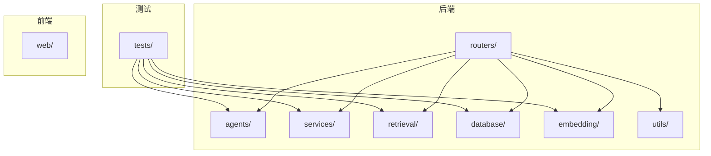
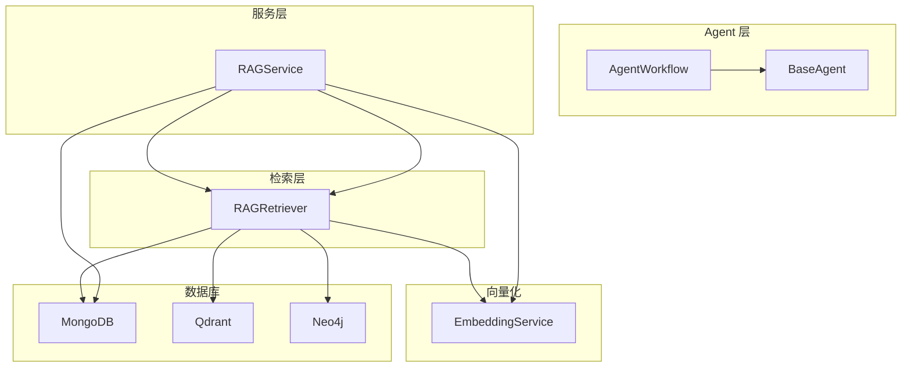
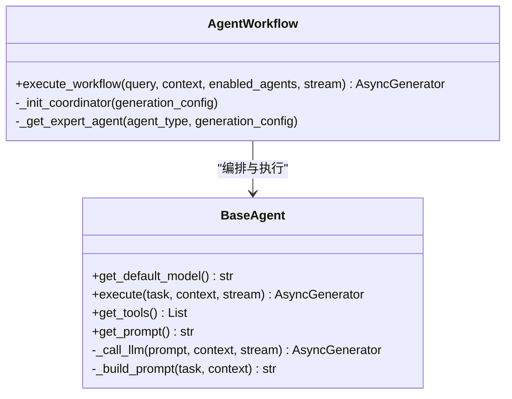
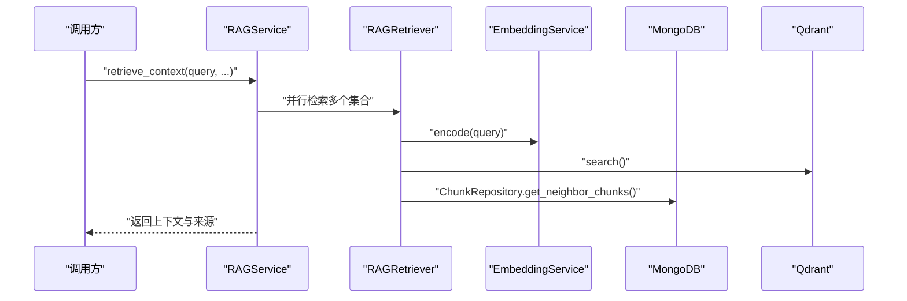
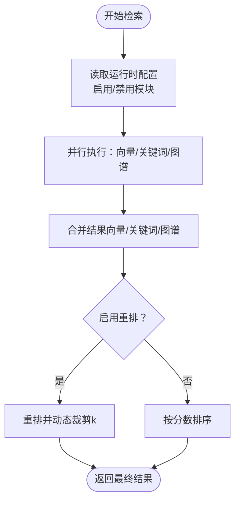
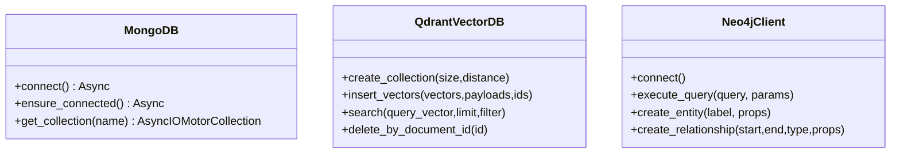
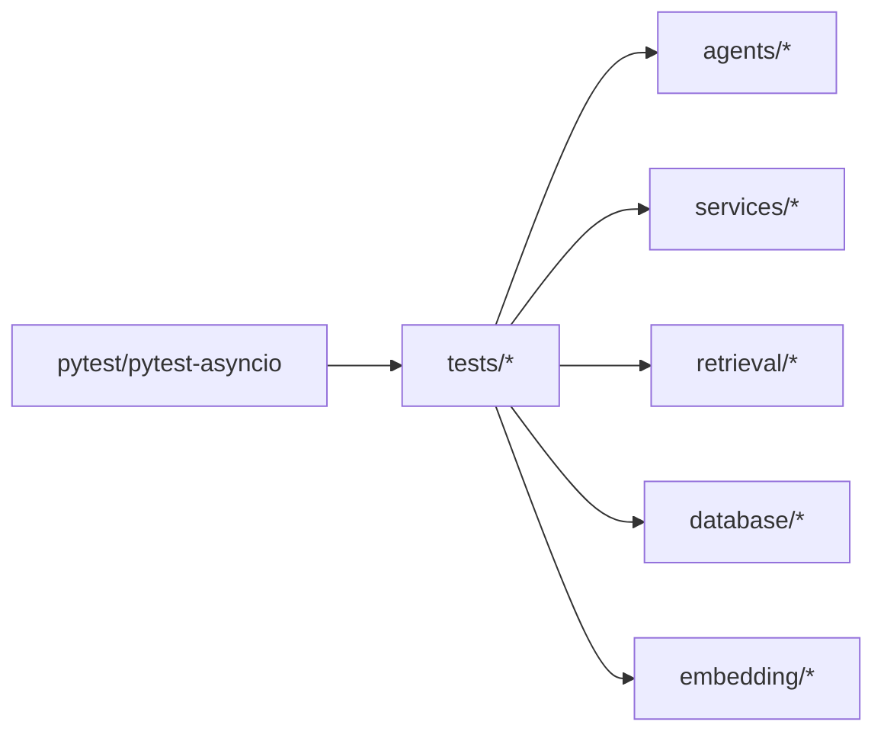

# 测试策略

<cite>
**本文引用的文件**
- [README.md](file://README.md)
- [requirements.txt](file://requirements.txt)
- [main.py](file://main.py)
- [tests/test_high_level_rag.py](file://tests/test_high_level_rag.py)
- [agents/base/base_agent.py](file://agents/base/base_agent.py)
- [agents/workflow/agent_workflow.py](file://agents/workflow/agent_workflow.py)
- [services/rag_service.py](file://services/rag_service.py)
- [retrieval/rag_retriever.py](file://retrieval/rag_retriever.py)
- [database/mongodb.py](file://database/mongodb.py)
- [database/qdrant_client.py](file://database/qdrant_client.py)
- [database/neo4j_client.py](file://database/neo4j_client.py)
- [embedding/embedding_service.py](file://embedding/embedding_service.py)
- [services/knowledge_extraction_service.py](file://services/knowledge_extraction_service.py)
</cite>

## 目录
1. [简介](#简介)
2. [项目结构](#项目结构)
3. [核心组件](#核心组件)
4. [架构总览](#架构总览)
5. [详细组件分析](#详细组件分析)
6. [依赖分析](#依赖分析)
7. [性能考虑](#性能考虑)
8. [故障排查指南](#故障排查指南)
9. [结论](#结论)
10. [附录](#附录)

## 简介
本测试策略面向 Advanced RAG 项目，旨在提供一套系统化的测试方法论，覆盖单元测试、集成测试、端到端测试与性能测试，并给出自动化测试流程、测试数据与模拟对象最佳实践、覆盖率与质量门禁建议以及测试工具配置。项目采用 FastAPI + Next.js 架构，核心能力包括多 Agent 协作、混合检索（向量/关键词/图谱）、知识抽取与入库、RAG 服务与检索服务等。

## 项目结构
- 后端核心模块
  - agents：多 Agent 框架与工作流编排
  - services：业务服务（RAG、知识抽取、模型选择等）
  - retrieval：检索服务（向量/关键词/图谱/重排）
  - database：MongoDB、Qdrant、Neo4j 客户端封装
  - embedding：向量化服务（Ollama）
  - routers：API 路由
  - utils：通用工具与监控
- 测试现状
  - tests/test_high_level_rag.py：包含混合分块、知识抽取（可选集成）、检索（可选集成）的高层测试样例

**图表来源**
- [main.py](file://main.py)
- [tests/test_high_level_rag.py](file://tests/test_high_level_rag.py)

**章节来源**
- [README.md](file://README.md)
- [main.py](file://main.py)

## 核心组件
- Agent 体系
  - BaseAgent：抽象基类，统一模型调用与提示词构建
  - AgentWorkflow：多 Agent 协作编排，支持延迟初始化与配置加载
- 服务层
  - RAGService：检索上下文与生成响应的封装，支持动态参数与邻居扩展
- 检索层
  - RAGRetriever：混合检索（向量/关键词/图谱），支持重排与动态裁剪
- 数据层
  - MongoDB：异步/同步客户端，集合操作与连接池配置
  - Qdrant：向量数据库客户端，gRPC 优先、重试与维度校验
  - Neo4j：图数据库客户端，Cypher 查询与实体/关系创建
- 向量化
  - EmbeddingService：基于 Ollama 的嵌入服务，模型检测与重试
- 知识抽取
  - KnowledgeExtractionService：三元组抽取、实体提取与图谱构建

**章节来源**
- [agents/base/base_agent.py](file://agents/base/base_agent.py)
- [agents/workflow/agent_workflow.py](file://agents/workflow/agent_workflow.py)
- [services/rag_service.py](file://services/rag_service.py)
- [retrieval/rag_retriever.py](file://retrieval/rag_retriever.py)
- [database/mongodb.py](file://database/mongodb.py)
- [database/qdrant_client.py](file://database/qdrant_client.py)
- [database/neo4j_client.py](file://database/neo4j_client.py)
- [embedding/embedding_service.py](file://embedding/embedding_service.py)
- [services/knowledge_extraction_service.py](file://services/knowledge_extraction_service.py)

## 架构总览
下图展示测试关注的关键交互：Agent 工作流编排、RAG 服务检索、检索器混合检索、向量化与数据库交互。

**图表来源**
- [agents/workflow/agent_workflow.py](file://agents/workflow/agent_workflow.py)
- [services/rag_service.py](file://services/rag_service.py)
- [retrieval/rag_retriever.py](file://retrieval/rag_retriever.py)
- [embedding/embedding_service.py](file://embedding/embedding_service.py)
- [database/mongodb.py](file://database/mongodb.py)
- [database/qdrant_client.py](file://database/qdrant_client.py)
- [database/neo4j_client.py](file://database/neo4j_client.py)

## 详细组件分析

### Agent 测试策略
- 单元测试
  - BaseAgent：验证模型初始化、提示词构建、工具与提示词接口
  - AgentWorkflow：验证配置加载、专家 Agent 延迟初始化、工作流执行与状态事件
- 集成测试
  - 通过可配置的环境变量控制是否启用图谱检索与重排，验证混合检索结果合并与动态裁剪
- 测试用例设计
  - 正常路径：不同 Agent 类型的执行、状态事件与完成事件
  - 异常路径：Agent 未找到、执行异常、配置加载失败
  - 流式输出：事件序列与进度更新

**图表来源**
- [agents/base/base_agent.py](file://agents/base/base_agent.py)
- [agents/workflow/agent_workflow.py](file://agents/workflow/agent_workflow.py)

**章节来源**
- [agents/base/base_agent.py](file://agents/base/base_agent.py)
- [agents/workflow/agent_workflow.py](file://agents/workflow/agent_workflow.py)

### 服务测试策略
- 单元测试
  - RAGService：动态检索参数、集合解析、并行检索、邻居扩展、上下文拼接与 token 截断
- 集成测试
  - 与检索器、MongoDB、向量化服务的协同，验证上下文构建与回退逻辑
- 测试用例设计
  - 正常路径：多集合检索、去重与排序、邻居扩展
  - 异常路径：检索失败回退、文档信息缺失、token 超限截断

**图表来源**
- [services/rag_service.py](file://services/rag_service.py)
- [retrieval/rag_retriever.py](file://retrieval/rag_retriever.py)
- [embedding/embedding_service.py](file://embedding/embedding_service.py)
- [database/mongodb.py](file://database/mongodb.py)
- [database/qdrant_client.py](file://database/qdrant_client.py)

**章节来源**
- [services/rag_service.py](file://services/rag_service.py)

### 检索测试策略
- 单元测试
  - RAGRetriever：向量检索、关键词检索、图谱检索、结果合并、重排与动态裁剪
- 集成测试
  - 与 Qdrant、MongoDB、Neo4j、EmbeddingService 的端到端检索
- 测试用例设计
  - 正常路径：多策略并行、合并与重排、动态 k 调整
  - 异常路径：重排模型加载失败、集合不存在、连接失败降级

**图表来源**
- [retrieval/rag_retriever.py](file://retrieval/rag_retriever.py)

**章节来源**
- [retrieval/rag_retriever.py](file://retrieval/rag_retriever.py)

### 数据库测试策略
- MongoDB
  - 连接池配置、连接失败回退、集合操作（文档/分块）、查询与更新
- Qdrant
  - gRPC 优先、重试与维度校验、集合创建与自动重建、搜索与删除
- Neo4j
  - 连接与容器环境适配、Cypher 查询、实体/关系创建
- 测试用例设计
  - 正常路径：连接成功、写入/查询/删除
  - 异常路径：连接失败、集合不存在、维度不匹配、容器内 URI 替换

**图表来源**
- [database/mongodb.py](file://database/mongodb.py)
- [database/qdrant_client.py](file://database/qdrant_client.py)
- [database/neo4j_client.py](file://database/neo4j_client.py)

**章节来源**
- [database/mongodb.py](file://database/mongodb.py)
- [database/qdrant_client.py](file://database/qdrant_client.py)
- [database/neo4j_client.py](file://database/neo4j_client.py)

### 工具函数测试策略
- 向量化服务
  - 模型检测与规范化、嵌入请求重试、超长文本截断
- 知识抽取服务
  - 三元组抽取与 JSON 解析、实体提取、图谱构建与冷却机制
- 测试用例设计
  - 正常路径：模型可用、JSON 解析、Cypher 执行
  - 异常路径：模型未找到、JSON 解析失败、连接失败冷却

**章节来源**
- [embedding/embedding_service.py](file://embedding/embedding_service.py)
- [services/knowledge_extraction_service.py](file://services/knowledge_extraction_service.py)

## 依赖分析
- 测试框架
  - pytest 与 pytest-asyncio 已在 requirements 中声明，适合异步测试与协程场景
- 外部依赖
  - FastAPI、MongoDB、Qdrant、Neo4j、Ollama、LangChain、sentence-transformers 等
- 耦合与风险
  - 检索链路耦合向量化与数据库，需通过环境变量与可配置项隔离外部服务
  - Agent 工作流依赖数据库配置，需支持降级与缓存

**图表来源**
- [requirements.txt](file://requirements.txt)
- [tests/test_high_level_rag.py](file://tests/test_high_level_rag.py)

**章节来源**
- [requirements.txt](file://requirements.txt)

## 性能考虑
- 压力测试
  - 使用异步客户端与连接池（MongoDB、Qdrant），模拟高并发检索与生成
  - 关注重排模型加载与推理延迟，提供降级开关
- 负载测试
  - 逐步提升并发与数据规模，观察检索延迟、吞吐与错误率
- 回归测试
  - 基于历史查询与文档集合，定期验证检索质量与响应时间
- 性能基准
  - 检索延迟（P50/P95）、向量维度、集合点数、重排开销、Agent 执行时序

[本节为通用指导，无需具体文件引用]

## 故障排查指南
- 数据库连接失败
  - MongoDB：检查连接字符串、认证参数、连接池配置；首次请求重试与 503 返回
  - Qdrant：优先 gRPC、容器内 URI 替换、集合自动创建与维度校验
  - Neo4j：容器内 URI 替换、驱动连接验证
- 检索异常
  - 重排模型加载失败自动降级；集合不存在时自动创建；连接错误指数退避重试
- Agent 工作流
  - 配置加载失败使用默认配置；未知 Agent 类型记录警告并跳过
- 知识抽取
  - 连接失败冷却避免刷屏；JSON 解析失败尝试修复与回退

**章节来源**
- [database/mongodb.py](file://database/mongodb.py)
- [database/qdrant_client.py](file://database/qdrant_client.py)
- [database/neo4j_client.py](file://database/neo4j_client.py)
- [retrieval/rag_retriever.py](file://retrieval/rag_retriever.py)
- [agents/workflow/agent_workflow.py](file://agents/workflow/agent_workflow.py)
- [services/knowledge_extraction_service.py](file://services/knowledge_extraction_service.py)

## 结论
本测试策略围绕 Agent、服务、检索、数据库与向量化五大领域，结合单元、集成与端到端测试，配合性能与回归测试，形成闭环质量保障。通过环境变量与可配置项隔离外部依赖，利用 pytest 与异步测试能力，确保系统在复杂场景下的稳定性与可维护性。

[本节为总结，无需具体文件引用]

## 附录

### 自动化测试流程与质量门禁
- CI/CD 集成
  - 使用 pytest 与 pytest-asyncio，配置并行执行与标记过滤
  - 集成测试通过环境变量控制（如 RUN_INTEGRATION_TESTS、NEO4J_ENABLED、ENABLE_RERANKER 等）
- 测试环境配置
  - .env 文件加载顺序与覆盖规则；容器内数据库 URI 替换
- 测试报告
  - 生成 junitxml 报告并与 CI 平台集成；覆盖率通过 pytest-cov 收集

**章节来源**
- [main.py](file://main.py)
- [tests/test_high_level_rag.py](file://tests/test_high_level_rag.py)

### 测试数据准备与模拟对象
- 测试数据
  - 使用 fixtures 提供样本文本与分块；通过环境变量切换集成测试
- 模拟对象
  - 使用 unittest.mock 或 pytest-mock 模拟外部服务（如 Ollama、Qdrant、Neo4j）
- 测试隔离
  - 使用独立数据库与集合命名空间；清理测试数据与索引

**章节来源**
- [tests/test_high_level_rag.py](file://tests/test_high_level_rag.py)

### 覆盖率与质量门禁
- 覆盖率要求
  - 建议核心模块（Agent、服务、检索、数据库）达到 80%+ 行覆盖率
- 质量门禁
  - 通过 pytest 标记过滤与 junitxml 报告；失败即阻断 CI

**章节来源**
- [requirements.txt](file://requirements.txt)