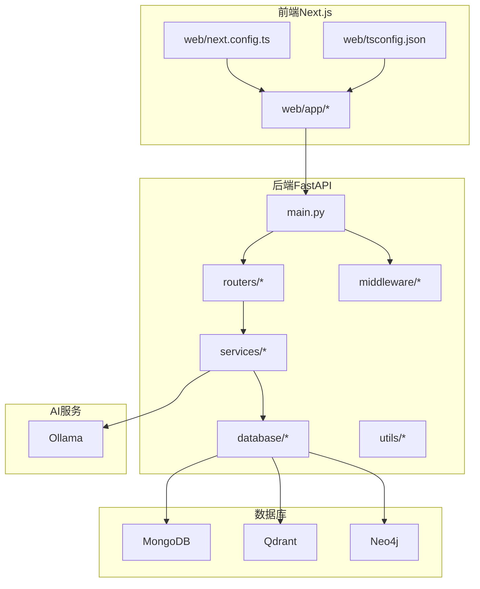
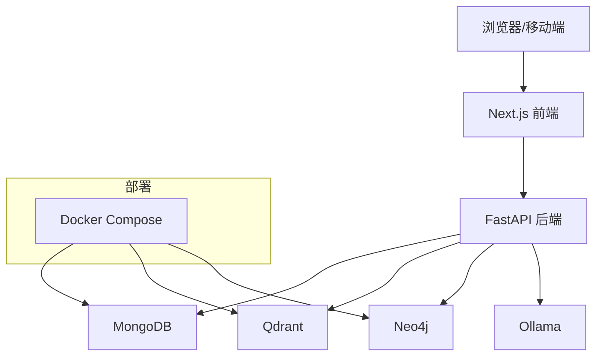
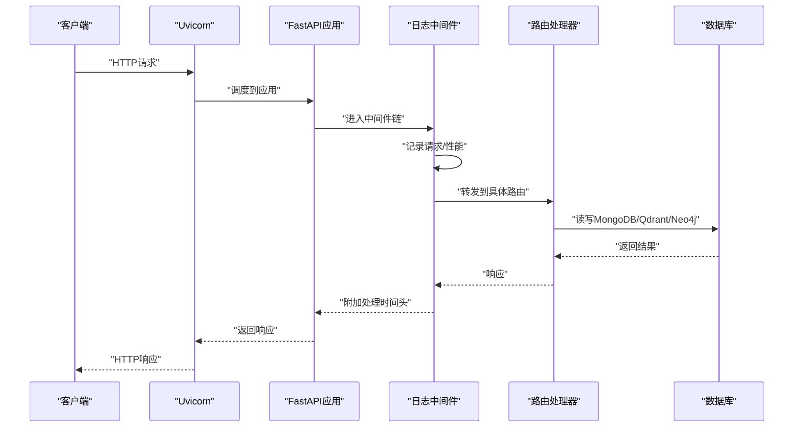
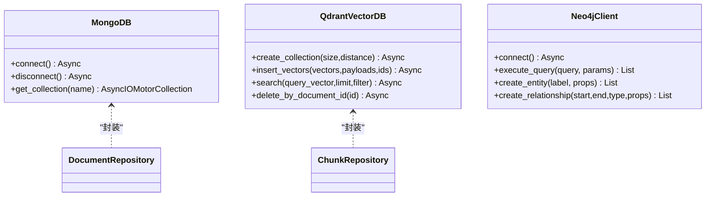
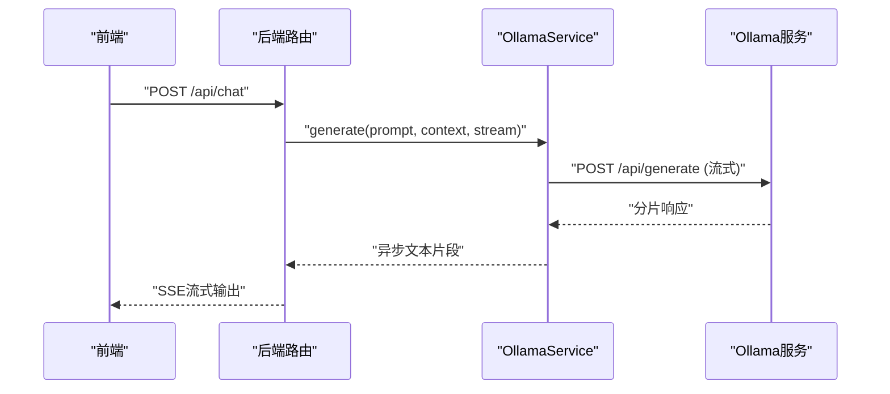
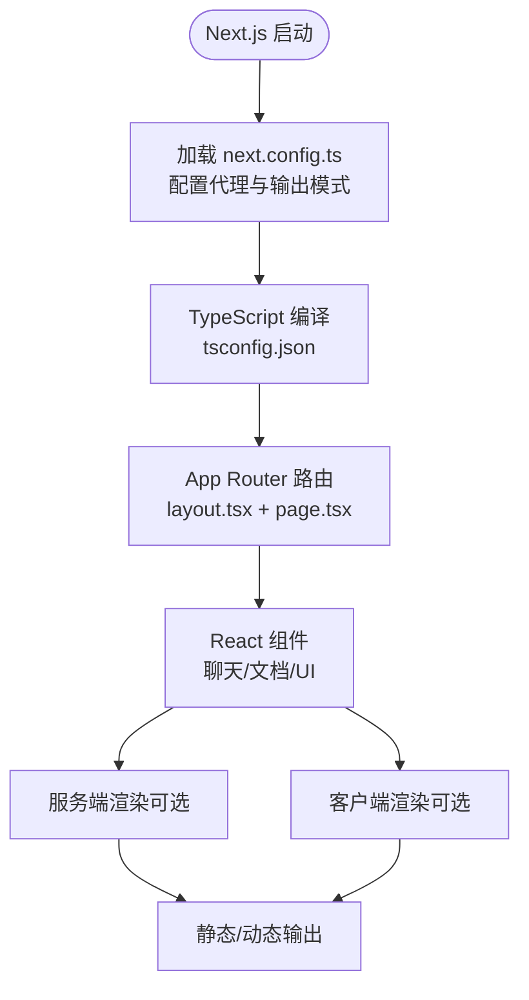
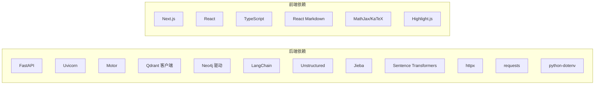

# 技术栈选型

<cite>
**本文档引用的文件**
- [main.py](file://main.py)
- [requirements.txt](file://requirements.txt)
- [docker-compose.yml](file://docker-compose.yml)
- [README.md](file://README.md)
- [mongodb.py](file://database/mongodb.py)
- [qdrant_client.py](file://database/qdrant_client.py)
- [neo4j_client.py](file://database/neo4j_client.py)
- [ollama_service.py](file://services/ollama_service.py)
- [embedding_service.py](file://embedding/embedding_service.py)
- [layout.tsx](file://web/app/layout.tsx)
- [page.tsx](file://web/app/page.tsx)
- [next.config.ts](file://web/next.config.ts)
- [tsconfig.json](file://web/tsconfig.json)
- [chat.py](file://routers/chat.py)
- [lifespan.py](file://utils/lifespan.py)
- [logging_middleware.py](file://middleware/logging_middleware.py)
</cite>

## 目录
1. [简介](#简介)
2. [项目结构](#项目结构)
3. [核心组件](#核心组件)
4. [架构概览](#架构概览)
5. [详细组件分析](#详细组件分析)
6. [依赖分析](#依赖分析)
7. [性能考量](#性能考量)
8. [故障排除指南](#故障排除指南)
9. [结论](#结论)
10. [附录](#附录)

## 简介
本文件系统性阐述 advanced-rag 的技术栈选型，围绕后端（FastAPI + Uvicorn）、前端（Next.js + React + TypeScript）、数据库（MongoDB + Qdrant + Neo4j）以及 AI 服务（Ollama）展开，重点说明各技术的适用性、性能优势、权衡考虑与替代方案。

## 项目结构
项目采用前后端分离架构：
- 后端：FastAPI 应用入口、路由层、服务层、数据库层、工具层、中间件
- 前端：Next.js 应用，采用 App Router，TypeScript 类型保障
- 数据库：MongoDB（用户与对话历史）、Qdrant（向量检索）、Neo4j（知识图谱）
- AI 服务：Ollama（本地模型推理）

**图表来源**
- [main.py:55-98](file://main.py#L55-L98)
- [chat.py:1-200](file://routers/chat.py#L1-L200)
- [mongodb.py:92-196](file://database/mongodb.py#L92-L196)
- [qdrant_client.py:18-96](file://database/qdrant_client.py#L18-L96)
- [neo4j_client.py:6-39](file://database/neo4j_client.py#L6-L39)
- [ollama_service.py:9-35](file://services/ollama_service.py#L9-L35)
- [next.config.ts:1-48](file://web/next.config.ts#L1-L48)
- [tsconfig.json:1-35](file://web/tsconfig.json#L1-L35)

**章节来源**
- [README.md:55-70](file://README.md#L55-L70)
- [main.py:55-98](file://main.py#L55-L98)

## 核心组件
- 后端框架：FastAPI + Uvicorn，提供高性能、自动生成 OpenAPI 文档、类型安全的异步 Web 框架
- 数据库：MongoDB（文档存储）、Qdrant（向量检索）、Neo4j（知识图谱）
- AI 服务：Ollama（本地模型推理，隐私保护）
- 前端：Next.js（App Router + SSR/CSR）、React（组件化）、TypeScript（类型安全）

**章节来源**
- [requirements.txt:4-38](file://requirements.txt#L4-L38)
- [README.md:26-45](file://README.md#L26-L45)
- [docker-compose.yml:1-76](file://docker-compose.yml#L1-L76)

## 架构概览
后端通过 FastAPI 提供 REST API，前端通过 Next.js 访问 API。数据库层包含 MongoDB（文档与对话历史）、Qdrant（向量检索）、Neo4j（知识图谱）。AI 服务通过 Ollama 提供本地模型推理与向量化。

**图表来源**
- [main.py:91-97](file://main.py#L91-L97)
- [docker-compose.yml:1-76](file://docker-compose.yml#L1-L76)
- [ollama_service.py:9-35](file://services/ollama_service.py#L9-L35)

## 详细组件分析

### 后端技术栈：FastAPI + Uvicorn
- 选择理由
  - 类型驱动的 API 开发：Pydantic 模型自动校验与序列化，减少样板代码
  - 自动生成 OpenAPI/Swagger 文档，便于联调与测试
  - 异步支持与高性能：适合高并发与流式响应（如 SSE）
  - 中间件与生命周期管理：统一日志、CORS、健康检查与连接池初始化
- Uvicorn 优势
  - ASGI 标准，支持高并发与长连接（SSE/WS）
  - 生产环境多 worker 配置，提升吞吐
  - keep-alive 与连接限制配置，适配大文件上传与高并发场景
- 关键实现要点
  - 应用生命周期：启动时连接数据库并初始化默认助手与知识空间
  - 请求日志中间件：记录慢请求与错误，便于监控
  - 全局异常处理：统一返回 JSON 并记录日志
  - 静态文件服务：头像、缩略图、封面图托管

**图表来源**
- [main.py:128-157](file://main.py#L128-L157)
- [lifespan.py:26-88](file://utils/lifespan.py#L26-L88)
- [logging_middleware.py:8-52](file://middleware/logging_middleware.py#L8-L52)
- [chat.py:97-149](file://routers/chat.py#L97-L149)

**章节来源**
- [main.py:55-126](file://main.py#L55-L126)
- [lifespan.py:26-88](file://utils/lifespan.py#L26-L88)
- [logging_middleware.py:8-52](file://middleware/logging_middleware.py#L8-L52)

### 数据库技术栈：MongoDB + Qdrant + Neo4j
- MongoDB（用户数据与对话历史）
  - 异步 Motor 客户端与同步 MongoClient 双版本封装，适配不同场景
  - 连接池参数可配置，支持高并发与长连接
  - 文档仓库与分块仓库封装常用 CRUD 操作
- Qdrant（向量检索）
  - 优先使用 gRPC 连接，避免 HTTP/httpx 502 问题，提升稳定性与性能
  - 自动维度校验与集合重建，插入失败时自动重试
  - 支持过滤条件与阈值控制，适配混合检索
- Neo4j（知识图谱）
  - 基于 Bolt 协议，支持容器内连接（host.docker.internal）
  - 提供实体与关系创建的便捷方法

**图表来源**
- [mongodb.py:92-196](file://database/mongodb.py#L92-L196)
- [qdrant_client.py:18-96](file://database/qdrant_client.py#L18-L96)
- [neo4j_client.py:6-39](file://database/neo4j_client.py#L6-L39)

**章节来源**
- [mongodb.py:92-314](file://database/mongodb.py#L92-L314)
- [qdrant_client.py:18-544](file://database/qdrant_client.py#L18-L544)
- [neo4j_client.py:6-104](file://database/neo4j_client.py#L6-L104)

### AI 服务集成：Ollama 本地模型服务
- 隐私保护：本地部署，数据不出域
- 模型管理：动态检测与规范化模型名称，支持流式与非流式生成
- 向量化：通过 Ollama Embedding API 获取向量，适配 RAG 索引
- 工具函数：支持在提示词中调用工具函数获取系统信息

**图表来源**
- [ollama_service.py:50-93](file://services/ollama_service.py#L50-L93)
- [chat.py:84-95](file://routers/chat.py#L84-L95)

**章节来源**
- [ollama_service.py:9-674](file://services/ollama_service.py#L9-L674)
- [embedding_service.py:8-278](file://embedding/embedding_service.py#L8-L278)

### 前端技术栈：Next.js + React + TypeScript
- Next.js（App Router + SSR/CSR）
  - App Router 提供页面级布局与数据获取，支持 SSR/CSR 混合
  - 布局组件统一主题与元数据，页面组件负责导航与加载
- React 组件化
  - 组件按功能拆分，如聊天、文档上传、消息渲染等
- TypeScript 类型安全
  - 严格的类型约束，减少运行时错误
  - 路径别名与 bundler 解析，提升开发体验

**图表来源**
- [next.config.ts:1-48](file://web/next.config.ts#L1-L48)
- [tsconfig.json:1-35](file://web/tsconfig.json#L1-L35)
- [layout.tsx:1-49](file://web/app/layout.tsx#L1-L49)
- [page.tsx:1-39](file://web/app/page.tsx#L1-L39)

**章节来源**
- [next.config.ts:1-48](file://web/next.config.ts#L1-L48)
- [tsconfig.json:1-35](file://web/tsconfig.json#L1-L35)
- [layout.tsx:1-49](file://web/app/layout.tsx#L1-L49)
- [page.tsx:1-39](file://web/app/page.tsx#L1-L39)

## 依赖分析
- 后端依赖
  - Web 框架：FastAPI、Uvicorn
  - 数据库：PyMongo/Motor、Qdrant 客户端、Neo4j 驱动
  - 文档处理：PyPDF2、PyMuPDF、python-docx、unstructured
  - 文本处理：LangChain、jieba、sentence-transformers
  - HTTP：httpx、requests
  - 配置：python-dotenv
- 前端依赖
  - Next.js、React、TypeScript
  - Markdown 渲染、数学公式、语法高亮等生态库

**图表来源**
- [requirements.txt:4-38](file://requirements.txt#L4-L38)
- [package.json:12-39](file://web/package.json#L12-L39)

**章节来源**
- [requirements.txt:1-38](file://requirements.txt#L1-L38)
- [package.json:1-40](file://web/package.json#L1-L40)

## 性能考量
- 后端性能
  - Uvicorn 多 worker：生产环境默认 24 个 worker，提升并发处理能力
  - keep-alive 超时与连接限制：支持大文件上传与高并发
  - 连接池参数：MongoDB 连接池大小、超时与空闲时间可调
  - gRPC 连接：Qdrant 优先使用 gRPC，避免 HTTP 502，提升稳定性
- 前端性能
  - Standalone 输出模式：便于 Docker 部署与冷启动优化
  - 代理配置：开发环境自动代理到后端，减少跨域与联调成本
- AI 服务
  - 流式生成：降低首字延迟，改善用户体验
  - 超时与重试：针对大模型与网络波动的健壮性设计

**章节来源**
- [main.py:140-157](file://main.py#L140-L157)
- [mongodb.py:122-151](file://database/mongodb.py#L122-L151)
- [qdrant_client.py:66-96](file://database/qdrant_client.py#L66-L96)
- [ollama_service.py:32-34](file://services/ollama_service.py#L32-L34)

## 故障排除指南
- 数据库连接失败
  - MongoDB：检查 URI/主机/端口/认证信息，确认连接池参数与超时设置
  - Qdrant：确认 gRPC 端口可达，避免 HTTP 502；检查集合维度与自动重建
  - Neo4j：确认 Bolt 端口与容器内连接（host.docker.internal）
- Ollama 服务不可达
  - 检查本地回环替换（localhost → 127.0.0.1）与超时设置
  - 确认模型存在与 embedding 模型可用
- 前端代理问题
  - NEXT_PUBLIC_API_URL 未配置时，开发环境默认代理到 http://localhost:8000
  - 生产环境使用相对路径由反向代理处理

**章节来源**
- [mongodb.py:154-184](file://database/mongodb.py#L154-L184)
- [qdrant_client.py:97-123](file://database/qdrant_client.py#L97-L123)
- [neo4j_client.py:16-33](file://database/neo4j_client.py#L16-L33)
- [ollama_service.py:24-34](file://services/ollama_service.py#L24-L34)
- [next.config.ts:12-34](file://web/next.config.ts#L12-L34)

## 结论
advanced-rag 的技术栈在性能、隐私与可维护性之间取得平衡：
- 后端：FastAPI + Uvicorn 提供高性能与类型安全，配合中间件与生命周期管理，适合高并发与复杂业务
- 数据库：MongoDB + Qdrant + Neo4j 形成“文档 + 向量 + 图谱”的多模态索引体系，支撑混合检索与知识图谱
- AI 服务：Ollama 本地部署，隐私可控，流式生成与工具函数增强交互体验
- 前端：Next.js + React + TypeScript 提供现代化开发体验与良好的类型保障

## 附录
- 部署建议
  - 使用 Docker Compose 启动 MongoDB、Qdrant、Neo4j
  - 生产环境启用多 worker 与连接池优化
  - 前端使用 Standalone 输出模式，结合反向代理
- 替代方案
  - Web 框架：Sanic、Starlette（性能相近，生态差异）
  - 数据库：PostgreSQL（结构化数据）、Pinecone/Weaviate（向量服务）
  - AI 服务：OpenAI/Anthropic（云端，隐私风险）
  - 前端：Vite/Remix（构建与路由策略不同）

**章节来源**
- [docker-compose.yml:1-76](file://docker-compose.yml#L1-L76)
- [README.md:200-227](file://README.md#L200-L227)