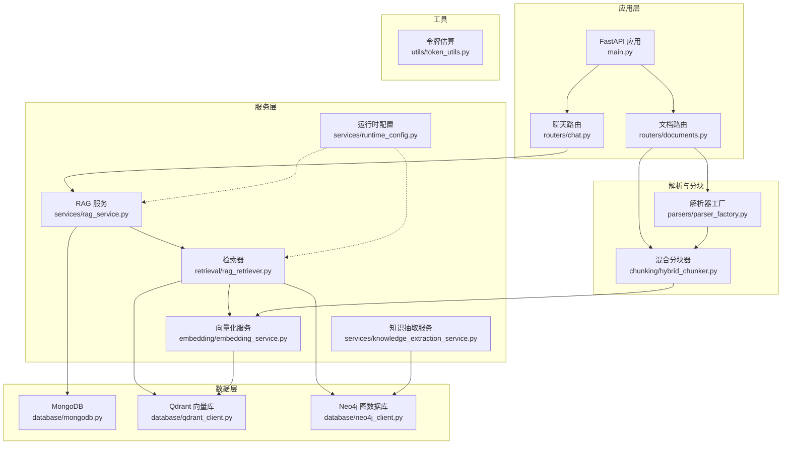
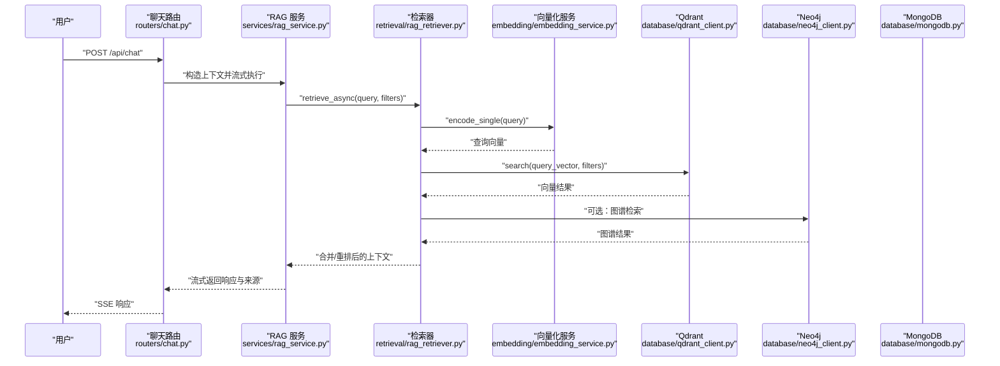
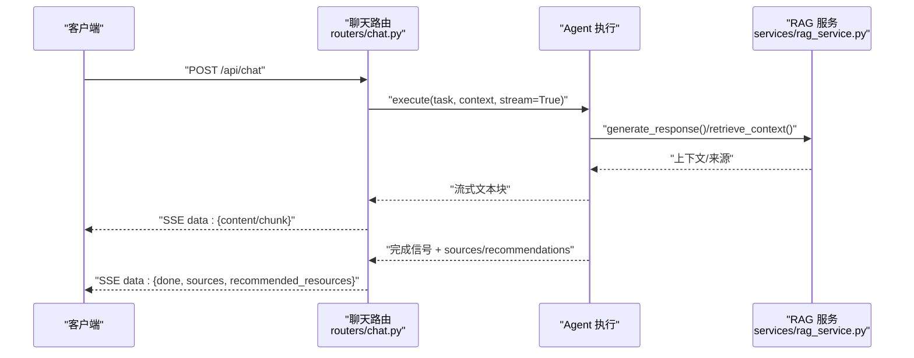
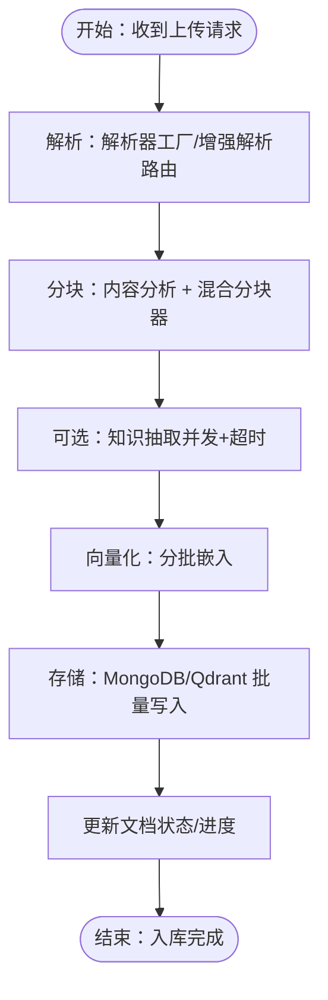
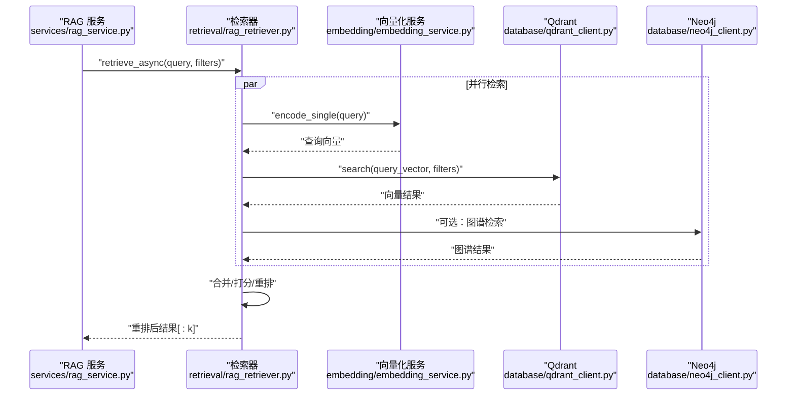
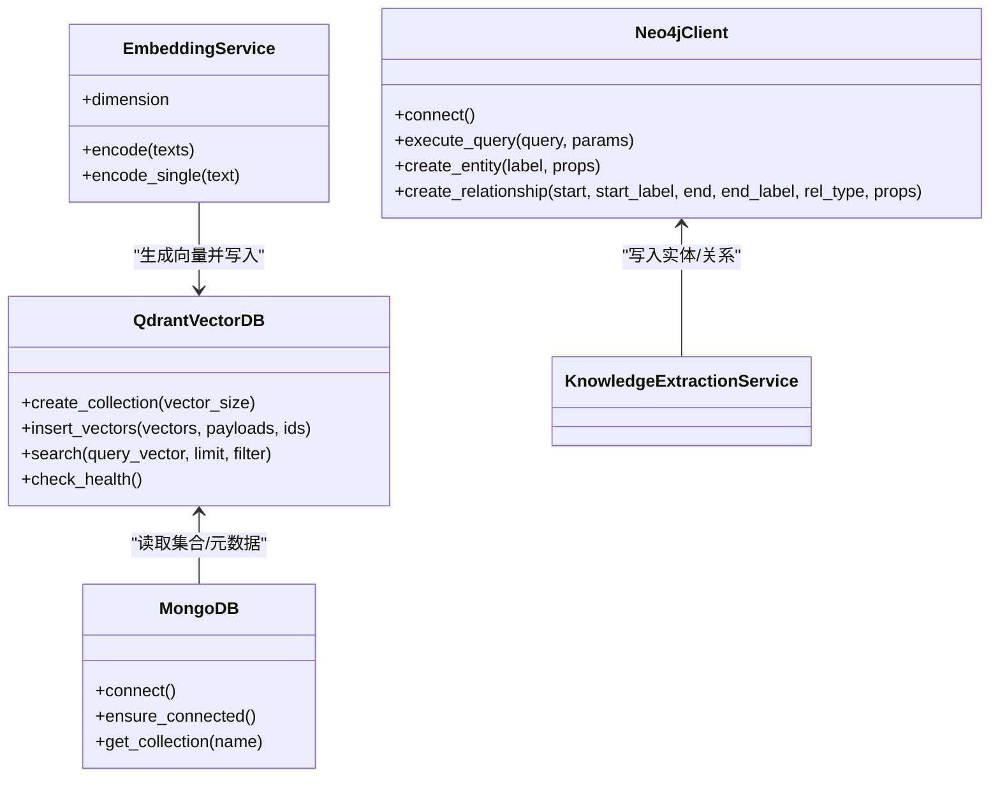
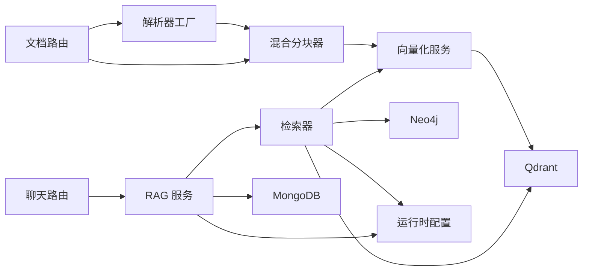

# 数据流架构

<cite>
**本文引用的文件**
- [main.py](file://main.py)
- [chat.py](file://routers/chat.py)
- [documents.py](file://routers/documents.py)
- [rag_service.py](file://services/rag_service.py)
- [rag_retriever.py](file://retrieval/rag_retriever.py)
- [embedding_service.py](file://embedding/embedding_service.py)
- [qdrant_client.py](file://database/qdrant_client.py)
- [mongodb.py](file://database/mongodb.py)
- [neo4j_client.py](file://database/neo4j_client.py)
- [parser_factory.py](file://parsers/parser_factory.py)
- [hybrid_chunker.py](file://chunking/hybrid_chunker.py)
- [runtime_config.py](file://services/runtime_config.py)
- [token_utils.py](file://utils/token_utils.py)
- [knowledge_extraction_service.py](file://services/knowledge_extraction_service.py)
</cite>

## 目录
1. [简介](#简介)
2. [项目结构](#项目结构)
3. [核心组件](#核心组件)
4. [架构总览](#架构总览)
5. [详细组件分析](#详细组件分析)
6. [依赖分析](#依赖分析)
7. [性能考量](#性能考量)
8. [故障排查指南](#故障排查指南)
9. [结论](#结论)
10. [附录](#附录)

## 简介
本文件面向 Advanced RAG 系统，聚焦“数据流架构”，系统性阐述数据在系统中的流转路径与处理过程，覆盖用户输入数据、文档处理数据、检索数据与响应数据的完整闭环。文档详细说明从原始文档到向量嵌入再到最终响应的处理管线，解释数据转换与处理管道、缓存策略与存储层次结构、数据一致性保障机制与并发处理策略，并给出实时数据流与批处理任务的协调机制与可视化图示。

## 项目结构
系统采用 FastAPI 应用入口，通过路由模块对外提供聊天、文档管理、检索、知识空间等接口；服务层负责 RAG 核心逻辑、向量化、知识抽取与运行时配置；数据层包含 MongoDB、Qdrant 向量库与 Neo4j 图数据库；解析与分块模块负责文档解析与文本切分；工具模块提供令牌估算与日志等支撑能力。

图表来源
- [main.py:1-171](file://main.py#L1-L171)
- [chat.py:1-800](file://routers/chat.py#L1-L800)
- [documents.py:1-800](file://routers/documents.py#L1-L800)
- [rag_service.py:1-323](file://services/rag_service.py#L1-L323)
- [rag_retriever.py:1-393](file://retrieval/rag_retriever.py#L1-L393)
- [embedding_service.py:1-333](file://embedding/embedding_service.py#L1-L333)
- [qdrant_client.py:1-544](file://database/qdrant_client.py#L1-L544)
- [mongodb.py:1-800](file://database/mongodb.py#L1-L800)
- [neo4j_client.py:1-104](file://database/neo4j_client.py#L1-L104)
- [parser_factory.py:1-58](file://parsers/parser_factory.py#L1-L58)
- [hybrid_chunker.py:1-179](file://chunking/hybrid_chunker.py#L1-L179)
- [runtime_config.py:1-218](file://services/runtime_config.py#L1-L218)
- [token_utils.py:1-72](file://utils/token_utils.py#L1-L72)
- [knowledge_extraction_service.py:1-229](file://services/knowledge_extraction_service.py#L1-L229)

章节来源
- [main.py:1-171](file://main.py#L1-L171)
- [chat.py:1-800](file://routers/chat.py#L1-L800)
- [documents.py:1-800](file://routers/documents.py#L1-L800)

## 核心组件
- 应用入口与路由
  - FastAPI 应用入口负责加载环境变量、注册中间件与静态资源、挂载各路由模块。
  - 路由模块提供聊天、文档管理、检索、知识空间等功能接口。
- 服务层
  - RAG 服务：封装检索与上下文拼接、动态参数调整、邻居扩展与去重、上下文截断与回退策略。
  - 检索器：混合检索（向量、关键词、图谱）、重排、动态裁剪 k、并发策略。
  - 向量化服务：基于 Ollama 的嵌入生成，模型发现与规范化、超长文本截断、重试与错误处理。
  - 运行时配置：MongoDB 持久化 + TTL 缓存，支持低/高/自定义模式与模块开关。
  - 知识抽取服务：从文本抽取三元组并写入 Neo4j，支持冷却与降级。
- 数据层
  - MongoDB：文档与分块元数据存储、连接池配置、懒加载与健康检查。
  - Qdrant：向量集合创建、批量插入、搜索、删除与集合信息查询。
  - Neo4j：实体与关系创建、连接与查询。
- 解析与分块
  - 解析器工厂：根据文件类型选择解析器，兼容多种格式。
  - 混合分块器：规则提取代码/公式/表格与语义分块结合，去重与元数据增强。
- 工具
  - 令牌估算与截断：近似估算 token 数量，二分法截断文本，避免超上下文。

章节来源
- [rag_service.py:1-323](file://services/rag_service.py#L1-L323)
- [rag_retriever.py:1-393](file://retrieval/rag_retriever.py#L1-L393)
- [embedding_service.py:1-333](file://embedding/embedding_service.py#L1-L333)
- [runtime_config.py:1-218](file://services/runtime_config.py#L1-L218)
- [knowledge_extraction_service.py:1-229](file://services/knowledge_extraction_service.py#L1-L229)
- [mongodb.py:1-800](file://database/mongodb.py#L1-L800)
- [qdrant_client.py:1-544](file://database/qdrant_client.py#L1-L544)
- [neo4j_client.py:1-104](file://database/neo4j_client.py#L1-L104)
- [parser_factory.py:1-58](file://parsers/parser_factory.py#L1-L58)
- [hybrid_chunker.py:1-179](file://chunking/hybrid_chunker.py#L1-L179)
- [token_utils.py:1-72](file://utils/token_utils.py#L1-L72)

## 架构总览
系统采用“请求驱动 + 批处理并行”的混合架构：
- 实时请求路径：聊天路由 -> RAG 服务 -> 检索器 -> 向量库/图谱 -> 上下文拼接 -> 流式响应。
- 批处理入库路径：文档路由 -> 解析/分块 -> 知识抽取（可选）-> 向量化 -> MongoDB/Qdrant 批量写入。
- 运行时配置贯穿检索与入库，支持模块开关与并发参数动态调整。

图表来源
- [chat.py:623-760](file://routers/chat.py#L623-L760)
- [rag_service.py:34-137](file://services/rag_service.py#L34-L137)
- [rag_retriever.py:89-137](file://retrieval/rag_retriever.py#L89-L137)
- [embedding_service.py:316-333](file://embedding/embedding_service.py#L316-L333)
- [qdrant_client.py:336-414](file://database/qdrant_client.py#L336-L414)
- [neo4j_client.py:40-62](file://database/neo4j_client.py#L40-L62)
- [mongodb.py:196-201](file://database/mongodb.py#L196-L201)

## 详细组件分析

### 组件A：聊天与对话数据流
- 输入：用户查询、可选助手/知识空间/对话ID、生成配置。
- 处理：Agent 执行、流式生成、断连检测、对话历史截断。
- 输出：SSE 流式文本、最终 sources 与推荐资源。
- 关键点：断连检测减少无效计算；对话历史仅取最近若干轮；Sources 与推荐资源随流返回。

图表来源
- [chat.py:623-760](file://routers/chat.py#L623-L760)
- [rag_service.py:268-317](file://services/rag_service.py#L268-L317)

章节来源
- [chat.py:623-760](file://routers/chat.py#L623-L760)
- [rag_service.py:268-317](file://services/rag_service.py#L268-L317)

### 组件B：文档入库与批处理数据流
- 输入：上传文件、可选助手/知识空间、运行时配置。
- 处理：解析（解析器工厂 + 增强解析路由）、分块（内容分析 + 混合分块器）、知识抽取（可选）、向量化、批量写入 MongoDB/Qdrant。
- 输出：文档状态与进度更新、向量集合与分块元数据。
- 关键点：超时监控与进度上报；知识抽取并发与超时保护；Qdrant 健康检查与降级；MongoDB/Qdrant 批量写入与幂等性。

图表来源
- [documents.py:274-799](file://routers/documents.py#L274-L799)
- [parser_factory.py:19-58](file://parsers/parser_factory.py#L19-L58)
- [hybrid_chunker.py:52-121](file://chunking/hybrid_chunker.py#L52-L121)
- [knowledge_extraction_service.py:147-213](file://services/knowledge_extraction_service.py#L147-L213)
- [embedding_service.py:292-318](file://embedding/embedding_service.py#L292-L318)
- [mongodb.py:793-860](file://database/mongodb.py#L793-L860)
- [qdrant_client.py:210-335](file://database/qdrant_client.py#L210-L335)

章节来源
- [documents.py:274-799](file://routers/documents.py#L274-L799)
- [parser_factory.py:19-58](file://parsers/parser_factory.py#L19-L58)
- [hybrid_chunker.py:52-121](file://chunking/hybrid_chunker.py#L52-L121)
- [knowledge_extraction_service.py:147-213](file://services/knowledge_extraction_service.py#L147-L213)
- [embedding_service.py:292-318](file://embedding/embedding_service.py#L292-L318)
- [mongodb.py:793-860](file://database/mongodb.py#L793-L860)
- [qdrant_client.py:210-335](file://database/qdrant_client.py#L210-L335)

### 组件C：检索与重排数据流
- 输入：查询文本、可选 filters（文档ID/知识空间/助手）。
- 处理：向量检索、关键词检索、图谱检索（可选）、合并与打分、交叉编码重排、动态裁剪 k。
- 输出：排序后的候选块、重排分数、检索类型标识。
- 关键点：动态参数（prefetch_k/final_k/score_threshold）；邻居扩展与上下文去重；重排预算控制与截断。

图表来源
- [rag_service.py:34-137](file://services/rag_service.py#L34-L137)
- [rag_retriever.py:89-137](file://retrieval/rag_retriever.py#L89-L137)
- [embedding_service.py:316-333](file://embedding/embedding_service.py#L316-L333)
- [qdrant_client.py:336-414](file://database/qdrant_client.py#L336-L414)
- [neo4j_client.py:40-62](file://database/neo4j_client.py#L40-L62)

章节来源
- [rag_service.py:34-137](file://services/rag_service.py#L34-L137)
- [rag_retriever.py:89-137](file://retrieval/rag_retriever.py#L89-L137)

### 组件D：向量化与存储层次
- 向量化：Ollama 嵌入，模型发现与规范化，超长文本截断，重试与错误处理。
- 存储：MongoDB 存储分块元数据；Qdrant 存储向量与轻量 payload；Neo4j 存储实体与关系。
- 缓存：运行时配置 TTL 缓存；MongoDB 连接池参数优化；Qdrant gRPC 连接复用。

图表来源
- [embedding_service.py:8-333](file://embedding/embedding_service.py#L8-L333)
- [qdrant_client.py:18-544](file://database/qdrant_client.py#L18-L544)
- [mongodb.py:92-204](file://database/mongodb.py#L92-L204)
- [neo4j_client.py:6-104](file://database/neo4j_client.py#L6-L104)

章节来源
- [embedding_service.py:8-333](file://embedding/embedding_service.py#L8-L333)
- [qdrant_client.py:18-544](file://database/qdrant_client.py#L18-L544)
- [mongodb.py:92-204](file://database/mongodb.py#L92-L204)
- [neo4j_client.py:6-104](file://database/neo4j_client.py#L6-L104)

## 依赖分析
- 组件耦合
  - 路由层依赖服务层；服务层依赖数据层与工具模块；解析与分块模块独立但被文档路由使用。
  - 检索器与向量化服务耦合紧密；与 Qdrant/Neo4j 的交互通过客户端封装。
- 外部依赖
  - Ollama（嵌入与知识抽取）、Qdrant（向量检索）、MongoDB（文档与分块元数据）、Neo4j（知识图谱）。
- 循环依赖
  - 未发现直接循环依赖；运行时配置通过异步读取避免初始化时的循环。

图表来源
- [chat.py:623-760](file://routers/chat.py#L623-L760)
- [documents.py:274-799](file://routers/documents.py#L274-L799)
- [rag_service.py:34-137](file://services/rag_service.py#L34-L137)
- [rag_retriever.py:89-137](file://retrieval/rag_retriever.py#L89-L137)
- [embedding_service.py:292-318](file://embedding/embedding_service.py#L292-L318)
- [qdrant_client.py:336-414](file://database/qdrant_client.py#L336-L414)
- [neo4j_client.py:40-62](file://database/neo4j_client.py#L40-L62)
- [mongodb.py:196-201](file://database/mongodb.py#L196-L201)
- [runtime_config.py:140-161](file://services/runtime_config.py#L140-L161)

章节来源
- [chat.py:623-760](file://routers/chat.py#L623-L760)
- [documents.py:274-799](file://routers/documents.py#L274-L799)
- [rag_service.py:34-137](file://services/rag_service.py#L34-L137)
- [rag_retriever.py:89-137](file://retrieval/rag_retriever.py#L89-L137)
- [embedding_service.py:292-318](file://embedding/embedding_service.py#L292-L318)
- [qdrant_client.py:336-414](file://database/qdrant_client.py#L336-L414)
- [neo4j_client.py:40-62](file://database/neo4j_client.py#L40-L62)
- [mongodb.py:196-201](file://database/mongodb.py#L196-L201)
- [runtime_config.py:140-161](file://services/runtime_config.py#L140-L161)

## 性能考量
- 并发与连接
  - MongoDB 连接池参数可调，建议按 worker 数量与负载合理配置；Qdrant 优先使用 gRPC 降低 httpx 502 风险。
  - 检索器与知识抽取支持并发与超时保护，避免单个块拖慢整体。
- 批处理与内存
  - 向量化与 Qdrant 批量写入采用分批策略，避免内存峰值；运行时配置可调节批大小与并发度。
- 令牌预算与截断
  - 通过近似估算与二分截断控制上下文长度，避免超上下文与重排开销过大。
- 缓存与降级
  - 运行时配置 TTL 缓存减少数据库读取；重排模型加载失败自动降级；Qdrant 不可用时仅写入 MongoDB。

## 故障排查指南
- 向量化失败
  - 检查 Ollama 地址与模型名称；关注超长文本截断与重试策略；确认模型存在与可用。
- Qdrant 不可用
  - 检查 gRPC 连接与健康检查；集合维度不匹配时自动重建；连续失败后可短暂冷却。
- Neo4j 连接失败
  - 检查 URI/凭据；连接失败后进入冷却期避免频繁日志；可临时关闭图谱模块。
- MongoDB 连接失败
  - 启动时惰性连接与首次请求重试；检查连接字符串与认证参数；确认数据库可达。
- 检索性能问题
  - 调整动态参数（prefetch_k/final_k/score_threshold）；启用/禁用重排与图谱模块；优化分块大小与重叠。

章节来源
- [embedding_service.py:175-291](file://embedding/embedding_service.py#L175-L291)
- [qdrant_client.py:97-123](file://database/qdrant_client.py#L97-L123)
- [neo4j_client.py:16-33](file://database/neo4j_client.py#L16-L33)
- [mongodb.py:186-184](file://database/mongodb.py#L186-L184)
- [rag_retriever.py:52-69](file://retrieval/rag_retriever.py#L52-L69)

## 结论
Advanced RAG 系统通过清晰的数据流分层与模块化设计，实现了从文档入库到实时检索与响应的高效闭环。系统在并发、缓存、降级与令牌预算方面具备良好工程实践，能够稳定支撑复杂检索场景与大规模文档入库。建议在生产环境中结合业务负载调优连接池、批大小与并发参数，并持续监控外部服务健康状态以保障稳定性。

## 附录
- 数据流图（端到端）
  - 聊天请求：SSE 流式响应，Sources 与推荐资源随完成信号返回。
  - 文档入库：解析/分块/知识抽取/向量化/批量写入，进度与状态实时更新。
- 处理时序图（检索）
  - 向量检索、关键词检索、图谱检索并行，合并打分与重排，动态裁剪 k。