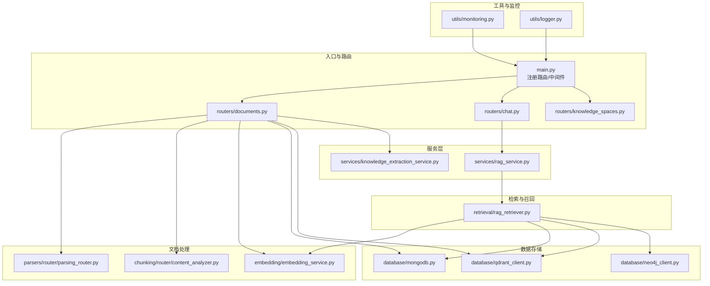
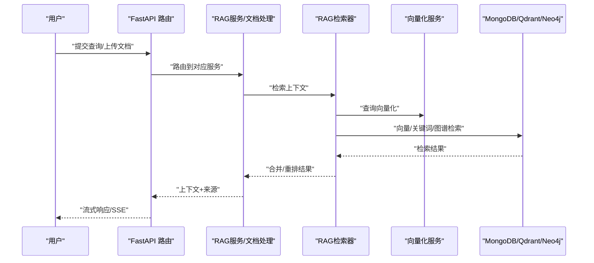
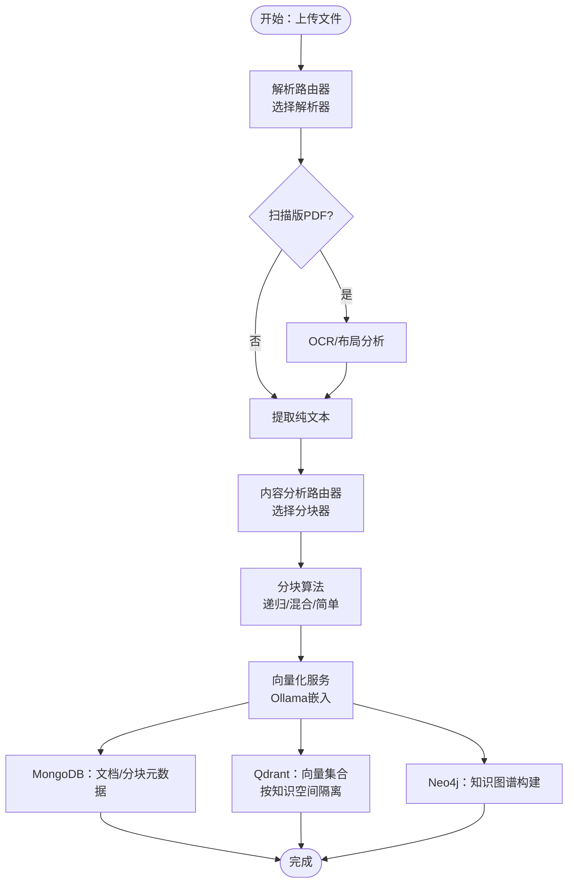
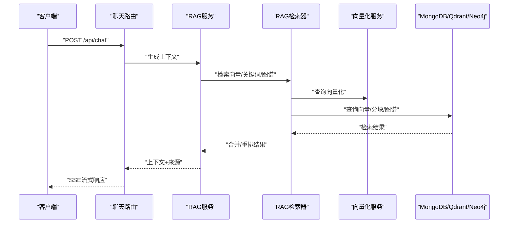
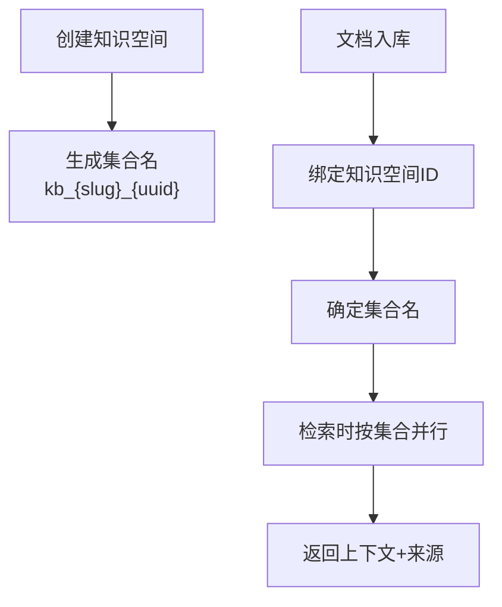
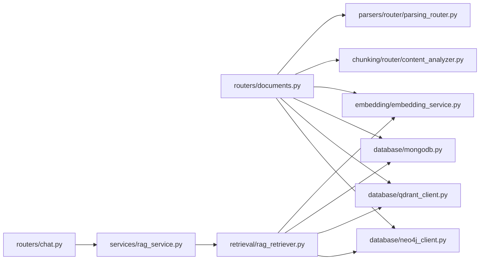

# 数据流设计

<cite>
**本文引用的文件**
- [main.py](file://main.py)
- [routers/documents.py](file://routers/documents.py)
- [routers/chat.py](file://routers/chat.py)
- [routers/knowledge_spaces.py](file://routers/knowledge_spaces.py)
- [services/rag_service.py](file://services/rag_service.py)
- [retrieval/rag_retriever.py](file://retrieval/rag_retriever.py)
- [database/mongodb.py](file://database/mongodb.py)
- [database/qdrant_client.py](file://database/qdrant_client.py)
- [embedding/embedding_service.py](file://embedding/embedding_service.py)
- [chunking/router/content_analyzer.py](file://chunking/router/content_analyzer.py)
- [parsers/router/parsing_router.py](file://parsers/router/parsing_router.py)
- [services/knowledge_extraction_service.py](file://services/knowledge_extraction_service.py)
- [utils/monitoring.py](file://utils/monitoring.py)
- [utils/logger.py](file://utils/logger.py)
</cite>

## 目录
1. [引言](#引言)
2. [项目结构](#项目结构)
3. [核心组件](#核心组件)
4. [架构总览](#架构总览)
5. [详细组件分析](#详细组件分析)
6. [依赖关系分析](#依赖关系分析)
7. [性能考虑](#性能考虑)
8. [故障排查指南](#故障排查指南)
9. [结论](#结论)
10. [附录](#附录)

## 引言
本文件面向 advanced-rag 系统，系统采用 FastAPI 提供 REST API，结合解析、分块、向量化、检索与对话生成的完整数据流，支撑“知识库入库 + RAG 检索 + 流式对话”的能力。本文重点阐述三条主线数据流：
- 文档处理数据流：原始文档输入 → 多格式解析 → 内容分析 → 分块算法 → 向量化处理 → 数据库存储
- 对话处理数据流：用户查询输入 → 查询分析 → RAG 检索 → 上下文生成 → LLM 推理 → 流式响应输出
- 知识管理数据流：知识空间创建 → 资源组织 → 权限控制 → 搜索优化

并给出数据转换规则、缓存策略、异步处理机制与数据一致性保障、优化建议与性能监控指标。

## 项目结构
系统采用分层与模块化组织：
- 入口与路由：main.py 注册各业务路由（聊天、文档、检索、知识空间、健康检查）
- 业务路由：routers/* 提供 REST 接口，驱动具体业务流程
- 服务层：services/* 封装 RAG 服务、知识抽取、Ollama 等
- 检索与召回：retrieval/* 提供向量/关键词/图谱混合检索
- 数据存储：database/* 封装 MongoDB、Qdrant、Neo4j 客户端
- 文档处理：parsers/*、chunking/*、embedding/* 完成解析、分块、向量化
- 工具与监控：utils/* 提供日志、监控、性能分析等

图表来源
- [main.py:1-157](file://main.py#L1-L157)
- [routers/documents.py:1-800](file://routers/documents.py#L1-L800)
- [routers/chat.py:1-800](file://routers/chat.py#L1-L800)
- [routers/knowledge_spaces.py:1-133](file://routers/knowledge_spaces.py#L1-L133)
- [services/rag_service.py:1-248](file://services/rag_service.py#L1-L248)
- [retrieval/rag_retriever.py:1-325](file://retrieval/rag_retriever.py#L1-L325)
- [database/mongodb.py:1-800](file://database/mongodb.py#L1-L800)
- [database/qdrant_client.py:1-544](file://database/qdrant_client.py#L1-L544)
- [embedding/embedding_service.py:1-278](file://embedding/embedding_service.py#L1-L278)
- [chunking/router/content_analyzer.py:1-284](file://chunking/router/content_analyzer.py#L1-L284)
- [parsers/router/parsing_router.py:1-246](file://parsers/router/parsing_router.py#L1-L246)
- [services/knowledge_extraction_service.py:1-211](file://services/knowledge_extraction_service.py#L1-L211)
- [utils/monitoring.py:1-185](file://utils/monitoring.py#L1-L185)
- [utils/logger.py:1-88](file://utils/logger.py#L1-L88)

章节来源
- [main.py:1-157](file://main.py#L1-L157)

## 核心组件
- 文档处理流水线：解析路由器（按文件类型与复杂度选择解析器）、内容分析路由器（按结构化/公式/语义需求选择分块器）、向量化服务（Ollama）、MongoDB/Qdrant 存储
- 对话流水线：聊天路由（流式 SSE）、RAG 服务（检索上下文）、RAG 检索器（向量/关键词/图谱混合）、LLM 推理（Ollama）
- 知识管理：知识空间路由（集合隔离）、资源组织（文档/资源映射）、权限控制（基于集合名与知识空间）

章节来源
- [routers/documents.py:1-800](file://routers/documents.py#L1-L800)
- [routers/chat.py:1-800](file://routers/chat.py#L1-L800)
- [routers/knowledge_spaces.py:1-133](file://routers/knowledge_spaces.py#L1-L133)
- [services/rag_service.py:1-248](file://services/rag_service.py#L1-L248)
- [retrieval/rag_retriever.py:1-325](file://retrieval/rag_retriever.py#L1-L325)
- [database/mongodb.py:1-800](file://database/mongodb.py#L1-L800)
- [database/qdrant_client.py:1-544](file://database/qdrant_client.py#L1-L544)
- [embedding/embedding_service.py:1-278](file://embedding/embedding_service.py#L1-L278)
- [chunking/router/content_analyzer.py:1-284](file://chunking/router/content_analyzer.py#L1-L284)
- [parsers/router/parsing_router.py:1-246](file://parsers/router/parsing_router.py#L1-L246)
- [services/knowledge_extraction_service.py:1-211](file://services/knowledge_extraction_service.py#L1-L211)

## 架构总览
系统采用“API 路由 → 服务编排 → 检索/存储 → LLM 推理”的分层架构。文档入库与对话检索共享同一检索内核，分别面向“知识库构建”和“问答增强”。

图表来源
- [routers/chat.py:615-750](file://routers/chat.py#L615-L750)
- [services/rag_service.py:10-191](file://services/rag_service.py#L10-L191)
- [retrieval/rag_retriever.py:69-101](file://retrieval/rag_retriever.py#L69-L101)
- [embedding/embedding_service.py:230-259](file://embedding/embedding_service.py#L230-L259)
- [database/qdrant_client.py:336-413](file://database/qdrant_client.py#L336-L413)

## 详细组件分析

### 文档处理数据流（入库）
- 输入：上传文件（PDF/DOCX/DOC/MD/TXT），支持匿名模式与重复内容检查
- 多格式解析：解析路由器根据文件复杂度选择 Unstructured 或原有解析器；扫描版 PDF 会触发 OCR/布局分析
- 内容分析：内容分析路由器依据结构化程度、公式/表格、语义连贯性选择分块器（递归/混合/简单）
- 分块算法：LangChain 递归分块、混合分块（规则+语义）、简单分块等
- 向量化处理：Ollama 生成嵌入，分批处理，支持维度自适应与重试
- 数据库存储：MongoDB 存储文档元数据与分块，Qdrant 存储向量（集合按知识空间隔离），Neo4j 构建知识图谱三元组

图表来源
- [routers/documents.py:274-721](file://routers/documents.py#L274-L721)
- [parsers/router/parsing_router.py:109-244](file://parsers/router/parsing_router.py#L109-L244)
- [chunking/router/content_analyzer.py:244-282](file://chunking/router/content_analyzer.py#L244-L282)
- [embedding/embedding_service.py:230-259](file://embedding/embedding_service.py#L230-L259)
- [database/mongodb.py:315-800](file://database/mongodb.py#L315-L800)
- [database/qdrant_client.py:210-334](file://database/qdrant_client.py#L210-L334)
- [services/knowledge_extraction_service.py:144-210](file://services/knowledge_extraction_service.py#L144-L210)

章节来源
- [routers/documents.py:274-721](file://routers/documents.py#L274-L721)
- [parsers/router/parsing_router.py:109-244](file://parsers/router/parsing_router.py#L109-L244)
- [chunking/router/content_analyzer.py:244-282](file://chunking/router/content_analyzer.py#L244-L282)
- [embedding/embedding_service.py:230-259](file://embedding/embedding_service.py#L230-L259)
- [database/mongodb.py:315-800](file://database/mongodb.py#L315-L800)
- [database/qdrant_client.py:210-334](file://database/qdrant_client.py#L210-L334)
- [services/knowledge_extraction_service.py:144-210](file://services/knowledge_extraction_service.py#L144-L210)

### 对话处理数据流（问答增强）
- 输入：用户查询、可选对话历史、知识空间选择、模型配置
- 查询分析：RAG 服务根据知识空间/助手选择集合，检索上下文（向量/关键词/图谱）
- 上下文生成：合并检索结果、去重、排序，构造上下文与来源列表
- LLM 推理：通过 Ollama 生成回复，支持流式输出（SSE）
- 流式响应：前端持续接收增量文本，结束时携带来源与推荐资源

图表来源
- [routers/chat.py:615-750](file://routers/chat.py#L615-L750)
- [services/rag_service.py:10-191](file://services/rag_service.py#L10-L191)
- [retrieval/rag_retriever.py:69-101](file://retrieval/rag_retriever.py#L69-L101)
- [embedding/embedding_service.py:230-259](file://embedding/embedding_service.py#L230-L259)
- [database/qdrant_client.py:336-413](file://database/qdrant_client.py#L336-L413)

章节来源
- [routers/chat.py:615-750](file://routers/chat.py#L615-L750)
- [services/rag_service.py:10-191](file://services/rag_service.py#L10-L191)
- [retrieval/rag_retriever.py:69-101](file://retrieval/rag_retriever.py#L69-L101)
- [embedding/embedding_service.py:230-259](file://embedding/embedding_service.py#L230-L259)
- [database/qdrant_client.py:336-413](file://database/qdrant_client.py#L336-L413)

### 知识管理数据流（知识空间）
- 知识空间创建：生成唯一集合名（kb_前缀+UUID），记录为知识空间集合
- 资源组织：文档入库时可绑定知识空间 ID，集合名决定向量存储位置
- 权限控制：通过集合隔离实现“物理助手”到“知识空间”的切换，不同空间互不干扰
- 搜索优化：检索时按知识空间集合并行检索，提升相关性与性能

图表来源
- [routers/knowledge_spaces.py:81-131](file://routers/knowledge_spaces.py#L81-L131)
- [routers/documents.py:498-544](file://routers/documents.py#L498-L544)
- [services/rag_service.py:34-83](file://services/rag_service.py#L34-L83)

章节来源
- [routers/knowledge_spaces.py:81-131](file://routers/knowledge_spaces.py#L81-L131)
- [routers/documents.py:498-544](file://routers/documents.py#L498-L544)
- [services/rag_service.py:34-83](file://services/rag_service.py#L34-L83)

## 依赖关系分析
- 组件耦合
  - 文档处理：routers/documents.py 依赖解析/分块/向量化/MongoDB/Qdrant/Neo4j
  - 对话检索：routers/chat.py 依赖 RAG 服务，RAG 服务依赖检索器与数据库
  - 检索器：依赖向量化服务与数据库客户端
- 外部依赖
  - Ollama（向量化/生成）
  - Qdrant（向量检索）
  - MongoDB（文档/分块元数据）
  - Neo4j（知识图谱）

图表来源
- [routers/documents.py:1-800](file://routers/documents.py#L1-L800)
- [routers/chat.py:1-800](file://routers/chat.py#L1-L800)
- [services/rag_service.py:1-248](file://services/rag_service.py#L1-L248)
- [retrieval/rag_retriever.py:1-325](file://retrieval/rag_retriever.py#L1-L325)
- [embedding/embedding_service.py:1-278](file://embedding/embedding_service.py#L1-L278)
- [database/mongodb.py:1-800](file://database/mongodb.py#L1-L800)
- [database/qdrant_client.py:1-544](file://database/qdrant_client.py#L1-L544)

章节来源
- [routers/documents.py:1-800](file://routers/documents.py#L1-L800)
- [routers/chat.py:1-800](file://routers/chat.py#L1-L800)
- [services/rag_service.py:1-248](file://services/rag_service.py#L1-L248)
- [retrieval/rag_retriever.py:1-325](file://retrieval/rag_retriever.py#L1-L325)
- [embedding/embedding_service.py:1-278](file://embedding/embedding_service.py#L1-L278)
- [database/mongodb.py:1-800](file://database/mongodb.py#L1-L800)
- [database/qdrant_client.py:1-544](file://database/qdrant_client.py#L1-L544)

## 性能考虑
- 异步与并发
  - 文档入库：后台任务（线程池）+ 异步知识抽取（Semaphore 控制并发）
  - 对话检索：异步 gather 并行检索（向量/关键词/图谱），流式响应
- 批处理与重试
  - 向量化：分批（默认 50）处理，降低内存峰值
  - Qdrant 插入：指数退避重试，维度不匹配自动重建集合
- 连接池与超时
  - MongoDB：连接池参数可配置（最大/最小池大小、超时）
  - Qdrant：gRPC 优先，连接复用，超时可配置
  - Ollama：嵌入请求超时与重试策略
- 监控与日志
  - 性能监控：记录请求耗时、错误率、慢请求告警
  - 日志：异步文件写入，生产环境降低 INFO 输出级别

章节来源
- [routers/documents.py:407-447](file://routers/documents.py#L407-L447)
- [routers/chat.py:664-743](file://routers/chat.py#L664-L743)
- [retrieval/rag_retriever.py:89-101](file://retrieval/rag_retriever.py#L89-L101)
- [database/mongodb.py:122-136](file://database/mongodb.py#L122-L136)
- [database/qdrant_client.py:66-95](file://database/qdrant_client.py#L66-L95)
- [embedding/embedding_service.py:175-228](file://embedding/embedding_service.py#L175-L228)
- [utils/monitoring.py:22-184](file://utils/monitoring.py#L22-L184)
- [utils/logger.py:15-87](file://utils/logger.py#L15-L87)

## 故障排查指南
- 文档解析失败
  - 现象：解析超时、无文本内容、PDF 扫描版无文本
  - 排查：查看解析路由器与解析器选择、PDF 文本提取进度、回退到原有解析器
- 分块超时/失败
  - 现象：分块超时（默认 30 分钟）、分块结果为空
  - 排查：检查内容分析路由器选择、分块器类型、文本长度
- 向量化失败
  - 现象：Ollama 连接/超时、模型不存在、文本过长
  - 排查：模型名称规范化、截断过长文本、重试与超时配置
- 存储异常
  - 现象：Qdrant 不可用、维度不匹配、批量插入失败
  - 排查：健康检查、自动重建集合、指数退避重试
- 检索异常
  - 现象：集合不存在、查询向量维度不匹配
  - 排查：自动创建集合、按知识空间集合检索
- 对话流式中断
  - 现象：客户端断开、连接错误
  - 排查：断开检测、异常捕获、SSE 响应头配置

章节来源
- [routers/documents.py:114-187](file://routers/documents.py#L114-L187)
- [routers/documents.py:190-271](file://routers/documents.py#L190-L271)
- [embedding/embedding_service.py:175-228](file://embedding/embedding_service.py#L175-L228)
- [database/qdrant_client.py:124-138](file://database/qdrant_client.py#L124-L138)
- [database/qdrant_client.py:247-334](file://database/qdrant_client.py#L247-L334)
- [retrieval/rag_retriever.py:396-413](file://retrieval/rag_retriever.py#L396-L413)
- [routers/chat.py:711-734](file://routers/chat.py#L711-L734)

## 结论
advanced-rag 通过“解析-分块-向量化-存储-检索-对话”的闭环，实现了从文档入库到智能问答的完整链路。系统在异步并发、批处理、重试与监控方面具备良好工程实践，知识空间通过集合隔离实现资源组织与权限控制。建议在生产环境进一步完善重排模块、优化关键词检索范围与索引、加强缓存与预热策略，以获得更优的检索质量与吞吐。

## 附录
- 数据转换规则
  - 解析输出统一为 text + metadata，便于后续标准化
  - 分块元数据包含 document_id、chunk_index、content_type 等
  - 向量维度与集合名一致，自动重建以适配变化
- 缓存策略
  - 向量检索结果未在代码中显式缓存，建议在网关/边缘层引入短期缓存
  - 对话上下文可在会话窗口内缓存，避免重复检索
- 异步处理机制
  - 文档入库：后台任务 + 异步知识抽取（信号量限制并发）
  - 对话检索：异步 gather 并行检索 + 流式响应
- 数据一致性
  - MongoDB 与 Qdrant 通过 chunk_id/文档 ID 关联，存储失败时生成临时 ID 并继续流程
  - 健康检查与重试保证存储可用性，失败时记录并降级