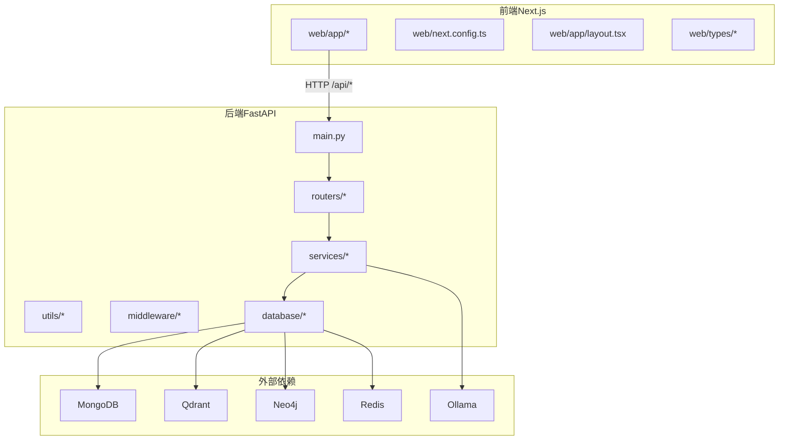
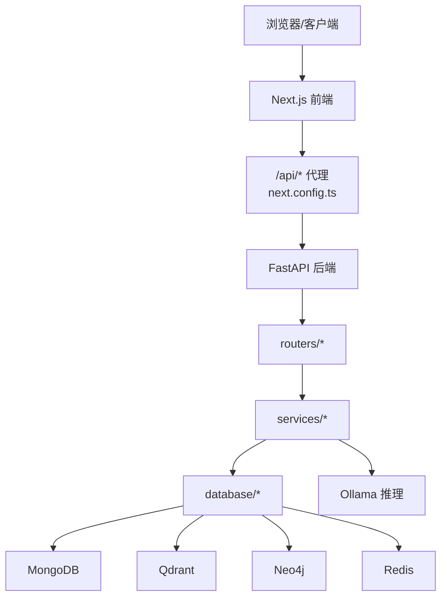
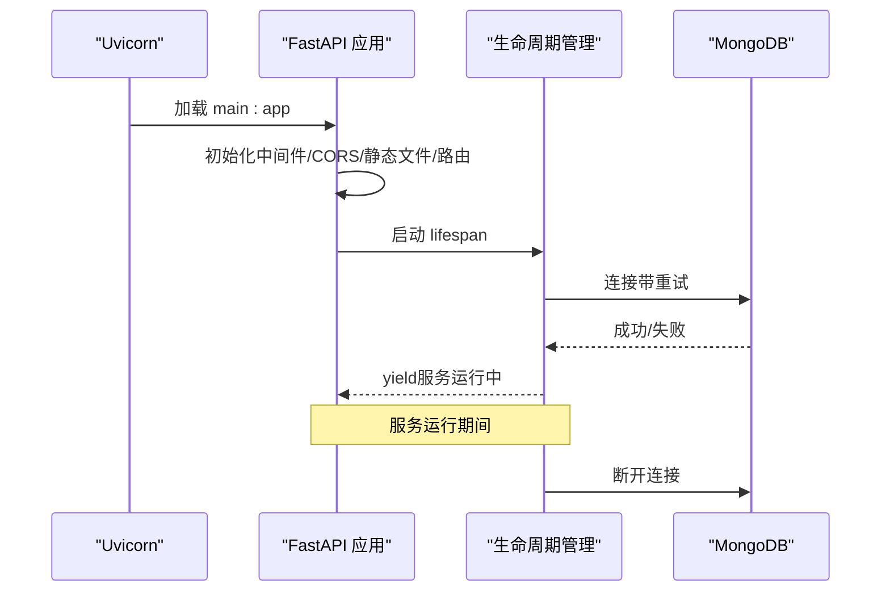
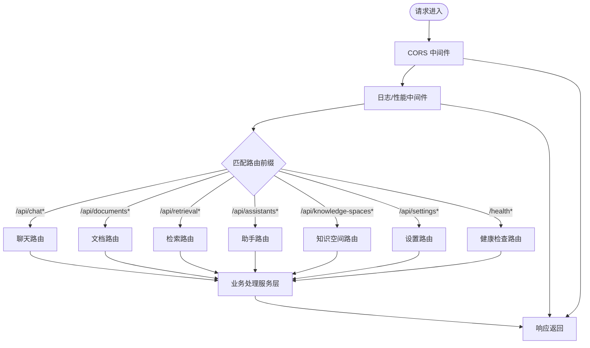
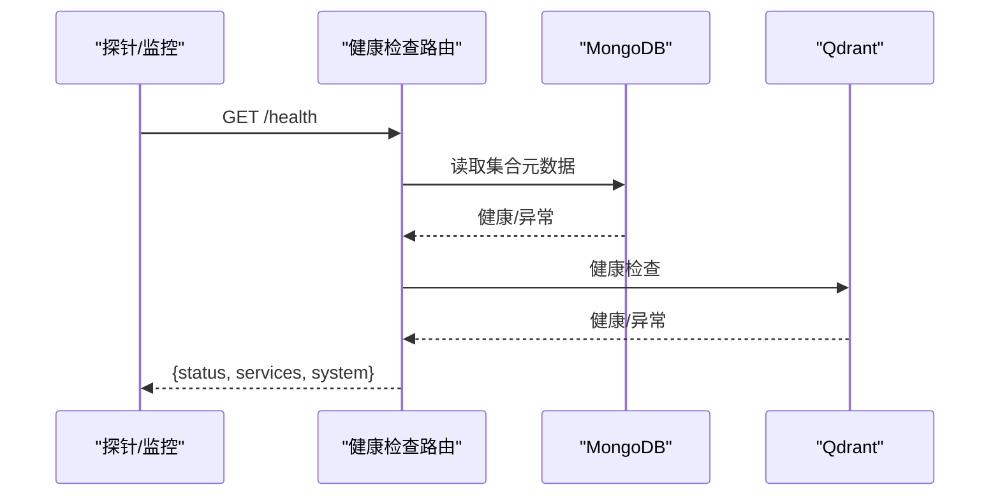
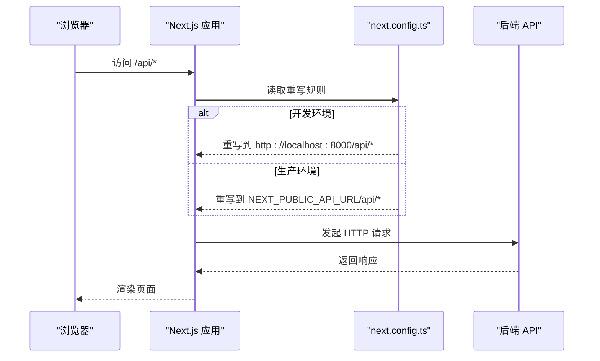
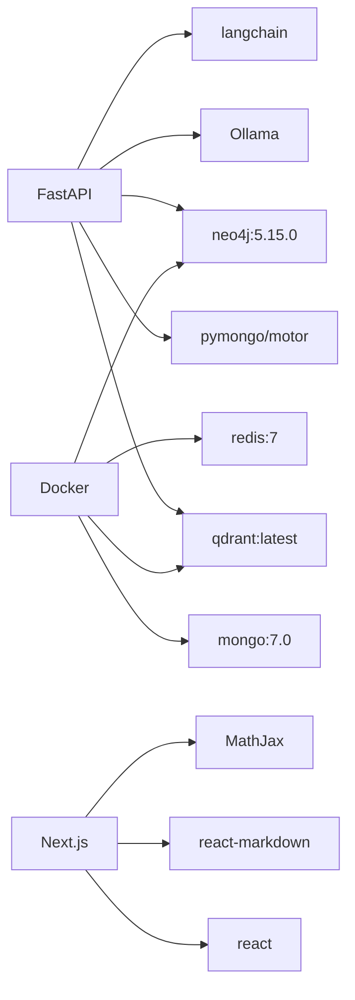
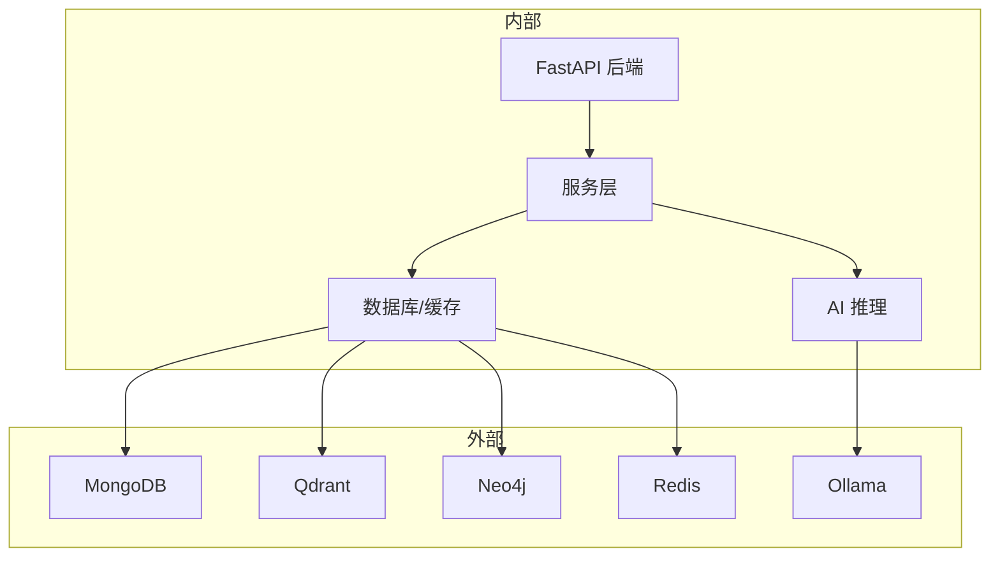

# 整体架构设计

<cite>
**本文引用的文件**
- [main.py](file://main.py)
- [utils/lifespan.py](file://utils/lifespan.py)
- [middleware/logging_middleware.py](file://middleware/logging_middleware.py)
- [routers/chat.py](file://routers/chat.py)
- [routers/health.py](file://routers/health.py)
- [web/next.config.ts](file://web/next.config.ts)
- [web/app/layout.tsx](file://web/app/layout.tsx)
- [web/package.json](file://web/package.json)
- [web/types/assistant.ts](file://web/types/assistant.ts)
- [models/user.py](file://models/user.py)
- [docker-compose.yml](file://docker-compose.yml)
- [Dockerfile](file://Dockerfile)
- [requirements.txt](file://requirements.txt)
- [README.md](file://README.md)
</cite>

## 目录
1. [引言](#引言)
2. [项目结构](#项目结构)
3. [核心组件](#核心组件)
4. [架构总览](#架构总览)
5. [详细组件分析](#详细组件分析)
6. [依赖分析](#依赖分析)
7. [性能考虑](#性能考虑)
8. [故障排查指南](#故障排查指南)
9. [结论](#结论)
10. [附录](#附录)

## 引言
本文件面向 Advanced RAG 系统的整体架构设计，聚焦以下目标：
- 高层架构模式：前后端分离、微服务理念与模块化组织
- FastAPI 后端：应用生命周期、路由组织、中间件策略
- Next.js 前端：SSR/CSR 混合、静态资源与客户端路由
- 技术选型与架构权衡：性能、可扩展性与可维护性
- 系统边界与外部依赖关系

## 项目结构
系统采用前后端分离的模块化组织：
- 后端（FastAPI）：以 routers 为核心组织 API，服务层封装业务逻辑，数据库与工具层提供基础设施
- 前端（Next.js）：App Router 风格，按页面组织，类型与组件解耦
- 运维（Docker/Compose）：容器化与本地依赖服务编排

图表来源
- [main.py:55-98](file://main.py#L55-L98)
- [routers/chat.py:1-80](file://routers/chat.py#L1-L80)
- [docker-compose.yml:1-96](file://docker-compose.yml#L1-L96)

章节来源
- [README.md:55-70](file://README.md#L55-L70)
- [main.py:55-98](file://main.py#L55-L98)
- [web/next.config.ts:12-34](file://web/next.config.ts#L12-L34)

## 核心组件
- 应用入口与生命周期：FastAPI 应用初始化、CORS、静态文件挂载、路由注册、全局异常处理、Uvicorn 启动参数
- 生命周期管理：MongoDB 连接与启动初始化（默认助手、默认知识空间）
- 日志与性能监控：统一请求日志中间件与性能指标记录
- 健康检查：综合健康检查、存活/就绪探针、指标端点
- 前端代理与路由：Next.js 重写规则、开发体验与生产部署

章节来源
- [main.py:1-171](file://main.py#L1-L171)
- [utils/lifespan.py:1-93](file://utils/lifespan.py#L1-L93)
- [middleware/logging_middleware.py:1-52](file://middleware/logging_middleware.py#L1-L52)
- [routers/health.py:1-135](file://routers/health.py#L1-L135)
- [web/next.config.ts:1-48](file://web/next.config.ts#L1-L48)

## 架构总览
系统采用“后端 API + 前端 SPA”的经典前后端分离架构。后端以 FastAPI 提供 REST/SSE 接口，前端通过 App Router 管理页面与路由，并通过重写规则将 /api/* 请求代理到后端。数据库与 AI 服务通过容器化或本地服务提供。

图表来源
- [web/next.config.ts:12-34](file://web/next.config.ts#L12-L34)
- [main.py:90-98](file://main.py#L90-L98)
- [docker-compose.yml:1-96](file://docker-compose.yml#L1-L96)

## 详细组件分析

### 后端应用生命周期与控制流
- 应用初始化：加载环境变量、构建 FastAPI 实例、注册 CORS、日志中间件、静态文件挂载、路由注册、全局异常处理
- 生命周期钩子：启动时尝试连接 MongoDB 并做最小化初始化；关闭时断开连接
- 启动参数：根据环境选择 worker 数量、reload、keep-alive 超时、并发限制

图表来源
- [main.py:129-171](file://main.py#L129-L171)
- [utils/lifespan.py:28-93](file://utils/lifespan.py#L28-L93)

章节来源
- [main.py:20-171](file://main.py#L20-L171)
- [utils/lifespan.py:1-93](file://utils/lifespan.py#L1-L93)

### 路由组织与中间件策略
- 路由注册：按功能模块拆分（聊天、文档、检索、助手、知识空间、设置、健康检查），统一前缀与标签
- 中间件：CORS 允许跨域；请求日志中间件记录性能与慢请求；全局异常处理器统一返回

图表来源
- [main.py:90-98](file://main.py#L90-L98)
- [middleware/logging_middleware.py:8-52](file://middleware/logging_middleware.py#L8-L52)

章节来源
- [main.py:90-98](file://main.py#L90-L98)
- [middleware/logging_middleware.py:1-52](file://middleware/logging_middleware.py#L1-L52)

### 健康检查与可观测性
- 健康检查：聚合 MongoDB、Qdrant、系统资源状态，返回总体健康状态
- 存活/就绪探针：Kubernetes 常用探针，区分存活与就绪
- 指标端点：请求统计与系统指标

图表来源
- [routers/health.py:23-87](file://routers/health.py#L23-L87)

章节来源
- [routers/health.py:1-135](file://routers/health.py#L1-L135)

### 前端架构与路由
- 代理规则：开发环境默认代理到后端；生产环境可配置 NEXT_PUBLIC_API_URL，支持相对路径由反向代理处理
- 大文件上传：实验性配置提升代理客户端最大主体大小
- 布局与主题：RootLayout 提供主题切换与基础元信息

图表来源
- [web/next.config.ts:12-34](file://web/next.config.ts#L12-L34)

章节来源
- [web/next.config.ts:1-48](file://web/next.config.ts#L1-L48)
- [web/app/layout.tsx:1-49](file://web/app/layout.tsx#L1-L49)
- [web/package.json:1-40](file://web/package.json#L1-L40)

### 数据模型与类型约束
- 助手模型：前端类型定义课程助手字段，包含默认值、可选字段与时间戳
- 用户模型：后端 Pydantic 模型，包含邮箱验证、角色与细粒度权限字段

章节来源
- [web/types/assistant.ts:1-45](file://web/types/assistant.ts#L1-L45)
- [models/user.py:1-157](file://models/user.py#L1-L157)

## 依赖分析
- 后端依赖：FastAPI、Uvicorn、MongoDB、Qdrant、Neo4j、Ollama、LangChain、PaddleOCR 等
- 前端依赖：Next.js、React、MathJax、React Markdown 等
- 运维依赖：Docker、docker-compose、健康检查与容器网络

图表来源
- [requirements.txt:1-42](file://requirements.txt#L1-L42)
- [web/package.json:1-40](file://web/package.json#L1-L40)
- [docker-compose.yml:1-96](file://docker-compose.yml#L1-L96)

章节来源
- [requirements.txt:1-42](file://requirements.txt#L1-L42)
- [web/package.json:1-40](file://web/package.json#L1-L40)
- [docker-compose.yml:1-96](file://docker-compose.yml#L1-L96)

## 性能考虑
- 后端
  - 多 worker：生产环境默认使用较高 worker 数量，提高并发吞吐
  - keep-alive 与并发限制：延长长连接超时，限制每 worker 并发连接数
  - SSE 流式输出：客户端断连检测，避免僵尸连接
  - 日志与监控：慢请求与错误请求分级记录，便于定位性能瓶颈
- 前端
  - 代理大文件上传：提升上传上限，适配文档入库场景
  - 开发模式按需加载：减少内存占用与冷启动时间

章节来源
- [main.py:144-171](file://main.py#L144-L171)
- [middleware/logging_middleware.py:33-40](file://middleware/logging_middleware.py#L33-L40)
- [web/next.config.ts:7-10](file://web/next.config.ts#L7-L10)

## 故障排查指南
- 启动阶段
  - MongoDB 连接失败：服务仍可启动，但依赖 MongoDB 的接口不可用；检查 .env 配置与容器连通性
  - 健康检查失败：逐项检查 MongoDB 与 Qdrant 的可用性
- 运行阶段
  - SSE 断连：客户端断开将触发任务取消，属于预期行为
  - 慢请求与错误：查看日志中间件输出与响应头 X-Process-Time
- 前端联调
  - 代理不通：确认 next.config.ts 重写规则与 NEXT_PUBLIC_API_URL
  - 主题与图标：检查 layout.tsx 中的主题注入与 favicon 配置

章节来源
- [utils/lifespan.py:8-25](file://utils/lifespan.py#L8-L25)
- [routers/health.py:32-66](file://routers/health.py#L32-L66)
- [middleware/logging_middleware.py:18-50](file://middleware/logging_middleware.py#L18-L50)
- [web/next.config.ts:12-34](file://web/next.config.ts#L12-L34)
- [web/app/layout.tsx:22-47](file://web/app/layout.tsx#L22-L47)

## 结论
Advanced RAG 采用清晰的前后端分离与模块化架构：后端以 FastAPI 为中心，通过路由与服务层解耦业务，结合生命周期管理与可观测性保障稳定性；前端以 Next.js App Router 为基础，配合代理与类型约束提升开发效率与一致性。技术选型在性能、可扩展性与可维护性之间取得平衡，并通过 Docker/Compose 提供一致的本地与生产运行环境。

## 附录
- 系统边界
  - 内部：后端 API、服务层、数据库与 AI 服务
  - 外部：MongoDB、Qdrant、Neo4j、Redis、Ollama、浏览器/客户端
- 外部依赖关系图

图表来源
- [docker-compose.yml:1-96](file://docker-compose.yml#L1-L96)
- [requirements.txt:1-42](file://requirements.txt#L1-L42)