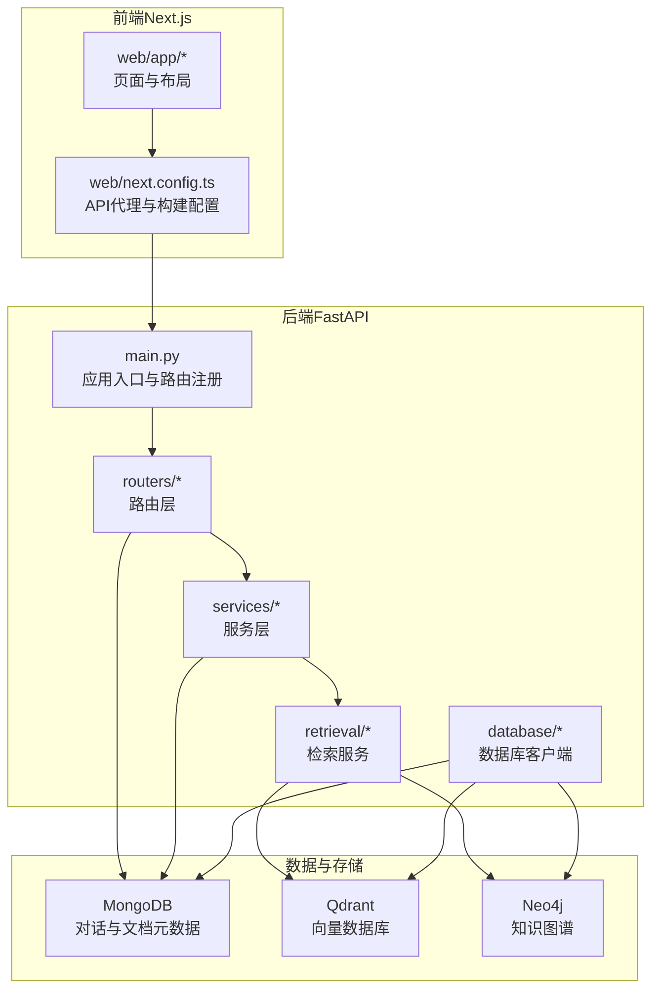
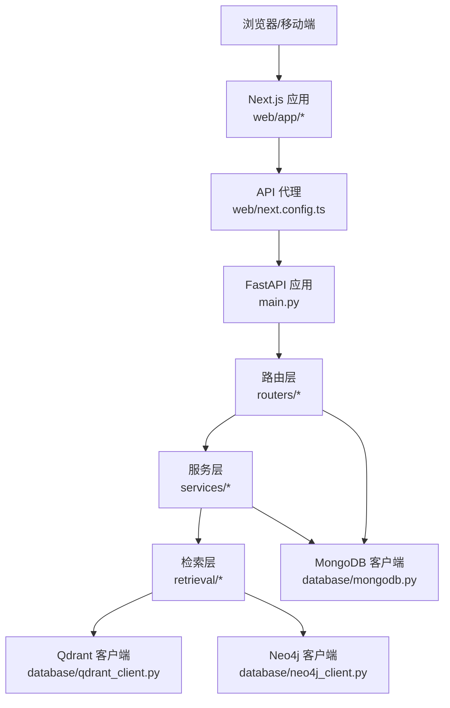
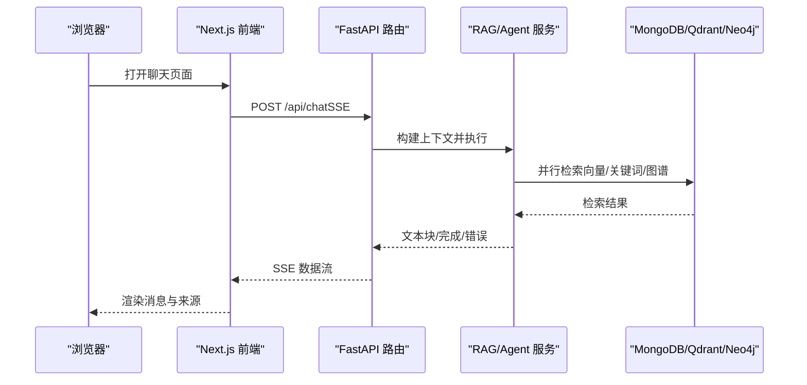
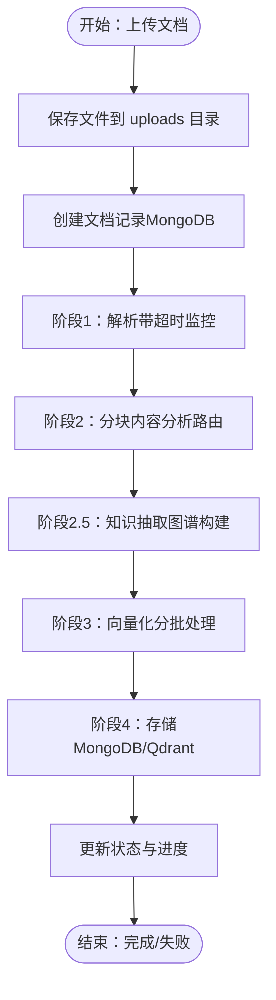
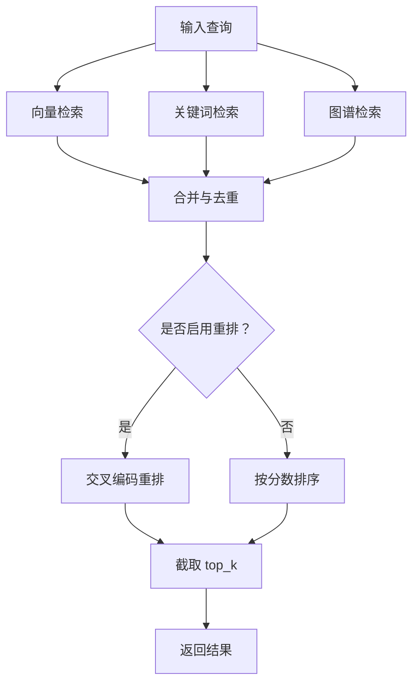
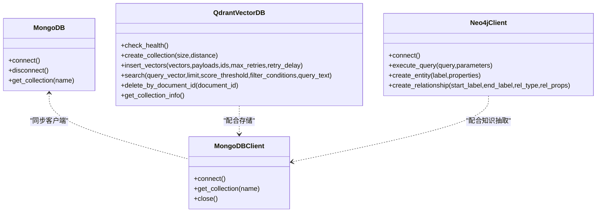
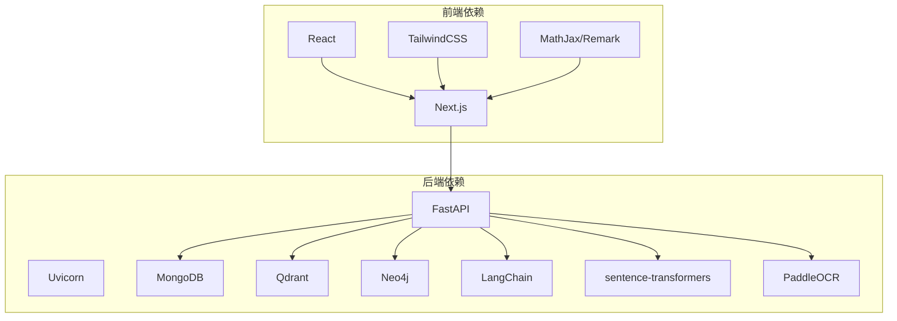

# 整体架构设计

<cite>
**本文引用的文件**
- [main.py](file://main.py)
- [docker-compose.yml](file://docker-compose.yml)
- [requirements.txt](file://requirements.txt)
- [README.md](file://README.md)
- [routers/chat.py](file://routers/chat.py)
- [routers/documents.py](file://routers/documents.py)
- [services/rag_service.py](file://services/rag_service.py)
- [retrieval/rag_retriever.py](file://retrieval/rag_retriever.py)
- [database/mongodb.py](file://database/mongodb.py)
- [database/qdrant_client.py](file://database/qdrant_client.py)
- [database/neo4j_client.py](file://database/neo4j_client.py)
- [web/app/layout.tsx](file://web/app/layout.tsx)
- [web/next.config.ts](file://web/next.config.ts)
- [web/package.json](file://web/package.json)
</cite>

## 目录
1. [简介](#简介)
2. [项目结构](#项目结构)
3. [核心组件](#核心组件)
4. [架构总览](#架构总览)
5. [详细组件分析](#详细组件分析)
6. [依赖关系分析](#依赖关系分析)
7. [性能考虑](#性能考虑)
8. [故障排查指南](#故障排查指南)
9. [结论](#结论)
10. [附录](#附录)

## 简介
advanced-rag 是一个“纯开源高级RAG系统”，采用前后端分离架构：前端使用 Next.js，后端基于 FastAPI，结合多数据库与多检索引擎，提供“AI助手对话（含深度研究）+ 知识库检索/入库”的核心能力。系统强调匿名对话、混合分块、双路索引（向量+知识图谱）、混合检索与重排，以及高并发部署能力。

## 项目结构
系统采用分层与模块化设计：
- 表现层（前端 Next.js）：web/ 目录，负责用户界面与交互，通过 API 代理访问后端。
- API 网关层（FastAPI）：main.py 作为应用入口，注册路由与中间件，提供统一 API。
- 业务逻辑层：routers/（路由层）、services/（服务层）、agents/（代理框架）、retrieval/（检索）、embedding/（向量化）。
- 数据访问层：database/（MongoDB、Qdrant、Neo4j 客户端封装）。
- 工具与中间件：utils/、middleware/。
- 部署与依赖：requirements.txt、docker-compose.yml、web/package.json。

图表来源
- [main.py:55-98](file://main.py#L55-L98)
- [routers/chat.py:17-800](file://routers/chat.py#L17-L800)
- [routers/documents.py:20-800](file://routers/documents.py#L20-L800)
- [database/mongodb.py:92-200](file://database/mongodb.py#L92-L200)
- [database/qdrant_client.py:18-124](file://database/qdrant_client.py#L18-L124)
- [database/neo4j_client.py:6-40](file://database/neo4j_client.py#L6-L40)

章节来源
- [README.md:55-290](file://README.md#L55-L290)
- [web/next.config.ts:12-34](file://web/next.config.ts#L12-L34)

## 核心组件
- 应用入口与路由注册：main.py 负责加载环境变量、注册路由、CORS、静态文件挂载、全局异常处理与 Uvicorn 启动参数。
- 路由层：routers/chat.py 提供对话与深度研究接口；routers/documents.py 提供文档上传与入库流程。
- 服务层：services/rag_service.py 封装检索与生成流程，支持多知识空间集合并行检索。
- 检索层：retrieval/rag_retriever.py 实现向量检索、关键词检索、图谱检索与结果合并。
- 数据访问层：database/mongodb.py（异步/同步）、database/qdrant_client.py、database/neo4j_client.py。
- 前端：web/app/layout.tsx 定义主题与全局样式；web/next.config.ts 配置 API 代理与构建输出。

章节来源
- [main.py:55-157](file://main.py#L55-L157)
- [routers/chat.py:17-800](file://routers/chat.py#L17-L800)
- [routers/documents.py:20-800](file://routers/documents.py#L20-L800)
- [services/rag_service.py:7-248](file://services/rag_service.py#L7-L248)
- [retrieval/rag_retriever.py:22-325](file://retrieval/rag_retriever.py#L22-L325)
- [database/mongodb.py:92-200](file://database/mongodb.py#L92-L200)
- [database/qdrant_client.py:18-124](file://database/qdrant_client.py#L18-L124)
- [database/neo4j_client.py:6-40](file://database/neo4j_client.py#L6-L40)
- [web/app/layout.tsx:16-49](file://web/app/layout.tsx#L16-L49)
- [web/next.config.ts:12-34](file://web/next.config.ts#L12-L34)

## 架构总览
系统采用“前后端分离 + 微服务风格模块化”的分层架构：
- 表现层（前端 Next.js）：通过 API 代理访问后端，支持主题切换、国际化与静态资源。
- API 网关层（FastAPI）：集中处理跨域、日志、静态文件与路由注册，统一暴露 REST API。
- 业务逻辑层：路由层负责参数校验与调用服务层；服务层封装检索与生成；检索层实现混合检索与重排。
- 数据访问层：异步/同步客户端分别服务于不同场景，保证高并发与可靠性。
- 事件驱动与异步：对话与深度研究采用 SSE 流式输出；文档入库采用后台任务与分阶段进度上报；检索采用异步 gather 并行执行。

图表来源
- [web/next.config.ts:12-34](file://web/next.config.ts#L12-L34)
- [main.py:55-98](file://main.py#L55-L98)
- [routers/chat.py:17-800](file://routers/chat.py#L17-L800)
- [routers/documents.py:20-800](file://routers/documents.py#L20-L800)
- [services/rag_service.py:7-248](file://services/rag_service.py#L7-L248)
- [retrieval/rag_retriever.py:22-325](file://retrieval/rag_retriever.py#L22-L325)
- [database/mongodb.py:92-200](file://database/mongodb.py#L92-L200)
- [database/qdrant_client.py:18-124](file://database/qdrant_client.py#L18-L124)
- [database/neo4j_client.py:6-40](file://database/neo4j_client.py#L6-L40)

## 详细组件分析

### 组件A：对话与深度研究（SSE 流式）
- 功能：常规对话与深度研究模式，支持断开检测、流式响应与来源标注。
- 关键流程：
  - 路由层接收请求，构造上下文（助手ID、知识空间、对话历史、生成配置）。
  - 服务层调用代理执行，按需启用 RAG 检索与来源返回。
  - 通过 SSE 将文本块与完成信号发送给前端，支持断开检测。
- 异步与并发：对话与深度研究均采用异步生成与流式输出，减少等待时间。

图表来源
- [routers/chat.py:615-750](file://routers/chat.py#L615-L750)
- [services/rag_service.py:10-192](file://services/rag_service.py#L10-L192)
- [retrieval/rag_retriever.py:69-101](file://retrieval/rag_retriever.py#L69-L101)
- [database/mongodb.py:92-200](file://database/mongodb.py#L92-L200)
- [database/qdrant_client.py:336-414](file://database/qdrant_client.py#L336-L414)
- [database/neo4j_client.py:40-62](file://database/neo4j_client.py#L40-L62)

章节来源
- [routers/chat.py:615-800](file://routers/chat.py#L615-L800)
- [services/rag_service.py:10-192](file://services/rag_service.py#L10-L192)
- [retrieval/rag_retriever.py:69-101](file://retrieval/rag_retriever.py#L69-L101)

### 组件B：文档上传与入库（后台任务与进度上报）
- 功能：支持 PDF/Word/Markdown/TXT 等格式上传，解析、分块、知识抽取、向量化与入库。
- 关键流程：
  - 路由层接收文件与表单参数，创建文档记录并启动后台任务。
  - 后台任务按阶段执行：解析、分块、知识抽取（图谱构建）、向量化、存储到 MongoDB 与 Qdrant。
  - 进度通过文档记录实时更新，前端轮询或监听状态。
- 异步与容错：解析/分块/向量化均采用超时监控与重试；Qdrant 不可用时降级存储到 MongoDB。

图表来源
- [routers/documents.py:723-800](file://routers/documents.py#L723-L800)
- [routers/documents.py:274-722](file://routers/documents.py#L274-L722)
- [database/mongodb.py:315-461](file://database/mongodb.py#L315-L461)
- [database/qdrant_client.py:210-335](file://database/qdrant_client.py#L210-L335)

章节来源
- [routers/documents.py:274-800](file://routers/documents.py#L274-L800)
- [database/mongodb.py:315-461](file://database/mongodb.py#L315-L461)
- [database/qdrant_client.py:210-335](file://database/qdrant_client.py#L210-L335)

### 组件C：检索服务（混合检索与重排）
- 功能：向量检索、关键词检索、图谱检索三路并行，结果合并与重排。
- 关键流程：
  - 异步并行执行三种检索策略，合并去重后按分数排序。
  - 可选重排（Cross-Encoder）提升相关性。
  - 支持按文档ID与集合名称过滤。
- 性能优化：top_k 扩大搜索范围再裁剪；并行 gather；图谱检索按实体展开。

图表来源
- [retrieval/rag_retriever.py:69-101](file://retrieval/rag_retriever.py#L69-L101)
- [retrieval/rag_retriever.py:262-297](file://retrieval/rag_retriever.py#L262-L297)
- [services/rag_service.py:64-83](file://services/rag_service.py#L64-L83)

章节来源
- [retrieval/rag_retriever.py:22-325](file://retrieval/rag_retriever.py#L22-L325)
- [services/rag_service.py:10-192](file://services/rag_service.py#L10-L192)

### 组件D：数据库与客户端封装
- MongoDB：提供异步/同步客户端，连接池参数优化，集合操作封装。
- Qdrant：gRPC 优先连接，自动健康检查与重试，集合维度校验与自动重建。
- Neo4j：连接与查询封装，Cypher 执行与实体/关系创建。

图表来源
- [database/mongodb.py:92-200](file://database/mongodb.py#L92-L200)
- [database/mongodb.py:209-313](file://database/mongodb.py#L209-L313)
- [database/qdrant_client.py:18-124](file://database/qdrant_client.py#L18-L124)
- [database/neo4j_client.py:6-40](file://database/neo4j_client.py#L6-L40)

章节来源
- [database/mongodb.py:92-313](file://database/mongodb.py#L92-L313)
- [database/qdrant_client.py:18-124](file://database/qdrant_client.py#L18-L124)
- [database/neo4j_client.py:6-40](file://database/neo4j_client.py#L6-L40)

## 依赖关系分析
- 后端依赖：FastAPI、Uvicorn、MongoDB（motor/pymongo）、Qdrant、Neo4j、LangChain、sentence-transformers、PaddleOCR 等。
- 前端依赖：Next.js、React、TailwindCSS、MathJax、Remark/Mdast 等。
- 部署：Docker Compose 提供 MongoDB、Qdrant、Neo4j 等服务编排。

图表来源
- [requirements.txt:4-38](file://requirements.txt#L4-L38)
- [web/package.json:12-26](file://web/package.json#L12-L26)
- [docker-compose.yml:1-76](file://docker-compose.yml#L1-L76)

章节来源
- [requirements.txt:4-38](file://requirements.txt#L4-L38)
- [web/package.json:12-26](file://web/package.json#L12-L26)
- [docker-compose.yml:1-76](file://docker-compose.yml#L1-L76)

## 性能考虑
- 连接池与并发：
  - MongoDB：maxPoolSize/minPoolSize/maxIdleTimeMS/serverSelectionTimeoutMS/connectTimeoutMS/socketTimeoutMS 等参数优化高并发。
  - Qdrant：gRPC 优先连接，连接复用，超时与重试策略。
- 异步与并行：
  - 检索：并行执行向量/关键词/图谱检索，gather 合并。
  - 文档入库：分阶段进度上报，分批向量化与批量存储。
- 流式输出：
  - SSE 流式响应，客户端断开检测，降低首字节延迟。
- 部署：
  - 生产环境多 worker、keep-alive 超时延长、并发连接限制，提升吞吐与稳定性。

章节来源
- [database/mongodb.py:122-136](file://database/mongodb.py#L122-L136)
- [database/qdrant_client.py:66-96](file://database/qdrant_client.py#L66-L96)
- [retrieval/rag_retriever.py:83-89](file://retrieval/rag_retriever.py#L83-L89)
- [routers/documents.py:466-491](file://routers/documents.py#L466-L491)
- [main.py:141-157](file://main.py#L141-L157)

## 故障排查指南
- 数据库连接失败：
  - MongoDB：检查 MONGODB_URI/MONGODB_HOST/PORT/USERNAME/PASSWORD/AUTH_SOURCE；查看连接池参数与 ping 校验日志。
  - Qdrant：检查 QDRANT_URL/QDRANT_API_KEY；确认 gRPC 连接与健康检查；集合维度不匹配时自动重建。
  - Neo4j：检查 NEO4J_URI/USER/PASSWORD；容器内 localhost 替换为 host.docker.internal。
- 检索异常：
  - 检查向量维度与集合配置；关键词检索在全局场景下可能性能不佳，建议按文档ID过滤。
- 文档入库失败：
  - 解析/分块/向量化超时监控与重试；Qdrant 不可用时降级存储；查看进度与状态更新。
- 前端代理：
  - NEXT_PUBLIC_API_URL 未配置时，开发环境默认代理到 http://localhost:8000；生产环境使用相对路径由反向代理处理。

章节来源
- [database/mongodb.py:154-184](file://database/mongodb.py#L154-L184)
- [database/qdrant_client.py:97-123](file://database/qdrant_client.py#L97-L123)
- [database/neo4j_client.py:16-33](file://database/neo4j_client.py#L16-L33)
- [retrieval/rag_retriever.py:136-138](file://retrieval/rag_retriever.py#L136-L138)
- [routers/documents.py:153-187](file://routers/documents.py#L153-L187)
- [web/next.config.ts:12-34](file://web/next.config.ts#L12-L34)

## 结论
advanced-rag 通过前后端分离与微服务风格的模块化设计，实现了高性能、可扩展的 RAG 能力。FastAPI 提供稳定的 API 网关，MongoDB/Qdrant/Neo4j 构成多模态数据层，异步与并行策略显著提升了检索与入库性能。SSE 流式输出与 Docker 编排进一步增强了用户体验与部署灵活性。

## 附录
- 系统边界：
  - 外部边界：浏览器/移动端客户端。
  - 内部边界：前端 Next.js、后端 FastAPI、数据库与检索服务。
- 组件交互关系：
  - 前端通过 API 代理访问后端；后端路由层调用服务层；服务层调用检索层与数据库客户端；检索层并行访问 Qdrant 与 Neo4j。
- 数据流向：
  - 对话：前端 -> SSE -> 后端 -> 代理/检索 -> 数据库 -> 前端渲染。
  - 文档：前端 -> 上传 -> 后台任务 -> 解析/分块/抽取/向量化 -> 存储 -> 前端进度展示。