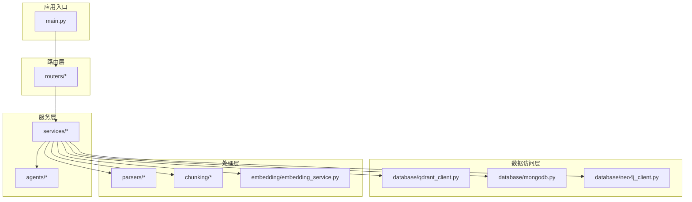
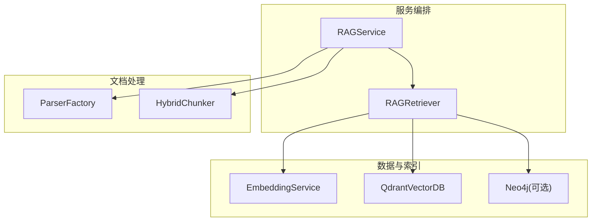
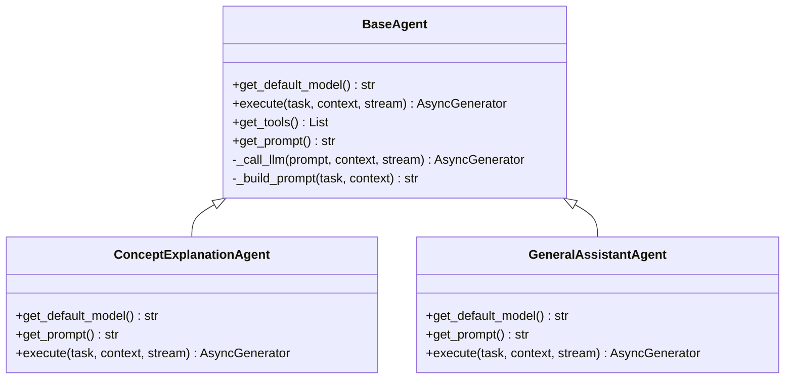
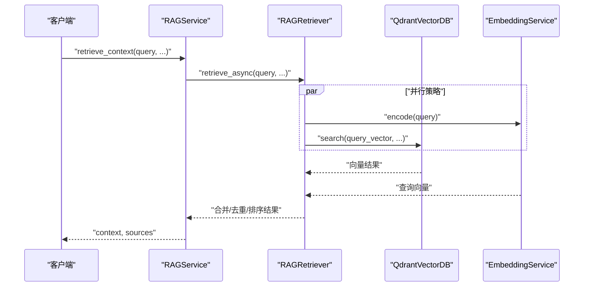
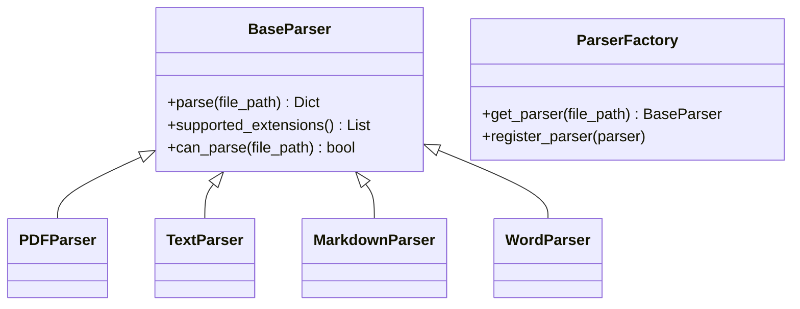
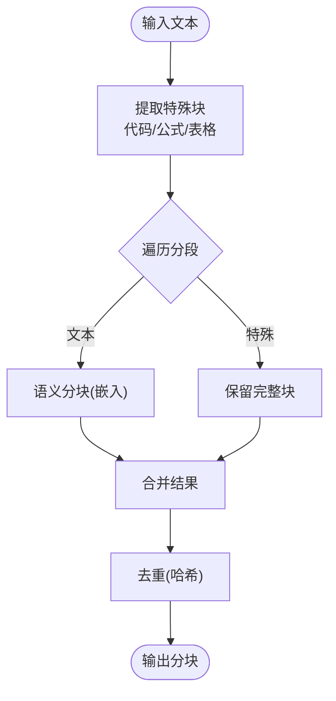
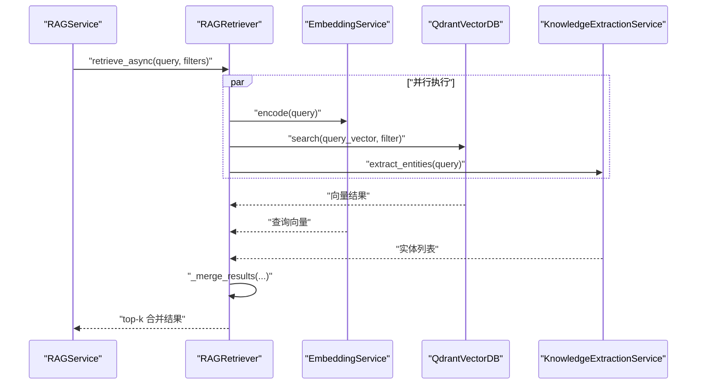
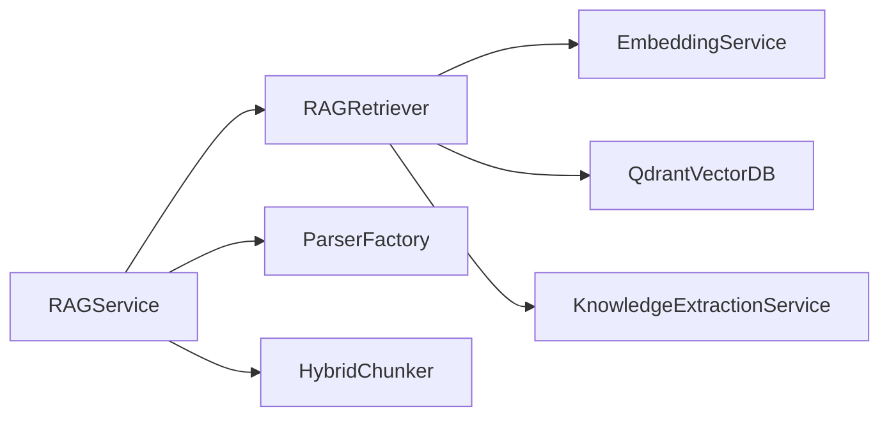

# 模块设计

<cite>
**本文引用的文件**
- [README.md](file://README.md)
- [main.py](file://main.py)
- [agents/base/base_agent.py](file://agents/base/base_agent.py)
- [agents/experts/concept_explanation_agent.py](file://agents/experts/concept_explanation_agent.py)
- [agents/general_assistant/general_assistant_agent.py](file://agents/general_assistant/general_assistant_agent.py)
- [services/rag_service.py](file://services/rag_service.py)
- [retrieval/rag_retriever.py](file://retrieval/rag_retriever.py)
- [chunking/hybrid_chunker.py](file://chunking/hybrid_chunker.py)
- [chunking/langchain/recursive_chunker.py](file://chunking/langchain/recursive_chunker.py)
- [chunking/langchain/semantic_chunker.py](file://chunking/langchain/semantic_chunker.py)
- [parsers/base.py](file://parsers/base.py)
- [parsers/parser_factory.py](file://parsers/parser_factory.py)
- [embedding/embedding_service.py](file://embedding/embedding_service.py)
- [database/qdrant_client.py](file://database/qdrant_client.py)
- [services/knowledge_extraction_service.py](file://services/knowledge_extraction_service.py)
</cite>

## 目录
1. [简介](#简介)
2. [项目结构](#项目结构)
3. [核心组件](#核心组件)
4. [架构总览](#架构总览)
5. [详细组件分析](#详细组件分析)
6. [依赖分析](#依赖分析)
7. [性能考量](#性能考量)
8. [故障排查指南](#故障排查指南)
9. [结论](#结论)
10. [附录](#附录)

## 简介
本文件面向 advanced-rag 系统的模块设计，围绕四大核心模块展开：代理系统模块（AI专家协作）、服务模块（业务逻辑封装）、解析器模块（多格式文档处理）、分块模块（内容分割算法）、检索模块（向量检索实现）。文档阐述各模块的设计理念、职责边界、接口设计原则、错误处理策略、性能优化与可扩展性，并给出模块间依赖关系与通信机制的可视化说明，帮助开发者快速理解与扩展系统。

## 项目结构
系统采用分层与功能域结合的组织方式：
- 路由层：负责HTTP请求接入与参数校验
- 服务层：封装业务流程与跨模块协调
- 数据访问层：数据库与外部向量/图数据库客户端
- 工具与中间件：日志、监控、生命周期管理
- 前端：Next.js 应用，提供聊天与知识空间界面

图表来源
- [main.py:55-98](file://main.py#L55-L98)
- [services/rag_service.py:7-248](file://services/rag_service.py#L7-L248)
- [retrieval/rag_retriever.py:22-325](file://retrieval/rag_retriever.py#L22-L325)
- [chunking/hybrid_chunker.py:9-179](file://chunking/hybrid_chunker.py#L9-L179)
- [parsers/parser_factory.py:10-41](file://parsers/parser_factory.py#L10-L41)
- [embedding/embedding_service.py:8-278](file://embedding/embedding_service.py#L8-L278)
- [database/qdrant_client.py:18-544](file://database/qdrant_client.py#L18-L544)

章节来源
- [README.md:55-70](file://README.md#L55-L70)
- [main.py:55-98](file://main.py#L55-L98)

## 核心组件
- 代理系统模块：统一抽象与执行框架，支持不同专家Agent的协作与流式输出。
- 服务模块：封装RAG检索与回复生成流程，协调检索、去重、来源标注与回退策略。
- 解析器模块：多格式文档解析器工厂与基类，支持扩展新格式。
- 分块模块：混合分块器、递归分块器与语义分块器，兼顾完整性与语义连贯性。
- 检索模块：向量检索、关键词检索、图谱检索与结果合并/重排。

章节来源
- [agents/base/base_agent.py:8-122](file://agents/base/base_agent.py#L8-L122)
- [services/rag_service.py:7-248](file://services/rag_service.py#L7-L248)
- [parsers/parser_factory.py:10-41](file://parsers/parser_factory.py#L10-L41)
- [chunking/hybrid_chunker.py:9-179](file://chunking/hybrid_chunker.py#L9-L179)
- [retrieval/rag_retriever.py:22-325](file://retrieval/rag_retriever.py#L22-L325)

## 架构总览
系统采用“服务编排 + 多模检索”的架构：服务层统一调度解析、分块、向量化、入库与检索；检索层聚合向量、关键词与图谱结果；代理层负责对话与深度研究的多Agent协作。

图表来源
- [services/rag_service.py:10-242](file://services/rag_service.py#L10-L242)
- [retrieval/rag_retriever.py:69-101](file://retrieval/rag_retriever.py#L69-L101)
- [embedding/embedding_service.py:8-278](file://embedding/embedding_service.py#L8-L278)
- [database/qdrant_client.py:18-544](file://database/qdrant_client.py#L18-L544)
- [parsers/parser_factory.py:10-41](file://parsers/parser_factory.py#L10-L41)
- [chunking/hybrid_chunker.py:52-121](file://chunking/hybrid_chunker.py#L52-L121)

## 详细组件分析

### 代理系统模块（AI专家协作）
- 设计理念：统一抽象基类定义Agent通用接口，子类聚焦领域能力；内置提示词与LLM调用封装，支持流式输出与错误上报。
- 职责划分：
  - 基类：模型初始化、提示词构建、LLM调用、工具与提示词扩展点。
  - 专家Agent：如概念解释Agent，专注特定任务与输出格式。
  - 通用助手Agent：封装RAG检索与LLM生成的完整对话流程，支持动态模型选择与回退。
- 接口设计原则：统一的异步执行接口，支持流式增量返回；上下文参数标准化；错误以统一结构返回。
- 可扩展性：新增Agent只需继承基类并实现默认模型与提示词；工具注册与工作流编排可扩展。

图表来源
- [agents/base/base_agent.py:8-122](file://agents/base/base_agent.py#L8-L122)
- [agents/experts/concept_explanation_agent.py:7-70](file://agents/experts/concept_explanation_agent.py#L7-L70)
- [agents/general_assistant/general_assistant_agent.py:9-167](file://agents/general_assistant/general_assistant_agent.py#L9-L167)

章节来源
- [agents/base/base_agent.py:8-122](file://agents/base/base_agent.py#L8-L122)
- [agents/experts/concept_explanation_agent.py:7-70](file://agents/experts/concept_explanation_agent.py#L7-L70)
- [agents/general_assistant/general_assistant_agent.py:9-167](file://agents/general_assistant/general_assistant_agent.py#L9-L167)

### 服务模块（业务逻辑封装）
- 设计理念：以RAGService为核心编排器，负责检索上下文、来源去重与回退策略；对外暴露检索与生成接口。
- 职责划分：
  - 检索上下文：解析集合来源、并行检索、去重与来源标注。
  - 生成回复：在启用上下文时整合检索结果，否则回退到纯LLM生成。
- 错误处理：检索失败时可选择回退策略，保证服务可用性；日志记录与异常上抛策略清晰。
- 性能优化：并行检索多个知识空间集合；对重复chunk进行去重；对文档信息进行批量查询。

图表来源
- [services/rag_service.py:10-191](file://services/rag_service.py#L10-L191)
- [retrieval/rag_retriever.py:69-101](file://retrieval/rag_retriever.py#L69-L101)
- [embedding/embedding_service.py:230-263](file://embedding/embedding_service.py#L230-L263)
- [database/qdrant_client.py:336-413](file://database/qdrant_client.py#L336-L413)

章节来源
- [services/rag_service.py:10-242](file://services/rag_service.py#L10-L242)

### 解析器模块（多格式文档处理）
- 设计理念：通过工厂模式与基类抽象，统一解析接口；支持扩展新格式解析器。
- 职责划分：
  - 基类：定义解析接口与扩展名判定。
  - 工厂：根据文件路径选择合适解析器；提供注册扩展能力。
- 可扩展性：新增格式只需实现基类接口并通过工厂注册。

图表来源
- [parsers/base.py:6-32](file://parsers/base.py#L6-L32)
- [parsers/parser_factory.py:10-41](file://parsers/parser_factory.py#L10-L41)

章节来源
- [parsers/base.py:6-32](file://parsers/base.py#L6-L32)
- [parsers/parser_factory.py:10-41](file://parsers/parser_factory.py#L10-L41)

### 分块模块（内容分割算法）
- 设计理念：混合分块器优先保持代码、公式、表格等特殊块完整性，其余文本采用语义分块；提供递归与语义两种分块策略作为补充。
- 职责划分：
  - 混合分块器：特殊块提取、语义分块、去重与元数据增强。
  - 递归分块器：按分隔符优先级进行结构化切分。
  - 语义分块器：基于嵌入函数的语义连贯性切分。
- 可扩展性：新增分块策略只需实现统一接口；语义分块器可回退到简单分块。

图表来源
- [chunking/hybrid_chunker.py:52-121](file://chunking/hybrid_chunker.py#L52-L121)
- [chunking/langchain/recursive_chunker.py:69-109](file://chunking/langchain/recursive_chunker.py#L69-L109)
- [chunking/langchain/semantic_chunker.py:81-137](file://chunking/langchain/semantic_chunker.py#L81-L137)

章节来源
- [chunking/hybrid_chunker.py:9-179](file://chunking/hybrid_chunker.py#L9-L179)
- [chunking/langchain/recursive_chunker.py:7-110](file://chunking/langchain/recursive_chunker.py#L7-L110)
- [chunking/langchain/semantic_chunker.py:8-139](file://chunking/langchain/semantic_chunker.py#L8-L139)

### 检索模块（向量检索实现）
- 设计理念：混合检索（向量+关键词+图谱）+ 结果合并与重排；提供同步与异步检索接口，兼容运行时环境。
- 职责划分：
  - 向量检索：查询向量化、Qdrant相似度搜索、过滤与阈值控制。
  - 关键词检索：按文档ID过滤的关键词匹配与打分。
  - 图谱检索：实体抽取与一跳邻居查询，构造知识文本。
  - 结果合并与重排：按来源类型与分数融合，可选重排。
- 可扩展性：新增检索策略可在检索器中扩展；重排器可替换或禁用。

图表来源
- [retrieval/rag_retriever.py:69-101](file://retrieval/rag_retriever.py#L69-L101)
- [retrieval/rag_retriever.py:110-260](file://retrieval/rag_retriever.py#L110-L260)
- [services/knowledge_extraction_service.py:104-142](file://services/knowledge_extraction_service.py#L104-L142)
- [embedding/embedding_service.py:230-263](file://embedding/embedding_service.py#L230-L263)
- [database/qdrant_client.py:336-413](file://database/qdrant_client.py#L336-L413)

章节来源
- [retrieval/rag_retriever.py:22-325](file://retrieval/rag_retriever.py#L22-L325)
- [services/knowledge_extraction_service.py:10-211](file://services/knowledge_extraction_service.py#L10-L211)

## 依赖分析
- 模块耦合与内聚：
  - 服务层对检索层与处理层存在强依赖，但通过接口解耦；检索层对嵌入与数据库客户端有直接依赖。
  - 解析器与分块器通过工厂与基类抽象，便于替换与扩展。
- 外部依赖：
  - 向量数据库（Qdrant）、图数据库（Neo4j）、嵌入服务（Ollama）、文档解析库（Unstructured/PaddleOCR等）。
- 循环依赖：
  - 未发现直接循环导入；服务层与检索层通过接口交互，避免循环依赖。

图表来源
- [services/rag_service.py:68-78](file://services/rag_service.py#L68-L78)
- [retrieval/rag_retriever.py:39-40](file://retrieval/rag_retriever.py#L39-L40)
- [embedding/embedding_service.py:8-278](file://embedding/embedding_service.py#L8-L278)
- [database/qdrant_client.py:18-544](file://database/qdrant_client.py#L18-L544)
- [services/knowledge_extraction_service.py:10-211](file://services/knowledge_extraction_service.py#L10-L211)
- [parsers/parser_factory.py:10-41](file://parsers/parser_factory.py#L10-L41)
- [chunking/hybrid_chunker.py:52-121](file://chunking/hybrid_chunker.py#L52-L121)

章节来源
- [services/rag_service.py:68-83](file://services/rag_service.py#L68-L83)
- [retrieval/rag_retriever.py:39-40](file://retrieval/rag_retriever.py#L39-L40)

## 性能考量
- 并行化：服务层对多个知识空间集合检索并行执行；检索层对向量、关键词、图谱检索并行执行。
- 去重与合并：对重复chunk进行去重与按分数排序，减少冗余输出。
- 重排策略：重排器可选禁用，避免在当前环境中引发进程崩溃；未来可按需启用。
- I/O 优化：Qdrant使用gRPC连接与连接复用，降低HTTP开销；插入与搜索具备重试与维度自动适配。
- 文本截断：嵌入服务对过长文本进行截断，避免模型侧错误。
- 模型选择：通用助手Agent支持动态模型选择，按任务复杂度选择合适模型。

章节来源
- [services/rag_service.py:72-82](file://services/rag_service.py#L72-L82)
- [retrieval/rag_retriever.py:83-89](file://retrieval/rag_retriever.py#L83-L89)
- [database/qdrant_client.py:66-96](file://database/qdrant_client.py#L66-L96)
- [embedding/embedding_service.py:250-258](file://embedding/embedding_service.py#L250-L258)
- [agents/general_assistant/general_assistant_agent.py:80-96](file://agents/general_assistant/general_assistant_agent.py#L80-L96)

## 故障排查指南
- 检索失败回退：当检索异常时，RAGService可选择回退到不使用上下文继续生成，保障服务可用。
- 日志与告警：各模块广泛使用日志记录关键路径与异常；Qdrant与嵌入服务具备重试与降级策略。
- 模型与环境：
  - 嵌入模型未找到：检查环境变量与模型名称规范化；必要时手动下载模型。
  - Qdrant连接失败：确认URL、端口与gRPC偏好；本地HTTP连接可能触发安全警告，可切换为127.0.0.1或使用HTTPS。
  - 重排器不可用：sentence-transformers在当前环境被禁用以避免崩溃，可按需启用。
- 图谱检索：若Neo4j未连接，图谱检索将降级为无结果，不影响整体流程。

章节来源
- [services/rag_service.py:220-236](file://services/rag_service.py#L220-L236)
- [database/qdrant_client.py:97-123](file://database/qdrant_client.py#L97-L123)
- [embedding/embedding_service.py:175-228](file://embedding/embedding_service.py#L175-L228)
- [retrieval/rag_retriever.py:12-21](file://retrieval/rag_retriever.py#L12-L21)

## 结论
advanced-rag 通过清晰的模块划分与接口抽象，实现了从文档解析、文本分块、向量化到多模检索与对话生成的完整链路。代理系统模块提供可插拔的专家能力，服务模块承担编排与容错，解析与分块模块兼顾完整性与语义质量，检索模块融合向量、关键词与图谱优势。整体设计强调可扩展性与性能优化，适合在生产环境中持续演进与扩展新能力。

## 附录
- 最佳实践与代码组织规范
  - 接口一致性：所有Agent与处理器均遵循统一的异步接口与返回结构，便于组合与流式输出。
  - 错误处理：异常捕获与日志记录标准化；在服务层提供可控的回退策略。
  - 可扩展性：通过工厂与基类抽象新增解析器与分块策略；在检索层可灵活增减检索策略。
  - 性能优先：并行化、去重、重试与降级策略贯穿核心路径；对长文本与高并发场景进行针对性优化。
  - 配置与环境：通过环境变量集中管理外部服务地址与模型名称，支持多环境部署。