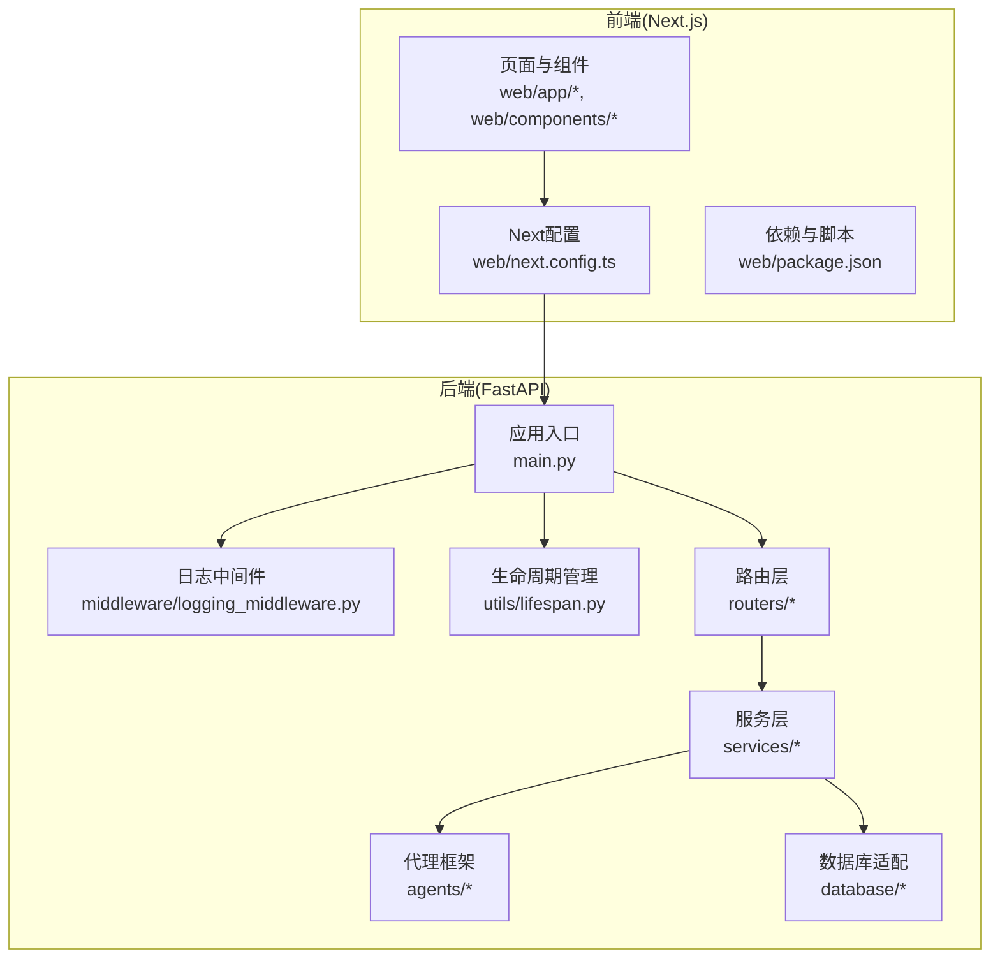
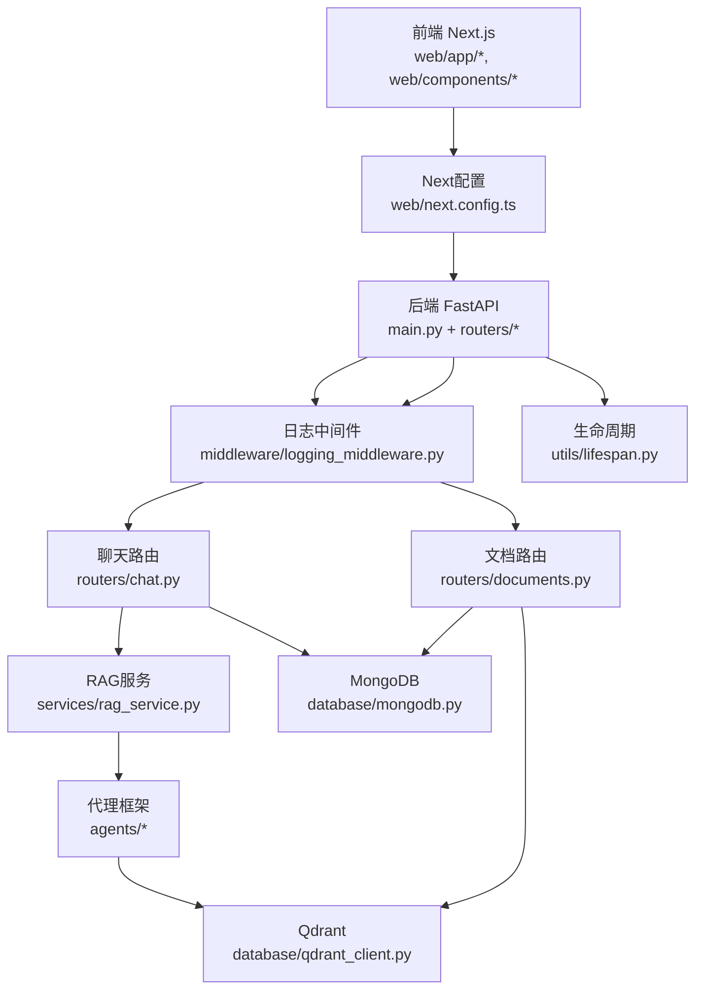
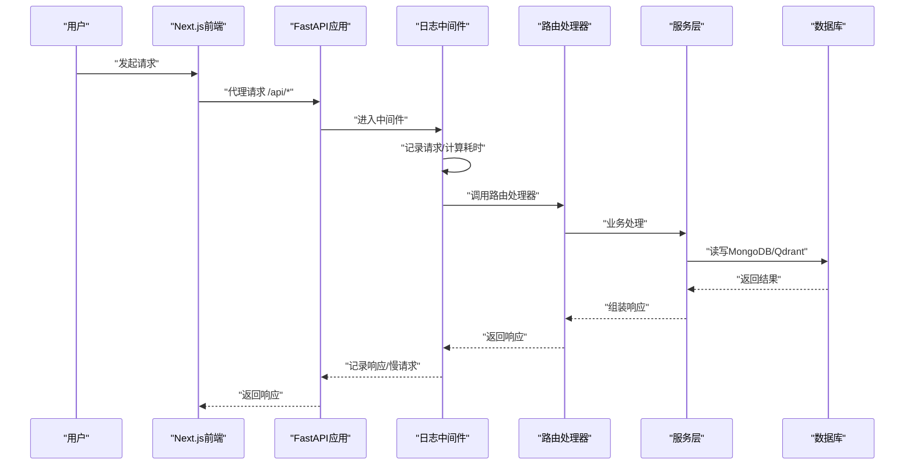
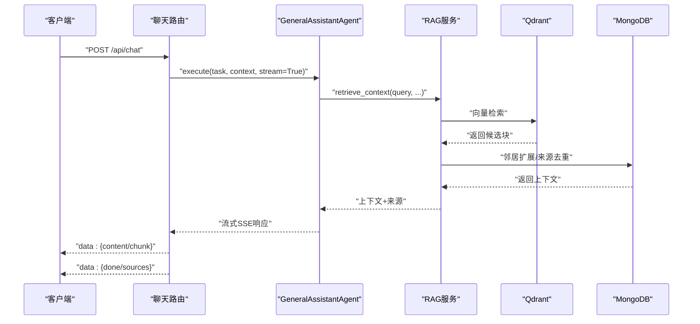
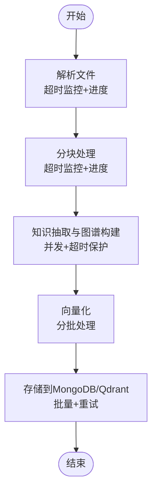
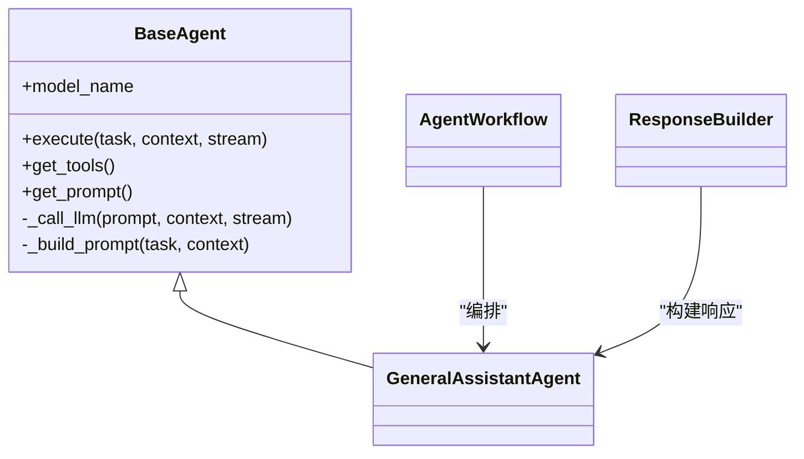
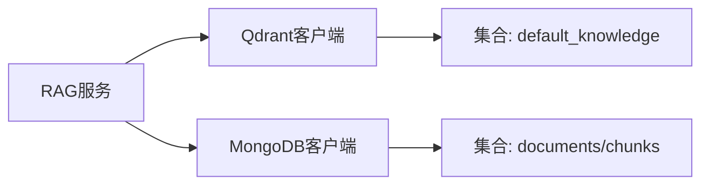
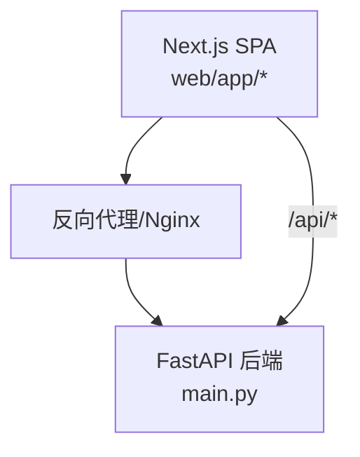
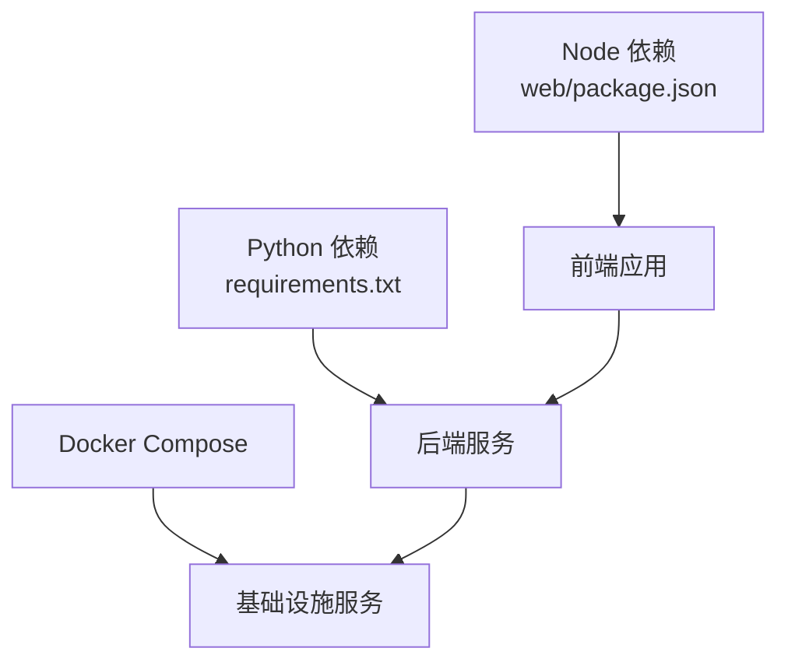

# 系统架构

<cite>
**本文引用的文件**
- [main.py](file://main.py)
- [requirements.txt](file://requirements.txt)
- [docker-compose.yml](file://docker-compose.yml)
- [README.md](file://README.md)
- [routers/chat.py](file://routers/chat.py)
- [routers/documents.py](file://routers/documents.py)
- [services/rag_service.py](file://services/rag_service.py)
- [agents/base/base_agent.py](file://agents/base/base_agent.py)
- [utils/lifespan.py](file://utils/lifespan.py)
- [middleware/logging_middleware.py](file://middleware/logging_middleware.py)
- [database/mongodb.py](file://database/mongodb.py)
- [database/qdrant_client.py](file://database/qdrant_client.py)
- [web/next.config.ts](file://web/next.config.ts)
- [web/package.json](file://web/package.json)
</cite>

## 目录
1. [简介](#简介)
2. [项目结构](#项目结构)
3. [核心组件](#核心组件)
4. [架构总览](#架构总览)
5. [详细组件分析](#详细组件分析)
6. [依赖分析](#依赖分析)
7. [性能考量](#性能考量)
8. [故障排查指南](#故障排查指南)
9. [结论](#结论)
10. [附录](#附录)

## 简介
Advanced RAG系统是一个前后端分离的“纯开源高级RAG系统”，后端基于FastAPI提供RESTful API，前端基于Next.js构建单页应用（SPA）。系统聚焦两大能力：AI助手对话（含深度研究/深度思考）与知识库检索/入库。后端采用多Agent协作框架、混合分块、双路索引（向量+知识图谱）、混合检索与精准重排，支撑高阶RAG引擎。前端通过代理将API请求转发至后端，支持大文件上传与实时流式响应。

## 项目结构
- 后端（FastAPI）
  - 应用入口与中间件：main.py、middleware/logging_middleware.py、utils/lifespan.py
  - 路由层：routers/chat.py、routers/documents.py、routers/retrieval.py、routers/health.py、routers/knowledge_spaces.py、routers/settings.py
  - 服务层：services/rag_service.py、services/ollama_service.py、services/runtime_config.py 等
  - 代理与工作流：agents/base/base_agent.py、agents/workflow/agent_workflow.py、agents/experts/* 等
  - 数据与检索：database/mongodb.py、database/qdrant_client.py、database/neo4j_client.py、retrieval/rag_retriever.py
  - 工具与监控：utils/logger.py、utils/monitoring.py、utils/token_utils.py 等
- 前端（Next.js）
  - 配置：web/next.config.ts、web/package.json
  - 页面与组件：web/app/*、web/components/*
  - 类型定义：web/types/*

图表来源
- [main.py:1-171](file://main.py#L1-L171)
- [middleware/logging_middleware.py:1-52](file://middleware/logging_middleware.py#L1-L52)
- [utils/lifespan.py:1-93](file://utils/lifespan.py#L1-L93)
- [web/next.config.ts:1-48](file://web/next.config.ts#L1-L48)
- [web/package.json:1-40](file://web/package.json#L1-L40)

章节来源
- [README.md:55-70](file://README.md#L55-L70)
- [main.py:55-104](file://main.py#L55-L104)

## 核心组件
- 应用入口与生命周期
  - FastAPI应用初始化、CORS、静态文件挂载、路由注册、全局异常处理、Uvicorn启动参数与并发配置
  - 生命周期管理：启动时连接数据库（失败不阻塞）、初始化默认助手与知识空间、关闭时断开连接
- 中间件与监控
  - 请求日志中间件：记录请求/响应、慢请求与错误、性能监控埋点
- 路由层
  - 聊天路由：常规对话（SSE流式）、深度研究（多Agent协作）、对话历史管理
  - 文档路由：文档上传、解析、分块、向量化、入库（MongoDB/Qdrant）、进度与状态管理
- 服务层
  - RAG服务：动态检索参数、并行检索、邻居扩展、上下文拼接与截断、来源去重与排序
  - Ollama服务：模型列表、流式生成
- 代理与工作流
  - BaseAgent抽象、具体专家Agent、AgentWorkflow编排、ResponseBuilder响应构建
- 数据与检索
  - MongoDB：异步/同步客户端、集合操作、文档与分块仓库
  - Qdrant：gRPC优先连接、健康检查、集合创建与向量插入、查询与删除
- 前端代理
  - Next.js配置：代理到后端API、开发环境容错、大文件上传支持

章节来源
- [main.py:55-171](file://main.py#L55-L171)
- [utils/lifespan.py:28-93](file://utils/lifespan.py#L28-L93)
- [middleware/logging_middleware.py:8-52](file://middleware/logging_middleware.py#L8-L52)
- [routers/chat.py:623-760](file://routers/chat.py#L623-L760)
- [routers/documents.py:274-800](file://routers/documents.py#L274-L800)
- [services/rag_service.py:8-323](file://services/rag_service.py#L8-L323)
- [agents/base/base_agent.py:8-122](file://agents/base/base_agent.py#L8-L122)
- [database/mongodb.py:92-224](file://database/mongodb.py#L92-L224)
- [database/qdrant_client.py:18-139](file://database/qdrant_client.py#L18-L139)
- [web/next.config.ts:12-44](file://web/next.config.ts#L12-L44)

## 架构总览
系统采用前后端分离架构：
- 前端Next.js通过rewrites将/api/*代理到后端（开发环境默认localhost:8000，生产环境可配置NEXT_PUBLIC_API_URL）
- 后端FastAPI提供REST API，内置CORS与静态文件服务，注册聊天/文档/检索/知识空间/设置/健康检查等路由
- 数据层采用MongoDB（对话历史、文档元数据）、Qdrant（向量检索）、Neo4j（知识图谱，可选）、Redis（缓存，可选）
- 检索链路：RAGService动态参数、并行检索、邻居扩展、上下文截断、来源去重与排序

图表来源
- [web/next.config.ts:12-44](file://web/next.config.ts#L12-L44)
- [main.py:90-99](file://main.py#L90-L99)
- [routers/chat.py:623-760](file://routers/chat.py#L623-L760)
- [routers/documents.py:274-800](file://routers/documents.py#L274-L800)
- [services/rag_service.py:34-122](file://services/rag_service.py#L34-L122)
- [database/mongodb.py:92-224](file://database/mongodb.py#L92-L224)
- [database/qdrant_client.py:18-139](file://database/qdrant_client.py#L18-L139)

## 详细组件分析

### 后端应用入口与中间件
- 应用入口
  - 环境变量加载顺序与文件优先级、标题/描述/版本、生命周期注入、CORS配置、静态文件挂载、路由注册、根路径与健康检查端点、全局异常处理、Uvicorn启动参数（端口/主机/worker/keepalive/并发限制）
- 中间件
  - 请求日志中间件：记录请求路径与参数、计算处理时间、慢请求与错误分级、性能监控埋点、响应头注入处理时间
- 生命周期
  - 启动时连接MongoDB（失败不阻塞，记录告警），初始化默认助手与知识空间，关闭时断开连接

图表来源
- [middleware/logging_middleware.py:8-52](file://middleware/logging_middleware.py#L8-L52)
- [main.py:90-127](file://main.py#L90-L127)
- [utils/lifespan.py:28-93](file://utils/lifespan.py#L28-L93)

章节来源
- [main.py:55-171](file://main.py#L55-L171)
- [middleware/logging_middleware.py:8-52](file://middleware/logging_middleware.py#L8-L52)
- [utils/lifespan.py:28-93](file://utils/lifespan.py#L28-L93)

### 聊天与深度研究流程
- 常规对话
  - 通过GeneralAssistantAgent执行，支持RAG检索增强、来源返回、流式SSE输出、客户端断开检测
- 深度研究
  - 通过AgentWorkflow与多个专家Agent协作，返回HTML格式响应，支持断开检测

图表来源
- [routers/chat.py:623-760](file://routers/chat.py#L623-L760)
- [services/rag_service.py:34-122](file://services/rag_service.py#L34-L122)
- [database/qdrant_client.py:336-414](file://database/qdrant_client.py#L336-L414)
- [database/mongodb.py:130-201](file://database/mongodb.py#L130-L201)

章节来源
- [routers/chat.py:623-760](file://routers/chat.py#L623-L760)
- [services/rag_service.py:34-122](file://services/rag_service.py#L34-L122)

### 文档入库与向量化流程
- 文档上传与进度管理
  - 上传文件到本地目录，记录文档元数据，状态与进度更新
- 解析与分块
  - 增强解析模块（带超时监控与进度更新），回退到原有解析器
  - 分块路由选择分块器，带超时与进度监控
- 知识抽取与图谱构建
  - 可配置并发与超时，分批处理，失败不中断主流程
- 向量化与入库
  - 分批向量化，批量写入MongoDB与Qdrant（失败重试与降级）

图表来源
- [routers/documents.py:274-800](file://routers/documents.py#L274-L800)
- [database/mongodb.py:338-668](file://database/mongodb.py#L338-L668)
- [database/qdrant_client.py:210-335](file://database/qdrant_client.py#L210-L335)

章节来源
- [routers/documents.py:274-800](file://routers/documents.py#L274-L800)

### 代理与工作流
- BaseAgent
  - 统一接口：默认模型、执行任务、工具与提示词、LLM调用封装
- 专家Agent与工作流
  - 多Agent协作、响应构建、流式输出与断开检测

图表来源
- [agents/base/base_agent.py:8-122](file://agents/base/base_agent.py#L8-L122)

章节来源
- [agents/base/base_agent.py:8-122](file://agents/base/base_agent.py#L8-L122)

### 数据库与检索
- MongoDB
  - 异步/同步客户端、连接池配置、集合操作、文档与分块仓库
- Qdrant
  - gRPC优先连接、健康检查、集合创建与向量插入、查询与删除、集合信息查询

图表来源
- [services/rag_service.py:100-122](file://services/rag_service.py#L100-L122)
- [database/qdrant_client.py:18-139](file://database/qdrant_client.py#L18-L139)
- [database/mongodb.py:92-224](file://database/mongodb.py#L92-L224)

章节来源
- [services/rag_service.py:100-122](file://services/rag_service.py#L100-L122)
- [database/qdrant_client.py:18-139](file://database/qdrant_client.py#L18-L139)
- [database/mongodb.py:92-224](file://database/mongodb.py#L92-L224)

### 前端代理与部署
- Next.js配置
  - 代理到后端API（开发默认localhost:8000，生产可配置NEXT_PUBLIC_API_URL）
  - standalone输出模式，支持大文件上传
- 依赖与脚本
  - React 19、Next 16、数学渲染与Markdown处理等

图表来源
- [web/next.config.ts:12-44](file://web/next.config.ts#L12-L44)
- [web/package.json:12-38](file://web/package.json#L12-L38)

章节来源
- [web/next.config.ts:12-44](file://web/next.config.ts#L12-L44)
- [web/package.json:12-38](file://web/package.json#L12-L38)

## 依赖分析
- 技术栈与版本
  - 后端：FastAPI、Uvicorn、MongoDB(Motor)、Qdrant、Neo4j、LangChain、sentence-transformers、jieba、PyPDF2/PyMuPDF/python-docx/unstructured、Ollama等
  - 前端：Next.js 16、React 19、MathJax、KaTeX、Remark/Rehype生态
- 第三方依赖与兼容性
  - Python依赖通过requirements.txt声明，前端依赖通过package.json声明
- 基础设施
  - Docker Compose提供MongoDB、Qdrant、Neo4j、Redis（可选）等服务

图表来源
- [requirements.txt:1-42](file://requirements.txt#L1-L42)
- [web/package.json:12-38](file://web/package.json#L12-L38)
- [docker-compose.yml:1-96](file://docker-compose.yml#L1-L96)

章节来源
- [requirements.txt:1-42](file://requirements.txt#L1-L42)
- [web/package.json:12-38](file://web/package.json#L12-L38)
- [docker-compose.yml:1-96](file://docker-compose.yml#L1-L96)

## 性能考量
- 连接池与并发
  - MongoDB连接池参数（maxPoolSize/minPoolSize/maxIdleTimeMS等）与Uvicorn worker/keepalive/并发限制
- 检索与上下文
  - RAG服务动态检索参数、邻居扩展窗口、上下文token预算与截断
- IO与超时
  - 文档解析/分块/向量化超时监控与重试、Qdrant批量插入与维度校验
- 前端代理
  - 大文件上传代理配置与开发环境容错

章节来源
- [database/mongodb.py:122-151](file://database/mongodb.py#L122-L151)
- [main.py:142-171](file://main.py#L142-L171)
- [services/rag_service.py:11-33](file://services/rag_service.py#L11-L33)
- [routers/documents.py:114-188](file://routers/documents.py#L114-L188)
- [database/qdrant_client.py:210-335](file://database/qdrant_client.py#L210-L335)
- [web/next.config.ts:7-10](file://web/next.config.ts#L7-L10)

## 故障排查指南
- 数据库连接
  - MongoDB启动时连接失败不阻塞，首次请求可重试；若仍失败返回503；检查URI/主机/端口/认证与Docker网络
- Qdrant可用性
  - 健康检查失败时降级为仅存储到MongoDB；自动重建集合（维度不匹配）；批量插入失败重试
- 日志与监控
  - 中间件记录慢请求与错误；全局异常处理器统一返回JSON；日志文件位置与级别可在环境变量中配置
- 前端代理
  - 未配置NEXT_PUBLIC_API_URL时，生产环境使用相对路径由反向代理处理；开发环境默认代理到localhost:8000

章节来源
- [utils/lifespan.py:8-26](file://utils/lifespan.py#L8-L26)
- [database/mongodb.py:207-223](file://database/mongodb.py#L207-L223)
- [database/qdrant_client.py:124-139](file://database/qdrant_client.py#L124-L139)
- [middleware/logging_middleware.py:33-50](file://middleware/logging_middleware.py#L33-L50)
- [main.py:110-127](file://main.py#L110-L127)
- [web/next.config.ts:17-24](file://web/next.config.ts#L17-L24)

## 结论
Advanced RAG系统通过前后端分离架构实现了高性能、可扩展的RAG能力。后端以FastAPI为核心，结合MongoDB/Qdrant/Neo4j等多数据源，构建了从文档入库到对话检索的完整链路；前端通过Next.js与代理机制无缝对接后端API。系统在可靠性方面具备生命周期管理、健康检查、降级与重试策略；在性能方面通过连接池、并发与超时控制保障高吞吐与稳定性。部署层面支持Docker Compose与standalone输出，满足开发与生产的多样化需求。

## 附录
- 系统上下文与组件分解图已在前述章节中给出
- 核心API接口（当前版本）：POST /api/chat、POST /api/chat/deep-research、POST /api/chat/conversation-attachment、GET /api/chat/conversation-attachment/{conversation_id}/{file_id}/status、POST /api/documents/upload、GET /api/documents、GET /api/knowledge-spaces、GET /health
- Docker部署：构建镜像与运行容器命令、Compose自动启动依赖服务

章节来源
- [README.md:189-227](file://README.md#L189-L227)
- [README.md:200-227](file://README.md#L200-L227)