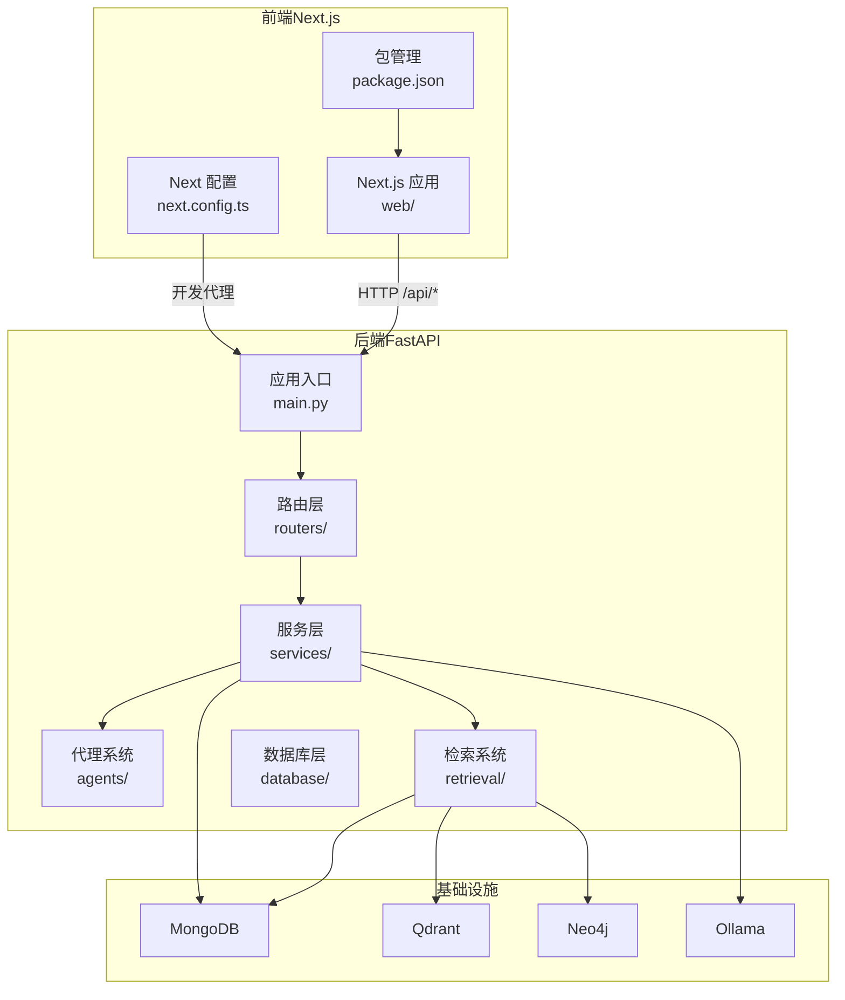
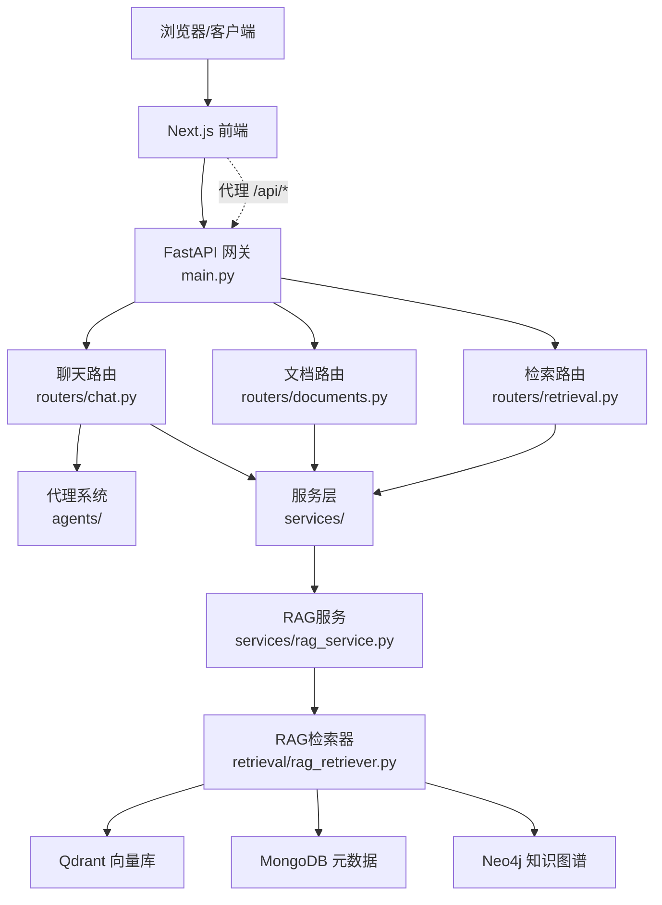
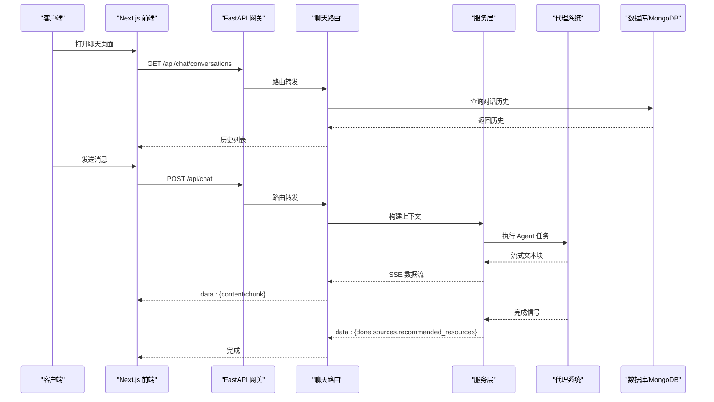
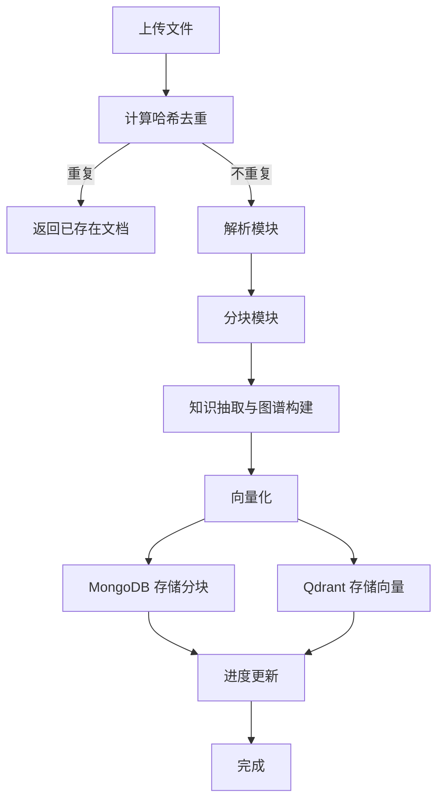
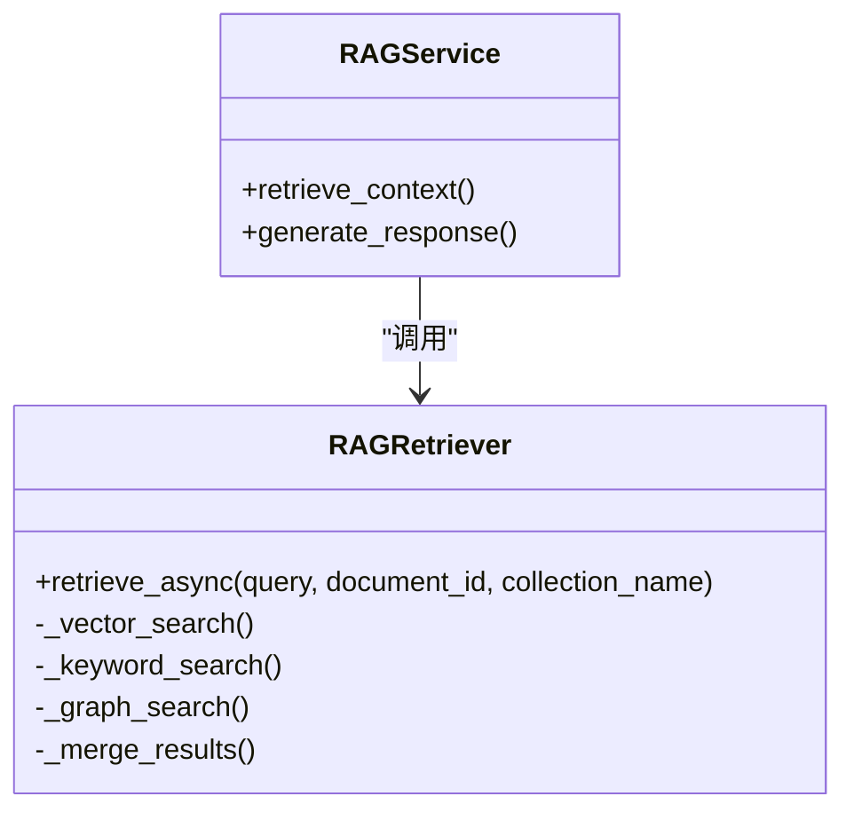
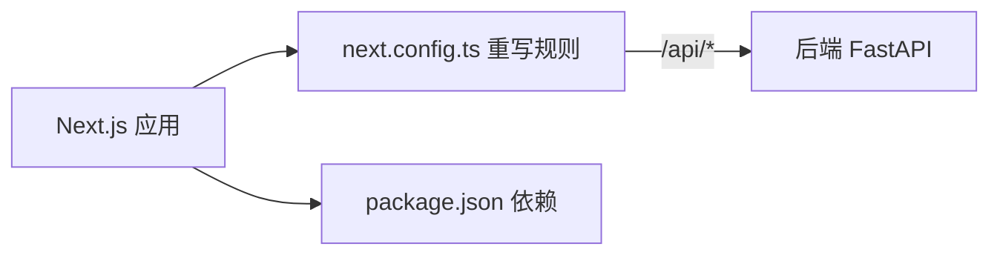
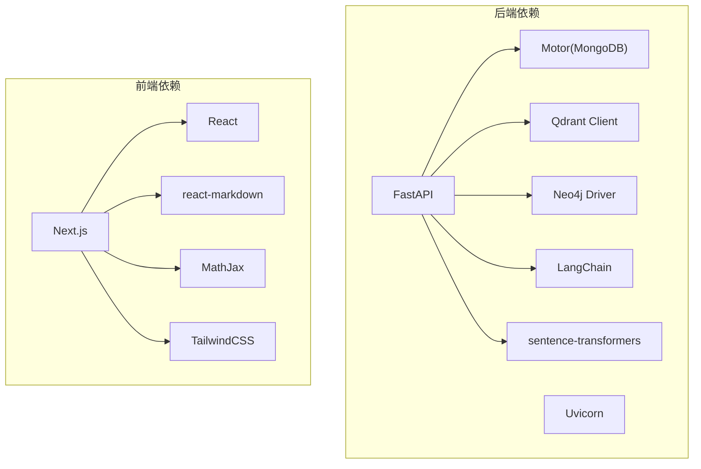

# 系统架构

<cite>
**本文引用的文件**
- [main.py](file://main.py)
- [docker-compose.yml](file://docker-compose.yml)
- [Dockerfile](file://Dockerfile)
- [requirements.txt](file://requirements.txt)
- [README.md](file://README.md)
- [routers/chat.py](file://routers/chat.py)
- [routers/documents.py](file://routers/documents.py)
- [routers/retrieval.py](file://routers/retrieval.py)
- [services/rag_service.py](file://services/rag_service.py)
- [retrieval/rag_retriever.py](file://retrieval/rag_retriever.py)
- [database/mongodb.py](file://database/mongodb.py)
- [database/qdrant_client.py](file://database/qdrant_client.py)
- [agents/base/base_agent.py](file://agents/base/base_agent.py)
- [web/package.json](file://web/package.json)
- [web/next.config.ts](file://web/next.config.ts)
</cite>

## 目录
1. [简介](#简介)
2. [项目结构](#项目结构)
3. [核心组件](#核心组件)
4. [架构总览](#架构总览)
5. [详细组件分析](#详细组件分析)
6. [依赖关系分析](#依赖关系分析)
7. [性能考量](#性能考量)
8. [故障排查指南](#故障排查指南)
9. [结论](#结论)
10. [附录](#附录)

## 简介
advanced-rag 是一个“纯开源高级RAG系统”，采用前后端分离架构，后端基于 FastAPI，前端基于 Next.js。系统聚焦两大能力：AI助手对话（含深度研究/深度思考）与知识库检索/入库。后端采用模块化设计，包含代理系统、文档处理流水线、检索系统、服务层、路由层与数据库层；前端通过 Next.js 提供聊天与知识空间界面，并通过 API 代理访问后端。

## 项目结构
系统采用“后端 FastAPI + 前端 Next.js”的典型前后端分离架构，配合容器化与编排工具实现本地开发与生产部署。



图表来源
- [main.py](file://main.py)
- [routers/chat.py](file://routers/chat.py)
- [routers/documents.py](file://routers/documents.py)
- [routers/retrieval.py](file://routers/retrieval.py)
- [services/rag_service.py](file://services/rag_service.py)
- [retrieval/rag_retriever.py](file://retrieval/rag_retriever.py)
- [database/mongodb.py](file://database/mongodb.py)
- [database/qdrant_client.py](file://database/qdrant_client.py)
- [web/next.config.ts](file://web/next.config.ts)
- [web/package.json](file://web/package.json)

章节来源
- [README.md](file://README.md)
- [main.py](file://main.py)
- [web/next.config.ts](file://web/next.config.ts)

## 核心组件
- 应用入口与中间件
  - FastAPI 应用入口负责环境加载、CORS、静态文件挂载、路由注册与全局异常处理。
- 路由层
  - 聊天路由：支持常规对话与深度研究模式，流式返回，支持客户端断开检测。
  - 文档路由：支持文档上传、解析、分块、向量化、入库与进度反馈。
  - 检索路由：支持查询分析与RAG检索，返回上下文、来源与推荐资源。
- 服务层
  - RAG服务：封装检索逻辑，支持多集合并行检索与上下文构建。
- 检索系统
  - RAGRetriever：混合检索（向量 + 关键词 + 图谱），可扩展重排。
- 数据库层
  - MongoDB：文档与分块元数据存储。
  - Qdrant：向量数据库，支持 gRPC 连接与批量 Upsert。
  - Neo4j：知识图谱（实体关系抽取与检索）。
- 代理系统
  - BaseAgent：抽象基类，统一 LLM 调用与提示词构建。
- 前端
  - Next.js 应用，通过 rewrites 将 /api/* 代理到后端，支持大文件上传与 SSE。

章节来源
- [main.py](file://main.py)
- [routers/chat.py](file://routers/chat.py)
- [routers/documents.py](file://routers/documents.py)
- [routers/retrieval.py](file://routers/retrieval.py)
- [services/rag_service.py](file://services/rag_service.py)
- [retrieval/rag_retriever.py](file://retrieval/rag_retriever.py)
- [database/mongodb.py](file://database/mongodb.py)
- [database/qdrant_client.py](file://database/qdrant_client.py)
- [agents/base/base_agent.py](file://agents/base/base_agent.py)
- [web/next.config.ts](file://web/next.config.ts)

## 架构总览
系统采用“微服务风格的模块化设计”与“事件驱动的异步处理”相结合的方式：
- 微服务风格：路由层、服务层、检索层、数据库层职责清晰，通过 API 接口耦合。
- 事件驱动：文档入库采用后台任务与进度回调；对话采用 SSE 流式输出；检索采用异步 gather 并行。
- 前后端分离：前端 Next.js 通过代理访问后端 API，支持跨域与大文件上传。



图表来源
- [main.py](file://main.py)
- [routers/chat.py](file://routers/chat.py)
- [routers/documents.py](file://routers/documents.py)
- [routers/retrieval.py](file://routers/retrieval.py)
- [services/rag_service.py](file://services/rag_service.py)
- [retrieval/rag_retriever.py](file://retrieval/rag_retriever.py)
- [database/mongodb.py](file://database/mongodb.py)
- [database/qdrant_client.py](file://database/qdrant_client.py)
- [web/next.config.ts](file://web/next.config.ts)

## 详细组件分析

### 聊天与深度研究（Agent 工作流）
- 常规对话：通过 GeneralAssistantAgent 执行，支持 RAG 增强与来源返回，流式输出（SSE）。
- 深度研究：通过 AgentWorkflow 与 ResponseBuilder 协调多个专家 Agent，生成 HTML 结果。
- 断开检测：在流式生成过程中定期检查客户端连接状态，及时停止输出。



图表来源
- [routers/chat.py](file://routers/chat.py)
- [agents/base/base_agent.py](file://agents/base/base_agent.py)
- [database/mongodb.py](file://database/mongodb.py)

章节来源
- [routers/chat.py](file://routers/chat.py)
- [agents/base/base_agent.py](file://agents/base/base_agent.py)

### 文档处理流水线（入库与检索）
- 上传与去重：计算文件哈希，避免重复入库。
- 解析：增强解析模块优先，失败回退到传统解析器；PDF 支持进度展示。
- 分块：内容分析路由器选择合适分块器，支持超时监控与进度上报。
- 知识抽取与图谱：异步并发构建实体关系图谱，限制并发避免 Ollama 过载。
- 向量化：分批向量化，支持进度上报。
- 存储：MongoDB 存储分块元数据，Qdrant 存储向量（可用性检测与重试）。



图表来源
- [routers/documents.py](file://routers/documents.py)
- [database/mongodb.py](file://database/mongodb.py)
- [database/qdrant_client.py](file://database/qdrant_client.py)

章节来源
- [routers/documents.py](file://routers/documents.py)
- [database/mongodb.py](file://database/mongodb.py)
- [database/qdrant_client.py](file://database/qdrant_client.py)

### 检索系统（混合检索与重排）
- 检索策略：向量检索 + 关键词检索 + 图谱检索（可扩展重排）。
- 并行检索：多策略并行执行，结果合并与去重。
- 上下文构建：聚合来源文档，去重保留最高分块，构建上下文与来源列表。



图表来源
- [retrieval/rag_retriever.py](file://retrieval/rag_retriever.py)
- [services/rag_service.py](file://services/rag_service.py)

章节来源
- [retrieval/rag_retriever.py](file://retrieval/rag_retriever.py)
- [services/rag_service.py](file://services/rag_service.py)
- [routers/retrieval.py](file://routers/retrieval.py)

### 数据存储层（MongoDB/Qdrant/Neo4j）
- MongoDB：存储文档元数据与分块，提供连接池优化与延迟初始化。
- Qdrant：向量数据库，优先使用 gRPC 连接，支持批量 Upsert 与重试。
- Neo4j：知识图谱，实体抽取与邻接检索，支持过滤与路径拼接。

```mermaid
graph LR
MG["MongoDB"] <- --> |"元数据/分块"| APP["应用"]
QD["Qdrant"] <- --> |"向量检索"| APP
NG["Neo4j"] <- --> |"实体/关系"| APP
```

图表来源
- [database/mongodb.py](file://database/mongodb.py)
- [database/qdrant_client.py](file://database/qdrant_client.py)

章节来源
- [database/mongodb.py](file://database/mongodb.py)
- [database/qdrant_client.py](file://database/qdrant_client.py)

### 前端（Next.js）与 API 代理
- 代理配置：开发环境默认代理到后端 8000 端口，生产环境支持 NEXT_PUBLIC_API_URL 动态配置。
- 大文件上传：通过 experimental.proxyClientMaxBodySize 支持 200MB。
- 依赖与构建：Next 16、React 19、TailwindCSS、Biome 等生态。



图表来源
- [web/next.config.ts](file://web/next.config.ts)
- [web/package.json](file://web/package.json)

章节来源
- [web/next.config.ts](file://web/next.config.ts)
- [web/package.json](file://web/package.json)

## 依赖关系分析
- 后端依赖
  - FastAPI、Uvicorn、MongoDB（Motor）、Qdrant 客户端、Neo4j 驱动、LangChain、sentence-transformers 等。
- 前端依赖
  - Next.js、React、react-markdown、MathJax、TailwindCSS 等。
- 基础设施
  - Docker Compose 提供 MongoDB、Qdrant、Neo4j 的本地开发环境。



图表来源
- [requirements.txt](file://requirements.txt)
- [web/package.json](file://web/package.json)

章节来源
- [requirements.txt](file://requirements.txt)
- [web/package.json](file://web/package.json)

## 性能考量
- 并发与连接池
  - MongoDB：maxPoolSize/minPoolSize/maxIdleTimeMS 等参数优化高并发。
  - Qdrant：优先 gRPC 连接，批量 Upsert 与指数退避重试。
- 异步与并行
  - 检索：多策略并行检索，gather 合并结果。
  - 文档处理：分块与向量化分批处理，知识抽取限制并发。
- 流式输出
  - 对话与深度研究采用 SSE，客户端断开检测，降低等待时间。
- 前端大文件
  - Next.js 代理配置支持大文件上传，提升用户体验。

章节来源
- [database/mongodb.py](file://database/mongodb.py)
- [database/qdrant_client.py](file://database/qdrant_client.py)
- [retrieval/rag_retriever.py](file://retrieval/rag_retriever.py)
- [routers/documents.py](file://routers/documents.py)
- [routers/chat.py](file://routers/chat.py)
- [web/next.config.ts](file://web/next.config.ts)

## 故障排查指南
- 健康检查
  - 后端根路径与健康检查端点可用于服务可用性验证。
- 日志与中间件
  - 请求日志中间件与全局异常处理器有助于定位问题。
- 数据库连接
  - MongoDB 连接失败会抛出明确错误，检查 URI、认证与网络可达性。
- Qdrant 可用性
  - 插入失败时自动重建集合或重试，若持续失败检查 gRPC 连接与超时配置。
- 前端代理
  - 开发环境未配置 NEXT_PUBLIC_API_URL 时，使用默认代理到 8000 端口。

章节来源
- [main.py](file://main.py)
- [database/mongodb.py](file://database/mongodb.py)
- [database/qdrant_client.py](file://database/qdrant_client.py)
- [web/next.config.ts](file://web/next.config.ts)

## 结论
advanced-rag 通过前后端分离与模块化设计，实现了高性能、可扩展的 RAG 能力。后端采用异步与并行策略，结合多数据库与多检索策略，满足复杂场景需求；前端通过代理与大文件支持，提供良好的用户体验。系统具备良好的可维护性与扩展性，适合进一步演进为更复杂的多助手、多知识空间与企业级部署形态。

## 附录
- 部署拓扑
  - 开发：Docker Compose 启动 MongoDB、Qdrant、Neo4j；FastAPI 与 Next.js 本地运行。
  - 生产：Dockerfile 构建镜像，Uvicorn 多 worker 运行；前端通过反向代理暴露 API。
- 基础设施要求
  - Python 3.9+、MongoDB 4.4+、Qdrant（Docker）、Neo4j（可选）、Ollama（本地推理）。
- 架构演进路线图
  - 引入消息队列与事件总线，实现更细粒度的异步解耦；
  - 增加鉴权与配额控制，支持多租户与后台管理；
  - 优化检索重排与图谱构建算法，提升召回质量；
  - 前端引入状态管理与缓存策略，提升交互性能。

章节来源
- [docker-compose.yml](file://docker-compose.yml)
- [Dockerfile](file://Dockerfile)
- [README.md](file://README.md)