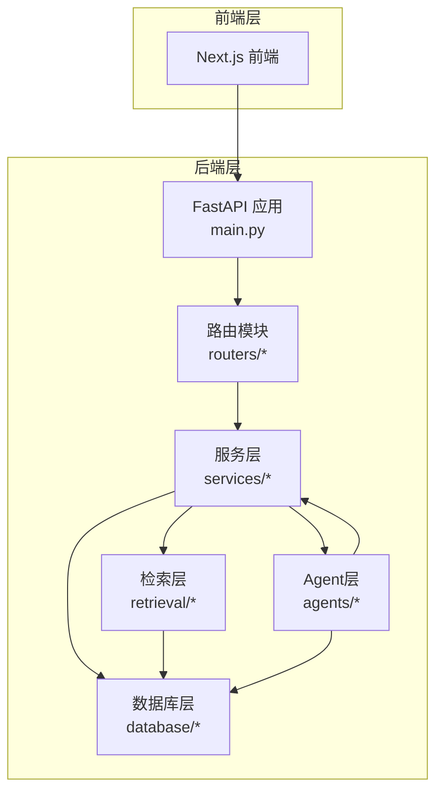
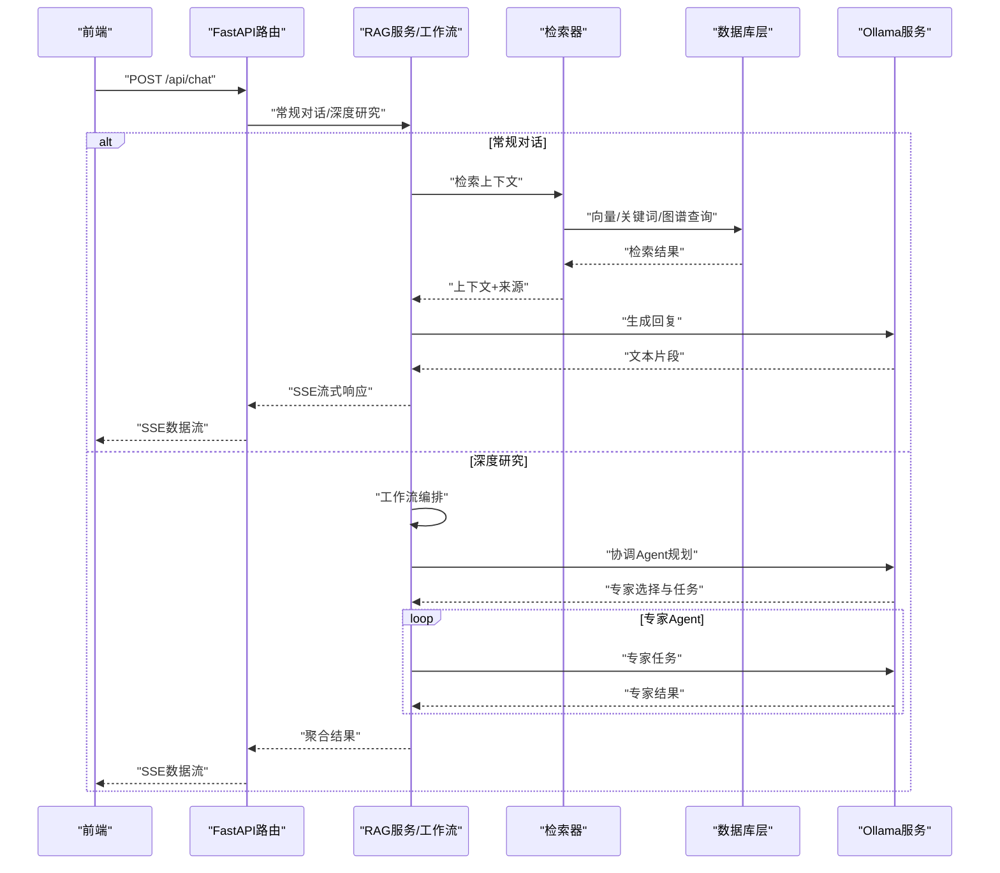
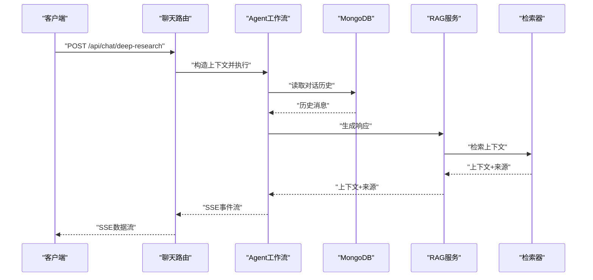
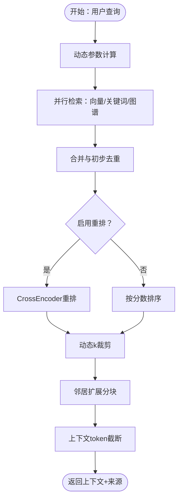
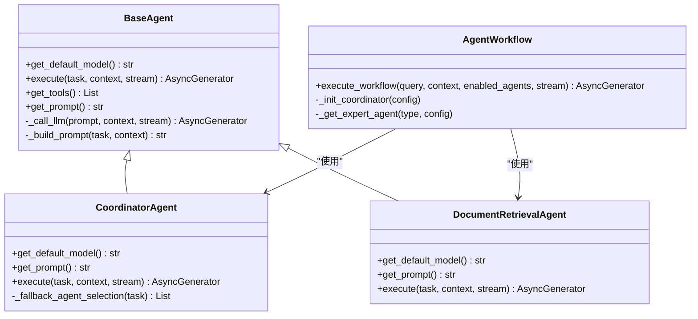
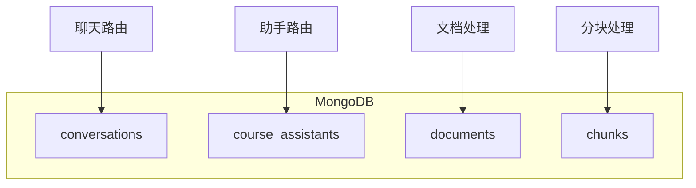
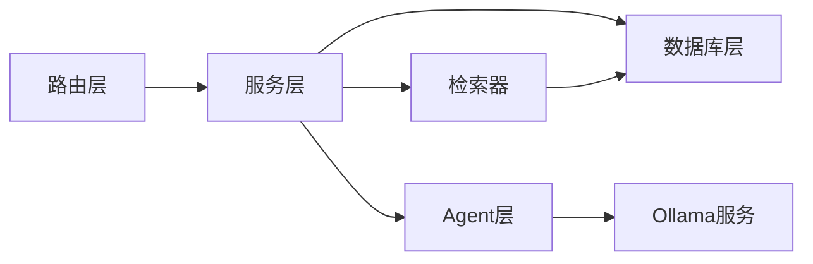

# 组件交互关系

<cite>
**本文引用的文件**
- [main.py](file://main.py)
- [routers/chat.py](file://routers/chat.py)
- [routers/assistants.py](file://routers/assistants.py)
- [services/rag_service.py](file://services/rag_service.py)
- [retrieval/rag_retriever.py](file://retrieval/rag_retriever.py)
- [agents/base/base_agent.py](file://agents/base/base_agent.py)
- [agents/coordinator/coordinator_agent.py](file://agents/coordinator/coordinator_agent.py)
- [agents/workflow/agent_workflow.py](file://agents/workflow/agent_workflow.py)
- [agents/experts/document_retrieval_agent.py](file://agents/experts/document_retrieval_agent.py)
- [database/mongodb.py](file://database/mongodb.py)
- [services/ollama_service.py](file://services/ollama_service.py)
</cite>

## 目录
1. [简介](#简介)
2. [项目结构](#项目结构)
3. [核心组件](#核心组件)
4. [架构总览](#架构总览)
5. [详细组件分析](#详细组件分析)
6. [依赖关系分析](#依赖关系分析)
7. [性能考量](#性能考量)
8. [故障排查指南](#故障排查指南)
9. [结论](#结论)

## 简介
本文件面向Advanced RAG系统，聚焦组件交互关系与数据流，覆盖前端组件、后端服务、Agent系统与数据库层的协作模式。文档解释从用户请求到最终响应的完整链路，剖析API调用链、Agent内部协作机制（协调Agent与专家Agent）、缓存策略与状态同步，并提供时序图与调用关系图，帮助开发者与运维人员快速理解系统行为与优化方向。

## 项目结构
系统采用分层架构：
- Web入口与路由层：FastAPI应用注册路由，提供聊天、文档、检索、助手、知识空间、设置、健康检查等接口。
- 业务服务层：RAG服务、检索器、嵌入服务、提示词链、模型服务等。
- Agent协作层：基类Agent、协调Agent、专家Agent、工作流编排器。
- 数据访问层：MongoDB、Qdrant、Neo4j客户端封装。
- 前端层：Next.js应用，通过REST接口与后端交互。

图表来源
- [main.py:1-171](file://main.py#L1-L171)
- [routers/chat.py:1-800](file://routers/chat.py#L1-L800)
- [services/rag_service.py:1-323](file://services/rag_service.py#L1-L323)
- [retrieval/rag_retriever.py:1-393](file://retrieval/rag_retriever.py#L1-L393)
- [agents/workflow/agent_workflow.py:1-388](file://agents/workflow/agent_workflow.py#L1-L388)
- [database/mongodb.py:1-800](file://database/mongodb.py#L1-L800)

章节来源
- [main.py:1-171](file://main.py#L1-L171)
- [routers/chat.py:1-800](file://routers/chat.py#L1-L800)
- [database/mongodb.py:1-800](file://database/mongodb.py#L1-L800)

## 核心组件
- FastAPI应用与路由
  - 应用入口负责CORS、静态文件挂载、中间件、路由注册与异常处理。
  - 路由模块提供聊天、文档、检索、助手、知识空间、设置、健康检查等接口。
- 服务层
  - RAG服务：封装检索与上下文构建，支持动态参数与邻居扩展。
  - 检索器：向量检索、关键词检索、图谱检索与重排。
  - Ollama服务：封装模型调用，支持流式与非流式生成，构建提示词链。
- Agent层
  - 基类Agent：统一接口与工具调用。
  - 协调Agent：分析问题、选择专家Agent并规划任务。
  - 专家Agent：如文档检索专家，调用RAG服务并总结结果。
  - 工作流编排：管理多Agent协作、状态上报与结果聚合。
- 数据库层
  - MongoDB：异步/同步客户端、集合访问、文档与分块仓库。
  - Qdrant/Neo4j：向量检索与图谱检索支撑。

章节来源
- [main.py:1-171](file://main.py#L1-L171)
- [services/rag_service.py:1-323](file://services/rag_service.py#L1-L323)
- [retrieval/rag_retriever.py:1-393](file://retrieval/rag_retriever.py#L1-L393)
- [agents/base/base_agent.py:1-122](file://agents/base/base_agent.py#L1-L122)
- [agents/coordinator/coordinator_agent.py:1-252](file://agents/coordinator/coordinator_agent.py#L1-L252)
- [agents/workflow/agent_workflow.py:1-388](file://agents/workflow/agent_workflow.py#L1-L388)
- [agents/experts/document_retrieval_agent.py:1-79](file://agents/experts/document_retrieval_agent.py#L1-L79)
- [database/mongodb.py:1-800](file://database/mongodb.py#L1-L800)
- [services/ollama_service.py:1-674](file://services/ollama_service.py#L1-L674)

## 架构总览
系统采用“请求驱动”的流水线：前端发起REST请求，路由层解析参数并调用服务层；服务层根据模式选择RAG或深度研究流程；RAG流程通过检索器与数据库检索上下文，再由Ollama服务生成回复；深度研究流程通过工作流编排协调多个专家Agent，逐步产出综合结果。

图表来源
- [routers/chat.py:623-760](file://routers/chat.py#L623-L760)
- [services/rag_service.py:34-126](file://services/rag_service.py#L34-L126)
- [retrieval/rag_retriever.py:89-137](file://retrieval/rag_retriever.py#L89-L137)
- [agents/workflow/agent_workflow.py:106-336](file://agents/workflow/agent_workflow.py#L106-L336)
- [services/ollama_service.py:50-92](file://services/ollama_service.py#L50-L92)

## 详细组件分析

### 路由与API调用链
- 聊天路由
  - 常规对话：支持RAG检索增强、来源返回、流式SSE输出、断连检测。
  - 深度研究：工作流编排多个专家Agent，返回结构化结果。
- 助手路由：提供助手列表与详情（只读）。
- 数据持久化：对话历史存储于MongoDB，支持创建、查询、更新、删除与消息增删改。

图表来源
- [routers/chat.py:762-800](file://routers/chat.py#L762-L800)
- [agents/workflow/agent_workflow.py:106-336](file://agents/workflow/agent_workflow.py#L106-L336)
- [services/rag_service.py:34-126](file://services/rag_service.py#L34-L126)
- [retrieval/rag_retriever.py:89-137](file://retrieval/rag_retriever.py#L89-L137)

章节来源
- [routers/chat.py:623-760](file://routers/chat.py#L623-L760)
- [routers/chat.py:762-800](file://routers/chat.py#L762-L800)
- [routers/assistants.py:1-127](file://routers/assistants.py#L1-L127)

### RAG服务与检索器
- RAG服务
  - 动态检索参数：根据查询特征调整预取与最终返回数量。
  - 多集合检索：并行检索多个知识空间集合，合并去重。
  - 邻居扩展：对命中文本拉取前后窗口，提升上下文完整性。
  - 上下文截断：基于token预算控制上下文长度。
- 检索器
  - 多策略并行：向量检索、关键词检索、图谱检索。
  - 重排：CrossEncoder重排，动态k裁剪。
  - 异步接口：支持异步检索与结果合并。

图表来源
- [services/rag_service.py:11-32](file://services/rag_service.py#L11-L32)
- [services/rag_service.py:98-126](file://services/rag_service.py#L98-L126)
- [services/rag_service.py:128-266](file://services/rag_service.py#L128-L266)
- [retrieval/rag_retriever.py:115-137](file://retrieval/rag_retriever.py#L115-L137)
- [retrieval/rag_retriever.py:365-392](file://retrieval/rag_retriever.py#L365-L392)

章节来源
- [services/rag_service.py:1-323](file://services/rag_service.py#L1-L323)
- [retrieval/rag_retriever.py:1-393](file://retrieval/rag_retriever.py#L1-L393)

### Agent系统协作机制
- 基类Agent
  - 统一接口：execute、工具与提示词构建。
  - LLM调用：封装Ollama服务，支持流式生成。
- 协调Agent
  - 任务规划：根据问题特征选择必要专家Agent，返回JSON规划。
  - 备降逻辑：JSON解析失败时按关键词选择Agent。
- 专家Agent
  - 文档检索专家：调用RAG服务检索并总结，标注来源。
- 工作流编排
  - 异步加载配置：按需初始化协调Agent与专家Agent。
  - 状态上报：为前端提供Agent执行状态与进度。
  - 结果聚合：汇总专家结果并返回。

图表来源
- [agents/base/base_agent.py:1-122](file://agents/base/base_agent.py#L1-L122)
- [agents/coordinator/coordinator_agent.py:1-252](file://agents/coordinator/coordinator_agent.py#L1-L252)
- [agents/experts/document_retrieval_agent.py:1-79](file://agents/experts/document_retrieval_agent.py#L1-L79)
- [agents/workflow/agent_workflow.py:47-105](file://agents/workflow/agent_workflow.py#L47-L105)

章节来源
- [agents/base/base_agent.py:1-122](file://agents/base/base_agent.py#L1-L122)
- [agents/coordinator/coordinator_agent.py:1-252](file://agents/coordinator/coordinator_agent.py#L1-L252)
- [agents/experts/document_retrieval_agent.py:1-79](file://agents/experts/document_retrieval_agent.py#L1-L79)
- [agents/workflow/agent_workflow.py:1-388](file://agents/workflow/agent_workflow.py#L1-L388)

### 数据库层与状态同步
- MongoDB
  - 异步客户端：连接池配置、连接校验、集合访问。
  - 同步客户端：文档与分块仓库，提供状态更新、进度上报、查询与删除。
  - 依赖注入：路由层通过依赖校验确保数据库可用。
- 状态同步
  - 对话历史：前端与后端共享消息结构，支持标题自动生成与消息更新。
  - 文档处理：状态字段与进度百分比，便于前端展示处理进度。

图表来源
- [database/mongodb.py:92-204](file://database/mongodb.py#L92-L204)
- [routers/chat.py:97-150](file://routers/chat.py#L97-L150)
- [routers/assistants.py:40-83](file://routers/assistants.py#L40-L83)

章节来源
- [database/mongodb.py:1-800](file://database/mongodb.py#L1-L800)
- [routers/chat.py:97-150](file://routers/chat.py#L97-L150)
- [routers/assistants.py:40-83](file://routers/assistants.py#L40-L83)

### 缓存策略与状态同步机制
- Agent配置缓存
  - 工作流编排器缓存Agent配置，避免重复查询数据库。
- 检索结果与重排
  - 检索器按集合并行检索，合并后重排；重排模型按需延迟加载。
- 流式输出与断连检测
  - 路由层在流式生成中定期检查客户端断连，及时停止输出。
- 日志与监控
  - 统一日志记录，便于追踪请求生命周期与性能瓶颈。

章节来源
- [agents/workflow/agent_workflow.py:18-44](file://agents/workflow/agent_workflow.py#L18-L44)
- [agents/workflow/agent_workflow.py:82-104](file://agents/workflow/agent_workflow.py#L82-L104)
- [retrieval/rag_retriever.py:52-69](file://retrieval/rag_retriever.py#L52-L69)
- [routers/chat.py:720-752](file://routers/chat.py#L720-L752)

## 依赖关系分析
- 组件耦合度
  - 路由层与服务层：通过明确的输入输出模型解耦，降低耦合。
  - Agent层与服务层：Agent通过RAG服务与检索器间接访问数据库，避免直接耦合。
  - 数据库层：统一的客户端封装，路由层通过依赖注入保证可用性。
- 外部依赖
  - Ollama服务：模型调用与流式生成。
  - Qdrant/Neo4j：检索与图谱支撑。
- 循环依赖
  - 未发现直接循环依赖；Agent工作流按需初始化，避免导入期循环。

图表来源
- [routers/chat.py:623-760](file://routers/chat.py#L623-L760)
- [services/rag_service.py:1-323](file://services/rag_service.py#L1-L323)
- [agents/workflow/agent_workflow.py:1-388](file://agents/workflow/agent_workflow.py#L1-L388)
- [services/ollama_service.py:1-674](file://services/ollama_service.py#L1-L674)
- [retrieval/rag_retriever.py:1-393](file://retrieval/rag_retriever.py#L1-L393)
- [database/mongodb.py:1-800](file://database/mongodb.py#L1-L800)

章节来源
- [routers/chat.py:623-760](file://routers/chat.py#L623-L760)
- [services/rag_service.py:1-323](file://services/rag_service.py#L1-L323)
- [agents/workflow/agent_workflow.py:1-388](file://agents/workflow/agent_workflow.py#L1-L388)
- [services/ollama_service.py:1-674](file://services/ollama_service.py#L1-L674)
- [retrieval/rag_retriever.py:1-393](file://retrieval/rag_retriever.py#L1-L393)
- [database/mongodb.py:1-800](file://database/mongodb.py#L1-L800)

## 性能考量
- 连接池与并发
  - MongoDB连接池参数可调，建议根据CPU核数与负载设置maxPoolSize与minPoolSize。
  - Uvicorn多worker模式（生产环境）提升并发吞吐。
- 检索性能
  - 向量检索limit与score阈值、关键词检索范围控制、图谱检索实体提取。
  - 重排模型按需加载，避免启动时阻塞。
- 生成性能
  - 流式生成减少首字节延迟；超时时间可配置，避免长尾请求。
- 上下文控制
  - 动态k裁剪与token截断，平衡召回与生成成本。

[本节为通用指导，无需列出章节来源]

## 故障排查指南
- 数据库连接失败
  - 检查MONGODB_URI/MONGODB_HOST等环境变量，确认MongoDB可达。
  - 首次请求失败后会触发重试，若仍失败返回503。
- 检索失败
  - 检查Qdrant/Neo4j连接与可用性；确认集合与索引存在。
  - 关键词检索在全局范围内可能较慢，建议限定document_id。
- 模型调用失败
  - 检查OLLAMA_BASE_URL与模型可用性；关注流式超时与空闲超时。
- Agent规划异常
  - JSON解析失败时启用后备Agent选择逻辑；检查提示词链构建。
- 前端断连
  - 路由层内置断连检测，客户端断开后停止流式输出。

章节来源
- [database/mongodb.py:191-223](file://database/mongodb.py#L191-L223)
- [retrieval/rag_retriever.py:176-204](file://retrieval/rag_retriever.py#L176-L204)
- [services/ollama_service.py:453-637](file://services/ollama_service.py#L453-L637)
- [agents/coordinator/coordinator_agent.py:130-146](file://agents/coordinator/coordinator_agent.py#L130-L146)
- [routers/chat.py:720-752](file://routers/chat.py#L720-L752)

## 结论
Advanced RAG系统通过清晰的分层与模块化设计，实现了从前端请求到Agent协作与数据库访问的完整闭环。路由层提供稳定的API边界，服务层封装复杂检索与生成逻辑，Agent层以协调与专家分工实现深度研究能力，数据库层提供可靠的数据持久化与状态管理。通过合理的缓存策略、状态同步与性能优化，系统在可维护性与可扩展性方面具备良好基础。