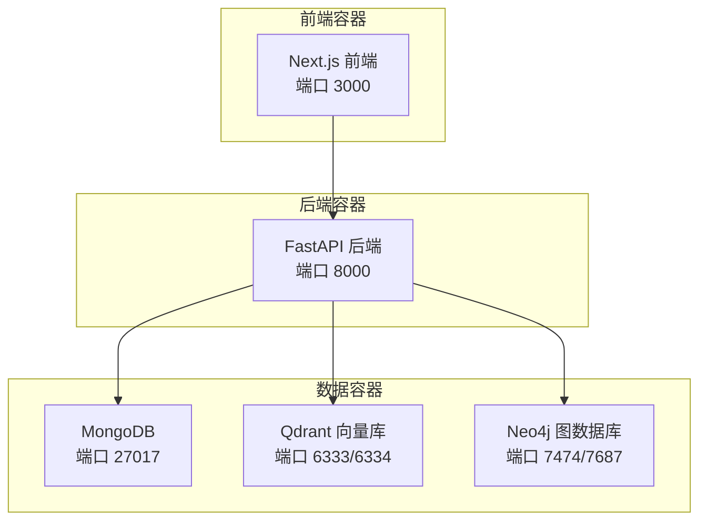
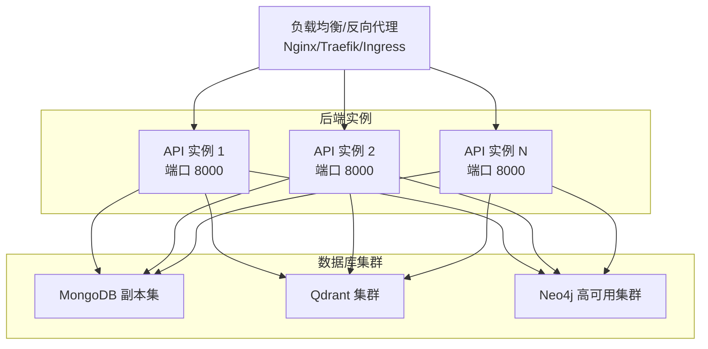
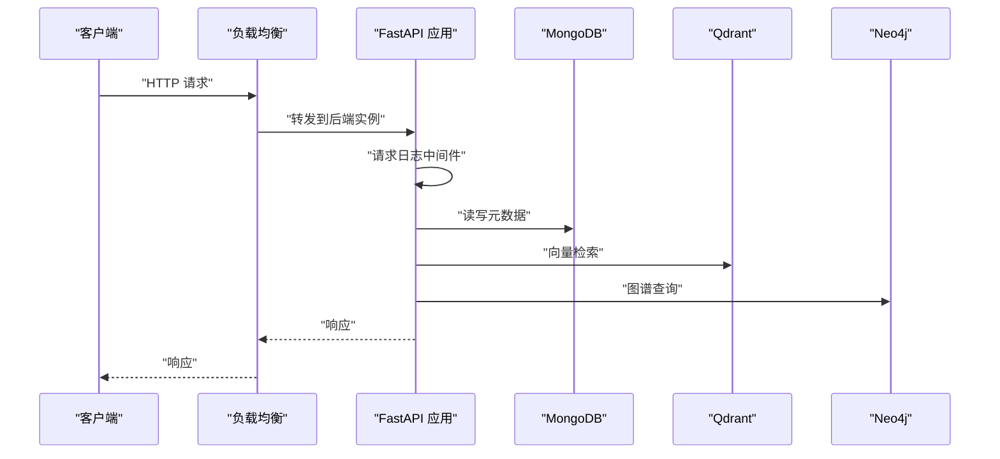
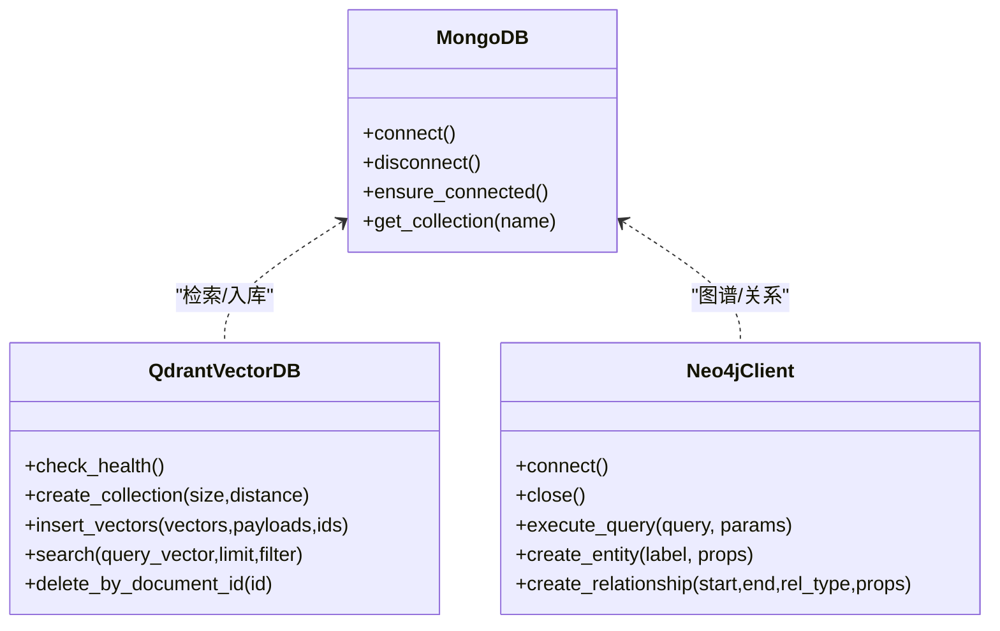
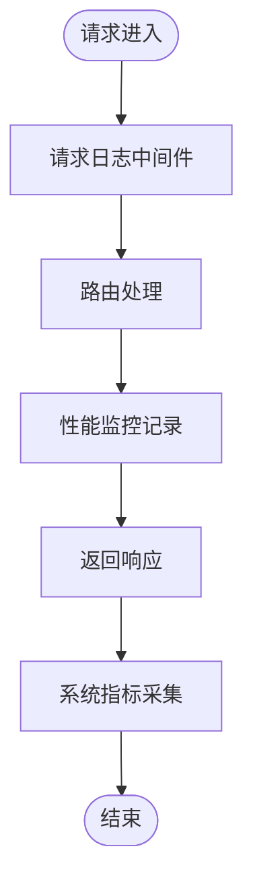
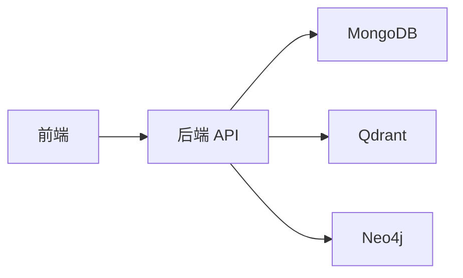

# 部署拓扑

<cite>
**本文引用的文件**
- [Dockerfile](file://Dockerfile)
- [docker-compose.yml](file://docker-compose.yml)
- [main.py](file://main.py)
- [requirements.txt](file://requirements.txt)
- [web/Dockerfile](file://web/Dockerfile)
- [scripts/start-backend-8000.ps1](file://scripts/start-backend-8000.ps1)
- [scripts/stop-backend-8000.ps1](file://scripts/stop-backend-8000.ps1)
- [utils/monitoring.py](file://utils/monitoring.py)
- [utils/logger.py](file://utils/logger.py)
- [database/mongodb.py](file://database/mongodb.py)
- [database/qdrant_client.py](file://database/qdrant_client.py)
- [database/neo4j_client.py](file://database/neo4j_client.py)
- [routers/health.py](file://routers/health.py)
- [utils/lifespan.py](file://utils/lifespan.py)
</cite>

## 目录
1. [简介](#简介)
2. [项目结构](#项目结构)
3. [核心组件](#核心组件)
4. [架构总览](#架构总览)
5. [详细组件分析](#详细组件分析)
6. [依赖关系分析](#依赖关系分析)
7. [性能考量](#性能考量)
8. [故障排查指南](#故障排查指南)
9. [结论](#结论)
10. [附录](#附录)

## 简介
本文件面向 Advanced RAG 系统的部署与运维团队，提供从单机到分布式、从容器化到高可用的完整部署拓扑说明。内容涵盖：
- 单机部署与分布式部署方案
- 容器化策略（镜像构建、多容器编排）
- 负载均衡与高可用设计
- 数据库集群与备份策略
- 监控与日志收集架构
- 生产与开发环境差异化配置
- 部署拓扑图与环境配置指南

## 项目结构
该仓库采用前后端分离的容器化部署思路：
- 后端服务基于 Python/FastAPI，提供 API 与业务逻辑
- 前端服务基于 Next.js，打包为独立容器
- 数据层由 MongoDB、Qdrant、Neo4j 三类数据库组成
- 通过 docker-compose 提供本地开发与测试环境编排

图表来源
- [docker-compose.yml:1-96](file://docker-compose.yml#L1-L96)
- [web/Dockerfile:1-39](file://web/Dockerfile#L1-L39)
- [Dockerfile:1-95](file://Dockerfile#L1-L95)

章节来源
- [docker-compose.yml:1-96](file://docker-compose.yml#L1-L96)
- [Dockerfile:1-95](file://Dockerfile#L1-L95)
- [web/Dockerfile:1-39](file://web/Dockerfile#L1-L39)

## 核心组件
- 后端 API 服务（FastAPI/Uvicorn）
  - 端口：8000
  - 工作进程：生产环境默认 24 个 worker
  - 健康检查：/api/health
- 前端静态服务（Next.js Standalone）
  - 端口：3000
  - 运行模式：生产环境
- 数据库组件
  - MongoDB：文档存储与元数据
  - Qdrant：向量检索
  - Neo4j：知识图谱
- 监控与日志
  - 自定义性能监控与系统指标采集
  - 异步文件日志与控制台日志

章节来源
- [main.py:129-171](file://main.py#L129-L171)
- [routers/health.py:23-87](file://routers/health.py#L23-L87)
- [utils/monitoring.py:13-185](file://utils/monitoring.py#L13-L185)
- [utils/logger.py:15-88](file://utils/logger.py#L15-L88)
- [database/mongodb.py:92-205](file://database/mongodb.py#L92-L205)
- [database/qdrant_client.py:18-139](file://database/qdrant_client.py#L18-L139)
- [database/neo4j_client.py:6-104](file://database/neo4j_client.py#L6-L104)

## 架构总览
下图展示生产环境典型拓扑：反向代理/负载均衡前置，后端多实例横向扩展，数据库与向量库/图数据库独立部署并具备高可用能力。

图表来源
- [main.py:129-171](file://main.py#L129-L171)
- [database/mongodb.py:92-205](file://database/mongodb.py#L92-L205)
- [database/qdrant_client.py:18-139](file://database/qdrant_client.py#L18-L139)
- [database/neo4j_client.py:6-104](file://database/neo4j_client.py#L6-L104)

## 详细组件分析

### 后端服务（FastAPI/Uvicorn）
- 进程与端口
  - 生产环境默认 24 个工作进程，端口 8000
  - 开发环境单 worker，支持热重载
- 环境变量与配置
  - 通过 ENVIRONMENT/NODE_ENV 切换开发/生产
  - .env.production/.env.development 加载顺序
- 生命周期与健康检查
  - 应用启动时尝试连接 MongoDB，失败不阻断服务
  - 健康检查端点 /api/health 汇总 MongoDB、Qdrant 状态
- 日志与监控
  - 全局异常捕获与结构化日志
  - 性能监控器记录请求耗时与系统指标

图表来源
- [main.py:101-127](file://main.py#L101-L127)
- [routers/health.py:23-87](file://routers/health.py#L23-L87)
- [database/mongodb.py:92-205](file://database/mongodb.py#L92-L205)
- [database/qdrant_client.py:18-139](file://database/qdrant_client.py#L18-L139)
- [database/neo4j_client.py:6-104](file://database/neo4j_client.py#L6-L104)

章节来源
- [main.py:20-53](file://main.py#L20-L53)
- [main.py:129-171](file://main.py#L129-L171)
- [utils/lifespan.py:8-26](file://utils/lifespan.py#L8-L26)
- [routers/health.py:23-87](file://routers/health.py#L23-L87)

### 前端服务（Next.js Standalone）
- 构建与运行
  - 多阶段 Dockerfile：deps → builder → runner
  - 运行时使用 NODE_ENV=production，读取 .env.production
- 端口与暴露
  - 容器内暴露 3000 端口
- 部署建议
  - 前端与后端通过反向代理统一对外提供服务

章节来源
- [web/Dockerfile:1-39](file://web/Dockerfile#L1-L39)

### 数据库组件
- MongoDB
  - 连接池参数可调（最大/最小连接、超时等）
  - 支持从 MONGODB_URI 或 HOST/PORT 等环境变量组合
  - 启动时 ping 校验，失败记录详细提示
- Qdrant
  - 优先使用 gRPC（端口 6334）以规避 HTTP 502 问题
  - 自动维度校验与集合重建
  - 插入/查询具备重试与降级策略
- Neo4j
  - 容器内自动将 localhost 替换为 host.docker.internal
  - 连接验证与 Cypher 查询封装

图表来源
- [database/mongodb.py:92-205](file://database/mongodb.py#L92-L205)
- [database/qdrant_client.py:18-139](file://database/qdrant_client.py#L18-L139)
- [database/neo4j_client.py:6-104](file://database/neo4j_client.py#L6-L104)

章节来源
- [database/mongodb.py:92-205](file://database/mongodb.py#L92-L205)
- [database/qdrant_client.py:18-139](file://database/qdrant_client.py#L18-L139)
- [database/neo4j_client.py:6-104](file://database/neo4j_client.py#L6-L104)

### 监控与日志
- 日志
  - 异步文件处理器 + 控制台处理器
  - 生产环境降低文件日志级别，减少 IO
- 性能监控
  - 记录每个端点的请求次数、错误数、耗时分位
  - 采集 CPU/内存/磁盘与进程指标
- 健康检查
  - /api/health：汇总数据库与系统状态
  - /api/health/liveness：K8s 存活探针
  - /api/health/readiness：K8s 就绪探针
  - /api/health/metrics：性能与系统指标

图表来源
- [utils/logger.py:15-88](file://utils/logger.py#L15-L88)
- [utils/monitoring.py:13-185](file://utils/monitoring.py#L13-L185)
- [routers/health.py:117-134](file://routers/health.py#L117-L134)

章节来源
- [utils/logger.py:15-88](file://utils/logger.py#L15-L88)
- [utils/monitoring.py:13-185](file://utils/monitoring.py#L13-L185)
- [routers/health.py:23-134](file://routers/health.py#L23-L134)

## 依赖关系分析
- 后端对数据库的依赖
  - MongoDB：文档与元数据
  - Qdrant：向量检索
  - Neo4j：知识图谱
- 健康检查链路
  - /api/health 依赖上述三个数据库的可用性
- 运行时依赖
  - Python 依赖通过 requirements.txt 管理
  - 前端依赖通过 npm 管理，构建产物独立运行

图表来源
- [requirements.txt:1-42](file://requirements.txt#L1-L42)
- [main.py:15-98](file://main.py#L15-L98)

章节来源
- [requirements.txt:1-42](file://requirements.txt#L1-L42)
- [main.py:15-98](file://main.py#L15-L98)

## 性能考量
- 并发与连接
  - Uvicorn 生产环境默认多 worker，提升并发吞吐
  - MongoDB 连接池参数可调，建议结合实例规模与数据库资源评估
- I/O 与日志
  - 异步日志写入避免阻塞请求
  - 生产环境降低文件日志级别，减少磁盘压力
- 检索性能
  - Qdrant 优先使用 gRPC，避免 HTTP 502
  - 插入/查询具备重试与维度校验，保证稳定性

章节来源
- [main.py:142-171](file://main.py#L142-L171)
- [utils/logger.py:77-82](file://utils/logger.py#L77-L82)
- [database/qdrant_client.py:66-96](file://database/qdrant_client.py#L66-L96)

## 故障排查指南
- 健康检查失败
  - 使用 /api/health 查看各子服务状态
  - 关注 MongoDB 连接字符串与网络可达性
  - 关注 Qdrant gRPC 端口与 API key 配置
- 启动阶段 MongoDB 连接失败
  - 后端不会因数据库失败而启动失败，但依赖数据库的接口可能不可用
  - 检查 .env 中 MONGODB_URI/MONGODB_HOST/MONGODB_PORT 等配置
- Windows 开发环境端口占用
  - 使用提供的 PowerShell 脚本优雅释放端口后再启动后端
- 日志定位
  - 查看 logs/advanced-rag-api.log
  - 生产环境日志级别较高，关注 WARNING+ 级别

章节来源
- [routers/health.py:23-87](file://routers/health.py#L23-L87)
- [utils/lifespan.py:8-26](file://utils/lifespan.py#L8-L26)
- [database/mongodb.py:168-184](file://database/mongodb.py#L168-L184)
- [database/qdrant_client.py:124-139](file://database/qdrant_client.py#L124-L139)
- [scripts/start-backend-8000.ps1:1-89](file://scripts/start-backend-8000.ps1#L1-L89)
- [utils/logger.py:15-88](file://utils/logger.py#L15-L88)

## 结论
本部署拓扑以容器化为核心，结合多数据库与健康检查机制，既满足单机开发需求，又为生产级横向扩展与高可用打下基础。建议在生产环境中引入负载均衡、数据库集群与集中化监控告警体系，并制定完善的备份与回滚策略。

## 附录

### 单机部署（本地开发）
- 使用 docker-compose 启动 MongoDB、Qdrant、Neo4j、Redis（可选）
- 后端与前端分别构建镜像并运行
- 通过 /api/health 检查整体可用性

章节来源
- [docker-compose.yml:1-96](file://docker-compose.yml#L1-L96)
- [Dockerfile:1-95](file://Dockerfile#L1-L95)
- [web/Dockerfile:1-39](file://web/Dockerfile#L1-L39)

### 分布式部署（生产建议）
- 后端：多实例横向扩展，配合负载均衡
- 数据库：MongoDB 副本集、Qdrant 集群、Neo4j 高可用集群
- 前端：可独立部署或与后端统一反向代理
- 监控：集中化日志与指标采集，结合告警策略

章节来源
- [main.py:129-171](file://main.py#L129-L171)
- [database/mongodb.py:122-151](file://database/mongodb.py#L122-L151)
- [database/qdrant_client.py:66-96](file://database/qdrant_client.py#L66-L96)
- [database/neo4j_client.py:16-38](file://database/neo4j_client.py#L16-L38)

### 容器化与镜像构建
- 后端镜像
  - 基于 python:3.10-slim，启用国内镜像源加速
  - 缓存 pip/apt，减少构建时间
  - 健康检查基于 /health
- 前端镜像
  - 多阶段构建，最终运行时仅包含 standalone 产物
  - NODE_ENV=production，读取 .env.production

章节来源
- [Dockerfile:1-95](file://Dockerfile#L1-L95)
- [web/Dockerfile:1-39](file://web/Dockerfile#L1-L39)

### 负载均衡与高可用
- 建议使用 Nginx/Traefik/Ingress 作为入口，后端多实例部署
- 健康检查端点 /api/health 与 /api/health/readiness 用于探针配置
- 数据库采用副本集/集群，确保读写高可用

章节来源
- [routers/health.py:90-114](file://routers/health.py#L90-L114)
- [database/mongodb.py:122-151](file://database/mongodb.py#L122-L151)
- [database/qdrant_client.py:18-139](file://database/qdrant_client.py#L18-L139)
- [database/neo4j_client.py:16-38](file://database/neo4j_client.py#L16-L38)

### 数据库集群与备份策略
- MongoDB
  - 副本集部署，开启 oplog 与仲裁节点
  - 备份策略：定期快照 + 增量备份，结合 PITR
- Qdrant
  - 集群部署，注意 gRPC 端口与网络互通
  - 备份策略：存储卷快照 + 集合导出
- Neo4j
  - 高可用集群，共享存储与备份
  - 备份策略：原生备份 + 定期快照

章节来源
- [database/mongodb.py:122-151](file://database/mongodb.py#L122-L151)
- [database/qdrant_client.py:18-139](file://database/qdrant_client.py#L18-L139)
- [database/neo4j_client.py:16-38](file://database/neo4j_client.py#L16-L38)

### 监控与日志收集
- 日志
  - 异步文件处理器，生产环境降低文件日志级别
  - 控制台日志用于开发调试
- 指标
  - /api/health/metrics 提供请求统计与系统指标
  - 建议接入 Prometheus/Grafana 进行可视化

章节来源
- [utils/logger.py:15-88](file://utils/logger.py#L15-L88)
- [utils/monitoring.py:13-185](file://utils/monitoring.py#L13-L185)
- [routers/health.py:117-134](file://routers/health.py#L117-L134)

### 环境配置指南（生产 vs 开发）
- 环境变量
  - ENVIRONMENT/NODE_ENV：切换开发/生产
  - .env.production/.env.development：按环境加载
- 端口与进程
  - 生产：UVICORN_PORT=8000，UVICORN_WORKERS=24
  - 开发：单 worker，支持热重载
- 数据库连接
  - 生产：使用 MONGODB_URI 或 HOST/PORT 组合
  - 开发：docker-compose 默认凭据与端口映射

章节来源
- [main.py:20-53](file://main.py#L20-L53)
- [main.py:129-171](file://main.py#L129-L171)
- [database/mongodb.py:99-151](file://database/mongodb.py#L99-L151)
- [docker-compose.yml:9-12](file://docker-compose.yml#L9-L12)