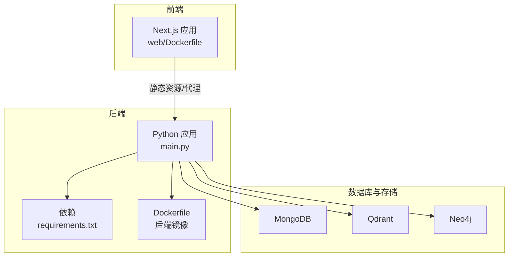
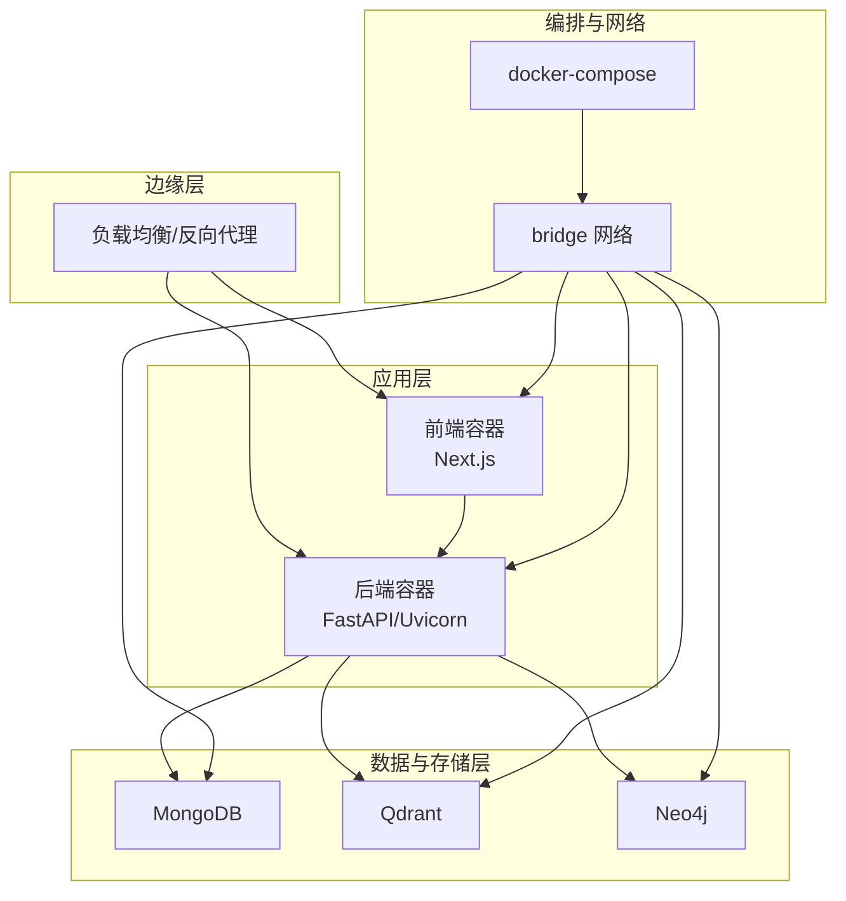
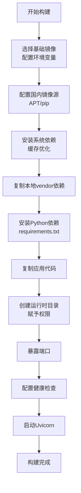
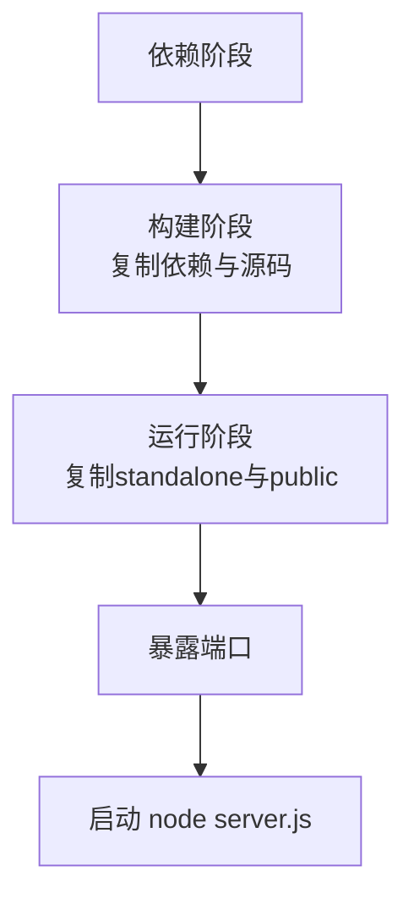
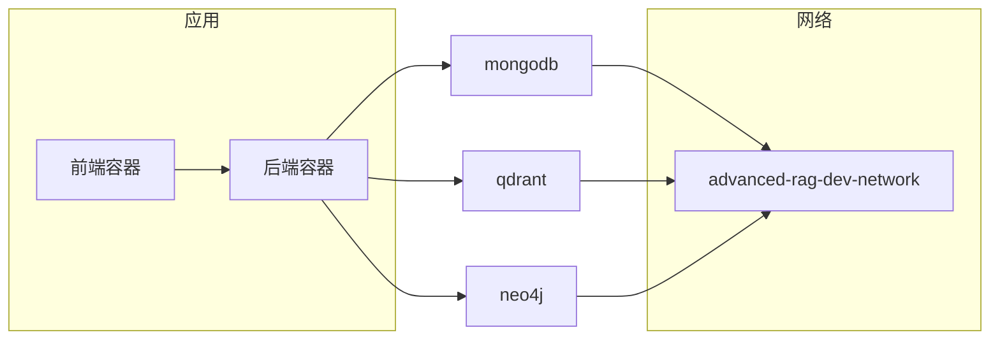
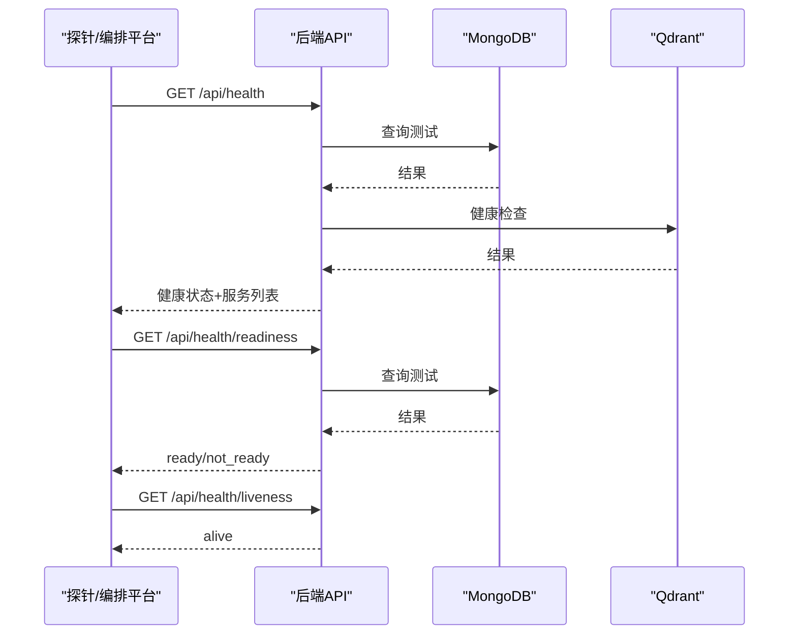
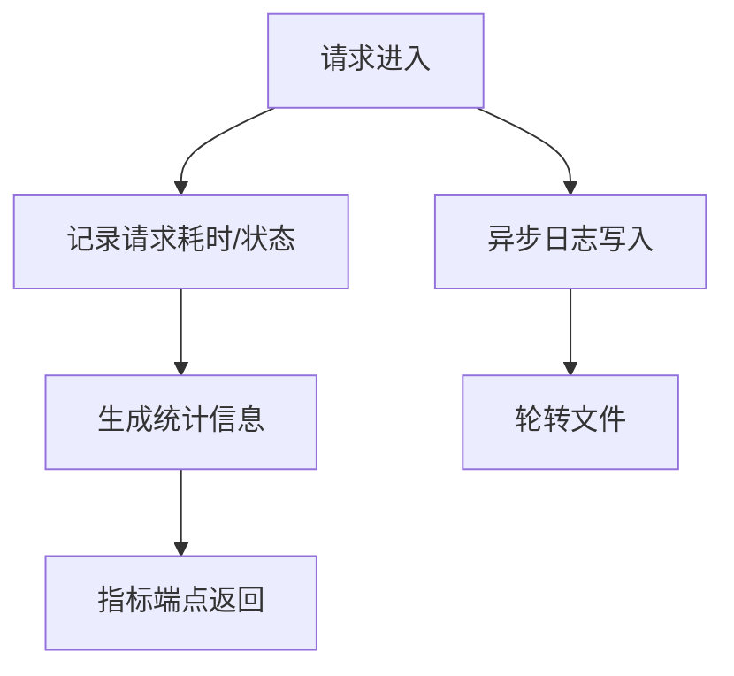
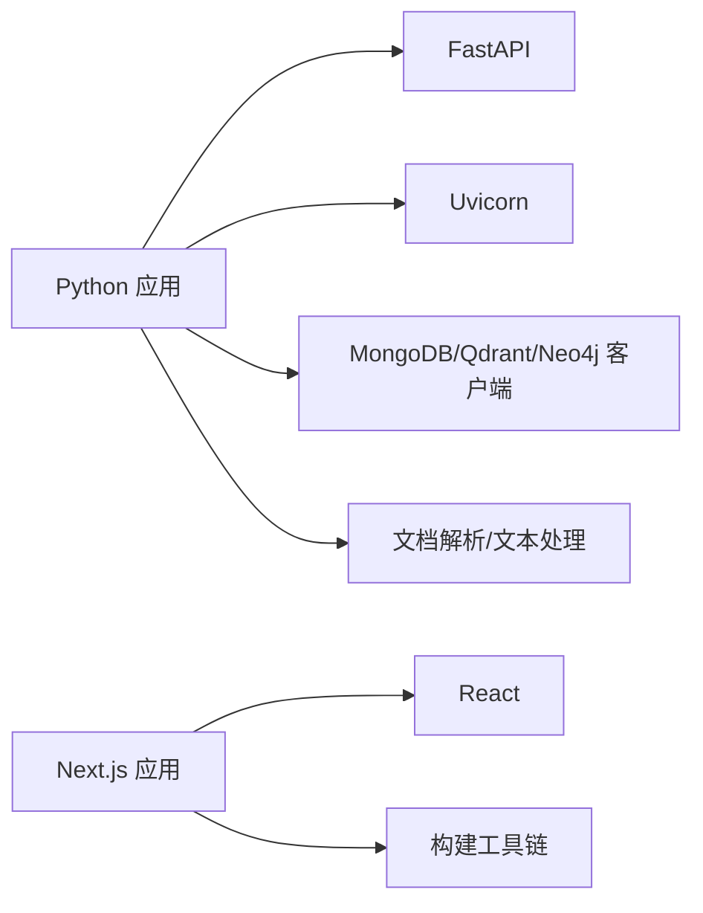

# 部署架构

<cite>
**本文引用的文件**
- [Dockerfile](file://Dockerfile)
- [docker-compose.yml](file://docker-compose.yml)
- [main.py](file://main.py)
- [requirements.txt](file://requirements.txt)
- [web/Dockerfile](file://web/Dockerfile)
- [utils/monitoring.py](file://utils/monitoring.py)
- [utils/logger.py](file://utils/logger.py)
- [routers/health.py](file://routers/health.py)
- [download_dependencies.sh](file://download_dependencies.sh)
- [download_dependencies.ps1](file://download_dependencies.ps1)
- [scripts/boot_verify.py](file://scripts/boot_verify.py)
</cite>

## 目录
1. [简介](#简介)
2. [项目结构](#项目结构)
3. [核心组件](#核心组件)
4. [架构总览](#架构总览)
5. [详细组件分析](#详细组件分析)
6. [依赖分析](#依赖分析)
7. [性能考量](#性能考量)
8. [故障排除指南](#故障排除指南)
9. [结论](#结论)
10. [附录](#附录)

## 简介
本文件面向 advanced-rag 系统的生产级容器化部署，围绕以下目标展开：Docker 镜像构建与多阶段优化、容器资源限制、Compose 编排与网络/卷管理、生产环境最佳实践（负载均衡、健康检查、自动扩缩容）、监控与日志架构（APM、错误追踪、日志聚合、告警）、部署安全（网络安全、数据加密、访问控制）、以及部署故障排除与运维最佳实践。

## 项目结构
系统由后端 Python API（FastAPI + Uvicorn）与前端 Next.js 组成，采用双 Dockerfile 分别构建后端与前端镜像，并通过 docker-compose 编排数据库与向量/图数据库等依赖服务。

图表来源
- [main.py:128-157](file://main.py#L128-L157)
- [requirements.txt:1-38](file://requirements.txt#L1-L38)
- [Dockerfile:12-95](file://Dockerfile#L12-L95)
- [web/Dockerfile:1-39](file://web/Dockerfile#L1-L39)
- [docker-compose.yml:1-76](file://docker-compose.yml#L1-L76)

章节来源
- [main.py:128-157](file://main.py#L128-L157)
- [requirements.txt:1-38](file://requirements.txt#L1-L38)
- [Dockerfile:12-95](file://Dockerfile#L12-L95)
- [web/Dockerfile:1-39](file://web/Dockerfile#L1-L39)
- [docker-compose.yml:1-76](file://docker-compose.yml#L1-L76)

## 核心组件
- 后端 API（FastAPI/Uvicorn）
  - 通过环境变量控制端口、工作进程数、日志级别等
  - 提供健康检查、就绪检查、存活探针与性能指标端点
- 数据库与向量/图数据库
  - MongoDB、Qdrant、Neo4j 作为独立服务，通过 Compose 管理
- 前端 Next.js
  - 多阶段构建，产物以 standalone 方式运行
- 日志与监控
  - 异步文件日志、系统指标采集、请求耗时统计与慢请求告警

章节来源
- [main.py:20-53](file://main.py#L20-L53)
- [main.py:90-126](file://main.py#L90-L126)
- [routers/health.py:23-134](file://routers/health.py#L23-L134)
- [utils/logger.py:15-88](file://utils/logger.py#L15-L88)
- [utils/monitoring.py:13-185](file://utils/monitoring.py#L13-L185)

## 架构总览
下图展示容器化部署的整体交互：前端通过反向代理或直接访问后端 API；后端连接数据库与向量/图数据库；Compose 管理服务生命周期与网络；健康检查与指标端点支撑运维与自动化。

图表来源
- [docker-compose.yml:1-76](file://docker-compose.yml#L1-L76)
- [main.py:90-126](file://main.py#L90-L126)
- [routers/health.py:23-134](file://routers/health.py#L23-L134)

## 详细组件分析

### 后端镜像构建与多阶段优化
- 基础镜像与环境变量
  - 使用精简基础镜像，设置生产环境变量（端口、工作进程数、LibreOffice 路径等）
- 国内镜像源优化
  - 配置 APT 与 pip 使用国内镜像，提升构建速度
- 依赖安装策略
  - 先复制 vendor 目录中的本地依赖，再安装 requirements.txt，避免构建时访问外部仓库
  - 使用 BuildKit 缓存优化（APT、pip、系统包缓存挂载）
- 应用目录与权限
  - 创建上传、头像、缩略图、日志等目录并赋予合适权限
- 健康检查
  - 基于健康端点的 HTTP 探针，确保容器启动后服务可用
- 启动命令
  - 通过 Uvicorn 启动，支持通过环境变量调整端口与工作进程数

图表来源
- [Dockerfile:12-95](file://Dockerfile#L12-L95)

章节来源
- [Dockerfile:12-95](file://Dockerfile#L12-L95)
- [requirements.txt:1-38](file://requirements.txt#L1-L38)
- [download_dependencies.sh:1-29](file://download_dependencies.sh#L1-L29)
- [download_dependencies.ps1:1-35](file://download_dependencies.ps1#L1-L35)

### 前端镜像构建与运行
- 多阶段构建
  - 依赖阶段、构建阶段、运行阶段分离，减小最终镜像体积
- 构建产物
  - 使用 Next.js standalone 产物，仅复制必要文件
- 运行时
  - 设置生产环境变量与端口，直接运行 server.js

图表来源
- [web/Dockerfile:1-39](file://web/Dockerfile#L1-L39)

章节来源
- [web/Dockerfile:1-39](file://web/Dockerfile#L1-L39)

### docker-compose 编排方案
- 服务编排
  - MongoDB、Qdrant、Neo4j 作为独立服务，分别映射端口、挂载数据卷、启用健康检查
- 网络
  - 使用自定义 bridge 网络，隔离服务间通信
- 数据卷
  - 为各数据库持久化数据、日志、插件等目录
- 依赖关系
  - 通过网络互通，后端容器通过服务名访问数据库

图表来源
- [docker-compose.yml:1-76](file://docker-compose.yml#L1-L76)

章节来源
- [docker-compose.yml:1-76](file://docker-compose.yml#L1-L76)

### 健康检查与指标端点
- 健康检查
  - 提供综合健康检查、存活探针、就绪探针，便于容器编排平台进行生命周期管理
- 指标端点
  - 返回请求统计与系统资源使用情况，支持性能观测与告警

图表来源
- [routers/health.py:23-115](file://routers/health.py#L23-L115)

章节来源
- [routers/health.py:23-134](file://routers/health.py#L23-L134)

### 日志与监控架构
- 日志
  - 异步文件处理器，避免阻塞主线程；生产环境降低日志级别，减少 IO 压力
- 监控
  - 请求耗时统计、慢请求告警、系统 CPU/内存/磁盘使用率采集
- 指标端点
  - 对外暴露性能与系统指标，便于集成监控系统

图表来源
- [utils/logger.py:15-88](file://utils/logger.py#L15-L88)
- [utils/monitoring.py:13-185](file://utils/monitoring.py#L13-L185)
- [routers/health.py:117-134](file://routers/health.py#L117-L134)

章节来源
- [utils/logger.py:15-88](file://utils/logger.py#L15-L88)
- [utils/monitoring.py:13-185](file://utils/monitoring.py#L13-L185)
- [routers/health.py:117-134](file://routers/health.py#L117-L134)

### 生产环境部署最佳实践
- 负载均衡
  - 建议在容器编排平台或反向代理层前置负载均衡，按权重/亲和性调度
- 健康检查
  - 使用存活探针与就绪探针配合，确保流量只进入已就绪实例
- 自动扩缩容
  - 基于 CPU/内存/请求延迟等指标设置 HPA，结合副本数与资源配额
- 资源限制
  - 为后端容器设置 CPU/内存限额与启动参数（工作进程数、并发连接数）以避免资源争用
- 网络与安全
  - 仅暴露必要端口；数据库与中间件置于内部网络；启用 TLS；限制入站/出站策略

章节来源
- [main.py:128-157](file://main.py#L128-L157)
- [routers/health.py:23-115](file://routers/health.py#L23-L115)
- [Dockerfile:14-20](file://Dockerfile#L14-L20)

## 依赖分析
- 后端依赖
  - Web 框架、HTTP 客户端、数据库驱动、向量客户端、文档解析、文本处理、配置加载等
- 前端依赖
  - Next.js、React、构建工具链
- 构建依赖
  - Node.js、Python、系统库（LibreOffice、图像处理等）

图表来源
- [requirements.txt:1-38](file://requirements.txt#L1-L38)
- [web/Dockerfile:1-39](file://web/Dockerfile#L1-L39)

章节来源
- [requirements.txt:1-38](file://requirements.txt#L1-L38)
- [web/Dockerfile:1-39](file://web/Dockerfile#L1-L39)

## 性能考量
- 并发与工作进程
  - 生产环境通过环境变量设置工作进程数，合理利用多核 CPU
- 连接与保活
  - 增加 keep-alive 超时与并发连接上限，适配大文件上传场景
- 日志与监控开销
  - 生产环境降低日志级别，避免频繁 IO；慢请求告警帮助定位瓶颈
- 构建缓存
  - 利用 BuildKit 缓存与分层优化，缩短构建时间

章节来源
- [main.py:140-157](file://main.py#L140-L157)
- [Dockerfile:38-67](file://Dockerfile#L38-L67)
- [utils/logger.py:77-82](file://utils/logger.py#L77-L82)
- [utils/monitoring.py:178-184](file://utils/monitoring.py#L178-L184)

## 故障排除指南
- 构建失败（vendor 依赖缺失）
  - 确保在构建前执行依赖下载脚本，生成本地 vendor 目录
- 健康检查失败
  - 检查数据库连接字符串与凭据；确认服务已就绪后再放行流量
- 日志过多或 IO 压力大
  - 调整日志级别；检查慢请求与异常堆栈
- 启动后无法访问
  - 核对端口映射、网络连通性与防火墙规则
- 集成验证
  - 使用引导脚本进行最小化验证，确保知识空间与文档上传流程可用

章节来源
- [download_dependencies.sh:1-29](file://download_dependencies.sh#L1-L29)
- [download_dependencies.ps1:1-35](file://download_dependencies.ps1#L1-L35)
- [routers/health.py:23-115](file://routers/health.py#L23-L115)
- [utils/logger.py:15-88](file://utils/logger.py#L15-L88)
- [scripts/boot_verify.py:45-73](file://scripts/boot_verify.py#L45-L73)

## 结论
通过双镜像多阶段构建、Compose 编排与完善的健康检查/指标体系，advanced-rag 可实现稳定、可观测、可扩展的生产部署。建议结合负载均衡、HPA、资源限制与安全策略，形成完整的运维闭环。

## 附录
- 环境变量参考
  - 后端：端口、工作进程数、日志级别、LibreOffice 路径、环境模式
  - 前端：NODE_ENV、端口
- 关键端点
  - 健康检查：/api/health、/api/health/readiness、/api/health/liveness
  - 指标：/api/health/metrics
- 数据卷
  - MongoDB：数据与配置目录
  - Qdrant：存储目录
  - Neo4j：数据、日志、导入、插件目录

章节来源
- [main.py:14-20](file://main.py#L14-L20)
- [web/Dockerfile:22-23](file://web/Dockerfile#L22-L23)
- [docker-compose.yml:58-76](file://docker-compose.yml#L58-L76)
- [routers/health.py:23-134](file://routers/health.py#L23-L134)