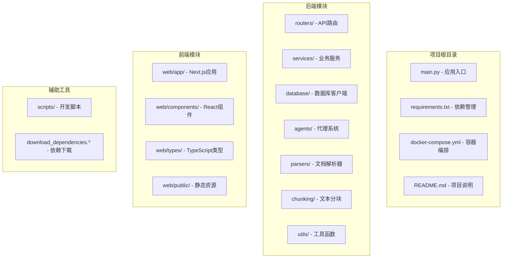
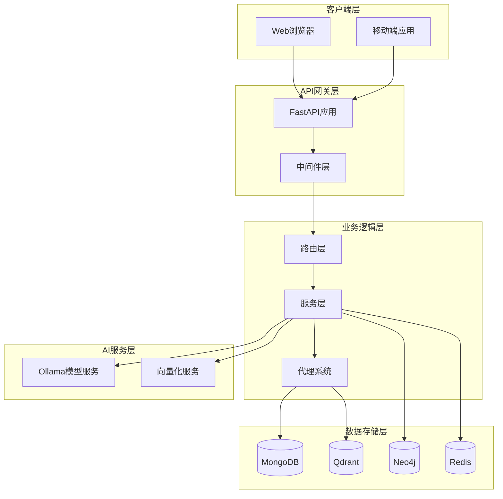
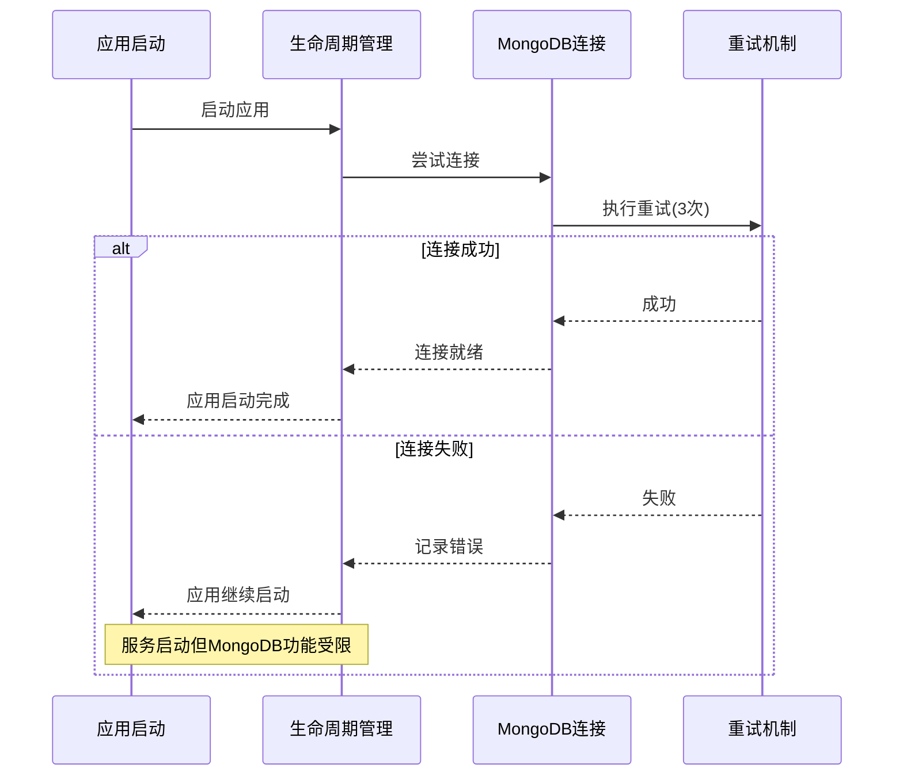
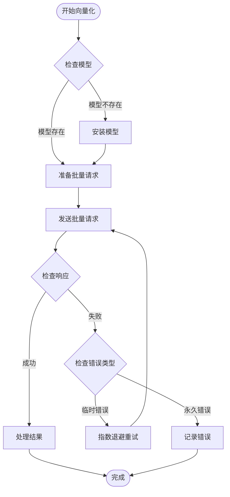
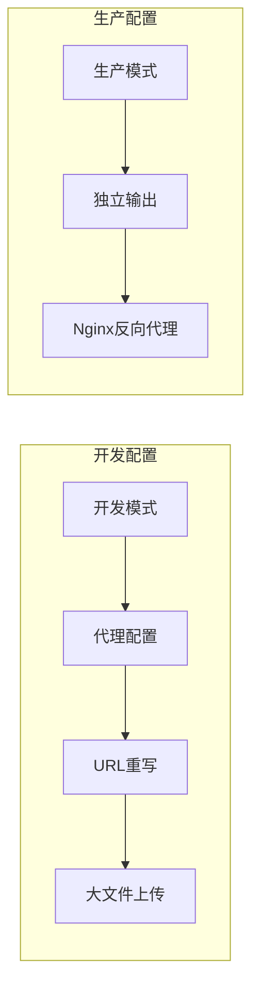

# 开发环境搭建

<cite>
**本文档引用的文件**
- [README.md](file://README.md)
- [requirements.txt](file://requirements.txt)
- [main.py](file://main.py)
- [docker-compose.yml](file://docker-compose.yml)
- [download_dependencies.sh](file://download_dependencies.sh)
- [download_dependencies.ps1](file://download_dependencies.ps1)
- [scripts/start-backend-8000.ps1](file://scripts/start-backend-8000.ps1)
- [web/package.json](file://web/package.json)
- [web/next.config.ts](file://web/next.config.ts)
- [utils/lifespan.py](file://utils/lifespan.py)
- [database/mongodb.py](file://database/mongodb.py)
- [database/qdrant_client.py](file://database/qdrant_client.py)
- [database/neo4j_client.py](file://database/neo4j_client.py)
- [embedding/embedding_service.py](file://embedding/embedding_service.py)
- [services/ollama_service.py](file://services/ollama_service.py)
</cite>

## 目录
1. [简介](#简介)
2. [项目结构](#项目结构)
3. [核心组件](#核心组件)
4. [架构概览](#架构概览)
5. [详细组件分析](#详细组件分析)
6. [依赖分析](#依赖分析)
7. [性能考虑](#性能考虑)
8. [故障排除指南](#故障排除指南)
9. [结论](#结论)
10. [附录](#附录)

## 简介
Advanced RAG 是一个基于 FastAPI 和 Next.js 构建的高级 RAG（检索增强生成）系统，专注于 AI 助手对话与知识库检索/入库两大核心能力。本指南将帮助您完成开发环境的完整搭建，包括 Python 环境配置、依赖管理、数据库配置、环境变量设置以及本地开发服务器启动。

## 项目结构
项目采用前后端分离的架构设计，后端使用 FastAPI 提供 RESTful API，前端使用 Next.js 构建用户界面。主要目录结构如下：



**图表来源**
- [README.md:55-70](file://README.md#L55-L70)
- [main.py:15-98](file://main.py#L15-L98)

## 核心组件
系统的核心组件包括：

### 后端核心组件
- **FastAPI 应用入口**：负责应用初始化、路由注册和中间件配置
- **数据库客户端**：支持 MongoDB、Qdrant、Neo4j 三种数据库
- **服务层**：包含 RAG 服务、知识抽取、模型选择等功能
- **代理系统**：多代理协作框架，支持深度研究模式

### 前端核心组件
- **Next.js 应用**：现代化的 React 框架，支持静态生成和服务器端渲染
- **React 组件库**：丰富的 UI 组件，包括聊天界面、文档上传等
- **TypeScript 类型系统**：提供类型安全的开发体验

**章节来源**
- [README.md:26-54](file://README.md#L26-L54)
- [main.py:8-19](file://main.py#L8-L19)

## 架构概览
系统采用微服务架构，各组件通过 API 进行通信：



**图表来源**
- [README.md:28-44](file://README.md#L28-L44)
- [main.py:90-98](file://main.py#L90-L98)

## 详细组件分析

### Python 环境配置
推荐使用 Python 3.10+ 进行开发，具体要求如下：

#### 版本要求
- Python 3.9+（最低要求）
- 建议使用 3.10+ 以获得最佳兼容性

#### 虚拟环境创建
```bash
# 创建虚拟环境
python -m venv advanced-rag-env

# 激活虚拟环境
# Windows:
advanced-rag-env\Scripts\activate
# macOS/Linux:
source advanced-rag-env/bin/activate

# 升级 pip
pip install --upgrade pip
```

#### 依赖安装
```bash
# 安装后端依赖
pip install -r requirements.txt

# PaddleOCR 需要单独安装
pip install -e ./vendor/PaddleOCR
```

**章节来源**
- [README.md:73-86](file://README.md#L73-L86)
- [requirements.txt:1-42](file://requirements.txt#L1-L42)

### 数据库环境配置

#### MongoDB 配置
系统支持两种连接方式：

1. **使用单一 URI**：
   ```python
   MONGODB_URI=mongodb://localhost:27017/advanced_rag
   ```

2. **使用分离的环境变量**：
   ```python
   MONGODB_HOST=localhost
   MONGODB_PORT=27017
   MONGODB_DB_NAME=advanced_rag
   MONGODB_USERNAME=
   MONGODB_PASSWORD=
   ```

#### Qdrant 配置
```python
QDRANT_URL=http://localhost:6333
QDRANT_API_KEY=  # 可选
```

#### Neo4j 配置
```python
NEO4J_URI=bolt://localhost:7687
NEO4J_USER=neo4j
NEO4J_PASSWORD=your-password
```

#### Redis 配置（可选）
```python
REDIS_HOST=localhost
REDIS_PORT=6379
REDIS_DB=0
```

**章节来源**
- [database/mongodb.py:99-184](file://database/mongodb.py#L99-L184)
- [database/qdrant_client.py:35-96](file://database/qdrant_client.py#L35-L96)
- [database/neo4j_client.py:11-13](file://database/neo4j_client.py#L11-L13)

### 环境变量配置

#### 应用配置
```bash
ENVIRONMENT=development
SECRET_KEY=your-secret-key-here
API_HOST=0.0.0.0
API_PORT=8000
```

#### 文件上传配置
```bash
MAX_UPLOAD_SIZE=104857600  # 100MB
UPLOAD_DIR=./uploads
```

#### 日志配置
```bash
LOG_LEVEL=INFO
LOG_FILE=./logs/advanced-rag.log
```

#### Ollama 配置
```bash
OLLAMA_BASE_URL=http://localhost:11434
OLLAMA_MODEL=gpt-oss:20b
OLLAMA_EMBEDDING_MODEL=nomic-embed-text
```

**章节来源**
- [README.md:125-166](file://README.md#L125-L166)

### 本地开发服务器启动

#### 后端服务器启动
```bash
# 方法1：直接运行
python main.py

# 方法2：使用 Uvicorn
uvicorn main:app --reload --host 0.0.0.0 --port 8000

# 方法3：使用 PowerShell 脚本（Windows）
.\scripts\start-backend-8000.ps1
```

#### 前端开发服务器启动
```bash
# 进入 web 目录
cd web

# 安装前端依赖
npm install

# 启动开发服务器
npm run dev
```

#### Docker Compose 启动
```bash
# 启动所有服务
docker-compose up -d

# 查看服务状态
docker-compose ps
```

**章节来源**
- [README.md:168-188](file://README.md#L168-L188)
- [scripts/start-backend-8000.ps1:80-89](file://scripts/start-backend-8000.ps1#L80-L89)
- [web/package.json:5-11](file://web/package.json#L5-L11)

### 第三方依赖下载

#### Linux/macOS
```bash
chmod +x download_dependencies.sh
./download_dependencies.sh
```

#### Windows
```cmd
download_dependencies.cmd
# 或
.\download_dependencies.ps1
```

**章节来源**
- [README.md:88-105](file://README.md#L88-L105)
- [download_dependencies.sh:1-29](file://download_dependencies.sh#L1-L29)
- [download_dependencies.ps1:1-35](file://download_dependencies.ps1#L1-L35)

## 依赖分析

### Python 依赖管理
项目使用 requirements.txt 统一管理 Python 依赖：

```mermaid
graph TB
subgraph "Web框架"
FastAPI[fastapi>=0.104.0]
Uvicorn[uvicorn[standard]>=0.24.0]
MultiPart[python-multipart>=0.0.6]
end
subgraph "数据库"
PyMongo[pymongo>=4.6.0]
Motor[motor>=3.3.0]
Qdrant[qdrant-client>=1.7.0]
Neo4j[neo4j>=5.15.0]
Sentence[sentence-transformers>=2.2.0]
end
subgraph "文档解析"
PyPDF2[PyPDF2>=3.0.0]
PyMuPDF[PyMuPDF>=1.23.0]
Docx[python-docx>=1.1.0]
Unstructured[unstructured>=0.12.0]
end
subgraph "文本处理"
Jieba[jieba>=0.42.1]
LangChain[langchain>=0.1.0]
LangExp[langchain-experimental>=0.0.50]
end
subgraph "其他"
DotEnv[python-dotenv>=1.0.0]
Requests[requests>=2.31.0]
Pydantic[pydantic>=2.0.0]
Httpx[httpx>=0.26.0]
end
subgraph "测试"
PyTest[pytest>=8.0.0]
PyTestAsync[pytest-asyncio>=0.23.0]
end
```

**图表来源**
- [requirements.txt:4-42](file://requirements.txt#L4-L42)

### 前端依赖管理
Next.js 应用使用 package.json 管理前端依赖：

```mermaid
graph TB
subgraph "核心框架"
Next[next@16.1.1]
React[react@19.2.1]
ReactDOM[react-dom@19.2.1]
end
subgraph "Markdown处理"
ReactMarkdown[react-markdown@^9.0.1]
RemarkGFM[remark-gfm@^4.0.0]
RehypeRaw[rehype-raw@^7.0.0]
end
subgraph "数学公式"
BetterMathjax[better-react-mathjax@^2.4.0-beta-1]
Mathjax[mathjax@^4.1.0]
RehypeMathjax[rehype-mathjax@^7.1.0]
RehypeKatex[rehype-katex@^7.0.1]
end
subgraph "代码高亮"
RehypeHighlight[rehype-highlight@^7.0.0]
end
subgraph "开发工具"
Biome[@biomejs/biome@2.2.0]
Tailwind[tailwindcss@^4]
Typescript[typescript@^5]
end
```

**图表来源**
- [web/package.json:12-39](file://web/package.json#L12-L39)

**章节来源**
- [requirements.txt:1-42](file://requirements.txt#L1-L42)
- [web/package.json:1-40](file://web/package.json#L1-L40)

## 性能考虑

### 数据库连接优化
系统实现了智能的数据库连接管理：



**图表来源**
- [utils/lifespan.py:28-85](file://utils/lifespan.py#L28-L85)
- [database/mongodb.py:9-25](file://database/mongodb.py#L9-L25)

### 向量化服务优化
Ollama 向量化服务支持批量处理和错误重试：



**图表来源**
- [embedding/embedding_service.py:292-314](file://embedding/embedding_service.py#L292-L314)

### 前端开发优化
Next.js 配置支持大文件上传和代理重写：



**图表来源**
- [web/next.config.ts:3-47](file://web/next.config.ts#L3-L47)

**章节来源**
- [utils/lifespan.py:8-25](file://utils/lifespan.py#L8-L25)
- [embedding/embedding_service.py:275-291](file://embedding/embedding_service.py#L275-L291)
- [web/next.config.ts:12-34](file://web/next.config.ts#L12-L34)

## 故障排除指南

### 常见开发环境问题

#### 依赖冲突解决
```bash
# 清理 pip 缓存
pip cache purge

# 升级 pip、setuptools、wheel
pip install --upgrade pip setuptools wheel

# 重新安装依赖
pip uninstall -r requirements.txt
pip install -r requirements.txt
```

#### 端口占用问题
```bash
# Windows - 查找占用端口的进程
Get-NetTCPConnection -LocalPort 8000

# Linux/macOS - 查找占用端口的进程
lsof -i :8000

# 杀死进程
kill -9 <PID>
```

#### 权限问题
```bash
# Linux/macOS - 修改文件权限
chmod +x download_dependencies.sh
chmod +x scripts/start-backend-8000.ps1

# Windows - 以管理员身份运行 PowerShell
Set-ExecutionPolicy -ExecutionPolicy RemoteSigned -Scope CurrentUser
```

#### 数据库连接问题
```python
# 检查 MongoDB 连接
mongo mongodb://localhost:27017/advanced_rag

# 检查 Qdrant 连接
curl http://localhost:6333

# 检查 Neo4j 连接
bolt://localhost:7687
```

#### Ollama 服务问题
```bash
# 检查 Ollama 服务状态
ollama ps

# 下载嵌入模型
ollama pull nomic-embed-text

# 下载生成模型
ollama pull gemma3:1b
```

**章节来源**
- [scripts/start-backend-8000.ps1:8-78](file://scripts/start-backend-8000.ps1#L8-L78)
- [database/mongodb.py:168-184](file://database/mongodb.py#L168-L184)

### Docker 相关问题
```bash
# 查看 Docker 服务状态
docker-compose ps

# 查看容器日志
docker-compose logs -f

# 重启特定服务
docker-compose restart mongodb

# 清理停止的容器
docker-compose rm -f

# 重新构建镜像
docker-compose build --no-cache
```

**章节来源**
- [docker-compose.yml:1-96](file://docker-compose.yml#L1-L96)

## 结论
Advanced RAG 项目提供了完整的开发环境搭建方案，涵盖了从 Python 环境配置到数据库部署、从后端 API 服务到前端用户界面的各个方面。通过遵循本指南，您可以快速搭建起功能完整的开发环境，并充分利用项目提供的各种功能特性。

项目的主要优势包括：
- 现代化的技术栈组合（FastAPI + Next.js）
- 完善的数据库支持（MongoDB、Qdrant、Neo4j）
- 灵活的 AI 模型集成（Ollama）
- 丰富的文档处理能力
- 完善的开发工具链

## 附录

### 快速启动清单
- [ ] Python 3.10+ 环境
- [ ] 虚拟环境创建
- [ ] 依赖安装完成
- [ ] 数据库服务启动
- [ ] Ollama 服务启动
- [ ] 环境变量配置
- [ ] 后端服务器启动
- [ ] 前端服务器启动

### 支持的平台
- Windows 10/11
- macOS 10.15+
- Ubuntu 18.04+

### 相关文档
- [测试文档](TESTING.md)
- [变更日志](CHANGELOG.md)
- [贡献指南](CONTRIBUTING.md)
- [Redis配置](REDIS_CONFIG.md)