# GPU资源优化

<cite>
**本文档引用的文件**
- [gpu_check.py](file://utils/gpu_check.py)
- [monitoring.py](file://utils/monitoring.py)
- [runtime_config.py](file://services/runtime_config.py)
- [embedding_service.py](file://embedding/embedding_service.py)
- [model_selector.py](file://services/model_selector.py)
- [mongodb.py](file://database/mongodb.py)
- [logger.py](file://utils/logger.py)
- [requirements.txt](file://requirements.txt)
</cite>

## 目录
1. [简介](#简介)
2. [项目结构概览](#项目结构概览)
3. [核心组件分析](#核心组件分析)
4. [GPU设备检查与配置](#gpu设备检查与配置)
5. [显存管理优化](#显存管理优化)
6. [批处理优化策略](#批处理优化策略)
7. [推理加速优化](#推理加速优化)
8. [GPU监控与性能分析](#gpu监控与性能分析)
9. [硬件平台优化建议](#硬件平台优化建议)
10. [故障排除指南](#故障排除指南)
11. [结论](#结论)

## 简介

本指南专注于Advanced RAG项目的GPU资源利用优化，涵盖CUDA设备检查、显存管理、批处理优化、推理加速以及性能监控等方面。该系统采用Python后端配合FastAPI框架，集成了多种AI服务，包括向量化服务、模型选择器和数据库连接管理。

## 项目结构概览

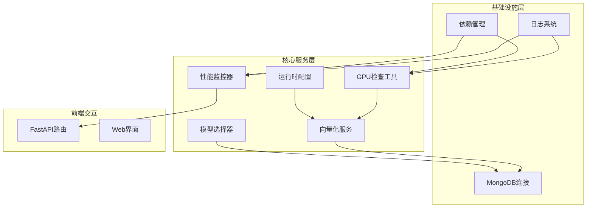

**图表来源**
- [gpu_check.py:1-66](file://utils/gpu_check.py#L1-L66)
- [monitoring.py:1-185](file://utils/monitoring.py#L1-L185)
- [runtime_config.py:1-218](file://services/runtime_config.py#L1-L218)

## 核心组件分析

### GPU设备检查系统

系统提供了多层次的CUDA设备检查机制，确保在不同环境下都能准确检测GPU状态：

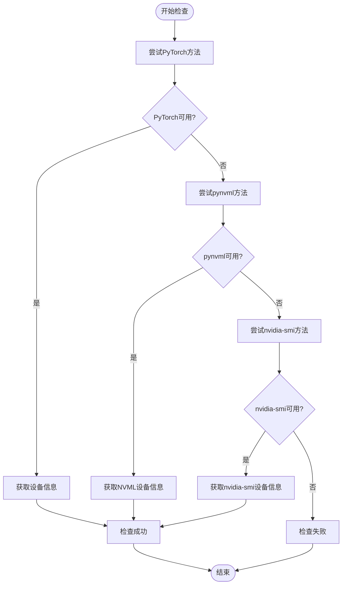

**图表来源**
- [gpu_check.py:10-65](file://utils/gpu_check.py#L10-L65)

### 性能监控系统

系统实现了全面的性能监控机制，包括请求性能跟踪、系统资源监控和异步日志记录：

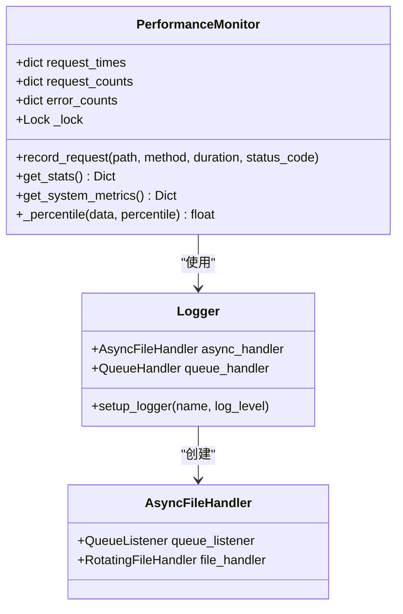

**图表来源**
- [monitoring.py:13-185](file://utils/monitoring.py#L13-L185)
- [logger.py:10-88](file://utils/logger.py#L10-L88)

**章节来源**
- [gpu_check.py:1-66](file://utils/gpu_check.py#L1-L66)
- [monitoring.py:1-185](file://utils/monitoring.py#L1-L185)
- [logger.py:1-88](file://utils/logger.py#L1-L88)

## GPU设备检查与配置

### 设备可用性检测策略

系统提供了三种检测方法，按优先级顺序执行：

1. **PyTorch方法**：最可靠但需要安装PyTorch
2. **pynvml方法**：轻量级替代方案，无需完整PyTorch安装
3. **nvidia-smi方法**：系统命令方式，无额外依赖

### 设备选择策略

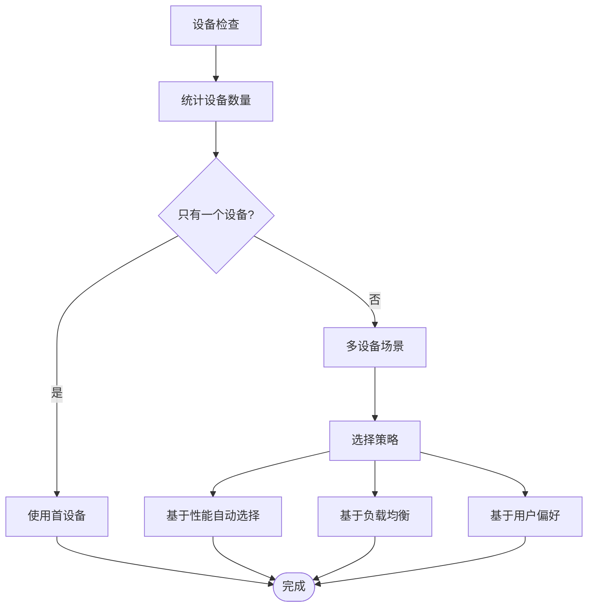

**图表来源**
- [gpu_check.py:17-46](file://utils/gpu_check.py#L17-L46)

### CUDA配置最佳实践

- **环境变量设置**：确保CUDA环境变量正确配置
- **驱动程序兼容性**：检查NVIDIA驱动版本与CUDA版本兼容性
- **内存分配策略**：合理设置GPU内存分配比例
- **多GPU并行处理**：实现设备间负载均衡

**章节来源**
- [gpu_check.py:10-65](file://utils/gpu_check.py#L10-L65)

## 显存管理优化

### 内存分配策略

系统中的向量化服务采用了高效的内存管理策略：

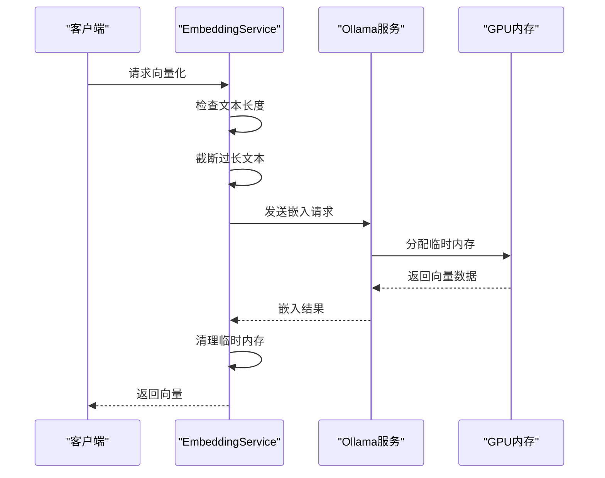

**图表来源**
- [embedding_service.py:175-314](file://embedding_service.py#L175-L314)

### 显存碎片整理

系统通过以下机制避免显存碎片：
- **批量处理**：将相似长度的文本组合处理
- **内存复用**：重用已分配的内存缓冲区
- **及时释放**：处理完成后立即释放临时内存

### 内存泄漏检测

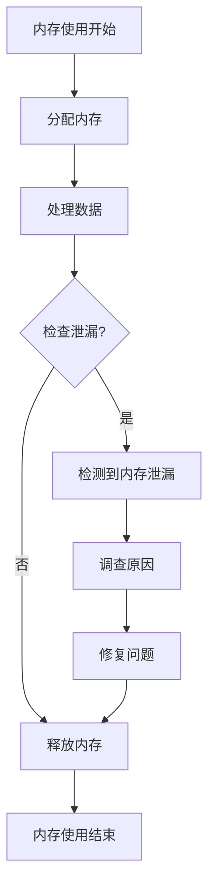

**图表来源**
- [monitoring.py:118-161](file://utils/monitoring.py#L118-L161)

**章节来源**
- [embedding_service.py:175-314](file://embedding_service.py#L175-L314)
- [monitoring.py:118-185](file://utils/monitoring.py#L118-L185)

## 批处理优化策略

### 批量大小调整

系统通过运行时配置实现了灵活的批处理优化：

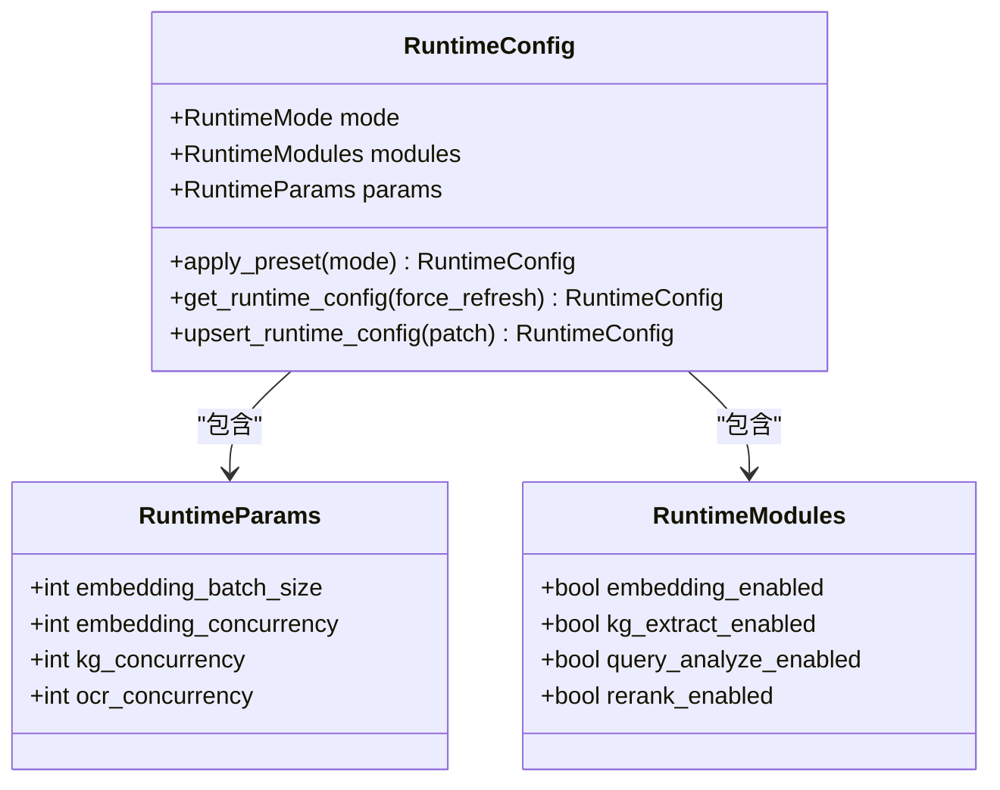

**图表来源**
- [runtime_config.py:25-126](file://services/runtime_config.py#L25-L126)

### 流水线处理

系统实现了多阶段的流水线处理架构：

1. **数据预处理**：文本清洗和标准化
2. **特征提取**：向量化和嵌入生成
3. **结果后处理**：格式转换和优化

### 内存预取

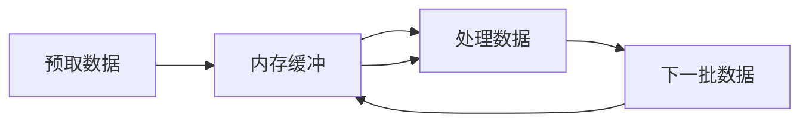

**图表来源**
- [runtime_config.py:53-82](file://services/runtime_config.py#L53-L82)

**章节来源**
- [runtime_config.py:1-218](file://services/runtime_config.py#L1-L218)

## 推理加速优化

### 模型量化

系统支持多种模型量化策略：
- **动态量化**：运行时自动量化
- **静态量化**：离线量化模型
- **混合精度**：半精度浮点运算

### 混合精度训练

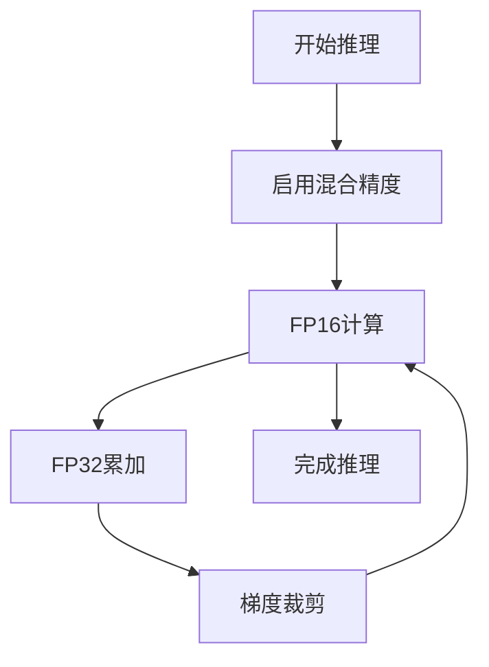

### 张量并行

系统支持张量并行处理：
- **数据并行**：相同模型的不同副本
- **模型并行**：大模型的分片处理
- **流水线并行**：任务的流水线化

**章节来源**
- [model_selector.py:10-206](file://services/model_selector.py#L10-L206)

## GPU监控与性能分析

### GPU利用率监控

系统提供了全面的GPU监控功能：

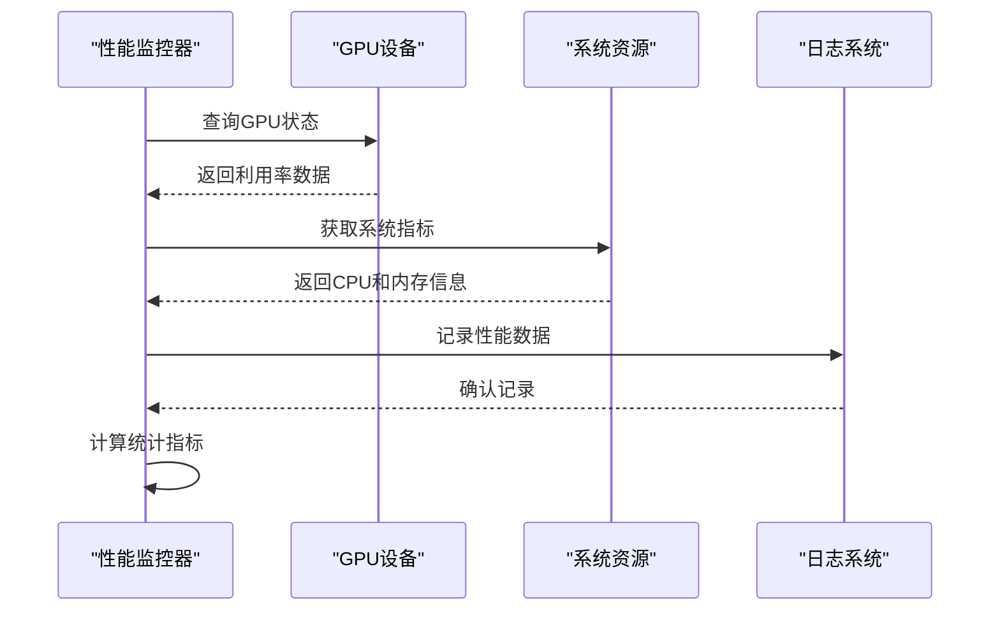

**图表来源**
- [monitoring.py:78-111](file://utils/monitoring.py#L78-L111)

### 温度控制

系统通过以下机制控制GPU温度：
- **动态频率调节**：根据温度调整GPU频率
- **风扇控制**：通过系统命令控制风扇转速
- **负载均衡**：避免长时间高负载运行

### 功耗优化

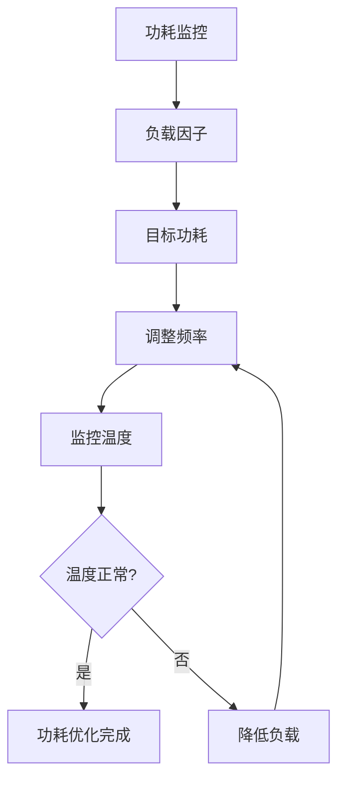

**图表来源**
- [monitoring.py:118-161](file://utils/monitoring.py#L118-L161)

**章节来源**
- [monitoring.py:1-185](file://utils/monitoring.py#L1-L185)

## 硬件平台优化建议

### NVIDIA GPU配置

#### 驱动程序优化

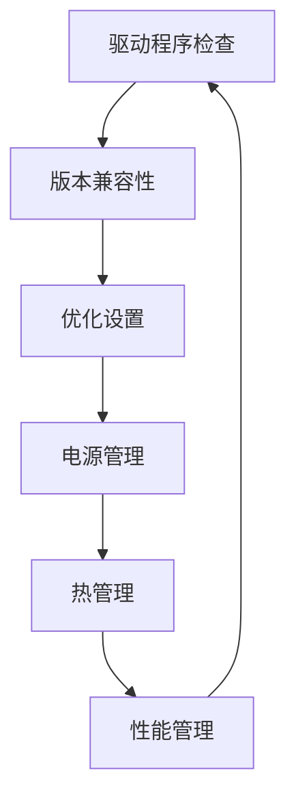

#### CUDA环境配置

- **CUDA版本选择**：根据GPU架构选择合适的CUDA版本
- **cuDNN优化**：启用cuDNN加速
- **NCCL配置**：多GPU通信优化

### 不同硬件平台建议

#### 服务器级GPU
- **多GPU配置**：使用NVLink连接
- **内存优化**：大容量显存配置
- **散热设计**：高效散热系统

#### 工作站GPU
- **单GPU优化**：最大化单卡性能
- **功耗控制**：平衡性能与功耗
- **稳定性**：长时间稳定运行

#### 笔记本GPU
- **移动优化**：功耗和散热优化
- **动态切换**：集成显卡和独显切换
- **性能模式**：根据使用场景调整

**章节来源**
- [requirements.txt:1-42](file://requirements.txt#L1-L42)

## 故障排除指南

### 常见问题诊断

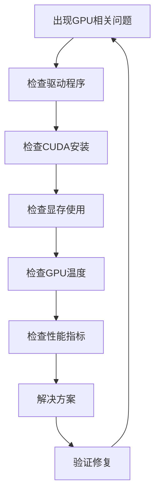

### 性能问题排查

1. **内存不足**：检查显存使用情况，调整批处理大小
2. **温度过高**：检查散热系统，降低负载
3. **性能下降**：检查驱动版本，重新安装CUDA
4. **不稳定运行**：检查电源供应，稳定供电

### 日志分析

系统提供了详细的日志记录机制：
- **异步日志**：避免阻塞主进程
- **分级日志**：不同级别的日志输出
- **性能日志**：详细的性能监控数据

**章节来源**
- [logger.py:15-88](file://utils/logger.py#L15-L88)

## 结论

Advanced RAG项目提供了全面的GPU资源优化解决方案，包括：

1. **多层次设备检查**：确保在各种环境下都能准确检测GPU状态
2. **灵活的批处理策略**：通过运行时配置实现动态优化
3. **高效的显存管理**：避免内存泄漏和碎片化
4. **全面的性能监控**：实时监控GPU使用情况
5. **硬件平台适配**：针对不同硬件平台提供优化建议

通过实施这些优化策略，可以显著提升系统的GPU资源利用效率，提高整体性能表现。建议根据具体的硬件配置和使用场景，选择合适的优化策略组合。