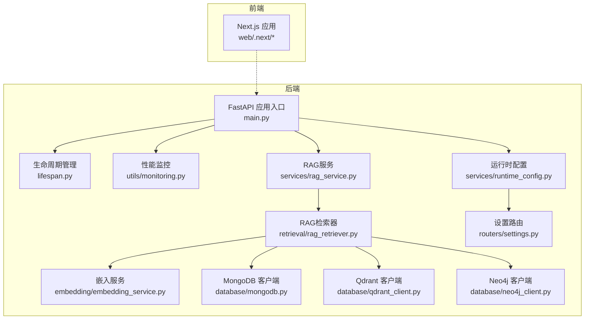
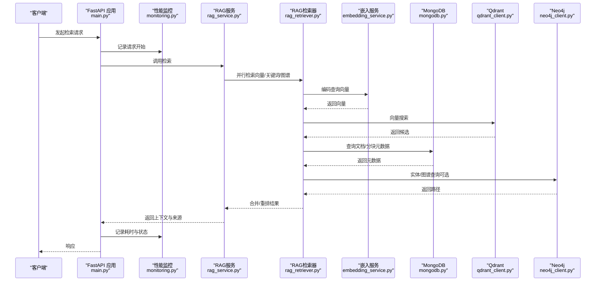
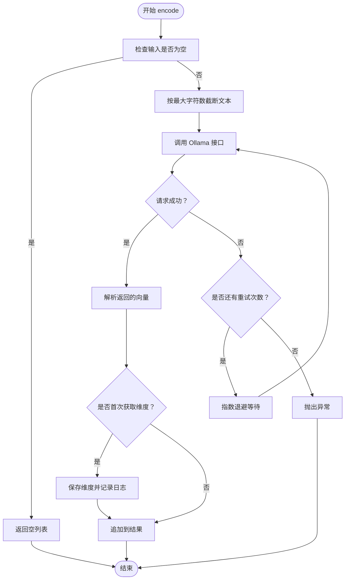
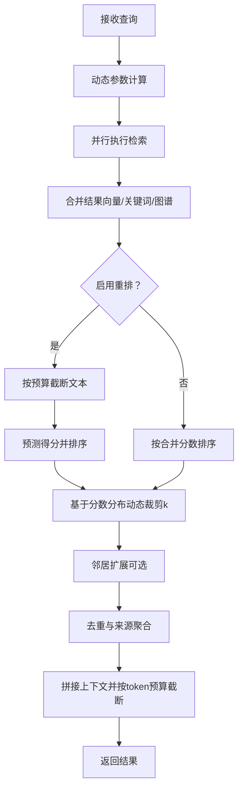
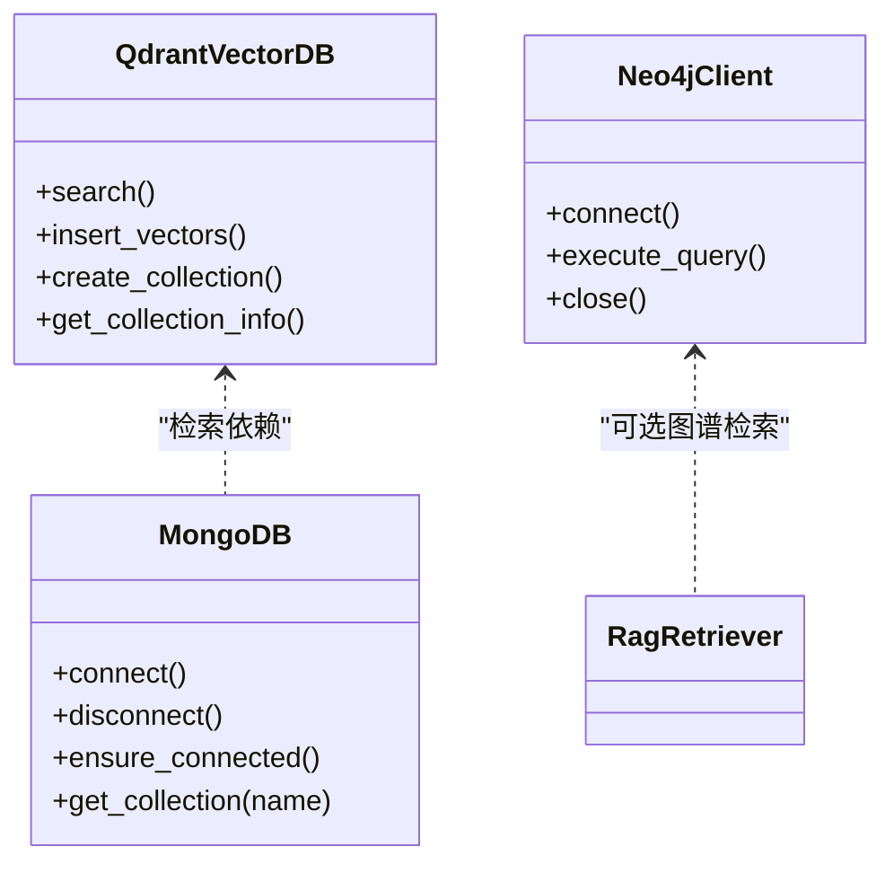
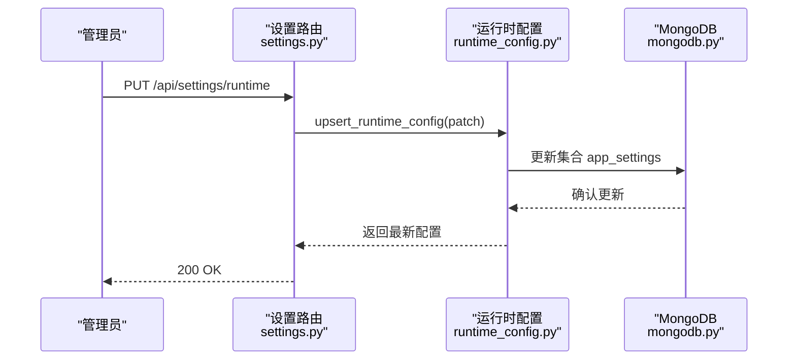
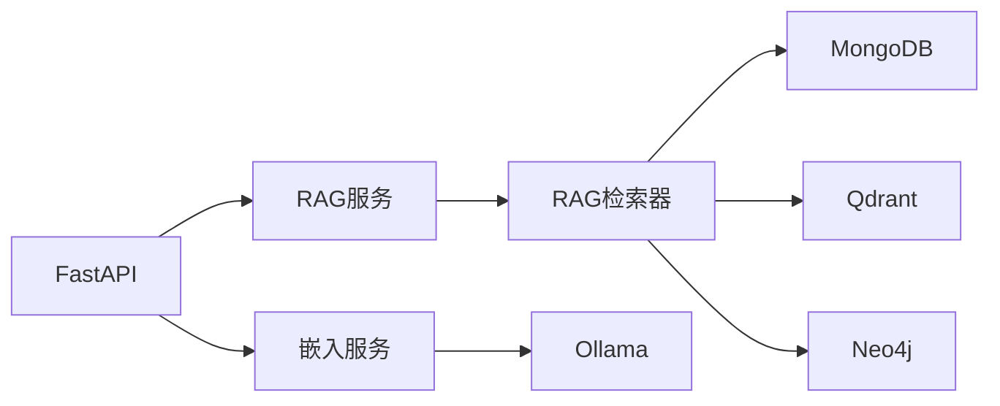

# 内存管理优化

<cite>
**本文引用的文件**
- [main.py](file://main.py)
- [monitoring.py](file://utils/monitoring.py)
- [lifespan.py](file://utils/lifespan.py)
- [embedding_service.py](file://embedding/embedding_service.py)
- [rag_service.py](file://services/rag_service.py)
- [rag_retriever.py](file://retrieval/rag_retriever.py)
- [mongodb.py](file://database/mongodb.py)
- [qdrant_client.py](file://database/qdrant_client.py)
- [neo4j_client.py](file://database/neo4j_client.py)
- [token_utils.py](file://utils/token_utils.py)
- [runtime_config.py](file://services/runtime_config.py)
- [settings.py](file://routers/settings.py)
- [requirements.txt](file://requirements.txt)
</cite>

## 目录
1. [简介](#简介)
2. [项目结构](#项目结构)
3. [核心组件](#核心组件)
4. [架构总览](#架构总览)
5. [详细组件分析](#详细组件分析)
6. [依赖分析](#依赖分析)
7. [性能考虑](#性能考虑)
8. [故障排查指南](#故障排查指南)
9. [结论](#结论)
10. [附录](#附录)

## 简介
本指南聚焦于本项目的内存管理与性能优化，围绕以下主题展开：
- 垃圾回收与内存分配策略：结合Python运行时特性与项目异步/并发设计，给出参数与策略建议。
- 大对象处理：向量化、检索与图谱查询中的大对象内存优化思路（内存池、对象复用、批处理与截断）。
- 内存泄漏检测与修复：工具使用、定位技术与修复策略。
- 内存对齐与缓存行优化：数据结构与算法层面的优化建议。
- 监控与诊断：系统指标采集、峰值检测与性能瓶颈分析。
- 跨平台最佳实践：Linux与Windows下的内存管理要点。

## 项目结构
项目采用FastAPI后端与Next.js前端分离架构，后端通过异步I/O与连接池实现高并发，数据库层包含MongoDB、Qdrant与Neo4j三类存储。整体结构如下：

图表来源
- [main.py:1-171](file://main.py#L1-L171)
- [lifespan.py:1-93](file://utils/lifespan.py#L1-L93)
- [monitoring.py:1-185](file://utils/monitoring.py#L1-L185)
- [embedding_service.py:1-333](file://embedding/embedding_service.py#L1-L333)
- [rag_service.py:1-323](file://services/rag_service.py#L1-L323)
- [rag_retriever.py:1-393](file://retrieval/rag_retriever.py#L1-L393)
- [mongodb.py:1-800](file://database/mongodb.py#L1-L800)
- [qdrant_client.py:1-544](file://database/qdrant_client.py#L1-L544)
- [neo4j_client.py:1-104](file://database/neo4j_client.py#L1-L104)
- [runtime_config.py:128-217](file://services/runtime_config.py#L128-L217)
- [settings.py:38-64](file://routers/settings.py#L38-L64)

章节来源
- [main.py:1-171](file://main.py#L1-L171)
- [requirements.txt:1-42](file://requirements.txt#L1-L42)

## 核心组件
- 应用入口与生命周期：负责环境变量加载、CORS配置、静态文件挂载、路由注册与Uvicorn启动参数（worker数量、keep-alive、并发限制）。
- 性能监控：记录请求耗时、统计P50/P95/P99，采集CPU/内存/磁盘与进程级指标。
- 嵌入服务：封装Ollama向量化接口，包含超时与重试、文本截断与模型规范化。
- RAG服务与检索器：异步并行检索（向量/关键词/图谱），动态裁剪k，重排与邻居扩展。
- 数据库客户端：MongoDB连接池参数、Qdrant gRPC连接与重试、Neo4j驱动连接。
- 运行时配置：动态开关模块与参数，支持热更新与缓存。

章节来源
- [main.py:55-171](file://main.py#L55-L171)
- [monitoring.py:13-185](file://utils/monitoring.py#L13-L185)
- [embedding_service.py:8-333](file://embedding/embedding_service.py#L8-L333)
- [rag_service.py:8-323](file://services/rag_service.py#L8-L323)
- [rag_retriever.py:17-393](file://retrieval/rag_retriever.py#L17-L393)
- [mongodb.py:92-204](file://database/mongodb.py#L92-L204)
- [qdrant_client.py:18-544](file://database/qdrant_client.py#L18-L544)
- [neo4j_client.py:6-104](file://database/neo4j_client.py#L6-L104)
- [runtime_config.py:128-217](file://services/runtime_config.py#L128-L217)

## 架构总览
下图展示RAG检索的关键流程与内存热点：

图表来源
- [main.py:90-100](file://main.py#L90-L100)
- [monitoring.py:163-185](file://utils/monitoring.py#L163-L185)
- [rag_service.py:34-266](file://services/rag_service.py#L34-L266)
- [rag_retriever.py:89-137](file://retrieval/rag_retriever.py#L89-L137)
- [embedding_service.py:175-291](file://embedding/embedding_service.py#L175-L291)
- [mongodb.py:338-800](file://database/mongodb.py#L338-L800)
- [qdrant_client.py:336-413](file://database/qdrant_client.py#L336-L413)
- [neo4j_client.py:40-62](file://database/neo4j_client.py#L40-L62)

## 详细组件分析

### 嵌入服务与内存分配
- 文本截断：通过近似token估算与二分截断，避免超上下文长度导致的异常与内存浪费。
- 超时与重试：对Ollama请求设置超时与指数退避重试，降低瞬时失败对内存压力。
- 向量维度：首次调用时确定维度，避免后续重复探测带来的临时对象开销。

图表来源
- [embedding_service.py:292-314](file://embedding/embedding_service.py#L292-L314)
- [embedding_service.py:175-291](file://embedding/embedding_service.py#L175-L291)
- [token_utils.py:48-72](file://utils/token_utils.py#L48-L72)

章节来源
- [embedding_service.py:175-314](file://embedding/embedding_service.py#L175-L314)
- [token_utils.py:16-72](file://utils/token_utils.py#L16-L72)

### RAG服务与检索器的内存优化
- 动态参数：根据查询特征（对比/列举/条款）动态调整prefetch_k与final_k，减少不必要的候选与重排成本。
- 并行检索：向量、关键词与图谱检索并行执行，使用gather聚合结果，避免顺序阻塞。
- 邻居扩展：对命中chunk拉取前后窗口，注意去重与seen集合增长带来的内存占用。
- 重排与截断：对送入交叉编码器的文本按token预算截断，避免长文本导致的内存峰值。

图表来源
- [rag_service.py:11-32](file://services/rag_service.py#L11-L32)
- [rag_service.py:97-122](file://services/rag_service.py#L97-L122)
- [rag_retriever.py:115-137](file://retrieval/rag_retriever.py#L115-L137)
- [rag_retriever.py:365-391](file://retrieval/rag_retriever.py#L365-L391)
- [token_utils.py:48-72](file://utils/token_utils.py#L48-L72)

章节来源
- [rag_service.py:34-266](file://services/rag_service.py#L34-L266)
- [rag_retriever.py:17-393](file://retrieval/rag_retriever.py#L17-L393)
- [token_utils.py:16-72](file://utils/token_utils.py#L16-L72)

### 数据库连接与内存管理
- MongoDB：配置连接池参数（maxPoolSize/minPoolSize/maxIdleTimeMS/serverSelectionTimeout/connectTimeout/socketTimeout），避免频繁创建/销毁连接导致的GC压力。
- Qdrant：优先使用gRPC连接（端口6334），避免HTTP/httpx的502问题，支持连接复用，降低网络层内存占用。
- Neo4j：驱动连接在首次使用时建立，查询失败时记录日志并释放资源。

图表来源
- [mongodb.py:92-204](file://database/mongodb.py#L92-L204)
- [qdrant_client.py:18-544](file://database/qdrant_client.py#L18-L544)
- [neo4j_client.py:6-104](file://database/neo4j_client.py#L6-L104)

章节来源
- [mongodb.py:122-151](file://database/mongodb.py#L122-L151)
- [qdrant_client.py:66-96](file://database/qdrant_client.py#L66-L96)
- [neo4j_client.py:16-38](file://database/neo4j_client.py#L16-L38)

### 运行时配置与动态优化
- 运行时配置通过MongoDB集合存储，支持高/低/自定义预设与模块开关（如rerank/kg_retrieve）。
- 配置读取带缓存与TTL，避免频繁访问数据库造成的内存抖动。
- 通过设置路由更新配置，实现在线动态调整检索策略。

图表来源
- [settings.py:42-64](file://routers/settings.py#L42-L64)
- [runtime_config.py:191-217](file://services/runtime_config.py#L191-L217)
- [mongodb.py:140-151](file://database/mongodb.py#L140-L151)

章节来源
- [settings.py:38-64](file://routers/settings.py#L38-L64)
- [runtime_config.py:140-161](file://services/runtime_config.py#L140-L161)

## 依赖分析
- 第三方依赖集中在数据库、向量与文本处理领域，异步客户端与高性能网络库广泛使用，有助于降低阻塞与提升吞吐。
- 嵌入服务依赖Ollama，需关注其内存占用与模型加载行为；检索器依赖Qdrant与MongoDB，需合理配置连接池与查询参数。

图表来源
- [requirements.txt:4-42](file://requirements.txt#L4-L42)
- [embedding_service.py:26-44](file://embedding/embedding_service.py#L26-L44)
- [rag_retriever.py:45-49](file://retrieval/rag_retriever.py#L45-L49)

章节来源
- [requirements.txt:1-42](file://requirements.txt#L1-L42)

## 性能考虑
- 垃圾回收与内存分配
  - Python默认采用分代GC，建议在生产环境中使用多worker（主进程中已设置）并合理配置keep-alive与并发限制，减少频繁创建/销毁对象带来的GC压力。
  - 对大对象（向量、文本）采用批处理与截断策略，避免一次性构造超大对象。
  - 使用连接池与连接复用（MongoDB、Qdrant gRPC），降低网络层与连接对象的内存占用。
- 大对象处理
  - 向量化：通过文本截断与超时重试，避免超长文本导致的内存峰值与超时。
  - 检索：prefetch_k与final_k动态调整，减少候选集规模；重排前按预算截断文本。
  - 图谱：按实体查询一跳邻居，限制返回数量，避免生成过大的路径文本。
- 内存对齐与缓存行
  - 数据结构上尽量使用紧凑的列表/字典，避免嵌套过深；在高频路径中减少临时对象创建。
  - 对于数值向量，尽量使用连续内存布局的数据结构（如NumPy数组）以提升缓存命中率（可在外部库中实现）。
- 监控与诊断
  - 使用性能监控器记录请求耗时与错误，结合系统指标（CPU/内存/磁盘）定位瓶颈。
  - 对慢请求进行告警，辅助定位热点接口与异常响应。

## 故障排查指南
- 嵌入服务异常
  - 现象：Ollama超时/连接错误/模型未找到。
  - 处理：检查环境变量与模型名称规范化；启用重试与指数退避；必要时切换到其他embedding模型。
- 检索性能下降
  - 现象：向量搜索耗时增加、重排延迟高。
  - 处理：调整prefetch_k/final_k；开启/关闭重排；对长文本进行token预算截断。
- 数据库连接问题
  - 现象：MongoDB/Qdrant连接失败或超时。
  - 处理：检查连接池参数与网络可达性；Qdrant优先使用gRPC；MongoDB连接失败时启用重试。
- 运行时配置未生效
  - 现象：修改设置后检索行为未变化。
  - 处理：确认配置缓存TTL与刷新逻辑；检查集合app_settings的写入与读取。

章节来源
- [embedding_service.py:259-291](file://embedding/embedding_service.py#L259-L291)
- [rag_retriever.py:139-167](file://retrieval/rag_retriever.py#L139-L167)
- [mongodb.py:122-151](file://database/mongodb.py#L122-L151)
- [qdrant_client.py:66-96](file://database/qdrant_client.py#L66-L96)
- [runtime_config.py:140-161](file://services/runtime_config.py#L140-L161)

## 结论
本项目的内存管理优化重点在于：通过连接池与连接复用降低网络层开销，通过动态参数与预算截断控制候选规模与文本长度，通过运行时配置实现在线调优。配合性能监控与系统指标采集，可有效识别与缓解内存峰值与性能瓶颈。

## 附录
- 不同操作系统下的内存管理最佳实践
  - Linux
    - 使用多worker与合理的keep-alive超时，结合系统ulimit与cgroup限制，避免内存溢出。
    - 监控/内存压力测试：使用top/htop/pmap与perf工具定位内存热点。
  - Windows
    - 关注进程内存碎片与堆大小，避免频繁的大对象分配；使用Windows性能分析器定位泄漏。
- 垃圾回收配置优化建议
  - Python：在生产环境使用多worker，避免单进程高并发导致的GC停顿；合理设置对象生命周期，减少长生命周期缓存。
  - 外部服务：为Ollama/Qdrant/MongoDB设置合适的超时与重试，避免长时间持有大对象。
- 内存泄漏检测与修复
  - 工具：tracemalloc/gc.get_objects()、memory_profiler、py-spy。
  - 技术：定位未释放的连接/句柄、未清理的缓存、未关闭的文件/流。
  - 修复：确保finally/上下文管理器正确释放资源；对大对象使用弱引用或分页处理。