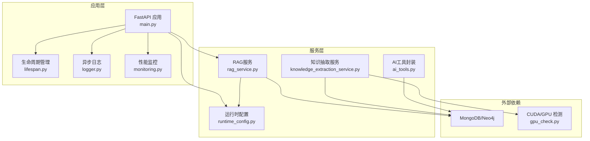
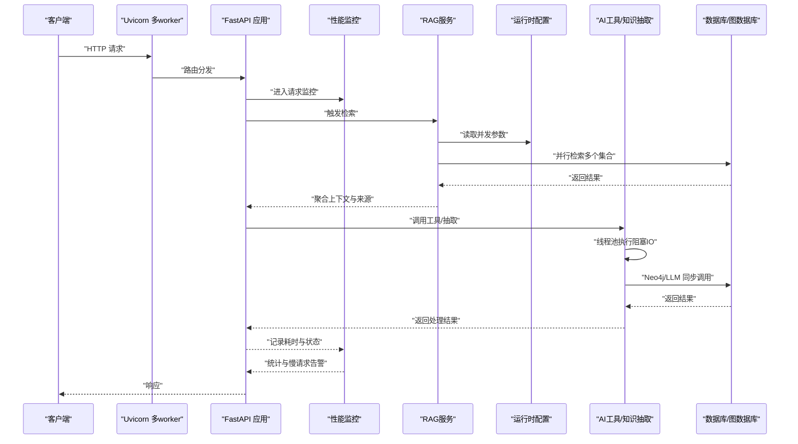
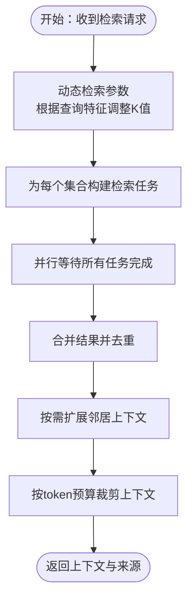
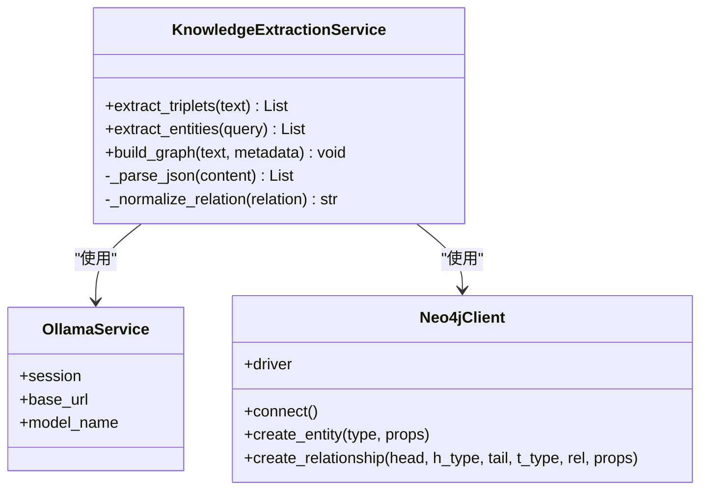
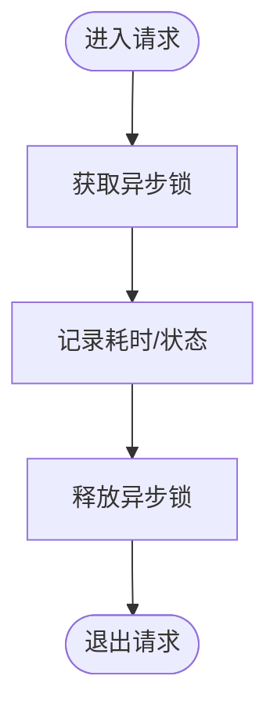
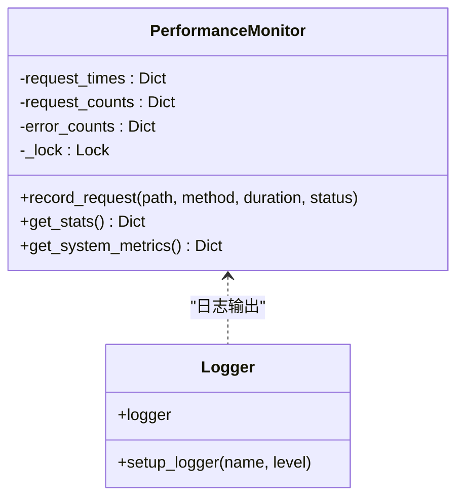
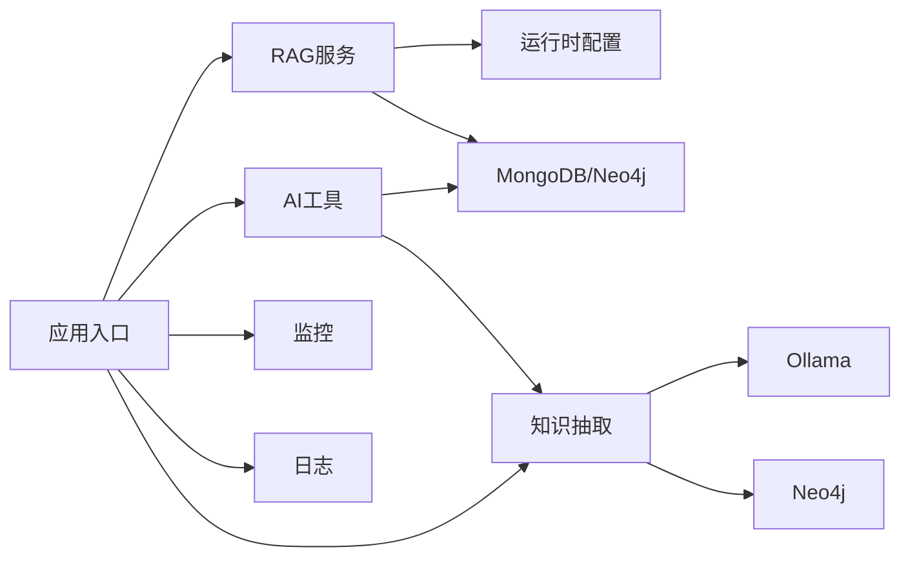

# 并发处理优化

<cite>
**本文引用的文件**
- [main.py](file://main.py)
- [monitoring.py](file://utils/monitoring.py)
- [logger.py](file://utils/logger.py)
- [lifespan.py](file://utils/lifespan.py)
- [runtime_config.py](file://services/runtime_config.py)
- [rag_service.py](file://services/rag_service.py)
- [knowledge_extraction_service.py](file://services/knowledge_extraction_service.py)
- [ai_tools.py](file://services/ai_tools.py)
- [gpu_check.py](file://utils/gpu_check.py)
</cite>

## 目录
1. [引言](#引言)
2. [项目结构](#项目结构)
3. [核心组件](#核心组件)
4. [架构总览](#架构总览)
5. [详细组件分析](#详细组件分析)
6. [依赖分析](#依赖分析)
7. [性能考虑](#性能考虑)
8. [故障排查指南](#故障排查指南)
9. [结论](#结论)
10. [附录](#附录)

## 引言
本指南围绕并发处理性能优化展开，结合代码库中的实际实现，系统讲解异步IO配置、协程管理、任务调度策略；线程池配置与阻塞检测；CPU密集型任务的进程/线程分离与并行优化；GIL影响与应对方案（C扩展与多进程）；并发安全（锁、无锁与原子操作）；以及并发监控与调试工具（性能分析器与死锁检测建议）。目标是在保证正确性的前提下，最大化吞吐、降低延迟并提升稳定性。

## 项目结构
该项目基于FastAPI + Uvicorn多worker部署，采用异步IO与线程池相结合的方式处理I/O密集型与CPU密集型任务。关键特性包括：
- 应用生命周期管理与数据库连接重试
- 性能监控与系统指标采集
- 运行时配置（含并发参数）与缓存
- RAG检索与知识抽取的异步并行
- 日志系统的异步写入以避免阻塞
- 工具函数的线程池执行以避免阻塞事件循环



**图表来源**
- [main.py:129-171](file://main.py#L129-L171)
- [lifespan.py:28-93](file://utils/lifespan.py#L28-L93)
- [logger.py:15-88](file://utils/logger.py#L15-L88)
- [monitoring.py:13-185](file://utils/monitoring.py#L13-L185)
- [runtime_config.py:140-218](file://services/runtime_config.py#L140-L218)
- [rag_service.py:34-323](file://services/rag_service.py#L34-L323)
- [knowledge_extraction_service.py:12-229](file://services/knowledge_extraction_service.py#L12-L229)
- [ai_tools.py:171-204](file://services/ai_tools.py#L171-L204)
- [gpu_check.py:10-66](file://utils/gpu_check.py#L10-L66)

**章节来源**
- [main.py:129-171](file://main.py#L129-L171)
- [lifespan.py:28-93](file://utils/lifespan.py#L28-L93)
- [logger.py:15-88](file://utils/logger.py#L15-L88)
- [monitoring.py:13-185](file://utils/monitoring.py#L13-L185)
- [runtime_config.py:140-218](file://services/runtime_config.py#L140-L218)
- [rag_service.py:34-323](file://services/rag_service.py#L34-L323)
- [knowledge_extraction_service.py:12-229](file://services/knowledge_extraction_service.py#L12-L229)
- [ai_tools.py:171-204](file://services/ai_tools.py#L171-L204)
- [gpu_check.py:10-66](file://utils/gpu_check.py#L10-L66)

## 核心组件
- 应用入口与Uvicorn多worker：通过环境变量控制worker数量、并发连接数与keep-alive超时，适配高并发场景。
- 生命周期管理：启动阶段带重试的数据库连接，失败不阻塞服务启动，便于本地调试。
- 性能监控：异步请求计时、慢请求告警、系统指标采集（CPU/内存/磁盘）。
- 运行时配置：低/高预设模式与参数合并，支持嵌入、OCR、KG等模块并发参数的集中管理。
- RAG服务：异步并行检索多个知识空间集合，聚合结果并进行上下文裁剪。
- 知识抽取：将同步IO（LLM/Neo4j）放入线程池，避免阻塞事件循环。
- AI工具：区分异步与同步工具，同步工具通过线程池执行。
- 日志系统：异步队列写入，避免I/O阻塞主线程。

**章节来源**
- [main.py:129-171](file://main.py#L129-L171)
- [lifespan.py:8-26](file://utils/lifespan.py#L8-L26)
- [monitoring.py:13-185](file://utils/monitoring.py#L13-L185)
- [runtime_config.py:86-127](file://services/runtime_config.py#L86-L127)
- [rag_service.py:97-122](file://services/rag_service.py#L97-L122)
- [knowledge_extraction_service.py:48-70](file://services/knowledge_extraction_service.py#L48-L70)
- [ai_tools.py:171-204](file://services/ai_tools.py#L171-L204)
- [logger.py:15-88](file://utils/logger.py#L15-L88)

## 架构总览
下图展示并发相关的关键交互：FastAPI接收请求，通过中间件与监控器记录耗时；RAG服务并行检索多个集合；知识抽取与工具调用通过线程池隔离阻塞；运行时配置提供并发参数；日志异步写入；生命周期管理保障数据库连接可靠性。



**图表来源**
- [main.py:129-171](file://main.py#L129-L171)
- [monitoring.py:163-184](file://utils/monitoring.py#L163-L184)
- [rag_service.py:97-122](file://services/rag_service.py#L97-L122)
- [runtime_config.py:140-162](file://services/runtime_config.py#L140-L162)
- [knowledge_extraction_service.py:48-70](file://services/knowledge_extraction_service.py#L48-L70)
- [ai_tools.py:171-204](file://services/ai_tools.py#L171-L204)

## 详细组件分析

### 异步IO与协程管理
- 异步请求处理：FastAPI路由与服务均为异步，配合Uvicorn多worker实现高并发。
- 并行任务：RAG服务对多个知识空间集合并行检索，使用聚合等待收集结果。
- 线程池隔离：知识抽取与工具调用中的同步IO（LLM/Neo4j）通过线程池执行，避免阻塞事件循环。
- 上下文管理：请求监控上下文在进入与退出时统一记录耗时与状态码。



**图表来源**
- [rag_service.py:11-33](file://services/rag_service.py#L11-L33)
- [rag_service.py:111-122](file://services/rag_service.py#L111-L122)
- [rag_service.py:183-266](file://services/rag_service.py#L183-L266)

**章节来源**
- [main.py:129-171](file://main.py#L129-L171)
- [rag_service.py:97-122](file://services/rag_service.py#L97-L122)
- [knowledge_extraction_service.py:48-70](file://services/knowledge_extraction_service.py#L48-L70)
- [ai_tools.py:171-204](file://services/ai_tools.py#L171-L204)
- [monitoring.py:163-184](file://utils/monitoring.py#L163-L184)

### 线程池配置与阻塞检测
- 线程池使用：将requests等同步IO放入线程池，避免阻塞事件循环。
- 阻塞检测：通过慢请求告警与系统指标监控识别潜在阻塞点。
- 生命周期重试：数据库连接失败不阻塞服务启动，便于定位与恢复。

```mermaid
sequenceDiagram
participant Svc as "服务"
participant Loop as "事件循环"
participant Pool as "线程池"
participant IO as "同步IO(网络/数据库)"
Svc->>Loop : "await asyncio.to_thread(...)"
Loop->>Pool : "提交阻塞任务"
Pool->>IO : "执行同步调用"
IO-->>Pool : "返回结果"
Pool-->>Loop : "回调结果"
Loop-->>Svc : "继续异步流程"
```

**图表来源**
- [knowledge_extraction_service.py:48-70](file://services/knowledge_extraction_service.py#L48-L70)
- [ai_tools.py:171-204](file://services/ai_tools.py#L171-L204)

**章节来源**
- [knowledge_extraction_service.py:48-70](file://services/knowledge_extraction_service.py#L48-L70)
- [ai_tools.py:171-204](file://services/ai_tools.py#L171-L204)
- [monitoring.py:178-183](file://utils/monitoring.py#L178-L183)
- [lifespan.py:8-26](file://utils/lifespan.py#L8-L26)

### CPU密集型任务优化
- 任务分解：将LLM生成、JSON解析、图谱构建等步骤拆分为独立异步方法，便于并行与缓存。
- 并行策略：对多个知识空间集合并行检索；对三元组抽取与关系创建采用逐条处理，避免单点阻塞。
- 资源隔离：通过线程池隔离同步IO，避免与CPU密集计算共享事件循环。
- GPU检测：提供CUDA可用性检测工具，便于在具备GPU时启用加速路径（如向量化服务）。



**图表来源**
- [knowledge_extraction_service.py:12-229](file://services/knowledge_extraction_service.py#L12-L229)

**章节来源**
- [knowledge_extraction_service.py:12-229](file://services/knowledge_extraction_service.py#L12-L229)
- [gpu_check.py:10-66](file://utils/gpu_check.py#L10-L66)

### GIL影响与解决方案
- GIL背景：Python CPython受GIL限制，CPU密集型任务难以利用多核并行。
- 解决方案：
  - C扩展：将计算密集部分用C/Cython扩展实现（如向量化、相似度计算）。
  - 多进程：使用进程池替代线程池，绕过GIL限制；适合大规模CPU计算。
  - 异步+线程池：对I/O密集部分保持异步，对阻塞的同步调用放入线程池。
- 本项目实践：知识抽取与工具调用通过线程池隔离阻塞IO；RAG检索为I/O主导，采用异步并行。

**章节来源**
- [knowledge_extraction_service.py:48-70](file://services/knowledge_extraction_service.py#L48-L70)
- [ai_tools.py:171-204](file://services/ai_tools.py#L171-L204)
- [gpu_check.py:10-66](file://utils/gpu_check.py#L10-L66)

### 并发安全优化
- 锁机制：性能监控器使用异步锁保护共享状态，避免竞态。
- 无锁数据结构：运行时配置缓存使用线程锁保护全局缓存，避免并发写入冲突。
- 原子操作：通过队列与上下文管理器确保请求监控的原子记录与释放。
- 死锁预防：避免在事件循环中执行长时间阻塞操作；将阻塞IO放入线程池；合理设置超时与重试。



**图表来源**
- [monitoring.py:20-48](file://utils/monitoring.py#L20-L48)
- [monitoring.py:163-184](file://utils/monitoring.py#L163-L184)

**章节来源**
- [monitoring.py:13-185](file://utils/monitoring.py#L13-L185)
- [runtime_config.py:129-132](file://services/runtime_config.py#L129-L132)

### 并发监控与调试
- 请求级监控：装饰器与上下文管理器自动记录请求耗时、状态码与慢请求告警。
- 系统级指标：CPU、内存、磁盘占用与进程级指标采集，辅助定位瓶颈。
- 日志异步：异步队列写入避免I/O阻塞，生产环境可降低日志级别以减少开销。
- 调试建议：结合慢请求告警与系统指标，逐步定位阻塞点；对热点路径增加并发参数与缓存。



**图表来源**
- [monitoring.py:13-112](file://utils/monitoring.py#L13-L112)
- [logger.py:15-88](file://utils/logger.py#L15-L88)

**章节来源**
- [monitoring.py:13-185](file://utils/monitoring.py#L13-L185)
- [logger.py:15-88](file://utils/logger.py#L15-L88)

## 依赖分析
- 组件耦合：RAG服务依赖运行时配置与数据库；知识抽取服务依赖LLM与图数据库；AI工具封装统一调度异步与同步工具。
- 外部依赖：MongoDB/Neo4j、Ollama、psutil、nvidia-smi/pynvml等。
- 循环依赖：未发现明显循环依赖，模块职责清晰。



**图表来源**
- [rag_service.py:60-67](file://services/rag_service.py#L60-L67)
- [runtime_config.py:140-162](file://services/runtime_config.py#L140-L162)
- [knowledge_extraction_service.py:17-20](file://services/knowledge_extraction_service.py#L17-L20)
- [ai_tools.py:171-204](file://services/ai_tools.py#L171-L204)
- [main.py:129-171](file://main.py#L129-L171)
- [monitoring.py:13-185](file://utils/monitoring.py#L13-L185)
- [logger.py:15-88](file://utils/logger.py#L15-L88)

**章节来源**
- [rag_service.py:60-67](file://services/rag_service.py#L60-L67)
- [runtime_config.py:140-162](file://services/runtime_config.py#L140-L162)
- [knowledge_extraction_service.py:17-20](file://services/knowledge_extraction_service.py#L17-L20)
- [ai_tools.py:171-204](file://services/ai_tools.py#L171-L204)
- [main.py:129-171](file://main.py#L129-L171)
- [monitoring.py:13-185](file://utils/monitoring.py#L13-L185)
- [logger.py:15-88](file://utils/logger.py#L15-L88)

## 性能考虑
- 异步IO优先：I/O密集路径保持异步，减少线程切换开销。
- 并行策略：对多个集合/任务并行，但需控制并发度，避免资源争用。
- 缓存与降级：运行时配置缓存与TTL控制；慢请求与错误统计辅助快速降级。
- 资源隔离：阻塞IO放入线程池；CPU密集计算考虑多进程。
- 监控先行：通过慢请求与系统指标持续优化参数与容量。

## 故障排查指南
- 慢请求定位：关注慢请求告警与统计信息，定位热点接口与耗时环节。
- I/O阻塞：检查是否存在长阻塞的同步调用；必要时迁移至线程池或异步实现。
- 数据库连接：启动阶段带重试，失败不影响服务启动；检查URI与网络连通性。
- 日志噪声：生产环境降低日志级别，避免I/O成为瓶颈。
- GPU可用性：使用CUDA检测工具确认设备状态，按需启用加速路径。

**章节来源**
- [monitoring.py:178-183](file://utils/monitoring.py#L178-L183)
- [lifespan.py:8-26](file://utils/lifespan.py#L8-L26)
- [logger.py:77-81](file://utils/logger.py#L77-L81)
- [gpu_check.py:10-66](file://utils/gpu_check.py#L10-L66)

## 结论
本项目通过Uvicorn多worker、异步IO、线程池隔离与运行时配置，实现了I/O密集场景下的高并发与稳定性。针对CPU密集型任务，采用线程池与多进程思路（建议）进行解耦。配合性能监控与系统指标，可有效定位瓶颈并持续优化。建议在后续迭代中引入更细粒度的并发参数与缓存策略，并完善死锁检测与性能分析工具链。

## 附录
- 并发参数建议（结合运行时配置）：
  - 嵌入并发与批大小：根据GPU/CPU能力与内存上限调整。
  - OCR并发：按设备能力与输入规模配置。
  - KG并发：根据图数据库吞吐与查询复杂度调节。
- 死锁检测与性能分析：
  - 使用异步锁时避免在回调中再次获取锁。
  - 结合系统指标与慢请求统计，逐步收敛并发度。
  - 对热点路径增加缓存与限流，避免雪崩效应。