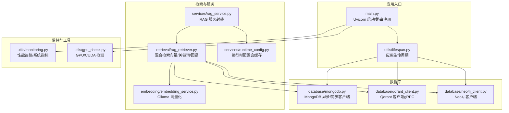
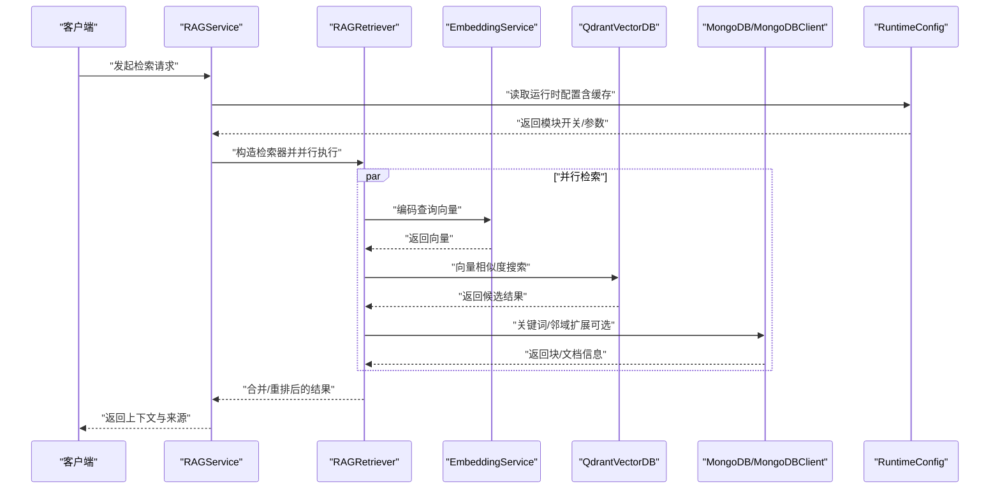
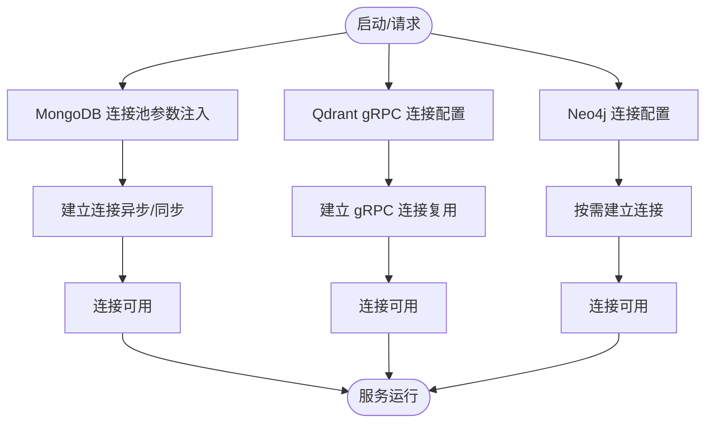
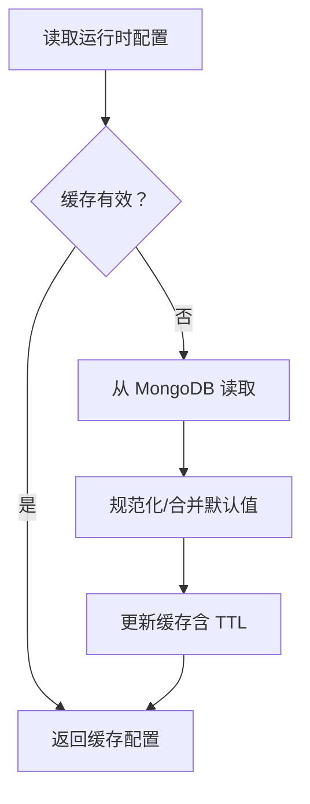
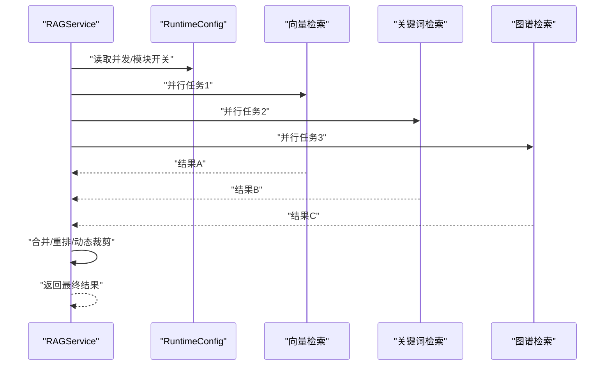
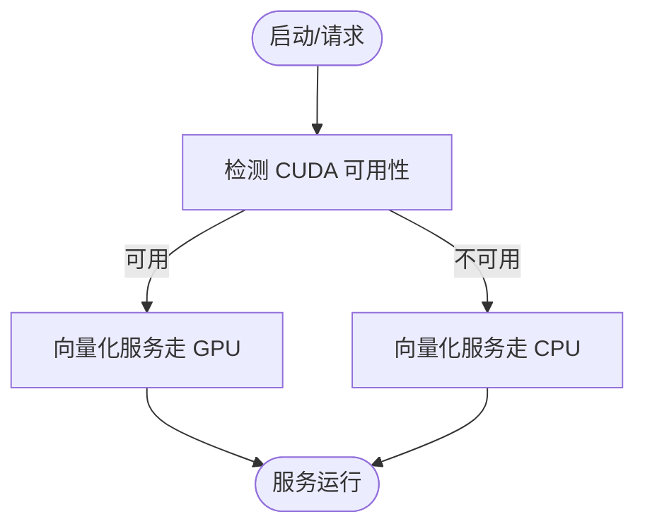
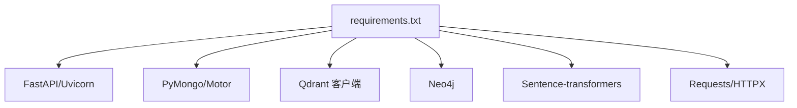

# 性能优化

<cite>
**本文引用的文件**
- [main.py](file://main.py)
- [lifespan.py](file://utils/lifespan.py)
- [mongodb.py](file://database/mongodb.py)
- [qdrant_client.py](file://database/qdrant_client.py)
- [neo4j_client.py](file://database/neo4j_client.py)
- [embedding_service.py](file://embedding/embedding_service.py)
- [rag_retriever.py](file://retrieval/rag_retriever.py)
- [rag_service.py](file://services/rag_service.py)
- [runtime_config.py](file://services/runtime_config.py)
- [monitoring.py](file://utils/monitoring.py)
- [gpu_check.py](file://utils/gpu_check.py)
- [requirements.txt](file://requirements.txt)
</cite>

## 目录
1. [简介](#简介)
2. [项目结构](#项目结构)
3. [核心组件](#核心组件)
4. [架构总览](#架构总览)
5. [详细组件分析](#详细组件分析)
6. [依赖分析](#依赖分析)
7. [性能考虑](#性能考虑)
8. [故障排查指南](#故障排查指南)
9. [结论](#结论)
10. [附录](#附录)

## 简介
本指南面向 Advanced RAG 项目的性能优化，围绕数据库连接池、缓存策略、并发处理、GPU/CPU 资源利用、内存管理、性能基准测试与系统资源监控等方面，结合代码实现给出可落地的优化建议与最佳实践。内容既适用于生产部署，也适用于开发调试场景。

## 项目结构
后端采用 FastAPI + Uvicorn，数据库层包含 MongoDB（异步/同步）、Qdrant 向量库、Neo4j 图数据库；检索链路由 RAG 检索器与运行时配置驱动；性能监控与 GPU 检测工具辅助观测系统状态。

图表来源
- [main.py:55-171](file://main.py#L55-L171)
- [lifespan.py:28-93](file://utils/lifespan.py#L28-L93)
- [mongodb.py:92-204](file://database/mongodb.py#L92-L204)
- [qdrant_client.py:18-123](file://database/qdrant_client.py#L18-L123)
- [neo4j_client.py:6-104](file://database/neo4j_client.py#L6-L104)
- [embedding_service.py:8-333](file://embedding/embedding_service.py#L8-L333)
- [rag_retriever.py:17-393](file://retrieval/rag_retriever.py#L17-L393)
- [rag_service.py:8-323](file://services/rag_service.py#L8-L323)
- [runtime_config.py:140-218](file://services/runtime_config.py#L140-L218)
- [monitoring.py:13-185](file://utils/monitoring.py#L13-L185)
- [gpu_check.py:10-66](file://utils/gpu_check.py#L10-L66)

章节来源
- [main.py:55-171](file://main.py#L55-L171)
- [lifespan.py:28-93](file://utils/lifespan.py#L28-L93)

## 核心组件
- 数据库连接池
  - MongoDB：异步 Motor 客户端与同步 PyMongo 客户端均支持连接池参数配置，包含最大/最小池大小、空闲超时、选择服务器/连接/套接字超时等。
  - Qdrant：优先使用 gRPC（端口 6334）以获得连接复用与更低延迟；支持超时配置与重试。
  - Neo4j：GraphDatabase 驱动，按需连接与会话执行查询。
- 缓存策略
  - 运行时配置采用内存缓存 + TTL，降低频繁读取 MongoDB 的开销。
  - 前端 Next.js 使用内置缓存生命周期配置，适合静态资源与页面缓存。
- 并发处理
  - Uvicorn 多 worker 模式，生产环境默认 24 个 worker；支持通过环境变量覆盖。
  - 检索链路使用 asyncio.gather 并行执行多种检索策略，提升响应速度。
- GPU/CPU 资源
  - 向量化服务通过 Ollama 接口调用，可结合本地 CPU/GPU；GPU 检测工具提供跨平台 CUDA 可用性检查。
- 监控与可观测性
  - 性能监控器记录请求耗时、错误计数与系统 CPU/内存/磁盘指标；支持装饰器与上下文管理器两种埋点方式。

章节来源
- [mongodb.py:122-184](file://database/mongodb.py#L122-L184)
- [qdrant_client.py:66-123](file://database/qdrant_client.py#L66-L123)
- [neo4j_client.py:16-63](file://database/neo4j_client.py#L16-L63)
- [runtime_config.py:129-161](file://services/runtime_config.py#L129-L161)
- [main.py:142-171](file://main.py#L142-L171)
- [rag_retriever.py:115-137](file://retrieval/rag_retriever.py#L115-L137)
- [embedding_service.py:26-44](file://embedding/embedding_service.py#L26-L44)
- [gpu_check.py:10-66](file://utils/gpu_check.py#L10-L66)
- [monitoring.py:13-185](file://utils/monitoring.py#L13-L185)

## 架构总览
下图展示检索主链路与关键依赖，突出连接复用、并行检索与运行时配置对性能的影响。

图表来源
- [rag_service.py:34-266](file://services/rag_service.py#L34-L266)
- [rag_retriever.py:89-137](file://retrieval/rag_retriever.py#L89-L137)
- [embedding_service.py:292-318](file://embedding/embedding_service.py#L292-L318)
- [qdrant_client.py:336-413](file://database/qdrant_client.py#L336-L413)
- [runtime_config.py:140-161](file://services/runtime_config.py#L140-L161)

## 详细组件分析

### 数据库连接池与连接复用
- MongoDB
  - 异步客户端（Motor）与同步客户端（PyMongo）均支持连接池参数，包括最大/最小池大小、最大空闲时间、服务器选择/连接/套接字超时等。
  - 连接字符串在启动时合并连接池参数，确保连接复用与稳定性。
  - 生命周期管理：应用启动时尝试连接，失败不阻塞服务启动；关闭时统一释放连接。
- Qdrant
  - 优先使用 gRPC（端口 6334）以获得连接复用与更低延迟；HTTP 连接将被重定向到 gRPC 端口。
  - 支持超时配置与重试；集合维度不匹配时自动重建集合。
- Neo4j
  - GraphDatabase 驱动按需连接，执行查询时使用会话；容器内访问宿主机时自动替换 URI。

图表来源
- [mongodb.py:122-184](file://database/mongodb.py#L122-L184)
- [mongodb.py:186-194](file://database/mongodb.py#L186-L194)
- [qdrant_client.py:66-123](file://database/qdrant_client.py#L66-L123)
- [neo4j_client.py:16-38](file://database/neo4j_client.py#L16-L38)

章节来源
- [mongodb.py:92-204](file://database/mongodb.py#L92-L204)
- [mongodb.py:230-336](file://database/mongodb.py#L230-L336)
- [qdrant_client.py:18-123](file://database/qdrant_client.py#L18-L123)
- [neo4j_client.py:6-104](file://database/neo4j_client.py#L6-L104)
- [lifespan.py:8-25](file://utils/lifespan.py#L8-L25)

### 缓存策略优化
- 运行时配置缓存
  - 采用内存缓存 + TTL（默认 10 秒），降低 MongoDB 读取频率；支持异步/同步读取路径。
  - 配置项涵盖模块开关（如重排、图谱检索）与参数（如向量化 batch、并发）。
- 前端缓存
  - Next.js 提供多档缓存生命周期配置，适合静态资源与页面缓存，减少重复请求。

图表来源
- [runtime_config.py:140-161](file://services/runtime_config.py#L140-L161)
- [runtime_config.py:164-188](file://services/runtime_config.py#L164-L188)
- [runtime_config.py:135-138](file://services/runtime_config.py#L135-L138)

章节来源
- [runtime_config.py:140-218](file://services/runtime_config.py#L140-L218)

### 并发处理优化
- Uvicorn 多 worker
  - 生产环境默认 24 个 worker；可通过环境变量覆盖；限制并发连接数与 keep-alive 超时以适配大文件上传。
- 检索链路并行
  - 使用 asyncio.gather 并行执行向量检索、关键词检索与图谱检索，显著缩短端到端延迟。
- 运行时参数
  - 通过运行时配置调整图谱并发、向量化 batch 与并发度，平衡吞吐与资源占用。

图表来源
- [main.py:142-171](file://main.py#L142-L171)
- [rag_retriever.py:115-137](file://retrieval/rag_retriever.py#L115-L137)
- [runtime_config.py:63-83](file://services/runtime_config.py#L63-L83)

章节来源
- [main.py:142-171](file://main.py#L142-L171)
- [rag_retriever.py:89-137](file://retrieval/rag_retriever.py#L89-L137)
- [runtime_config.py:63-83](file://services/runtime_config.py#L63-L83)

### GPU 资源利用优化
- 向量化服务
  - 通过 Ollama 接口调用嵌入模型；可在本地 CPU/GPU 环境中运行，具体取决于 Ollama 服务配置。
- GPU 检测
  - 提供跨平台 CUDA 可用性检查，优先使用 PyTorch，其次 pynvml，最后 nvidia-smi。
- 建议
  - 在 GPU 环境部署 Ollama 服务并确保模型加载到 GPU；监控显存占用与推理延迟。

图表来源
- [gpu_check.py:10-66](file://utils/gpu_check.py#L10-L66)
- [embedding_service.py:26-44](file://embedding/embedding_service.py#L26-L44)

章节来源
- [gpu_check.py:10-66](file://utils/gpu_check.py#L10-L66)
- [embedding_service.py:8-333](file://embedding/embedding_service.py#L8-L333)

### 内存管理优化
- 连接池与资源释放
  - MongoDB/Neo4j/Qdrant 均在应用生命周期结束时释放连接，避免连接泄漏。
- 运行时配置缓存
  - 内存缓存 + TTL，避免频繁序列化/反序列化与数据库 IO。
- 监控与告警
  - 性能监控器记录慢请求与错误；系统指标采集 CPU/内存/磁盘，便于定位内存压力。

章节来源
- [lifespan.py:88-92](file://utils/lifespan.py#L88-L92)
- [runtime_config.py:129-138](file://services/runtime_config.py#L129-L138)
- [monitoring.py:78-111](file://utils/monitoring.py#L78-L111)

### 性能基准测试方法
- 压力测试
  - 使用并发 worker 数与连接数上限模拟高并发场景；观察慢请求与错误率。
- 负载测试
  - 逐步提升 QPS，记录 P50/P95/P99 延迟与系统资源占用。
- 性能回归测试
  - 建立检索链路基线（向量/关键词/图谱），对比不同配置下的延迟与吞吐变化。

章节来源
- [main.py:142-171](file://main.py#L142-L171)
- [monitoring.py:49-76](file://utils/monitoring.py#L49-L76)

### 系统资源监控
- 指标采集
  - CPU 使用率、进程 CPU/内存、磁盘使用率与总量。
- 埋点方式
  - 装饰器与上下文管理器记录请求耗时与状态码；慢请求告警。
- 可视化建议
  - 结合外部监控系统（如 Prometheus/Grafana）展示趋势与告警。

章节来源
- [monitoring.py:78-185](file://utils/monitoring.py#L78-L185)

## 依赖分析
- 第三方依赖
  - FastAPI/Uvicorn：Web 框架与 ASGI 服务器。
  - PyMongo/Motor：MongoDB 客户端。
  - Qdrant 客户端：向量检索。
  - Neo4j：图谱检索。
  - Sentence-transformers：可选重排模型。
  - Requests/HTTPX：HTTP 客户端。
- 版本与兼容性
  - 依赖版本在 requirements.txt 中声明，注意升级时验证兼容性。

图表来源
- [requirements.txt:1-42](file://requirements.txt#L1-L42)

章节来源
- [requirements.txt:1-42](file://requirements.txt#L1-L42)

## 性能考虑
- 连接池参数
  - MongoDB：合理设置 maxPoolSize/minPoolSize/maxIdleTimeMS/serverSelectionTimeoutMS/connectTimeoutMS/socketTimeoutMS，避免连接抖动与超时。
  - Qdrant：优先 gRPC，设置合适 timeout；集合维度不匹配时自动重建，避免持续失败。
- 并发与批处理
  - Uvicorn 多 worker 与 asyncio.gather 并行执行；运行时配置中的 embedding_batch_size 与并发度需结合硬件能力调优。
- 缓存与降级
  - 运行时配置缓存降低数据库压力；MongoDB 启动时连接失败允许服务继续，依赖接口降级处理。
- 监控与告警
  - 慢请求检测与系统指标采集，及时发现性能瓶颈。

[本节为通用指导，无需特定文件引用]

## 故障排查指南
- MongoDB 连接失败
  - 检查 .env 配置（MONGODB_URI/MONGODB_HOST/MONGODB_PORT）；容器内使用 host.docker.internal；启动时重试机制与降级处理。
- Qdrant 连接问题
  - 确认 gRPC 端口可达；本地 HTTP 连接将自动切换到 gRPC；集合维度不匹配时自动重建。
- Neo4j 连接问题
  - 检查 URI/用户名/密码；容器内自动替换 localhost 为 host.docker.internal。
- 向量化服务异常
  - 检查 Ollama 服务可达性与模型可用性；超时/连接错误具备指数退避重试。
- 性能异常
  - 使用性能监控器查看慢请求与错误统计；结合系统指标定位 CPU/内存/磁盘瓶颈。

章节来源
- [mongodb.py:176-184](file://database/mongodb.py#L176-L184)
- [qdrant_client.py:97-123](file://database/qdrant_client.py#L97-L123)
- [neo4j_client.py:20-32](file://database/neo4j_client.py#L20-L32)
- [embedding_service.py:258-290](file://embedding/embedding_service.py#L258-L290)
- [monitoring.py:178-184](file://utils/monitoring.py#L178-L184)

## 结论
通过合理的数据库连接池配置、运行时缓存、异步并行检索与资源监控，Advanced RAG 能在生产环境中实现稳定、低延迟与高吞吐的服务体验。建议结合硬件能力与业务特征，持续迭代连接池参数、并发与批处理策略，并建立完善的性能基准与回归测试体系。

[本节为总结，无需特定文件引用]

## 附录
- 环境变量与关键参数
  - MongoDB：MONGODB_URI/MONGODB_HOST/MONGODB_PORT/MONGODB_USERNAME/MONGODB_PASSWORD/MONGODB_AUTH_SOURCE/MONGODB_DB_NAME，以及连接池相关超时参数。
  - Qdrant：QDRANT_URL/QDRANT_API_KEY/QDRANT_TIMEOUT/QDRANT_GRPC_PORT。
  - Neo4j：NEO4J_URI/NEO4J_USER/NEO4J_PASSWORD。
  - Ollama：OLLAMA_BASE_URL/OLLAMA_EMBEDDING_MODEL/OLLAMA_EMBEDDING_MAX_CHARS。
  - 运行时配置：ENABLE_RERANKER/RERANKER_MODEL/RERANKER_DEVICE/DYNK_MIN/DYNK_MAX/DYNK_GAP_HIGH/DYNK_GAP_LOW。
  - Uvicorn：UVICORN_WORKERS/HOST/PORT/LIMIT_CONCURRENCY/TIMEOUT_KEEP_ALIVE。
- 依赖版本
  - requirements.txt 中声明的版本范围与兼容性要求。

章节来源
- [mongodb.py:122-151](file://database/mongodb.py#L122-L151)
- [qdrant_client.py:66-90](file://database/qdrant_client.py#L66-L90)
- [neo4j_client.py:11-13](file://database/neo4j_client.py#L11-L13)
- [embedding_service.py:21-44](file://embedding/embedding_service.py#L21-L44)
- [runtime_config.py:15-38](file://services/runtime_config.py#L15-L38)
- [main.py:142-171](file://main.py#L142-L171)
- [requirements.txt:1-42](file://requirements.txt#L1-L42)