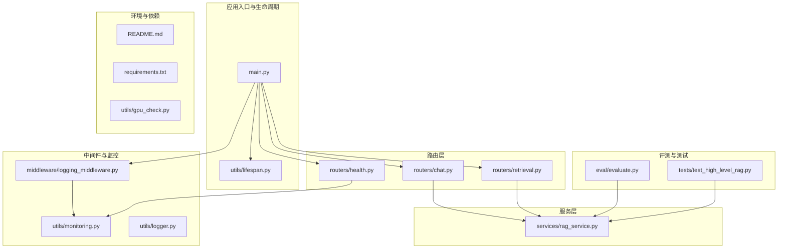
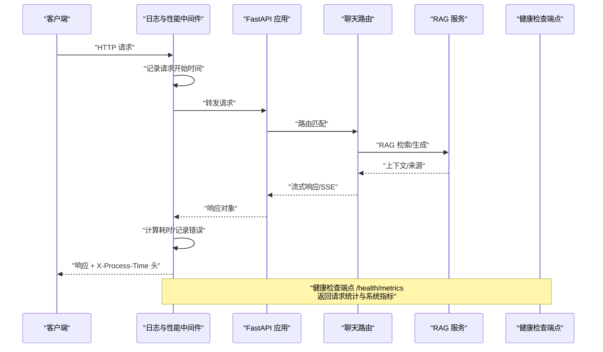
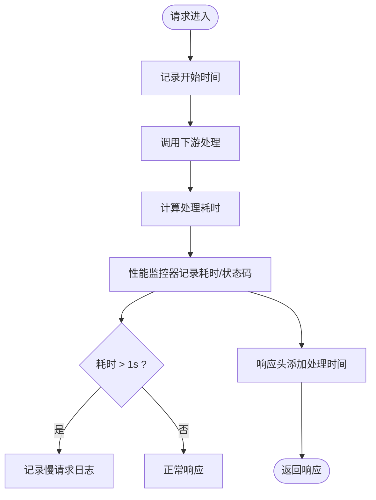
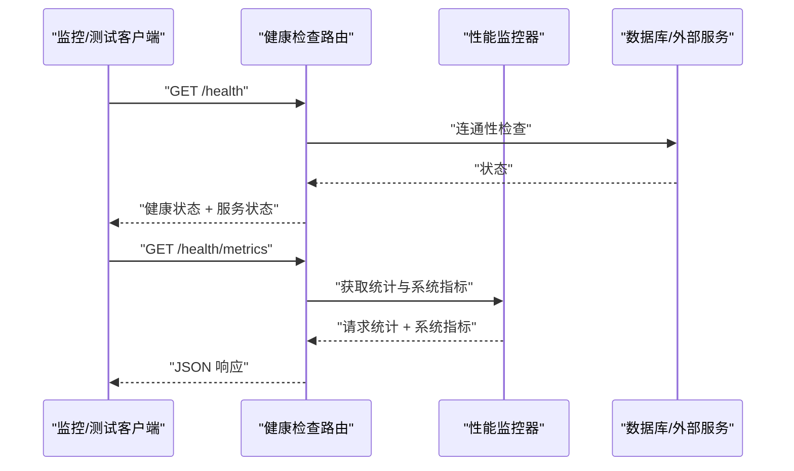
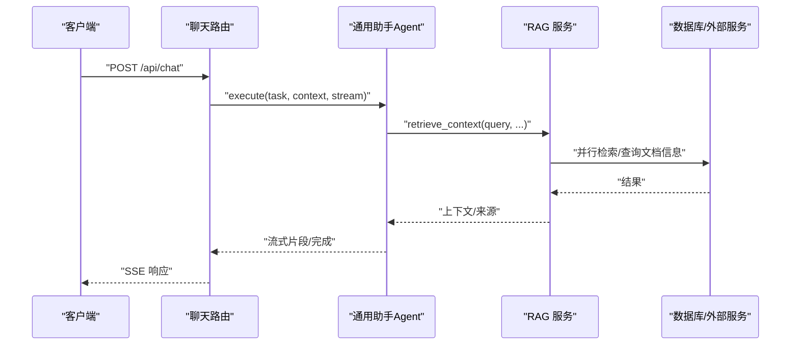
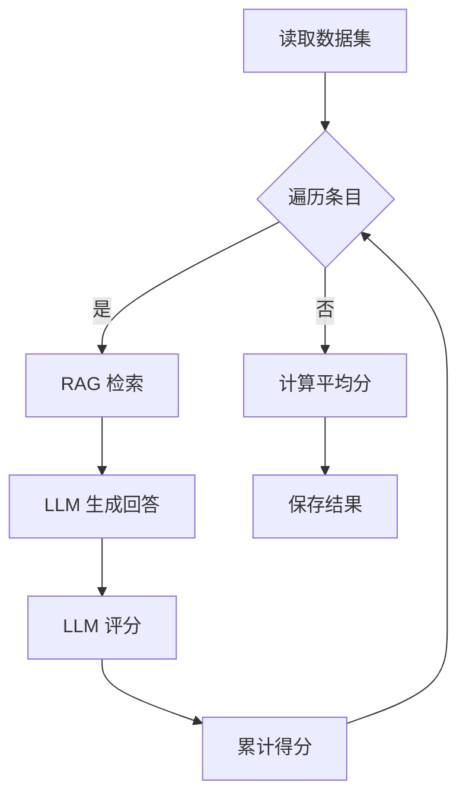
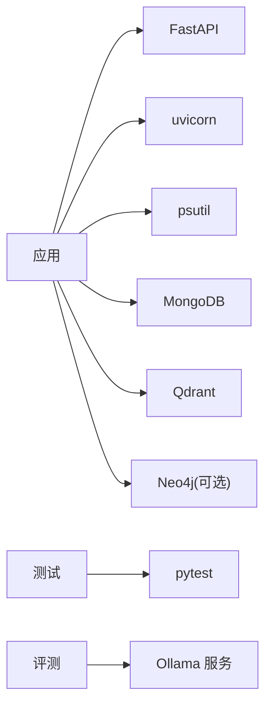

# 性能测试

<cite>
**本文引用的文件**
- [main.py](file://main.py)
- [README.md](file://README.md)
- [requirements.txt](file://requirements.txt)
- [utils/monitoring.py](file://utils/monitoring.py)
- [middleware/logging_middleware.py](file://middleware/logging_middleware.py)
- [utils/logger.py](file://utils/logger.py)
- [utils/lifespan.py](file://utils/lifespan.py)
- [routers/health.py](file://routers/health.py)
- [routers/chat.py](file://routers/chat.py)
- [routers/retrieval.py](file://routers/retrieval.py)
- [services/rag_service.py](file://services/rag_service.py)
- [eval/evaluate.py](file://eval/evaluate.py)
- [tests/test_high_level_rag.py](file://tests/test_high_level_rag.py)
- [utils/gpu_check.py](file://utils/gpu_check.py)
</cite>

## 目录
1. [简介](#简介)
2. [项目结构](#项目结构)
3. [核心组件](#核心组件)
4. [架构总览](#架构总览)
5. [详细组件分析](#详细组件分析)
6. [依赖分析](#依赖分析)
7. [性能考虑](#性能考虑)
8. [故障排查指南](#故障排查指南)
9. [结论](#结论)
10. [附录](#附录)

## 简介
本指南面向在本项目上开展性能测试与基准测试的工程团队，目标包括：
- 压力测试实施：负载生成策略、并发用户模拟、响应时间测量
- 负载测试配置：测试场景设计、数据准备、测试环境搭建
- 性能回归测试自动化：测试用例设计、持续集成配置、性能基线建立
- 性能指标采集：吞吐量统计、延迟分布、资源使用监控
- 性能分析与瓶颈识别：剖析工具使用、热点分析、优化建议
- 性能测试报告与分析：结果解读、趋势分析、改进建议

本项目基于 FastAPI + uvicorn，具备内置性能监控与健康检查端点，适合开展系统级性能评估。

## 项目结构
后端采用模块化分层：
- 应用入口与生命周期：main.py、utils/lifespan.py
- 中间件与监控：middleware/logging_middleware.py、utils/monitoring.py、utils/logger.py
- 路由层：routers/chat.py、routers/retrieval.py、routers/health.py
- 服务层：services/rag_service.py
- 评测与测试：eval/evaluate.py、tests/test_high_level_rag.py
- 环境与依赖：README.md、requirements.txt、utils/gpu_check.py

**图表来源**
- [main.py:1-171](file://main.py#L1-L171)
- [utils/lifespan.py:1-93](file://utils/lifespan.py#L1-L93)
- [middleware/logging_middleware.py:1-52](file://middleware/logging_middleware.py#L1-L52)
- [utils/monitoring.py:1-185](file://utils/monitoring.py#L1-L185)
- [routers/chat.py:1-800](file://routers/chat.py#L1-L800)
- [routers/retrieval.py:1-150](file://routers/retrieval.py#L1-L150)
- [routers/health.py:1-135](file://routers/health.py#L1-L135)
- [services/rag_service.py:1-323](file://services/rag_service.py#L1-L323)
- [eval/evaluate.py:1-127](file://eval/evaluate.py#L1-L127)
- [tests/test_high_level_rag.py:1-109](file://tests/test_high_level_rag.py#L1-L109)
- [README.md:1-290](file://README.md#L1-L290)
- [requirements.txt:1-42](file://requirements.txt#L1-L42)
- [utils/gpu_check.py:1-66](file://utils/gpu_check.py#L1-L66)

**章节来源**
- [main.py:1-171](file://main.py#L1-L171)
- [README.md:1-290](file://README.md#L1-L290)

## 核心组件
- 应用入口与运行参数：生产/开发模式、worker 数量、keep-alive 超时、并发连接限制等
- 请求日志与性能监控中间件：统一记录处理时间、慢请求、错误率
- 性能监控器：按路径/方法聚合请求耗时、计算分位数、采集系统 CPU/内存/磁盘
- 健康检查与指标端点：服务连通性、系统资源、性能统计
- 路由与服务：聊天流式响应、检索接口、RAG 上下文拼接与回退策略
- 评测与测试：评估脚本、集成测试样例

**章节来源**
- [main.py:129-171](file://main.py#L129-L171)
- [middleware/logging_middleware.py:1-52](file://middleware/logging_middleware.py#L1-L52)
- [utils/monitoring.py:13-185](file://utils/monitoring.py#L13-L185)
- [routers/health.py:23-135](file://routers/health.py#L23-L135)
- [routers/chat.py:623-760](file://routers/chat.py#L623-L760)
- [routers/retrieval.py:97-150](file://routers/retrieval.py#L97-L150)
- [services/rag_service.py:34-318](file://services/rag_service.py#L34-L318)
- [eval/evaluate.py:19-127](file://eval/evaluate.py#L19-L127)
- [tests/test_high_level_rag.py:57-109](file://tests/test_high_level_rag.py#L57-L109)

## 架构总览
下图展示性能测试关注的关键交互：客户端请求经中间件记录与监控，路由调用服务层执行 RAG 检索与生成，健康检查端点暴露性能统计与系统指标。

**图表来源**
- [middleware/logging_middleware.py:8-51](file://middleware/logging_middleware.py#L8-L51)
- [routers/chat.py:623-760](file://routers/chat.py#L623-L760)
- [services/rag_service.py:34-318](file://services/rag_service.py#L34-L318)
- [routers/health.py:117-135](file://routers/health.py#L117-L135)

## 详细组件分析

### 性能监控与中间件
- 中间件负责记录请求路径、方法、处理时间，并将耗时与状态码上报性能监控器
- 性能监控器按路径/方法维护请求耗时列表，计算均值、最小/最大、分位数，统计错误次数
- 系统指标采集包括 CPU 百分比、进程 CPU、内存总量/使用/可用、磁盘使用率与容量
- 慢请求阈值与日志策略：超过 1 秒标记为慢请求，减少正常请求日志量

**图表来源**
- [middleware/logging_middleware.py:8-51](file://middleware/logging_middleware.py#L8-L51)
- [utils/monitoring.py:163-185](file://utils/monitoring.py#L163-L185)

**章节来源**
- [middleware/logging_middleware.py:1-52](file://middleware/logging_middleware.py#L1-L52)
- [utils/monitoring.py:13-185](file://utils/monitoring.py#L13-L185)

### 健康检查与指标端点
- /health：检查 MongoDB、Qdrant 连通性，返回总体健康状态与系统资源概览
- /health/metrics：返回性能监控器统计的请求统计与系统指标

**图表来源**
- [routers/health.py:23-135](file://routers/health.py#L23-L135)
- [utils/monitoring.py:49-112](file://utils/monitoring.py#L49-L112)

**章节来源**
- [routers/health.py:1-135](file://routers/health.py#L1-L135)
- [utils/monitoring.py:49-112](file://utils/monitoring.py#L49-L112)

### 路由与服务：聊天与检索
- 聊天路由支持流式响应（SSE），并在生成过程中定期检查客户端断开，及时停止输出
- 检索路由调用 RAG 服务进行上下文检索，支持多知识空间并行检索与动态参数调整
- RAG 服务包含动态检索参数、并行检索、邻居扩展、上下文拼接与 token 预算控制、回退策略

**图表来源**
- [routers/chat.py:623-760](file://routers/chat.py#L623-L760)
- [services/rag_service.py:34-318](file://services/rag_service.py#L34-L318)

**章节来源**
- [routers/chat.py:623-760](file://routers/chat.py#L623-L760)
- [routers/retrieval.py:97-150](file://routers/retrieval.py#L97-L150)
- [services/rag_service.py:34-318](file://services/rag_service.py#L34-L318)

### 评测与测试
- 评测脚本：读取数据集，调用 RAG 检索与 LLM 生成，再以 LLM-as-a-Judge 评分，输出平均分与结果
- 集成测试：包含混合分块、知识抽取（可选）、检索等测试用例，支持跳过集成测试

**图表来源**
- [eval/evaluate.py:19-127](file://eval/evaluate.py#L19-L127)

**章节来源**
- [eval/evaluate.py:1-127](file://eval/evaluate.py#L1-L127)
- [tests/test_high_level_rag.py:57-109](file://tests/test_high_level_rag.py#L57-L109)

## 依赖分析
- 运行时依赖：FastAPI、uvicorn、psutil（系统指标）、pytest（测试）
- 评测与测试：Ollama 服务、MongoDB/Qdrant/Neo4j（可选）

**图表来源**
- [requirements.txt:4-42](file://requirements.txt#L4-L42)
- [README.md:28-54](file://README.md#L28-L54)

**章节来源**
- [requirements.txt:1-42](file://requirements.txt#L1-L42)
- [README.md:1-290](file://README.md#L1-L290)

## 性能考虑
- 并发与 worker：生产模式默认多 worker，可通过环境变量覆盖；uvicorn 限制每 worker 并发连接数
- keep-alive 超时：延长以支持大文件上传
- 日志与中间件：异步文件处理器与队列监听器降低 I/O 阻塞；中间件记录处理时间并添加响应头
- 慢请求检测：超过 1 秒记录慢请求日志
- 系统资源：通过健康检查端点采集 CPU/内存/磁盘使用情况
- RAG 检索：动态参数、并行检索、邻居扩展、token 预算控制、回退策略

**章节来源**
- [main.py:142-171](file://main.py#L142-L171)
- [utils/logger.py:15-88](file://utils/logger.py#L15-L88)
- [middleware/logging_middleware.py:38-40](file://middleware/logging_middleware.py#L38-L40)
- [routers/health.py:67-81](file://routers/health.py#L67-L81)
- [services/rag_service.py:11-33](file://services/rag_service.py#L11-L33)
- [services/rag_service.py:97-122](file://services/rag_service.py#L97-L122)
- [services/rag_service.py:251-266](file://services/rag_service.py#L251-L266)

## 故障排查指南
- 健康检查失败：检查 MongoDB 与 Qdrant 连通性，查看服务状态与错误信息
- 性能指标不可用：确认性能监控器可用，系统指标采集权限
- 慢请求频繁：结合中间件日志与性能监控器分位数定位慢端点
- 测试环境依赖：确保 Ollama、MongoDB、Qdrant、Neo4j（可选）按需部署并可达
- GPU/CUDA：使用 GPU 检查工具验证 CUDA 设备可用性

**章节来源**
- [routers/health.py:23-115](file://routers/health.py#L23-L115)
- [utils/monitoring.py:78-112](file://utils/monitoring.py#L78-L112)
- [middleware/logging_middleware.py:34-50](file://middleware/logging_middleware.py#L34-L50)
- [utils/gpu_check.py:10-66](file://utils/gpu_check.py#L10-L66)

## 结论
本项目已具备完善的性能监控与健康检查能力，结合中间件与路由层的流式响应机制，能够支撑系统的压力测试与基准测试。建议在 CI 中集成健康检查与指标端点的自动化校验，并结合评测脚本与集成测试形成性能回归闭环。

## 附录

### 性能测试实施步骤
- 负载生成策略
  - 使用压测工具（如 Locust、k6、JMeter）构造并发场景
  - 场景类型：恒定并发、阶梯式增长、突发流量
- 并发用户模拟
  - 通过中间件与 uvicorn worker 数量配合，模拟真实并发
  - 关注 keep-alive 超时与连接上限
- 响应时间测量
  - 使用中间件记录的处理时间与响应头中的处理时间
  - 结合健康检查 /health/metrics 的分位数统计

**章节来源**
- [middleware/logging_middleware.py:26-44](file://middleware/logging_middleware.py#L26-L44)
- [routers/health.py:117-135](file://routers/health.py#L117-L135)
- [main.py:162-171](file://main.py#L162-L171)

### 负载测试配置
- 测试场景设计
  - 聊天流式对话：模拟真实用户输入节奏与断开检测
  - 检索接口：不同 top_k、多知识空间并行检索
- 数据准备
  - 使用评测脚本的数据集进行一致性评估
  - 集成测试中准备分块与知识抽取数据
- 测试环境搭建
  - 按 README 配置环境变量与依赖
  - 启动数据库与向量/图数据库服务

**章节来源**
- [eval/evaluate.py:92-127](file://eval/evaluate.py#L92-L127)
- [tests/test_high_level_rag.py:27-109](file://tests/test_high_level_rag.py#L27-L109)
- [README.md:125-188](file://README.md#L125-L188)

### 性能回归测试自动化
- 测试用例设计
  - 覆盖聊天路由、检索路由、RAG 服务关键路径
  - 包含断开检测、回退策略、邻居扩展等边界场景
- 持续集成配置
  - 在 CI 中调用健康检查与指标端点，设定阈值告警
  - 与评测脚本结合，定期产出平均分与趋势
- 性能基线建立
  - 在稳定版本上采集分位数与系统指标，作为基线
  - 对比 PR/变更后的指标，识别回归

**章节来源**
- [routers/chat.py:672-752](file://routers/chat.py#L672-L752)
- [routers/retrieval.py:97-150](file://routers/retrieval.py#L97-L150)
- [services/rag_service.py:294-318](file://services/rag_service.py#L294-L318)
- [eval/evaluate.py:92-127](file://eval/evaluate.py#L92-L127)
- [routers/health.py:117-135](file://routers/health.py#L117-L135)

### 性能指标采集
- 吞吐量统计：中间件记录的请求计数与错误计数
- 延迟分布：分位数（p50/p95/p99）与慢请求日志
- 资源使用监控：CPU/内存/磁盘与进程指标

**章节来源**
- [utils/monitoring.py:49-112](file://utils/monitoring.py#L49-L112)
- [middleware/logging_middleware.py:34-40](file://middleware/logging_middleware.py#L34-L40)

### 性能分析与瓶颈识别
- 剖析工具使用：结合 uvicorn worker 与中间件日志定位热点端点
- 热点分析：关注检索与生成阶段的耗时占比
- 优化建议：调整并行度、优化检索参数、控制上下文长度、启用/优化回退策略

**章节来源**
- [services/rag_service.py:11-33](file://services/rag_service.py#L11-L33)
- [services/rag_service.py:97-122](file://services/rag_service.py#L97-L122)
- [services/rag_service.py:251-266](file://services/rag_service.py#L251-L266)

### 性能测试报告与分析
- 测试结果解读：结合吞吐量、延迟分布、错误率与系统资源
- 趋势分析：对比不同版本与配置下的指标变化
- 改进建议：针对瓶颈端点与资源占用提出优化方案

**章节来源**
- [routers/health.py:117-135](file://routers/health.py#L117-L135)
- [utils/monitoring.py:49-112](file://utils/monitoring.py#L49-L112)