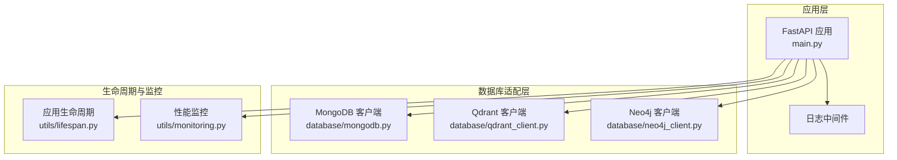
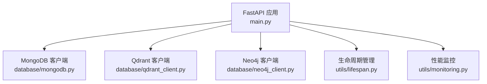
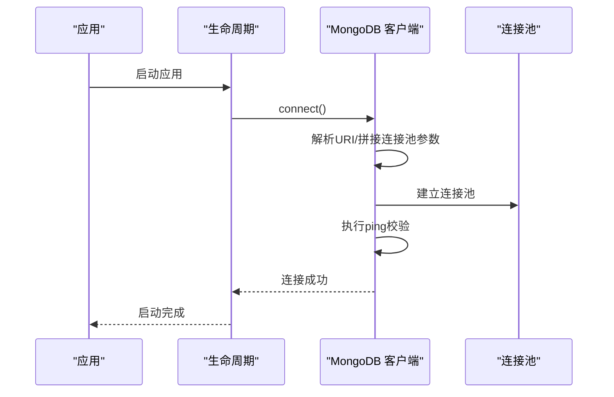
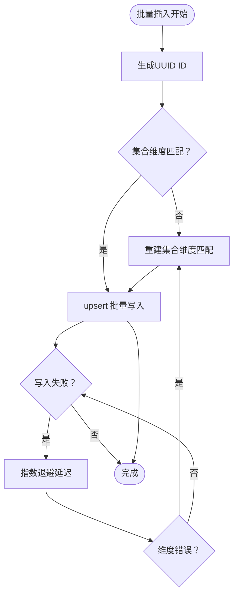
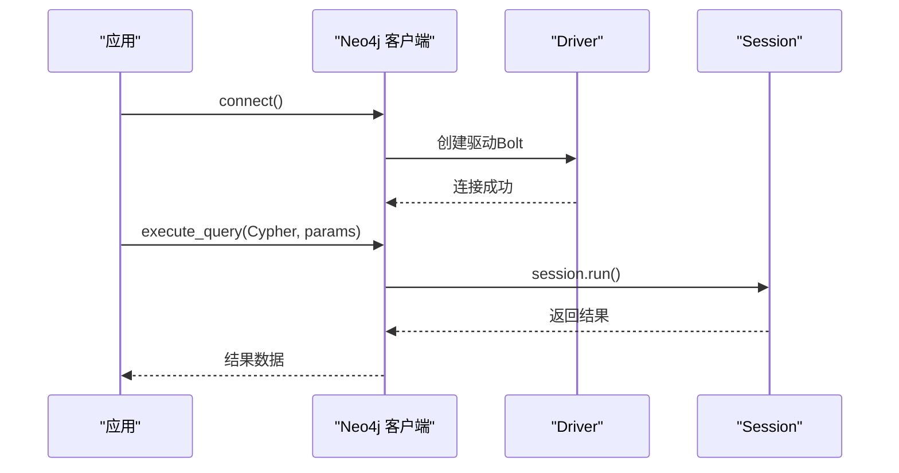
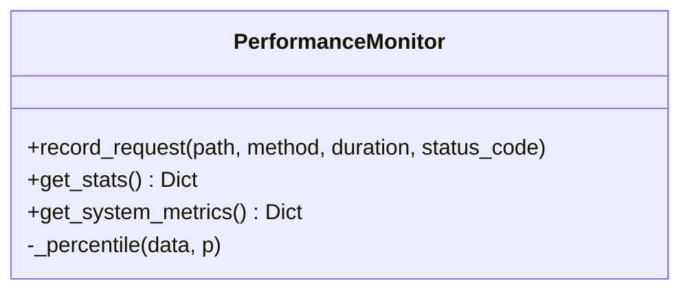
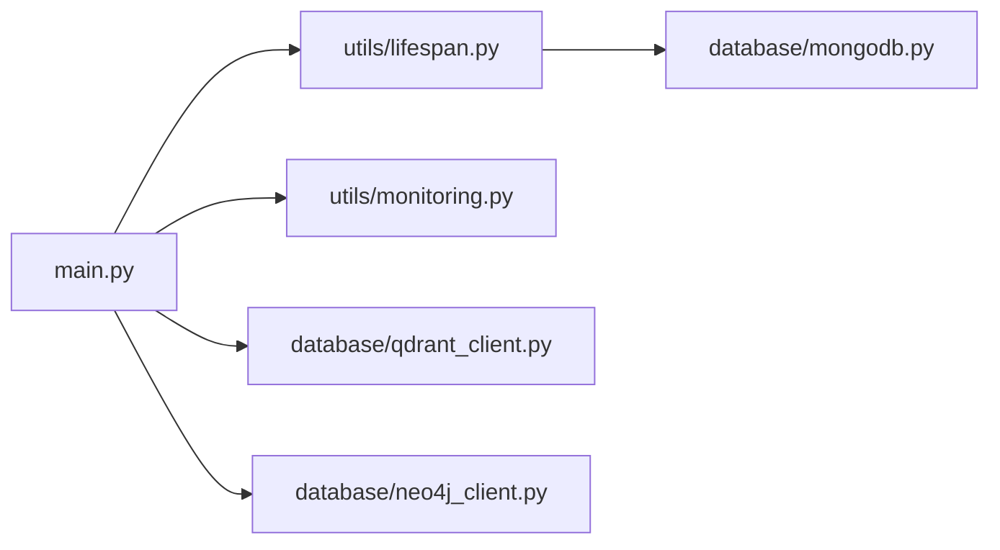

# 数据库优化

<cite>
**本文引用的文件**
- [database/mongodb.py](file://database/mongodb.py)
- [database/qdrant_client.py](file://database/qdrant_client.py)
- [database/neo4j_client.py](file://database/neo4j_client.py)
- [utils/monitoring.py](file://utils/monitoring.py)
- [utils/lifespan.py](file://utils/lifespan.py)
- [main.py](file://main.py)
- [README.md](file://README.md)
</cite>

## 目录
1. [简介](#简介)
2. [项目结构](#项目结构)
3. [核心组件](#核心组件)
4. [架构总览](#架构总览)
5. [详细组件分析](#详细组件分析)
6. [依赖关系分析](#依赖关系分析)
7. [性能考量](#性能考量)
8. [故障排查指南](#故障排查指南)
9. [结论](#结论)
10. [附录](#附录)

## 简介
本指南聚焦于本项目的数据库优化实践，涵盖：
- MongoDB连接池配置与连接复用策略
- Qdrant向量数据库优化（索引/批量插入/查询调优）
- Neo4j图数据库优化（索引、查询计划、事务管理）
- 数据库连接复用机制与生命周期管理
- 数据库监控指标（查询执行时间、连接使用率、内存占用）
- 备份与恢复优化策略

## 项目结构
数据库相关能力主要分布在以下模块：
- 数据库适配层：MongoDB、Qdrant、Neo4j客户端封装
- 生命周期与连接管理：应用启动/关闭时的连接建立与释放
- 性能监控：请求耗时、慢请求检测、系统资源指标

图表来源
- [main.py:55-100](file://main.py#L55-L100)
- [database/mongodb.py:92-204](file://database/mongodb.py#L92-L204)
- [database/qdrant_client.py:18-123](file://database/qdrant_client.py#L18-L123)
- [database/neo4j_client.py:6-104](file://database/neo4j_client.py#L6-L104)
- [utils/lifespan.py:28-93](file://utils/lifespan.py#L28-L93)
- [utils/monitoring.py:13-185](file://utils/monitoring.py#L13-L185)

章节来源
- [main.py:55-100](file://main.py#L55-L100)
- [database/mongodb.py:92-204](file://database/mongodb.py#L92-L204)
- [database/qdrant_client.py:18-123](file://database/qdrant_client.py#L18-L123)
- [database/neo4j_client.py:6-104](file://database/neo4j_client.py#L6-L104)
- [utils/lifespan.py:28-93](file://utils/lifespan.py#L28-L93)
- [utils/monitoring.py:13-185](file://utils/monitoring.py#L13-L185)

## 核心组件
- MongoDB异步客户端：支持连接池参数化、URI解析、连接健康检查与重试
- Qdrant向量客户端：gRPC优先、连接复用、批量插入重试、集合维度自动校验
- Neo4j客户端：Bolt连接、容器环境URI适配、会话级查询执行
- 生命周期管理：应用启动时MongoDB连接重试、关闭时统一断开
- 性能监控：请求耗时统计、慢请求告警、系统CPU/内存/磁盘指标采集

章节来源
- [database/mongodb.py:92-204](file://database/mongodb.py#L92-L204)
- [database/qdrant_client.py:18-123](file://database/qdrant_client.py#L18-L123)
- [database/neo4j_client.py:6-104](file://database/neo4j_client.py#L6-L104)
- [utils/lifespan.py:28-93](file://utils/lifespan.py#L28-L93)
- [utils/monitoring.py:13-185](file://utils/monitoring.py#L13-L185)

## 架构总览
下图展示数据库层在系统中的位置与交互关系。

图表来源
- [main.py:55-100](file://main.py#L55-L100)
- [database/mongodb.py:92-204](file://database/mongodb.py#L92-L204)
- [database/qdrant_client.py:18-123](file://database/qdrant_client.py#L18-L123)
- [database/neo4j_client.py:6-104](file://database/neo4j_client.py#L6-L104)
- [utils/lifespan.py:28-93](file://utils/lifespan.py#L28-L93)
- [utils/monitoring.py:13-185](file://utils/monitoring.py#L13-L185)

## 详细组件分析

### MongoDB连接池配置与连接复用
- 连接池参数
  - maxPoolSize：每worker最大连接数，默认100
  - minPoolSize：最小连接池大小，默认10
  - maxIdleTimeMS：连接空闲超时，默认30秒
  - serverSelectionTimeoutMS：服务器选择超时，默认5秒
  - connectTimeoutMS：连接超时，默认10秒
  - socketTimeoutMS：socket超时，默认30秒
- 连接字符串构建与合并：支持从MONGODB_URI解析或由独立环境变量拼装，并将连接池参数合并到查询参数
- 连接健康检查：启动时执行ping命令验证可用性
- 连接复用策略：异步客户端基于连接池复用，减少频繁建立/销毁连接的开销
- 请求级兜底：首次请求失败时可重试一次，提升可用性

图表来源
- [database/mongodb.py:99-184](file://database/mongodb.py#L99-L184)
- [utils/lifespan.py:8-25](file://utils/lifespan.py#L8-L25)

章节来源
- [database/mongodb.py:99-184](file://database/mongodb.py#L99-L184)
- [database/mongodb.py:129-150](file://database/mongodb.py#L129-L150)
- [utils/lifespan.py:8-25](file://utils/lifespan.py#L8-L25)

### Qdrant向量数据库优化
- 连接与复用
  - 优先使用gRPC（端口6334），避免HTTP/httpx的502问题，支持连接复用
  - 自动重试与健康检查，失败时尝试127.0.0.1替代localhost
- 集合管理
  - 自动检查集合维度一致性，不匹配时重建集合
  - 集合不存在时自动创建
- 批量插入优化
  - 自动生成UUID ID（gRPC要求）
  - 插入失败时重试（指数退避），对维度错误自动重建集合
- 查询性能调优
  - 支持过滤条件、分数阈值、限制返回条数
  - 自动处理集合不存在场景，返回空结果而非异常

图表来源
- [database/qdrant_client.py:210-334](file://database/qdrant_client.py#L210-L334)
- [database/qdrant_client.py:140-208](file://database/qdrant_client.py#L140-L208)

章节来源
- [database/qdrant_client.py:66-123](file://database/qdrant_client.py#L66-L123)
- [database/qdrant_client.py:140-208](file://database/qdrant_client.py#L140-L208)
- [database/qdrant_client.py:210-334](file://database/qdrant_client.py#L210-L334)
- [database/qdrant_client.py:336-413](file://database/qdrant_client.py#L336-L413)

### Neo4j图数据库优化
- 连接与容器适配
  - Bolt连接，支持容器内localhost到host.docker.internal的自动替换
  - 连接失败时记录日志，避免阻塞应用启动
- 查询执行
  - 会话级执行，支持Cypher语句与参数化查询
  - 提供实体与关系的便捷创建方法（MERGE）
- 事务管理
  - 使用session.run自动管理事务边界
  - 失败时记录错误并返回None，便于上层处理

图表来源
- [database/neo4j_client.py:16-62](file://database/neo4j_client.py#L16-L62)

章节来源
- [database/neo4j_client.py:6-104](file://database/neo4j_client.py#L6-L104)

### 数据库连接复用机制与生命周期管理
- MongoDB
  - 启动时多次重试连接，失败不阻塞应用启动
  - 应用关闭时统一断开连接
- Qdrant
  - gRPC优先，连接复用，减少握手成本
- Neo4j
  - 会话级复用，避免频繁建立/销毁连接
- 连接泄漏检测
  - 应用关闭时统一释放资源
  - 建议在生产环境配合连接池上限与超时参数，结合监控指标观察连接使用率

章节来源
- [utils/lifespan.py:8-25](file://utils/lifespan.py#L8-L25)
- [utils/lifespan.py:88-92](file://utils/lifespan.py#L88-L92)
- [database/mongodb.py:129-150](file://database/mongodb.py#L129-L150)
- [database/qdrant_client.py:66-96](file://database/qdrant_client.py#L66-L96)
- [database/neo4j_client.py:16-38](file://database/neo4j_client.py#L16-L38)

### 数据库监控指标
- 请求性能监控
  - 记录每个路径+方法的请求耗时、错误计数
  - 统计平均/最小/最大/分位数（p50/p95/p99）
- 慢请求检测
  - 超过1秒的请求记录告警
- 系统资源指标
  - CPU使用率、进程CPU使用率
  - 内存总量/已用/可用、进程内存占用
  - 磁盘总量/已用/剩余、使用率

图表来源
- [utils/monitoring.py:13-185](file://utils/monitoring.py#L13-L185)

章节来源
- [utils/monitoring.py:13-185](file://utils/monitoring.py#L13-L185)

## 依赖关系分析
- 应用启动依赖MongoDB连接池初始化，失败时仍允许服务启动，便于本地调试
- Qdrant与Neo4j作为可选依赖，按需启用
- 性能监控贯穿请求链路，提供查询耗时与系统指标

图表来源
- [main.py:55-100](file://main.py#L55-L100)
- [utils/lifespan.py:28-93](file://utils/lifespan.py#L28-L93)
- [database/mongodb.py:92-204](file://database/mongodb.py#L92-L204)
- [database/qdrant_client.py:18-123](file://database/qdrant_client.py#L18-L123)
- [database/neo4j_client.py:6-104](file://database/neo4j_client.py#L6-L104)
- [utils/monitoring.py:13-185](file://utils/monitoring.py#L13-L185)

章节来源
- [main.py:55-100](file://main.py#L55-L100)
- [utils/lifespan.py:28-93](file://utils/lifespan.py#L28-L93)
- [database/mongodb.py:92-204](file://database/mongodb.py#L92-L204)
- [database/qdrant_client.py:18-123](file://database/qdrant_client.py#L18-L123)
- [database/neo4j_client.py:6-104](file://database/neo4j_client.py#L6-L104)
- [utils/monitoring.py:13-185](file://utils/monitoring.py#L13-L185)

## 性能考量
- 连接池大小设置
  - 基于工作线程数合理设置maxPoolSize与minPoolSize，避免过大导致资源浪费，过小导致排队
  - 结合实际QPS与查询复杂度调整，观察慢请求与错误率
- 连接超时配置
  - serverSelectionTimeoutMS、connectTimeoutMS、socketTimeoutMS应与网络状况匹配，避免频繁超时
- 连接复用策略
  - MongoDB使用异步连接池；Qdrant优先gRPC并复用；Neo4j使用会话级复用
- 批量插入优化
  - Qdrant批量插入采用重试与指数退避，自动处理维度不一致
- 查询调优
  - Qdrant支持过滤与阈值控制，减少无效扫描
  - Neo4j建议为常用查询创建索引，使用EXPLAIN/PROFILE分析查询计划
- 监控与告警
  - 利用性能监控统计请求耗时分布，结合慢请求告警定位瓶颈
  - 关注系统CPU/内存/磁盘指标，防止资源瓶颈

[本节为通用指导，不直接分析具体文件]

## 故障排查指南
- MongoDB连接失败
  - 检查MONGODB_URI/MONGODB_HOST/MONGODB_PORT配置
  - 查看启动重试日志与错误提示
  - 确认容器内访问宿主机使用host.docker.internal
- Qdrant连接问题
  - 优先使用gRPC（端口6334），避免HTTP/httpx 502
  - 健康检查失败时尝试127.0.0.1替代localhost
  - 维度不匹配时自动重建集合
- Neo4j连接问题
  - 检查Bolt端口与容器环境URI替换
  - 查询失败时查看日志，确认Cypher语法与参数
- 连接泄漏
  - 应用关闭时统一断开连接
  - 生产环境建议设置连接池上限与超时，结合监控观察连接使用率

章节来源
- [database/mongodb.py:177-184](file://database/mongodb.py#L177-L184)
- [database/qdrant_client.py:98-123](file://database/qdrant_client.py#L98-L123)
- [database/neo4j_client.py:20-32](file://database/neo4j_client.py#L20-L32)
- [utils/lifespan.py:88-92](file://utils/lifespan.py#L88-L92)

## 结论
本项目在数据库层实现了：
- MongoDB连接池参数化与健康检查
- Qdrant gRPC连接复用与批量插入重试
- Neo4j会话级连接与便捷查询封装
- 应用生命周期内的连接管理与释放
- 请求耗时与系统资源的监控能力

建议在生产环境中结合监控指标持续优化连接池大小、超时参数与查询计划，以获得更稳定的性能表现。

[本节为总结，不直接分析具体文件]

## 附录
- 环境变量参考
  - MongoDB：MONGODB_URI、MONGODB_DB_NAME、MONGODB_MAX_POOL_SIZE、MONGODB_MIN_POOL_SIZE、MONGODB_MAX_IDLE_TIME_MS、MONGODB_SERVER_SELECTION_TIMEOUT_MS、MONGODB_CONNECT_TIMEOUT_MS、MONGODB_SOCKET_TIMEOUT_MS
  - Qdrant：QDRANT_URL、QDRANT_API_KEY、QDRANT_TIMEOUT、QDRANT_GRPC_PORT
  - Neo4j：NEO4J_URI、NEO4J_USER、NEO4J_PASSWORD
- 启动与部署
  - 应用通过main.py启动，支持多worker与keep-alive超时配置
  - README提供开发与Docker部署说明

章节来源
- [README.md:136-147](file://README.md#L136-L147)
- [main.py:129-171](file://main.py#L129-L171)