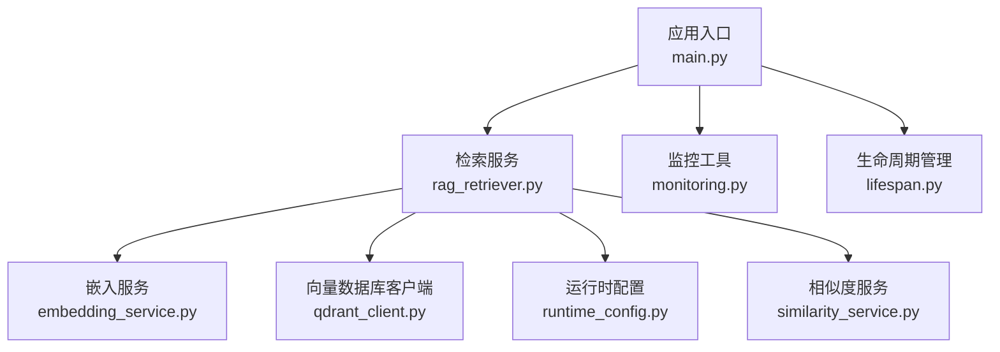
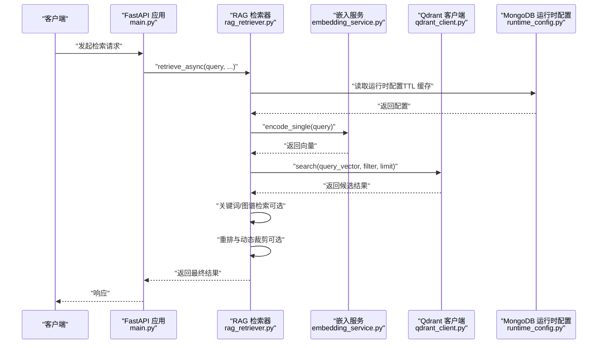
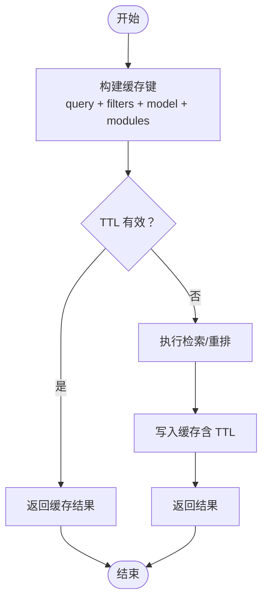
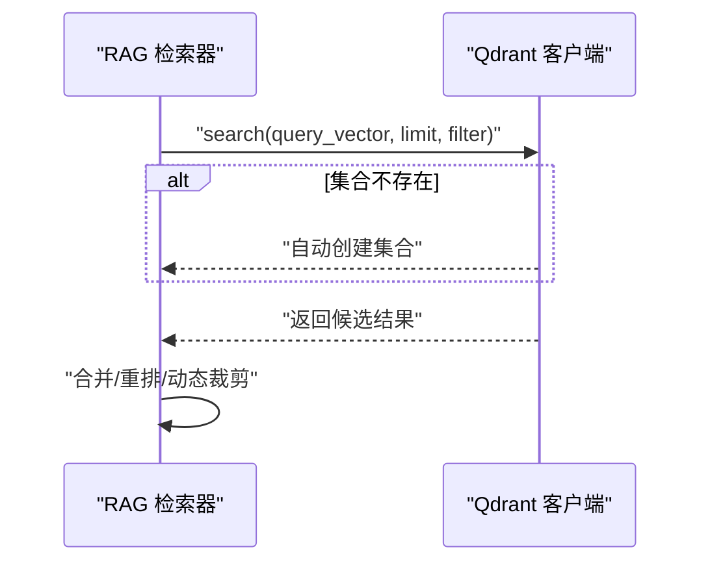
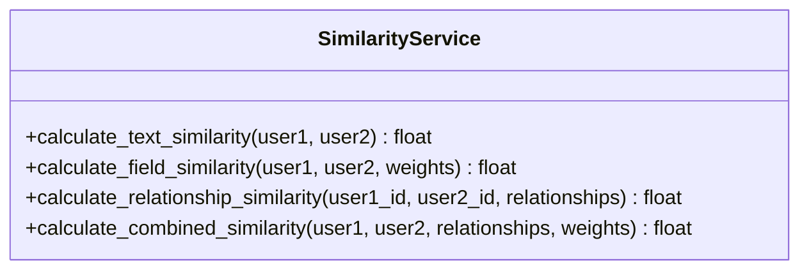
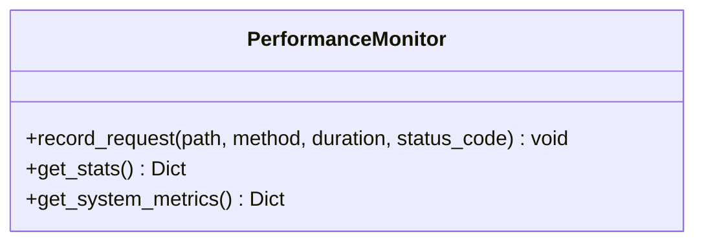
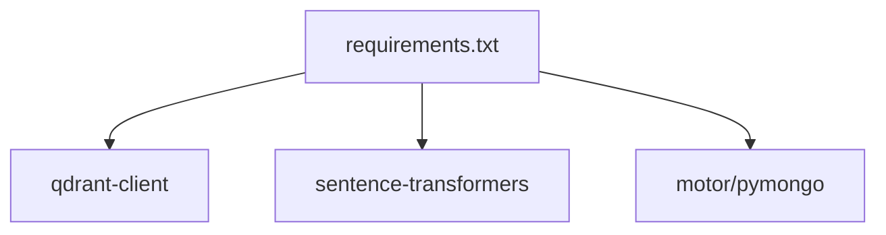

# 缓存策略

<cite>
**本文引用的文件**
- [main.py](file://main.py)
- [rag_retriever.py](file://retrieval/rag_retriever.py)
- [qdrant_client.py](file://database/qdrant_client.py)
- [embedding_service.py](file://embedding/embedding_service.py)
- [runtime_config.py](file://services/runtime_config.py)
- [similarity_service.py](file://services/similarity_service.py)
- [monitoring.py](file://utils/monitoring.py)
- [lifespan.py](file://utils/lifespan.py)
- [requirements.txt](file://requirements.txt)
</cite>

## 目录
1. [简介](#简介)
2. [项目结构](#项目结构)
3. [核心组件](#核心组件)
4. [架构总览](#架构总览)
5. [详细组件分析](#详细组件分析)
6. [依赖分析](#依赖分析)
7. [性能考量](#性能考量)
8. [故障排查指南](#故障排查指南)
9. [结论](#结论)
10. [附录](#附录)

## 简介
本指南围绕本项目的缓存策略进行系统化梳理与优化建议，重点覆盖以下方面：
- 查询结果缓存配置：缓存键设计、过期策略与失效机制
- 向量索引缓存优化：索引预加载、命中率优化与内存管理
- 相似度计算缓存策略：中间结果缓存与批量计算优化
- 缓存一致性保证：更新策略与数据同步机制
- 缓存监控与性能分析：命中率统计与性能瓶颈识别
- 分布式缓存配置：Redis 集群配置与缓存分片策略

本项目在检索链路中涉及向量检索、关键词检索、图谱检索与重排等步骤，缓存优化应贯穿这些环节，以提升整体响应速度与稳定性。

## 项目结构
与缓存策略相关的关键模块与文件如下：
- 应用入口与中间件：FastAPI 应用、CORS、静态资源挂载、日志中间件
- 检索服务：RAG 检索器，包含向量、关键词、图谱与重排流程
- 向量数据库：Qdrant 客户端封装，提供集合管理、插入、查询与删除
- 嵌入服务：文本向量化服务，支持模型切换与兼容性处理
- 运行时配置：MongoDB 持久化 + TTL 缓存，用于动态控制检索行为
- 相似度服务：用户/资源相似度计算，可作为缓存对象
- 监控工具：请求耗时、错误计数、系统指标采集
- 生命周期：应用启动/关闭时的资源准备与清理

**图表来源**
- [main.py:55-104](file://main.py#L55-L104)
- [rag_retriever.py:17-137](file://retrieval/rag_retriever.py#L17-L137)
- [qdrant_client.py:18-413](file://database/qdrant_client.py#L18-L413)
- [embedding_service.py:35-242](file://embedding/embedding_service.py#L35-L242)
- [runtime_config.py:140-188](file://services/runtime_config.py#L140-L188)
- [similarity_service.py:8-276](file://services/similarity_service.py#L8-L276)
- [monitoring.py:13-185](file://utils/monitoring.py#L13-L185)
- [lifespan.py:28-93](file://utils/lifespan.py#L28-L93)

**章节来源**
- [main.py:55-104](file://main.py#L55-L104)
- [rag_retriever.py:17-137](file://retrieval/rag_retriever.py#L17-L137)
- [qdrant_client.py:18-413](file://database/qdrant_client.py#L18-L413)
- [embedding_service.py:35-242](file://embedding/embedding_service.py#L35-L242)
- [runtime_config.py:140-188](file://services/runtime_config.py#L140-L188)
- [similarity_service.py:8-276](file://services/similarity_service.py#L8-L276)
- [monitoring.py:13-185](file://utils/monitoring.py#L13-L185)
- [lifespan.py:28-93](file://utils/lifespan.py#L28-L93)

## 核心组件
- 检索器（RAGRetriever）：负责并行执行向量、关键词、图谱检索，并在启用时进行重排与动态裁剪
- Qdrant 客户端：封装集合创建、向量插入、查询与删除，支持 gRPC 连接与自动集合创建
- 嵌入服务：统一的向量化接口，兼容不同模型返回结构
- 运行时配置：MongoDB 持久化 + TTL 缓存，提供模块开关与参数动态调整
- 相似度服务：文本/字段/关系相似度计算，可作为缓存对象
- 监控工具：请求耗时、错误计数与系统指标采集，支撑缓存命中率与性能分析

**章节来源**
- [rag_retriever.py:17-137](file://retrieval/rag_retriever.py#L17-L137)
- [qdrant_client.py:18-413](file://database/qdrant_client.py#L18-L413)
- [embedding_service.py:35-242](file://embedding/embedding_service.py#L35-L242)
- [runtime_config.py:140-188](file://services/runtime_config.py#L140-L188)
- [similarity_service.py:8-276](file://services/similarity_service.py#L8-L276)
- [monitoring.py:13-185](file://utils/monitoring.py#L13-L185)

## 架构总览
下图展示了缓存策略在检索链路中的位置与交互：

**图表来源**
- [main.py:91-98](file://main.py#L91-L98)
- [rag_retriever.py:89-137](file://retrieval/rag_retriever.py#L89-L137)
- [qdrant_client.py:336-413](file://database/qdrant_client.py#L336-L413)
- [embedding_service.py:214-242](file://embedding/embedding_service.py#L214-L242)
- [runtime_config.py:140-188](file://services/runtime_config.py#L140-L188)

## 详细组件分析

### 查询结果缓存配置
- 缓存键设计
  - 检索场景：query + document_id + collection_name + embedding_model + 运行时模块开关
  - 关键词/图谱检索：query + document_id（若存在）
  - 重排：query + 候选集指纹（如 chunk_id 列表哈希）
- 过期策略
  - 运行时配置采用 TTL 缓存（默认 10 秒），可通过接口调整
  - 检索结果可按查询内容与过滤条件生成稳定键，结合业务 TTL（如 5-60 分钟）
- 失效机制
  - 文档删除：删除对应 document_id 的向量与关键词缓存
  - 集合变更：当 collection_name 变更或模型切换时，主动失效相关缓存
  - 配置变更：运行时配置更新后，刷新 TTL 缓存并广播通知

**图表来源**
- [runtime_config.py:140-188](file://services/runtime_config.py#L140-L188)
- [rag_retriever.py:89-137](file://retrieval/rag_retriever.py#L89-L137)

**章节来源**
- [runtime_config.py:140-188](file://services/runtime_config.py#L140-L188)
- [rag_retriever.py:89-137](file://retrieval/rag_retriever.py#L89-L137)

### 向量索引缓存优化
- 索引预加载
  - 启动时连接 Qdrant（优先 gRPC，支持连接复用），并检查集合存在性
  - 集合不存在时按查询向量维度自动创建
- 命中率优化
  - prefetch_k 与 score_threshold 调整：扩大候选池以提升召回，再通过重排与动态裁剪提升精度
  - 并行检索：向量、关键词、图谱三路并行，减少总体等待时间
- 内存管理
  - Qdrant 客户端使用 gRPC，具备连接复用与超时控制，降低连接开销
  - 向量维度校验与自动重建，避免维度不匹配导致的失败

**图表来源**
- [qdrant_client.py:336-413](file://database/qdrant_client.py#L336-L413)
- [rag_retriever.py:176-204](file://retrieval/rag_retriever.py#L176-L204)

**章节来源**
- [qdrant_client.py:336-413](file://database/qdrant_client.py#L336-L413)
- [rag_retriever.py:176-204](file://retrieval/rag_retriever.py#L176-L204)

### 相似度计算缓存策略
- 中间结果缓存
  - 文本相似度（Jaccard）、字段相似度（归一化匹配率）、关系相似度（Jaccard）
  - 缓存键：用户对（user_id1, user_id2）+ 权重配置指纹
- 批量计算优化
  - 相似度服务支持批量输入，可结合外部 Redis 实现批量 GET/SET
  - 对高频查询（如推荐、好友匹配）建立预计算任务，定期更新缓存

**图表来源**
- [similarity_service.py:15-276](file://services/similarity_service.py#L15-L276)

**章节来源**
- [similarity_service.py:15-276](file://services/similarity_service.py#L15-L276)

### 缓存一致性保证
- 更新策略
  - 文档入库/更新：删除对应 document_id 的向量与关键词缓存
  - 配置更新：upsert_runtime_config 后刷新 TTL 缓存
- 数据同步机制
  - 检索前读取运行时配置（TTL 缓存），避免频繁访问 MongoDB
  - 检索结果写入缓存时携带版本号或时间戳，支持后续对比与回滚

**章节来源**
- [runtime_config.py:191-217](file://services/runtime_config.py#L191-L217)
- [qdrant_client.py:415-436](file://database/qdrant_client.py#L415-L436)

### 缓存监控与性能分析
- 监控指标
  - 请求耗时（均值、P50、P95、P99）、错误计数、系统 CPU/内存/磁盘使用
  - 缓存命中率：缓存命中次数 / 总请求次数
- 性能瓶颈识别
  - 重排阶段（CrossEncoder）耗时较长，建议批量预测与 GPU 加速
  - 向量检索延迟主要受 Qdrant 响应时间影响，需关注网络与索引构建质量

**图表来源**
- [monitoring.py:13-185](file://utils/monitoring.py#L13-L185)

**章节来源**
- [monitoring.py:13-185](file://utils/monitoring.py#L13-L185)

### 分布式缓存配置（Redis 集群与分片）
- 集群配置
  - 使用 Redis 集群部署，开启哈希槽与主从复制，确保高可用与水平扩展
  - 为不同业务域划分命名空间（如检索、相似度、配置），避免键冲突
- 缓存分片策略
  - 按查询指纹（query hash）或用户 ID 进行分片，提升并发与吞吐
  - 对热点键设置短 TTL 并配合本地二级缓存（如 LRU）降低冷数据占用

[本节为概念性指导，不直接映射具体源文件]

## 依赖分析
- 第三方依赖与缓存相关
  - qdrant-client：向量检索与集合管理
  - sentence-transformers：重排模型（CrossEncoder）
  - motor/pymongo：MongoDB 访问（运行时配置持久化）

**图表来源**
- [requirements.txt:10-14](file://requirements.txt#L10-L14)
- [requirements.txt:14](file://requirements.txt#L14)
- [requirements.txt:11](file://requirements.txt#L11)

**章节来源**
- [requirements.txt:10-14](file://requirements.txt#L10-L14)
- [requirements.txt:11](file://requirements.txt#L11)

## 性能考量
- 检索链路优化
  - 并行执行向量、关键词、图谱检索，缩短总等待时间
  - 重排与动态裁剪在候选池上进行，避免对全量结果排序
- 向量检索优化
  - 使用 gRPC 连接与连接复用，降低连接开销
  - 自动集合创建与维度校验，减少运行时异常
- 相似度计算优化
  - 批量预测与 GPU 加速，减少单次调用延迟
  - 对高频查询建立预计算任务，定期更新缓存

[本节提供一般性建议，不直接分析具体文件]

## 故障排查指南
- 启动阶段
  - MongoDB 连接失败不会阻止服务启动，但部分接口可能不可用
- 运行时
  - 重排模型加载失败会自动降级，不影响检索流程
  - Qdrant 连接失败或集合不存在时，自动创建集合并返回空结果
- 监控告警
  - 慢请求检测与错误计数可用于定位性能瓶颈

**章节来源**
- [lifespan.py:28-93](file://utils/lifespan.py#L28-L93)
- [rag_retriever.py:52-69](file://retrieval/rag_retriever.py#L52-L69)
- [qdrant_client.py:396-413](file://database/qdrant_client.py#L396-L413)
- [monitoring.py:163-185](file://utils/monitoring.py#L163-L185)

## 结论
本项目的缓存策略应围绕“检索链路 + 向量索引 + 相似度计算 + 运行时配置”的闭环展开。通过合理的缓存键设计、TTL 策略与失效机制，结合并行检索与重排优化，可在保证一致性的前提下显著提升性能。同时，借助监控工具持续观测命中率与系统指标，有助于及时发现并解决性能瓶颈。

## 附录
- 关键环境变量与参数
  - ENABLE_RERANKER、RERANKER_MODEL、RERANKER_DEVICE、DYNK_MIN、DYNK_MAX、DYNK_GAP_HIGH、DYNK_GAP_LOW
  - QDRANT_URL、QDRANT_API_KEY、QDRANT_TIMEOUT、QDRANT_GRPC_PORT
  - UVICORN_WORKERS、HOST、PORT、ENVIRONMENT/NODE_ENV

[本节为概览性信息，不直接分析具体文件]