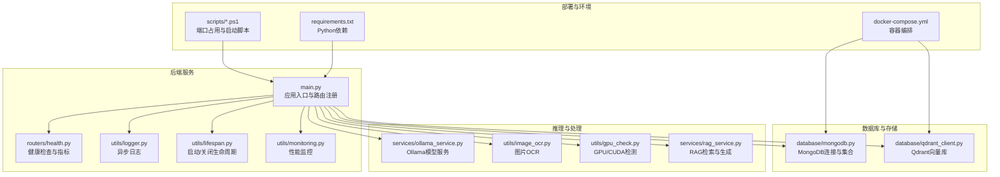
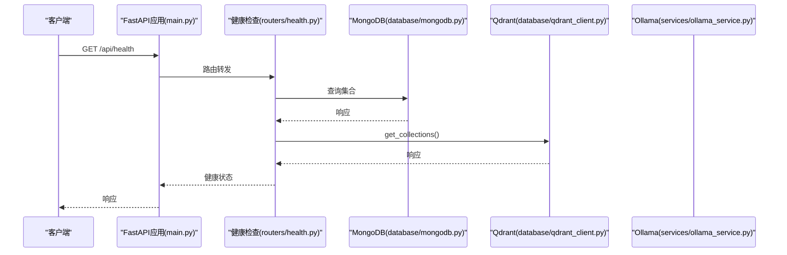
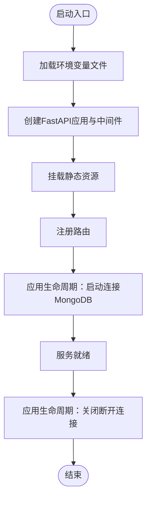
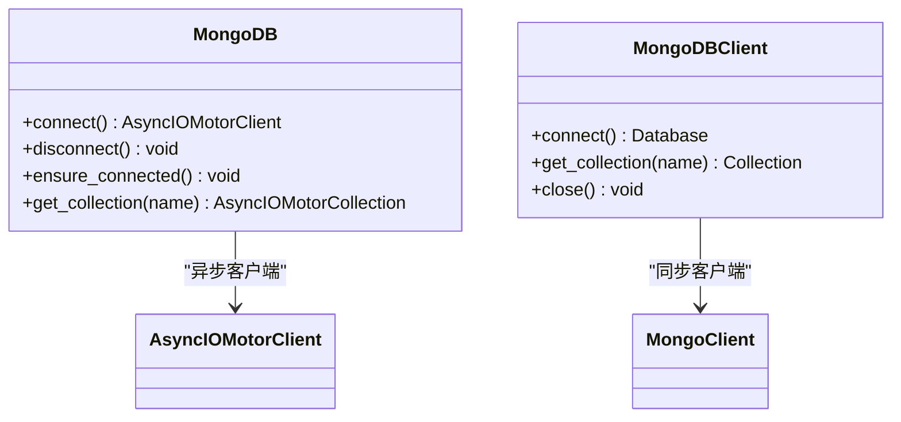
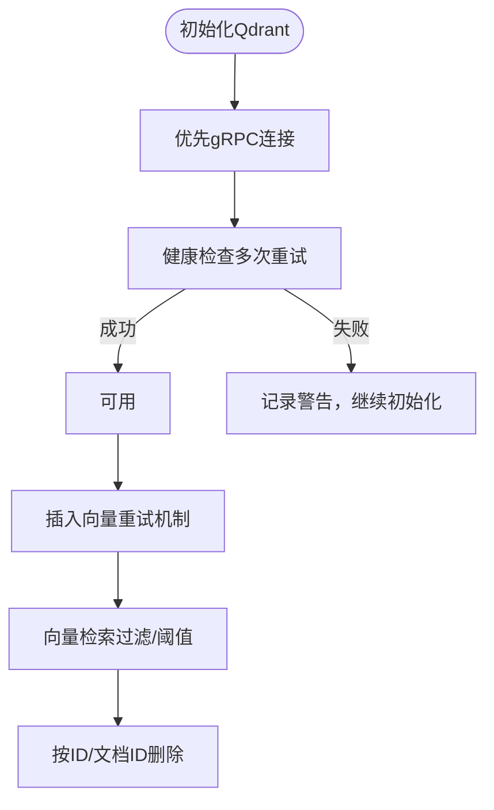
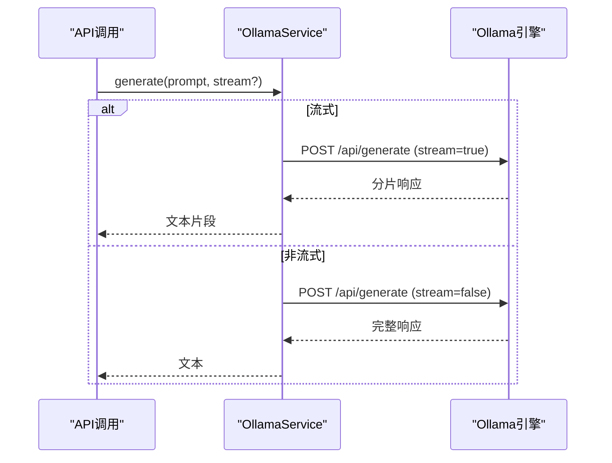
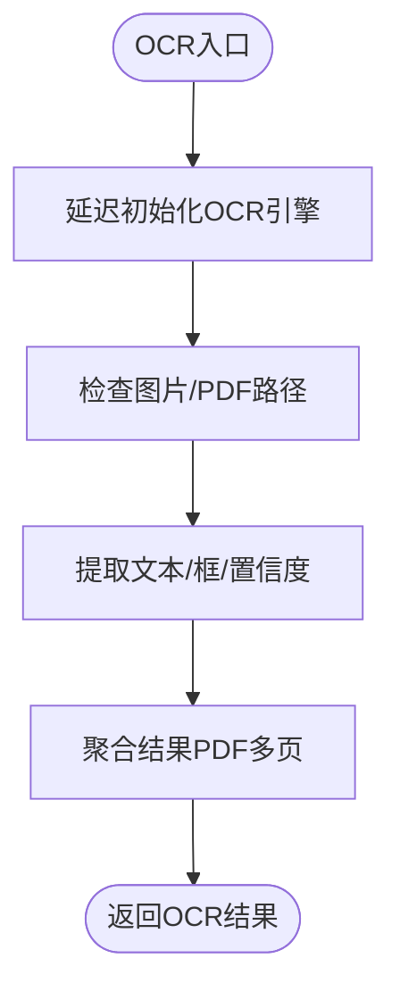
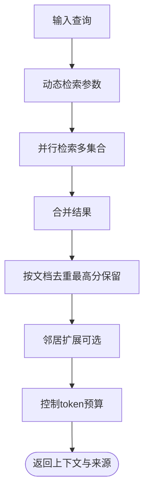
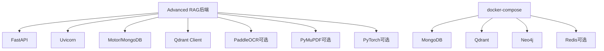

# 故障排除与FAQ

<cite>
**本文引用的文件**
- [main.py](file://main.py)
- [requirements.txt](file://requirements.txt)
- [docker-compose.yml](file://docker-compose.yml)
- [scripts/start-backend-8000.ps1](file://scripts/start-backend-8000.ps1)
- [scripts/stop-backend-8000.ps1](file://scripts/stop-backend-8000.ps1)
- [utils/logger.py](file://utils/logger.py)
- [utils/lifespan.py](file://utils/lifespan.py)
- [routers/health.py](file://routers/health.py)
- [services/ollama_service.py](file://services/ollama_service.py)
- [database/mongodb.py](file://database/mongodb.py)
- [database/qdrant_client.py](file://database/qdrant_client.py)
- [utils/image_ocr.py](file://utils/image_ocr.py)
- [utils/gpu_check.py](file://utils/gpu_check.py)
- [utils/monitoring.py](file://utils/monitoring.py)
- [services/rag_service.py](file://services/rag_service.py)
</cite>

## 目录
1. [简介](#简介)
2. [项目结构](#项目结构)
3. [核心组件](#核心组件)
4. [架构总览](#架构总览)
5. [详细组件分析](#详细组件分析)
6. [依赖分析](#依赖分析)
7. [性能考虑](#性能考虑)
8. [故障排除指南](#故障排除指南)
9. [结论](#结论)
10. [附录](#附录)

## 简介
本指南面向Advanced RAG项目的运维与开发者，聚焦于启动问题、数据库连接、模型加载、文档处理、API接口、系统性能以及日志分析等常见问题的诊断与解决。文档基于代码库中的实现细节，提供可操作的排查步骤与最佳实践。

## 项目结构
项目采用FastAPI后端与多种外部服务协作的架构：数据库（MongoDB、Qdrant）、向量检索、模型推理（Ollama）、OCR（PaddleOCR）、GPU/CUDA检测、性能监控与健康检查等模块协同工作。

图表来源
- [main.py:1-171](file://main.py#L1-L171)
- [docker-compose.yml:1-96](file://docker-compose.yml#L1-L96)
- [requirements.txt:1-42](file://requirements.txt#L1-L42)

章节来源
- [main.py:1-171](file://main.py#L1-L171)
- [docker-compose.yml:1-96](file://docker-compose.yml#L1-L96)
- [requirements.txt:1-42](file://requirements.txt#L1-L42)

## 核心组件
- 应用入口与路由：负责加载环境变量、注册中间件与静态资源、挂载路由、异常处理与启动参数。
- 生命周期管理：启动时尝试连接MongoDB，失败不阻止服务启动，便于本地调试；关闭时释放连接。
- 健康检查：统一检查MongoDB、Qdrant、系统资源，提供就绪/存活探针与性能指标。
- 日志系统：异步文件写入，生产环境降低日志级别，减少IO压力。
- 数据库连接：MongoDB支持URI与分段配置，连接池参数可调；Qdrant优先gRPC，自动重试与维度校验。
- 模型服务：Ollama封装，支持流式/非流式生成、工具函数调用、超时与空闲超时控制。
- 文档处理：OCR（PaddleOCR）、GPU/CUDA检测、RAG检索与上下文拼接。
- 性能监控：请求耗时统计、慢请求告警、系统资源采集。

章节来源
- [main.py:55-171](file://main.py#L55-L171)
- [utils/lifespan.py:28-93](file://utils/lifespan.py#L28-L93)
- [routers/health.py:23-135](file://routers/health.py#L23-L135)
- [utils/logger.py:15-88](file://utils/logger.py#L15-L88)
- [database/mongodb.py:92-204](file://database/mongodb.py#L92-L204)
- [database/qdrant_client.py:18-123](file://database/qdrant_client.py#L18-L123)
- [services/ollama_service.py:9-674](file://services/ollama_service.py#L9-L674)
- [utils/image_ocr.py:7-224](file://utils/image_ocr.py#L7-L224)
- [utils/gpu_check.py:10-66](file://utils/gpu_check.py#L10-L66)
- [utils/monitoring.py:13-185](file://utils/monitoring.py#L13-L185)
- [services/rag_service.py:8-323](file://services/rag_service.py#L8-L323)

## 架构总览
后端通过FastAPI提供REST接口，依赖MongoDB存储元数据、Qdrant存储向量、Ollama提供推理能力。健康检查与性能监控贯穿全链路，日志系统异步落盘，提升稳定性。

图表来源
- [main.py:90-99](file://main.py#L90-L99)
- [routers/health.py:23-87](file://routers/health.py#L23-L87)
- [database/mongodb.py:196-200](file://database/mongodb.py#L196-L200)
- [database/qdrant_client.py:124-139](file://database/qdrant_client.py#L124-L139)

## 详细组件分析

### 启动与生命周期
- 环境变量加载顺序：优先加载环境特定文件，再尝试通用文件，最后回退到默认加载。
- CORS与静态资源：允许任意来源访问，挂载头像、缩略图、封面等静态目录。
- 异常处理：全局捕获未处理异常，记录路径与方法，返回统一错误响应。
- 生命周期：启动时尝试连接MongoDB，最多重试3次；失败不阻止服务启动；关闭时断开连接。

图表来源
- [main.py:20-171](file://main.py#L20-L171)
- [utils/lifespan.py:28-93](file://utils/lifespan.py#L28-L93)

章节来源
- [main.py:20-171](file://main.py#L20-L171)
- [utils/lifespan.py:8-26](file://utils/lifespan.py#L8-L26)

### 数据库连接（MongoDB）
- 连接方式：支持MONGODB_URI或分段配置（主机、端口、用户名、密码、认证源、数据库名）。
- 连接池参数：最大/最小连接池、空闲超时、服务器选择/连接/套接字超时。
- 首次连接校验：通过ping命令确认可用性。
- 请求级兜底：启动连接失败时，首次请求可重试一次，失败返回503。

图表来源
- [database/mongodb.py:92-204](file://database/mongodb.py#L92-L204)
- [database/mongodb.py:232-336](file://database/mongodb.py#L232-L336)

章节来源
- [database/mongodb.py:92-204](file://database/mongodb.py#L92-L204)
- [database/mongodb.py:232-336](file://database/mongodb.py#L232-L336)

### 向量数据库（Qdrant）
- 连接策略：优先gRPC（端口6334），避免HTTP/httpx相关问题；本地HTTP连接时自动切换为127.0.0.1。
- 健康检查：多次重试，失败允许客户端初始化但操作可能失败。
- 集合管理：自动创建/重建，维度不匹配时自动重建；插入失败按错误类型重试。
- 搜索与删除：支持过滤条件、阈值、滚动读取；删除按文档ID或ID列表。

图表来源
- [database/qdrant_client.py:18-123](file://database/qdrant_client.py#L18-L123)
- [database/qdrant_client.py:210-335](file://database/qdrant_client.py#L210-L335)
- [database/qdrant_client.py:336-414](file://database/qdrant_client.py#L336-L414)
- [database/qdrant_client.py:415-444](file://database/qdrant_client.py#L415-L444)

章节来源
- [database/qdrant_client.py:18-123](file://database/qdrant_client.py#L18-L123)
- [database/qdrant_client.py:210-335](file://database/qdrant_client.py#L210-L335)
- [database/qdrant_client.py:336-414](file://database/qdrant_client.py#L336-L414)
- [database/qdrant_client.py:415-444](file://database/qdrant_client.py#L415-L444)

### 模型服务（Ollama）
- 地址与模型：支持环境变量配置，替换localhost为127.0.0.1；默认模型名称可配置。
- 生成模式：支持流式与非流式；流式模式内置线程池与队列，避免阻塞；空闲超时与总超时控制。
- 工具函数调用：解析XML格式的工具调用，参数类型转换，自动注入assistant_id。
- 超时与错误：连接超时、解析JSON失败、线程卡死等情况均有明确日志与异常抛出。

图表来源
- [services/ollama_service.py:50-93](file://services/ollama_service.py#L50-L93)
- [services/ollama_service.py:453-638](file://services/ollama_service.py#L453-L638)
- [services/ollama_service.py:639-670](file://services/ollama_service.py#L639-L670)

章节来源
- [services/ollama_service.py:9-674](file://services/ollama_service.py#L9-L674)

### 文档处理与OCR
- OCR初始化：延迟初始化PaddleOCR，支持中英文；未安装或初始化失败时记录警告。
- 图片OCR：从图片路径提取文本，返回文本、置信度、框信息；失败返回错误信息。
- PDF图片OCR：使用PyMuPDF提取图片，逐页OCR，聚合结果；失败记录警告。
- GPU/CUDA检测：优先PyTorch，其次pynvml，最后nvidia-smi；跨平台通用。

图表来源
- [utils/image_ocr.py:15-123](file://utils/image_ocr.py#L15-L123)
- [utils/image_ocr.py:124-219](file://utils/image_ocr.py#L124-L219)
- [utils/gpu_check.py:10-66](file://utils/gpu_check.py#L10-L66)

章节来源
- [utils/image_ocr.py:7-224](file://utils/image_ocr.py#L7-L224)
- [utils/gpu_check.py:10-66](file://utils/gpu_check.py#L10-L66)

### RAG检索与生成
- 动态检索参数：根据查询长度与关键词调整prefetch_k与final_k。
- 并行检索：多知识空间集合并行检索，合并结果并按分数去重。
- 邻居扩展：对命中chunk拉取前后窗口补齐定义/条件/例外。
- 上下文拼接：控制最大token预算，避免prompt过大。

图表来源
- [services/rag_service.py:11-33](file://services/rag_service.py#L11-L33)
- [services/rag_service.py:97-122](file://services/rag_service.py#L97-L122)
- [services/rag_service.py:180-266](file://services/rag_service.py#L180-L266)

章节来源
- [services/rag_service.py:8-323](file://services/rag_service.py#L8-L323)

## 依赖分析
- Python依赖：FastAPI、Uvicorn、MongoDB驱动、Qdrant客户端、Neo4j、Sentence Transformers、PaddleOCR（需单独安装）、PyMuPDF、PyTorch（可选）等。
- 容器依赖：MongoDB、Qdrant、Neo4j、Redis（可选）通过docker-compose编排，提供健康检查与持久化卷。

图表来源
- [requirements.txt:1-42](file://requirements.txt#L1-L42)
- [docker-compose.yml:1-96](file://docker-compose.yml#L1-L96)

章节来源
- [requirements.txt:1-42](file://requirements.txt#L1-L42)
- [docker-compose.yml:1-96](file://docker-compose.yml#L1-L96)

## 性能考虑
- 连接池与超时：MongoDB连接池参数可调；Qdrant优先gRPC，自动重试与维度校验；Ollama流式生成设置空闲与总超时。
- 日志异步：异步文件处理器避免阻塞主线程；生产环境降低日志级别。
- 监控指标：请求耗时统计、慢请求告警、CPU/内存/磁盘使用率采集。
- 并行与去重：RAG检索并行多集合，结果按文档去重与分数排序，邻居扩展可控。

章节来源
- [database/mongodb.py:122-136](file://database/mongodb.py#L122-L136)
- [database/qdrant_client.py:66-96](file://database/qdrant_client.py#L66-L96)
- [services/ollama_service.py:453-638](file://services/ollama_service.py#L453-L638)
- [utils/logger.py:15-88](file://utils/logger.py#L15-L88)
- [utils/monitoring.py:13-185](file://utils/monitoring.py#L13-L185)
- [services/rag_service.py:97-122](file://services/rag_service.py#L97-L122)

## 故障排除指南

### 启动问题诊断
- 端口占用检查
  - 使用PowerShell脚本优雅停止占用端口的进程，支持宽限期与强制终止；若端口仍被占用且PID不可见，提示以管理员权限清理或重启。
  - 建议固定端口8000启动，避免端口冲突。
  
  章节来源
  - [scripts/start-backend-8000.ps1:8-78](file://scripts/start-backend-8000.ps1#L8-L78)
  - [scripts/stop-backend-8000.ps1:8-78](file://scripts/stop-backend-8000.ps1#L8-L78)
  - [main.py:129-171](file://main.py#L129-L171)

- 依赖缺失排查
  - PaddleOCR需单独安装；PyMuPDF用于PDF图片提取；PyTorch用于GPU/CUDA检测；未安装时会记录警告而非崩溃。
  - 检查requirements.txt中依赖是否完整安装。
  
  章节来源
  - [requirements.txt:2-30](file://requirements.txt#L2-L30)
  - [utils/image_ocr.py:20-36](file://utils/image_ocr.py#L20-L36)
  - [utils/gpu_check.py:17-46](file://utils/gpu_check.py#L17-L46)

- 权限问题解决
  - 启动脚本在Windows上以管理员权限运行可避免端口占用残留；容器服务通过卷映射持久化数据，注意宿主机权限。
  
  章节来源
  - [scripts/start-backend-8000.ps1:66-77](file://scripts/start-backend-8000.ps1#L66-L77)
  - [docker-compose.yml:13-15](file://docker-compose.yml#L13-L15)

### 数据库连接问题
- 连接超时
  - MongoDB连接超时参数可调；检查MONGODB_URI或分段配置；确认容器网络可达host.docker.internal或127.0.0.1。
  
  章节来源
  - [database/mongodb.py:122-136](file://database/mongodb.py#L122-L136)
  - [utils/lifespan.py:8-25](file://utils/lifespan.py#L8-L25)

- 认证失败
  - 检查用户名/密码/认证源配置；确认数据库存在且具备相应权限；容器内访问宿主使用host.docker.internal。
  
  章节来源
  - [database/mongodb.py:101-121](file://database/mongodb.py#L101-L121)

- 网络问题
  - Qdrant优先gRPC（6334）；本地HTTP连接自动替换为127.0.0.1；容器间网络需确保端口开放。
  
  章节来源
  - [database/qdrant_client.py:66-96](file://database/qdrant_client.py#L66-L96)
  - [docker-compose.yml:26-57](file://docker-compose.yml#L26-L57)

### 模型加载问题
- Ollama服务检查
  - 确认Ollama服务地址与端口；替换localhost为127.0.0.1；检查模型标签接口与生成接口可用性。
  
  章节来源
  - [services/ollama_service.py:24-34](file://services/ollama_service.py#L24-L34)
  - [services/ollama_service.py:36-48](file://services/ollama_service.py#L36-L48)

- 模型下载失败
  - 检查网络与代理；确认模型名称正确；查看流式生成过程中的超时与空闲超时日志。
  
  章节来源
  - [services/ollama_service.py:526-540](file://services/ollama_service.py#L526-L540)
  - [services/ollama_service.py:618-631](file://services/ollama_service.py#L618-L631)

- GPU资源不足
  - 使用GPU/CUDA检测工具确认设备可用；若未安装PyTorch/pynvml/nvidia-smi，会回退到其他检测方式。
  
  章节来源
  - [utils/gpu_check.py:10-66](file://utils/gpu_check.py#L10-L66)

### 文档处理问题
- 文件格式不支持
  - PDF/Word/Markdown/文本解析器按类型路由；若缺少对应依赖（如PyMuPDF、python-docx），将记录警告。
  
  章节来源
  - [requirements.txt:24-29](file://requirements.txt#L24-L29)

- OCR识别失败
  - PaddleOCR未安装或初始化失败时返回错误；图片不存在或识别不到文字时返回空结果与错误信息。
  
  章节来源
  - [utils/image_ocr.py:31-36](file://utils/image_ocr.py#L31-L36)
  - [utils/image_ocr.py:62-80](file://utils/image_ocr.py#L62-L80)

- 内存溢出
  - RAG上下文拼接时估算token并截断；建议控制单次查询上下文长度，避免prompt过大。
  
  章节来源
  - [services/rag_service.py:256-260](file://services/rag_service.py#L256-L260)

### API接口问题排查
- 请求超时
  - 健康检查与性能监控记录慢请求；检查上游服务（MongoDB/Qdrant/Ollama）响应时间。
  
  章节来源
  - [routers/health.py:178-183](file://routers/health.py#L178-L183)
  - [utils/monitoring.py:178-184](file://utils/monitoring.py#L178-L184)

- 响应错误
  - 全局异常处理器记录异常并返回统一错误；检查日志定位具体接口与路径。
  
  章节来源
  - [main.py:110-127](file://main.py#L110-L127)

- 权限验证失败
  - 健康检查与就绪探针返回状态；关键服务异常时整体状态降级。
  
  章节来源
  - [routers/health.py:23-87](file://routers/health.py#L23-L87)
  - [routers/health.py:99-114](file://routers/health.py#L99-L114)

### 系统性能问题
- CPU使用率过高
  - 检查慢请求统计与系统指标；确认连接池与超时参数合理；避免一次性大量并发请求。
  
  章节来源
  - [utils/monitoring.py:78-111](file://utils/monitoring.py#L78-L111)
  - [database/mongodb.py:122-136](file://database/mongodb.py#L122-L136)

- 内存泄漏
  - 使用异步日志与连接池；定期检查系统内存使用；避免在请求中创建大对象。
  
  章节来源
  - [utils/logger.py:15-88](file://utils/logger.py#L15-L88)
  - [utils/monitoring.py:78-111](file://utils/monitoring.py#L78-L111)

- 磁盘空间不足
  - 容器卷映射的数据目录需充足；健康检查返回磁盘使用率；及时清理日志与缓存。
  
  章节来源
  - [docker-compose.yml:76-92](file://docker-compose.yml#L76-L92)
  - [utils/monitoring.py:102-107](file://utils/monitoring.py#L102-L107)

### 日志分析方法
- 错误日志解读
  - 全局异常处理器记录请求路径与方法；MongoDB/Qdrant/Ollama均有明确错误日志与重试策略。
  
  章节来源
  - [main.py:110-127](file://main.py#L110-L127)
  - [database/mongodb.py:168-184](file://database/mongodb.py#L168-L184)
  - [database/qdrant_client.py:290-334](file://database/qdrant_client.py#L290-L334)
  - [services/ollama_service.py:526-540](file://services/ollama_service.py#L526-L540)

- 性能日志分析
  - 性能监控记录请求耗时、错误次数与慢请求；系统指标包含CPU/内存/磁盘使用率。
  
  章节来源
  - [utils/monitoring.py:22-68](file://utils/monitoring.py#L22-L68)
  - [utils/monitoring.py:78-111](file://utils/monitoring.py#L78-L111)

- 调试信息提取
  - 健康检查端点返回服务状态与系统信息；性能指标端点返回请求统计与系统资源。
  
  章节来源
  - [routers/health.py:82-87](file://routers/health.py#L82-L87)
  - [routers/health.py:123-133](file://routers/health.py#L123-L133)

## 结论
本指南基于代码实现总结了Advanced RAG项目在启动、数据库、模型、文档处理、API、性能与日志方面的常见问题与解决方案。建议在生产环境中：
- 使用容器编排与健康检查；
- 合理配置连接池与超时参数；
- 启用异步日志与性能监控；
- 通过健康检查与指标持续观测系统状态。

## 附录
- 健康检查端点
  - GET /api/health：综合健康状态
  - GET /api/health/liveness：存活探针
  - GET /api/health/readiness：就绪探针
  - GET /api/health/metrics：性能指标

章节来源
- [routers/health.py:23-135](file://routers/health.py#L23-L135)