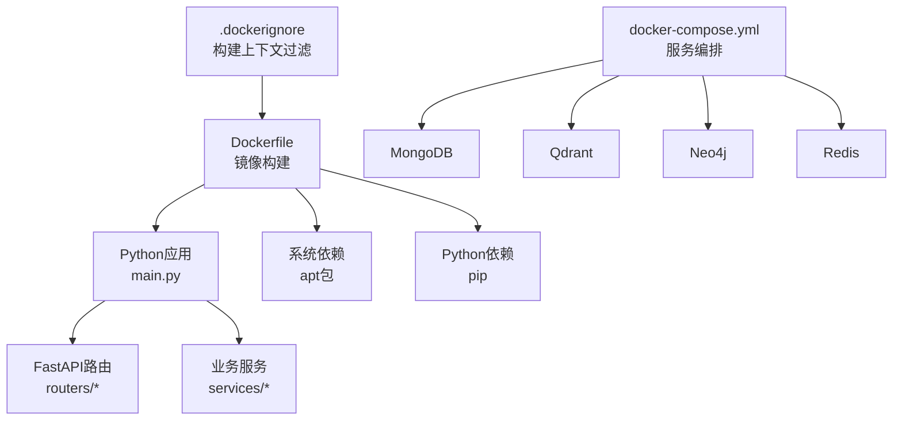
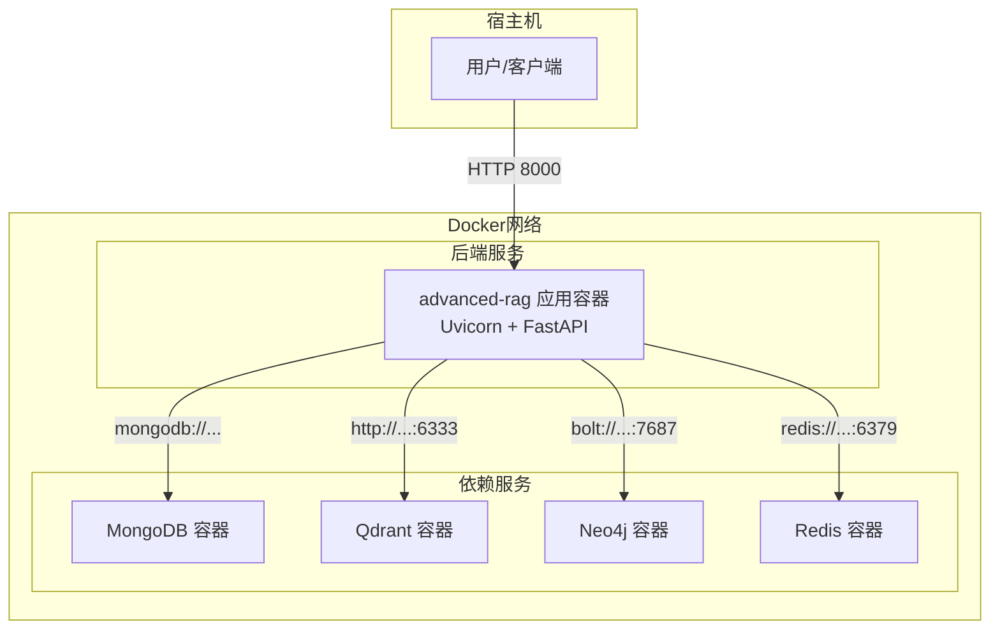
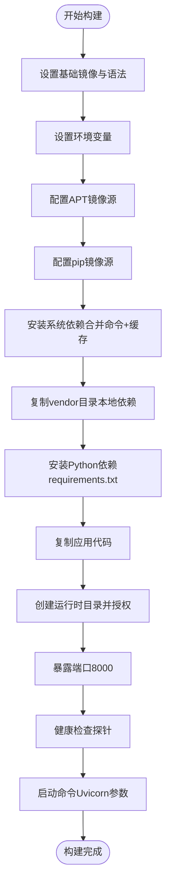
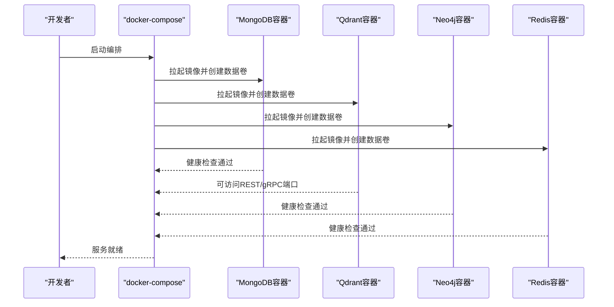
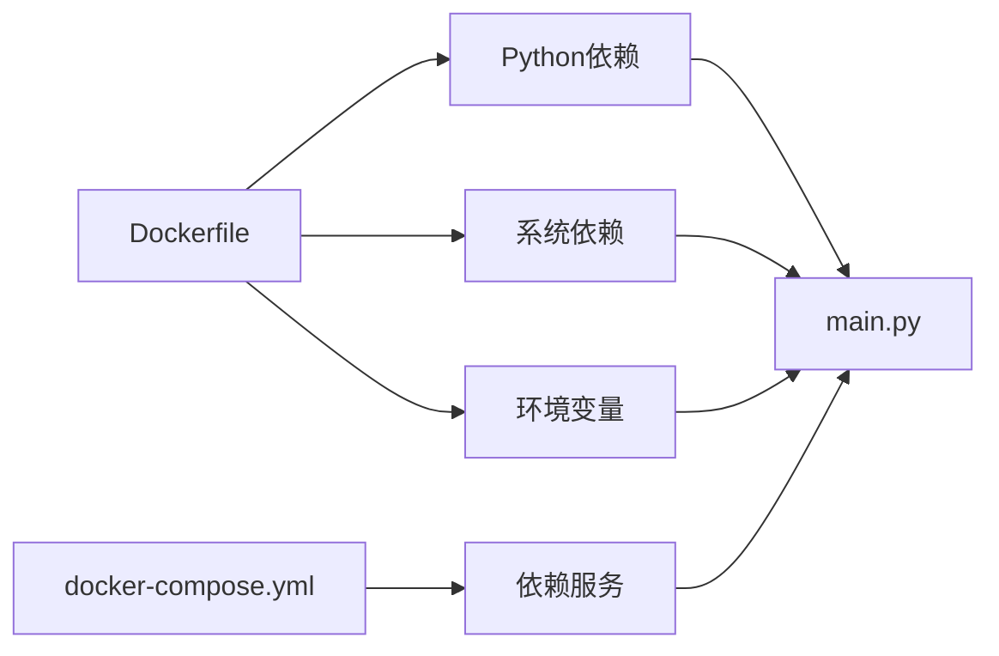

# Docker容器部署

<cite>
**本文引用的文件**
- [Dockerfile](file://Dockerfile)
- [docker-compose.yml](file://docker-compose.yml)
- [.dockerignore](file://.dockerignore)
- [requirements.txt](file://requirements.txt)
- [main.py](file://main.py)
- [README.md](file://README.md)
</cite>

## 目录
1. [简介](#简介)
2. [项目结构](#项目结构)
3. [核心组件](#核心组件)
4. [架构总览](#架构总览)
5. [详细组件分析](#详细组件分析)
6. [依赖关系分析](#依赖关系分析)
7. [性能考虑](#性能考虑)
8. [故障排查指南](#故障排查指南)
9. [结论](#结论)
10. [附录](#附录)

## 简介
本指南面向希望使用Docker部署advanced-rag系统的工程师与运维人员。内容涵盖Dockerfile构建配置（基础镜像、环境变量、系统依赖、缓存优化）、多阶段构建要点（APT镜像源、pip镜像源、依赖安装优化）、容器启动命令（Uvicorn参数、工作进程、端口暴露）、Docker Compose编排（服务、网络、卷、环境变量）、健康检查与故障恢复策略，以及镜像优化、资源限制与日志管理的最佳实践。

## 项目结构
项目采用后端Python（FastAPI）与Docker容器化部署的典型结构。Dockerfile位于项目根目录，负责后端API服务的镜像构建；docker-compose.yml定义了MongoDB、Qdrant、Neo4j、Redis等依赖服务的编排；.dockerignore控制构建上下文排除；requirements.txt声明Python依赖；main.py为应用入口，负责路由注册与Uvicorn启动参数。

图表来源
- [Dockerfile:1-95](file://Dockerfile#L1-L95)
- [docker-compose.yml:1-96](file://docker-compose.yml#L1-L96)
- [main.py:1-171](file://main.py#L1-L171)

章节来源
- [Dockerfile:1-95](file://Dockerfile#L1-L95)
- [docker-compose.yml:1-96](file://docker-compose.yml#L1-L96)
- [.dockerignore:1-92](file://.dockerignore#L1-L92)
- [requirements.txt:1-42](file://requirements.txt#L1-L42)
- [main.py:1-171](file://main.py#L1-L171)
- [README.md:200-227](file://README.md#L200-L227)

## 核心组件
- Dockerfile：定义基础镜像、环境变量、APT与pip镜像源、系统依赖安装、本地依赖处理、应用代码复制、运行时目录创建、端口暴露、健康检查与启动命令。
- docker-compose.yml：定义MongoDB、Qdrant、Neo4j、Redis服务，包含数据卷、网络、健康检查与重启策略。
- .dockerignore：排除Python缓存、日志、测试、IDE、临时文件等，同时确保vendor目录包含在构建上下文中。
- requirements.txt：声明FastAPI、数据库、HTTP、文档解析、文本处理、其他等依赖。
- main.py：应用入口，注册路由、静态文件、CORS、日志中间件，并根据环境变量配置Uvicorn启动参数。

章节来源
- [Dockerfile:11-95](file://Dockerfile#L11-L95)
- [docker-compose.yml:1-96](file://docker-compose.yml#L1-L96)
- [.dockerignore:1-92](file://.dockerignore#L1-L92)
- [requirements.txt:1-42](file://requirements.txt#L1-L42)
- [main.py:55-171](file://main.py#L55-L171)

## 架构总览
下图展示了容器化部署的整体架构：后端API容器承载FastAPI应用，依赖容器化数据库与向量/图数据库服务，通过Docker网络互通；外部通过8000端口访问API，内部通过服务名访问各依赖。

图表来源
- [docker-compose.yml:1-96](file://docker-compose.yml#L1-L96)
- [Dockerfile:89-95](file://Dockerfile#L89-L95)
- [main.py:129-171](file://main.py#L129-L171)

## 详细组件分析

### Dockerfile构建配置
- 基础镜像与语法：使用现代Dockerfile语法，基于精简Python镜像，适合生产部署。
- 环境变量设置：设置Python运行相关变量、环境模式、Uvicorn端口与工作进程数、LibreOffice路径等。
- APT镜像源配置：针对Debian源文件进行替换，使用国内镜像加速下载。
- pip镜像源配置：设置pip索引与可信主机，提升依赖安装速度。
- 系统依赖安装：合并apt安装命令，使用构建缓存挂载减少重复下载，安装git、JPEG、zlib、LibreOffice等。
- 本地依赖处理：要求构建前下载GitHub依赖到vendor目录，避免构建时访问外部网络；检测vendor/PaddleOCR存在性并执行可编辑安装。
- Python依赖安装：使用pip缓存挂载，按requirements.txt安装。
- 应用代码复制：复制agents、chunking、database、embedding、middleware、models、parsers、retrieval、routers、services、utils及入口文件。
- 运行时目录：创建上传、对话上传、资源、头像、缩略图、日志目录并设置权限。
- 端口暴露与健康检查：暴露8000端口，配置健康检查探针调用/health端点。
- 启动命令：通过sh -c方式传入Uvicorn参数，读取环境变量控制主机、端口与工作进程数。

图表来源
- [Dockerfile:11-95](file://Dockerfile#L11-L95)

章节来源
- [Dockerfile:11-95](file://Dockerfile#L11-L95)

### 多阶段构建与缓存优化策略
- 多阶段构建：当前Dockerfile为单阶段构建，但通过APT与pip缓存挂载、合并apt命令、条件安装本地依赖等方式实现“类多阶段”的缓存复用与构建提速。
- APT缓存优化：使用构建缓存挂载类型，避免每次重建时重新下载deb包。
- pip缓存优化：使用pip缓存挂载，加速依赖安装。
- 依赖安装优化：合并apt安装命令，减少镜像层数；对vendor中的本地依赖进行条件安装，避免网络依赖。

章节来源
- [Dockerfile:38-67](file://Dockerfile#L38-L67)

### 容器启动命令与Uvicorn参数
- 端口与主机：通过环境变量控制Uvicorn监听地址与端口，默认8000。
- 工作进程数：通过环境变量控制工作进程数，默认24；开发环境单worker以支持热重载。
- keep-alive与并发：设置较长的keep-alive超时与每worker并发连接上限，适配大文件上传与高并发场景。
- reload策略：生产环境禁用reload，开发环境启用。

章节来源
- [Dockerfile:94](file://Dockerfile#L94)
- [main.py:129-171](file://main.py#L129-L171)

### Docker Compose编排配置
- 服务定义：MongoDB、Qdrant、Neo4j、Redis四类服务，分别映射必要端口。
- 网络配置：统一使用bridge网络，便于容器间通信。
- 数据卷挂载：为各服务持久化数据目录，确保重启后数据不丢失。
- 环境变量传递：MongoDB设置管理员账号密码与数据库名；Neo4j启用APOC插件并设置认证。
- 健康检查：MongoDB与Redis配置健康检查，Qdrant通过端口映射暴露REST/gRPC。
- 重启策略：unless-stopped，保证服务异常退出后自动恢复。

图表来源
- [docker-compose.yml:1-96](file://docker-compose.yml#L1-L96)

章节来源
- [docker-compose.yml:1-96](file://docker-compose.yml#L1-L96)

### 健康检查与故障恢复策略
- 应用健康检查：Dockerfile中配置健康检查探针调用/health端点，设置轮询间隔、超时、启动期与重试次数。
- 依赖健康检查：MongoDB与Redis服务配置健康检查探针，Qdrant通过端口映射确认可用。
- 故障恢复：依赖服务设置unless-stopped重启策略；应用容器可结合编排的restart策略实现自动恢复。
- 建议：在生产环境中增加更细粒度的探针（如数据库连接、向量/图数据库可用性），并在编排中为应用容器也配置健康检查与重启策略。

章节来源
- [Dockerfile:91-92](file://Dockerfile#L91-L92)
- [docker-compose.yml:18-24](file://docker-compose.yml#L18-L24)
- [docker-compose.yml:70-75](file://docker-compose.yml#L70-L75)

### 镜像优化、资源限制与日志管理
- 镜像优化：使用精简基础镜像、合并apt命令、缓存pip与apt、排除无关文件（.dockerignore）。
- 资源限制：可在docker run或compose中为应用容器设置CPU/内存限制，避免资源争用。
- 日志管理：应用日志写入logs目录，建议在容器编排中配置日志驱动与轮转策略，集中收集到日志平台。

章节来源
- [.dockerignore:1-92](file://.dockerignore#L1-L92)
- [Dockerfile:84-87](file://Dockerfile#L84-L87)
- [main.py:110-127](file://main.py#L110-L127)

## 依赖关系分析
Dockerfile与应用入口之间的依赖关系如下：Dockerfile定义的环境变量与系统/Python依赖直接影响main.py的运行；docker-compose定义的服务依赖为应用提供数据库与向量/图数据库支持。

图表来源
- [Dockerfile:14-67](file://Dockerfile#L14-L67)
- [requirements.txt:1-42](file://requirements.txt#L1-L42)
- [main.py:20-53](file://main.py#L20-L53)
- [docker-compose.yml:1-96](file://docker-compose.yml#L1-L96)

章节来源
- [Dockerfile:14-67](file://Dockerfile#L14-L67)
- [requirements.txt:1-42](file://requirements.txt#L1-L42)
- [main.py:20-53](file://main.py#L20-L53)
- [docker-compose.yml:1-96](file://docker-compose.yml#L1-L96)

## 性能考虑
- 并发与工作进程：生产环境使用较多Uvicorn工作进程，提高并发处理能力；开发环境单worker便于调试。
- keep-alive与连接数：适当延长keep-alive超时与限制每worker并发连接数，平衡资源占用与吞吐。
- 依赖安装缓存：利用pip与apt缓存挂载，显著缩短重复构建时间。
- 镜像源优化：国内镜像源提升依赖下载速度，减少构建时间。
- 体积优化：排除不必要的构建上下文文件，使用精简基础镜像。

章节来源
- [Dockerfile:38-67](file://Dockerfile#L38-L67)
- [main.py:162-171](file://main.py#L162-L171)

## 故障排查指南
- 构建失败（vendor缺失）：Dockerfile在安装Python依赖前校验vendor/PaddleOCR是否存在，若不存在会报错并提示先下载依赖脚本。请先执行下载脚本再构建。
- 端口冲突：确认宿主机8000端口未被占用；如需变更，修改映射或Uvicorn端口。
- 依赖安装缓慢：确认网络可访问国内镜像源；检查pip与apt缓存是否生效。
- 健康检查失败：检查应用/服务的/health端点与端口映射；确认依赖服务已就绪。
- 日志定位：查看应用日志目录与容器日志输出，结合异常处理器返回信息定位问题。

章节来源
- [Dockerfile:58-67](file://Dockerfile#L58-L67)
- [Dockerfile:91-92](file://Dockerfile#L91-L92)
- [main.py:110-127](file://main.py#L110-L127)
- [README.md:200-227](file://README.md#L200-L227)

## 结论
该Docker部署方案通过精简基础镜像、国内镜像源、缓存优化与本地依赖处理，实现了高效稳定的构建流程；配合docker-compose编排，能够快速搭建包含MongoDB、Qdrant、Neo4j、Redis在内的完整后端服务栈。生产部署建议进一步完善健康检查与资源限制，并结合日志与监控体系实现可观测性与高可用。

## 附录
- 构建与运行命令参考：见项目README中的Docker部署章节。
- 端口与服务映射：应用容器对外暴露8000端口；依赖服务按需映射对应端口。
- 环境变量文件：通过--env-file传递.env.production或开发环境变量文件。

章节来源
- [README.md:200-227](file://README.md#L200-L227)
- [Dockerfile:89-95](file://Dockerfile#L89-L95)
- [docker-compose.yml:1-96](file://docker-compose.yml#L1-L96)