# Nginx反向代理配置

<cite>
**本文档引用的文件**
- [docker-compose.yml](file://docker-compose.yml)
- [Dockerfile](file://Dockerfile)
- [main.py](file://main.py)
- [next.config.ts](file://web/next.config.ts)
- [health.py](file://routers/health.py)
- [monitoring.py](file://utils/monitoring.py)
- [start-backend-8000.ps1](file://scripts/start-backend-8000.ps1)
- [stop-backend-8000.ps1](file://scripts/stop-backend-8000.ps1)
</cite>

## 目录
1. [简介](#简介)
2. [项目结构](#项目结构)
3. [核心组件](#核心组件)
4. [架构概览](#架构概览)
5. [详细组件分析](#详细组件分析)
6. [依赖关系分析](#依赖关系分析)
7. [性能考虑](#性能考虑)
8. [故障排除指南](#故障排除指南)
9. [结论](#结论)

## 简介

本指南为Advanced RAG系统的Nginx反向代理配置提供完整的实施指导。该系统采用前后端分离架构，前端使用Next.js，后端基于FastAPI/Uvicorn运行在8000端口。Nginx作为反向代理服务器，负责流量分发、SSL终止、静态资源服务和负载均衡。

系统的核心特点：
- 前端：Next.js应用，支持静态文件服务和API代理
- 后端：FastAPI应用，提供RESTful API服务
- 数据层：MongoDB、Qdrant、Neo4j、Redis等服务
- 部署：Docker容器化部署，支持生产环境优化

## 项目结构

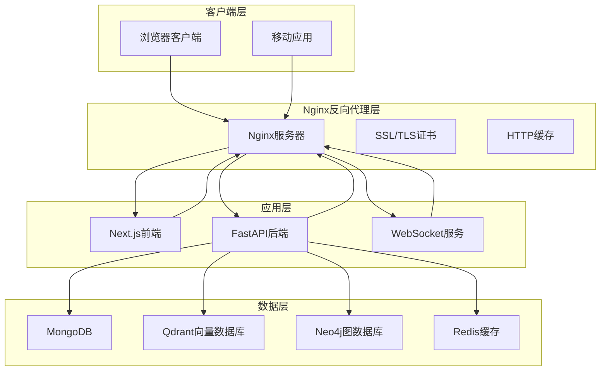

**图表来源**
- [docker-compose.yml:1-96](file://docker-compose.yml#L1-L96)
- [Dockerfile:11-95](file://Dockerfile#L11-L95)
- [main.py:55-171](file://main.py#L55-L171)

**章节来源**
- [docker-compose.yml:1-96](file://docker-compose.yml#L1-L96)
- [Dockerfile:1-95](file://Dockerfile#L1-L95)
- [main.py:1-171](file://main.py#L1-L171)

## 核心组件

### Nginx反向代理配置要点

基于项目分析，Nginx配置应重点关注以下组件：

#### 1. 基础反向代理设置
- **上游服务器定义**：指向后端FastAPI服务（localhost:8000）
- **静态资源服务**：处理Next.js构建产物和API静态文件
- **WebSocket支持**：启用HTTP/1.1升级机制

#### 2. SSL/TLS安全配置
- **证书管理**：Let's Encrypt自动证书或自签名证书
- **加密套件**：现代TLS配置，禁用过时算法
- **安全头部**：HSTS、X-Frame-Options、Content-Security-Policy等

#### 3. 负载均衡策略
- **轮询算法**：默认轮询，支持权重分配
- **健康检查**：基于HTTP状态码的健康探测
- **故障转移**：自动切换到可用节点

**章节来源**
- [main.py:129-171](file://main.py#L129-L171)
- [next.config.ts:12-34](file://web/next.config.ts#L12-L34)

## 架构概览

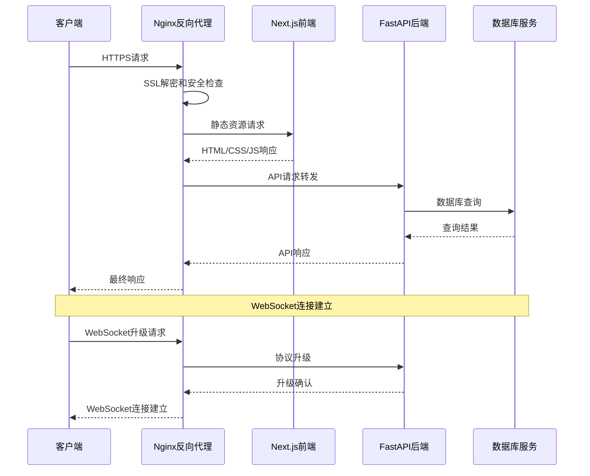

**图表来源**
- [docker-compose.yml:1-96](file://docker-compose.yml#L1-L96)
- [main.py:55-171](file://main.py#L55-L171)
- [health.py:23-87](file://routers/health.py#L23-L87)

## 详细组件分析

### 1. Nginx安装和基础配置

#### 1.1 基础安装步骤
- **Ubuntu/Debian系统**：使用apt包管理器安装nginx-full
- **CentOS/RHEL系统**：配置EPEL仓库后安装nginx
- **验证安装**：检查nginx -V版本信息和配置语法

#### 1.2 基本配置文件结构
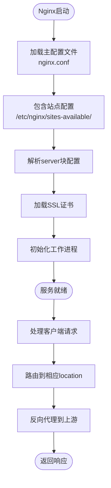

**图表来源**
- [main.py:129-171](file://main.py#L129-L171)

### 2. SSL证书配置和HTTPS强制跳转

#### 2.1 Let's Encrypt自动证书配置
- **证书申请**：使用certbot自动申请和续期
- **域名配置**：支持通配符域名和多域名证书
- **证书存储**：标准化的/etc/letsencrypt目录结构

#### 2.2 HTTPS强制跳转实现
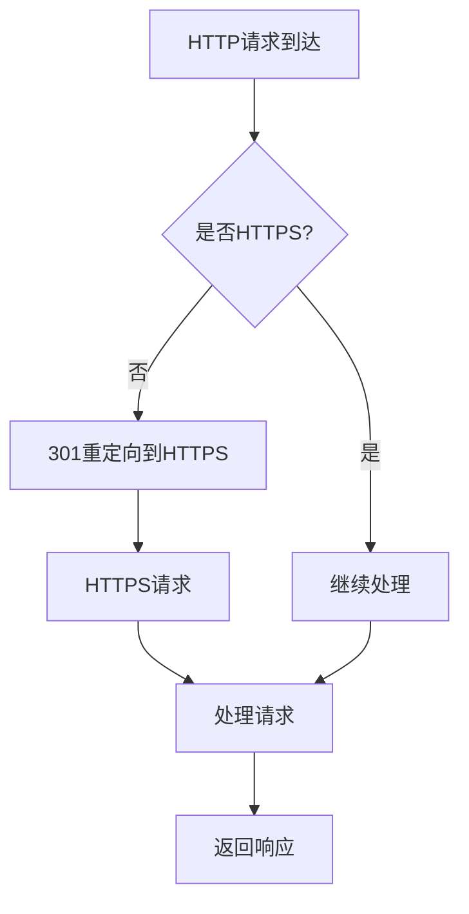

**图表来源**
- [docker-compose.yml:1-96](file://docker-compose.yml#L1-L96)

### 3. 反向代理配置详解

#### 3.1 上游服务器定义
基于项目分析，后端服务运行在localhost:8000端口：

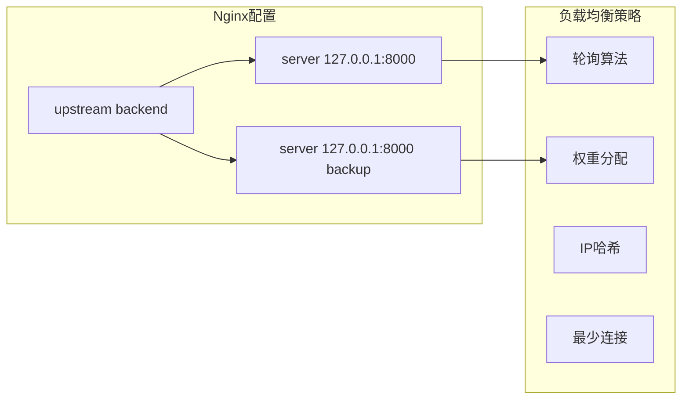

**图表来源**
- [main.py:129-171](file://main.py#L129-L171)

#### 3.2 负载均衡策略配置
- **轮询算法**：默认策略，适合大多数场景
- **权重分配**：可根据服务器性能调整权重
- **IP哈希**：确保同一客户端始终连接到同一后端
- **最少连接**：动态选择连接数最少的后端

#### 3.3 健康检查配置
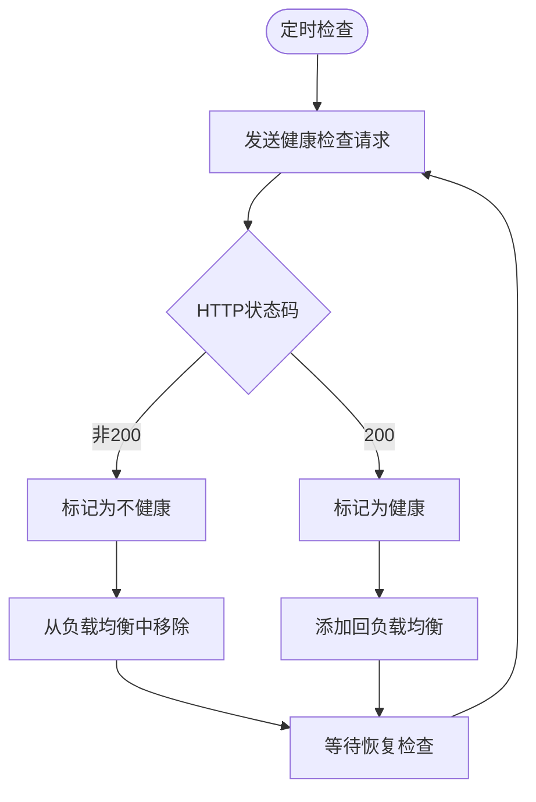

**图表来源**
- [health.py:23-87](file://routers/health.py#L23-L87)

### 4. 静态资源服务配置

#### 4.1 缓存策略配置
- **短期缓存**：CSS、JS文件，1年有效期
- **长期缓存**：图片、字体文件，1年有效期
- **无缓存**：HTML文件，每次请求验证

#### 4.2 压缩配置
- **Gzip压缩**：对文本类文件启用gzip
- **Brotli压缩**：现代浏览器支持时使用brotli
- **压缩级别**：平衡压缩比和CPU使用率

#### 4.3 CDN集成
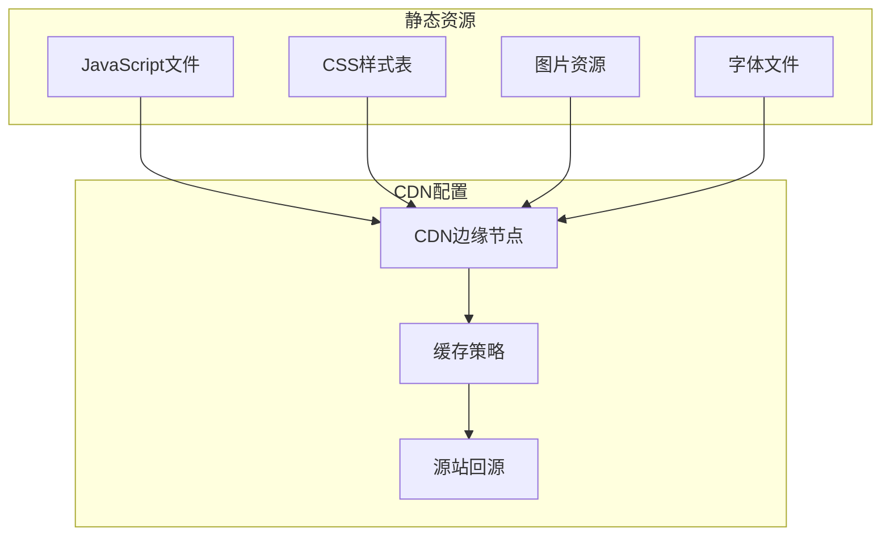

**图表来源**
- [next.config.ts:12-34](file://web/next.config.ts#L12-L34)

### 5. WebSocket支持配置

#### 5.1 升级协议处理
- **协议升级**：从HTTP升级到WebSocket
- **头部处理**：正确传递Upgrade和Connection头部
- **Keep-Alive**：维持长连接的空闲超时设置

#### 5.2 长连接保持
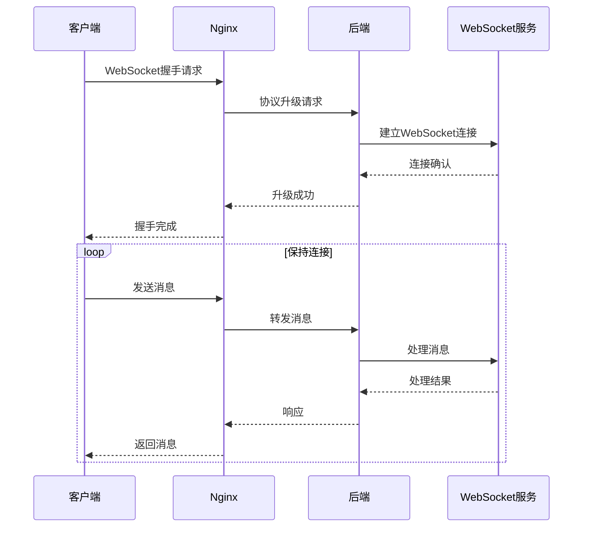

**图表来源**
- [main.py:129-171](file://main.py#L129-L171)

### 6. 性能优化配置

#### 6.1 连接池设置
- **worker_connections**：每个worker的最大连接数
- **multi_accept**：允许一次接受多个连接
- **use**：连接复用策略（epoll、kqueue等）

#### 6.2 超时配置
- **client_timeout**：客户端超时时间
- **proxy_timeout**：代理超时时间
- **keepalive_timeout**：Keep-Alive超时时间

#### 6.3 缓冲区优化
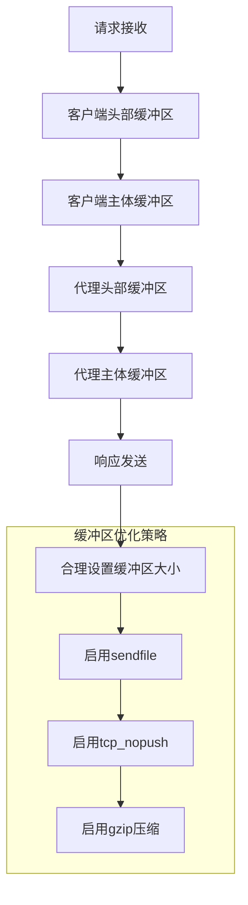

**图表来源**
- [monitoring.py:78-111](file://utils/monitoring.py#L78-L111)

### 7. 安全加固配置

#### 7.1 访问控制
- **IP白名单**：限制特定IP访问敏感接口
- **速率限制**：防止暴力破解和DDoS攻击
- **请求大小限制**：防止大文件上传攻击

#### 7.2 DDoS防护
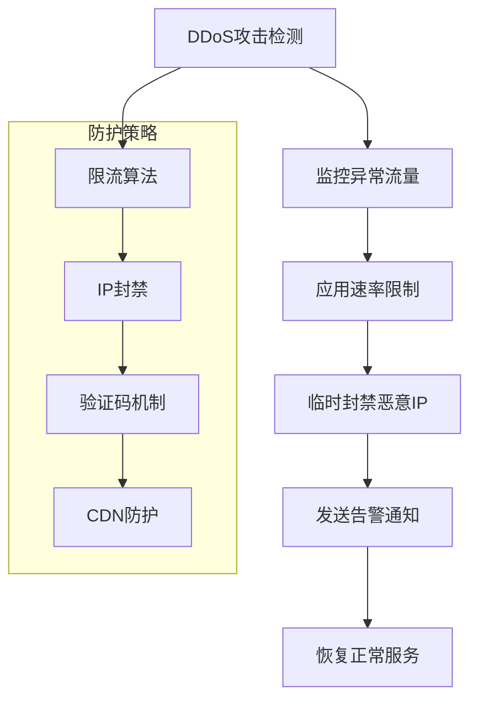

**图表来源**
- [docker-compose.yml:18-24](file://docker-compose.yml#L18-L24)

#### 7.3 WAF集成建议
- **ModSecurity**：Apache模块，提供Web应用防火墙功能
- **Cloudflare WAF**：云端WAF服务，提供DDoS防护
- **AWS WAF**：Amazon Web Services提供的WAF服务

**章节来源**
- [docker-compose.yml:1-96](file://docker-compose.yml#L1-L96)
- [monitoring.py:1-185](file://utils/monitoring.py#L1-L185)

## 依赖关系分析

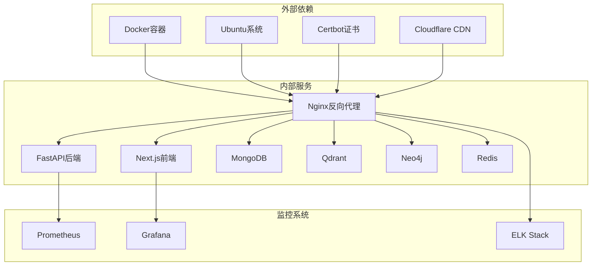

**图表来源**
- [docker-compose.yml:1-96](file://docker-compose.yml#L1-L96)
- [Dockerfile:1-95](file://Dockerfile#L1-L95)

**章节来源**
- [docker-compose.yml:1-96](file://docker-compose.yml#L1-L96)
- [Dockerfile:1-95](file://Dockerfile#L1-L95)

## 性能考虑

### 1. 系统资源监控
基于项目中的性能监控实现，建议在Nginx层面增加以下监控：

#### 1.1 关键性能指标
- **连接数统计**：活跃连接数、新连接数
- **请求处理时间**：平均响应时间、95分位数
- **错误率监控**：4xx、5xx错误统计
- **带宽使用**：入站、出站流量统计

#### 1.2 性能优化建议
- **worker进程数**：CPU核心数×2+1的最优配置
- **缓冲区大小**：根据业务类型调整读写缓冲区
- **压缩配置**：启用gzip但避免过度压缩CPU
- **缓存策略**：合理设置静态资源缓存时间

**章节来源**
- [monitoring.py:49-111](file://utils/monitoring.py#L49-L111)
- [main.py:162-171](file://main.py#L162-L171)

## 故障排除指南

### 1. 常见问题诊断

#### 1.1 后端服务不可达
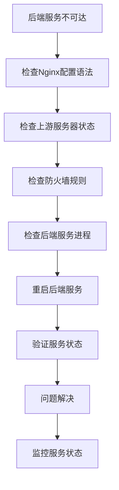

#### 1.2 SSL证书问题
- **证书过期**：使用certbot自动续期
- **证书链不完整**：确保证书文件包含完整链
- **权限问题**：检查证书文件权限（644）

#### 1.3 性能问题排查
- **高CPU使用率**：检查worker进程数配置
- **内存泄漏**：监控内存使用趋势
- **连接数过多**：检查超时配置和keepalive设置

**章节来源**
- [health.py:23-87](file://routers/health.py#L23-L87)
- [start-backend-8000.ps1:1-89](file://scripts/start-backend-8000.ps1#L1-L89)
- [stop-backend-8000.ps1:1-82](file://scripts/stop-backend-8000.ps1#L1-L82)

### 2. 日志分析
- **访问日志**：分析请求模式和用户行为
- **错误日志**：定位服务异常和配置问题
- **健康检查日志**：监控服务可用性状态

## 结论

本指南提供了Advanced RAG系统完整的Nginx反向代理配置方案。通过合理的架构设计、安全配置和性能优化，可以确保系统的高可用性和高性能。

关键成功因素：
1. **正确的架构设计**：前后端分离，清晰的服务边界
2. **完善的安全措施**：SSL/TLS加密、访问控制、DDoS防护
3. **高效的性能优化**：合理的缓存策略、负载均衡、监控告警
4. **可靠的运维保障**：自动化部署、健康检查、故障恢复

建议定期审查和更新配置，根据实际业务需求调整优化策略，确保系统持续稳定运行。