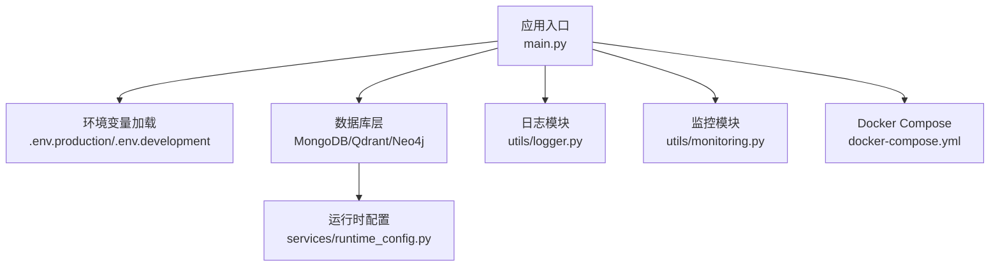
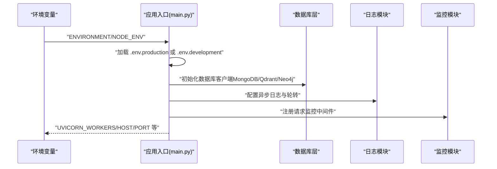
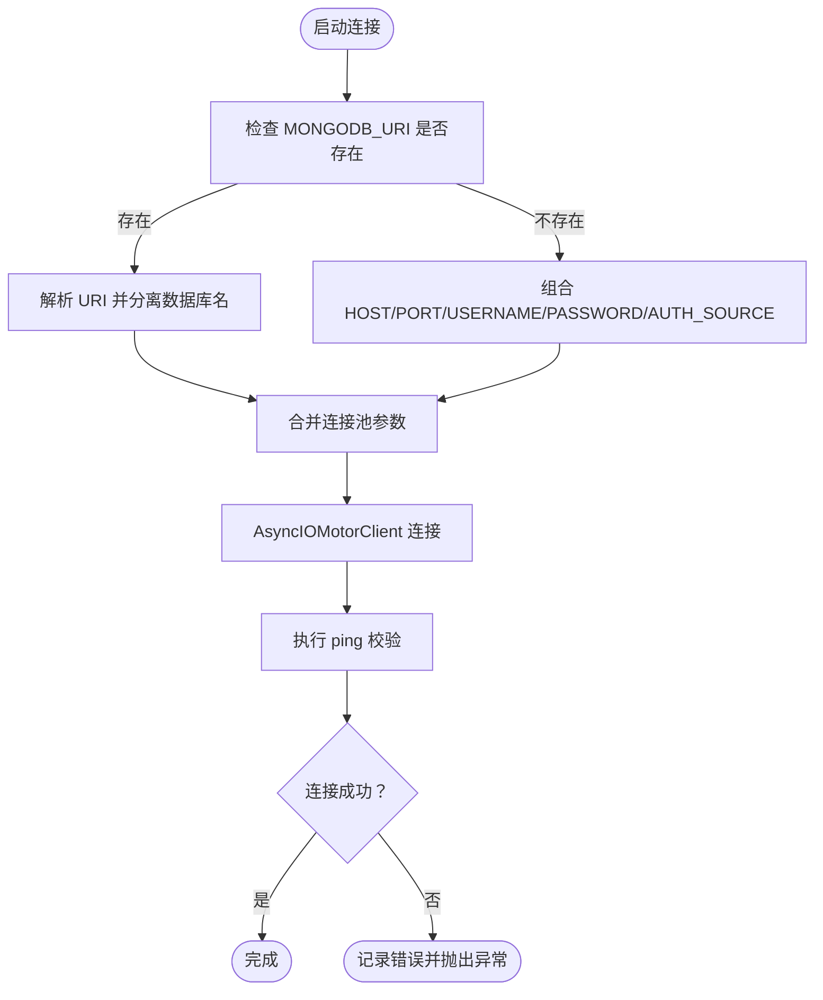
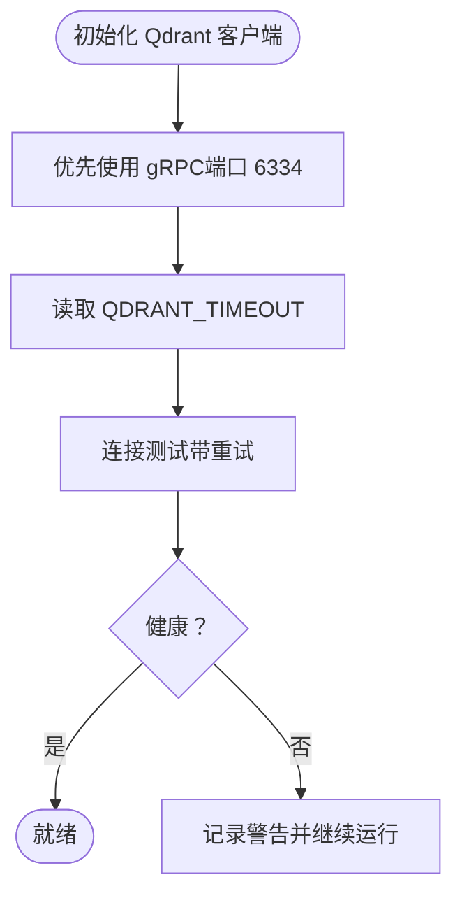
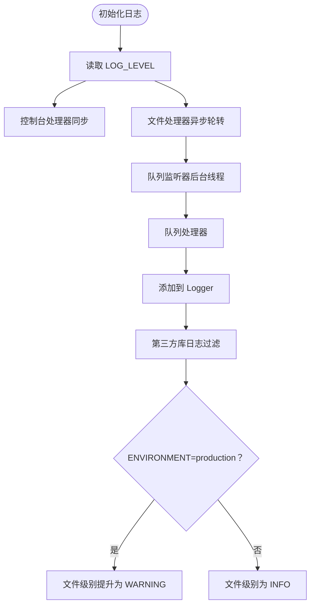
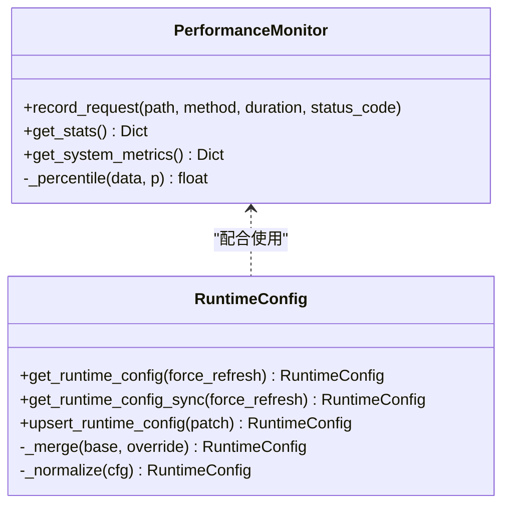
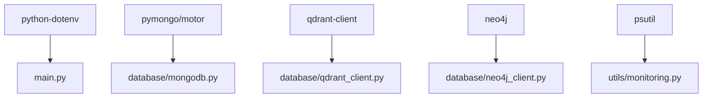

# 环境变量配置

<cite>
**本文档引用的文件**
- [main.py](file://main.py)
- [database/mongodb.py](file://database/mongodb.py)
- [database/neo4j_client.py](file://database/neo4j_client.py)
- [database/qdrant_client.py](file://database/qdrant_client.py)
- [utils/logger.py](file://utils/logger.py)
- [utils/monitoring.py](file://utils/monitoring.py)
- [services/runtime_config.py](file://services/runtime_config.py)
- [docker-compose.yml](file://docker-compose.yml)
- [README.md](file://README.md)
- [requirements.txt](file://requirements.txt)
</cite>

## 目录
1. [简介](#简介)
2. [项目结构](#项目结构)
3. [核心组件](#核心组件)
4. [架构总览](#架构总览)
5. [详细组件分析](#详细组件分析)
6. [依赖分析](#依赖分析)
7. [性能考虑](#性能考虑)
8. [故障排除指南](#故障排除指南)
9. [结论](#结论)
10. [附录](#附录)

## 简介
本指南面向生产环境，系统性梳理本项目的环境变量配置，涵盖数据库连接、API密钥与第三方服务、安全配置（JWT密钥、密码哈希、敏感信息加密）、性能调优（内存限制、并发连接、超时）、日志配置（级别、格式、轮转）、监控配置（APM、指标、告警）、数据库配置（连接池、事务隔离、备份）、缓存配置（Redis连接、策略、失效时间）。内容基于代码库实际实现，确保可落地、可验证。

## 项目结构
后端基于 FastAPI，通过环境变量加载不同环境的配置文件（.env.production 或 .env.development），并在启动时决定工作进程数、超时与并发限制。数据库层包含 MongoDB、Qdrant、Neo4j；缓存层在项目说明中提及 Redis（可选）；日志与监控分别由独立模块提供。

**图表来源**
- [main.py:20-52](file://main.py#L20-L52)
- [docker-compose.yml:1-96](file://docker-compose.yml#L1-L96)

**章节来源**
- [main.py:20-52](file://main.py#L20-L52)
- [README.md:125-166](file://README.md#L125-L166)

## 核心组件
- 环境变量加载与模式选择：根据 ENVIRONMENT 或 NODE_ENV 选择 .env.production 或 .env.development，并在未找到时回退到 .env 或根目录 .env。
- 数据库连接：MongoDB（连接池参数可调）、Qdrant（gRPC 优先、超时可调）、Neo4j（凭据与容器内 URI 自适应）。
- 日志系统：异步文件处理器、轮转策略、生产环境日志级别调整。
- 性能监控：请求耗时统计、慢请求检测、系统指标采集。
- 运行时配置：MongoDB 持久化 + TTL 缓存的运行时参数（并发、批大小等）。

**章节来源**
- [main.py:20-52](file://main.py#L20-L52)
- [database/mongodb.py:99-184](file://database/mongodb.py#L99-L184)
- [database/qdrant_client.py:66-96](file://database/qdrant_client.py#L66-L96)
- [database/neo4j_client.py:11-38](file://database/neo4j_client.py#L11-L38)
- [utils/logger.py:15-82](file://utils/logger.py#L15-L82)
- [utils/monitoring.py:13-111](file://utils/monitoring.py#L13-L111)
- [services/runtime_config.py:140-188](file://services/runtime_config.py#L140-L188)

## 架构总览
下图展示生产环境变量如何驱动应用启动、数据库连接与监控：

**图表来源**
- [main.py:20-52](file://main.py#L20-L52)
- [main.py:129-171](file://main.py#L129-L171)
- [utils/logger.py:15-82](file://utils/logger.py#L15-L82)
- [utils/monitoring.py:163-184](file://utils/monitoring.py#L163-L184)

## 详细组件分析

### 数据库配置（MongoDB）
- 连接字符串来源：优先使用 MONGODB_URI；若缺失则组合 MONGODB_HOST/MONGODB_PORT/MONGODB_USERNAME/MONGODB_PASSWORD/MONGODB_AUTH_SOURCE，并设置默认数据库名 MONGODB_DB_NAME。
- 连接池参数（均支持通过环境变量覆盖）：
  - maxPoolSize：每 worker 最大连接数（建议 100-200）
  - minPoolSize：最小连接池大小
  - maxIdleTimeMS：连接空闲超时（默认 30000ms）
  - serverSelectionTimeoutMS：服务器选择超时（默认 5000ms）
  - connectTimeoutMS：连接超时（默认 10000ms）
  - socketTimeoutMS：socket 超时（默认 30000ms）
- 启动时 ping 校验，失败时记录详细提示并抛出错误。

**图表来源**
- [database/mongodb.py:99-184](file://database/mongodb.py#L99-L184)

**章节来源**
- [database/mongodb.py:99-184](file://database/mongodb.py#L99-L184)

### 数据库配置（Qdrant）
- 优先使用 gRPC 连接（端口 6334），避免 HTTP/httpx 的 502 问题；支持本地 HTTP 时自动忽略 API key 以避免不安全连接警告。
- 超时与重试：通过 QDRANT_TIMEOUT 控制超时；插入操作具备指数退避重试与维度不匹配自动重建集合。
- 健康检查：通过 get_collections 判断服务可用性。

**图表来源**
- [database/qdrant_client.py:66-123](file://database/qdrant_client.py#L66-L123)

**章节来源**
- [database/qdrant_client.py:66-123](file://database/qdrant_client.py#L66-L123)

### 数据库配置（Neo4j）
- 读取 NEO4J_URI、NEO4J_USER、NEO4J_PASSWORD；容器内 localhost 自动替换为 host.docker.internal。
- 连接失败时记录错误并置空驱动。

**章节来源**
- [database/neo4j_client.py:11-38](file://database/neo4j_client.py#L11-L38)

### 缓存配置（Redis）
- 项目说明中提及 Redis 为可选缓存服务，提供 REDIS_HOST、REDIS_PORT、REDIS_DB 等环境变量；实际缓存实现位于前端 Next.js（本仓库未包含后端 Redis 客户端代码）。

**章节来源**
- [README.md:149-153](file://README.md#L149-L153)

### 日志配置
- 日志级别：通过 LOG_LEVEL 控制（默认 INFO）。
- 输出格式：统一的简单格式（时间-级别-名称-消息）。
- 轮转策略：单文件最大 10MB，保留 5 个备份。
- 异步写入：使用队列与后台线程，避免阻塞主线程。
- 生产环境：文件处理器提升到 WARNING 级别，减少日志体积。

**图表来源**
- [utils/logger.py:15-82](file://utils/logger.py#L15-L82)

**章节来源**
- [utils/logger.py:15-82](file://utils/logger.py#L15-L82)

### 监控配置
- 请求性能：记录每个路径/方法的耗时、错误计数，支持 p50/p95/p99 百分位统计。
- 慢请求检测：超过 1 秒记录警告。
- 系统指标：CPU、内存、磁盘使用率与进程级指标。
- 运行时配置：MongoDB 持久化 + TTL 缓存，支持动态更新与强制刷新。

**图表来源**
- [utils/monitoring.py:13-111](file://utils/monitoring.py#L13-L111)
- [services/runtime_config.py:140-188](file://services/runtime_config.py#L140-L188)

**章节来源**
- [utils/monitoring.py:13-111](file://utils/monitoring.py#L13-L111)
- [services/runtime_config.py:140-188](file://services/runtime_config.py#L140-L188)

### 安全相关配置
- SECRET_KEY：项目说明中要求生产环境必须修改（用于签名/加密场景）。
- API 密钥管理：Qdrant 支持 QDRANT_API_KEY；MongoDB/Neo4j 通过连接字符串或独立变量注入凭据。
- JWT 密钥：项目未显式使用 JWT；如需 JWT，应新增 SECRET_KEY 并在认证流程中使用。
- 密码哈希与敏感信息加密：项目未提供专门的密码哈希或对称加密实现；建议在认证模块中引入标准库或第三方库进行处理。

**章节来源**
- [README.md:130-133](file://README.md#L130-L133)
- [database/qdrant_client.py:35-76](file://database/qdrant_client.py#L35-L76)
- [database/mongodb.py:101-121](file://database/mongodb.py#L101-L121)
- [database/neo4j_client.py:11-14](file://database/neo4j_client.py#L11-L14)

### 性能调优参数
- Uvicorn 工作进程：生产环境默认 24（可通过 UVICORN_WORKERS 覆盖）。
- keep-alive 超时：900 秒（15 分钟），适合大文件上传。
- 并发连接限制：每个 worker 2000。
- 数据库连接池：MongoDB maxPoolSize/minPoolSize/maxIdleTimeMS/serverSelection/connect/socketTimeoutMS。
- Qdrant 超时：QDRANT_TIMEOUT。
- 运行时参数：kg_concurrency、kg_chunk_timeout_s、kg_max_chunks、embedding_batch_size、embedding_concurrency、ocr_concurrency 等（MongoDB 持久化 + TTL 缓存）。

**章节来源**
- [main.py:144-171](file://main.py#L144-L171)
- [database/mongodb.py:129-136](file://database/mongodb.py#L129-L136)
- [database/qdrant_client.py:67-76](file://database/qdrant_client.py#L67-L76)
- [services/runtime_config.py:25-83](file://services/runtime_config.py#L25-L83)

### 数据库配置（事务隔离与备份）
- 事务隔离：MongoDB 事务隔离级别由部署与驱动配置决定；本项目未显式设置隔离级别。
- 备份策略：项目未内置备份脚本；建议结合各数据库官方工具制定策略（如 MongoDB 的 mongodump、Qdrant 的快照/存储卷备份、Neo4j 的备份工具）。

**章节来源**
- [database/mongodb.py:158-166](file://database/mongodb.py#L158-L166)
- [database/qdrant_client.py:124-139](file://database/qdrant_client.py#L124-L139)

## 依赖分析
- 环境变量加载依赖 python-dotenv。
- 数据库客户端依赖各自官方 SDK（pymongo/motor、qdrant-client、neo4j）。
- 日志与监控模块为纯 Python 实现，无额外外部依赖。

**图表来源**
- [requirements.txt:16-17](file://requirements.txt#L16-L17)
- [requirements.txt:10-13](file://requirements.txt#L10-L13)
- [requirements.txt:4-6](file://requirements.txt#L4-L6)
- [utils/monitoring.py:9-10](file://utils/monitoring.py#L9-L10)

**章节来源**
- [requirements.txt:16-17](file://requirements.txt#L16-L17)
- [requirements.txt:10-13](file://requirements.txt#L10-L13)
- [requirements.txt:4-6](file://requirements.txt#L4-L6)

## 性能考虑
- 生产环境多 worker：合理设置 UVICORN_WORKERS，避免过高导致上下文切换开销。
- 连接池与超时：MongoDB 连接池参数与 Qdrant 超时需结合并发与延迟特征调优。
- 日志级别：生产环境提升文件日志级别，降低 IO 压力。
- 慢请求检测：关注监控模块中的慢请求告警，定位瓶颈。

[本节为通用指导，无需具体文件分析]

## 故障排除指南
- MongoDB 连接失败：检查 MONGODB_URI 或 HOST/PORT/USERNAME/PASSWORD/AUTH_SOURCE 组合；确认容器网络与端口映射；查看启动日志中的提示信息。
- Qdrant 连接失败：确认 URL 与端口；本地 HTTP 时忽略 API key；必要时改为 gRPC；关注维度不匹配导致的重建。
- Neo4j 连接失败：检查 URI、用户名与密码；容器内使用 host.docker.internal 替换 localhost。
- 日志文件过大：调整轮转参数或提升日志级别；生产环境默认仅记录 WARNING 及以上。
- 运行时配置读取失败：确认 MongoDB 中 app_settings 集合存在且包含 runtime_config 文档。

**章节来源**
- [database/mongodb.py:176-184](file://database/mongodb.py#L176-L184)
- [database/qdrant_client.py:100-123](file://database/qdrant_client.py#L100-L123)
- [database/neo4j_client.py:30-33](file://database/neo4j_client.py#L30-L33)
- [utils/logger.py:77-81](file://utils/logger.py#L77-L81)
- [services/runtime_config.py:154-157](file://services/runtime_config.py#L154-L157)

## 结论
本指南基于代码库实际实现，给出了生产环境变量配置的完整清单与最佳实践。建议在生产部署前完成以下动作：
- 明确各数据库连接参数与连接池配置；
- 设置合适的日志级别与轮转策略；
- 启用慢请求与系统指标监控；
- 制定数据库备份与恢复策略；
- 为需要的场景补充 JWT 密钥与密码哈希/加密实现。

[本节为总结，无需具体文件分析]

## 附录

### 环境变量清单（生产推荐）
- 应用与运行
  - ENVIRONMENT=production
  - UVICORN_WORKERS=24
  - HOST=0.0.0.0
  - PORT=8000
- 数据库
  - MONGODB_URI 或 MONGODB_HOST/MONGODB_PORT/MONGODB_USERNAME/MONGODB_PASSWORD/MONGODB_AUTH_SOURCE/MONGODB_DB_NAME
  - QDRANT_URL、QDRANT_API_KEY、QDRANT_TIMEOUT
  - NEO4J_URI、NEO4J_USER、NEO4J_PASSWORD
  - REDIS_HOST、REDIS_PORT、REDIS_DB（可选）
- 安全
  - SECRET_KEY（生产必须修改）
- 日志
  - LOG_LEVEL=INFO（生产可设为 WARNING）
- 运行时参数（MongoDB 持久化 + TTL 缓存）
  - kg_concurrency、kg_chunk_timeout_s、kg_max_chunks、embedding_batch_size、embedding_concurrency、ocr_concurrency

**章节来源**
- [README.md:130-166](file://README.md#L130-L166)
- [database/mongodb.py:129-136](file://database/mongodb.py#L129-L136)
- [database/qdrant_client.py:67-76](file://database/qdrant_client.py#L67-L76)
- [database/neo4j_client.py:11-14](file://database/neo4j_client.py#L11-L14)
- [utils/logger.py:18-21](file://utils/logger.py#L18-L21)
- [services/runtime_config.py:25-83](file://services/runtime_config.py#L25-L83)