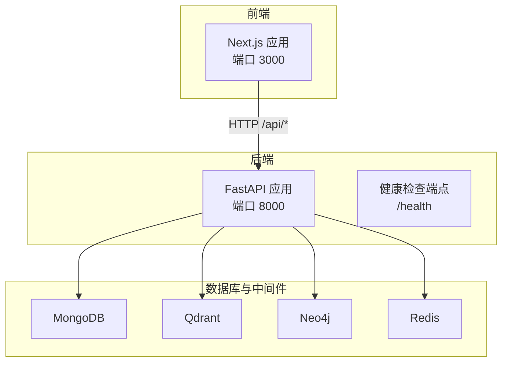
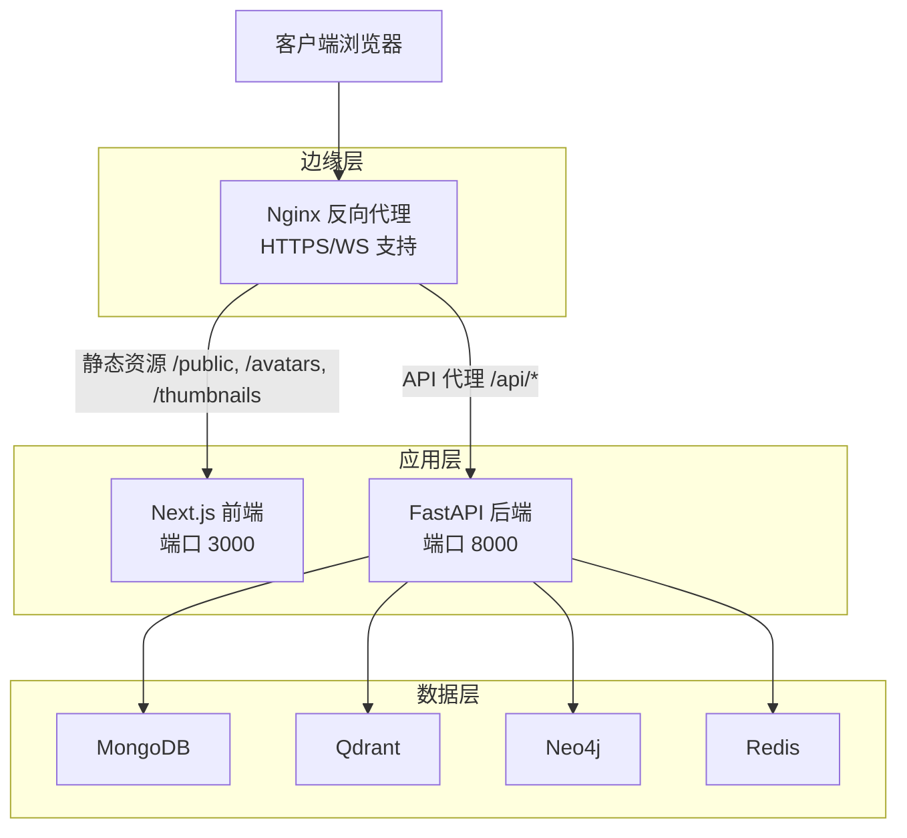
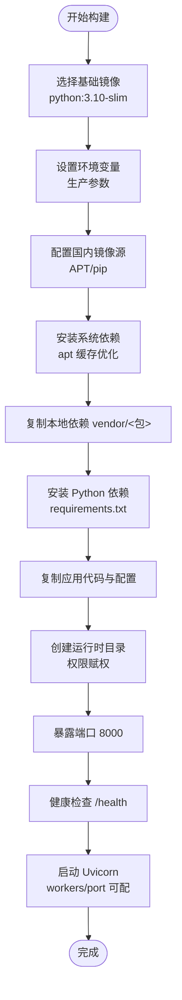
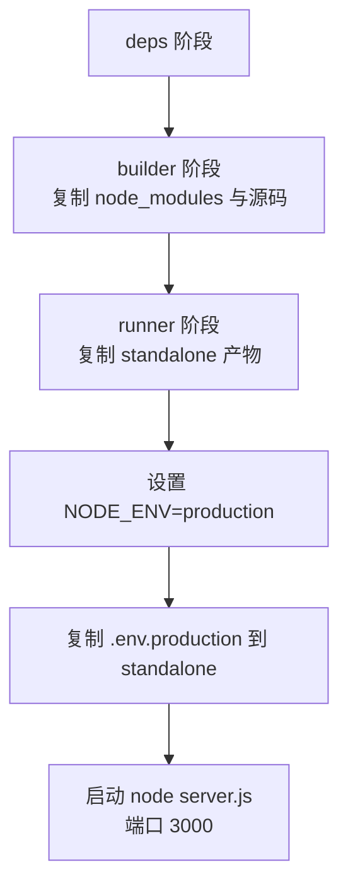
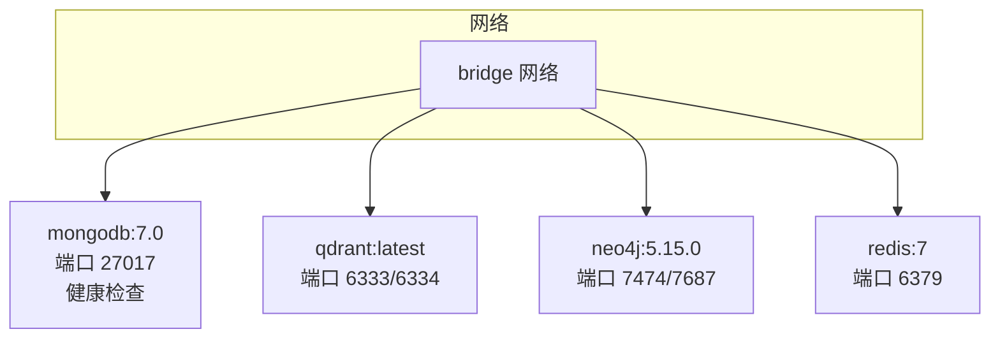
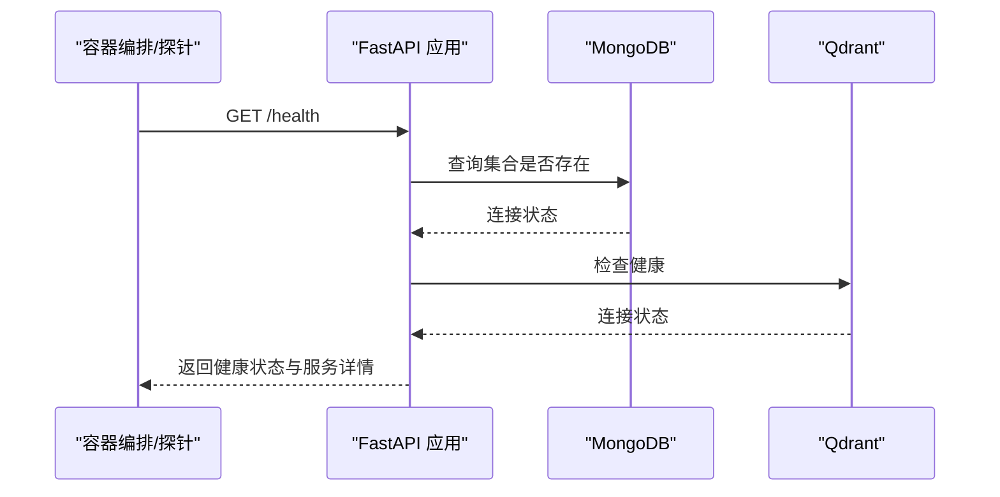
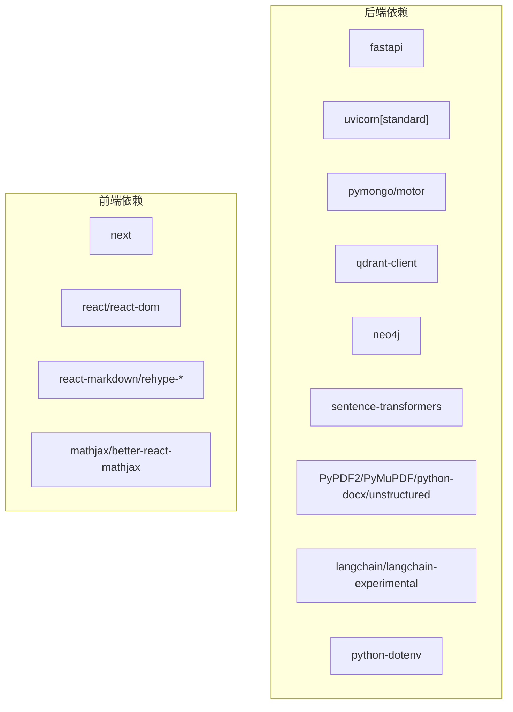

# 生产部署

<cite>
**本文引用的文件**
- [Dockerfile](file://Dockerfile)
- [docker-compose.yml](file://docker-compose.yml)
- [web/Dockerfile](file://web/Dockerfile)
- [main.py](file://main.py)
- [requirements.txt](file://requirements.txt)
- [README.md](file://README.md)
- [routers/health.py](file://routers/health.py)
- [utils/lifespan.py](file://utils/lifespan.py)
- [utils/monitoring.py](file://utils/monitoring.py)
- [web/package.json](file://web/package.json)
- [web/next.config.ts](file://web/next.config.ts)
- [scripts/start-backend-8000.ps1](file://scripts/start-backend-8000.ps1)
- [scripts/stop-backend-8000.ps1](file://scripts/stop-backend-8000.ps1)
</cite>

## 目录
1. [简介](#简介)
2. [项目结构](#项目结构)
3. [核心组件](#核心组件)
4. [架构总览](#架构总览)
5. [详细组件分析](#详细组件分析)
6. [依赖分析](#依赖分析)
7. [性能考虑](#性能考虑)
8. [故障排查指南](#故障排查指南)
9. [结论](#结论)
10. [附录](#附录)

## 简介
本指南面向生产部署 Advanced RAG 项目，覆盖后端与前端的 Docker 镜像构建、Docker Compose 多容器编排、容器化部署策略（服务发现、负载均衡、健康检查）、Nginx 反向代理配置（SSL、静态资源、WebSocket）、生产环境环境变量与安全加固、以及蓝绿部署、滚动更新与回滚策略。内容基于仓库中的实际配置文件与代码实现，确保可落地、可验证。

## 项目结构
项目采用前后端分离的容器化架构：
- 后端：FastAPI 应用，使用 Uvicorn 运行，提供 API 与健康检查端点。
- 前端：Next.js 应用，支持 Standalone 输出模式，配合 Nginx 作为反向代理。
- 数据与中间件：MongoDB、Qdrant、Neo4j、Redis（可选），通过 Docker Compose 统一编排。

图表来源
- [web/Dockerfile:1-39](file://web/Dockerfile#L1-L39)
- [Dockerfile:1-95](file://Dockerfile#L1-L95)
- [docker-compose.yml:1-96](file://docker-compose.yml#L1-L96)

章节来源
- [README.md:55-70](file://README.md#L55-L70)
- [web/Dockerfile:1-39](file://web/Dockerfile#L1-L39)
- [Dockerfile:1-95](file://Dockerfile#L1-L95)
- [docker-compose.yml:1-96](file://docker-compose.yml#L1-L96)

## 核心组件
- 后端镜像构建：基于 Python 3.10 slim，启用 BuildKit 与缓存优化，国内镜像源加速，健康检查集成。
- 前端镜像构建：基于 Node 22 Alpine，多阶段构建，Standalone 输出，支持大文件上传。
- Docker Compose：统一编排数据库与中间件，提供持久化卷与网络隔离。
- 健康检查：后端提供综合健康检查与就绪探针，支持系统资源指标。
- 监控：内置性能监控与慢请求告警，便于生产观测。

章节来源
- [Dockerfile:11-95](file://Dockerfile#L11-L95)
- [web/Dockerfile:1-39](file://web/Dockerfile#L1-L39)
- [docker-compose.yml:1-96](file://docker-compose.yml#L1-L96)
- [routers/health.py:23-135](file://routers/health.py#L23-L135)
- [utils/monitoring.py:13-185](file://utils/monitoring.py#L13-L185)

## 架构总览
下图展示生产部署的整体交互：Nginx 作为反向代理，将静态资源与 API 请求分别转发至前端与后端；后端通过健康检查与监控保障稳定性，并连接数据库与向量/图数据库。

图表来源
- [web/next.config.ts:12-34](file://web/next.config.ts#L12-L34)
- [main.py:75-88](file://main.py#L75-L88)
- [routers/health.py:23-135](file://routers/health.py#L23-L135)

## 详细组件分析

### 后端镜像构建（Dockerfile）
- 基础镜像与环境变量：使用 Python 3.10 slim，设置生产环境变量（端口、工作进程数、LibreOffice 路径等）。
- 国内镜像源：APT 与 pip 使用清华镜像，提升构建速度。
- 依赖安装：合并 apt 安装命令以减少镜像层数；使用 BuildKit 缓存 pip 与 apt。
- 本地依赖：要求先下载 PaddleOCR 到 vendor 目录，避免构建时访问 GitHub。
- 应用复制与权限：复制 agents/chunking/database 等模块与主程序，创建上传/日志等目录并赋权。
- 健康检查：通过 /health 端点进行探测。
- 启动命令：Uvicorn 运行，支持通过环境变量调整端口与 worker 数。

图表来源
- [Dockerfile:11-95](file://Dockerfile#L11-L95)

章节来源
- [Dockerfile:11-95](file://Dockerfile#L11-L95)
- [requirements.txt:1-42](file://requirements.txt#L1-L42)

### 前端镜像构建（web/Dockerfile）
- 多阶段构建：deps（安装依赖）、builder（构建）、runner（运行）。
- 环境变量：NODE_ENV=production，自动加载 .env.production。
- Standalone 输出：使用 Next.js standalone 模式，复制 .next/standalone、static、public。
- 启动命令：node server.js，监听 3000 端口。

图表来源
- [web/Dockerfile:1-39](file://web/Dockerfile#L1-L39)

章节来源
- [web/Dockerfile:1-39](file://web/Dockerfile#L1-L39)
- [web/package.json:12-26](file://web/package.json#L12-L26)
- [web/next.config.ts:3-10](file://web/next.config.ts#L3-L10)

### Docker Compose 编排
- 服务定义：mongodb、qdrant、neo4j、redis，均提供健康检查与持久化卷。
- 网络：统一桥接网络，便于容器间通信。
- 数据卷：为各服务提供独立持久化存储，避免数据丢失。
- 端口映射：便于本地开发与调试，生产环境建议通过反向代理暴露。

图表来源
- [docker-compose.yml:1-96](file://docker-compose.yml#L1-L96)

章节来源
- [docker-compose.yml:1-96](file://docker-compose.yml#L1-L96)

### 健康检查与监控
- 健康检查端点：/health 综合检查 MongoDB、Qdrant 连接状态，返回整体健康与服务详情。
- 就绪探针：/health/readiness 仅检查关键依赖，适合容器编排的就绪判断。
- 性能指标：/health/metrics 返回请求统计与系统资源使用情况。
- 生命周期：应用启动时尝试连接 MongoDB 并做初始化，失败不阻断服务，便于本地调试。
- 监控装饰器：对请求耗时进行记录与慢请求告警。

图表来源
- [routers/health.py:23-114](file://routers/health.py#L23-L114)
- [utils/lifespan.py:28-92](file://utils/lifespan.py#L28-L92)
- [utils/monitoring.py:49-111](file://utils/monitoring.py#L49-L111)

章节来源
- [routers/health.py:23-135](file://routers/health.py#L23-L135)
- [utils/lifespan.py:28-92](file://utils/lifespan.py#L28-L92)
- [utils/monitoring.py:13-185](file://utils/monitoring.py#L13-L185)

### Nginx 反向代理配置要点
- SSL 证书：在生产环境配置 HTTPS，建议使用 Let’s Encrypt 自动续期。
- 静态资源：将 /avatars、/thumbnails、/cover_images 等静态目录交由 Nginx 提供，减轻后端压力。
- API 代理：将 /api/* 代理到后端 API（默认 8000 端口），支持跨域与长连接。
- WebSocket：开启代理升级，确保实时消息通道可用。
- 超时与缓冲：合理设置 proxy_read_timeout、proxy_send_timeout 与 client_max_body_size，适配大文件上传。
- 缓存策略：对静态资源设置合适的缓存头，提升访问性能。

（本节为概念性说明，不直接对应具体文件）

### 生产环境环境变量与安全加固
- 环境变量：ENVIRONMENT=production，API_HOST/API_PORT，数据库连接串，Ollama 地址与模型，上传目录与大小限制，日志级别与文件路径。
- 安全配置：CORS 允许来源在生产中应收紧；启用 HTTPS；最小权限原则配置数据库账号；敏感信息使用密钥管理服务。
- 性能调优：UVICORN_WORKERS 根据 CPU 核心数设置；timeout_keep_alive 与 limit_concurrency 控制长连接与并发；前端 proxyClientMaxBodySize 支持大文件。
- 监控配置：结合 /health/metrics 与日志系统，建立告警阈值。

章节来源
- [main.py:20-52](file://main.py#L20-L52)
- [main.py:144-171](file://main.py#L144-L171)
- [web/next.config.ts:7-10](file://web/next.config.ts#L7-L10)
- [README.md:125-166](file://README.md#L125-L166)

### 部署最佳实践
- 蓝绿部署：准备两套后端镜像标签，通过反向代理切换流量；先在蓝环境验证，再切到绿环境。
- 滚动更新：Kubernetes 使用滚动更新策略，设置最大不可用与最大额外副本，保证服务连续性。
- 回滚策略：保留最近几个镜像版本；出现异常立即回滚至上一个稳定版本。
- 配置热更新：将配置集中到 ConfigMap/环境变量，避免重启；数据库连接串与外部服务地址通过环境注入。
- 数据备份：定期备份 MongoDB、Qdrant 存储卷；对关键业务数据增加校验与归档。

（本节为通用实践说明，不直接对应具体文件）

## 依赖分析
后端依赖主要围绕 Web 框架、数据库客户端、文档解析与向量化服务，前端依赖 Next.js 与渲染生态。

图表来源
- [requirements.txt:4-42](file://requirements.txt#L4-L42)
- [web/package.json:12-26](file://web/package.json#L12-L26)

章节来源
- [requirements.txt:1-42](file://requirements.txt#L1-L42)
- [web/package.json:12-26](file://web/package.json#L12-L26)

## 性能考虑
- 后端并发：UVICORN_WORKERS 建议设置为 CPU 核心数的一半到全核之间，结合 limit_concurrency 控制每个 worker 的并发连接数。
- 长连接：timeout_keep_alive 增加以支持大文件上传与长任务。
- 前端体积：Standalone 输出减少运行时依赖，提升启动速度；静态资源由 Nginx 提供。
- 数据库连接：MongoDB 连接池与 Qdrant 的批量写入策略需结合业务峰值评估。
- 监控与告警：慢请求阈值与错误率阈值应按 SLA 设定，及时发现性能瓶颈。

章节来源
- [main.py:144-171](file://main.py#L144-L171)
- [web/Dockerfile:20-37](file://web/Dockerfile#L20-L37)
- [utils/monitoring.py:118-185](file://utils/monitoring.py#L118-L185)

## 故障排查指南
- 启动失败：检查 vendor/PaddleOCR 是否存在且非空；确认 requirements.txt 与 .env.production 配置正确。
- 健康检查失败：查看 /health 与 /health/readiness 返回的服务状态；检查数据库连接串与网络连通性。
- 慢请求：关注 /health/metrics 中的 p95/p99 指标与慢请求日志；定位热点接口与数据库查询。
- Windows 启停脚本：使用提供的 PowerShell 脚本优雅停止占用端口的进程，避免端口冲突。
- 日志定位：后端全局异常处理器返回统一错误格式，结合日志定位具体请求路径与方法。

章节来源
- [Dockerfile:58-67](file://Dockerfile#L58-L67)
- [routers/health.py:23-135](file://routers/health.py#L23-L135)
- [utils/monitoring.py:163-185](file://utils/monitoring.py#L163-L185)
- [scripts/start-backend-8000.ps1:19-78](file://scripts/start-backend-8000.ps1#L19-L78)
- [scripts/stop-backend-8000.ps1:19-78](file://scripts/stop-backend-8000.ps1#L19-L78)

## 结论
本指南基于仓库现有配置，给出了 Advanced RAG 生产部署的完整路径：从镜像构建、容器编排到反向代理、环境变量与安全加固，并提供了蓝绿部署、滚动更新与回滚策略建议。建议在生产环境中结合监控与告警体系持续优化性能与稳定性。

## 附录
- 快速启动参考：后端使用 Docker 运行时指定 --env-file；Compose 一键启动数据库与中间件。
- 前端代理：Next.js 通过 rewrites 将 /api/* 代理到后端，开发与生产环境分别处理。

章节来源
- [README.md:200-227](file://README.md#L200-L227)
- [web/next.config.ts:12-34](file://web/next.config.ts#L12-L34)