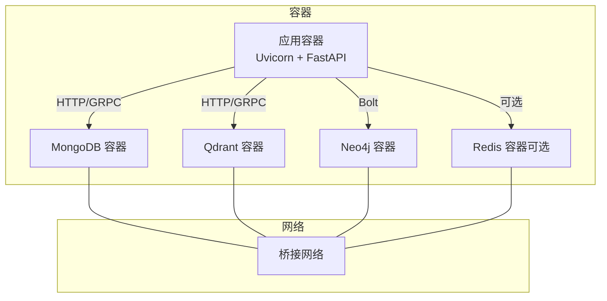
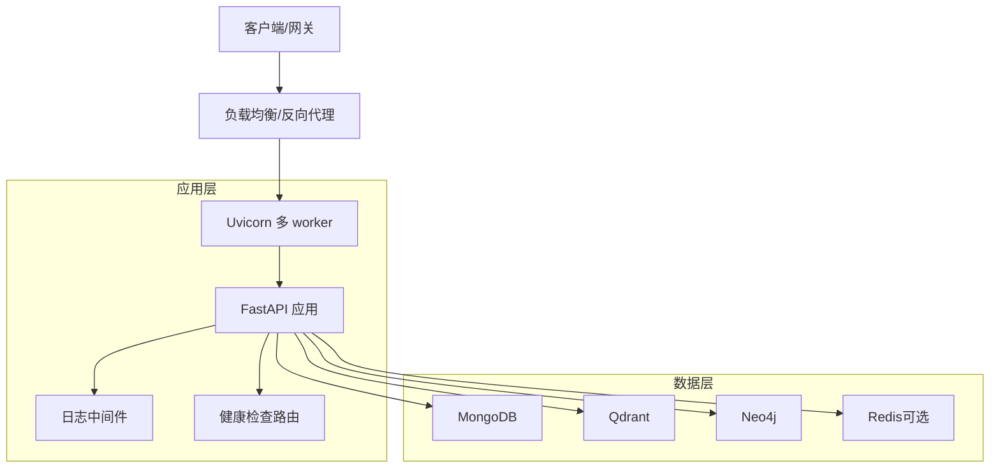
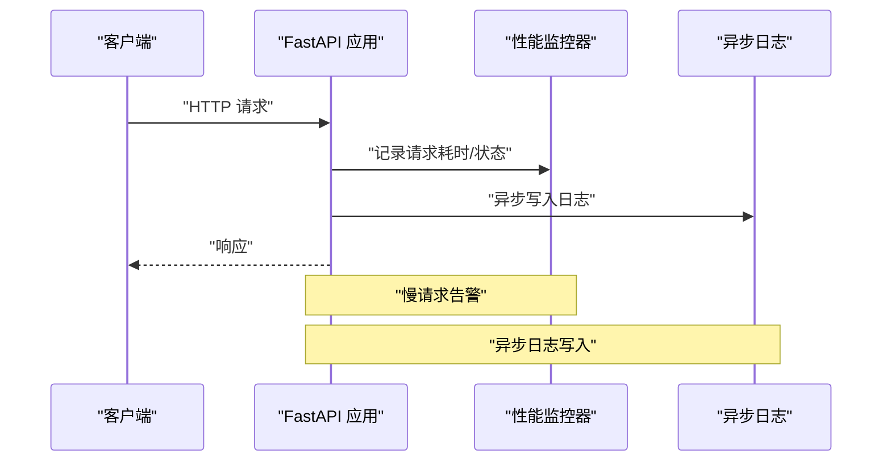
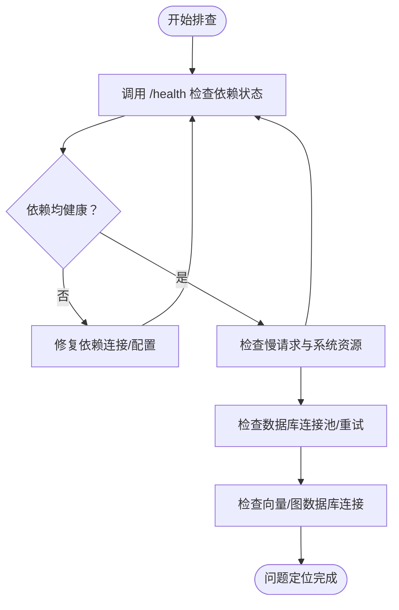
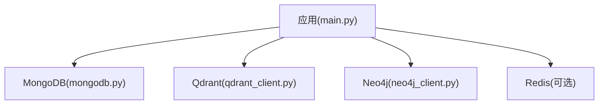

# 部署最佳实践

<cite>
**本文引用的文件**
- [Dockerfile](file://Dockerfile)
- [docker-compose.yml](file://docker-compose.yml)
- [main.py](file://main.py)
- [requirements.txt](file://requirements.txt)
- [README.md](file://README.md)
- [scripts/start-backend-8000.ps1](file://scripts/start-backend-8000.ps1)
- [scripts/stop-backend-8000.ps1](file://scripts/stop-backend-8000.ps1)
- [utils/logger.py](file://utils/logger.py)
- [utils/monitoring.py](file://utils/monitoring.py)
- [utils/lifespan.py](file://utils/lifespan.py)
- [routers/health.py](file://routers/health.py)
- [database/mongodb.py](file://database/mongodb.py)
- [database/qdrant_client.py](file://database/qdrant_client.py)
- [database/neo4j_client.py](file://database/neo4j_client.py)
</cite>

## 目录
1. [简介](#简介)
2. [项目结构](#项目结构)
3. [核心组件](#核心组件)
4. [架构总览](#架构总览)
5. [详细组件分析](#详细组件分析)
6. [依赖关系分析](#依赖关系分析)
7. [性能考虑](#性能考虑)
8. [故障排除指南](#故障排除指南)
9. [结论](#结论)
10. [附录](#附录)

## 简介
本指南面向生产部署场景，结合代码库中的容器化、健康检查、日志与监控、数据库连接池与重试、以及多依赖服务（MongoDB、Qdrant、Neo4j）的实际实现，系统阐述部署策略选择（蓝绿部署、滚动更新、金丝雀发布）、容器编排最佳实践（资源限制、健康检查、自动重启）、安全加固（镜像扫描、网络安全、访问控制）、监控与日志（应用与基础设施）、备份与灾难恢复、性能优化与故障排除。

## 项目结构
后端采用 FastAPI + Uvicorn，容器化构建与运行，依赖 MongoDB、Qdrant、Neo4j 等外部服务。开发与生产环境通过环境变量区分，Dockerfile 提供生产镜像构建与健康检查配置，docker-compose 提供本地开发环境编排。

**图表来源**
- [Dockerfile:11-95](file://Dockerfile#L11-L95)
- [docker-compose.yml:1-96](file://docker-compose.yml#L1-L96)

**章节来源**
- [Dockerfile:11-95](file://Dockerfile#L11-L95)
- [docker-compose.yml:1-96](file://docker-compose.yml#L1-L96)
- [README.md:200-228](file://README.md#L200-L228)

## 核心组件
- 应用入口与生命周期：FastAPI 应用、CORS、静态文件挂载、全局异常处理、健康检查路由、应用生命周期（数据库连接与初始化）。
- 数据库与向量/图数据库：MongoDB 连接池与重试、Qdrant gRPC 连接与重试、Neo4j Bolt 连接。
- 日志与监控：异步日志写入、请求耗时统计、系统资源采集、慢请求告警。
- 容器与编排：Dockerfile 构建参数、暴露端口、健康检查、Uvicorn 工作进程数；docker-compose 服务编排与持久卷。

**章节来源**
- [main.py:55-171](file://main.py#L55-L171)
- [utils/lifespan.py:28-93](file://utils/lifespan.py#L28-L93)
- [routers/health.py:23-135](file://routers/health.py#L23-L135)
- [utils/logger.py:15-88](file://utils/logger.py#L15-L88)
- [utils/monitoring.py:13-185](file://utils/monitoring.py#L13-L185)
- [database/mongodb.py:92-204](file://database/mongodb.py#L92-L204)
- [database/qdrant_client.py:18-139](file://database/qdrant_client.py#L18-L139)
- [database/neo4j_client.py:6-104](file://database/neo4j_client.py#L6-L104)

## 架构总览
应用通过 Uvicorn 多 worker 提供 HTTP 服务，依赖 MongoDB（用户与对话数据）、Qdrant（向量检索）、Neo4j（知识图谱）与可选 Redis（缓存）。健康检查路由对关键依赖进行连通性与就绪性探测，并提供性能指标端点。

**图表来源**
- [main.py:55-171](file://main.py#L55-L171)
- [routers/health.py:23-135](file://routers/health.py#L23-L135)
- [database/mongodb.py:92-204](file://database/mongodb.py#L92-L204)
- [database/qdrant_client.py:18-139](file://database/qdrant_client.py#L18-L139)
- [database/neo4j_client.py:6-104](file://database/neo4j_client.py#L6-L104)

## 详细组件分析

### 部署策略选择与实施
- 蓝绿部署
  - 通过两套相同规模的生产环境（蓝/绿）实现零停机切换。新版本先部署到备用环境，健康检查通过后再切换流量。
  - 适合对一致性与回滚要求高的场景。
- 滚动更新
  - 分批次逐步替换实例，维持服务连续性。结合就绪探针确保实例完全就绪再停止旧实例。
  - 适合大多数生产环境，风险可控。
- 金丝雀发布
  - 将少量流量引入新版本，持续观察指标与日志，逐步扩大流量直至全量。
  - 适合高风险变更或新功能灰度验证。

实施要点（结合现有健康检查与容器配置）：
- 利用健康检查端点与就绪探针，确保新实例在流量切换前已就绪。
- 使用多 worker 与 keep-alive 超时，提升并发与长连接稳定性。
- 通过环境变量控制工作进程数与端口，便于不同部署策略下的参数调整。

**章节来源**
- [routers/health.py:90-115](file://routers/health.py#L90-L115)
- [main.py:129-171](file://main.py#L129-L171)
- [Dockerfile:91-95](file://Dockerfile#L91-L95)

### 容器编排最佳实践
- 资源限制
  - 在容器编排平台设置 CPU/内存限额与请求，避免资源争抢。
  - 结合应用侧并发连接限制与 keep-alive 超时，避免单实例过载。
- 健康检查
  - 使用 Docker HEALTHCHECK 与应用内置健康检查端点，分别作为容器层面与应用层面的健康保障。
- 自动重启
  - 容器重启策略设置为 unless-stopped 或 on-failure，配合健康检查与就绪探针，实现自愈。

**章节来源**
- [Dockerfile:91-95](file://Dockerfile#L91-L95)
- [routers/health.py:23-135](file://routers/health.py#L23-L135)
- [docker-compose.yml:18-25](file://docker-compose.yml#L18-L25)

### 安全加固
- 镜像扫描
  - 在 CI 中集成镜像漏洞扫描，关注基础镜像与依赖包的安全通告。
- 网络安全
  - 仅暴露必要端口；容器间通过桥接网络通信；生产环境使用 HTTPS 与安全传输。
- 访问控制
  - 本项目 API 为匿名访问设计，生产环境建议在网关层增加鉴权与速率限制。

**章节来源**
- [README.md:9-25](file://README.md#L9-L25)
- [Dockerfile:11-21](file://Dockerfile#L11-L21)

### 监控与日志
- 应用监控
  - 性能监控器记录请求耗时、错误计数与系统资源，慢请求告警。
  - 健康检查端点提供服务状态与系统资源信息。
- 基础设施监控
  - docker-compose 为各服务配置健康检查，便于编排平台观测。
- 日志聚合
  - 异步文件处理器与队列监听器，避免阻塞；生产环境降低日志级别，减少 IO 压力。

**图表来源**
- [utils/monitoring.py:118-185](file://utils/monitoring.py#L118-L185)
- [utils/logger.py:15-88](file://utils/logger.py#L15-L88)
- [routers/health.py:117-135](file://routers/health.py#L117-L135)

**章节来源**
- [utils/monitoring.py:13-185](file://utils/monitoring.py#L13-L185)
- [utils/logger.py:15-88](file://utils/logger.py#L15-L88)
- [routers/health.py:23-135](file://routers/health.py#L23-L135)

### 备份与灾难恢复
- 数据备份
  - MongoDB：使用副本集与定期快照；持久卷保护数据。
  - Qdrant：持久卷存储 storage；定期导出集合信息。
  - Neo4j：持久卷 data、logs、import、plugins；定期备份。
- 配置备份
  - .env 文件与 docker-compose.yml 作为配置基线，纳入版本控制与密钥管理。
- 恢复流程
  - 先恢复数据层，再启动应用层；通过健康检查与就绪探针验证恢复状态。

**章节来源**
- [docker-compose.yml:76-96](file://docker-compose.yml#L76-L96)
- [README.md:125-167](file://README.md#L125-L167)

### 性能优化
- 资源调优
  - Uvicorn 多 worker 与 keep-alive 超时；连接池参数（MongoDB）；gRPC 优先（Qdrant）。
- 缓存策略
  - 可选 Redis 作为缓存层，减少重复计算与数据库压力。
- 数据库优化
  - MongoDB 连接池参数与重试；Qdrant 插入重试与维度校验；Neo4j 查询参数化与索引。

**章节来源**
- [main.py:144-171](file://main.py#L144-L171)
- [database/mongodb.py:122-151](file://database/mongodb.py#L122-L151)
- [database/qdrant_client.py:66-96](file://database/qdrant_client.py#L66-L96)
- [docker-compose.yml:58-75](file://docker-compose.yml#L58-L75)

### 故障排除与应急响应
- 常见问题诊断
  - 健康检查失败：检查依赖服务连通性与配置；查看日志与慢请求告警。
  - 数据库连接失败：确认连接字符串、认证信息与网络可达性；查看连接池参数。
  - 向量检索异常：检查 Qdrant 集合维度与 gRPC 连接；必要时重建集合。
- 快速恢复
  - 通过就绪探针与健康检查端点快速定位问题实例；利用多 worker 与滚动更新策略隔离故障。
  - 使用脚本优雅停止与启动后端，避免端口占用。

**图表来源**
- [routers/health.py:23-115](file://routers/health.py#L23-L115)
- [utils/monitoring.py:78-112](file://utils/monitoring.py#L78-L112)
- [database/mongodb.py:92-204](file://database/mongodb.py#L92-L204)
- [database/qdrant_client.py:18-139](file://database/qdrant_client.py#L18-L139)

**章节来源**
- [routers/health.py:23-135](file://routers/health.py#L23-L135)
- [utils/monitoring.py:78-112](file://utils/monitoring.py#L78-L112)
- [utils/logger.py:77-82](file://utils/logger.py#L77-L82)
- [scripts/start-backend-8000.ps1:1-89](file://scripts/start-backend-8000.ps1#L1-L89)
- [scripts/stop-backend-8000.ps1:1-82](file://scripts/stop-backend-8000.ps1#L1-L82)

## 依赖关系分析
应用依赖 MongoDB、Qdrant、Neo4j 与可选 Redis；Dockerfile 定义了镜像构建与运行参数；docker-compose 提供本地开发环境编排。

**图表来源**
- [main.py:15-18](file://main.py#L15-L18)
- [database/mongodb.py:92-204](file://database/mongodb.py#L92-L204)
- [database/qdrant_client.py:18-139](file://database/qdrant_client.py#L18-L139)
- [database/neo4j_client.py:6-104](file://database/neo4j_client.py#L6-L104)

**章节来源**
- [main.py:15-18](file://main.py#L15-L18)
- [database/mongodb.py:92-204](file://database/mongodb.py#L92-L204)
- [database/qdrant_client.py:18-139](file://database/qdrant_client.py#L18-L139)
- [database/neo4j_client.py:6-104](file://database/neo4j_client.py#L6-L104)

## 性能考虑
- 并发与连接
  - Uvicorn 多 worker 与 keep-alive 超时；MongoDB 连接池参数；Qdrant gRPC 优先。
- 日志与监控
  - 异步日志写入；慢请求告警；系统资源采集。
- 存储与持久化
  - docker-compose 使用本地卷持久化数据；生产环境建议使用云盘或共享存储。

**章节来源**
- [main.py:144-171](file://main.py#L144-L171)
- [utils/logger.py:56-82](file://utils/logger.py#L56-L82)
- [utils/monitoring.py:78-112](file://utils/monitoring.py#L78-L112)
- [docker-compose.yml:76-96](file://docker-compose.yml#L76-L96)

## 故障排除指南
- 端口占用与优雅重启
  - 使用提供的 PowerShell 脚本优雅停止旧进程并启动新进程，避免端口占用。
- 健康检查与就绪探针
  - 通过 /health、/health/liveness、/health/readiness 与 /health/metrics 快速定位问题。
- 数据库连接
  - 检查连接字符串、认证信息与网络可达性；查看连接池参数与重试策略。

**章节来源**
- [scripts/start-backend-8000.ps1:1-89](file://scripts/start-backend-8000.ps1#L1-L89)
- [scripts/stop-backend-8000.ps1:1-82](file://scripts/stop-backend-8000.ps1#L1-L82)
- [routers/health.py:23-135](file://routers/health.py#L23-L135)
- [database/mongodb.py:92-204](file://database/mongodb.py#L92-L204)

## 结论
本指南基于代码库实际实现，总结了生产部署的关键实践：以健康检查与就绪探针为核心，结合容器编排与资源限制，配合日志与监控体系，完善备份与灾难恢复流程，并通过性能优化与故障排除机制保障系统稳定运行。针对不同变更风险，推荐采用蓝绿部署、滚动更新或金丝雀发布策略，确保业务连续性与可回滚性。

## 附录
- 环境变量与配置参考：见 README 中的环境配置段落。
- 依赖清单：见 requirements.txt。

**章节来源**
- [README.md:125-167](file://README.md#L125-L167)
- [requirements.txt:1-42](file://requirements.txt#L1-L42)