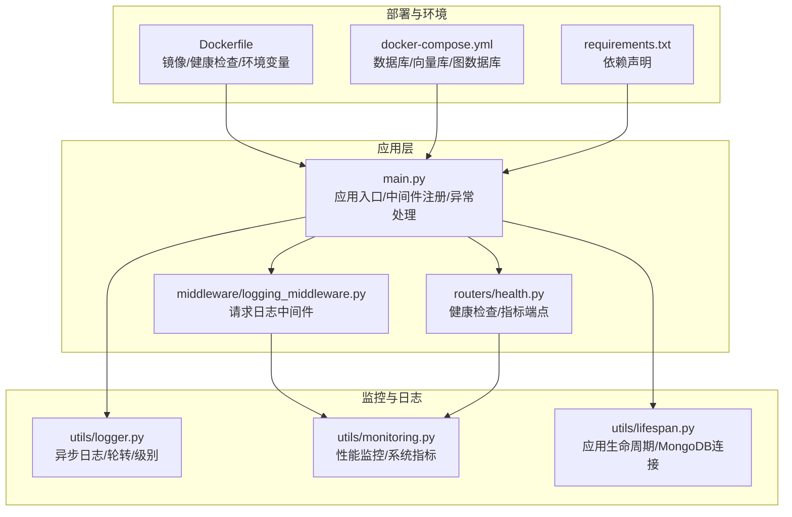
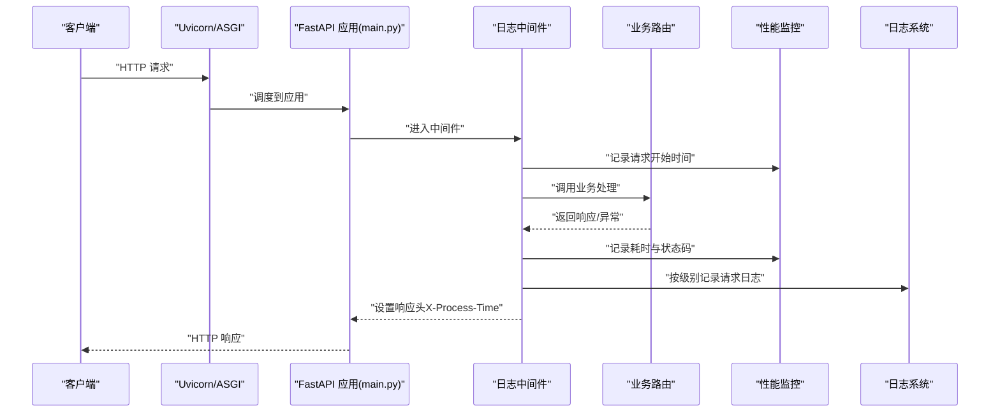
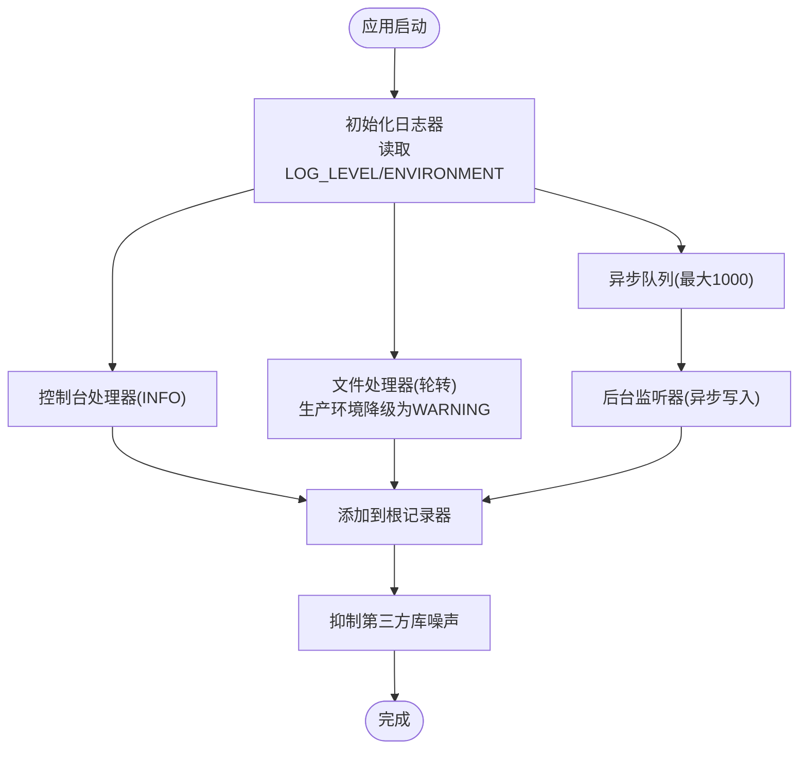
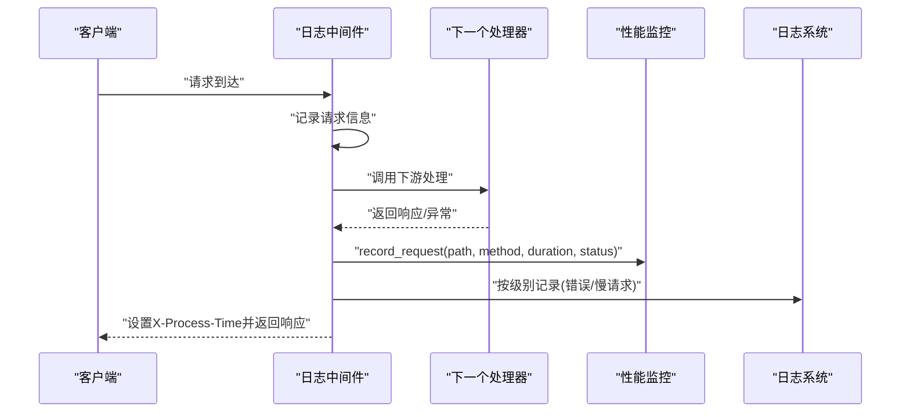
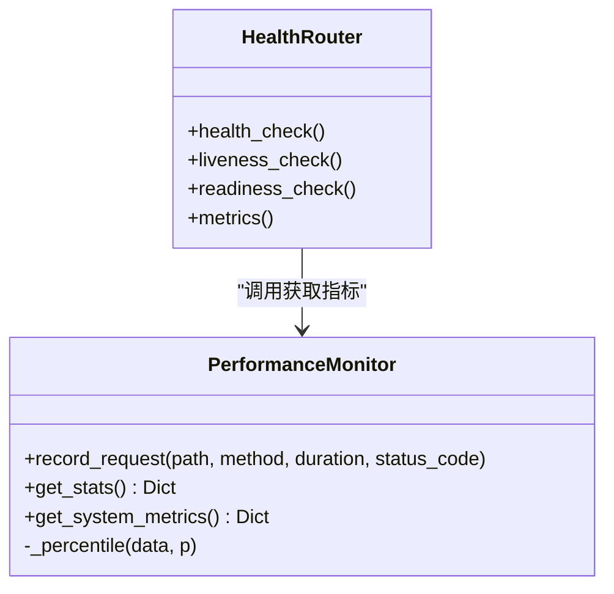
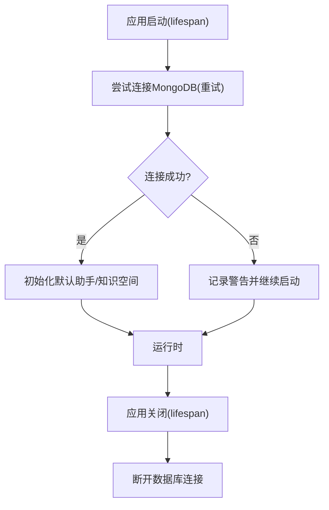
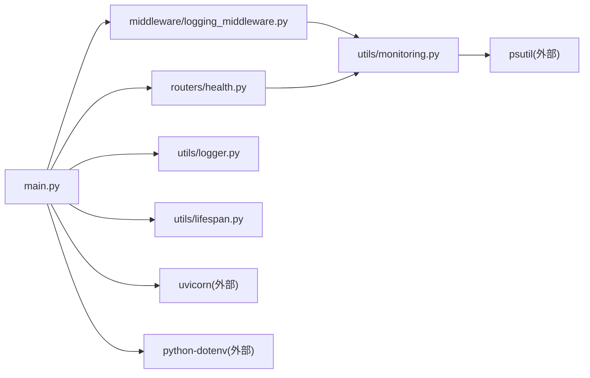

# 监控与日志

<cite>
**本文引用的文件**
- [main.py](file://main.py)
- [logger.py](file://utils/logger.py)
- [monitoring.py](file://utils/monitoring.py)
- [logging_middleware.py](file://middleware/logging_middleware.py)
- [health.py](file://routers/health.py)
- [lifespan.py](file://utils/lifespan.py)
- [docker-compose.yml](file://docker-compose.yml)
- [Dockerfile](file://Dockerfile)
- [requirements.txt](file://requirements.txt)
- [start-backend-8000.ps1](file://scripts/start-backend-8000.ps1)
- [stop-backend-8000.ps1](file://scripts/stop-backend-8000.ps1)
</cite>

## 目录
1. [简介](#简介)
2. [项目结构](#项目结构)
3. [核心组件](#核心组件)
4. [架构总览](#架构总览)
5. [组件详解](#组件详解)
6. [依赖关系分析](#依赖关系分析)
7. [性能与容量规划](#性能与容量规划)
8. [故障排查指南](#故障排查指南)
9. [结论](#结论)
10. [附录](#附录)

## 简介
本指南面向 Advanced RAG 项目的运维与开发团队，系统性说明应用的监控与日志体系配置，涵盖以下主题：
- 应用监控配置：性能指标采集、内存使用监控、API 响应时间跟踪
- 日志系统架构：结构化日志格式、日志级别配置、日志轮转策略
- 日志中间件：请求日志记录、错误日志捕获、审计日志管理
- 监控仪表板：Grafana 仪表板设置、Prometheus 指标暴露、告警规则定义
- 日志聚合与分析：ELK Stack 集成、日志搜索与异常检测
- 最佳实践：关键指标定义、阈值设置、容量规划建议

## 项目结构
Advanced RAG 的监控与日志能力由以下模块协同实现：
- 应用入口与中间件：FastAPI 应用注册、CORS、静态资源、全局异常处理、请求日志中间件
- 日志系统：异步文件处理器、轮转策略、控制台输出、第三方库日志抑制
- 性能监控：请求耗时统计、慢请求检测、系统资源指标采集
- 健康检查与指标端点：服务连通性、系统资源、请求统计
- 容器与部署：Dockerfile、docker-compose、健康检查、环境变量

图表来源
- [main.py:55-127](file://main.py#L55-L127)
- [logging_middleware.py:8-52](file://middleware/logging_middleware.py#L8-L52)
- [health.py:23-135](file://routers/health.py#L23-L135)
- [logger.py:15-87](file://utils/logger.py#L15-L87)
- [monitoring.py:13-185](file://utils/monitoring.py#L13-L185)
- [lifespan.py:28-93](file://utils/lifespan.py#L28-L93)
- [Dockerfile:12-95](file://Dockerfile#L12-L95)
- [docker-compose.yml:1-96](file://docker-compose.yml#L1-L96)
- [requirements.txt:1-42](file://requirements.txt#L1-L42)

章节来源
- [main.py:55-127](file://main.py#L55-L127)
- [logger.py:15-87](file://utils/logger.py#L15-L87)
- [monitoring.py:13-185](file://utils/monitoring.py#L13-L185)
- [logging_middleware.py:8-52](file://middleware/logging_middleware.py#L8-L52)
- [health.py:23-135](file://routers/health.py#L23-L135)
- [lifespan.py:28-93](file://utils/lifespan.py#L28-L93)
- [Dockerfile:12-95](file://Dockerfile#L12-L95)
- [docker-compose.yml:1-96](file://docker-compose.yml#L1-L96)
- [requirements.txt:1-42](file://requirements.txt#L1-L42)

## 核心组件
- 日志系统
  - 异步文件处理器：使用队列与后台监听器，避免阻塞主线程
  - 轮转策略：单文件最大 10MB，保留 5 个备份
  - 级别控制：控制台 INFO 级别；文件在生产环境降为 WARNING
  - 第三方库静默：抑制 httpx/httpcore/urllib3/asyncio/motor/pymongo 的噪声日志
- 性能监控
  - 请求统计：按方法+路径聚合，保留最近 1000 次耗时，计算均值、最小、最大、P50/P95/P99
  - 慢请求检测：超过 1 秒记录警告
  - 系统指标：CPU、内存、磁盘、进程 CPU/内存
- 请求日志中间件
  - 记录请求起止、处理时间、状态码
  - 对 5xx 错误、4xx 警告、慢请求进行分级记录
  - 将处理时间写入响应头 X-Process-Time
- 健康检查与指标端点
  - /health：服务连通性、系统资源概览
  - /health/metrics：请求统计 + 系统指标
- 应用生命周期
  - 启动时 MongoDB 连接重试与初始化，失败不阻塞服务启动
- 部署与环境
  - Dockerfile 设置生产环境变量、健康检查、默认 worker 数
  - docker-compose 提供 MongoDB/Qdrant/Neo4j/Redis 开发环境

章节来源
- [logger.py:15-87](file://utils/logger.py#L15-L87)
- [monitoring.py:13-185](file://utils/monitoring.py#L13-L185)
- [logging_middleware.py:8-52](file://middleware/logging_middleware.py#L8-L52)
- [health.py:23-135](file://routers/health.py#L23-L135)
- [lifespan.py:28-93](file://utils/lifespan.py#L28-L93)
- [Dockerfile:12-95](file://Dockerfile#L12-L95)
- [docker-compose.yml:1-96](file://docker-compose.yml#L1-L96)

## 架构总览
下图展示请求从客户端到服务端的完整链路，以及监控与日志的关键节点。

图表来源
- [main.py:72-74](file://main.py#L72-L74)
- [logging_middleware.py:8-52](file://middleware/logging_middleware.py#L8-L52)
- [monitoring.py:163-185](file://utils/monitoring.py#L163-L185)
- [logger.py:15-87](file://utils/logger.py#L15-L87)

## 组件详解

### 日志系统架构与配置
- 结构化日志格式
  - 时间戳、日志级别、记录器名称、消息
  - 日期格式统一，便于日志聚合与检索
- 日志级别
  - 控制台：INFO 级别，便于开发调试
  - 文件：默认 INFO；生产环境降为 WARNING，减少 IO 压力
- 日志轮转
  - 单文件最大 10MB，最多 5 个备份
  - 异步写入：队列大小上限 1000，防止内存暴涨
- 第三方库静默
  - 对 httpx/httpcore/urllib3/asyncio/motor/pymongo 设置 WARNING 级别
- 全局日志器
  - 提供模块级 logger 实例，统一接入异步处理器

图表来源
- [logger.py:15-87](file://utils/logger.py#L15-L87)

章节来源
- [logger.py:15-87](file://utils/logger.py#L15-L87)

### 请求日志中间件
- 功能要点
  - 记录请求方法、路径、查询参数、客户端 IP
  - 计算处理时间并写入响应头 X-Process-Time
  - 对 5xx 错误、4xx 警告、慢请求（>1s）进行分级记录
  - 将请求耗时与状态码同步记录到性能监控器
- 性能影响
  - 仅对非健康检查路径记录，降低日志量
  - 异步日志写入避免阻塞请求处理

图表来源
- [logging_middleware.py:8-52](file://middleware/logging_middleware.py#L8-L52)
- [monitoring.py:22-48](file://utils/monitoring.py#L22-L48)

章节来源
- [logging_middleware.py:8-52](file://middleware/logging_middleware.py#L8-L52)
- [monitoring.py:22-48](file://utils/monitoring.py#L22-L48)

### 性能监控与系统指标
- 请求统计
  - 按方法+路径聚合，维护最近 1000 次耗时列表
  - 输出计数、错误数、均值、最小/最大、P50/P95/P99
- 慢请求检测
  - 超过 1 秒记录警告日志，便于定位性能瓶颈
- 系统指标
  - CPU 百分比、进程 CPU 百分比
  - 内存总量/可用/使用/进程内存
  - 磁盘总量/使用/剩余/占用率
- 指标端点
  - /health/metrics：返回请求统计 + 系统指标

图表来源
- [monitoring.py:13-185](file://utils/monitoring.py#L13-L185)
- [health.py:117-135](file://routers/health.py#L117-L135)

章节来源
- [monitoring.py:13-185](file://utils/monitoring.py#L13-L185)
- [health.py:117-135](file://routers/health.py#L117-L135)

### 健康检查与生命周期
- 健康检查
  - /health：检查 MongoDB/Qdrant 连通性，返回整体健康状态与系统资源
  - /health/liveness：简单存活探针
  - /health/readiness：关键服务就绪检查
  - /health/metrics：请求统计 + 系统指标
- 应用生命周期
  - 启动阶段：带重试的 MongoDB 连接，失败不阻塞服务
  - 初始化：确保默认“通用助手”与默认“知识空间”存在
  - 关闭阶段：断开数据库连接

图表来源
- [lifespan.py:28-93](file://utils/lifespan.py#L28-L93)
- [health.py:23-115](file://routers/health.py#L23-L115)

章节来源
- [lifespan.py:28-93](file://utils/lifespan.py#L28-L93)
- [health.py:23-115](file://routers/health.py#L23-L115)

### 部署与环境配置
- Dockerfile
  - 设置生产环境变量（ENVIRONMENT、UVICORN_PORT、UVICORN_WORKERS）
  - 健康检查：访问 /health
  - 默认 CMD：uvicorn 启动应用
- docker-compose
  - 提供 MongoDB/Qdrant/Neo4j/Redis 开发环境容器
  - 健康检查配置，便于编排与观测
- 环境变量
  - LOG_LEVEL：日志级别
  - ENVIRONMENT：环境模式（production/development）
  - PORT/UVICORN_WORKERS：端口与 worker 数
- 启停脚本
  - Windows PowerShell 脚本：优雅停止占用端口的进程，再启动后端

章节来源
- [Dockerfile:12-95](file://Dockerfile#L12-L95)
- [docker-compose.yml:1-96](file://docker-compose.yml#L1-L96)
- [start-backend-8000.ps1:1-89](file://scripts/start-backend-8000.ps1#L1-L89)
- [stop-backend-8000.ps1:1-82](file://scripts/stop-backend-8000.ps1#L1-L82)

## 依赖关系分析
- 模块耦合
  - main.py 作为入口，集中注册中间件、路由与异常处理
  - logging_middleware 依赖 utils.logger 与 utils.monitoring
  - health 路由依赖 utils.monitoring 获取指标
  - utils.lifespan 依赖 utils.logger 并与数据库连接交互
- 外部依赖
  - psutil：系统指标采集
  - uvicorn：ASGI 服务器
  - python-dotenv：环境变量加载
  - docker-compose：多服务编排

图表来源
- [main.py:15-127](file://main.py#L15-L127)
- [logging_middleware.py:1-52](file://middleware/logging_middleware.py#L1-L52)
- [health.py:1-135](file://routers/health.py#L1-L135)
- [monitoring.py:1-185](file://utils/monitoring.py#L1-L185)
- [logger.py:1-88](file://utils/logger.py#L1-L88)
- [lifespan.py:1-93](file://utils/lifespan.py#L1-L93)

章节来源
- [main.py:15-127](file://main.py#L15-L127)
- [requirements.txt:1-42](file://requirements.txt#L1-L42)

## 性能与容量规划
- 关键指标定义
  - API 响应时间：均值、P95、P99；慢请求占比
  - 错误率：4xx/5xx 比例
  - 系统资源：CPU、内存、磁盘使用率；进程 CPU/内存
- 阈值建议
  - 响应时间：P95 > 1s，P99 > 3s 视为异常
  - 错误率：单接口 5xx > 0.1%/min，持续 5 分钟触发告警
  - 资源：CPU > 85%，内存 > 80%，磁盘 > 90%
- 容量规划
  - Worker 数：生产环境默认 24，可根据 CPU 核心数与负载调整
  - 并发连接：limit_concurrency=2000，结合 Nginx/反向代理做限流
  - 日志轮转：10MB × 5 份，生产环境文件级别降级为 WARNING，降低 IO

章节来源
- [monitoring.py:49-111](file://utils/monitoring.py#L49-L111)
- [monitoring.py:163-185](file://utils/monitoring.py#L163-L185)
- [main.py:142-171](file://main.py#L142-L171)
- [logger.py:47-81](file://utils/logger.py#L47-L81)

## 故障排查指南
- 启动失败
  - 检查环境变量文件加载顺序与内容（.env.production/.env.development/.env）
  - 查看启动日志中的环境与监听参数
- MongoDB 连接问题
  - 生命周期中已实现重试与降级提示，确认 URI/主机/端口配置
- 健康检查失败
  - /health：检查 MongoDB/Qdrant 连通性与错误摘要
  - /health/readiness：确认关键服务就绪
- 日志过多或 IO 压力
  - 生产环境文件级别已降为 WARNING
  - 检查第三方库静默配置是否生效
- 慢请求定位
  - 查看中间件对慢请求的警告日志
  - 使用 /health/metrics 的 P95/P99 识别热点接口

章节来源
- [main.py:20-53](file://main.py#L20-L53)
- [lifespan.py:8-26](file://utils/lifespan.py#L8-L26)
- [health.py:23-115](file://routers/health.py#L23-L115)
- [logger.py:77-81](file://utils/logger.py#L77-L81)
- [logging_middleware.py:33-40](file://middleware/logging_middleware.py#L33-L40)

## 结论
Advanced RAG 的监控与日志体系以“异步日志 + 请求中间件 + 性能监控 + 健康检查”为核心，兼顾开发调试与生产稳定性。通过合理的日志级别与轮转策略、请求耗时统计与慢请求检测、系统资源采集与健康端点，能够有效支撑日常运维与容量规划。建议在生产环境中配合 ELK/日志聚合与 Grafana/Prometheus 实现可视化与告警闭环。

## 附录

### 监控仪表板与告警配置建议
- 指标暴露
  - 当前项目未内置 Prometheus 导出器，可在 /health/metrics 基础上通过外部采集器抓取
- Grafana 仪表板
  - 面板建议：请求速率/错误率、响应时间分布(P50/P95/P99)、慢请求趋势、CPU/内存/磁盘使用率
- 告警规则示例
  - API 错误率 > 0.1%/min 持续 5 分钟
  - 响应时间 P95 > 1s 或 P99 > 3s
  - CPU > 85% 或 内存 > 80% 或 磁盘 > 90%

[本节为概念性建议，不直接对应具体源文件，故不附加图表来源]

### 日志聚合与分析（ELK Stack）
- 结构化日志
  - 使用统一格式与时间戳，便于字段提取
- 日志轮转
  - 10MB × 5 份，生产环境文件级别降级为 WARNING
- 搜索与异常检测
  - 建议基于错误关键字、慢请求、状态码异常进行规则化检测

[本节为概念性建议，不直接对应具体源文件，故不附加图表来源]