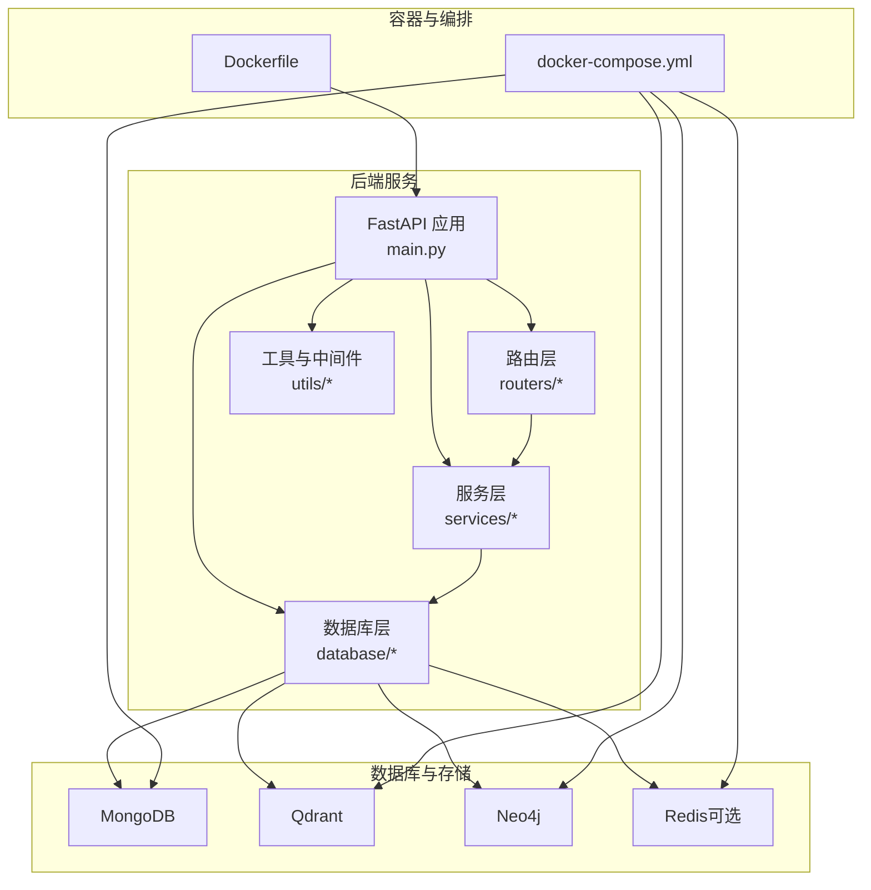
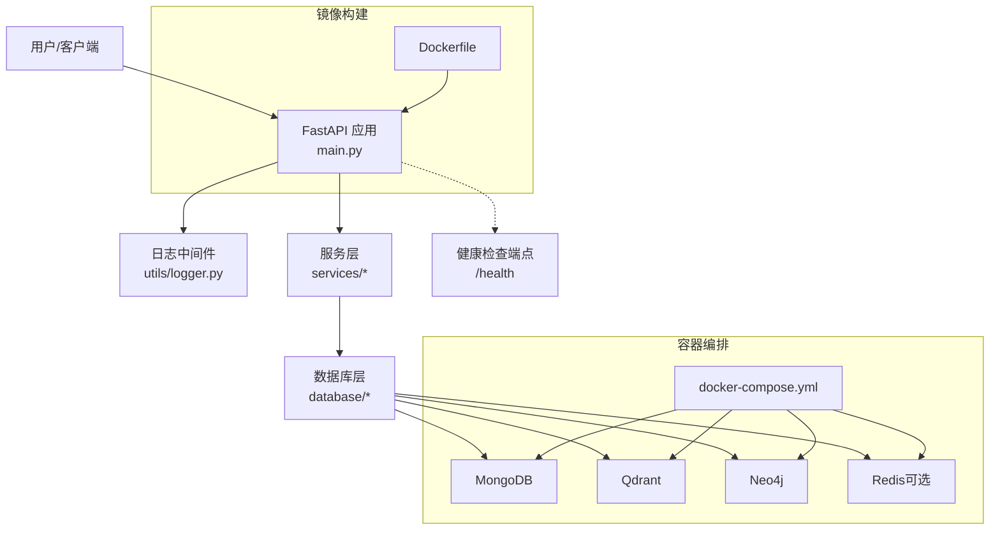
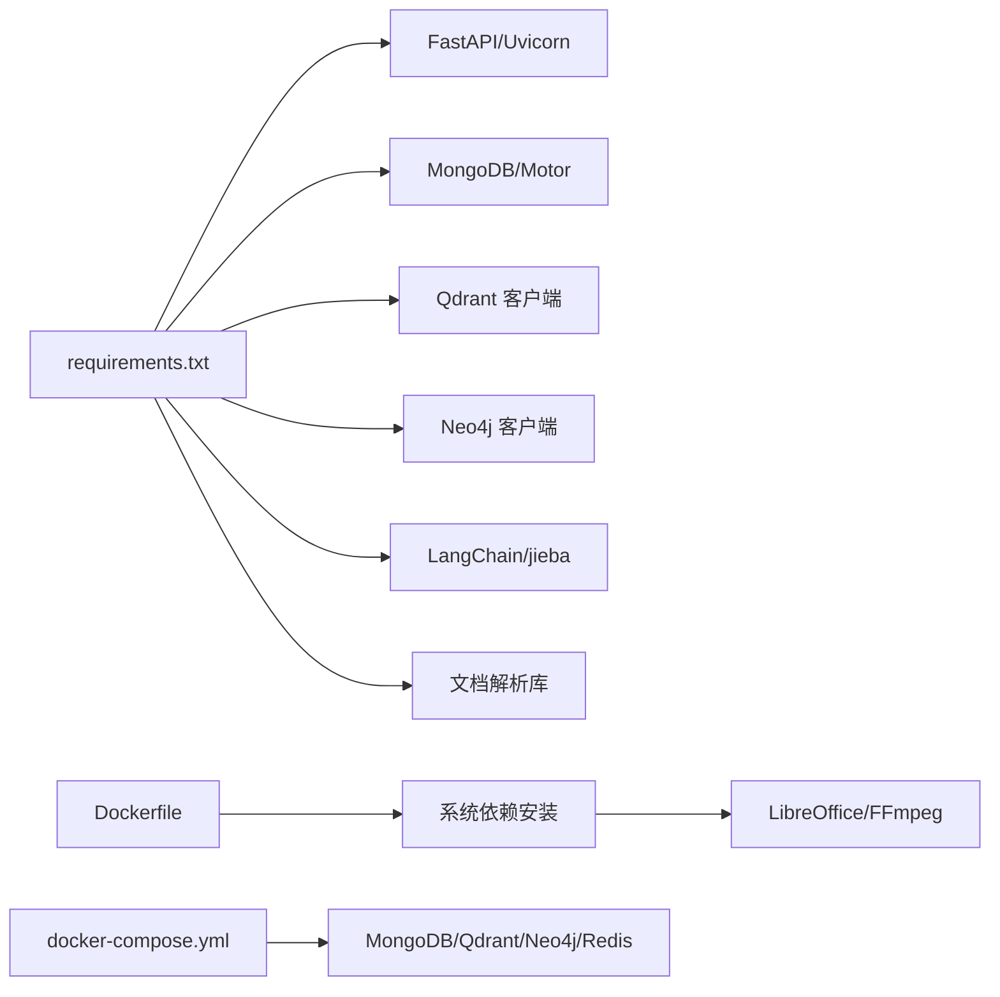

# 部署与运维

<cite>
**本文引用的文件**
- [main.py](file://main.py)
- [Dockerfile](file://Dockerfile)
- [docker-compose.yml](file://docker-compose.yml)
- [requirements.txt](file://requirements.txt)
- [README.md](file://README.md)
- [scripts/start-backend-8000.ps1](file://scripts/start-backend-8000.ps1)
- [scripts/stop-backend-8000.ps1](file://scripts/stop-backend-8000.ps1)
- [scripts/boot_verify.py](file://scripts/boot_verify.py)
- [utils/logger.py](file://utils/logger.py)
- [utils/monitoring.py](file://utils/monitoring.py)
- [database/mongodb.py](file://database/mongodb.py)
- [database/qdrant_client.py](file://database/qdrant_client.py)
- [database/neo4j_client.py](file://database/neo4j_client.py)
- [services/runtime_config.py](file://services/runtime_config.py)
</cite>

## 目录
1. [简介](#简介)
2. [项目结构](#项目结构)
3. [核心组件](#核心组件)
4. [架构总览](#架构总览)
5. [详细组件分析](#详细组件分析)
6. [依赖分析](#依赖分析)
7. [性能考虑](#性能考虑)
8. [故障排除指南](#故障排除指南)
9. [结论](#结论)
10. [附录](#附录)

## 简介
本指南面向 Advanced RAG 项目的部署与运维，覆盖开发环境搭建、生产部署、容器化与编排、监控与日志、性能优化、故障排除以及备份与灾难恢复建议。文档结合代码库中的实际实现，提供可操作的步骤与最佳实践。

## 项目结构
后端基于 FastAPI，提供聊天、文档管理、检索、知识空间、设置与健康检查等 API；数据库层集成 MongoDB、Qdrant、Neo4j，并通过 Docker Compose 提供本地开发环境的多服务编排；前端位于 web/ 目录（Next.js），与后端通过 API 交互。

图表来源
- [main.py:55-105](file://main.py#L55-L105)
- [Dockerfile:12-95](file://Dockerfile#L12-L95)
- [docker-compose.yml:1-96](file://docker-compose.yml#L1-L96)

章节来源
- [README.md:55-70](file://README.md#L55-L70)
- [main.py:55-105](file://main.py#L55-L105)
- [Dockerfile:12-95](file://Dockerfile#L12-L95)
- [docker-compose.yml:1-96](file://docker-compose.yml#L1-L96)

## 核心组件
- 应用入口与生命周期：FastAPI 应用、CORS、静态文件挂载、健康检查端点、全局异常处理与 lifespan 生命周期钩子。
- 数据库客户端：MongoDB（异步/同步）、Qdrant（gRPC 优先）、Neo4j（Bolt）。
- 运行时配置：MongoDB 持久化 + TTL 缓存的运行时参数与模块开关。
- 日志与监控：异步文件日志、系统指标采集、请求耗时统计与慢请求告警。
- 部署与编排：Dockerfile、docker-compose、环境变量与健康检查。

章节来源
- [main.py:15-105](file://main.py#L15-L105)
- [database/mongodb.py:92-204](file://database/mongodb.py#L92-L204)
- [database/qdrant_client.py:18-139](file://database/qdrant_client.py#L18-L139)
- [database/neo4j_client.py:6-103](file://database/neo4j_client.py#L6-L103)
- [services/runtime_config.py:140-218](file://services/runtime_config.py#L140-L218)
- [utils/logger.py:15-88](file://utils/logger.py#L15-L88)
- [utils/monitoring.py:13-185](file://utils/monitoring.py#L13-L185)

## 架构总览
下图展示后端与数据库、缓存及容器编排的关系，以及启动流程与健康检查。

图表来源
- [main.py:90-105](file://main.py#L90-L105)
- [database/mongodb.py:92-204](file://database/mongodb.py#L92-L204)
- [database/qdrant_client.py:18-139](file://database/qdrant_client.py#L18-L139)
- [database/neo4j_client.py:6-103](file://database/neo4j_client.py#L6-L103)
- [docker-compose.yml:1-96](file://docker-compose.yml#L1-L96)
- [Dockerfile:91-95](file://Dockerfile#L91-L95)

## 详细组件分析

### 开发环境搭建
- 环境要求与依赖
  - Python 3.9+、MongoDB 4.4+、Qdrant（Docker）、Redis（可选）、Neo4j（可选）、Ollama。
  - 安装 Python 依赖与第三方库（PaddleOCR 等需先下载到本地 vendor 目录）。
  - 可选系统依赖：ffmpeg（用于视频封面）。
- 环境变量
  - 在项目根目录创建 .env 文件，配置应用、数据库、缓存、Ollama、上传目录与日志级别等。
- 启动方式
  - 直接运行 python main.py 或使用 uvicorn。
  - 使用 Docker Compose 启动本地数据库与缓存服务。

章节来源
- [README.md:73-124](file://README.md#L73-L124)
- [README.md:125-166](file://README.md#L125-L166)
- [README.md:168-188](file://README.md#L168-L188)
- [README.md:200-227](file://README.md#L200-L227)

### 生产部署方案
- Docker 镜像构建
  - 使用 Python 3.10 slim 基础镜像，配置国内镜像源加速，安装系统依赖（LibreOffice、Git、JPEG/Zlib）。
  - 依赖安装：先复制 vendor/PaddleOCR 并以可编辑方式安装，再安装 requirements.txt。
  - 暴露 8000 端口，配置 HEALTHCHECK，CMD 使用 uvicorn 并设置生产环境变量（端口、worker 数）。
- Docker Compose
  - 启动 MongoDB、Qdrant、Neo4j、Redis（可选），并配置健康检查与持久化卷。
- Nginx 与反向代理
  - 建议在容器外部署 Nginx，配置 SSL 证书（Let’s Encrypt 或商业证书）、上游指向后端容器、静态资源缓存与 gzip。
  - 负载均衡：多实例部署时通过 Nginx upstream 或 Kubernetes Service 实现。
- 环境变量与配置
  - 通过 .env.production 或 --env-file 指定生产环境变量，确保数据库、缓存、Ollama 地址正确。

章节来源
- [Dockerfile:12-95](file://Dockerfile#L12-L95)
- [docker-compose.yml:1-96](file://docker-compose.yml#L1-L96)
- [main.py:20-52](file://main.py#L20-L52)

### 容器化部署策略
- 镜像构建要点
  - 使用 BuildKit 加速构建，缓存 pip 与 apt。
  - vendor 依赖必须提前下载，否则构建失败。
- 多容器编排
  - 通过 docker-compose 启动数据库与缓存服务，容器间通过自定义网络通信。
  - 健康检查确保服务可用后再启动应用容器。
- 服务发现
  - 容器内服务通过服务名访问（如 mongodb、qdrant、neo4j），注意 Neo4j 在容器内将 localhost 替换为 host.docker.internal 的兼容逻辑。

章节来源
- [Dockerfile:24-68](file://Dockerfile#L24-L68)
- [docker-compose.yml:1-96](file://docker-compose.yml#L1-L96)
- [database/neo4j_client.py:20-26](file://database/neo4j_client.py#L20-L26)

### 监控与日志系统
- 日志
  - 异步文件处理器 + 控制台处理器，支持轮转与队列写入，生产环境降低文件日志级别。
  - 通过 LOG_LEVEL、LOG_FILE 等环境变量配置。
- 性能监控
  - 记录每个路由的请求耗时、错误计数，支持 p50/p95/p99 百分位统计。
  - 采集 CPU、内存、磁盘与进程指标，慢请求告警。
- 健康检查
  - Docker HEALTHCHECK 与应用 /health 端点，确保服务可用性。

章节来源
- [utils/logger.py:15-88](file://utils/logger.py#L15-L88)
- [utils/monitoring.py:13-185](file://utils/monitoring.py#L13-L185)
- [Dockerfile:91-92](file://Dockerfile#L91-L92)
- [main.py:101-105](file://main.py#L101-L105)

### 数据库与存储配置
- MongoDB
  - 支持 MONGODB_URI 或分离的 HOST/PORT/USERNAME/PASSWORD/DBNAME 组合。
  - 连接池参数可调（maxPoolSize/minPoolSize/maxIdleTimeMS/serverSelectionTimeoutMS/connectTimeoutMS/socketTimeoutMS）。
  - 首次 ping 校验，失败时记录提示并抛出错误。
- Qdrant
  - 优先使用 gRPC（端口 6334）以避免 httpx 502 问题，支持连接复用与超时配置。
  - 自动健康检查与重试，集合维度不匹配时自动重建。
- Neo4j
  - Bolt 连接，容器内自动将 localhost 替换为 host.docker.internal。
  - 连接失败时记录错误并返回 None，避免阻塞。

章节来源
- [database/mongodb.py:99-184](file://database/mongodb.py#L99-L184)
- [database/qdrant_client.py:66-139](file://database/qdrant_client.py#L66-L139)
- [database/neo4j_client.py:16-38](file://database/neo4j_client.py#L16-L38)

### 运行时配置与参数
- 运行时配置存储于 MongoDB 集合 app_settings，键为 runtime_config。
- 支持 low/high/custom 三种预设，模块开关与并发参数可动态合并更新。
- TTL 缓存（默认 10 秒）提升读取性能，写入后刷新缓存。

章节来源
- [services/runtime_config.py:140-218](file://services/runtime_config.py#L140-L218)

### 启动与停止脚本
- PowerShell 脚本
  - start-backend-8000.ps1：优雅释放端口、设置 PORT 环境变量并启动后端。
  - stop-backend-8000.ps1：优雅停止占用端口的进程。
- 自检脚本
  - boot_verify.py：访问 /api/knowledge-spaces，定位 TestSpace 并上传测试文件，验证后端可用性。

章节来源
- [scripts/start-backend-8000.ps1:1-89](file://scripts/start-backend-8000.ps1#L1-L89)
- [scripts/stop-backend-8000.ps1:1-82](file://scripts/stop-backend-8000.ps1#L1-L82)
- [scripts/boot_verify.py:45-73](file://scripts/boot_verify.py#L45-L73)

## 依赖分析
- Python 依赖
  - FastAPI、Uvicorn、MongoDB/Motor、Qdrant 客户端、Neo4j、LangChain、jieba、sentence-transformers、PyPDF2/Docx/Unstructured 等。
- 系统依赖
  - LibreOffice、FFmpeg（可选，用于资源封面生成）。
- 容器依赖
  - MongoDB、Qdrant、Neo4j、Redis（可选）由 docker-compose 管理。

图表来源
- [requirements.txt:4-42](file://requirements.txt#L4-L42)
- [Dockerfile:38-48](file://Dockerfile#L38-L48)
- [docker-compose.yml:2-56](file://docker-compose.yml#L2-L56)

章节来源
- [requirements.txt:4-42](file://requirements.txt#L4-L42)
- [Dockerfile:38-48](file://Dockerfile#L38-L48)
- [docker-compose.yml:2-56](file://docker-compose.yml#L2-L56)

## 性能考虑
- 连接池配置
  - MongoDB：maxPoolSize、minPoolSize、maxIdleTimeMS、serverSelectionTimeoutMS、connectTimeoutMS、socketTimeoutMS 可调，满足高并发场景。
  - Qdrant：gRPC 优先、超时配置、自动重试与维度不匹配重建。
- 缓存策略
  - Redis（可选）用于热点数据与会话缓存；应用侧日志与运行时配置具备 TTL 缓存。
- 并发处理优化
  - 生产环境默认多 worker（UVICORN_WORKERS），限制 keep-alive 超时与并发连接数，支持 SSE 流式响应。
  - 服务层对慢请求进行告警，便于定位瓶颈。

章节来源
- [database/mongodb.py:122-151](file://database/mongodb.py#L122-L151)
- [database/qdrant_client.py:66-96](file://database/qdrant_client.py#L66-L96)
- [main.py:144-171](file://main.py#L144-L171)
- [utils/monitoring.py:178-184](file://utils/monitoring.py#L178-L184)

## 故障排除指南
- 启动问题
  - 端口占用：使用 PowerShell 脚本优雅释放端口后再启动。
  - 环境变量缺失：确认 .env 或 --env-file 正确加载，检查 ENVIRONMENT、PORT、HOST 等。
- 数据库连接问题
  - MongoDB：检查 MONGODB_URI/HOST/PORT/USERNAME/PASSWORD/DBNAME，确认连接池参数合理；首次 ping 失败时查看日志提示。
  - Qdrant：优先使用 gRPC（端口 6334），避免 httpx 502；集合维度不匹配时自动重建。
  - Neo4j：容器内将 localhost 替换为 host.docker.internal；连接失败时检查凭据与网络。
- 模型加载问题
  - Ollama 地址与模型名需正确配置；如模型未就绪，等待初始化完成或调整超时。
- 健康检查失败
  - Docker HEALTHCHECK 与应用 /health 端点均失败时，检查各服务日志与依赖可用性。

章节来源
- [scripts/start-backend-8000.ps1:19-78](file://scripts/start-backend-8000.ps1#L19-L78)
- [database/mongodb.py:154-184](file://database/mongodb.py#L154-L184)
- [database/qdrant_client.py:97-139](file://database/qdrant_client.py#L97-L139)
- [database/neo4j_client.py:16-38](file://database/neo4j_client.py#L16-L38)
- [main.py:101-105](file://main.py#L101-L105)

## 结论
Advanced RAG 提供了完善的开发与生产部署路径：Dockerfile 与 docker-compose 简化了本地与生产的环境搭建；数据库层通过连接池与 gRPC 优化提升了稳定性与性能；日志与监控体系支持可观测性；运行时配置与 TTL 缓存增强了动态调优能力。结合本文提供的部署与运维建议，可快速构建稳定、可扩展的生产环境。

## 附录
- 快速启动命令参考
  - 本地开发：python main.py 或 uvicorn main:app --reload。
  - Docker Compose：docker-compose up -d。
  - Docker 构建与运行：docker build -t advanced-rag .；docker run -d -p 8000:8000 --env-file .env.production advanced-rag。
- 健康检查
  - 应用端点：/health。
  - Docker 健康检查：HTTP GET /health。

章节来源
- [README.md:168-188](file://README.md#L168-L188)
- [Dockerfile:91-92](file://Dockerfile#L91-L92)
- [main.py:101-105](file://main.py#L101-L105)