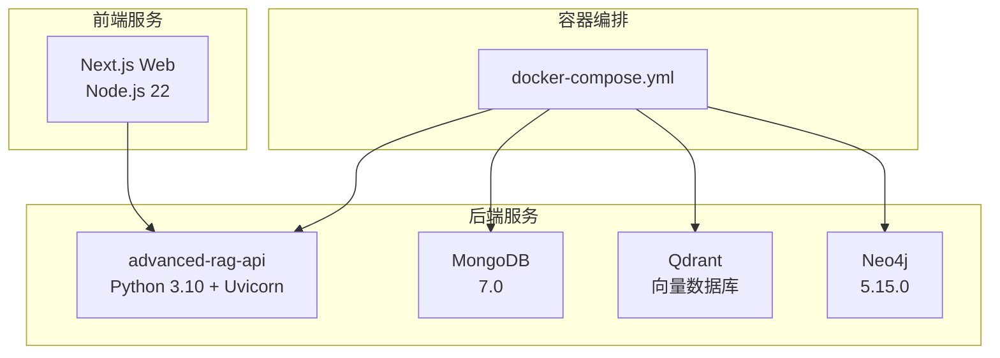
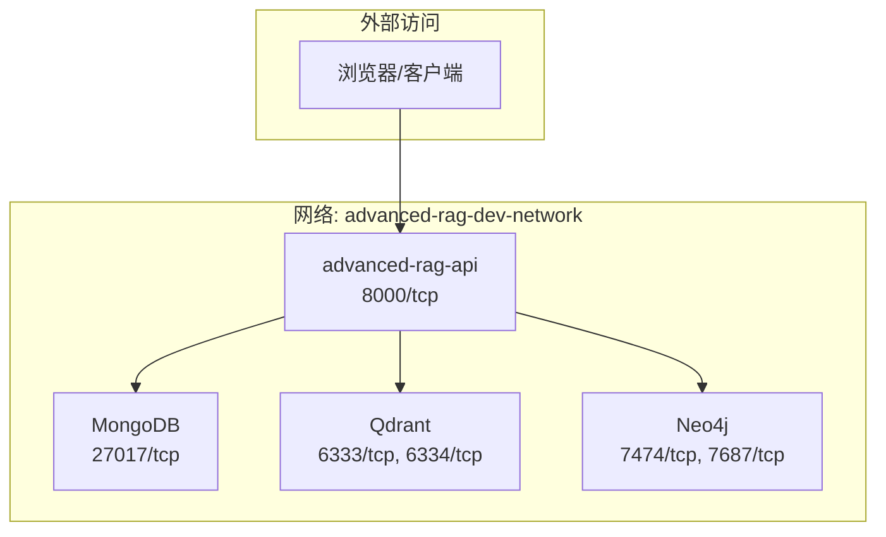
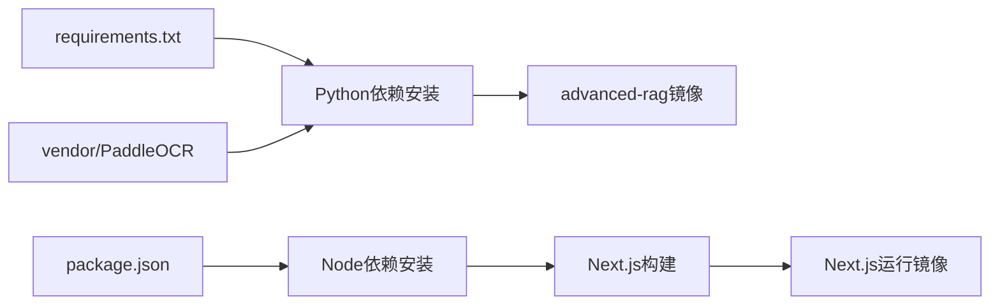

# Docker容器化部署

<cite>
**本文引用的文件**
- [docker-compose.yml](file://docker-compose.yml)
- [Dockerfile](file://Dockerfile)
- [web/Dockerfile](file://web/Dockerfile)
- [.dockerignore](file://.dockerignore)
- [web/.dockerignore](file://web/.dockerignore)
- [requirements.txt](file://requirements.txt)
- [main.py](file://main.py)
- [download_dependencies.sh](file://download_dependencies.sh)
- [download_dependencies.ps1](file://download_dependencies.ps1)
- [routers/health.py](file://routers/health.py)
- [utils/lifespan.py](file://utils/lifespan.py)
- [database/mongodb.py](file://database/mongodb.py)
- [database/qdrant_client.py](file://database/qdrant_client.py)
- [database/neo4j_client.py](file://database/neo4j_client.py)
</cite>

## 目录
1. [简介](#简介)
2. [项目结构](#项目结构)
3. [核心组件](#核心组件)
4. [架构总览](#架构总览)
5. [详细组件分析](#详细组件分析)
6. [依赖分析](#依赖分析)
7. [性能考虑](#性能考虑)
8. [故障排查指南](#故障排查指南)
9. [结论](#结论)
10. [附录](#附录)

## 简介
本文件提供Advanced RAG系统的完整Docker容器化部署指南，涵盖：
- Docker Compose配置结构与服务编排
- MongoDB、Qdrant、Neo4j数据库服务的容器化部署
- Python后端与Next.js前端的Dockerfile构建、镜像优化与多阶段构建
- 环境变量、卷挂载、网络拓扑、健康检查、重启策略与资源限制
- 开发与生产环境差异配置
- 容器间通信、服务发现与监控日志实践

## 项目结构
该仓库采用前后端分离的容器化策略：
- 后端API服务：基于Python 3.10，使用Uvicorn运行FastAPI应用
- 前端Web服务：基于Next.js，使用Node.js 22，采用多阶段构建
- 数据库服务：MongoDB、Qdrant、Neo4j通过Compose统一编排
- 依赖管理：requirements.txt集中声明Python依赖，本地GitHub依赖通过vendor目录预下载

图表来源
- [docker-compose.yml:1-76](file://docker-compose.yml#L1-L76)
- [Dockerfile:1-95](file://Dockerfile#L1-L95)
- [web/Dockerfile:1-39](file://web/Dockerfile#L1-L39)

章节来源
- [docker-compose.yml:1-76](file://docker-compose.yml#L1-L76)
- [Dockerfile:1-95](file://Dockerfile#L1-L95)
- [web/Dockerfile:1-39](file://web/Dockerfile#L1-L39)

## 核心组件
- 后端API容器
  - 基础镜像：python:3.10-slim
  - 端口：8000（可通过环境变量覆盖）
  - 工作进程：默认24（可通过环境变量UVICORN_WORKERS覆盖）
  - 健康检查：/health端点
  - 依赖：requirements.txt，本地vendor目录中的PaddleOCR
- 前端Web容器
  - 基础镜像：node:22-alpine
  - 多阶段构建：deps → builder → runner
  - 端口：3000
  - 构建产物：Next.js standalone
- 数据库服务
  - MongoDB：27017端口映射，初始化管理员账号
  - Qdrant：REST 6333/gRPC 6334，持久化存储卷
  - Neo4j：HTTP 7474/Bolt 7687，启用APOC插件

章节来源
- [Dockerfile:11-95](file://Dockerfile#L11-L95)
- [web/Dockerfile:1-39](file://web/Dockerfile#L1-L39)
- [docker-compose.yml:3-56](file://docker-compose.yml#L3-L56)

## 架构总览
下图展示容器间的网络拓扑、端口映射与服务发现：

图表来源
- [docker-compose.yml:74-76](file://docker-compose.yml#L74-L76)
- [docker-compose.yml:3-56](file://docker-compose.yml#L3-L56)
- [main.py:128-157](file://main.py#L128-L157)

## 详细组件分析

### Docker Compose服务配置
- MongoDB
  - 镜像：mongo:7.0
  - 端口：27017:27017
  - 环境变量：MONGO_INITDB_ROOT_USERNAME、MONGO_INITDB_ROOT_PASSWORD、MONGO_INITDB_DATABASE
  - 卷：mongodb_data、mongodb_config
  - 健康检查：使用mongosh执行ping命令，间隔10s，超时15s，重试5次，启动期30s
- Qdrant
  - 镜像：qdrant/qdrant:latest
  - 端口：6333（REST）、6334（gRPC）
  - 卷：qdrant_data
- Neo4j
  - 镜像：neo4j:5.15.0
  - 端口：7474（HTTP）、7687（Bolt）
  - 环境变量：NEO4J_AUTH、NEO4J_PLUGINS（启用APOC）
  - 卷：neo4j_data、neo4j_logs、neo4j_import、neo4j_plugins
- 网络与卷
  - 网络：bridge驱动，命名为advanced-rag-dev-network
  - 卷：本地驱动，分别挂载各数据库的数据与日志目录

章节来源
- [docker-compose.yml:1-76](file://docker-compose.yml#L1-L76)

### 后端API镜像构建（Dockerfile）
- 基础镜像与环境
  - python:3.10-slim
  - 环境变量：PYTHONUNBUFFERED、PIP_DISABLE_PIP_VERSION_CHECK、PYTHONDONTWRITEBYTECODE、ENVIRONMENT、UVICORN_PORT、UVICORN_WORKERS、LIBREOFFICE_PATH
  - 国内镜像源：APT与pip清华镜像
- 系统依赖
  - 缓存层优化：apt缓存与包索引缓存
  - 依赖：git、libjpeg-dev、zlib1g-dev、libreoffice、libreoffice-writer
- 依赖安装
  - vendor目录预下载PaddleOCR，requirements.txt集中安装
- 应用代码与权限
  - 复制agents/chunking/database/embedding/middleware/models/parsers/retrieval/routers/services/utils/main.py.env.production*
  - 创建上传/日志等目录并赋权
- 健康检查与启动
  - 健康检查：访问/health端点
  - CMD：uvicorn启动，端口与工作进程由环境变量控制

章节来源
- [Dockerfile:1-95](file://Dockerfile#L1-L95)
- [requirements.txt:1-38](file://requirements.txt#L1-L38)
- [download_dependencies.sh:1-29](file://download_dependencies.sh#L1-L29)
- [download_dependencies.ps1:1-35](file://download_dependencies.ps1#L1-L35)

### 前端Web镜像构建（web/Dockerfile）
- 多阶段构建
  - deps：安装依赖（npm ci）
  - builder：复制依赖与源码，构建Next.js（NODE_ENV=production）
  - runner：复制standalone产物与静态资源，设置端口3000
- 运行时
  - 环境变量：NODE_ENV=production、PORT=3000
  - CMD：node server.js

章节来源
- [web/Dockerfile:1-39](file://web/Dockerfile#L1-L39)

### 健康检查与生命周期
- 后端健康检查
  - /health端点：检查MongoDB与Qdrant连接状态，并返回系统资源信息
  - liveness/readiness端点：Kubernetes风格存活与就绪探针
  - 健康检查镜像：后端镜像内置HTTP健康检查
- 应用生命周期
  - 启动时：带重试连接MongoDB，初始化默认助手与默认知识空间
  - 关闭时：断开MongoDB连接

章节来源
- [routers/health.py:1-135](file://routers/health.py#L1-L135)
- [utils/lifespan.py:1-88](file://utils/lifespan.py#L1-L88)
- [Dockerfile:91-92](file://Dockerfile#L91-L92)

### 数据库连接配置
- MongoDB
  - 支持两种连接方式：MONGODB_URI（解析数据库名）或独立环境变量（HOST/PORT/USERNAME/PASSWORD/AUTH_SOURCE/DB_NAME）
  - 连接池参数：maxPoolSize、minPoolSize、maxIdleTimeMS、serverSelectionTimeoutMS、connectTimeoutMS、socketTimeoutMS
  - 启动时ping校验
- Qdrant
  - 优先使用gRPC（端口6334）以避免HTTP相关问题，支持连接复用
  - 本地HTTP连接时自动忽略API key以避免安全警告
  - 健康检查：获取集合列表验证可用性
- Neo4j
  - 默认bolt://localhost:7687，容器内自动替换为host.docker.internal
  - 连接验证：verify_connectivity

章节来源
- [database/mongodb.py:92-199](file://database/mongodb.py#L92-L199)
- [database/qdrant_client.py:18-139](file://database/qdrant_client.py#L18-L139)
- [database/neo4j_client.py:6-104](file://database/neo4j_client.py#L6-L104)

## 依赖分析
- Python依赖
  - FastAPI、Uvicorn、Mongo、Qdrant、Neo4j、Sentence Transformers、PyMuPDF、PyPDF2、jieba、langchain、unstructured、pydantic等
  - 本地依赖：PaddleOCR通过vendor目录安装
- 前端依赖
  - Next.js、React、TypeScript等（由package.json管理）

图表来源
- [requirements.txt:1-38](file://requirements.txt#L1-L38)
- [Dockerfile:55-67](file://Dockerfile#L55-L67)
- [web/Dockerfile:1-18](file://web/Dockerfile#L1-L18)

章节来源
- [requirements.txt:1-38](file://requirements.txt#L1-L38)
- [Dockerfile:55-67](file://Dockerfile#L55-L67)
- [web/Dockerfile:1-18](file://web/Dockerfile#L1-L18)

## 性能考虑
- 连接池与并发
  - MongoDB：通过环境变量配置连接池大小与超时，提升高并发稳定性
  - Qdrant：优先gRPC连接，支持连接复用，降低HTTP相关问题
  - Uvicorn：生产环境默认24个工作进程，可通过UVICORN_WORKERS调整
- 构建优化
  - Docker BuildKit缓存：APT与pip缓存共享
  - 多阶段构建：前端仅复制构建产物，减小镜像体积
- 存储与I/O
  - 数据库卷：持久化存储，避免容器重建丢失数据
  - 上传目录：建议挂载外部卷，便于备份与扩容

章节来源
- [Dockerfile:38-48](file://Dockerfile#L38-L48)
- [Dockerfile:55-67](file://Dockerfile#L55-L67)
- [web/Dockerfile:20-37](file://web/Dockerfile#L20-L37)
- [database/mongodb.py:122-136](file://database/mongodb.py#L122-L136)
- [database/qdrant_client.py:66-96](file://database/qdrant_client.py#L66-L96)

## 故障排查指南
- 健康检查失败
  - 后端：检查/health端点返回的服务状态，关注MongoDB与Qdrant连接错误
  - 数据库：确认容器网络、端口映射与凭据配置
- 连接问题
  - MongoDB：核对MONGODB_URI或HOST/PORT/USERNAME/PASSWORD配置，确认容器内可达性
  - Qdrant：确认gRPC端口6334可用，避免HTTP 502问题
  - Neo4j：容器内自动替换localhost为host.docker.internal，确认Bolt端口7687可达
- 构建失败
  - vendor目录缺失：先运行download_dependencies.sh或download_dependencies.ps1下载PaddleOCR
  - pip安装超时：检查国内镜像源配置
- 日志与监控
  - 后端：查看应用日志与/health/metrics端点输出
  - 数据库：查看对应容器日志与卷内日志文件

章节来源
- [routers/health.py:23-87](file://routers/health.py#L23-L87)
- [database/mongodb.py:168-184](file://database/mongodb.py#L168-L184)
- [database/qdrant_client.py:97-123](file://database/qdrant_client.py#L97-L123)
- [database/neo4j_client.py:16-38](file://database/neo4j_client.py#L16-L38)
- [download_dependencies.sh:1-29](file://download_dependencies.sh#L1-L29)
- [download_dependencies.ps1:1-35](file://download_dependencies.ps1#L1-L35)

## 结论
本部署方案通过Docker Compose实现数据库与API服务的统一编排，结合多阶段构建与缓存优化，显著提升构建效率与运行稳定性。生产环境建议启用健康检查、重启策略与资源限制，并通过卷持久化关键数据。开发与生产环境在端口、工作进程与镜像源上有所差异，应按需调整。

## 附录

### 部署命令与配置示例
- 构建本地依赖
  - Linux/macOS：./download_dependencies.sh
  - Windows：powershell -ExecutionPolicy ByPass -File download_dependencies.ps1
- 构建后端镜像
  - 使用BuildKit：DOCKER_BUILDKIT=1 docker build -t advanced-rag .
- 启动服务
  - docker-compose up -d
- 停止与清理
  - docker-compose down -v

章节来源
- [download_dependencies.sh:1-29](file://download_dependencies.sh#L1-L29)
- [download_dependencies.ps1:1-35](file://download_dependencies.ps1#L1-L35)
- [docker-compose.yml:1-76](file://docker-compose.yml#L1-L76)

### 环境变量与卷挂载
- 后端环境变量（示例）
  - ENVIRONMENT=production
  - UVICORN_PORT=8000
  - UVICORN_WORKERS=24
  - MONGODB_URI或MONGODB_HOST/MONGODB_PORT/MONGODB_USERNAME/MONGODB_PASSWORD/MONGODB_AUTH_SOURCE/MONGODB_DB_NAME
  - QDRANT_URL/QDRANT_API_KEY/QDRANT_TIMEOUT/QDRANT_GRPC_PORT
  - NEO4J_URI/NEO4J_USER/NEO4J_PASSWORD
- 卷挂载
  - MongoDB：mongodb_data、mongodb_config
  - Qdrant：qdrant_data
  - Neo4j：neo4j_data、neo4j_logs、neo4j_import、neo4j_plugins

章节来源
- [Dockerfile:14-20](file://Dockerfile#L14-L20)
- [database/mongodb.py:99-121](file://database/mongodb.py#L99-L121)
- [database/qdrant_client.py:35-76](file://database/qdrant_client.py#L35-L76)
- [database/neo4j_client.py:10-13](file://database/neo4j_client.py#L10-L13)
- [docker-compose.yml:13-15](file://docker-compose.yml#L13-L15)
- [docker-compose.yml:34-35](file://docker-compose.yml#L34-L35)
- [docker-compose.yml:50-54](file://docker-compose.yml#L50-L54)

### 网络拓扑与服务发现
- 网络：advanced-rag-dev-network（bridge）
- 服务发现：容器内通过服务名访问其他服务（如mongodb、qdrant、neo4j）
- 端口映射：开发环境对外暴露数据库端口，生产环境建议通过反向代理或Kubernetes Service暴露

章节来源
- [docker-compose.yml:74-76](file://docker-compose.yml#L74-L76)
- [docker-compose.yml:3-56](file://docker-compose.yml#L3-L56)

### 健康检查与重启策略
- 健康检查
  - MongoDB：Compose使用mongosh执行ping命令
  - 后端API：镜像内置HTTP健康检查，/health端点由应用提供
- 重启策略：unless-stopped
- 建议：生产环境增加资源限制（CPU/内存）与更严格的健康检查间隔

章节来源
- [docker-compose.yml:18-24](file://docker-compose.yml#L18-L24)
- [Dockerfile:91-92](file://Dockerfile#L91-L92)
- [routers/health.py:23-87](file://routers/health.py#L23-L87)

### 开发与生产环境差异
- 端口与工作进程
  - 开发：单worker，启用reload，端口8000
  - 生产：多worker（默认24），禁用reload，端口可配置
- 镜像源与构建
  - 生产：使用国内镜像源加速
  - 前端：多阶段构建，仅复制运行所需产物
- 数据库暴露
  - 开发：直接映射数据库端口
  - 生产：通过Kubernetes Service或反向代理暴露

章节来源
- [main.py:128-157](file://main.py#L128-L157)
- [Dockerfile:7-10](file://Dockerfile#L7-L10)
- [web/Dockerfile:20-37](file://web/Dockerfile#L20-L37)