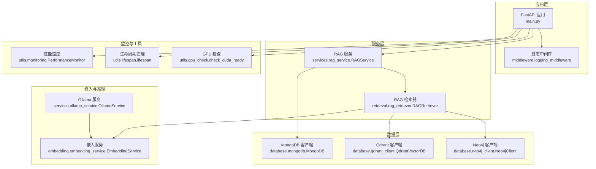
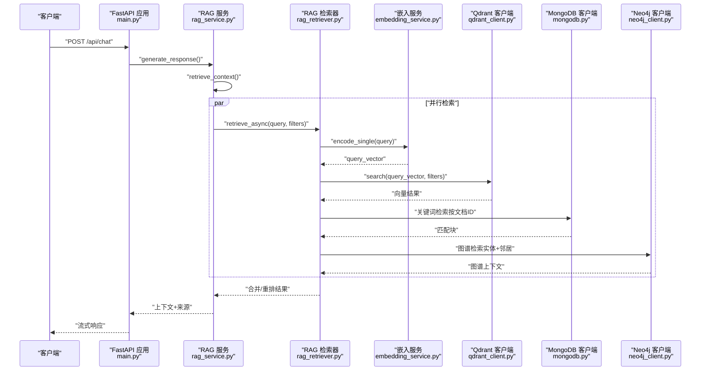
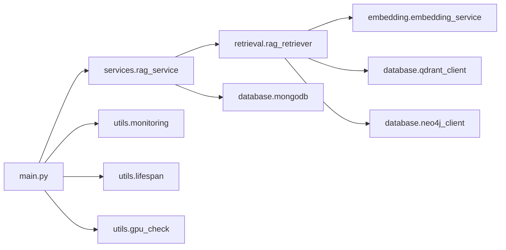

# 性能调优

<cite>
**本文引用的文件**
- [main.py](file://main.py)
- [qdrant_client.py](file://database/qdrant_client.py)
- [embedding_service.py](file://embedding/embedding_service.py)
- [rag_retriever.py](file://retrieval/rag_retriever.py)
- [rag_service.py](file://services/rag_service.py)
- [mongodb.py](file://database/mongodb.py)
- [neo4j_client.py](file://database/neo4j_client.py)
- [monitoring.py](file://utils/monitoring.py)
- [gpu_check.py](file://utils/gpu_check.py)
- [lifespan.py](file://utils/lifespan.py)
- [docker-compose.yml](file://docker-compose.yml)
- [Dockerfile](file://Dockerfile)
- [requirements.txt](file://requirements.txt)
- [README.md](file://README.md)
- [evaluate.py](file://eval/evaluate.py)
- [test_high_level_rag.py](file://tests/test_high_level_rag.py)
</cite>

## 目录
1. [简介](#简介)
2. [项目结构](#项目结构)
3. [核心组件](#核心组件)
4. [架构总览](#架构总览)
5. [详细组件分析](#详细组件分析)
6. [依赖分析](#依赖分析)
7. [性能考虑](#性能考虑)
8. [故障排查指南](#故障排查指南)
9. [结论](#结论)
10. [附录](#附录)

## 简介
本文件聚焦于 Advanced RAG 系统的性能调优，围绕数据库查询优化、向量检索性能、内存与 CPU 资源优化、网络与缓存配置、GPU 加速与模型推理优化、以及性能测试与基准测试方法展开。内容基于代码库的实际实现，提供可落地的优化策略与实践建议。

## 项目结构
系统采用 FastAPI + Next.js 架构，后端以模块化组织：路由层、服务层、数据库层、工具层与中间件层。核心链路为“RAG 检索 → 上下文拼装 → 生成回复”，涉及 MongoDB、Qdrant、Neo4j、Ollama 等外部组件。

图表来源
- [main.py:55-157](file://main.py#L55-L157)
- [rag_service.py:10-248](file://services/rag_service.py#L10-L248)
- [rag_retriever.py:22-325](file://retrieval/rag_retriever.py#L22-L325)
- [mongodb.py:92-196](file://database/mongodb.py#L92-L196)
- [qdrant_client.py:18-544](file://database/qdrant_client.py#L18-L544)
- [neo4j_client.py:6-104](file://database/neo4j_client.py#L6-L104)
- [embedding_service.py:8-278](file://embedding/embedding_service.py#L8-L278)
- [monitoring.py:13-185](file://utils/monitoring.py#L13-L185)
- [lifespan.py:26-88](file://utils/lifespan.py#L26-L88)
- [gpu_check.py:10-66](file://utils/gpu_check.py#L10-L66)

章节来源
- [main.py:55-157](file://main.py#L55-L157)
- [README.md:55-70](file://README.md#L55-L70)

## 核心组件
- 应用入口与运行参数：生产环境多 worker、keep-alive 超时、并发连接上限、CORS 与静态资源挂载。
- 数据库连接池：MongoDB 连接池参数可调，支持最大/最小池大小、空闲超时、服务器选择与 socket 超时。
- 向量检索：Qdrant 客户端优先使用 gRPC、连接复用、超时配置、自动集合创建与维度校验、重试与指数退避。
- 嵌入服务：Ollama 嵌入调用、超时与重试、模型名称规范化、文本截断保护。
- RAG 检索：异步并行检索（向量、关键词、图谱）、结果合并与重排占位、去重与来源聚合。
- 性能监控：请求耗时统计、慢请求告警、系统指标采集（CPU/内存/磁盘）。
- 生命周期：启动时 MongoDB 连接重试、默认助手与知识空间初始化。
- GPU 检查：跨平台 CUDA 设备检测（PyTorch/pynvml/nvidia-smi）。

章节来源
- [main.py:128-157](file://main.py#L128-L157)
- [mongodb.py:122-136](file://database/mongodb.py#L122-L136)
- [qdrant_client.py:66-96](file://database/qdrant_client.py#L66-L96)
- [embedding_service.py:175-229](file://embedding/embedding_service.py#L175-L229)
- [rag_retriever.py:69-101](file://retrieval/rag_retriever.py#L69-L101)
- [monitoring.py:13-185](file://utils/monitoring.py#L13-L185)
- [lifespan.py:26-88](file://utils/lifespan.py#L26-L88)
- [gpu_check.py:10-66](file://utils/gpu_check.py#L10-L66)

## 架构总览
系统采用“异步 + 并行”的检索链路，结合外部向量库与图谱库，通过嵌入服务将查询文本映射到向量空间，再进行相似度检索与结果融合。

图表来源
- [rag_service.py:10-248](file://services/rag_service.py#L10-L248)
- [rag_retriever.py:69-101](file://retrieval/rag_retriever.py#L69-L101)
- [embedding_service.py:230-259](file://embedding/embedding_service.py#L230-L259)
- [qdrant_client.py:336-414](file://database/qdrant_client.py#L336-L414)
- [neo4j_client.py:40-62](file://database/neo4j_client.py#L40-L62)
- [mongodb.py:799-800](file://database/mongodb.py#L799-L800)

## 详细组件分析

### 数据库查询优化（MongoDB）
- 连接池配置
  - maxPoolSize/minPoolSize：根据并发与资源设定，避免连接不足或过度占用。
  - maxIdleTimeMS：控制空闲连接回收，降低资源浪费。
  - serverSelectionTimeoutMS/connectTimeoutMS/socketTimeoutMS：缩短等待与超时，提升失败感知速度。
- 查询与读写分离
  - 读写分离与副本集部署（如需）可进一步提升吞吐。
  - 合理索引与投影（仅返回必要字段）减少网络与序列化开销。
- 事务与批处理
  - 批量写入（chunks/documents）时使用批量 API，减少往返。
  - 事务场景谨慎使用，避免长时间锁竞争。

章节来源
- [mongodb.py:122-136](file://database/mongodb.py#L122-L136)
- [mongodb.py:496-524](file://database/mongodb.py#L496-L524)

### 向量检索性能优化（Qdrant）
- gRPC 优先与连接复用
  - 通过 prefer_grpc 与端口切换（6333→6334）避免 httpx 502 问题，提升稳定性与性能。
- 超时与重试
  - 统一超时配置，插入/查询失败时指数退避重试，避免雪崩。
- 集合与维度管理
  - 自动检测集合维度并按需重建，避免维度不匹配导致的失败。
- 过滤与阈值
  - 使用过滤条件缩小搜索空间，score_threshold 控制召回质量与性能平衡。
- 并发与批处理
  - 检索链路异步并行，结合 worker 数量与 keep-alive 超时，提升整体吞吐。

章节来源
- [qdrant_client.py:66-96](file://database/qdrant_client.py#L66-L96)
- [qdrant_client.py:210-335](file://database/qdrant_client.py#L210-L335)
- [qdrant_client.py:336-414](file://database/qdrant_client.py#L336-L414)

### 嵌入向量优化与相似度计算加速
- 模型选择与规范化
  - 自动检测/规范化嵌入模型名称，避免因标签不一致导致的失败。
- 文本预处理
  - 对过长文本进行截断，避免 Ollama 500 错误，保障稳定性。
- 超时与重试
  - 嵌入请求超时与重试策略，结合指数退避，提升失败恢复能力。
- 相似度策略
  - Qdrant 使用 COSINE 距离，注意与嵌入模型训练方式一致，避免不必要的转换成本。

章节来源
- [embedding_service.py:46-105](file://embedding/embedding_service.py#L46-L105)
- [embedding_service.py:250-259](file://embedding/embedding_service.py#L250-L259)
- [embedding_service.py:175-229](file://embedding/embedding_service.py#L175-L229)
- [qdrant_client.py:140-209](file://database/qdrant_client.py#L140-L209)

### 内存管理与 CPU 资源优化
- 进程与并发
  - 生产环境多 worker（默认 24），结合 limit_concurrency 控制每 worker 并发连接数。
  - keep-alive 超时延长，适配大文件上传与长连接场景。
- 连接池与资源复用
  - MongoDB 连接池参数精细化配置，避免频繁创建销毁连接。
  - Qdrant 使用 gRPC 连接复用，减少握手与上下文切换。
- 监控与告警
  - 性能监控记录慢请求与错误率，辅助定位热点与异常。
- 生命周期与初始化
  - 启动时 MongoDB 连接重试与默认数据初始化，避免冷启动抖动。

章节来源
- [main.py:128-157](file://main.py#L128-L157)
- [mongodb.py:122-136](file://database/mongodb.py#L122-L136)
- [monitoring.py:13-185](file://utils/monitoring.py#L13-L185)
- [lifespan.py:26-88](file://utils/lifespan.py#L26-L88)

### 网络优化、缓存与 CDN
- 网络传输
  - Qdrant 优先 gRPC，减少 HTTP 层开销；统一超时与重试策略。
  - FastAPI keep-alive 超时与并发上限，平衡吞吐与资源占用。
- 缓存与 CDN
  - README 提到 Redis 作为可选缓存服务，可用于会话、会话附件状态、热门查询结果等缓存。
  - 静态资源（头像、缩略图、封面）通过 FastAPI StaticFiles 提供，可配合 CDN 与边缘缓存。
- 建议
  - 对高频读取的文档元数据与检索结果进行短期缓存，结合失效策略。
  - 对大文件下载与静态资源使用 CDN，降低中心节点压力。

章节来源
- [qdrant_client.py:66-96](file://database/qdrant_client.py#L66-L96)
- [main.py:75-88](file://main.py#L75-L88)
- [README.md:149-152](file://README.md#L149-L152)

### GPU 加速与模型推理优化
- 设备检测
  - 提供跨平台 CUDA 设备检测工具，便于在部署前确认 GPU 可用性。
- 推理策略
  - 当前检索链路主要依赖嵌入与向量检索，重排模块暂禁用以避免崩溃。
  - 若启用重排，建议在具备 GPU 的环境中使用轻量级重排模型，并合理设置 batch 与并发。
- 批处理
  - 嵌入服务按文本逐条调用，可结合上游批量分块策略减少往返。

章节来源
- [gpu_check.py:10-66](file://utils/gpu_check.py#L10-L66)
- [rag_retriever.py:12-21](file://retrieval/rag_retriever.py#L12-L21)

### 性能测试、基准测试与压力测试
- 自动化评估
  - 评估脚本按“检索→生成→LLM 评分”的流程，可作为端到端质量与性能基线。
- 单元与集成测试
  - 提供混合分块、知识抽取与检索的测试样例，便于回归与性能回归。
- 建议的测试方法
  - 基准测试：固定数据规模与查询分布，测量 P50/P95 延迟与吞吐。
  - 压力测试：逐步提升并发与数据量，观察错误率、慢请求比例与资源使用。
  - 端到端：结合评估脚本，模拟真实问答流程，记录检索与生成耗时。

章节来源
- [evaluate.py:19-91](file://eval/evaluate.py#L19-L91)
- [test_high_level_rag.py:27-99](file://tests/test_high_level_rag.py#L27-L99)

## 依赖分析
- 外部组件
  - FastAPI/Uvicorn：应用框架与 ASGI 服务器，支持多 worker 与并发控制。
  - MongoDB/Motor：异步数据库访问，连接池参数可调。
  - Qdrant Client：向量检索与管理，支持 gRPC 与超时重试。
  - Neo4j Driver：图谱查询，需稳定连接与参数化查询。
  - Ollama：本地嵌入与生成服务，需超时与重试策略。
- 内部模块耦合
  - RAG 服务依赖检索器与数据库客户端；检索器依赖嵌入服务与向量/图谱客户端。
  - 监控与生命周期模块贯穿应用运行期。

图表来源
- [main.py:55-157](file://main.py#L55-L157)
- [rag_service.py:10-248](file://services/rag_service.py#L10-L248)
- [rag_retriever.py:22-325](file://retrieval/rag_retriever.py#L22-L325)
- [mongodb.py:92-196](file://database/mongodb.py#L92-L196)
- [qdrant_client.py:18-544](file://database/qdrant_client.py#L18-L544)
- [neo4j_client.py:6-104](file://database/neo4j_client.py#L6-L104)
- [embedding_service.py:8-278](file://embedding/embedding_service.py#L8-L278)
- [monitoring.py:13-185](file://utils/monitoring.py#L13-L185)
- [lifespan.py:26-88](file://utils/lifespan.py#L26-L88)
- [gpu_check.py:10-66](file://utils/gpu_check.py#L10-L66)

## 性能考虑
- 数据库层
  - 合理设置连接池参数，避免过大导致内存压力，过小导致排队。
  - 对高频查询建立必要索引，减少扫描范围。
- 向量检索层
  - 优先使用 gRPC，统一超时与重试；按需开启过滤与阈值。
  - 集合维度与距离度量需与嵌入模型一致。
- 检索与生成层
  - 异步并行检索，合理 top_k 与阈值，减少下游处理负担。
  - 生成侧可考虑流式输出与背压控制。
- 监控与运维
  - 慢请求与错误率监控，结合系统指标（CPU/内存/磁盘）定位瓶颈。
  - 启动时连接重试与默认数据初始化，降低冷启动风险。

## 故障排查指南
- Qdrant 连接问题
  - 现象：502/503/504 或超时。
  - 处理：确认 gRPC 端口与 prefer_grpc；启用自动重试与指数退避；必要时切换 127.0.0.1。
- MongoDB 连接失败
  - 现象：连接超时或认证失败。
  - 处理：检查 URI/主机/端口/认证参数；调整连接池超时；确认网络可达。
- 嵌入服务超时
  - 现象：Ollama 500 或超时。
  - 处理：缩短文本长度；增加超时与重试；检查模型可用性。
- 慢请求定位
  - 使用性能监控记录慢请求与错误率，结合系统指标定位热点。

章节来源
- [qdrant_client.py:98-123](file://database/qdrant_client.py#L98-L123)
- [mongodb.py:168-184](file://database/mongodb.py#L168-L184)
- [embedding_service.py:205-228](file://embedding/embedding_service.py#L205-L228)
- [monitoring.py:163-185](file://utils/monitoring.py#L163-L185)

## 结论
通过 gRPC 连接复用、连接池参数优化、异步并行检索与统一的超时重试策略，系统在高并发场景下具备较好的稳定性与扩展性。建议在生产环境中结合监控与缓存策略，持续观测慢请求与资源使用，按需调整 worker 数量、连接池与检索阈值，以获得最佳性能与成本平衡。

## 附录
- 部署与运行
  - Dockerfile 默认 24 个 worker，可通过环境变量覆盖；Docker Compose 提供 MongoDB/Qdrant/Neo4j 的本地开发编排。
- 环境变量与配置
  - 关键变量包括数据库连接、Qdrant URL/API Key、Neo4j 凭据、Ollama 基础地址与模型、上传目录与大小限制、日志级别与文件等。

章节来源
- [Dockerfile:14-20](file://Dockerfile#L14-L20)
- [docker-compose.yml:1-76](file://docker-compose.yml#L1-L76)
- [README.md:125-166](file://README.md#L125-L166)