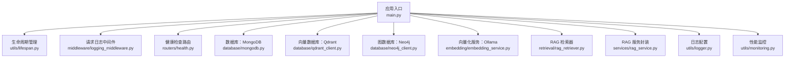
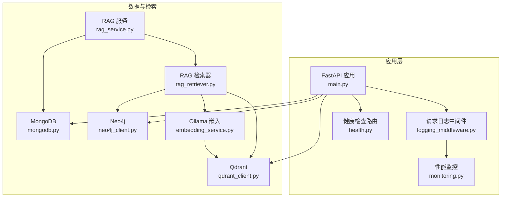
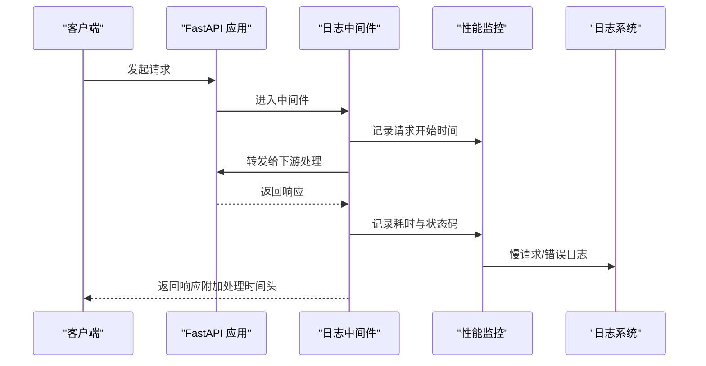
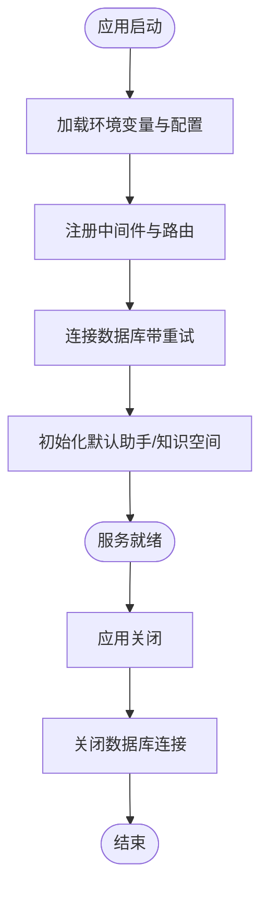
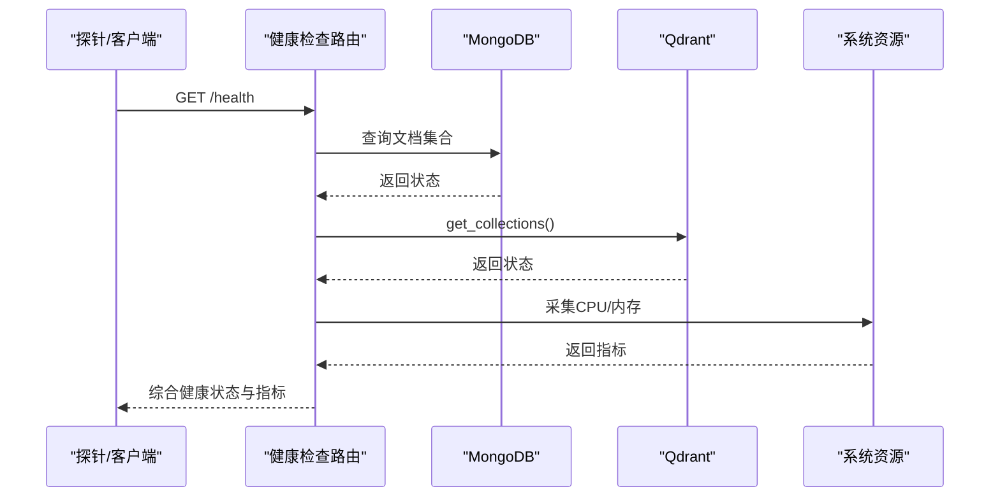
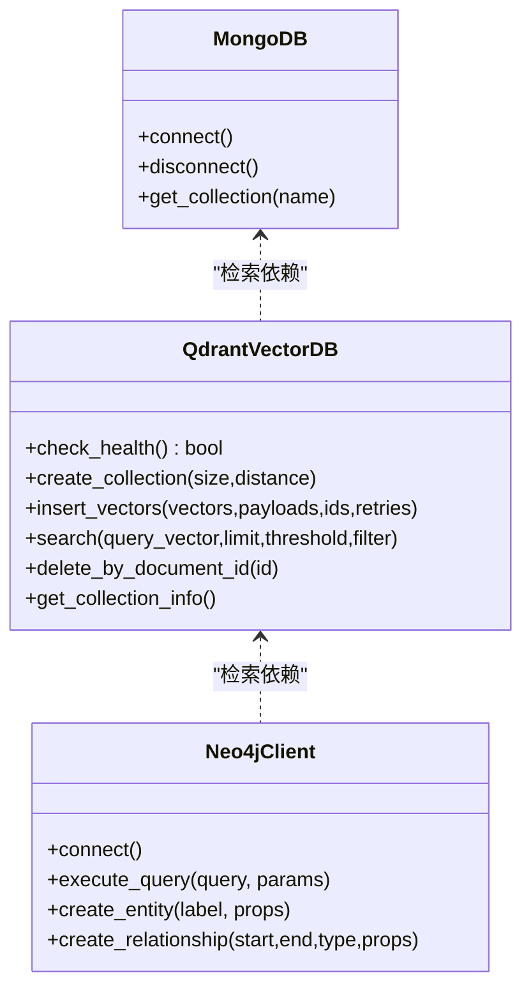
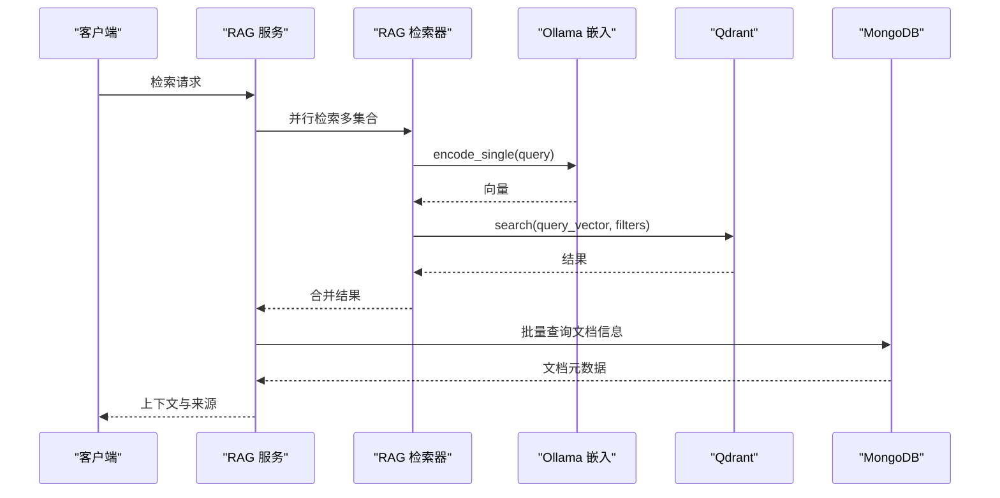
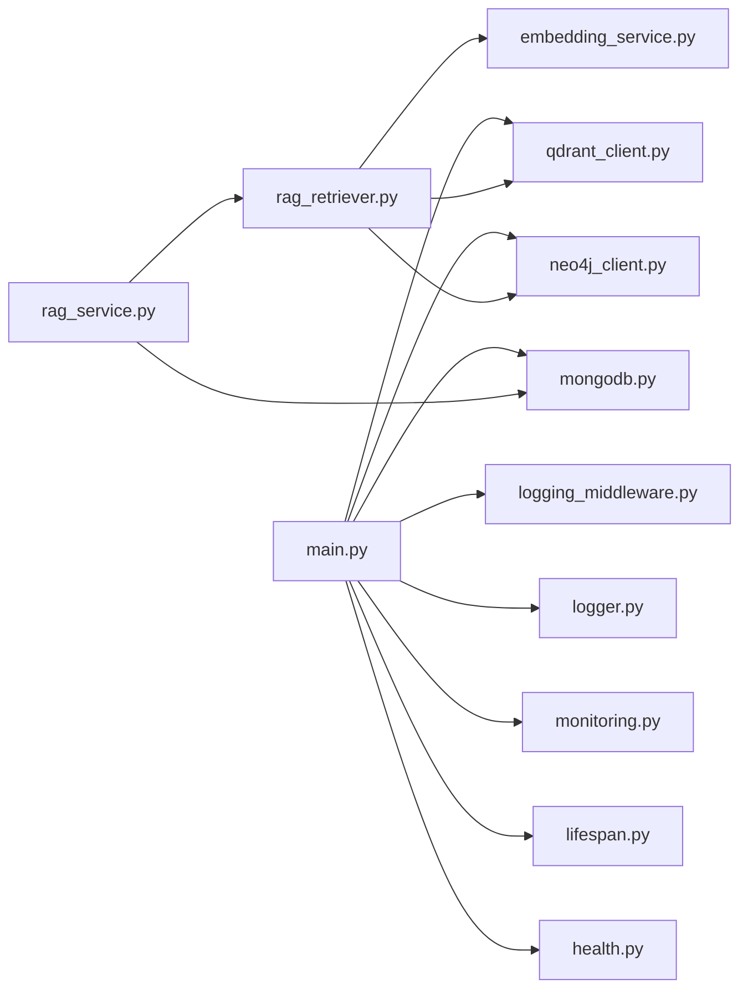

# 故障排除指南

<cite>
**本文引用的文件**
- [main.py](file://main.py)
- [logger.py](file://utils/logger.py)
- [monitoring.py](file://utils/monitoring.py)
- [logging_middleware.py](file://middleware/logging_middleware.py)
- [lifespan.py](file://utils/lifespan.py)
- [health.py](file://routers/health.py)
- [mongodb.py](file://database/mongodb.py)
- [qdrant_client.py](file://database/qdrant_client.py)
- [neo4j_client.py](file://database/neo4j_client.py)
- [embedding_service.py](file://embedding/embedding_service.py)
- [rag_retriever.py](file://retrieval/rag_retriever.py)
- [rag_service.py](file://services/rag_service.py)
- [boot_verify.py](file://scripts/boot_verify.py)
- [gpu_check.py](file://utils/gpu_check.py)
</cite>

## 目录
1. [简介](#简介)
2. [项目结构](#项目结构)
3. [核心组件](#核心组件)
4. [架构总览](#架构总览)
5. [详细组件分析](#详细组件分析)
6. [依赖分析](#依赖分析)
7. [性能考量](#性能考量)
8. [故障排除指南](#故障排除指南)
9. [结论](#结论)
10. [附录](#附录)

## 简介
本指南面向运维与开发人员，聚焦系统常见问题的诊断与解决，涵盖启动失败、连接超时、内存溢出、性能下降、日志分析、数据库连接问题、向量数据库异常、网络与DNS问题以及监控告警与应急响应流程。文档基于代码库的实际实现，提供可操作的排查步骤与最佳实践。

## 项目结构
系统采用 FastAPI 应用入口，配合中间件、日志与监控模块，集成 MongoDB、Qdrant、Neo4j 等外部服务，提供 RAG 检索与向量化能力。

**图表来源**
- [main.py:55-157](file://main.py#L55-L157)
- [lifespan.py:26-88](file://utils/lifespan.py#L26-L88)
- [logging_middleware.py:8-52](file://middleware/logging_middleware.py#L8-L52)
- [health.py:23-135](file://routers/health.py#L23-L135)
- [mongodb.py:92-200](file://database/mongodb.py#L92-L200)
- [qdrant_client.py:18-124](file://database/qdrant_client.py#L18-L124)
- [neo4j_client.py:6-104](file://database/neo4j_client.py#L6-L104)
- [embedding_service.py:8-278](file://embedding/embedding_service.py#L8-L278)
- [rag_retriever.py:22-325](file://retrieval/rag_retriever.py#L22-L325)
- [rag_service.py:7-248](file://services/rag_service.py#L7-L248)
- [logger.py:15-88](file://utils/logger.py#L15-L88)
- [monitoring.py:13-185](file://utils/monitoring.py#L13-L185)

**章节来源**
- [main.py:55-157](file://main.py#L55-L157)

## 核心组件
- 应用入口与生命周期：负责加载环境变量、注册中间件与路由、启动/关闭数据库连接、异常统一处理。
- 日志与监控：异步文件写入、请求性能记录、慢请求告警、系统资源采集。
- 健康检查：对 MongoDB、Qdrant、系统资源进行健康与指标上报。
- 数据库层：MongoDB（异步/同步）、Qdrant（gRPC 连接、重试与维度校验）、Neo4j（容器环境兼容）。
- 向量化与检索：Ollama 嵌入、RAG 检索器（向量/关键词/图谱混合）与服务封装。

**章节来源**
- [main.py:109-126](file://main.py#L109-L126)
- [logger.py:15-88](file://utils/logger.py#L15-L88)
- [monitoring.py:13-185](file://utils/monitoring.py#L13-L185)
- [health.py:23-135](file://routers/health.py#L23-L135)
- [mongodb.py:92-200](file://database/mongodb.py#L92-L200)
- [qdrant_client.py:18-124](file://database/qdrant_client.py#L18-L124)
- [neo4j_client.py:6-104](file://database/neo4j_client.py#L6-L104)
- [embedding_service.py:8-278](file://embedding/embedding_service.py#L8-L278)
- [rag_retriever.py:22-325](file://retrieval/rag_retriever.py#L22-L325)
- [rag_service.py:7-248](file://services/rag_service.py#L7-L248)

## 架构总览
系统通过中间件统一记录请求与性能，健康检查端点聚合服务状态，数据库与向量/图数据库提供底层数据支撑，RAG 服务整合检索与上下文生成。

**图表来源**
- [main.py:55-157](file://main.py#L55-L157)
- [logging_middleware.py:8-52](file://middleware/logging_middleware.py#L8-L52)
- [health.py:23-135](file://routers/health.py#L23-L135)
- [monitoring.py:13-185](file://utils/monitoring.py#L13-L185)
- [mongodb.py:92-200](file://database/mongodb.py#L92-L200)
- [qdrant_client.py:18-124](file://database/qdrant_client.py#L18-L124)
- [neo4j_client.py:6-104](file://database/neo4j_client.py#L6-L104)
- [embedding_service.py:8-278](file://embedding/embedding_service.py#L8-L278)
- [rag_retriever.py:22-325](file://retrieval/rag_retriever.py#L22-L325)
- [rag_service.py:7-248](file://services/rag_service.py#L7-L248)

## 详细组件分析

### 日志与监控组件
- 异步日志：队列监听器后台写入，避免阻塞；生产环境降低文件日志级别。
- 请求中间件：记录请求/响应、慢请求告警、性能统计。
- 性能监控：记录请求耗时、错误计数、系统 CPU/内存/磁盘指标。

**图表来源**
- [logging_middleware.py:8-52](file://middleware/logging_middleware.py#L8-L52)
- [monitoring.py:163-185](file://utils/monitoring.py#L163-L185)
- [logger.py:15-88](file://utils/logger.py#L15-L88)

**章节来源**
- [logger.py:15-88](file://utils/logger.py#L15-L88)
- [logging_middleware.py:8-52](file://middleware/logging_middleware.py#L8-L52)
- [monitoring.py:13-185](file://utils/monitoring.py#L13-L185)

### 生命周期与启动流程
- 应用启动：加载环境变量与配置，注册中间件与路由，连接数据库并初始化默认助手/知识空间。
- 异常处理：全局异常捕获并记录，返回统一错误响应。

**图表来源**
- [main.py:21-53](file://main.py#L21-L53)
- [main.py:109-126](file://main.py#L109-L126)
- [lifespan.py:26-88](file://utils/lifespan.py#L26-L88)

**章节来源**
- [main.py:21-53](file://main.py#L21-L53)
- [main.py:109-126](file://main.py#L109-L126)
- [lifespan.py:26-88](file://utils/lifespan.py#L26-L88)

### 健康检查与指标
- 健康检查：MongoDB 读取、Qdrant 健康检查、系统资源信息。
- 指标端点：请求统计与系统资源使用情况。

**图表来源**
- [health.py:23-135](file://routers/health.py#L23-L135)

**章节来源**
- [health.py:23-135](file://routers/health.py#L23-L135)

### 数据库连接与问题排查
- MongoDB：异步/同步客户端，连接池参数可调，启动时 ping 校验，失败提示常见配置问题。
- Qdrant：优先 gRPC 连接，自动重试与维度校验，集合不存在时自动创建。
- Neo4j：容器环境兼容（localhost 替换为 host.docker.internal），连接失败记录日志。

**图表来源**
- [mongodb.py:92-200](file://database/mongodb.py#L92-L200)
- [qdrant_client.py:18-124](file://database/qdrant_client.py#L18-L124)
- [neo4j_client.py:6-104](file://database/neo4j_client.py#L6-L104)

**章节来源**
- [mongodb.py:92-200](file://database/mongodb.py#L92-L200)
- [qdrant_client.py:18-124](file://database/qdrant_client.py#L18-L124)
- [neo4j_client.py:6-104](file://database/neo4j_client.py#L6-L104)

### 向量化与检索
- Ollama 嵌入：自动检测/规范化模型名称，超时与连接错误重试，文本截断避免服务错误。
- RAG 检索器：并行向量/关键词/图谱检索，结果合并与重排（可选），异常降级。
- RAG 服务：并行检索多知识空间集合，构建上下文与来源信息，失败回退策略。

**图表来源**
- [rag_service.py:10-248](file://services/rag_service.py#L10-L248)
- [rag_retriever.py:69-101](file://retrieval/rag_retriever.py#L69-L101)
- [embedding_service.py:175-278](file://embedding/embedding_service.py#L175-L278)
- [qdrant_client.py:336-414](file://database/qdrant_client.py#L336-L414)
- [mongodb.py:479-551](file://database/mongodb.py#L479-L551)

**章节来源**
- [embedding_service.py:8-278](file://embedding/embedding_service.py#L8-L278)
- [rag_retriever.py:22-325](file://retrieval/rag_retriever.py#L22-L325)
- [rag_service.py:7-248](file://services/rag_service.py#L7-L248)

## 依赖分析
- 应用入口依赖中间件、日志、监控与数据库模块。
- 健康检查依赖数据库与监控模块。
- 检索链路依赖嵌入服务、向量数据库与图数据库。
- 启动流程依赖数据库连接与初始化逻辑。

**图表来源**
- [main.py:55-157](file://main.py#L55-L157)
- [logging_middleware.py:8-52](file://middleware/logging_middleware.py#L8-L52)
- [logger.py:15-88](file://utils/logger.py#L15-L88)
- [monitoring.py:13-185](file://utils/monitoring.py#L13-L185)
- [lifespan.py:26-88](file://utils/lifespan.py#L26-L88)
- [health.py:23-135](file://routers/health.py#L23-L135)
- [mongodb.py:92-200](file://database/mongodb.py#L92-L200)
- [qdrant_client.py:18-124](file://database/qdrant_client.py#L18-L124)
- [neo4j_client.py:6-104](file://database/neo4j_client.py#L6-L104)
- [rag_service.py:7-248](file://services/rag_service.py#L7-L248)
- [rag_retriever.py:22-325](file://retrieval/rag_retriever.py#L22-L325)
- [embedding_service.py:8-278](file://embedding/embedding_service.py#L8-L278)

**章节来源**
- [main.py:55-157](file://main.py#L55-L157)

## 性能考量
- 连接池与超时：MongoDB 连接池参数可调，Qdrant 优先 gRPC 与重试，Ollama 嵌入请求超时与连接错误指数退避。
- 监控指标：请求耗时分布（p50/p95/p99）、错误率、系统 CPU/内存/磁盘使用。
- 慢请求告警：中间件与监控模块对慢请求进行记录与告警。

**章节来源**
- [mongodb.py:129-151](file://database/mongodb.py#L129-L151)
- [qdrant_client.py:66-124](file://database/qdrant_client.py#L66-L124)
- [embedding_service.py:175-278](file://embedding/embedding_service.py#L175-L278)
- [monitoring.py:13-185](file://utils/monitoring.py#L13-L185)
- [logging_middleware.py:38-50](file://middleware/logging_middleware.py#L38-L50)

## 故障排除指南

### 启动失败
- 现象：服务无法启动或启动后立即退出。
- 排查步骤：
  - 检查环境变量文件加载顺序与内容（优先 ENVIRONMENT/NODE_ENV，其次 .env，最后根目录 .env）。
  - 查看生命周期中间件中的数据库连接重试与初始化逻辑。
  - 关注全局异常处理器记录的错误堆栈。
- 关联文件：
  - [main.py:21-53](file://main.py#L21-L53)
  - [lifespan.py:26-88](file://utils/lifespan.py#L26-L88)
  - [main.py:109-126](file://main.py#L109-L126)

**章节来源**
- [main.py:21-53](file://main.py#L21-L53)
- [lifespan.py:26-88](file://utils/lifespan.py#L26-L88)
- [main.py:109-126](file://main.py#L109-L126)

### 连接超时
- MongoDB：
  - 检查连接池参数（最大/最小连接数、空闲超时、服务器选择/连接/套接字超时）。
  - 确认 URI 或主机/端口配置，容器环境使用 host.docker.internal。
  - 启动时 ping 校验失败时的提示信息。
- Qdrant：
  - 优先使用 gRPC（端口 6334），自动重试与维度校验，集合不存在时自动创建。
  - HTTP 连接避免使用 httpx 导致的 502，改用 gRPC。
- Neo4j：
  - 容器内 localhost 替换为 host.docker.internal，验证连接可达性。
- Ollama 嵌入：
  - 超时与连接错误指数退避重试，必要时调整超时与模型名称。

**章节来源**
- [mongodb.py:129-185](file://database/mongodb.py#L129-L185)
- [qdrant_client.py:66-124](file://database/qdrant_client.py#L66-L124)
- [neo4j_client.py:16-38](file://database/neo4j_client.py#L16-L38)
- [embedding_service.py:175-278](file://embedding/embedding_service.py#L175-L278)

### 内存溢出
- 现象：进程内存持续增长、GC 不及时、日志频繁出现慢请求。
- 排查步骤：
  - 检查日志异步写入队列大小与监听器状态，避免队列积压导致内存占用。
  - 查看性能监控中的进程内存使用与系统内存使用。
  - 关注大请求（上传/检索）是否长时间占用内存。
- 关联文件：
  - [logger.py:56-67](file://utils/logger.py#L56-L67)
  - [monitoring.py:78-112](file://utils/monitoring.py#L78-L112)

**章节来源**
- [logger.py:56-67](file://utils/logger.py#L56-L67)
- [monitoring.py:78-112](file://utils/monitoring.py#L78-L112)

### 性能下降
- 现象：请求平均/尾延迟升高、错误率上升。
- 排查步骤：
  - 使用健康检查指标端点查看请求统计与系统资源。
  - 中间件记录慢请求并附加处理时间头，便于定位瓶颈。
  - 检查数据库/向量/图数据库的连接与查询耗时。
- 关联文件：
  - [health.py:117-135](file://routers/health.py#L117-L135)
  - [logging_middleware.py:38-50](file://middleware/logging_middleware.py#L38-L50)
  - [monitoring.py:13-185](file://utils/monitoring.py#L13-L185)

**章节来源**
- [health.py:117-135](file://routers/health.py#L117-L135)
- [logging_middleware.py:38-50](file://middleware/logging_middleware.py#L38-L50)
- [monitoring.py:13-185](file://utils/monitoring.py#L13-L185)

### 日志分析方法
- 日志级别与输出：
  - 控制台同步输出，文件异步写入，生产环境降低文件日志级别。
  - 减少第三方库噪声，集中关注业务日志。
- 调试信息提取：
  - 中间件记录请求路径、方法、状态码与处理时间。
  - 全局异常处理器记录异常堆栈与请求上下文。
- 问题定位技巧：
  - 使用慢请求告警与性能监控统计定位热点接口。
  - 健康检查端点聚合服务状态，快速发现依赖服务异常。

**章节来源**
- [logger.py:15-88](file://utils/logger.py#L15-L88)
- [logging_middleware.py:18-50](file://middleware/logging_middleware.py#L18-L50)
- [main.py:109-126](file://main.py#L109-L126)
- [health.py:23-87](file://routers/health.py#L23-L87)

### 数据库连接问题排查
- MongoDB：
  - 连接池耗尽：调整 maxPoolSize/minPoolSize，观察连接数与空闲超时。
  - 查询超时：检查 serverSelectionTimeoutMS/connectTimeoutMS/socketTimeoutMS。
  - 启动失败：查看 ping 校验与错误提示，确认 URI/主机/端口/Docker 环境。
- Qdrant：
  - 连接池耗尽：确认 gRPC 连接复用与超时设置。
  - 查询超时：利用重试机制与维度校验，集合不存在时自动创建。
- Neo4j：
  - 容器环境兼容：localhost 替换为 host.docker.internal。
  - 连接失败：查看驱动连接与可连接性验证日志。

**章节来源**
- [mongodb.py:129-185](file://database/mongodb.py#L129-L185)
- [qdrant_client.py:66-124](file://database/qdrant_client.py#L66-L124)
- [neo4j_client.py:16-38](file://database/neo4j_client.py#L16-L38)

### 向量数据库异常处理
- 索引损坏/集合不存在：
  - 自动创建集合，使用查询向量维度；集合为空时返回空结果。
- 查询失败：
  - 重试机制（指数退避），临时性错误自动恢复。
- 存储空间不足：
  - 通过健康检查与系统资源指标监控磁盘使用，必要时清理或扩容。

**章节来源**
- [qdrant_client.py:140-209](file://database/qdrant_client.py#L140-L209)
- [qdrant_client.py:336-414](file://database/qdrant_client.py#L336-L414)
- [health.py:67-81](file://routers/health.py#L67-L81)

### 网络连接问题诊断
- DNS 解析问题：
  - Ollama 基础地址将 localhost 替换为 127.0.0.1，避免 DNS 解析差异。
- 防火墙与端口：
  - MongoDB：确认主机/端口与容器映射。
  - Qdrant：优先 gRPC 端口 6334，避免 HTTP 502。
  - Neo4j：确认 bolt 端口 7687 可达。
- 容器环境：
  - 主机与容器通信使用 host.docker.internal。

**章节来源**
- [embedding_service.py:21-26](file://embedding/embedding_service.py#L21-L26)
- [neo4j_client.py:20-26](file://database/neo4j_client.py#L20-L26)
- [qdrant_client.py:80-91](file://database/qdrant_client.py#L80-L91)

### 系统监控告警与应急响应
- 响应流程：
  - 健康检查端点聚合服务状态与系统指标。
  - 慢请求与错误日志触发告警，结合性能监控统计定位问题。
- 应急预案：
  - 降低日志级别、暂停非关键任务、重启依赖服务。
  - 使用健康检查就绪探针保障容器编排稳定性。

**章节来源**
- [health.py:23-135](file://routers/health.py#L23-L135)
- [logging_middleware.py:38-50](file://middleware/logging_middleware.py#L38-L50)
- [monitoring.py:13-185](file://utils/monitoring.py#L13-L185)

### 快速自检脚本
- 启动自检：通过脚本访问知识空间列表并上传测试文件，验证服务可用性与文档入库流程。

**章节来源**
- [boot_verify.py:45-73](file://scripts/boot_verify.py#L45-L73)

### GPU/CUDA 环境检查
- 通过多方法检查 CUDA 设备可用性，辅助判断向量化推理环境。

**章节来源**
- [gpu_check.py:10-66](file://utils/gpu_check.py#L10-L66)

## 结论
本指南基于代码实现总结了常见问题的诊断思路与解决步骤，强调日志与监控在定位问题中的关键作用，提供数据库、向量与图数据库的专项排查要点，并给出网络与容器环境下的配置建议。建议在生产环境中开启健康检查与性能监控，建立完善的告警与应急响应流程。

## 附录
- 常用环境变量参考（示例）
  - MongoDB：MONGODB_URI/MONGODB_HOST/MONGODB_PORT/MONGODB_USERNAME/MONGODB_PASSWORD/MONGODB_AUTH_SOURCE/MONGODB_DB_NAME
  - Qdrant：QDRANT_URL/QDRANT_API_KEY/QDRANT_TIMEOUT/QDRANT_GRPC_PORT
  - Neo4j：NEO4J_URI/NEO4J_USER/NEO4J_PASSWORD
  - Ollama：OLLAMA_BASE_URL/OLLAMA_EMBEDDING_MODEL
  - 日志与监控：LOG_LEVEL/UVICORN_WORKERS/ENVIRONMENT/NODE_ENV